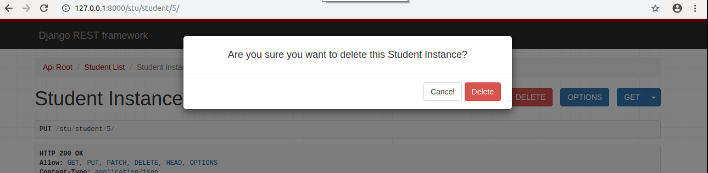

# 1. Web应用模式

在开发Web应用中，有两种应用模式：

1. 前后端不分离


2. 前后端分离


# 2. api接口

为了在团队内部形成共识、防止个人习惯差异引起的混乱，我们需要找到一种大家都觉得很好的接口实现规范，而且这种规范能够让后端写的接口，用途一目了然，减少双方之间的合作成本。

目前市面上大部分公司开发人员使用的接口服务架构主要有：restful、rpc。


rpc: 翻译成中文:远程过程调用[远程服务调用].

http://www.lufei.com/api

post请求

action=get_all_student&params=301&sex=1


接口多了,对应函数名和参数就多了,前端在请求api接口时,就会比较难找.容易出现重复的接口


restful: 翻译成中文: 资源状态转换.

把后端所有的数据/文件都看成资源. 

那么接口请求数据,本质上来说就是对资源的操作了.

web项目中操作资源,无非就是增删查改.所以要求在地址栏中声明要操作的资源是什么,然后通过http请求动词来说明对资源进行哪一种操作.

POST http://www.lufei.com/api/students/   添加学生数据

GET    http://www.lufei.com/api/students/   获取所有学生

DELETE http://www.lufei.com/api/students/<pk>   删除1个学生 


# 3. RESTful API规范


REST全称是Representational State Transfer，中文意思是表述（编者注：通常译为表征）性状态转移。 它首次出现在2000年Roy Fielding的博士论文中。

RESTful是一种定义Web API接口的设计风格，尤其适用于前后端分离的应用模式中。

这种风格的理念认为后端开发任务就是提供数据的，对外提供的是数据资源的访问接口，所以在定义接口时，客户端访问的URL路径就表示这种要操作的数据资源。

而对于数据资源分别使用POST、DELETE、GET、UPDATE等请求动作来表达对数据的增删查改。

| 请求方法 | 请求地址       | 后端操作           |
| -------- | -------------- | ------------------ |
| GET      | /students      | 获取所有学生       |
| POST     | /students      | 增加学生           |
| GET      | /students/<pk> | 获取编号为pk的学生 |
| PUT      | /students/<pk> | 修改编号为pk的学生 |
| DELETE   | /students/<pk> | 删除编号为pk的学生 |


事实上，我们可以使用任何一个框架都可以实现符合restful规范的API接口。

参考文档：http://www.runoob.com/w3cnote/restful-architecture.html


# 4. 序列化

api接口开发，最核心最常见的一个过程就是序列化，所谓序列化就是把**数据转换格式**，序列化可以分两个阶段：

**序列化**： 把我们识别的数据转换成指定的格式提供给别人。

例如：我们在django中获取到的数据默认是模型对象，但是模型对象数据无法直接提供给前端或别的平台使用，所以我们需要把数据进行序列化，变成字符串或者json数据，提供给别人。

**反序列化**：把别人提供的数据转换/还原成我们需要的格式。

例如：前端js提供过来的json数据，对于python而言就是字符串，我们需要进行反序列化换成模型类对象，这样我们才能把数据保存到数据库中。


# 5. Django Rest_Framework

核心思想: 缩减编写api接口的代 -- DRF

Django REST framework是一个建立在Django基础之上的Web 应用开发框架，可以快速的开发REST API接口应用。在REST framework中，提供了序列化器Serialzier的定义，可以帮助我们简化序列化与反序列化的过程，不仅如此，还提供丰富的类视图、扩展类、视图集来简化视图的编写工作。REST framework还提供了认证、权限、限流、过滤、分页、接口文档等功能支持。REST framework提供了一个API 的Web可视化界面来方便查看测试接口。


中文文档：https://q1mi.github.io/Django-REST-framework-documentation/#django-rest-framework

github: https://github.com/encode/django-rest-framework/tree/master

英文文档：https://www.django-rest-framework.org/

### 特点

- 提供了定义序列化器Serializer的方法，可以快速根据 Django ORM 或者其它库自动序列化/反序列化；
- 提供了丰富的类视图、Mixin扩展类，简化视图的编写；
- 丰富的定制层级：函数视图、类视图、视图集合到自动生成 API，满足各种需要；
- 多种身份认证和权限认证方式的支持；[jwt]
- 内置了限流系统；
- 直观的 API web 界面；
- 可扩展性，插件丰富


# 6. 环境安装与配置

DRF需要以下依赖：

- Python (2.7, 3.2, 3.3, 3.4, 3.5, 3.6,3.7)  本次安装3.7版本
- Django (1.10, 1.11, 2.2，3.2.25)

**DRF是以Django扩展应用的方式提供的，所以我们可以直接利用已有的Django环境而无需从新创建。（若没有Django环境，需要先创建环境安装Django）**


## 6.1 安装DRF

前提是已经安装了django，建议安装在虚拟环境

```python
# pip config set global.index-url https://mirrors.aliyun.com/pypi/simple/
# pip install virtualenvwrapper-win
# mkvirtualenv drfdemo -p python3
# pip install django

pip install djangorestframework
pip install pymysql
```


### 6.1.1 创建django项目

```
cd ~/Desktop
django-admin startproject drfdemo

(drfdemo) ...\drfdemo>django-admin startapp students  #创建app
```


使用pycharm打开项目，设置虚拟环境的解析器，并修改manage.py中的后缀参数。


## 6.2 添加rest_framework应用

在**settings.py**的**INSTALLED_APPS**中添加'rest_framework'。

```python
INSTALLED_APPS = [
    ...
    'students.apps.StudentsConfig',
    'rest_framework',
]
```

接下来就可以使用DRF提供的功能进行api接口开发了。在项目中如果使用rest_framework框架实现API接口，主要有以下三个步骤：

- 将请求的数据（如JSON格式）转换为模型类对象
- 操作数据库
- 将模型类对象转换为响应的数据（如JSON格式）


接下来，我们快速体验下四天后我们学习完成drf以后的开发代码。接下来代码不需要理解，看步骤。

## 6.3 体验drf完全简写代码的过程


### 6.3.1. 创建模型操作类

```python
class Student(models.Model):
    # 模型字段
    name = models.CharField(max_length=100,verbose_name="姓名",help_text='提示文本：不能为空')
    sex = models.BooleanField(default=1,verbose_name="性别")
    age = models.IntegerField(verbose_name="年龄")
    class_null = models.CharField(max_length=5,verbose_name="班级编号")
    description = models.TextField(max_length=1000,verbose_name="个性签名")

    class Meta:
        db_table="tb_student"
        verbose_name = "学生"
        verbose_name_plural = verbose_name
```

为了方便测试，所以我们可以先创建一个数据库。

```
create database students charset=utf8;
```


#### 6.3.1.1 执行数据迁移

把students子应用添加到INSTALL_APPS中


初始化数据库连接

```
安装pymysql
pip install pymysql
```

主引用中`__init__.py`设置使用pymysql作为数据库驱动

```python
import pymysql

pymysql.install_as_MySQLdb()
```


settings.py配置文件中设置mysql的账号密码

```python
DATABASES = {
    # 'default': {
    #     'ENGINE': 'django.db.backends.sqlite3',
    #     'NAME': os.path.join(BASE_DIR, 'db.sqlite3'),
    # },
    'default': {
        'ENGINE': 'django.db.backends.mysql',
        'NAME': "students",
        "HOST": "127.0.0.1",
        "PORT": 3306,
        "USER": "root",
        "PASSWORD":"123",
    }
}
```


```python

```

终端下，执行数据迁移。

```
python manage.py makemigrations
python manage.py migrate
```

 

错误列表

```python
# 执行数据迁移 python manage.py makemigrations 报错如下：
```


解决方案：

```python
注释掉 python/site-packages/django/backends/mysql/base.py中的35和36行代码。
```


```python
# 执行数据迁移发生以下错误：
```


解决方法：

backends/mysql/operations.py146行里面新增一个行代码：


### 6.3.2. 创建序列化器

例如，在django项目中创建学生子应用。  #这个students 已经创建过

```python
python manage.py startapp students
```

在students应用目录中新建serializers.py用于保存该应用的序列化器。

创建一个StudentModelSerializer用于序列化与反序列化。

```python
from rest_framework import serializers
from students import models

# 创建序列化器类，回头会在试图中被调用
class StudentModelSerializer(serializers.ModelSerializer):
    class Meta:
        model = models.Student
        fields = "__all__"
```

- **model** 指明该序列化器处理的数据字段从模型类Student参考生成
- **fields** 指明该序列化器包含模型类中的哪些字段，'__all__'指明包含所有字段


### 6.3.3. 编写视图

在students应用的views.py中创建视图StudentViewSet，这是一个视图集合。

```python
from rest_framework.viewsets import ModelViewSet
from .models import Student
from .serializers import StudentModelSerializer
# Create your views here.
class StudentViewSet(ModelViewSet):
    queryset = Student.objects.all() 
    serializer_class = StudentModelSerializer
```

- **queryset** 指明该视图集在查询数据时使用的查询集
- **serializer_class** 指明该视图在进行序列化或反序列化时使用的序列化器

### 6.3.4. 定义路由

在students应用的urls.py中定义路由信息。

```python
from . import views
from rest_framework.routers import DefaultRouter

# 路由列表
urlpatterns = []

router = DefaultRouter()  # 可以处理视图的路由器，自动通过视图来生成增删改查的url路径
router.register('students', views.StudentViewSet)  #students是生成的url前缀，名称随便写， 向路由器中注册视图集

urlpatterns += router.urls  # 将路由器中的所以路由信息追到到django的路由列表中
```

最后把students子应用中的路由文件加载到总路由文件中.

```python
from django.contrib import admin
from django.urls import path,include

urlpatterns = [
    path('admin/', admin.site.urls),
    path("stu/",include("students.urls")),
]

```

 

### 6.3.5. 运行测试  

运行当前程序（与运行Django一样）

```shell
python manage.py runserver 127.0.0.1:8001
```

在浏览器中输入网址127.0.0.1:8000，可以看到DRF提供的API Web浏览页面：


1）点击链接127.0.0.1:8000/stu/students 可以访问**获取所有数据的接口**，呈现如下页面：


2）在页面底下表单部分填写学生信息，可以访问**添加新学生的接口**，保存学生信息：


点击POST后，返回如下页面信息：


3）在浏览器中输入网址127.0.0.1:8000/stu/students/5/，可以访问**获取单一学生信息的接口**（id为5的学生），呈现如下页面：


还可以直接输入127.0.0.1:8000/stu/students/5/?format=json获得json数据，不是页面了。


4）在页面底部表单中填写学生信息，可以访问**修改学生的接口**：


点击PUT，返回如下页面信息：


5）点击DELETE按钮，可以访问**删除学生的接口**：



返回，如下页面：


# 7. 序列化器-Serializer

作用：

    1. 序列化,序列化器会把模型对象转换成字典,经过response以后变成json字符串
    2. 反序列化,把客户端发送过来的数据,经过request以后变成字典,序列化器可以把字典转成模型
    3. 反序列化,完成数据校验功能


## 7.1 定义序列化器

Django REST framework中的Serializer使用类来定义，须继承自rest_framework.serializers.Serializer。

接下来，为了方便演示序列化器的使用，我们先创建一个新的子应用sers

```
python manage.py startapp sers
```


我们已有了一个数据库模型类students/Student

```python
from django.db import models

# Create your models here.
class Student(models.Model):
    # 模型字段
    name = models.CharField(max_length=100,verbose_name="姓名",help_text="提示文本:账号不能为空！")
    sex = models.BooleanField(default=True,verbose_name="性别")
    age = models.IntegerField(verbose_name="年龄")
    class_null = models.CharField(max_length=5,verbose_name="班级编号")
    description = models.TextField(verbose_name="个性签名")

    class Meta:
        db_table="tb_student"
        verbose_name = "学生"
        verbose_name_plural = verbose_name
```

我们想为这个模型类提供一个序列化器，sers/serializers.py 可以定义如下：

```python
from rest_framework import serializers

# 声明序列化器，所有的序列化器都要直接或者间接继承于 Serializer
# 其中，ModelSerializer是Serializer的子类，ModelSerializer在Serializer的基础上进行了代码简化
class StudentSerializer(serializers.Serializer):
    """学生信息序列化器"""
    # 1. 需要进行数据转换的字段
    id = serializers.IntegerField()
    name = serializers.CharField()
    age = serializers.IntegerField()
    sex = serializers.BooleanField()
    description = serializers.CharField()

    # 2. 如果序列化器集成的是ModelSerializer，则需要声明调用的模型信息

    # 3. 验证提交的数据的代码

    # 4. 编写添加和更新模型的代码
```

**注意：serializer不是只能为数据库模型类定义，也可以为非数据库模型类的数据定义。**serializer是独立于数据库之外的存在。


**常用字段类型**：

| 字段                    | 字段构造方式                                                 |
| ----------------------- | ------------------------------------------------------------ |
| **BooleanField**        | BooleanField()                                               |
| **NullBooleanField**    | NullBooleanField()                                           |
| **CharField**           | CharField(max_length=None, min_length=None, allow_blank=False, trim_whitespace=True) |
| **EmailField**          | EmailField(max_length=None, min_length=None, allow_blank=False) |
| **RegexField**          | RegexField(regex, max_length=None, min_length=None, allow_blank=False) |
| **SlugField**           | SlugField(max*length=50, min_length=None, allow_blank=False) 正则字段，验证正则模式 [a-zA-Z0-9*-]+ |
| **URLField**            | URLField(max_length=200, min_length=None, allow_blank=False) |
| **UUIDField**           | UUIDField(format='hex_verbose')  format:  1) `'hex_verbose'` 如`"5ce0e9a5-5ffa-654b-cee0-1238041fb31a"`  2） `'hex'` 如 `"5ce0e9a55ffa654bcee01238041fb31a"`  3）`'int'` - 如: `"123456789012312313134124512351145145114"`  4）`'urn'` 如: `"urn:uuid:5ce0e9a5-5ffa-654b-cee0-1238041fb31a"`  微软时间戳，通过微秒生成一个随机字符串 |
| **IPAddressField**      | IPAddressField(protocol='both', unpack_ipv4=False, **options) |
| **IntegerField**        | IntegerField(max_value=None, min_value=None)                 |
| **FloatField**          | FloatField(max_value=None, min_value=None)                   |
| **DecimalField**        | DecimalField(max_digits, decimal_places, coerce_to_string=None, max_value=None, min_value=None) max_digits: 最多位数 decimal_palces: 小数点位置 |
| **DateTimeField**       | DateTimeField(format=api_settings.DATETIME_FORMAT, input_formats=None) |
| **DateField**           | DateField(format=api_settings.DATE_FORMAT, input_formats=None) |
| **TimeField**           | TimeField(format=api_settings.TIME_FORMAT, input_formats=None) |
| **DurationField**       | DurationField()                                              |
| **ChoiceField**         | ChoiceField(choices) choices与Django的用法相同               |
| **MultipleChoiceField** | MultipleChoiceField(choices)                                 |
| **FileField**           | FileField(max_length=None, allow_empty_file=False, use_url=UPLOADED_FILES_USE_URL) |
| **ImageField**          | ImageField(max_length=None, allow_empty_file=False, use_url=UPLOADED_FILES_USE_URL) |
| **ListField**           | ListField(child=, min_length=None, max_length=None)          |
| **DictField**           | DictField(child=)                                            |

**选项参数：**

| 参数名称            | 作用             |
| ------------------- | ---------------- |
| **max_length**      | 最大长度         |
| **min_length        | 最小长度         |
| **allow_blank**     | 是否允许为空     |
| **trim_whitespace** | 是否截断空白字符 |
| **max_value**       | 最大值           |
| **min_value**       | 最小值           |

通用参数：

| 参数名称           | 说明                                          |
| ------------------ | --------------------------------------------- |
| **read_only**      | 表明该字段仅用于序列化输出，默认False         |
| **write_only**     | 表明该字段仅用于反序列化输入，默认False       |
| **required**       | 表明该字段在反序列化时必须输入，默认True      |
| **default**        | 反序列化时使用的默认值                        |
| **allow_null**     | 表明该字段是否允许传入None，默认False         |
| **validators**     | 该字段使用的验证器                            |
| **error_messages** | 包含错误编号与错误信息的字典                  |
| **label**          | 用于HTML展示API页面时，显示的字段名称         |
| **help_text**      | 用于HTML展示API页面时，显示的字段帮助提示信息 |


## 7.2 创建Serializer对象

定义好Serializer类后，就可以创建Serializer对象了。

Serializer的构造方法为：

```python
Serializer(instance=None, data=empty, **kwarg)
```

说明：

1）用于序列化时，将模型类对象传入**instance**参数

2）用于反序列化时，将要被反序列化的数据传入**data**参数

3）除了instance和data参数外，在构造Serializer对象时，还可通过**context**参数额外添加数据，如

```python
serializer = AccountSerializer(account, context={'request': request})
```

**通过context参数附加的数据，可以通过Serializer对象的context属性获取。**


1. 使用序列化器的时候一定要注意，序列化器声明了以后，不会自动执行，需要我们在视图中进行调用才可以。
2. 序列化器无法直接接收数据，需要我们在视图中创建序列化器对象时把使用的数据传递过来。
3. 序列化器的字段声明类似于我们前面使用过的表单系统。
4. 开发restful api时，序列化器会帮我们把模型数据转换成字典.
5. drf提供的视图会帮我们把字典转换成json,或者把客户端发送过来的数据转换字典.


## 7.3 序列化器的使用

序列化器的使用分两个阶段：

1. 在客户端请求时，使用序列化器可以完成对数据的反序列化。
2. 在服务器响应时，使用序列化器可以完成对数据的序列化。


### 7.3.1 序列化

#### 7.3.1.1 基本使用

1） 先查询出一个学生对象

```python
from students.models import Student

student = Student.objects.get(id=3)
```

2） 构造序列化器对象

```python
from .serializers import StudentSerializer

serializer = StudentSerializer(instance=student)  -- {}
```

3）获取序列化数据

通过data属性可以获取序列化后的数据

```python
serializer.data
# {'id': 4, 'name': '小张', 'age': 18, 'sex': True, 'description': '猴赛雷'}
```

完整视图代码：sers/views.py

```python
from django.views import View
from students.models import Student
from .serializers import StudentSerializer
from django.http.response import JsonResponse
class StudentView(View):
    """使用序列化器序列化转换单个模型数据"""
    def get(self,request,pk):
        # 获取数据
        student = Student.objects.get(pk=pk)
        # 数据转换[序列化过程]
        serializer = StudentSerializer(instance=student)
        print(serializer.data)
        # 响应数据
        return JsonResponse(serializer.data)
```

小记录： 这里url 访问报错   http://127.0.0.1:8000/ser/students/?pk=1  报错 get() missing 1 required positional argument: 'pk'


4）如果要被序列化的是包含多条数据的查询集QuerySet，可以通过添加**many=True**参数补充说明

```python
    """使用序列化器序列化转换多个模型数据"""
    def get(self,request):
        # 获取数据
        student_list = Student.objects.all()
				
        # 转换数据[序列化过程]
        # 如果转换多个模型对象数据，则需要加上many=True
        serializer = StudentSerializer(instance=student_list,many=True)
        print( serializer.data ) # 序列化器转换后的数据

        # 响应数据给客户端
        # 返回的json数据，如果是列表，则需要声明safe=False
        return JsonResponse(serializer.data,safe=False,json_dumps_params={'ensure_ascii':False})
    
    
    # 访问结果：
    # [OrderedDict([('id', 1), ('name', 'xiaoming'), ('age', 20), ('sex', True), ('description', '测试')]), OrderedDict([('id', 2), ('name', 'xiaohui'), ('age', 22), ('sex', True), ('description', '后面来的测试')]), OrderedDict([('id', 4), ('name', '小张'), ('age', 18), ('sex', True), ('description', '猴赛雷')])]

```

在ser应用中创建Urls.py

```python
from django.urls import path
from . import views

urlpatterns = [
    path(r'students/',views.StudentView.as_view()),
]


```

别忘了在总路由中include一下

```python
from django.contrib import admin
from django.urls import path,include,re_path

urlpatterns = [
    path('admin/', admin.site.urls),
    path('stu/',include('students.urls')),
    path('ser/',include('sers.urls')),
]

```


