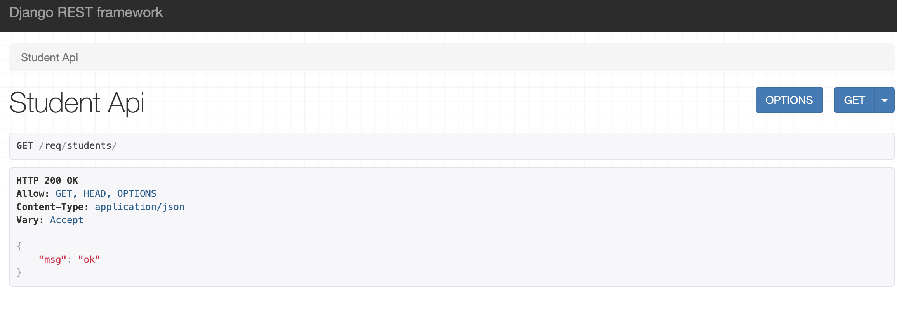
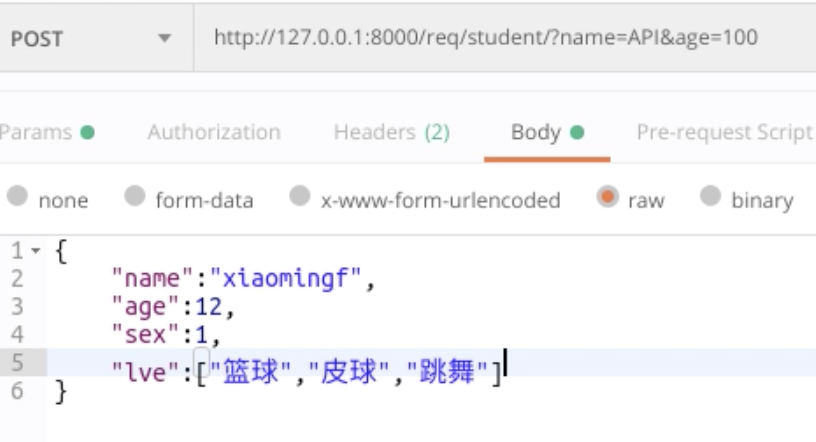
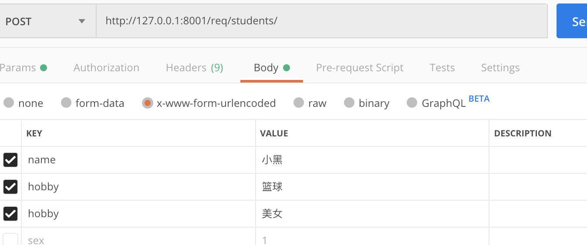

[TOC]

# 1. 视图

drf除了在数据序列化部分简写代码以外，还在视图中提供了简写操作。所以在django原有的django.views.View类基础上，drf封装了多个子类出来提供给我们使用。

Django REST framwork 提供的视图的主要作用：

- 控制序列化器的执行（检验、保存、转换数据）
- 控制数据库查询的执行
- 调用请求类和响应类[这两个类也是由drf帮我们再次扩展了一些功能类。]


为了方便我们学习，所以先创建一个子应用req

```python
python manage.py startapp req

#新创建的应用在setting.py
INSTALLED_APPS = [
	....
    'req', #添加
]
```


### APIView视图简单使用

view.py

```python
from django.shortcuts import HttpResponse
from django.views import View

from rest_framework.views import APIView
from rest_framework.response import Response

"""drf提供的请求和响应类只能在drf封装过的子视图类中使用，也就是说不能再django.view.View中使用
    只要类视图直接或者间接继承了APIView，则视图方法中使用的request，就是rest_framework.request.Request，
    同时，只有在APIVIew的子视图类中才可以使用rest_framework.respone.Response
"""
class StudentAPIView(APIView):
# class StudentAPIView(View):  #之前的写法
    def get(self,request):
        print(request)
        #<rest_framework.request.Request object at 0x11d733e90>
        return Response({'msg':'ok'})
        # return HttpResponse('ok') #之前的写法 没法回复字典类型
```

urls.py

```python
from django.urls import path
from . import views
urlpatterns = [
    path(r'students/',views.StudentAPIView.as_view()),

]
```

总路由中：

```python
from django.contrib import admin
from django.urls import path,include

urlpatterns = [
    ...
    path('req/',include('req.urls')),
]
```

然后我们启动项目，访问地址看到如下效果：




## 1.1. 请求与响应

### 1.1.1 Request

REST framework 传入视图的request对象不再是Django默认的HttpRequest对象，而是REST framework提供的扩展了HttpRequest类的**Request**类的对象。

REST framework 提供了**Parser**解析器，在接收到请求后会自动根据Content-Type指明的请求数据类型（如JSON、表单等）将请求数据进行parse解析，解析为类字典[QueryDict]对象保存到**Request**对象中。这里我们可以自行写一个接口测试一下django原来的模式是解析不了json数据的，drf可以解析。但是需要注意的是：客户端如果传递过来的是json数据，那么request.data获取到的字典类型数据，不是querydict类型，也就没有了getlist方法，多选的数据，通过get就能取出来。



**Request对象的数据是自动根据前端发送数据的格式进行解析之后的结果。**

无论前端发送的哪种格式的数据，我们都可以以统一的方式读取数据。

#### 1.1.1.1 常用属性

##### 1）.data

`request.data` 返回解析之后的请求体数据。类似于Django中标准的`request.POST`和 `request.FILES`属性，但提供如下特性：

- 包含了解析之后的文件和非文件数据
- 包含了对POST、PUT、PATCH请求方式解析后的数据
- 利用了REST framework的parsers解析器，不仅支持表单类型数据(urlencoded,form-data)，也支持JSON数据(application/json)

##### 2）.query_params

`request.query_params`与Django标准的`request.GET`相同，只是更换了更正确的名称而已。


看示例：

```python
from django.shortcuts import render

from rest_framework.views import APIView
from rest_framework.response import Response

class StudentAPIView(APIView):
    def get(self,request):
        print(request)

        #获取url中的请求参数
        #当我们访问http://127.0.0.1:8001/req/students/?age=100
        print(request.query_params) # <QueryDict: {'age': ['100']}>
        return Response({'msg': 'ok'})

    def post(self,request):
        # 获取post请求体中的数据  
        print(request.data)   #drf能够解析json格式的数据  格式普通字典类型 {'xxx': '1'}，getlist方法用不了
        print(request.data.get('hobby'))
        print(request.data.getlist('hobby')) #获取多选数据，当发送数据类型json，就不能用getlist了
        '''
        结果：
            <QueryDict: {'name': ['小黑'], 'hobby': ['篮球', '美女']}>
            美女
            ['篮球', '美女']
        '''
        return Response({'msg':'ok'})

```

上面示例中的hobby数据通过postman可以这样写：




### 1.1.2 Response

```
rest_framework.response.Response
#其实就是对我们django的HTTPResponse进行了封装，加了一些其他的功能
```

REST framework提供了一个响应类`Response`，使用该类构造响应对象时，响应的具体数据内容会被转换（render渲染）成符合前端需求的类型。

我们后端如果通过Response来想用数据时，通过postman发送get请求获取数据，你会发现得到的是纯json数据，但是通过浏览器访问时会的到一个页面。这是为什么呢？drf的APIView在响应内容的时候会自动通过请求头中的浏览器信息来进行数据的回复(Response)，如果是浏览器，那么返回的就是个页面(当然我们也可以不让他返回页面，可设置的，后面说）如果不是浏览器，给你返回的就是纯json数据。这是由drf中配置的两个不同的响应类产生的效果，看下面的配置。


REST framework提供了`Renderer` 渲染器，用来根据请求头中的`Accept`（客户端希望接收的数据类型声明）来自动转换响应数据到对应格式。如果前端请求中未进行Accept声明，则会采用默认方式处理响应数据，我们可以通过配置来修改默认响应格式。

```python
REST_FRAMEWORK = {
    'DEFAULT_RENDERER_CLASSES': (  # 默认响应渲染类
        'rest_framework.renderers.JSONRenderer',  # json渲染器
        'rest_framework.renderers.BrowsableAPIRenderer',  # 浏览器API渲染器
    )
}

#通过from rest_framework import settings查看一下settings文件，可以找到这个默认配置
# 在项目的 drfdemo/settings.py 文件里 可以配置指定drf默认响应渲染器
```

#### 1.1.2.1 构造方式

```python
Response(data, status=None, template_name=None, headers=None, content_type=None)
```

`data`数据不要是render处理之后的数据，只需传递python的内建类型数据即可，REST framework会使用`renderer`渲染器处理`data`。

`data`不能是复杂结构的数据，如Django的模型类对象，对于这样的数据我们可以使用`Serializer`序列化器序列化处理后（转为了Python字典类型）再传递给`data`参数。

参数说明：

- `data`: 为响应准备的序列化处理后的数据；

- `status`: 状态码，默认200；

  ```
  return Response({'msg': 'ok'},status=204) #直接写数字形式的
  204等等这些数字代表什么，其实在drf中有文本形式的写法，在下面的文件中可以看到
  from rest_framework import status  #点击查看status就能看到了
  return Response({'msg': 'ok'},status=status.HTTP_204_NO_CONTENT) #这样写也可以,文本形式的
  ```

  

- `template_name`: 模板名称，如果使用`HTMLRenderer` 时需指明；就是有些人觉得Response返回的那个页面丑，那么就可以通过这个模板自行定制。

- `headers`: 用于存放响应头信息的字典；比如放一些cookie啊或者一些自定制的响应头啊都可以，例如：return Response({'msg': 'ok'},status=204,headers={'xx':'oo'})

- `content_type`: 响应数据的Content-Type，通常此参数无需传递，REST framework会根据前端所需类型数据(accept请求头)来设置该参数。

#### 1.1.2.2 常用属性（基本用不到）

##### 1）.data

传给response对象的序列化后，但尚未render处理的数据

##### 2）.status_code

状态码的数字

##### 3）.content

经过render处理后的响应数据


#### 1.1.2.3 状态码

为了方便设置状态码，REST framewrok在`rest_framework.status`模块中提供了常用状态码常量。

##### 1）信息告知 - 1xx

```python
HTTP_100_CONTINUE
HTTP_101_SWITCHING_PROTOCOLS #一般直接通过socket建立连接会看到101
```

##### 2）成功 - 2xx

```python
HTTP_200_OK
HTTP_201_CREATED
HTTP_202_ACCEPTED
HTTP_203_NON_AUTHORITATIVE_INFORMATION
HTTP_204_NO_CONTENT
HTTP_205_RESET_CONTENT
HTTP_206_PARTIAL_CONTENT
HTTP_207_MULTI_STATUS
```

##### 3）重定向 - 3xx

```python
HTTP_300_MULTIPLE_CHOICES
HTTP_301_MOVED_PERMANENTLY
HTTP_302_FOUND
HTTP_303_SEE_OTHER
HTTP_304_NOT_MODIFIED
HTTP_305_USE_PROXY
HTTP_306_RESERVED
HTTP_307_TEMPORARY_REDIRECT
```

##### 4）客户端错误 - 4xx

```python
HTTP_400_BAD_REQUEST
HTTP_401_UNAUTHORIZED
HTTP_402_PAYMENT_REQUIRED
HTTP_403_FORBIDDEN
HTTP_404_NOT_FOUND
HTTP_405_METHOD_NOT_ALLOWED
HTTP_406_NOT_ACCEPTABLE
HTTP_407_PROXY_AUTHENTICATION_REQUIRED
HTTP_408_REQUEST_TIMEOUT
HTTP_409_CONFLICT
HTTP_410_GONE
HTTP_411_LENGTH_REQUIRED
HTTP_412_PRECONDITION_FAILED
HTTP_413_REQUEST_ENTITY_TOO_LARGE
HTTP_414_REQUEST_URI_TOO_LONG
HTTP_415_UNSUPPORTED_MEDIA_TYPE
HTTP_416_REQUESTED_RANGE_NOT_SATISFIABLE
HTTP_417_EXPECTATION_FAILED
HTTP_422_UNPROCESSABLE_ENTITY
HTTP_423_LOCKED
HTTP_424_FAILED_DEPENDENCY
HTTP_428_PRECONDITION_REQUIRED
HTTP_429_TOO_MANY_REQUESTS
HTTP_431_REQUEST_HEADER_FIELDS_TOO_LARGE
HTTP_451_UNAVAILABLE_FOR_LEGAL_REASONS
```

##### 5）服务器错误 - 5xx

```python
HTTP_500_INTERNAL_SERVER_ERROR
HTTP_501_NOT_IMPLEMENTED
HTTP_502_BAD_GATEWAY
HTTP_503_SERVICE_UNAVAILABLE
HTTP_504_GATEWAY_TIMEOUT
HTTP_505_HTTP_VERSION_NOT_SUPPORTED
HTTP_507_INSUFFICIENT_STORAGE
HTTP_511_NETWORK_AUTHENTICATION_REQUIRED
```


## 1.2 视图

REST framework 提供了众多的通用视图基类与扩展类，以简化视图的编写。


### 1.2.1 2个视图基类

#### 1.2.1.1 APIView

```
rest_framework.views.APIView
```

`APIView`是REST framework提供的所有视图的基类，继承自Django的`View`父类。

`APIView`与`View`的不同之处在于：

- 传入到视图方法中的是REST framework的`Request`对象，而不是Django的`HttpRequeset`对象；
- 视图方法可以返回REST framework的`Response`对象，视图会为响应数据设置（render）符合前端要求的格式；
- 任何`APIException`异常都会被捕获到，并且处理成合适的响应信息；
- 在进行dispatch()分发前，会对请求进行身份认证、权限检查、流量控制。

支持定义的属性

- **authentication_classes** 列表或元祖，身份认证类
- **permissoin_classes** 列表或元祖，权限检查类
- **throttle_classes** 列表或元祖，流量控制类

在`APIView`中仍以常规的类视图定义方法来实现get() 、post() 或者其他请求方式的方法。

举例：

```python
from rest_framework.views import APIView
from rest_framework.response import Response

# url(r'^books/$', views.BookListView.as_view()),
class BookListView(APIView):
    def get(self, request):
        books = BookInfo.objects.all()
        serializer = BookInfoSerializer(books, many=True)
        return Response(serializer.data)
```

