# 6. Vue自动化工具（Vue-cli）

## 6.4 使用Vue-CLI初始化创建项目

### 6.4.1 生成项目目录

使用vue自动化工具可以快速搭建单页应用项目目录。

该工具为现代化的前端开发工作流提供了开箱即用的构建配置。只需几分钟即可创建并启动一个带热重载、保存时静态检查以及可用于生产环境的构建配置的项目：

```
// 生成一个基于 webpack 模板的新项目
vue init webpack 项目名

例如：
vue init webpack myproject


// 启动开发服务器 ctrl+c 停止服务
cd myproject
npm run dev           # 运行这个命令就可以启动node提供的测试http服务器
```

运行了上面代码以后,终端下会出现以下效果提示：

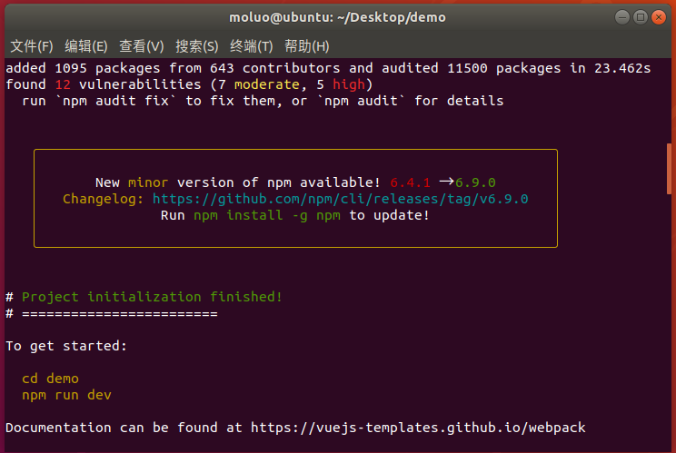

那么访问：http://localhost:8080/

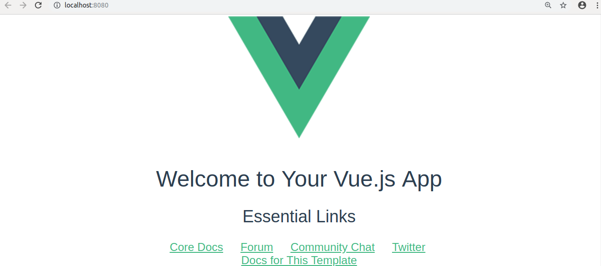


### 6.4.2 项目目录结构

```bash
├── build/
├── config/
├── index.html
├── node_modules/    # 项目运行的依赖库存储目录[非常大]
├── package.json     # 项目运行需要的依赖库记录配置
├── src/
│   ├── App.vue      # 父级组件
│   ├── assets/      # 静态资源目录，图片存放在这里
│   ├── components/  # 单文件组件保存目录
│   └── main.js
└── static/          # 静态资源目录，所有的测试时用的，但是不需要交给线上服务器的css,js等文件放在这个目录
```

src   主开发目录，要开发的单文件组件全部在这个目录下的components目录下

static 静态资源目录，所有的css，js文件放在这个文件夹

dist 项目打包发布文件夹，最后要上线单文件项目文件都在这个文件夹中[后面打包项目,让项目中的vue组件经过编译变成js 代码以后,dist就出现了]

node_modules目录是node的包目录，

config是配置目录，id和端口等等

build是项目打包时依赖的目录

src/router   路由,后面需要我们在使用Router路由的时候,自己声明.


### 6.4.3 项目执行流程图

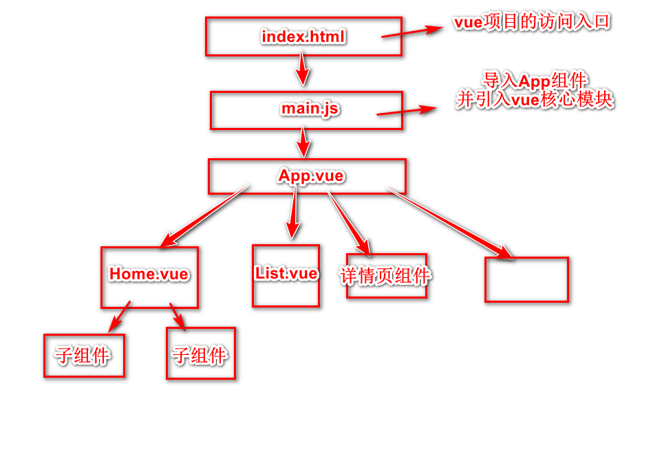

整个项目是一个访问入口文件index.html,index.html中会引入src文件夹中的main.js,main.js中会导入顶级单文件组件App.vue,App.vue中会通过组件嵌套或者路由来引用components文件夹中的其他单文件组件。

Main.js

```javascript
// The Vue build version to load with the `import` command
// (runtime-only or standalone) has been set in webpack.base.conf with an alias.
import Vue from 'vue'
import App from './App'

Vue.config.productionTip = false

// 上面这个配置的意思是阻止显示生产模式的消息。
// 如果没有这行代码，或者设置为true，控制台就会多出这么一段代码。
//
// You are running Vue in development mode.
// Make sure to turn on production mode when deploying for production.
//
// 大概意思就是：
// 你运行的Vu是开发模式。为生产部署时，请确保启用生产模式。


/* eslint-disable no-new */
new Vue({
  el: '#app',
  components: { App },
  template: '<App/>'
})

```


## 7. 单文件组件的使用

组件有两种：普通组件、单文件组件

普通组件的缺点：

1. html代码是作为js的字符串进行编写，所以组装和开发的时候不易理解，而且没有高亮效果。
2. 普通组件用在小项目中非常合适，但是复杂的大项目中，如果把更多的组件放在html文件中，那么维护成本就会变得非常昂贵。
3. 普通组件只是整合了js和html，但是css代码被剥离出去了。使用的时候的时候不好处理。


将一个组件相关的html结构，css样式，以及交互的JavaScript代码从html文件中剥离出来，合成一个文件，这种文件就是单文件组件，相当于一个组件具有了结构、表现和行为的完整功能，方便组件之间随意组合以及组件的重用，这种文件的扩展名为“.vue”，比如："Home.vue"。

1. #### 创建组件


在组件中编辑三个标签，编写视图template、vm对象script标签和css样式代码style。

### 7.1 template 编写html代码的地方

```vue
<template>
  <div id="Home"> <!-- 外层必须用一个标签包裹，不然会编译失败 -->
    <Header/>  
    <div class="main">
      页面主题内容
    </div>
    <div class="footer">
      页面脚步内容
    </div>
  </div>
</template>
```

### 7.2 script编写vue.js代码

```vue
<script>
  import Header from "./common/Header"
  export default {
    name:"Home", // 组件名称，用于以后路由跳转
    data(){      // 当前组件中需要使用的数据
      return {

      }
    },
    components:{
      Header,
    }
  }

</script>
```

### 7.3 style编写当前组件的样式代码

```vue
// scoped 表示当前style的样式只作用于当前组件的template代码中，其他地方不会被影响
<style scoped>
  .header{
    height: 100px;
    line-height: 100px;
    background-color: #eee;
    text-align: center;
  }
</style>
```


#### 7.3.1 在Home.vue中引入子组件

创建保存子组件的目录common

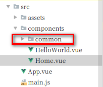

在common目录下创建Header.vue

把Home.vue的style标签的头部样式放置到Header.vue

```vue
<template>
    <div id="Header" class="header">
      页面头部
    </div>
</template>

<script>
  export default {
    name:"Header", // 组件名称，用于以后路由跳转
    data(){      // 当前组件中需要使用的数据
      return {

      }
    }
  }

</script>

// scoped 表示当前style的样式只作用于当前组件的template代码中，其他地方不会被影响
<style scoped>
  .header{
    height: 100px;
    line-height: 100px;
    background-color: #eee;
    text-align: center;
  }
</style>
```


### 7.4  完成案例-点击加减数字

在Home.vue的主体部分里面直接编写代码了

```vue
<template>
  <div id="Home">
    <Header/>
    <div class="main">
      <p>加减数字的功能</p>
      <div class="box">
        <button @click="num++">+</button>
        <input type="text" v-model="num">
        <button @click="num--">-</button>
      </div>
    </div>
    <div class="footer">
      页面脚步内容
    </div>
  </div>
</template>

<script>
  import Header from "./common/Header"
  export default {
    name:"Home", // 组件名称，用于以后路由跳转
    data(){      // 当前组件中需要使用的数据
      return {
        num:0,
      }
    },
    components:{
      Header,
    }
  }

</script>

// scoped 表示当前style的样式只作用于当前组件的template代码中，其他地方不会被影响
<style scoped>
  .header{
    height: 100px;
    line-height: 100px;
    background-color: #eee;
    text-align: center;
  }
</style>
```

效果：

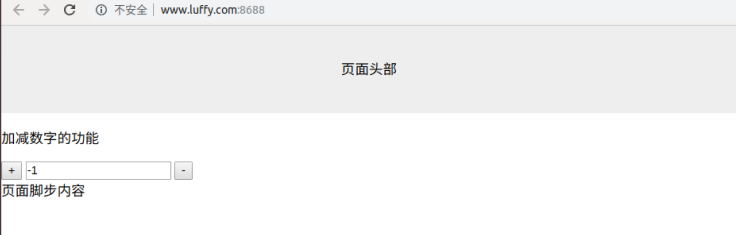


### 7.4 组件的嵌套

有时候开发vue项目时,页面也可以算是一个大组件,同时页面也可以分成多个子组件.

因为,产生了父组件调用子组件的情况.

例如,我们可以声明一个组件,作为父组件

在components/创建一个保存子组件的目录HomeSon

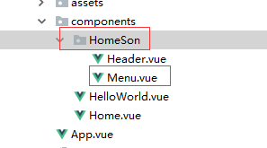

在HomeSon目录下,可以创建当前页面的子组件,例如,是Menu.vue

```vue
//  组件中代码必须写在同一个标签中
<template>
    <div id="menu">
      <span>{{msg}}</span>
      <div>hello</div>
  </div>
</template>

<script>
  export default {
    name:"Menu",
    data: function(){
      return {
        msg:"这是Menu组件里面的菜单",
      }
    }
  }
</script>

```

然后，在父组件中调用上面声明的子组件。

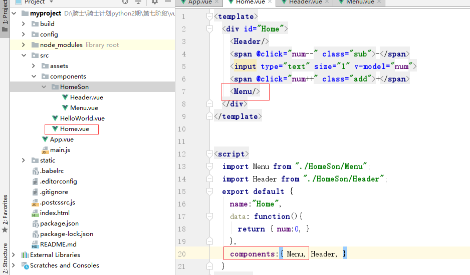

最后,父组件被App.vue调用.就可以看到页面效果.

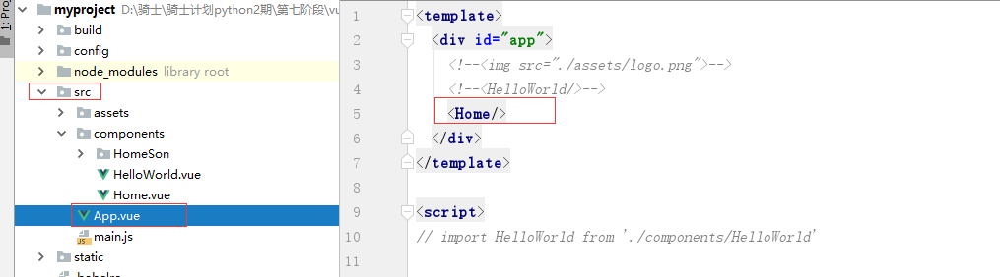

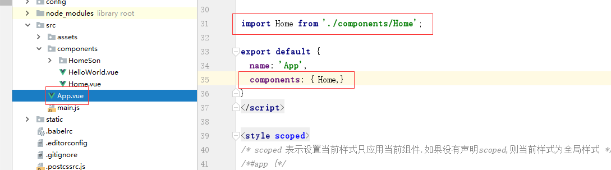


效果:

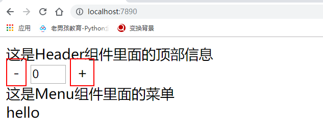


### 7.5 传递数据

例如,我们希望把父组件Home.vue的数据传递给子组件，例如Header.vue.

可以通过props属性来进行传递.

传递数据三个步骤：

1. 在父组件中，调用子组件的组名处，使用属性值的方式往下传递数据

   ```vue
   <Menu :mynum="num" title="home里面写的数据"/>
   
   # 上面表示在父组件调用Menu子组件的时候传递了2个数据：
     如果要传递变量[变量可以各种类型的数据]，属性名左边必须加上冒号:，同时，属性名是自定义的，会在子组件中使用。
     如果要传递普通字符串数据，则不需要加上冒号:
   ```

2. 在子组件中接受上面父组件传递的数据，需要在vm组件对象中，使用props属性类接受。

   ```vue
   <script>
     export default {
       name:"Menu",
       props:["mynum","title"],
       data: function(){
         return {
           msg:"这是Menu组件里面的菜单",
         }
       }
     }
   </script>
   
   // 上面 props属性中表示接受了两个数据。
   ```

3. 在子组件中的template中使用父组件传递过来的数据.

   ```vue
   <template>
       <div id="menu">
         <span>{{msg}}，{{title}}</span>
         <div>hello，{{mynum}}</div>
     </div>
   </template>
   ```


效果：

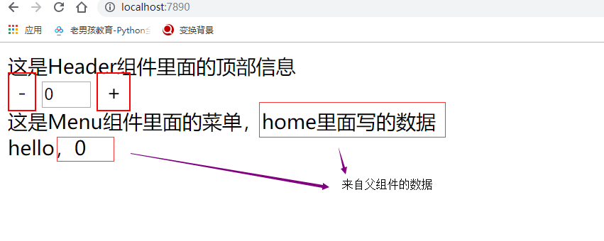

步骤流程:

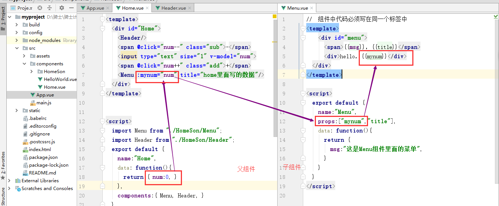


使用父组件传递数据给子组件时, 注意一下几点:

1. 传递数据是变量,则需要在属性左边<mark>添加冒号</mark>.

   传递数据是变量,这种数据称之为"动态数据传递"

   传递数据不是变量,而是数值或者字符串,这种数据称之为"静态数据传递"

2. 父组件中修改了数据,在子组件中会被同步修改,但是,子组件中的数据修改了,是不会影响到父组件中的数据.

   这种情况,在开发时,也被称为"单向数据流"


3. 事实上，我们如果要在子组件中把数据传递给父组件，也可以完成的。

   通过事件冒泡的方式，进行数据传递

   在vue中提供的this.$emit()方法进行给我们传递数据


## 8. 在组件中使用axios获取数据

默认情况下，我们的项目中并没有对axios包的支持，所以我们需要下载安装。

在项目根目录中使用 npm安装包在命令行下执行安装包的命令：

```
npm install axios
npm install axios@1.3.6
```

接着在main.js文件中，导入axios并把axios对象 挂载到vue属性中多为一个子对象，这样我们才能在组件中使用。

```javascript
// The Vue build version to load with the `import` command
// (runtime-only or standalone) has been set in webpack.base.conf with an alias.
import Vue from 'vue'
import App from './App' // 这里表示从别的目录下导入 单文件组件
import axios from 'axios'; // 从node_modules目录中导入包,直接写包名就行
Vue.config.productionTip = false

Vue.prototype.$axios = axios; // 把对象挂载vue中

/* eslint-disable no-new */
new Vue({
  el: '#app',
  components: { App },
  template: '<App/>'
});

```

#### 8.1 在组件中使用axios获取数据

代码编写在Heaer.vue子组件中

```vue
<template>
    <div id="Header" class="header">
      {{message}}
      <p>num: <input type="text" v-model="num"></p>
      <p>深圳的天气情况： {{weather_info}}</p>
    </div>
</template>

<script>
  export default {
    name:"Header", // 组件名称，用于以后路由跳转
    props:["num"],
    data(){      // 当前组件中需要使用的数据
      return {
        message:"页面头部",
        weather_info:"",
      }
    },
    // 钩子方法，在页面中vue挂在data数据以后，自动执行
    created() {
      // 使用axios发送请求获取数据
      this.$http.get("http://wthrcdn.etouch.cn/weather_mini?city=北京").then(response=>{
        console.log(response.data);
        console.log(response.data.data.ganmao);
        this.weather_info = response.data.data.ganmao;
      }).catch(error=>{

      });
    }

  }

</script>

// scoped 表示当前style的样式只作用于当前组件的template代码中，其他地方不会被影响
<style scoped>
  .header{
    height: 100px;
    line-height: 100px;
    background-color: #eee;
    text-align: center;
  }
</style>

```


使用的时候，因为本质上来说，我们还是原来的axios，所以也会收到同源策略的影响。

后面开发项目的时候，我们会使用cors来解决跨域的问题。

