# 路飞学城项目前端

[TOC]

# 笔记

# 1. 项目分析

```
首页
	导航、登录注册栏、轮播图、地板导航
登录注册
	选项卡
免费课
	课程分类、筛选、课程列表
免费课详情
	课程封面视频、优惠活动倒计时、选项卡
我的购物车
	全选、商品价格统计
购买结算
	
购买成功
	
我的订单
	
课程\课时播放页面
	
```


# 2. 项目搭建

## 2.1 创建项目目录

```
cd 项目目录
vue init webpack luffy
-----------------------------------------
C:\Users\kanghua\vueproject>vue init webpack luffy

'git' is not recognized as an internal or external command,
operable program or batch file.
? Project name luffy
? Project description A Vue.js project
? Author ckh
? Vue build standalone
? Install vue-router? Yes
? Use ESLint to lint your code? No
? Set up unit tests No
? Setup e2e tests with Nightwatch? No
? Should we run `npm install` for you after the project has been created? (recommended) npm
```

例如，我要把项目保存在桌面下 ~/Desktop/luffy ，可以如下操作：

```shell
cd Desktop
vue init webpack luffy
```

根据需要在生成项目时，我们选择对应的选项。

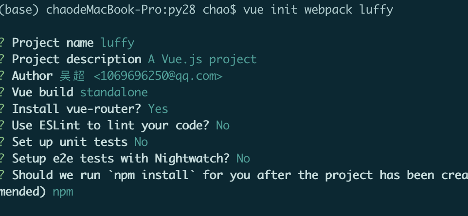

根据上面的提示，我们已经把vue项目构建好了，接下来我们可以在pycharm编辑器中把项目打开并根据上面黄色提示，运行测试服务器。

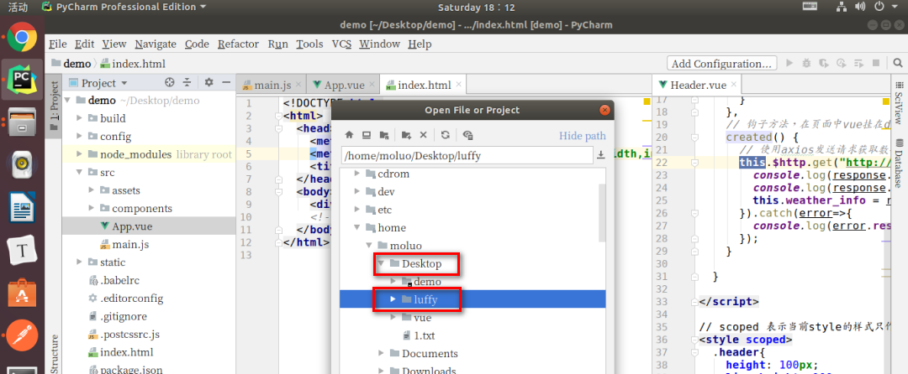

打开项目已经，在pycharm的终端下运行vue项目，查看效果。

```
npm run dev
```

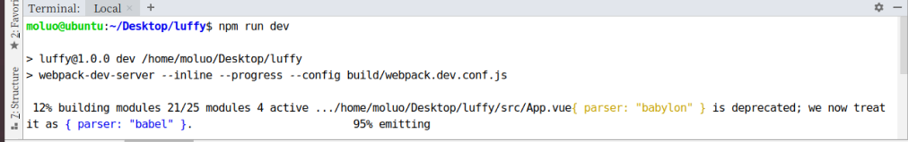

接下来，我们根据终端上效果显示的对应地址来访问项目(如果有多个vue项目在运行，8080端口被占据了，服务器会自动改端口，所以根据自己实际在操作中看到的地址来访问。)

访问：http://localost:8080

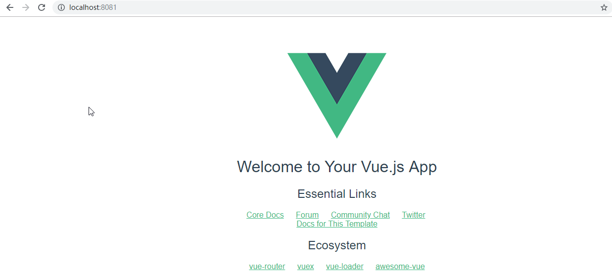

## 2.2 初始化项目

main.js

```js

// The Vue build version to load with the `import` command
// (runtime-only or standalone) has been set in webpack.base.conf with an alias.
import Vue from 'vue'
import App from './App'
import router from './router'

Vue.config.productionTip = false

/* eslint-disable no-new */
new Vue({
  el: '#app',
  router,
  components: { App },
  template: '<App/>'
})

```


清除默认的HelloWorld.vue组件和APP.vue中的默认模板代码和默认样式

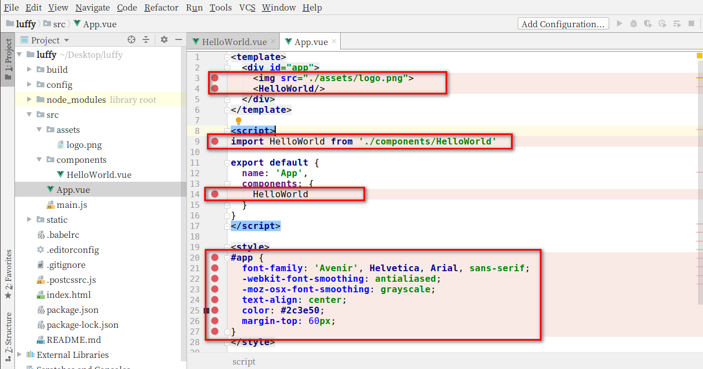

```vue
<template>
  <div id="app">

    <router-view/>
  </div>
</template>

<script>

export default {
  name: 'App',

}
</script>

<style>
  body{
    margin: 0;
    padding: 0;
  }


</style>
```

修改后效果：

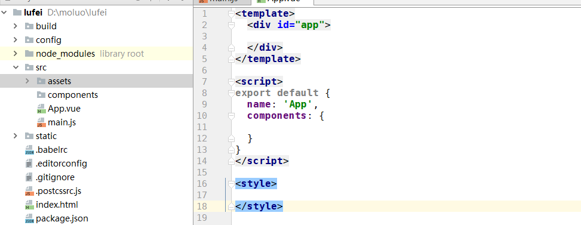


接下来，我们可以查看效果了，一张白纸~

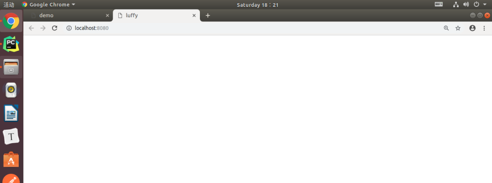


## 2.3 安装路由vue-router

### 2.3.1 下载路由组件

```
npm i vue-router -S  #-S就是给当前项目的环境添加vue-router包
```

执行效果：

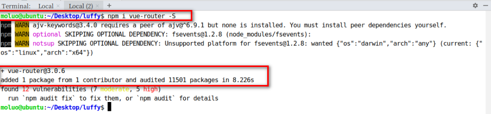


### 2.3.2 配置路由

#### 2.3.2.1 初始化路由对象

在src目录下创建router路由目录，在router目录下创建index.js路由文件

效果：

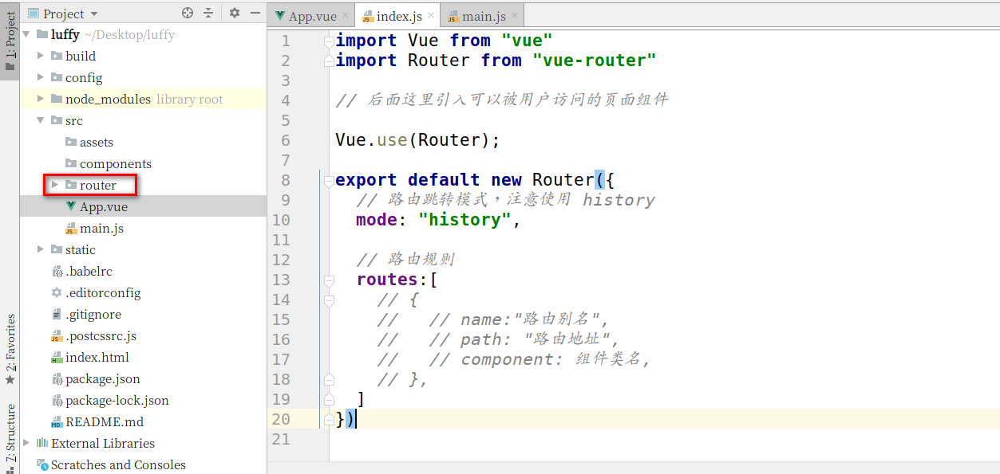


index.js路由文件中，编写初始化路由对象的代码 .

```javascript
import Vue from 'vue'
import Router from 'vue-router'

Vue.use(Router)

import Home from "../components/Home";

export default new Router({
  mode:'history',
  routes: [
    {
      path: '/home/',
      // name: 'HelloWorld',  路由别名  url('',name='')
      component: Home,
    }
  ]
})

```

#### 2.3.2.2 注册路由信息

打开main.js文件，把router路由规则对象注册到vue中.

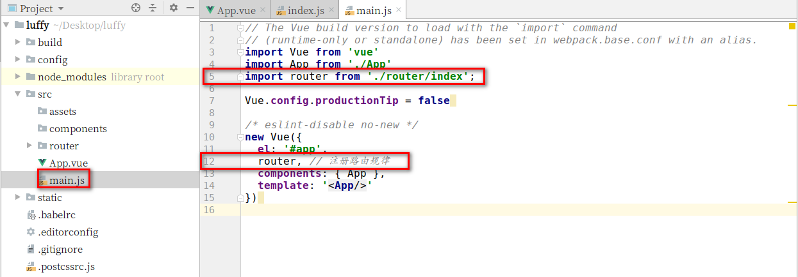

代码： 

```javascript
// The Vue build version to load with the `import` command
// (runtime-only or standalone) has been set in webpack.base.conf with an alias.
import Vue from 'vue'
import App from './App'
import router from './router/index'  1、引入，这样引入文件那么会直接拿到这个文件中export default后面的对象，export default的意思是将对象暴露出去，让别人可以引入
import router from '@/router/index'   @符号表示的是src的目录路径，这样写起来更靠谱一些，因为引入src目录里面的内容的时候就不需要知道当前文件和src目录里面的文件隔着基层了
Vue.config.productionTip = false

/* eslint-disable no-new */
new Vue({
  el: '#app',
  router,  2、注册
  components: { App },
  template: '<App/>'
});

```


#### 2.3.2.3 在视图中显示路由对应的内容

在App.vue组件中，添加显示路由对应的内容。

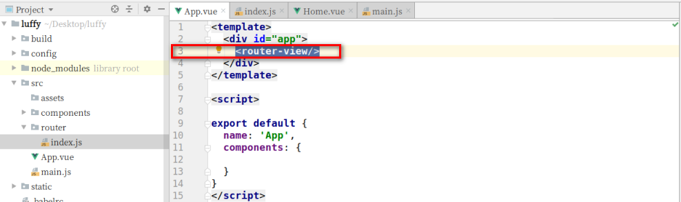

代码：

```vue
<template>
  <div id="app">
    <router-view/>  <!-- 在组件中使用子组件的写法 -->
  </div>
</template>

<script>
export default {
  name: 'App',
  components: {

  }
}
</script>

<style>

</style>

```


Home.vue组件初始化

```vue
<template>
  <div class="home">
    <Header></Header>
    <h1>这是home页面</h1>

  </div>
</template>

<script>
    import Header from './common/Header'
    export default {
        name: "Home",
        components:{
          Header,
        }
    }
</script>

<style scoped>

</style>

```


Header顶部导航组件初始化

```vue

<template>
    <div class="header">
      这是顶部导航栏
    </div>
</template>

<script>
    export default {
        name: "Header"
    }
</script>

<style scoped>

</style>

```


## 3. 引入ElementUI

对于前端页面布局，我们可以使用一些开源的UI框架来配合开发，Vue开发前端项目中，比较常用的就是ElementUI了。

ElementUI是饿了么团队开发的一个UI组件框架，这个框架提前帮我们提供了很多已经写好的通用模块，我们可以在Vue项目中引入来使用，这个框架的使用类似于我们前面学习的bootstrap框架，也就是说，我们完全可以把官方文档中的组件代码拿来就用，有定制性的内容，可以直接通过样式进行覆盖修改就可以了。

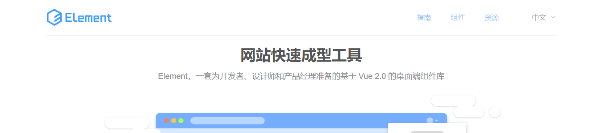

中文官网：http://element-cn.eleme.io/#/zh-CN

https://element.eleme.cn/#/zh-CN

文档快速入门：http://element-cn.eleme.io/#/zh-CN/component/quickstart


### 3.1 快速安装ElementUI

项目根目录执行以下命令:

```
npm i element-ui -S
```

上面的命令等同于 `npm install element-ui --save`

执行命令效果：

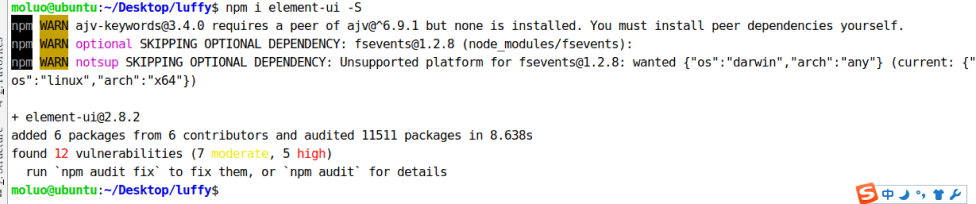


### 3.2 配置ElementUI到项目中

在main.js中导入ElementUI，并调用。代码：

```javascript
// elementUI 导入
import ElementUI from 'element-ui';
import 'element-ui/lib/theme-chalk/index.css';  // 需要import引入一下css文件，和我们的link标签引入是一个效果，而import .. from ..是配合export default来使用的
// 调用插件
Vue.use(ElementUI);
```

效果：

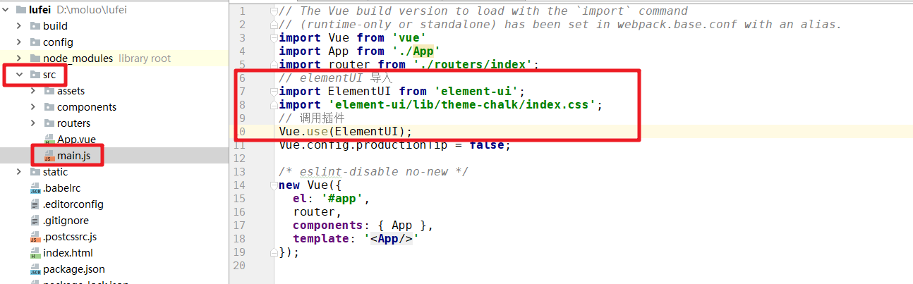


成功引入了ElementUI以后，接下来我们就可以开始进入前端页面开发，首先是首页。


# 4. 首页

首页采用了上下页面布局，首页是导航栏、轮播图。。。脚部等几个小模块。所以我们可以把首页作为一个组件进行开发，然后把首页的这些小模块作为单独的组件来进行开发。

## 4.1 创建首页组件

在src/components目录下创建文件 Home.vue

代码：

```vue
<template>
  <div id="home">
    首页
  </div>
</template>

<script>
export default {
  name:"Home",
  data(){
    return {

    }
  }
}
</script>

<style scoped>

</style>

```

效果：

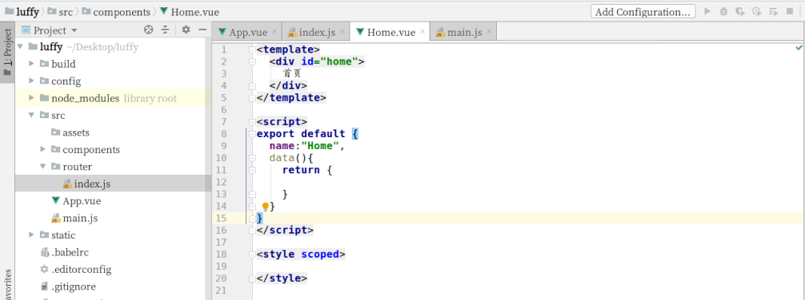


### 4.1.1 创建首页对应的路由

在router/index.js中引入Home组件，并设置Home组件作为首页路由。

代码：

```javascript
import Vue from "vue"
import router from "vue-router"  //注意这里起名必须叫做router，因为vue是有命名规范的

// 后面这里引入可以被用户访问的页面组件
import Home from "../components/Home"

Vue.use(router);

export default new Router({
  // 路由跳转模式，注意使用 history
  mode: "history",

  // 路由规则
  routes:[
    {
      // name:"路由别名",
      name:"Home",
      // path: "路由地址",
      path: "/",
      // component: 组件类名,
      component: Home,
    },{
      // name:"路由别名",
      name:"Home",
      // path: "路由地址",
      path: "/home",
      // component: 组件类名,
      component: Home,
    },
  ]
})

```


效果：

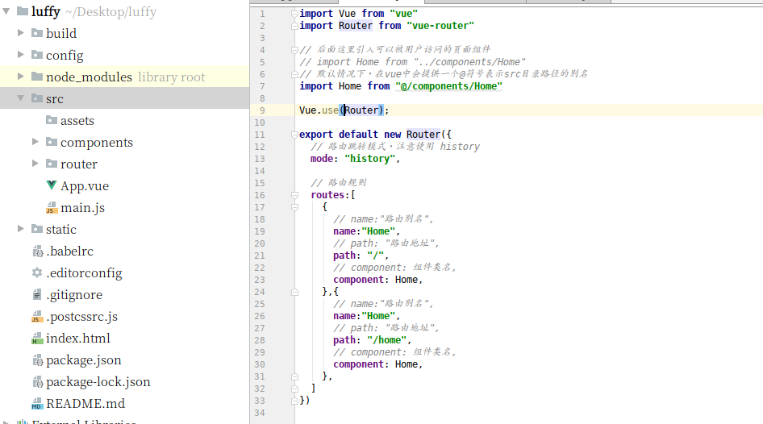


## 4.2 开发导航子组件

经过前面的观察，可以发现导航不仅在首页出现，其他页面也有，所以对于这些不同页面中公共的内容，可以创建一个单独的组件目录存放。

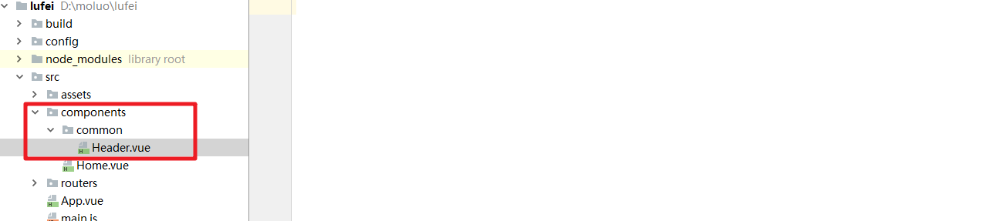


创建src/components/common/Header.vue目录路径，编写代码：

```vue
<template>

</template>

<script>
  export default {
    name: "Header",
    data(){
      return {
        
      };
    }
  }
</script>

<style scoped>

</style>
```

效果：

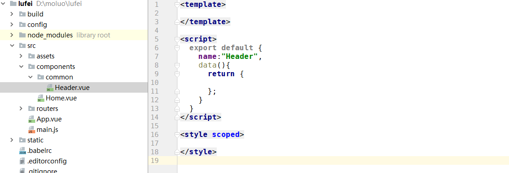


### 4.2.1 在首页引入导航组件

代码：Home.vue

```vue
<template>
  <div class="home">
    <Header/>
  </div>
</template>

<script>
  import Header from "./common/Header"
  export default {
    name: "Home",
    data(){
      return {

      };
    },
    components:{
      Header,
    }
  }
</script>

<style scoped>

</style>

```


效果：

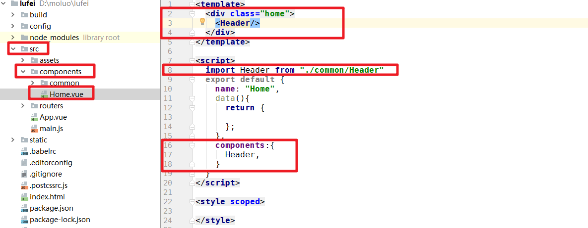


接下来，我们就可以在组件中参考ElementUI文档来进行样式开发了。

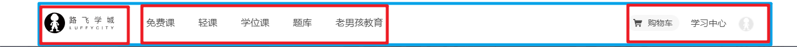


Header的子组件代码：


App.vue，中设置一些公共样式的代码：

```vue
<style>
  body{
    padding: 0;
    margin:0;
  }
  a{
    text-decoration: none;
    color: #4a4a4a;
  }
  a:hover{
    color: #000;
  }
  .header .el-menu li .el-submenu__title{
    height: 26px!important;
    line-height: 26px!important;
  }
  .el-menu--popup{
    min-width: 140px;
  }
</style>
```


新版的导航子组件Header

```vue
<template>
  <div class="total-header">
    <div class="header">
    <el-container>
      <el-header height="80px" class="header-cont">
        <el-row>
          <el-col class="logo" :span="3">
            <a href="/">
              

            </a>
          </el-col>
          <el-col class="nav" :span="10">
            <el-row>
                <el-col :span="3"><router-link to="/" class="active">免费课</router-link></el-col>
                <el-col :span="3"><router-link to="/">轻课</router-link></el-col>
                <el-col :span="3"><router-link to="/">学位课</router-link></el-col>
                <el-col :span="3"><router-link to="/">题库</router-link></el-col>
                <el-col :span="3"><router-link to="/">教育</router-link></el-col>
              </el-row>

          </el-col>
          <el-col :span="11" class="header-right-box">
            <div class="search">
              <input type="text" id="Input" placeholder="请输入想搜索的课程" style="" @blur="inputShowHandler" ref="Input" v-show="!s_status">
              <ul @click="ulShowHandler" v-show="s_status" class="search-ul">
                <span>Python</span>
                <span>Linux</span>
              </ul>
              <p>
                
                
                
              </p>
            </div>
            <div class="register" v-show="!token">
              <router-link to="/login"><button class="signin">登录</button></router-link>
              &nbsp;&nbsp;|&nbsp;&nbsp;
              <a target="_blank" href="https://www.luffycity.com/signup">
                <router-link to="/register"><button class="signup">注册</button></router-link>

              </a>
            </div>
            <div class="shop-car" v-show="token">
              <router-link to="/cart">
                <b>6</b>
                
                <span>购物车 </span>
              </router-link>
            </div>
            <div class="nav-right-box" v-show="token">
                <div class="nav-right">
                  <router-link to="/myclass">
                    <div class="nav-study">我的教室</div>
                  </router-link>
                  <div class="nav-img" @mouseover="personInfoList" @mouseout="personInfoOut">
                    
                    <ul class="home-my-account" v-show="list_status" @mouseover="personInfoList">
                  <li>
                    我的账户
                    
                  </li>
                  <li>
                    我的订单
                    
                  </li>
                  <li>
                    贝里小卖铺
                    
                  </li>
                  <li>
                    我的优惠券
                    
                  </li>
                  <li>
                    <span>
                      我的消息
                      <b>(26)</b>
                    </span>
                    
                  </li>
                  <li>
                    退出
                    
                  </li>

                </ul>
                  </div>

                </div>

              </div>


          </el-col>
        </el-row>

      </el-header>


    </el-container>

  </div>
  </div>

</template>

<script>
    export default {
      name: "Header",
      data(){
        return {
          // 设置一个登录状态的标记，因为登录注册部分在登录之后会发生变化
          token:true,
          s_status:true,
          list_status:false,
        }
      },
      methods:{
        ulShowHandler(){
          this.s_status = false;
          console.log(this.$refs.Input);

          // this.$refs.Input.focus();
          this.$nextTick(()=>{  //延迟回调方法，Vue中DOM更新是异步的,也就是说让Vue去显示我们的input标签的操作是异步的，如果我们直接执行this.$refs.Input.focus();是不行的，因为异步的去显示input标签的操作可能还没有完成，所有我们需要等它完成之后在进行DOM的操作，需要借助延迟回调对DOM进行操作，这是等这次操作对应的所有Vue中DOM的更新完成之后，在进行nextTick的操作。
            this.$refs.Input.focus();
          })

        },
        inputShowHandler(){
          console.log('xxxxx')
          this.s_status = true;
        },
        personInfoList(){
          this.list_status = true;
        },
        personInfoOut(){
          this.list_status = false;
        }
      }
    }


</script>

<style scoped>
  .header-cont .nav .active{
    color: #f5a623;
    font-weight: 500;
    border-bottom: 2px solid #f5a623;
  }
  .total-header{
    min-width: 1200px;
    z-index: 100;
    box-shadow: 0 4px 8px 0 hsla(0,0%,59%,.1);
  }
  .header{
    width: 1200px;
    margin: 0 auto;
  }
  .header .el-header{
    padding: 0;
  }
  .logo{
    height: 80px;
    /*line-height: 80px;*/
    /*text-align: center;*/
    display: flex; /* css3里面的弹性布局，高度设定好之后，设置这个属性就能让里面的内容居中 */
    align-items: center;
  }
  .nav .el-row .el-col{
    height: 80px;
    line-height: 80px;
    text-align: center;

  }
  .nav a{
    font-size: 15px;
    font-weight: 400;
    cursor: pointer;
    color: #4a4a4a;
    text-decoration: none;
  }
  .nav .el-row .el-col a:hover{
    border-bottom: 2px solid #f5a623
  }

  .header-cont{
    position: relative;
  }
  .search input{
    width: 185px;
    height: 26px;
    font-size: 14px;
    color: #4a4a4a;
    border: none;
    border-bottom: 1px solid #ffc210;

    outline: none;
  }
  .search ul{
    width: 185px;
    height: 26px;
    display: flex;
    align-items: center;
    padding: 0;

    padding-bottom: 3px;
    border-bottom: 1px solid hsla(0,0%,59%,.25);
    cursor: text;
    margin: 0;
    font-family: Helvetica Neue,Helvetica,Microsoft YaHei,Arial,sans-serif;
  }
  .search .search-ul,.search #Input{
    padding-top:10px;
  }
  .search ul span {
    color: #545c63;
    font-size: 12px;
    padding: 3px 12px;
    background: #eeeeef;
    cursor: pointer;
    margin-right: 3px;
    border-radius: 11px;
  }
  .hide{
    display: none;
  }
  .search{
    height: auto;
    display: flex;
  }
  .search p{
    position: relative;
    margin-right: 20px;
    margin-left: 4px;
  }

  .search p .icon{
    width: 16px;
    height: 16px;
    cursor: pointer;
  }
  .search p .new{
    width: 18px;
    height: 10px;
    position: absolute;
    left: 15px;
    top: 0;
  }
  .register{
    height: 36px;
    display: flex;
    align-items: center;
    line-height: 36px;
  }
  .register .signin,.register .signup{
    font-size: 14px;
    color: #5e5e5e;
    white-space: nowrap;
  }
  .register button{
    outline: none;
    cursor: pointer;
    border: none;
    background: transparent;
  }
  .register a{
    color: #000;
    outline: none;
  }
  .header-right-box{
    height: 100%;
    display: flex;
    align-items: center;
    font-size: 15px;
    color: #4a4a4a;
    position: absolute;
    right: 0;
    top: 0;
  }
  .shop-car{
    width: 99px;
    height: 28px;
    border-radius: 15px;
    margin-right: 20px;
    background: #f7f7f7;
    display: flex;
    align-items: center;
    justify-content: center;
    position: relative;
    cursor: pointer;
  }
  .shop-car b{
    position: absolute;
    left: 28px;
    top: -1px;
    width: 18px;
    height: 16px;
    color: #fff;
    font-size: 12px;
    font-weight: 350;
    display: flex;
    justify-content: center;
    align-items: center;
    border-radius: 50%;
    background: #ff0826;
    overflow: hidden;
    transform: scale(.8);
  }
  .shop-car img{
    width: 20px;
    height: 20px;
    margin-right: 7px;
  }

  .nav-right-box{
    position: relative;
  }
  .nav-right-box .nav-right{
    float: right;
    display: flex;
    height: 100%;
    line-height: 60px;
    position: relative;
  }
  .nav-right .nav-study{
    font-size: 15px;
    font-weight: 300;
    color: #5e5e5e;
    margin-right: 20px;
    cursor: pointer;

  }
  .nav-right .nav-study:hover{
    color:#000;
  }
  .nav-img img{
    width: 26px;
    height: 26px;
    border-radius: 50%;
    display: inline-block;
    cursor: pointer;
  }
  .home-my-account{
    position: absolute;
    right: 0;
    top: 60px;
    z-index: 101;
    width: 190px;
    height: auto;
    background: #fff;
    border-radius: 4px;
    box-shadow: 0 4px 8px 0 #d0d0d0;
  }
  li{
    list-style: none;
  }
  .home-my-account li{
    height: 40px;
    font-size: 14px;
    font-weight: 300;
    color: #5e5e5e;
    padding-left: 20px;
    padding-right: 20px;
    cursor: pointer;
    display: flex;
    align-items: center;
    justify-content: space-between;
    box-sizing: border-box;
  }
  .home-my-account li img{
    cursor: pointer;
    width: 5px;
    height: 10px;
  }
  .home-my-account li span{
    height: 40px;
    display: flex;
    align-items: center;
  }
  .home-my-account li span b{
    font-weight: 300;
    margin-top: -2px;
  }


</style>


```


Home组件中引入使用Header子组件，代码无需改变，直接访问效果：

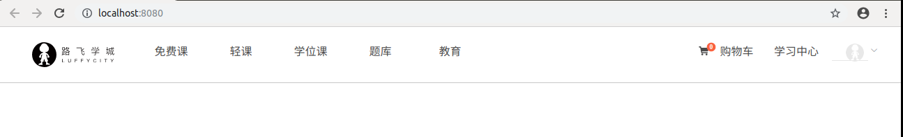


## 4.3 开发轮播图子组件


### 4.3.1 创建Banner.vue组件文件

代码：common/Banner.vue

```vue
<template>
  <div class="banner">

  </div>
</template>

<script>
  export default {
    name:"Banner",
    data(){
      return {};
    }
  }
</script>

<style scoped>

</style>

```


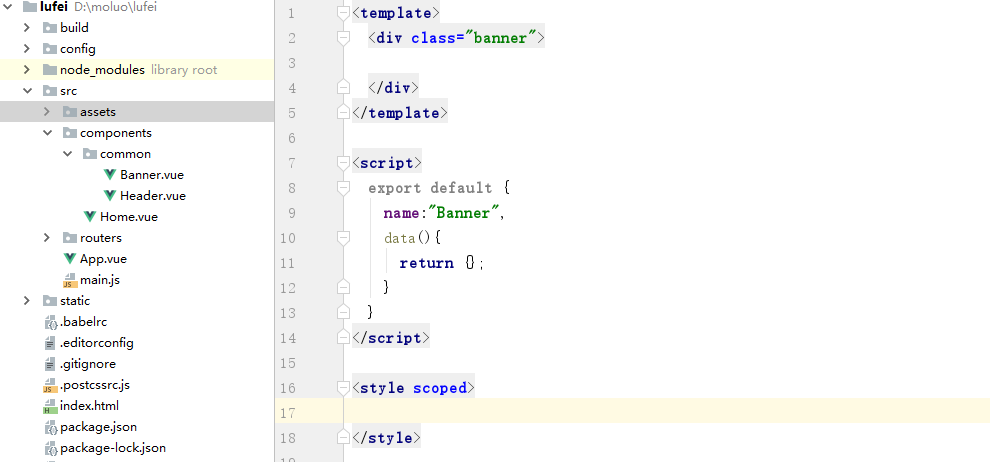


### 4.3.1 在Home组件中引入Banner子组件

```vue
<template>
  <div class="home">
    <Header/>
    <Banner/>
  </div>
</template>

<script>
  import Header from "./common/Header"
  import Banner from "./common/Banner"
  export default{
    name:"Home",
    data(){
      return {};
    },
    components:{
      Header,
      Banner,
    }
  }
</script>

<style scoped>
.home{
  padding-top: 80px;
}
</style>

```

效果：

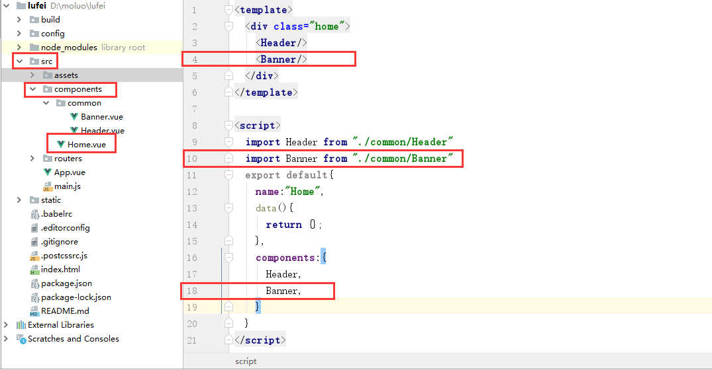


接下来，在ElementUI中有对应的轮播图[跑马灯]效果，可以直接提取过来使用。

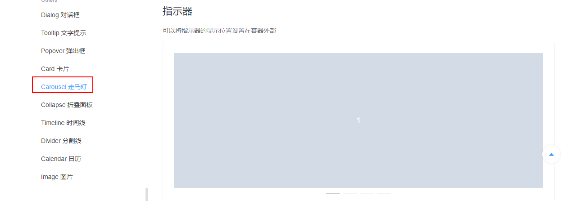

注意，图片保存到static目录下。保存在assets目录下的图片等同于保存在static/img目录下。

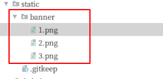

对于图片的使用，如果是vue代码中直接要使用的图片，可以保存accets目录下，如果是第三方插件要使用到的图片，需要保存在static目录下。其实本质上来说，所有的图片都是保存在static目录下的，而assets目录下的内容,最终被vue解析成地址的时候,也是在static目录的.


Banner.vue组件,代码:

```vue
<template>
  <div class="banner">
      <el-carousel trigger="click" height="506px">
        <el-carousel-item v-for="banner in banner_list">
          <a :href="banner.link"></a>
        </el-carousel-item>
      </el-carousel>
  </div>
</template>

<script>
  export default {
    name:"Banner",
    data(){
      return {
        banner_list:[
          {link:"http://www.baidu.com",img:"/static/banner/banner1.png"},
          {link:"http://www.baidu.com",img:"/static/banner/banner2.png"},
          {link:"http://www.baidu.com",img:"/static/banner/banner3.png"},
        ]
      };
    }
  }
</script>

<style scoped>

</style>

```

效果:


新版的轮播图组件

```vue
<template>
  <div class="banner">
    <el-carousel indicator-position="outside" height="400px">
      <el-carousel-item v-for="item in banner_img_list" :key="item.id" height="400px">
        <a :href="item.link">
<!--          -->
          
        </a>
      </el-carousel-item>
    </el-carousel>

  </div>
</template>

<script>
    export default {
      name: "Banner",
      data(){
        return {
          banner_img_list:[
            // {id:1,title:'xx1',img_src:'@/assets/banner/b1.png',link:'https://www.baidu.com'}, //注意如果是通过数据属性给img的src属性赋值，就不能使用@符号了，因为html标签出来之后再给src属性赋值的，之前我们直接写的img的src属性值为@/asserts/banner/b1.png，是可以解析的，但是如果html标签渲染完成之后，后赋值给它，就不会去解析@符号了，所以你会发现，如果写了@符号就看不到图片，所以我们这里直接写项目的相对路径就行了.我们通过浏览器可以发现，@/assets/banner/b1.png这样的路径都给转化成了/static/img/b1.277a0cd.png这样的路径，所以，如果我们直接给src这样的属性值，不就可以了吗？方法：require('@/assets/banner/b1.png') //结果：/static/img/b1.277a0cd.png，也就是说，其实这些assets中的图片最终都会解析到static文件夹下，所以我们还可以直接将这几个图片放到我们的static静态文件夹下
            // {id:1,title:'xx1',img_src:'../../assets/banner/b1.png',link:'https://www.baidu.com'},
            // 显示图片方式1：require方法进行图片路径解析
            // {id:1,title:'xx1',img_src:require('@/assets/banner/b1.png'),link:'https://www.baidu.com'},
            // {id:2,title:'xx2',img_src:require('@/assets/banner/b2.png'),link:'https://www.baidu.com'},
            // {id:3,title:'xx3',img_src:require('@/assets/banner/b3.png'),link:'https://www.baidu.com'},
            //显式图片方式2：直接将图片放到项目的static目录下
            {id:1,title:'xx1',img_src:'/static/banner/banner1.png',link:'https://www.baidu.com'},
            {id:2,title:'xx2',img_src:'/static/banner/banner2.png',link:'https://www.baidu.com'},
            {id:3,title:'xx3',img_src:'/static/banner/banner3.png',link:'https://www.baidu.com'},

            //这里你还会发现有一个问题，就是如果我们使用了router—link的to属性，那么to属性的值都会算作当前项目根路径的子路径，所以你会发现你写的外网地址例如：https://baidu.com会变成前面有个斜杠/https://baidu.com，导致无法正确访问到百度，所以如果调转的是外网地址的话，我们直接使用a标签，如果访问的是本域名下的内部地址的话，使用router-link。
          ]
        }
      }

    }
</script>

<style scoped>

</style>

```


## 4.5 页面脚部

### 4.5.1 创建脚部组件文件

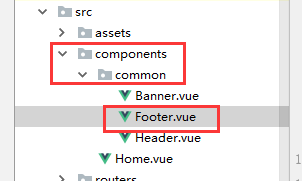

代码：common/Footer.vue

```vue
<template>
  <div class="footer">

  </div>
</template>

<script>
  export default {
    name:"Footer",
    data(){
      return {}
    }
  }
</script>


<style scoped>

</style>

```

### 4.5.2 在Home组件中引入Footer组件

Home组件代码：

```vue
<template>
  <div class="home">
    <Header/>
    <Banner/>
    <Footer/>
  </div>
</template>

<script>
  import Header from "./common/Header"
  import Banner from "./common/Banner"
  import Footer from "./common/Footer"
  export default{
    name:"Home",
    data(){
      return {};
    },
    components:{
      Header,
      Banner,
      Footer,
    }
  }
</script>

<style scoped>
.home{
  padding-top: 80px;
}
</style>

```

效果:

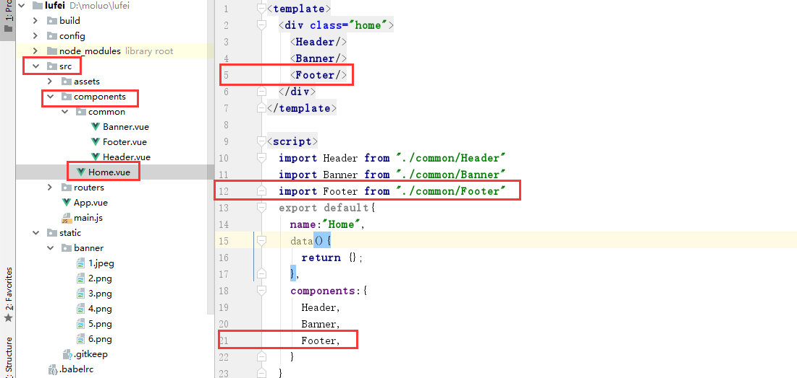


### 4.5.3 编写脚部样式

```vue
<template>
  <div class="footer">
    <el-container>
      <el-row>
        <el-col :span="4"><router-link to="">关于我们</router-link></el-col>
        <el-col :span="4"><router-link to="">联系我们</router-link></el-col>
        <el-col :span="4"><router-link to="">商务合作</router-link></el-col>
        <el-col :span="4"><router-link to="">帮助中心</router-link></el-col>
        <el-col :span="4"><router-link to="">意见反馈</router-link></el-col>
        <el-col :span="4"><router-link to="">新手指南</router-link></el-col>
        <el-col :span="24"><p class="copyright">Copyright © luffycity.com版权所有 | 京ICP备17072161号-1</p></el-col>
      </el-row>
    </el-container>
  </div>
</template>

<script>
  export default {
    name:"Footer",
    data(){
      return {}
    }
  }
</script>


<style scoped>
.footer{
  width: 100%;
  height: 128px;
  background: #25292e;
}
.footer .el-container{
  width: 1200px;
  margin: auto;
}
.footer .el-row {
  align-items: center;
  padding: 0 200px;
  padding-bottom: 15px;
  width: 100%;
  margin-top: 38px;
}
.footer .el-row a{
  color: #fff;
  font-size: 14px;
}
.footer .el-row .copyright{
  text-align: center;
  color: #fff;
  font-size: 14px;
}
</style>

```


效果：

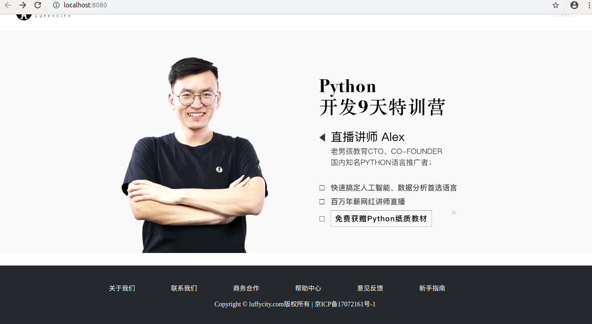


新版底部组件

```vue
<template>
    <div class="footer">
      <div class="footer-item">
        <div class="foot-left">
        <div class="foot-content">
          <p>
            <span>关于我们</span>
            &nbsp;&nbsp;|&nbsp;&nbsp;
            <span>贝里小卖铺</span>
          </p>
          <p>
            地址：北京市昌平区顺沙路八号院汇德商厦402  邮箱：customer@luffycity.com
          </p>
          <p>
             © 2017-2020 北京路飞学城教育科技有限公司版权所有
            <a class="copyright" href="http://beian.miit.gov.cn" target="_blank" >京ICP备17072161号-1</a>
          </p>
          <p>
            <a class="report-link" target="_blank" href="http://www.beian.gov.cn/portal/registerSystemInfo?recordcode=11010102002019&amp;token=1ee3034d-ba3a-4cc3-89d4-89875e2dd0b1">
              
              京公网安备 11010102002019号
            </a>
          </p>
        </div>

      </div>
        
      </div>
    </div>
</template>

<script>
    export default {
        name: "Foot"
    }
</script>

<style scoped>

  .footer{
    display: flex;
    align-items: center;
    width: 100%;
    height: 140px;
    flex-direction: column;
    overflow: hidden;
    background: #191c25;
  }
  .footer .foot-left{
    display: flex;
    align-items: center;
  }
  .footer .foot-left .foot-content p{
    margin-bottom: 10px;
    font-size: 13px;
    font-family: PingFangSC-Regular;
    font-weight: 400;
    color: #d0d0d0;
  }
  .footer-item{
    width: 960px;
    height: 100%;
    justify-content: space-between;
  }
  .foot-left{
    display: flex;
    align-items: center;
    float: left;
  }
  .foot-content a{
    color: #d0d0d0;
  }
  .footer .foot-left .foot-content p:first-child span{
    font-size: 16px;
    font-weight: 400;
    display: inline-block;
    font-family: PingFangSC-Regular;
    cursor: pointer;
  }
  .foot-content .report-img{
    display: inline-block;
    height: 20px;
    margin-right: 12px;
  }
  .footer-item .code{
    width: 74px;
    height: auto;
    margin-right: 100px;
    float: right;
    padding-top: 30px;
  }

</style>

```


首页的三大块我们已经完成了，但是我们开始新的页面出现之前，我们需要把链接补充上， 新增课程的导航链接.

接下来,我们就可以创建免费课的组件.


# 5. 免费课

在组件目录components下创建Couses.vue组件文件,代码如下:

```vue
<template>
  <div class="courses">

  </div>
</template>

<script>
  export default {
    name:"Courses",
    data(){
      return {

      }
    }
  }
</script>


<style scoped>
  
</style>

```

### 5.1 在router/index.js路由中注册路由

```javascript
import Vue from "vue"
import Router from "vue-router"

// 导入可以被用户访问的组件
import Home from "@/components/Home"
import Courses from "@/components/Courses"

Vue.use(Router);

export default new Router({
  mode: "history",
  routes:[
    // 路由列表
    {
      path: "/",
      name: "Home",
      component:Home,
    },
    {
      path: "/home",
      name: "Home",
      component:Home,
    },
    {
      path: "/courses",
      name: "Courses",
      component:Courses,
    },

  ]
})

```

