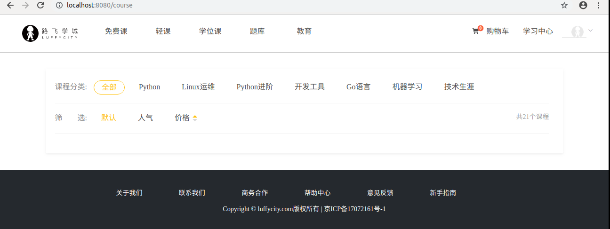
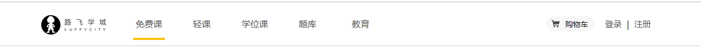
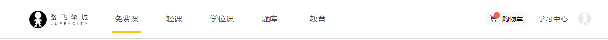

# 路飞学城项目前端

[TOC]


# 5. 免费课

在组件目录components下创建Course.vue组件文件,代码如下:

```vue
<template>
  <div class="course">

  </div>
</template>

<script>
export default {
  name: "Course",
  data(){
    return {

    }
  },
}
</script>


<style scoped>
  
</style>

```

## 5.1 在routers/index.js路由中注册路由

```javascript
import Vue from "vue"
import Router from "vue-router"

// 导入可以被用户访问的组件
import Home from "@/components/Home"
import Course from "@/components/Course"

Vue.use(Router);

export default new Router({
  mode: "history",
  routes:[
    // 路由列表
    {
      path: "/",
      name: "Home",
      component:Home,
    },
    {
      path: "/home",
      name: "Home",
      component:Home,
    },
    {
      path: "/course",
      name: "Course",
      component:Course,
    },

  ]
})

```

## 5.2 完成免费课课程列表

### 5.2.2 文件代码结构

Course.vue，代码：

```vue
<template>
  <div class="course">
    <Header/>
    <div class="main">
      <!-- 筛选功能 -->
      <div class="top">

      </div>
      <!-- 课程列表 -->
      <div class="list">

      </div>
    </div>
    <Footer/>
  </div>
</template>

<script>
import Header from "./common/Header"
import Footer from "./common/Footer"
export default {
  name: "Course",
  data(){
    return {

    }
  },
  components:{Header,Footer}
}
</script>

<style scoped>

</style>
```


### 5.2.3 筛选条件的样式实现

```vue
<style scoped>
.courses{
  padding-top: 80px;
}
.main{
    width: 1100px;
    height: auto;
    margin: 0 auto;
    padding-top: 35px;
}
.main .filter{
    width: 100%;
    height: auto;
    margin-bottom: 35px;
    padding: 25px 0px 25px 0px;
    background: #fff;
    border-radius: 4px;
    box-shadow: 0 2px 4px 0 #f0f0f0;
}
.filter .el-col{
  text-align: center;
  padding: 6px 0px;
  line-height: 16px;
  margin-left: 14px;
  position: relative;
  transition: all .3s ease;
  cursor: pointer;
  color: #4a4a4a;
}
.filter-el-row1{
  padding-bottom: 18px;
  margin-bottom: 17px;
}
.filter .filter-text{
  text-align: right;
  font-size: 16px;
  color: #888;
}
.filter .filter-text2{
}
.filter .filter-el-row1 .current{
    color: #ffc210;
    border: 1px solid #ffc210!important;
    border-radius: 30px;
}
.filter .filter-el-row2 .current{
    color: #ffc210;
}
.filter-price{
  display:inline-block;
  vertical-align: middle;
}
.filter-price .up, .filter-price .down{
  display: block;
  line-height: 8px;
  font-size: 13px;
  margin: -4px;
  color: #d8d8d8;
}
.current .filter-price .active{
  color: #ffc210;
}
.course-item{
  margin-bottom: 35px;
}
.course-item .course-item-box{
   padding: 20px 30px 20px 20px;
}
.course-item{
     box-shadow: 2px 3px 16px rgba(0,0,0,.1);
    transition: all .2s ease;
}
.course-item .course-item-left{
    width: 423px;
    height: 210px;
    margin-right: 30px;
}
.course-title{
  overflow: hidden;/* 在父元素中使用可以清除子元素的浮动影响 */
}
.course-title .box-title{
  font-size: 26px;
  color: #333333;
  float: left;
  margin-bottom: 8px;
}
.course-title .box-number{
    font-size: 14px;
    color: #9b9b9b;
    font-family: PingFangSC-Light;
    float: right;
    padding-top: 12px;
}
.course-item-right{
  width: 56.6%;
}
.author{
    font-size: 14px;
    color: #9b9b9b;
    margin-bottom: 14px;
    padding-bottom: 14px;
    overflow: hidden;
}
.author .box-author{
  float:left;
}
.author .lession{
  float: right;
}
.course-content .el-icon-caret-right{
  border: 1px solid #000;
  border-radius: 50%;
  margin-right: 6px;
}
.course-content .el-col{
  font-size: 14px;
  color: #666;
  width: 50%;
  margin-bottom: 15px;
  cursor: pointer;
}
.course-content .el-col:hover{
  color: #ffc210;
}
.course-content .el-col:hover .el-icon-caret-right,.course-content .el-col:hover .free{
  border-color: #ffc210;
  color: #ffc210;
}
.course-content .el-col .free{
    width: 34px;
    height: 20px;
    color: #fd7b4d;
    margin-left: 10px;
    border: 1px solid #fd7b4d;
    border-radius: 2px;
    text-align: center;
    font-size: 13px;
    white-space: nowrap;
}
.course-price{
  overflow: hidden;
}
.course-price .course-price-left{
  float: left;
}
.course-price .discount{
    padding: 6px 10px;
    display: inline-block;
    font-size: 16px;
    color: #fff;
    text-align: center;
    margin-right: 8px;
    background: #fa6240;
    border: 1px solid #fa6240;
    border-radius: 10px 0 10px 0;
}
.course-price .course-price-left{
  line-height: 22px;
}
.course-price .count{
    font-size: 24px;
    color: #fa6240;
}
.course-price .old_count{
    font-size: 14px;
    color: #9b9b9b;
    text-decoration: line-through;
    margin-left: 10px;
}
.course-price .buy{
  float: right;
  width: 120px;
  height: 38px;
  font-size: 16px;
  border-radius: 3px;
  border: 1px solid #fd7b4d;
  background: transparent;/* 透明 */
  color: #fa6240;
  cursor: pointer;
  transition: all .2s ease-in-out;/* css3新版本的样式中支持支持 jQuery里面的动画预设效果 */
  /* all表示当前元素的所有样式  .2s表示改变样式完成的时间  ease-in-out */
}
.course-price .buy:hover{
    color: #fff;
    background: #ffc210;
    border: 1px solid #ffc210;
}
</style>
```

App.vue针对列表标签进行初始化，代码：

```css
ul{
    list-style: none;
    padding:0;
    margin:0;
  }
  
```


效果:




### 5.2.4 课程类表的样式实现和特效

```vue
<template>
  <div class="course">
    <Header/>
    <div class="main">
      <!-- 筛选功能 -->
      <div class="top">
        <ul class="condition condition1">
          <li class="cate-condition">课程分类:</li>
          <li class="item current">全部</li>
          <li class="item">Python</li>
          <li class="item">Linux运维</li>
          <li class="item">Python进阶</li>
          <li class="item">开发工具</li>
          <li class="item">Go语言</li>
          <li class="item">机器学习</li>
          <li class="item">技术生涯</li>
        </ul>
        <ul class="condition condition2">
          <li class="cate-condition">筛&nbsp;&nbsp;&nbsp;&nbsp;&nbsp;&nbsp;&nbsp;&nbsp;选:</li>
          <li class="item current">默认</li>
          <li class="item">人气</li>
          <li class="item price">价格</li>
          <li class="course-length">共21个课程</li>
        </ul>
      </div>
      <!-- 课程列表 -->
      <div class="list">
        <ul>
          <li class="course-item">
            <div class="course-cover">
              
            </div>
            <div class="course-info">
              <div class="course-title">
                <h3>Python开发21天入门</h3>
                <span>46520人已加入学习</span>
              </div>
              <p class="teacher">
                <span class="info">Alex 金角大王 老男孩Python教学总监</span>
                <span class="lesson">共154课时/更新完成</span>
              </p>
              <ul class="lesson-list">
                <li>
                  <p class="lesson-title">01 | 常用模块学习-模块的种类和导入方法</p>
                  <span class="free">免费</span>
                </li>
                <li>
                  <p class="lesson-title">02 | 编程语言介绍（三）高级语言</p>
                  <span class="free">免费</span>
                </li>
                <li>
                  <p class="lesson-title">03 | 编程语言介绍（一）</p>
                  <span class="free">免费</span>
                </li>
                <li>
                  <p class="lesson-title">04 | 课程介绍（二）-Python与其他语言的区别</p>
                  <span class="free">免费</span>
                </li>
              </ul>
              <div class="buy-info">
                <span class="discount">限时免费</span>
                <span class="present-price">￥0.00元</span>
                <span class="original-price">原价：9.00元</span>
                <button class="buy-now">立即购买</button>
              </div>
            </div>
          </li>
          <li class="course-item">
            <div class="course-cover">
              
            </div>
            <div class="course-info">
              <div class="course-title">
                <h3>Python开发21天入门</h3>
                <span>46520人已加入学习</span>
              </div>
              <p class="teacher">
                <span class="info">Alex 金角大王 老男孩Python教学总监</span>
                <span class="lesson">共154课时/更新完成</span>
              </p>
              <ul class="lesson-list">
                <li>
                  <p class="lesson-title">01 | 常用模块学习-模块的种类和导入方法</p>
                  <span class="free">免费</span>
                </li>
                <li>
                  <p class="lesson-title">02 | 编程语言介绍（三）高级语言</p>
                  <span class="free">免费</span>
                </li>
                <li>
                  <p class="lesson-title">03 | 编程语言介绍（一）</p>
                  <span class="free">免费</span>
                </li>
                <li>
                  <p class="lesson-title">04 | 课程介绍（二）-Python与其他语言的区别</p>
                  <span class="free">免费</span>
                </li>
              </ul>
              <div class="buy-info">
                <span class="discount">限时免费</span>
                <span class="present-price">￥0.00元</span>
                <span class="original-price">原价：9.00元</span>
                <button class="buy-now">立即购买</button>
              </div>
            </div>
          </li>
          <li class="course-item">
            <div class="course-cover">
              
            </div>
            <div class="course-info">
              <div class="course-title">
                <h3>Python开发21天入门</h3>
                <span>46520人已加入学习</span>
              </div>
              <p class="teacher">
                <span class="info">Alex 金角大王 老男孩Python教学总监</span>
                <span class="lesson">共154课时/更新完成</span>
              </p>
              <ul class="lesson-list">
                <li>
                  <p class="lesson-title">01 | 常用模块学习-模块的种类和导入方法</p>
                  <span class="free">免费</span>
                </li>
                <li>
                  <p class="lesson-title">02 | 编程语言介绍（三）高级语言</p>
                  <span class="free">免费</span>
                </li>
                <li>
                  <p class="lesson-title">03 | 编程语言介绍（一）</p>
                  <span class="free">免费</span>
                </li>
                <li>
                  <p class="lesson-title">04 | 课程介绍（二）-Python与其他语言的区别</p>
                  <span class="free">免费</span>
                </li>
              </ul>
              <div class="buy-info">
                <span class="discount">限时免费</span>
                <span class="present-price">￥0.00元</span>
                <span class="original-price">原价：9.00元</span>
                <button class="buy-now">立即购买</button>
              </div>
            </div>
          </li>
          <li class="course-item">
            <div class="course-cover">
              
            </div>
            <div class="course-info">
              <div class="course-title">
                <h3>Python开发21天入门</h3>
                <span>46520人已加入学习</span>
              </div>
              <p class="teacher">
                <span class="info">Alex 金角大王 老男孩Python教学总监</span>
                <span class="lesson">共154课时/更新完成</span>
              </p>
              <ul class="lesson-list">
                <li>
                  <p class="lesson-title">01 | 常用模块学习-模块的种类和导入方法</p>
                  <span class="free">免费</span>
                </li>
                <li>
                  <p class="lesson-title">02 | 编程语言介绍（三）高级语言</p>
                  <span class="free">免费</span>
                </li>
                <li>
                  <p class="lesson-title">03 | 编程语言介绍（一）</p>
                  <span class="free">免费</span>
                </li>
                <li>
                  <p class="lesson-title">04 | 课程介绍（二）-Python与其他语言的区别</p>
                  <span class="free">免费</span>
                </li>
              </ul>
              <div class="buy-info">
                <span class="discount">限时免费</span>
                <span class="present-price">￥0.00元</span>
                <span class="original-price">原价：9.00元</span>
                <button class="buy-now">立即购买</button>
              </div>
            </div>
          </li>
        </ul>
      </div>
    </div>
    <Footer/>
  </div>
</template>

<script>
import Header from "./common/Header"
import Footer from "./common/Footer"
export default {
  name: "Course",
  data(){
    return {
    }
  },

  components:{Header,Footer}
}
</script>

<style scoped>
.main{
    width: 1100px;
    height: auto;
    margin: 0 auto;
    padding-top: 35px;
}
.main .top{
    margin-bottom: 35px;
    padding: 25px 30px 25px 20px;
    background: #fff;
    border-radius: 4px;
    box-shadow: 0 2px 4px 0 #f0f0f0;
}
.condition{
    border-bottom: 1px solid #333;
    border-bottom-color: rgba(51,51,51,.05);
    padding-bottom: 18px;
    margin-bottom: 17px;
    overflow: hidden;
}
.condition li{
    float: left;
}
.condition .cate-condition{
    color: #888;
    font-size: 16px;
}
.condition .item{
    padding: 6px 16px;
    line-height: 16px;
    margin-left: 14px;
    position: relative;
    transition: all .3s ease;
    cursor: pointer;
    color: #4a4a4a;
}
.condition1 .current{
    color: #ffc210;
    border: 1px solid #ffc210!important;
    border-radius: 30px;
}
.condition2 .current{
  color: #ffc210;
}
.condition .price:before{
    content: "";
    width: 0;
    border: 5px solid transparent;
    border-top-color: #d8d8d8;
    position: absolute;
    right: 0;
    bottom: 2.5px;
}
.condition .price:after{
    content: "";
    width: 0;
    border: 5px solid transparent;
    border-bottom-color: #ffc210;
    position: absolute;
    right: 0;
    top: 2.5px;
}
.condition2 .course-length{
    float: right;
    font-size: 14px;
    color: #9b9b9b;
}
.course-item{
    background: #fff;
    padding: 20px 30px 20px 20px;
    margin-bottom: 35px;
    border-radius: 2px;
    cursor: pointer;
    box-shadow: 2px 3px 16px rgba(0,0,0,.1);
    transition: all .2s ease;
    overflow: hidden;
    cursor:pointer;
}
.course-cover {
    width: 423px;
    height: 210px;
    margin-right: 30px;
    float: left;
}
.course-info{
    width: 597px;
    float: left;
}
.course-title{
  margin-bottom: 8px;
  overflow: hidden;

}
.course-title h3{
  font-size: 26px;
  color: #333;
  float: left;
}
.course-title span {
  float: right;
  font-size: 14px;
  color: #9b9b9b;
  margin-top: 12px;
  text-indent: 1em; /* 缩进 2字符宽度 */
  background: url("../assets/people.svg") no-repeat 0px 3px;
}
.teacher{
    justify-content: space-between;
    font-size: 14px;
    color: #9b9b9b;
    margin-bottom: 14px;
    padding-bottom: 14px;
    border-bottom: 1px solid #333;
    border-bottom-color: rgba(51,51,51,.05);
}
.teacher .lesson{
    float: right;
}
.lesson-list{
  overflow: hidden;
}
.lesson-list li{
    width: 49%;
    margin-bottom: 15px;
    cursor: pointer;
    float: left;
    margin-right:1%;
}
.lesson-list li .player{
    width: 16px;
    height: 16px;
    vertical-align: text-bottom;
}
.lesson-list li .lesson-title {
  display: inline-block;
  max-width: 227px;
  text-overflow: ellipsis; /* 如果字体太多超出元素的宽度，则添加省略符号 */
  color: #666;
  overflow: hidden;
  white-space: nowrap;
  font-size: 14px;
  vertical-align: text-bottom; /* 文本的垂直对齐方式： text-botton 文本底部对齐 */
  text-indent: 1.5em;
  background: url(../../static/player.svg) no-repeat 0px 3px;
}

.lesson-list .free{
    width: 34px;
    height: 20px;
    color: #fd7b4d;
    margin-left: 10px;
    border: 1px solid #fd7b4d;
    border-radius: 2px;
    text-align: center;
    font-size: 13px;
    white-space: nowrap;
}
.lesson-list li:hover .lesson-title{
    color: #ffc210;
    background-image: url(../../static/player2.svg);
}
.lesson-list li:hover .free{
    border-color: #ffc210;
    color: #ffc210;
}

.buy-info .discount{
    padding: 0px 10px;
    font-size: 16px;
    color: #fff;
    display: inline-block;
    height: 36px;
    text-align: center;
    margin-right: 8px;
    background: #fa6240;
    border: 1px solid #fa6240;
    border-radius: 10px 0 10px 0;
    line-height: 36px;
}
.present-price{
    font-size: 24px;
    color: #fa6240;
}
.original-price{
    text-decoration: line-through;
    font-size: 14px;
    color: #9b9b9b;
    margin-left: 10px;
}
.buy-now{
    width: 120px;
    height: 38px;
    background: transparent;
    color: #fa6240;
    font-size: 16px;
    border: 1px solid #fd7b4d;
    border-radius: 3px;
    transition: all .2s ease-in-out; /* 过渡动画 */
    float: right;
    margin-top: 5px;
}
.buy-now:hover{
    color: #fff;
    background: #ffc210;
    border: 1px solid #ffc210;
    cursor: pointer;
}
</style>

```

css3 的transition属性

参考博客： https://www.cnblogs.com/afighter/p/5731293.html

border的transparent用法，透明度，实现三角形的用法

参考博客 https://www.cnblogs.com/youhong/p/6530575.html

White-space 属性介绍

参考博客 https://www.jianshu.com/p/8ddbe4016778

Line-height属性介绍

参考博客 https://segmentfault.com/a/1190000014936270

vertical-align属性介绍

参考博客 https://segmentfault.com/a/1190000015366749


新版免费课

```vue
<template>

    <div class="course">
      <Header></Header>
      <div class="main">
<!--        筛选功能-->
        <div class="top" style="overflow: hidden;">
          <ul>
            <li :class="{this:num===0}" @click="num=0">全部</li>
            <li :class="{this:num===index+1}" v-for="(value,index) in screen_list" :key="index" @click="num=index+1">{{value}}</li>

          </ul>

        </div>
<!--        课程列表-->
        <div class="course-main">
          <div class="session">
            <div>
              <div class="name">
                Python开发
              </div>
              <ul>
                <li>
                  <router-link to="/detail">
                    <div class="img-box">
                      <div></div>
                      
                    </div>
                    <div class="course-item">
                      <p class="title">跟随Alex金角大王3周上手Python开发</p>
                      <div class="item-number">
                        <p class="num">
                          
                          <span>78168</span>
                          人在学
                        </p>
                        <p class="time">
                          <span>入门</span>
                          <span>19小时</span>
                        </p>
                      </div>
                    </div>
                  </router-link>
                </li>
                <li>
                  <router-link to="">
                    <div class="img-box">
                      <div></div>
                      
                    </div>
                    <div class="course-item">
                      <p class="title">跟随Alex金角大王3周上手Python开发</p>
                      <div class="item-number">
                        <p class="num">
                          
                          <span>78168</span>
                          人在学
                        </p>
                        <p class="time">
                          <span>入门</span>
                          <span>19小时</span>
                        </p>
                      </div>
                    </div>
                  </router-link>
                </li>
                <li>
                  <router-link to="">
                    <div class="img-box">
                      <div></div>
                      
                    </div>
                    <div class="course-item">
                      <p class="title">跟随Alex金角大王3周上手Python开发</p>
                      <div class="item-number">
                        <p class="num">
                          
                          <span>78168</span>
                          人在学
                        </p>
                        <p class="time">
                          <span>入门</span>
                          <span>19小时</span>
                        </p>
                      </div>
                    </div>
                  </router-link>
                </li>
                <li>
                  <router-link to="">
                    <div class="img-box">
                      <div></div>
                      
                    </div>
                    <div class="course-item">
                      <p class="title">跟随Alex金角大王3周上手Python开发</p>
                      <div class="item-number">
                        <p class="num">
                          
                          <span>78168</span>
                          人在学
                        </p>
                        <p class="time">
                          <span>入门</span>
                          <span>19小时</span>
                        </p>
                      </div>
                    </div>
                  </router-link>
                </li>
              </ul>
            </div>
          </div>

        </div>
      </div>
      <Footer></Footer>
    </div>

</template>

<script>
  import Header from './common/Header'
  import Footer from './common/Footer'
    export default {
        name: "Course",
        data(){
          return {
            screen_list:['Python开发', 'Linux云计算','Web前端','Java','Go语言&C语言'],
            num:0,  //作为选中哪个课程分类的标记
          }
        },
        components:{
          Header,
          Footer,
        }
    }
</script>

<style scoped>
  .main{
    width: 100%;
    height: auto;
    display: flex;
    flex: 1;
    background: #f9f9f9;
    flex-direction: column;
  }
  .main .top{
    width: 100%;
    height: 60px;
    background: #fff;
    display: flex;
    flex-direction: column;
    align-items: center;
    padding-top: 20px;
  }
  .main .top ul{
    width: 1200px;
    height: auto;
    display: flex;
    flex-wrap: wrap;
    align-items: center;
  }
  .main .top ul .this{
    color: #f5a623;
  }
  .main .top ul li{
    color: #4a4a4a;
    font-size: 14px;
    margin-bottom: 20px;
    margin-right: 50px;
    cursor: pointer;
  }

  .course-main{
    width: 100%;
    display: flex;
    align-items: center;
    flex: 1;
    flex-direction: column;
  }
  .course-main .session{
    height: auto;
    flex-direction: column;
    width: 100%;
    display: flex;
    align-items: center;
  }
  .session .name{
    width: 1200px;
    font-size: 24px;
    color: #4a4a4a;
    margin-top: 60px;
    padding-left: 15px;
    padding-bottom: 15px;
    text-align: left;
  }
  .session ul{
    width: 1200px;
    height: auto;
    display: flex;
    flex-wrap: wrap;
    padding-bottom: 38px;
  }
  .session ul li{
    width: 384px;
    height: auto;
    margin-right: 12px;
    margin-bottom: 42px;
    cursor: pointer;
  }
  .session ul li a{
    display: flex;
    flex-wrap: wrap;
  }
  .session ul li .img-box{
    width: 100%;
    height: 217px;
    position: relative;
  }
  .session ul li .img-box div{
    width: 100%;
    height: 100%;
    position: absolute;
    left: 0;
    top: 0;
    background: hsla(0,0%,100%,.2);
    display: none;
    z-index: 1;
  }
  .session ul li .img-box img{
    width: 100%;
    height: 217px;
    border-radius: 4px 4px 0 0;
  }
  .course-item{
    width: 384px;
    height: 138px;
    background: #fff;
    padding-left: 22px;
    padding-right: 22px;
    box-sizing: border-box;
    border-radius: 0 0 4px 4px;
    box-shadow: 0 5px 20px 0 #e8e8e8;
  }
  .course-item .title{
    width: 340px;
    color: #5e5e5e;
    font-size: 16px;
    padding-top: 39px;
    margin-bottom: 10px;
    overflow: hidden;
    text-overflow: ellipsis;
    white-space: nowrap;
  }
  .item-number{
    display: flex;
    align-items: center;
    justify-content: space-between;
  }
  .item-number .num{
    color: #9d9d9d;
    font-size: 14px;
    display: flex;
    align-items: center;
  }
  .item-number .num img{
    width: 17px;
    height: 17px;
    margin-right: 7px;
  }
  .item-number .time{
    font-size: 14px;
    color: #9d9d9d;
  }
  .item-number .time:first-child{
    margin-right: 22px;
  }


</style>

```


# 6. 针对页面头部部分增加高亮和登录按钮

## 6.1 增加当前页面导航高亮效果

```vue
<template>
  <div class="header">
    <el-container>
      <el-header>
        <el-row>
          <el-col class="logo" :span="3">
            <a href="/">
              
            </a>
          </el-col>
          <el-col class="nav" :span="16">
              <el-row>
                <el-col :span="3"><router-link class="current" to="/">免费课</router-link></el-col>
                <el-col :span="3"><router-link to="/">轻课</router-link></el-col>
                <el-col :span="3"><router-link to="/">学位课</router-link></el-col>
                <el-col :span="3"><router-link to="/">题库</router-link></el-col>
                <el-col :span="3"><router-link to="/">教育</router-link></el-col>
              </el-row>
          </el-col>
          <el-col class="login-bar" :span="5">
            <el-row>
              <el-col class="cart-ico" :span="9">
                <router-link to="">
                  <b class="goods-number">0</b>
                  
                  <span>购物车</span>
                </router-link>
              </el-col>
              <el-col class="study" :span="8" :offset="2"><router-link to="">学习中心</router-link></el-col>
              <el-col class="member" :span="5">
                <el-menu class="el-menu-demo" mode="horizontal">
                  <el-submenu index="2">
                    <template slot="title"><router-link to=""></router-link></template>
                    <el-menu-item index="2-1">我的账户</el-menu-item>
                    <el-menu-item index="2-2">我的订单</el-menu-item>
                    <el-menu-item index="2-3">我的优惠卷</el-menu-item>
                    <el-menu-item index="2-3">退出登录</el-menu-item>
                  </el-submenu>
                </el-menu>
              </el-col>
            </el-row>
          </el-col>
        </el-row>
      </el-header>
    </el-container>
  </div>
</template>

<script>
  export default {
    name: "Header",
    data(){
      return {
        // 设置一个登录标识，表示是否登录
        token: false,
      };
    }
  }
</script>

<style scoped>
  .header{
    top:0;
    left:0;
    right:0;
    margin: auto;
    background-color: #fff;
    height: 80px;
    z-index: 1000;
    position: fixed;
    box-shadow: 0 0.5px 0.5px 0 #c9c9c9;
  }
  .header .el-container{
    width: 1200px;
    margin: 0 auto;
  }
  .el-header{
    height: 80px!important;
    padding:0;
  }
  .logo{

  }
  .logo img{
    padding-top: 22px;
  }

  .nav{
    margin-top: 22px;
  }

  .nav .el-col a{
    display: inline-block;
    text-align: center;
    padding-bottom: 16px;
    padding-left: 5px;
    padding-right: 5px;
    position: relative;
    font-size: 16px;
    margin-left: 20px;
  }

  .nav .el-col .current{
    color: #4a4a4a;
    border-bottom: 4px solid #ffc210;
  }

  .login-bar{
    margin-top: 22px;
  }
  .cart-ico{
    position: relative;
    border-radius: 17px;
  }
  .cart-ico:hover{
    background: #f0f0f0;
  }
  .goods-number{
    width: 16px;
    height: 16px;
    line-height: 17px;
    font-size: 12px;
    color: #fff;
    text-align: center;
    background: #fa6240;
    border-radius: 50%;
    transform: scale(.8);
    position: absolute;
    left: 16px;
    top: -1px;
  }
  .cart-icon{
    width: 15px;
    height: auto;
    margin-left: 6px;
  }
  .cart-ico span{
    margin-left: 12px;
  }
  .member img{
    width: 26px;
    height: 26px;
    border-radius: 50%;
    display: inline-block;
  }
  .member img:hover{
    border: 1px solid yellow;
  }

</style>

```


## 6.2 根据登录状态显示登录注册按钮

```vue
<template>
  <div class="header">
    <el-container>
      <el-header>
        <el-row>
          <el-col class="logo" :span="3">
            <a href="/">
              
            </a>
          </el-col>
          <el-col class="nav" :span="16">
              <el-row>
                <el-col :span="3"><router-link class="current" to="/">免费课</router-link></el-col>
                <el-col :span="3"><router-link to="/">轻课</router-link></el-col>
                <el-col :span="3"><router-link to="/">学位课</router-link></el-col>
                <el-col :span="3"><router-link to="/">题库</router-link></el-col>
                <el-col :span="3"><router-link to="/">教育</router-link></el-col>
              </el-row>
          </el-col>
          <el-col class="login-bar" :span="5">
            <el-row v-if="token">
              <el-col class="cart-ico" :span="9">
                <router-link to="">
                  <b class="goods-number">0</b>
                  
                  <span>购物车</span>
                </router-link>
              </el-col>
              <el-col class="study" :span="8" :offset="2"><router-link to="">学习中心</router-link></el-col>
              <el-col class="member" :span="5">
                <el-menu class="el-menu-demo" mode="horizontal">
                  <el-submenu index="2">
                    <template slot="title"><router-link to=""></router-link></template>
                    <el-menu-item index="2-1">我的账户</el-menu-item>
                    <el-menu-item index="2-2">我的订单</el-menu-item>
                    <el-menu-item index="2-3">我的优惠卷</el-menu-item>
                    <el-menu-item index="2-3">退出登录</el-menu-item>
                  </el-submenu>
                </el-menu>
              </el-col>
            </el-row>
            <el-row v-else>
              <el-col class="cart-ico" :span="9">
                <router-link to="">
                  
                  <span>购物车</span>
                </router-link>
              </el-col>
              <el-col :span="10" :offset="5">
                <span class="register">
                  <router-link to="/login">登录</router-link>
                  &nbsp;&nbsp;|&nbsp;&nbsp;
                  <router-link to="/register">注册</router-link>
                </span>
              </el-col>
            </el-row>
          </el-col>
        </el-row>
      </el-header>
    </el-container>
  </div>
</template>

<script>
  export default {
    name: "Header",
    data(){
      return {
        // 设置一个登录标识，表示是否登录
        token: false,
      };
    }
  }
</script>

<style scoped>
  .header{
    top:0;
    left:0;
    right:0;
    margin: auto;
    background-color: #fff;
    height: 80px;
    z-index: 1000;
    position: fixed;
    box-shadow: 0 0.5px 0.5px 0 #c9c9c9;
  }
  .header .el-container{
    width: 1200px;
    margin: 0 auto;
  }
  .el-header{
    height: 80px!important;
    padding:0;
  }
  .logo{

  }
  .logo img{
    padding-top: 22px;
  }

  .nav{
    margin-top: 22px;
  }

  .nav .el-col a{
    display: inline-block;
    text-align: center;
    padding-bottom: 16px;
    padding-left: 5px;
    padding-right: 5px;
    position: relative;
    font-size: 16px;
    margin-left: 20px;
  }

  .nav .el-col .current{
    color: #4a4a4a;
    border-bottom: 4px solid #ffc210;
  }

  .login-bar{
    margin-top: 22px;
  }
  .cart-ico{
    position: relative;
    border-radius: 17px;
  }
  .cart-ico:hover{
    background: #f0f0f0;
  }
  .goods-number{
    width: 16px;
    height: 16px;
    line-height: 17px;
    font-size: 12px;
    color: #fff;
    text-align: center;
    background: #fa6240;
    border-radius: 50%;
    transform: scale(.8);
    position: absolute;
    left: 16px;
    top: -1px;
  }
  .cart-icon{
    width: 15px;
    height: auto;
    margin-left: 6px;
  }
  .cart-ico span{
    margin-left: 12px;
  }
  .member img{
    width: 26px;
    height: 26px;
    border-radius: 50%;
    display: inline-block;
  }
  .member img:hover{
    border: 1px solid yellow;
  }

</style>
```


data数据中使用token控制显示登录和未登录状态的效果:

token:false




token: true




# 7. 购物车页面

在头部公共组件中打通购物车的链接地址，Header.vue

```vue
<span><router-link to="/cart">购物车</router-link></span>
```


## 7.1 创建购物车页面组件

在components/创建Cart .vue组件文件

```vue
<template>
    <div class="cart">
      <Header/>
      <Footer/>
    </div>
</template>

<script>
import Header from "./common/Header"
import Footer from "./common/Footer"
export default {
    name: "Cart",
    data(){
      return{

      }
    },
    components:{Header,Footer}
}
</script>

<style scoped>

</style>

```


## 7.2 注册路由地址

routers/index.js代码：

```javascript

import Cart from "@/components/Cart"

export default new Router({
  // 路由跳转模式，注意使用 history
  mode: "history",

  // 路由规则
  routes:[
    。。。
    ,{
      name:"Cart",
      path: "/cart",
      component: Cart,
    },
  ]
})
```

## 7.3 显示表格数据

```vue
<template>
    <div class="cart">
      <Header/>
      <div class="main">
        <div class="cart-title">
          <h3>我的购物车 <span> 共2门课程</span></h3>
          <el-table :data="courseData" style="width:100%">
            <el-table-column type="selection" label="" width="87"></el-table-column>
            <el-table-column prop="title" label="课程" width="540"></el-table-column>
            <el-table-column prop="expire" label="有效期" width="216"></el-table-column>
            <el-table-column prop="price" label="单价" width="162"></el-table-column>
            <el-table-column label="操作" width="162"></el-table-column>
          </el-table>
        </div>
        <div calss="cart-info"></div>
      </div>
      <Footer/>
    </div>
</template>

<script>
import Header from "./common/Header"
import Footer from "./common/Footer"
export default {
    name: "Cart",
    data(){
      return{
        courseData:[
          {title:"课程标题一",expire:"2016",price:"12.00"},
          {title:"课程标题一",expire:"2016",price:"12.00"},
          {title:"课程标题一",expire:"2016",price:"12.00"},
          {title:"课程标题一",expire:"2016",price:"12.00"},
          {title:"课程标题一",expire:"2016",price:"12.00"},
          {title:"课程标题一",expire:"2016",price:"12.00"},
          {title:"课程标题一",expire:"2016",price:"12.00"},
          {title:"课程标题一",expire:"2016",price:"12.00"},
        ]
      }
    },
    components:{Header,Footer}
}
</script>

<style scoped>
.main{
  width: 1200px;
  margin: 0 auto;
  overflow: hidden; /* 解决body元素和标题之间的上下外边距的塌陷问题 */
}
.cart-title h3{
  font-size: 18px;
  color: #666;
  margin: 25px 0;
}
.cart-title h3 span{
  font-size: 12px;
  color: #d0d0d0;
  display: inline-block;
}
</style>
```

接下来， 我们需要在表格中输出其他的图片或者链接信息，在elementUI提供的表格组件中，我们可以使用template标签来完成.

```vue
            <el-table-column prop="title" label="课程" width="540">
              <template slot-scope="scope">
                
                <a href="">千台服务器管理系统开发实战</a>
              </template>
            </el-table-column>
```


新的购物车页面

```
<template>
  <div class="cart">
    <Header></Header>
    <div class="main">
      <div class="shopping-cart-wrap">
        <h3 class="shopping-cart-tit">
          我的购物车
          <small>
            共
            <span>2</span>
            门课程
          </small>
        </h3>
        <div class="content">
          <el-table
            ref="multipleTable"
            :data="tableData"
            tooltip-effect="dark"
            style="width: 100%"
            @selection-change="handleSelectionChange">
            <el-table-column
              type="selection"
              width="80">
            </el-table-column>
            <el-table-column
              prop="title"
              label="课程"
              width="540">
              <template slot-scope="scope">
                
                <router-link :to="scope.row.addr">{{scope.row.desc}}</router-link>
              </template>
            </el-table-column>
            <el-table-column
              label="有效期"
              width="216">
              <!-- 关于有效期的下拉菜单，我们使用element-ui中的表单里面的一个下拉菜单 -->
              <template slot-scope="scope">
                <div class="c1">
                  <el-form ref="form" :model="scope.row.expire_list">
                    <el-form-item>
                      <el-select v-model="expire" placeholder="请选择活动区域">
                        <el-option v-for="item in expire_list" :label="item.title" :value="item.id" :key="item.id"></el-option>

                      </el-select>
                    </el-form-item>
                  </el-form>
                </div>
              </template>

            </el-table-column>
            <el-table-column
              label="价格"
              width="162">
              <template slot-scope="scope">
                ￥{{scope.row.price}}
              </template>
            </el-table-column>
            <el-table-column
              label="操作"
              width="162"
              show-overflow-tooltip>
              <template slot-scope="scope">
                <router-link to="/cart" class="do-btn">删除</router-link>
              </template>
            </el-table-column>

          </el-table>
        </div>
        <ul class="pas-left">
          <li class="charge-list">
            <input type="checkbox" class="select_all" id="color-input-red" width="20px" height="20px">
            <span class="shopping-cart-bot-font" style="margin-left: 15px; cursor: pointer">全选</span>
          </li>
          <li class="charge-list" style="margin-left: 58px;">
            
            <span class="shopping-cart-bot-font" style="margin-left: 15px; cursor: pointer; border: 0;" >删除</span>
          </li>
          <li class="charge-list" style="margin-left: auto">
            <span class="shopping-cart-bot-font" style="margin-right: 62px">总计: <b>0.0</b>￥</span>
            <button class="go-charge-btn">去结算</button>
          </li>

        </ul>
      </div>
    </div>
    <Footer></Footer>
  </div>
</template>

<script>
  import Header from "./common/Header";
  import Footer from "./common/Footer";

  export default {
    name: "Cart",
    data() {
      return {
        expire:'1个月有效',
        token: true,
        expire_list: [
          {id: 1, title: '1个月有效'},
          {id: 2, title: '3个月有效'},
          {id: 3, title: '6个月有效'},
        ],
        tableData: [
          {
            title: '2016-05-02',
            expire: '三个月过期',
            img_src: '../../static/shopcarshow.jpeg',
            addr: '/cart',
            desc: '傻逼alex',
            price: '1',
          },
          {
            title: '2016-05-02',
            expire: '三个月过期',
            img_src: '../../static/shopcarshow.jpeg',
            addr: '/cart',
            desc: '傻逼alex',
            price: '2',
          },
        ]
      }
    },
    components: {
      Header,
      Footer,
    },
    methods: {
      handleSelectionChange(val) {
        this.multipleSelection = val;
      }
    }
  }
</script>

<style scoped>

  .main {
    width: 100%;
    /*flex: 1;*/
    /*flex-grow: 1;*/
    /*flex-direction: column;*/
  }

  .shopping-cart-wrap {
    width: 1200px;
    margin: 0 auto;
  }

  .shopping-cart-tit {
    font-size: 18px;
    color: #666;
    margin: 25px 0;
    font-family: PingFangSC-Regular;
  }

  .shopping-cart-tit small {
    font-size: 12px;
    color: #d0d0d0;
    display: inline-block;
    font-family: PingFangSC-Regular;
  }

  .content {
    width: 100%;
  }


  .content img {
    width: 175px;
    height: auto;
    margin-right: 35px;
  }

  .do-btn {
    border: none;
    outline: none;
    background: none;
    font-size: 14px;
    color: #ffc210;
    margin-right: 15px;
    font-family: PingFangSC-Regular;
  }
  .c1 /deep/ .el-form-item__content{
    /*注意：element-ui中的标签都是自动生成的，这些标签其实并不是我们自己在文档中写的，所以我们直接使用它翻译出来的标签的class类值来找对应的标签进行修改是找不到，所以如果希望scoped 样式中的选择器“深入”，也就是修改当前组件的element-ui插件的样式，即影响子组件，则可以使用 >>> 组合器，但是需要我们确保使用的element-ui标签外层有一个我们自己写的父级标签，举个例子：比如我写的父级标签的class类值为a，里面的element-ui的标签类值为el-form-item，我想修改el-form-item的样式，那么就要这么写选择器：.a >>> .el-form-item{color:'red';},这就可以了，但是官方文档中的方法说某些预处理器（如Sass）可能无法对>>>符号正确解析。在这些情况下，你可以使用 /deep/ 组合器 和 >>>符号完全相同。例如.a /deep/ .el-form-item{color:'red';}，当然，我们还可以直接在APP这个全局组件中直接进行样式修改，但是如果进行全局样式修改会污染其他组件中使用了这个插件的样式，所以不建议在全局修改样式*/
    margin-top: 20px;
    width: 120px;
  }

  .shopping-cart-wrap .pas-left{
    width: 100%;
    height: 80px;
    background: #F7F7F7;
    margin-bottom: 100px;
    margin-top: 50px;
    display: flex;
    align-items: center;
    padding-left: 25px!important;
  }
  .charge-list{
    display: flex;
    align-items: center;
    list-style: none;
  }
  .charge-list .shopping-cart-bot-font{
    font-size: 18px;
    color: #666;
    font-family: PingFangSC-Regular;
  }
  .charge-list .go-charge-btn{
    width: 159px;
    height: 80px;
    outline: none;
    border: none;
    background: #ffc210;
    font-size: 18px;
    color: #fff;
    font-family: PingFangSC-Regular;
  }

</style>

```


