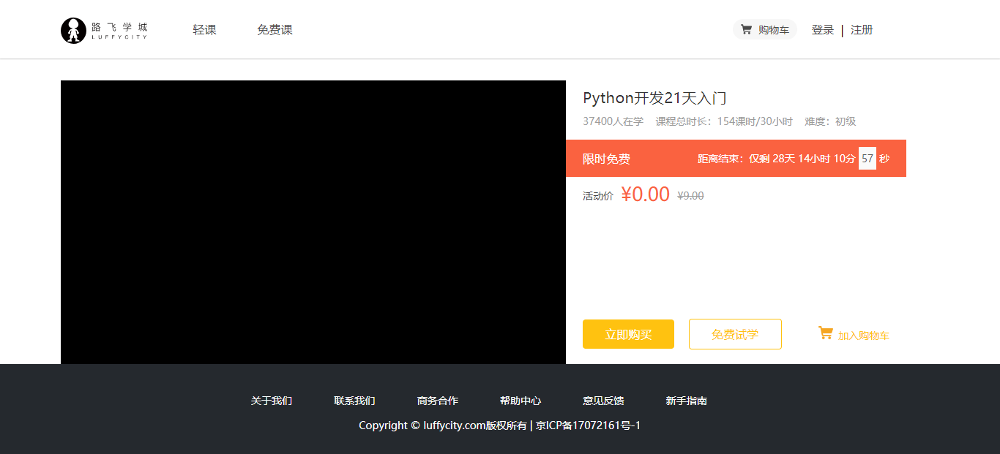

# 购物车

## 完善购物车中的数据展示


购物车新版代码

```vue
<template>
  <div class="cart">
    <Header></Header>
    <div class="main">
      <div class="shopping-cart-wrap">
        <h3 class="shopping-cart-tit">
          我的购物车
          <small>
            共
            <span>2</span>
            门课程
          </small>
        </h3>
        <div class="content">
          <el-table
            ref="multipleTable"
            :data="tableData"
            tooltip-effect="dark"
            style="width: 100%"
            @selection-change="handleSelectionChange">
            <el-table-column
              type="selection"
              width="80">
            </el-table-column>
            <el-table-column
              prop="title"
              label="课程"
              width="540">
              <template slot-scope="scope">
                
                <router-link :to="scope.row.addr">{{scope.row.desc}}</router-link>
              </template>
            </el-table-column>
            <el-table-column
              label="有效期"
              width="216">
              <!-- 关于有效期的下拉菜单，我们使用element-ui中的表单里面的一个下拉菜单 -->
              <template slot-scope="scope">
                <div class="c1">
                  <el-form ref="form" :model="scope.row.expire_list">
                    <el-form-item>
                      <el-select v-model="expire" placeholder="请选择活动区域">
                        <el-option v-for="item in expire_list" :label="item.title" :value="item.id" :key="item.id"></el-option>

                      </el-select>
                    </el-form-item>
                  </el-form>
                </div>
              </template>

            </el-table-column>
            <el-table-column
              label="价格"
              width="162">
              <template slot-scope="scope">
                ￥{{scope.row.price}}
              </template>
            </el-table-column>
            <el-table-column
              label="操作"
              width="162"
              show-overflow-tooltip>
              <template slot-scope="scope">
                <router-link to="/cart" class="do-btn">删除</router-link>
              </template>
            </el-table-column>

          </el-table>
        </div>
        <ul class="pas-left">
          <li class="charge-list">
            <input type="checkbox" class="select_all" id="color-input-red" width="20px" height="20px">
            <span class="shopping-cart-bot-font" style="margin-left: 15px; cursor: pointer">全选</span>
          </li>
          <li class="charge-list" style="margin-left: 58px;">
            
            <span class="shopping-cart-bot-font" style="margin-left: 15px; cursor: pointer; border: 0;" >删除</span>
          </li>
          <li class="charge-list" style="margin-left: auto">
            <span class="shopping-cart-bot-font" style="margin-right: 62px">总计: <b>0.0</b>￥</span>
            <button class="go-charge-btn">去结算</button>
          </li>

        </ul>
      </div>
    </div>
    <Footer></Footer>
  </div>
</template>

<script>
  import Header from "./common/Header";
  import Footer from "./common/Footer";

  export default {
    name: "Cart",
    data() {
      return {
        expire:'1个月有效',
        token: true,
        expire_list: [
          {id: 1, title: '1个月有效'},
          {id: 2, title: '3个月有效'},
          {id: 3, title: '6个月有效'},
        ],
        tableData: [
          {
            title: '2016-05-02',
            expire: '三个月过期',
            img_src: '../../static/shopcarshow.jpeg',
            addr: '/cart',
            desc: '傻逼alex',
            price: '1',
          },
          {
            title: '2016-05-02',
            expire: '三个月过期',
            img_src: '../../static/shopcarshow.jpeg',
            addr: '/cart',
            desc: '傻逼alex',
            price: '2',
          },
        ]
      }
    },
    components: {
      Header,
      Footer,
    },
    methods: {
      handleSelectionChange(val) {
        this.multipleSelection = val;
      }
    }
  }
</script>

<style scoped>

  .main {
    width: 100%;
    /*flex: 1;*/
    /*flex-grow: 1;*/
    /*flex-direction: column;*/
  }

  .shopping-cart-wrap {
    width: 1200px;
    margin: 0 auto;
  }

  .shopping-cart-tit {
    font-size: 18px;
    color: #666;
    margin: 25px 0;
    font-family: PingFangSC-Regular;
  }

  .shopping-cart-tit small {
    font-size: 12px;
    color: #d0d0d0;
    display: inline-block;
    font-family: PingFangSC-Regular;
  }

  .content {
    width: 100%;
  }


  .content img {
    width: 175px;
    height: auto;
    margin-right: 35px;
  }

  .do-btn {
    border: none;
    outline: none;
    background: none;
    font-size: 14px;
    color: #ffc210;
    margin-right: 15px;
    font-family: PingFangSC-Regular;
  }
  .c1 /deep/ .el-form-item__content{
    /*注意：element-ui中的标签都是自动生成的，这些标签其实并不是我们自己在文档中写的，所以我们直接使用它翻译出来的标签的class类值来找对应的标签进行修改是找不到，所以如果希望scoped 样式中的选择器“深入”，也就是修改当前组件的element-ui插件的样式，即影响子组件，则可以使用 >>> 组合器，但是需要我们确保使用的element-ui标签外层有一个我们自己写的父级标签，举个例子：比如我写的父级标签的class类值为a，里面的element-ui的标签类值为el-form-item，我想修改el-form-item的样式，那么就要这么写选择器：.a >>> .el-form-item{color:'red';},这就可以了，但是官方文档中的方法说某些预处理器（如Sass）可能无法对>>>符号正确解析。在这些情况下，你可以使用 /deep/ 组合器 和 >>>符号完全相同。例如.a /deep/ .el-form-item{color:'red';}，当然，我们还可以直接在APP这个全局组件中直接进行样式修改，但是如果进行全局样式修改会污染其他组件中使用了这个插件的样式，所以不建议在全局修改样式*/
    margin-top: 20px;
    width: 120px;
  }

  .shopping-cart-wrap .pas-left{
    width: 100%;
    height: 80px;
    background: #F7F7F7;
    margin-bottom: 100px;
    margin-top: 50px;
    display: flex;
    align-items: center;
    padding-left: 25px!important;
  }
  .charge-list{
    display: flex;
    align-items: center;
    list-style: none;
  }
  .charge-list .shopping-cart-bot-font{
    font-size: 18px;
    color: #666;
    font-family: PingFangSC-Regular;
  }
  .charge-list .go-charge-btn{
    width: 159px;
    height: 80px;
    outline: none;
    border: none;
    background: #ffc210;
    font-size: 18px;
    color: #fff;
    font-family: PingFangSC-Regular;
  }

</style>

```


# 课程详情页

创建课程详情页的组件Detail.vue，基本代码结构：

```vue
<template>
    <div class="detail">
      <Header/>
      <div class="main">

      </div>
      <Footer/>
    </div>
</template>

<script>
import Header from "./common/Header"
import Footer from "./common/Footer"
export default {
    name: "Detail",
    data(){
      return {}
    },
    components:{
      Header,
      Footer,
    }
}
</script>

<style scoped>

</style>
```


在router/index.js中增加路由

```javascript
import Detail from "@/components/Detail"

  // 路由规则
  routes:[
    ,{
      name:"Detail",
      path: "/detail",
      component: Detail,
    },
  ]
})

```

在课程列表页Course.vue中的li里面新增一个router-link 跳转链接。

```vue
<template>
  <div class="course">
    <Header/>
    <div class="main">
      <!-- 筛选功能 -->
      <div class="top">
        <ul class="condition condition1">
          <li class="cate-condition">课程分类:</li>
          <li class="item current">全部</li>
          <li class="item">Python</li>
          <li class="item">Linux运维</li>
          <li class="item">Python进阶</li>
          <li class="item">开发工具</li>
          <li class="item">Go语言</li>
          <li class="item">机器学习</li>
          <li class="item">技术生涯</li>
        </ul>
        <ul class="condition condition2">
          <li class="cate-condition">筛&nbsp;&nbsp;&nbsp;&nbsp;&nbsp;&nbsp;&nbsp;&nbsp;选:</li>
          <li class="item current">默认</li>
          <li class="item">人气</li>
          <li class="item price">价格</li>
          <li class="course-length">共21个课程</li>
        </ul>
      </div>
      <!-- 课程列表 --->
      <div class="list">
        <ul>
          <li class="course-item">
            <router-link to="/detail" class="course-link">
              <div class="course-cover">...
              <div class="course-info">...               
            </router-link>
          </li>
          ...../// 省略代码
</template>


<style scoped>
.course-link{
  overflow: hidden;
}
</style>
```


### 课程基本信息展示

Detail.vue，代码：

```vue
<template>
    <div class="detail">
      <Header/>
      <div class="main">
        <div class="course-info">
          <div class="wrap-left"></div>
          <div class="wrap-right">
            <h3 class="name">Linux系统基础5周入门精讲</h3>
            <p class="data">23475人在学&nbsp;&nbsp;&nbsp;&nbsp;课程总时长：148课时/180小时&nbsp;&nbsp;&nbsp;&nbsp;难度：初级</p>
            <div class="sale-time">
              <p class="sale-type">限时免费</p>
              <p class="expire">距离结束：仅剩 01天 04小时 33分 <span class="second">08</span> 秒</p>
            </div>
            <p class="course-price">
              <span>活动价</span>
              <span class="discount">¥0.00</span>
              <span class="original">¥29.00</span>
            </p>
            <div class="buy">
              <div class="buy-btn">
                <button class="buy-now">立即购买</button>
                <button class="free">免费试学</button>
              </div>
              <div class="add-cart">加入购物车</div>
            </div>
          </div>
        </div>
      </div>
      <Footer/>
    </div>
</template>

<script>
import Header from "./common/Header"
import Footer from "./common/Footer"
export default {
    name: "Detail",
    data(){
      return {}
    },
    components:{
      Header,
      Footer,
    }
}
</script>

<style scoped>
.main{
  background: #fff;
  padding-top: 80px;
}
.course-info{
  width: 1200px;
  margin: 0 auto;
  overflow: hidden;
}
.wrap-left{
  float: left;
  width: 690px;
  height: 388px;
  background-color: #000;
}
.wrap-right{
  float: left;
  position: relative;
  height: 388px;
}
.name{
  font-size: 20px;
  color: #333;
  padding: 10px 23px;
  letter-spacing: .45px;
}
.data{
  padding-left: 23px;
  padding-right: 23px;
  padding-bottom: 16px;
  font-size: 14px;
  color: #9b9b9b;
}
.sale-time{
  width: 464px;
  background: #fa6240;
  font-size: 14px;
  color: #4a4a4a;
  padding: 10px 23px;
  overflow: hidden;
}
.sale-type {
  font-size: 16px;
  color: #fff;
  letter-spacing: .36px;
  float: left;
}
.sale-time .expire{
  font-size: 14px;
  color: #fff;
  float: right;
}
.sale-time .expire .second{
  width: 24px;
  display: inline-block;
  background: #fafafa;
  color: #5e5e5e;
  padding: 6px 0;
  text-align: center;
}
.course-price{
  background: #fff;
  font-size: 14px;
  color: #4a4a4a;
  padding: 5px 23px;
}
.discount{
  font-size: 26px;
  color: #fa6240;
  margin-left: 10px;
  display: inline-block;
  margin-bottom: -5px;
}
.original{
  font-size: 14px;
  color: #9b9b9b;
  margin-left: 10px;
  text-decoration: line-through;
}
.buy{
  width: 464px;
  padding: 0px 23px;
  position: absolute;
  left: 0;
  bottom: 20px;
  overflow: hidden;
}
.buy .buy-btn{
  float: left;
}
.buy .buy-now{
  width: 125px;
  height: 40px;
  border: 0;
  background: #ffc210;
  border-radius: 4px;
  color: #fff;
  cursor: pointer;
  margin-right: 15px;
  outline: none;
}
.buy .free{
  width: 125px;
  height: 40px;
  border-radius: 4px;
  cursor: pointer;
  margin-right: 15px;
  background: #fff;
  color: #ffc210;
  border: 1px solid #ffc210;
}
.add-cart{
  float: right;
  font-size: 14px;
  color: #ffc210;
  text-align: center;
  cursor: pointer;
  margin-top: 10px;
}
.add-cart img{
  width: 20px;
  height: 18px;
  margin-right: 7px;
  vertical-align: middle;
}
</style>
```

效果:




新版的课程详情页

```vue
<template>
    <div class="detail">
      <Header></Header>
      <div class="routerView">
        <div class="course-intro">
          <div class="intro-top" style="background: rgb(95, 58, 72);">
            <p class="return active">
              
              返回免费课主页
            </p>

            <div class="intro-data">
              <h1>Python21天入门</h1>
              <p>
                <span>
                  课程小节：
                  <b>87</b>
                  小节
                </span>
                <span>
                  时长：
                  <b>19</b>
                  小时

                </span>
                <span>
                  <b>78511</b>
                  人在学
                </span>
              </p>
            </div>

            <div class="course-nav" style="background: rgb(95, 58, 72);">
              <ul>
                <li class="this">
                  <p>课程详情</p>
                </li>
                <li>
                  <p>讨论提问</p>
                  <span>(236)</span>

                </li>
                <li>
                  <p>课件下载</p>
                </li>
              </ul>
            </div>
          </div>
          <div class="course-intro-item">
            <div class="intro-content">
              <div class="course-item-box">
                <div class="content-item">
                  <div class="title">介绍</div>
                  <article>
                    即使之前你从未写过1行代码，也能在学完本课程后，达到Python入门水平，能开发300-500行代码的小程序，掌握基本的编程思维、软件设计方法。无论你日后想做人工智能、数据分析，还是WEB开发、爬虫、大数据等，都应该先把这部分基础掌握。
                  </article>
                  <div class="title">你将会学到的</div>
                  <ul>
                    <li>
                      
                      <p>学会Python基础语法</p>
                    </li>
                    <li>
                      
                      <p>学会Python基础语法</p>
                    </li>
                    <li>
                      
                      <p>掌握Python字符编码&数据类型</p>
                    </li>
                  </ul>
                </div>
                <div class="course-outline">
                  <div class="title">
                    <p class="title-name">
                      课程大纲
                    </p>
                    <p class="title-side">
                      <span>全部收起</span>
                      <span>
                        <b>87</b>
                        小节
                      </span>
                      <span>
                        18:31:54
                      </span>
                    </p>
                  </div>

<!--                  大纲部分-->
                  <ul class="outline-list">
                    <li class="list-data">
                      <div class="list-data-title">
                        <div class="list-name">
                          
                          
                          <p>第1章·基本语法</p>
                        </div>
                        <div class="list-num">
                          <span class="section-num hide">
                            <b>28</b>
                            小节
                          </span>
                          <span>
                            4:42:34
                          </span>
                        </div>
                      </div>
                      <ul class="list-data-item">
                        <li class="login">
                          <div class="data-item-name">
                            
                            
                            <p>
                              1
                              .
                              1
                              编程语言是如何演变过来的
                            </p>
                          </div>
                          <div class="data-item-num">
                            <span class="type">预览</span>
                            <span class="time">17:50</span>
                          </div>
                        </li>
                        <li class="login">
                          <div class="data-item-name">
                            
                            
                            <p>
                              1
                              .
                              1
                              编程语言是如何演变过来的
                            </p>
                          </div>
                          <div class="data-item-num">
                            <span class="type">预览</span>
                            <span class="time">17:50</span>
                          </div>
                        </li>
                        <li class="login">
                          <div class="data-item-name">
                            
                            
                            <p>
                              1
                              .
                              1
                              编程语言是如何演变过来的
                            </p>
                          </div>
                          <div class="data-item-num">
                            <span class="type">预览</span>
                            <span class="time">17:50</span>
                          </div>
                        </li>
                        <li class="login">
                          <div class="data-item-name">
                            
                            
                            <p>
                              1
                              .
                              1
                              编程语言是如何演变过来的
                            </p>
                          </div>
                          <div class="data-item-num">
                            <span class="type">预览</span>
                            <span class="time">17:50</span>
                          </div>
                        </li>
                        <li class="login">
                          <div class="data-item-name">
                            
                            
                            <p>
                              1
                              .
                              1
                              编程语言是如何演变过来的
                            </p>
                          </div>
                          <div class="data-item-num">
                            <span class="type">预览</span>
                            <span class="time">17:50</span>
                          </div>
                        </li>
                        <li class="login">
                          <div class="data-item-name">
                            
                            
                            <p>
                              1
                              .
                              1
                              编程语言是如何演变过来的
                            </p>
                          </div>
                          <div class="data-item-num">
                            <span class="type">预览</span>
                            <span class="time">17:50</span>
                          </div>
                        </li>
                      </ul>
                    </li>
                    <li class="list-data">
                      <div class="list-data-title">
                        <div class="list-name">
                          
                          
                          <p>第1章·基本语法</p>
                        </div>
                        <div class="list-num">
                          <span class="section-num hide">
                            <b>28</b>
                            小节
                          </span>
                          <span>
                            4:42:34
                          </span>
                        </div>
                      </div>
                      <ul class="list-data-item">
                        <li class="login">
                          <div class="data-item-name">
                            
                            
                            <p>
                              1
                              .
                              1
                              编程语言是如何演变过来的
                            </p>
                          </div>
                          <div class="data-item-num">
                            <span class="type">预览</span>
                            <span class="time">17:50</span>
                          </div>
                        </li>
                        <li class="login">
                          <div class="data-item-name">
                            
                            
                            <p>
                              1
                              .
                              1
                              编程语言是如何演变过来的
                            </p>
                          </div>
                          <div class="data-item-num">
                            <span class="type">预览</span>
                            <span class="time">17:50</span>
                          </div>
                        </li>
                        <li class="login">
                          <div class="data-item-name">
                            
                            
                            <p>
                              1
                              .
                              1
                              编程语言是如何演变过来的
                            </p>
                          </div>
                          <div class="data-item-num">
                            <span class="type">预览</span>
                            <span class="time">17:50</span>
                          </div>
                        </li>
                        <li class="login">
                          <div class="data-item-name">
                            
                            
                            <p>
                              1
                              .
                              1
                              编程语言是如何演变过来的
                            </p>
                          </div>
                          <div class="data-item-num">
                            <span class="type">预览</span>
                            <span class="time">17:50</span>
                          </div>
                        </li>
                        <li class="login">
                          <div class="data-item-name">
                            
                            
                            <p>
                              1
                              .
                              1
                              编程语言是如何演变过来的
                            </p>
                          </div>
                          <div class="data-item-num">
                            <span class="type">预览</span>
                            <span class="time">17:50</span>
                          </div>
                        </li>
                        <li class="login">
                          <div class="data-item-name">
                            
                            
                            <p>
                              1
                              .
                              1
                              编程语言是如何演变过来的
                            </p>
                          </div>
                          <div class="data-item-num">
                            <span class="type">预览</span>
                            <span class="time">17:50</span>
                          </div>
                        </li>
                      </ul>
                    </li>
                  </ul>
                </div>
              </div>
            </div>

<!--            右侧边栏-->
            <div class="course-side">
              <div class="side-video">
                <div class="video-box">
                  
                  <p>
                    
                  </p>
                </div>
                <div class="student-prower">
                  <div class="title">
                    学霸团专属权益
                  </div>
                  <ul>
                    <li>
                      
                      <p>课件下载</p>
                    </li>
                    <li>
                      
                      <p>定期公开课</p>
                    </li>
                    <li>
                      
                      <p>
                        学员交流
                        <br>
                        QQ群：
                        701031800
                      </p>
                    </li>
                    <li>
                      
                      <p>导师答疑</p>
                    </li>
                  </ul>
                  <p class="btns start-study">继续学习</p>
                  <a target="_blank" class="btns add-team" href="https://jq.qq.com/?_wv=1027&k=5XfBMXm">加入学霸团</a>

                </div>
              </div>
<!--              <div class="side-video"></div>-->
            </div>
          </div>
          <div class="preview-video beyond"></div>
        </div>
      </div>
      <Footer></Footer>
    </div>
</template>

<script>
    import Header from "./common/Header";
    import Footer from "./common/Footer";
    export default {
        name: "Detail",
      components:{
          Header,
          Footer,
      }
    }
</script>

<style scoped>

  .course-intro-item .course-side{
    width: 374px;
    height: auto;
    margin-top: -260px;
    float: right;
    z-index: 2;
    position: relative;
  }
  .course-intro-item .course-side .side-video{
    width: 100%;
    height: auto;
    background: #fff;
    border-radius: 6px;
    box-shadow: 0 2px 4px 0 #f3f3f3;
    border: 1px solid #e8e8e8;
  }
  .course-intro-item .course-side .side-video .video-box{
    width: 100%;
    height: auto;
    position: relative;
    padding: 5px 4px 27px;
    box-sizing: border-box;
    cursor: pointer;
  }
  .course-intro-item .course-side .side-video .video-box img{
    width: 100%;
    height: auto;
  }
  .course-intro-item .course-side .side-video .video-box p{
    width: 104px;
    height: 104px;
    border-radius: 100%;
    background: hsla(0,0%,100%,.2);
    position: absolute;
    left: 50%;
    top: 50%;
    margin-left: -52px;
    margin-top: -62px;
    text-align: center;
    line-height: 104px;
  }
  .course-intro-item .course-side .side-video .video-box p img{
    width: 46px;
    height: auto;
    margin-left: 12px;
  }
  .course-intro-item .course-side .side-video .student-prower{
    padding: 0 31px 30px;
    box-sizing: border-box;
  }
  .course-intro-item .course-side .side-video .student-prower .title{
    color: #000;
    font-size: 15px;
    font-weight: 400;
    margin-bottom: 20px;
  }
  .course-intro-item .course-side .side-video .student-prower ul{
      width: 100%;
    height: auto;
    display: flex;
    flex-wrap: wrap;
  }
  .course-intro-item .course-side .side-video .student-prower ul li{
    margin-bottom: 18px;
    display: flex;
    align-items: center;
    margin-right: 10px;
  }
  .course-intro-item .course-side .side-video .student-prower ul li img{
    margin-right: 6px;
  }
  .course-intro-item .course-side .side-video .student-prower ul li p{
    width: 119px;
    font-size: 12px;
    color: #4a4a4a;
    overflow: hidden;
    text-overflow: ellipsis;
    white-space: nowrap;
  }

  .course-intro-item .course-side .side-video .student-prower .start-study{
    color: #fff;
    margin-top: 27px;
    margin-bottom: 12px;
    background: #ffc210;
  }
  .course-intro-item .course-side .side-video .student-prower .btns{
    width: 100%;
    height: 52px;
    line-height: 52px;
    border-radius: 2px;
    font-size: 18px;
    font-weight: 500;
    padding-left: 111px;
    box-sizing: border-box;
    cursor: pointer;
    display: block;
    text-decoration: none;
  }
  .course-intro-item .course-side .side-video .student-prower .add-team{
    color: #f5a623;
    border: 1px solid #f5a623;
    box-sizing: border-box;
  }


  .course-intro-item .intro-content{
    width: 780px;
    float: left;
  }
  .intro-content .course-item-box{
    width: 100%;
    height: auto;
  }
  .course-item-box .content-item{
    width: 100%;
    height: auto;
    border-radius: 4px;
    padding: 30px 20px 15px;
    background: #f3f3f3;
    box-sizing: border-box;
    box-shadow: 0 2px 4px 0 #f3f3f3;
  }
  .content-item .title{
    color: #000;
    font-size: 22px;
  }
  .content-item article{
    font-size: 14px;
    color: #5e5e5e;
    margin-top: 10px;
    line-height: 28px;
    margin-bottom: 50px;
  }
  .content-item ul{
    width: 100%;
    display: flex;
    flex-wrap: wrap;
    margin-top: 17px;
  }
  .content-item ul li{
    display: flex;
    align-items: center;
    margin-right: 36px;
    margin-bottom: 15px;
  }
  .content-item ul li img {
    width: 18px;
    height: 18px;
    margin-right: 12px;
  }
  .content-item ul li p{
    width: 303px;
    font-size: 14px;
    color: #5e5e5e;
  }

  .course-item-box .course-outline{
    width: 100%;
  }
  .course-outline .title{
    margin-top: 50px;
    margin-bottom: 13px;
    padding-left: 17px;
    padding-right: 20px;
    display: flex;
    align-items: flex-end;
    justify-content: space-between;
    box-sizing: border-box;
  }
  .course-outline .title .title-name{
    color: #000;
    font-size: 22px;
  }
  .course-outline .title .title-side{
    display: flex;
    align-items: center;
    font-size: 14px;
  }
  .course-outline .title .title-side span:first-of-type{
    color: #2a2a2a;
    margin-right: 39px;
    cursor: pointer;
  }

  .course-outline .title .title-side span:nth-of-type(2){
    min-width: 43px;
    text-align: right;
    color: #4a4a4a;
    display: inline-block;
  }

  .course-outline .title .title-side span:nth-of-type(3){
    width: 80px;
    color: #4a4a4a;
    margin-left: 17px;
    text-align: right;
    display: inline-block;
  }
  .course-outline .outline-list{
    width: 100%;
    height: auto;
  }

  .course-outline .outline-list .list-data{
    width: 780px;
    height: auto;
    margin-bottom: 2px;
  }
  .course-outline .outline-list .list-data .list-data-title{
    height: 48px;
    display: flex;
    align-items: center;
    justify-content: space-between;
    background: #f9f9f9;
    padding-left: 26px;
    padding-right: 20px;
    border-radius: 2px;
    box-sizing: border-box;
    margin-bottom: 1px;
    cursor: pointer;
  }
  .outline-list .list-data .list-data-title .list-name{
    display: flex;
    align-items: center;
  }

  .list-data .list-data-title .list-name img{
    width: 10px;
    height: auto;
    margin-right: 15px;
  }
  .list-data .list-data-title .list-name p{
    width: 546px;
    font-size: 15px;
    color: #5e5e5e;
    overflow: hidden;
    text-overflow: ellipsis;
    white-space: nowrap;
  }

  .list-data .list-data-title .list-num{
    display: flex;
    align-items: center;
  }
  .list-data .list-data-title .list-num span:first-of-type{
    min-width: 43px;
    text-align: right;
    color: #4a4a4a;
    display: inline-block;
  }
  .list-data .list-data-title .list-num span:nth-of-type(2){
    width: 80px;
    color: #4a4a4a;
    margin-left: 17px;
    text-align: right;
    display: inline-block;
  }


  .outline-list .list-data .list-data-item {
    width: 100%;
    height: auto;
    margin-bottom: 4px;
    border-top: 1px solid #dadada;
  }

  .outline-list .list-data .list-data-item li{
    cursor: pointer;
    width: 100%;
    height: 48px;
    background: #fff;
    border-radius: 2px;
    border: 1px solid #dadada;
    border-top: none;
    display: flex;
    align-items: center;
    justify-content: space-between;
    padding-left: 50px;
    padding-right: 20px;
    box-sizing: border-box;
    color: #6ca4c5;
  }
  .outline-list .list-data .list-data-item li .data-item-name{
    display: flex;
    align-items: center;
  }
  .outline-list .list-data .list-data-item li .data-item-name img{
    width: 16px;
    height: 16px;
    margin-right: 9px;
  }
  .outline-list .list-data .list-data-item li .data-item-name .img2{
    display: none;
  }
  .outline-list .list-data .list-data-item li .data-item-name p{
    width: 430px;
    font-size: 14px;
  }

  .outline-list .list-data .list-data-item li .data-item-num{
    display: flex;
    align-items: center;
  }
  .outline-list .list-data .list-data-item li .data-item-num .type{
    min-width: 43px;
    text-align: right;
    display: inline-block;
  }
  .outline-list .list-data .list-data-item li .data-item-num .time{
    width: 80px;
    margin-left: 17px;
    text-align: right;
    display: inline-block;
  }

  .course-intro{
    width: 100%;
    display: flex;
    flex-direction: column;
    align-items: center;
    height: auto;
    /*padding-bottom: 40px;*/
  }

  .intro-top{
    width: 100%;
    display: flex;
    flex-direction: column;
    align-items: center;
    height: 300px;
    position: relative;
  }
  .intro-top .return{
    color: #fff;
    width: 1200px;
    font-size: 16px;
    font-weight: 500;
    margin-top: 30px;
    margin-bottom: 38px;
    display: flex;
    cursor: pointer;
    align-items: center;
  }
  .intro-top .return img{
    width: 6px;
    height: 11px;
    margin-right: 6px;
  }
  .intro-top .intro-data{
    width: 1200px;
    padding-left: 23px;
  }
  .intro-data h1{
    width: 780px;
    font-size: 36px;
    color: #fff;
    font-weight: 400;
    overflow: hidden;
    text-overflow: ellipsis;
    white-space: nowrap;
  }
  .intro-data p{
    width: 780px;
    color: #fff;
    font-size: 16px;
    margin-top: 8px;
  }
  .intro-data p span{
    margin-right: 26px;
  }
  .intro-top .course-nav{
    width: 100%;
    height: 72px;
    display: flex;
    align-items: center;
    flex-direction: column;
    position: absolute;
    left: 0;
    top: 228px;
  }
  .course-nav ul{
    width: 1200px;
    display: flex;
    align-items: center;
    padding-left: 23px;
    box-sizing: border-box;
  }
  .course-nav ul .this{
    color: #fff;
    font-weight: 500;
  }
  .course-nav ul li{
    font-size: 16px;
    margin-top: 14px;
    color: #e9e9e9;
    margin-right: 26px;
    display: flex;
    cursor: pointer;
    box-sizing: border-box;
  }
  .course-nav ul li p{
    padding-bottom: 4px;
  }
  .course-nav ul .this p{
    box-shadow: 0 2px 0 0 #fff;
  }
  .course-nav ul li span{
    padding-bottom: 4px;
    /*padding-top: 16px;*/
  }
  .course-intro-item{
    width: 1200px;
    margin-top: 24px;
  }


</style>

```


### 使用vue-video播放器

线上的路飞学城使用了[AliPlayer](https://player.alicdn.com/aliplayer/index.html)阿里播放器。

我们本次项目使用vue-video播放器，是专门提供给vue项目使用。使用只需要完成四个步骤:

1. 安装依赖

```bash
npm install vue-video-player --save

 npm install vue-video-player@5.0.1
```

2. 在main.js中注册加载组件

```javascript
require('video.js/dist/video-js.css');
//或者 import 'video.js/dist/video-js.css'
require('vue-video-player/src/custom-theme.css');
//或者：import 'vue-video-player/src/custom-theme.css'
import VideoPlayer from 'vue-video-player'
Vue.use(VideoPlayer);
```

3. 在课程详情页中的script标签配置播放器的参数,以下代码:

```javascript
import {videoPlayer} from 'vue-video-player'; //在我们的组件中引用这句
//导入部分，引入非 default 时，使用花括号：
//例如：import {name, age} from ‘./example’
export default {  //在我们的组件的data属性中配置相关参数，methods中配置相关的方法
  data () {
    return {
      playerOptions: {
        playbackRates: [0.7, 1.0, 1.5, 2.0], // 播放速度
        autoplay: false, //如果true,则自动播放
        muted: false, // 默认情况下将会消除任何音频。
        loop: false, // 循环播放
        preload: 'auto', // 建议浏览器在<video>加载元素后是否应该开始下载视频数据。auto浏览器选择最佳行为,立即开始加载视频（如果浏览器支持）
        language: 'zh-CN',
        aspectRatio: '16:9', // 将播放器置于流畅模式，并在计算播放器的动态大小时使用该值。值应该代表一个比例 - 用冒号分隔的两个数字（例如"16:9"或"4:3"）
        fluid: true, // 当true时，Video.js player将拥有流体大小。换句话说，它将按比例缩放以适应其容器。
        sources: [{
          type: "video/mp4",
          src: "http://img.ksbbs.com/asset/Mon_1703/05cacb4e02f9d9e.mp4" //你的视频地址（必填）
        }],
        poster: "../static/courses/675076.jpeg", //视频封面图
        width: document.documentElement.clientWidth,
        notSupportedMessage: '此视频暂无法播放，请稍后再试', //允许覆盖Video.js无法播放媒体源时显示的默认信息。
      }
    }
  },
  components: {
    videoPlayer
  },
  methods: {
    onPlayerPlay(player) {
      alert("play"); //视频点击播放时，可以加一些广告之类的前提动作
    },
    onPlayerPause(player){
      alert("pause"); //视频暂停时触发一些事情
    },
    player() { //视频的初始化，这个必须要有的
      return this.$refs.videoPlayer.player
    }
  }
}
```

在html模板中调用video-player标签显示播放器

```vue
          <div class="warp-left" style="width: 690px;height: 388px;background-color: #000;">
            <video-player class="video-player vjs-custom-skin"
                 ref="videoPlayer"
                 :playsinline="true"
                 :options="playerOptions"
                 @play="onPlayerPlay($event)"
                 @pause="onPlayerPause($event)"
            >
            </video-player>
          </div>
```


集成了编辑器以后的新的课程详情页组件代码

```vue
<template>
    <div class="detail">
      <Header></Header>
      <div class="routerView">
        <div class="course-intro">
          <div class="intro-top" style="background: rgb(95, 58, 72);">
            <p class="return active">
              
              返回免费课主页
            </p>

            <div class="intro-data">
              <h1>Python21天入门</h1>
              <p>
                <span>
                  课程小节：
                  <b>87</b>
                  小节
                </span>
                <span>
                  时长：
                  <b>19</b>
                  小时

                </span>
                <span>
                  <b>78511</b>
                  人在学
                </span>
              </p>
            </div>

            <div class="course-nav" style="background: rgb(95, 58, 72);">
              <ul>
                <li :class="{this:course_item_switch===0}" @click="course_item_switch=0">
                  <p>课程详情</p>
                </li>
                <li :class="{this:course_item_switch===1}" @click="course_item_switch=1">
                  <p>讨论提问</p>
                  <span>(236)</span>

                </li>
                <li :class="{this:course_item_switch===2}" @click="course_item_switch=2">
                  <p>课件下载</p>
                </li>
              </ul>
            </div>
          </div>
          <div class="course-intro-item">
            <div v-if="course_item_switch===0" class="intro-content">
              <div class="course-item-box">
                <div class="content-item">
                  <div class="title">介绍</div>
                  <article>
                    即使之前你从未写过1行代码，也能在学完本课程后，达到Python入门水平，能开发300-500行代码的小程序，掌握基本的编程思维、软件设计方法。无论你日后想做人工智能、数据分析，还是WEB开发、爬虫、大数据等，都应该先把这部分基础掌握。
                  </article>
                  <div class="title">你将会学到的</div>
                  <ul>
                    <li>
                      
                      <p>学会Python基础语法</p>
                    </li>
                    <li>
                      
                      <p>学会Python基础语法</p>
                    </li>
                    <li>
                      
                      <p>掌握Python字符编码&数据类型</p>
                    </li>
                  </ul>
                </div>
                <div class="course-outline">
                  <div class="title">
                    <p class="title-name">
                      课程大纲
                    </p>
                    <p class="title-side">
                      <span>全部收起</span>
                      <span>
                        <b>87</b>
                        小节
                      </span>
                      <span>
                        18:31:54
                      </span>
                    </p>
                  </div>

<!--                  大纲部分-->
                  <ul class="outline-list">
                    <li class="list-data">
                      <div class="list-data-title">
                        <div class="list-name">
                          
                          
                          <p>第1章·基本语法</p>
                        </div>
                        <div class="list-num">
                          <span class="section-num hide">
                            <b>28</b>
                            小节
                          </span>
                          <span>
                            4:42:34
                          </span>
                        </div>
                      </div>
                      <ul class="list-data-item">
                        <li class="login">
                          <div class="data-item-name">
                            
                            
                            <p>
                              1
                              .
                              1
                              编程语言是如何演变过来的
                            </p>
                          </div>
                          <div class="data-item-num">
                            <span class="type">预览</span>
                            <span class="time">17:50</span>
                          </div>
                        </li>
                        <li class="login">
                          <div class="data-item-name">
                            
                            
                            <p>
                              1
                              .
                              1
                              编程语言是如何演变过来的
                            </p>
                          </div>
                          <div class="data-item-num">
                            <span class="type">预览</span>
                            <span class="time">17:50</span>
                          </div>
                        </li>
                        <li class="login">
                          <div class="data-item-name">
                            
                            
                            <p>
                              1
                              .
                              1
                              编程语言是如何演变过来的
                            </p>
                          </div>
                          <div class="data-item-num">
                            <span class="type">预览</span>
                            <span class="time">17:50</span>
                          </div>
                        </li>
                        <li class="login">
                          <div class="data-item-name">
                            
                            
                            <p>
                              1
                              .
                              1
                              编程语言是如何演变过来的
                            </p>
                          </div>
                          <div class="data-item-num">
                            <span class="type">预览</span>
                            <span class="time">17:50</span>
                          </div>
                        </li>
                        <li class="login">
                          <div class="data-item-name">
                            
                            
                            <p>
                              1
                              .
                              1
                              编程语言是如何演变过来的
                            </p>
                          </div>
                          <div class="data-item-num">
                            <span class="type">预览</span>
                            <span class="time">17:50</span>
                          </div>
                        </li>
                        <li class="login">
                          <div class="data-item-name">
                            
                            
                            <p>
                              1
                              .
                              1
                              编程语言是如何演变过来的
                            </p>
                          </div>
                          <div class="data-item-num">
                            <span class="type">预览</span>
                            <span class="time">17:50</span>
                          </div>
                        </li>
                      </ul>
                    </li>
                    <li class="list-data">
                      <div class="list-data-title">
                        <div class="list-name">
                          
                          
                          <p>第1章·基本语法</p>
                        </div>
                        <div class="list-num">
                          <span class="section-num hide">
                            <b>28</b>
                            小节
                          </span>
                          <span>
                            4:42:34
                          </span>
                        </div>
                      </div>
                      <ul class="list-data-item">
                        <li class="login">
                          <div class="data-item-name">
                            
                            
                            <p>
                              1
                              .
                              1
                              编程语言是如何演变过来的
                            </p>
                          </div>
                          <div class="data-item-num">
                            <span class="type">预览</span>
                            <span class="time">17:50</span>
                          </div>
                        </li>
                        <li class="login">
                          <div class="data-item-name">
                            
                            
                            <p>
                              1
                              .
                              1
                              编程语言是如何演变过来的
                            </p>
                          </div>
                          <div class="data-item-num">
                            <span class="type">预览</span>
                            <span class="time">17:50</span>
                          </div>
                        </li>
                        <li class="login">
                          <div class="data-item-name">
                            
                            
                            <p>
                              1
                              .
                              1
                              编程语言是如何演变过来的
                            </p>
                          </div>
                          <div class="data-item-num">
                            <span class="type">预览</span>
                            <span class="time">17:50</span>
                          </div>
                        </li>
                        <li class="login">
                          <div class="data-item-name">
                            
                            
                            <p>
                              1
                              .
                              1
                              编程语言是如何演变过来的
                            </p>
                          </div>
                          <div class="data-item-num">
                            <span class="type">预览</span>
                            <span class="time">17:50</span>
                          </div>
                        </li>
                        <li class="login">
                          <div class="data-item-name">
                            
                            
                            <p>
                              1
                              .
                              1
                              编程语言是如何演变过来的
                            </p>
                          </div>
                          <div class="data-item-num">
                            <span class="type">预览</span>
                            <span class="time">17:50</span>
                          </div>
                        </li>
                        <li class="login">
                          <div class="data-item-name">
                            
                            
                            <p>
                              1
                              .
                              1
                              编程语言是如何演变过来的
                            </p>
                          </div>
                          <div class="data-item-num">
                            <span class="type">预览</span>
                            <span class="time">17:50</span>
                          </div>
                        </li>
                      </ul>
                    </li>
                  </ul>
                </div>
              </div>
            </div>
            <div v-if="course_item_switch===1">
              讨论问题部分
            </div>
            <div v-if="course_item_switch===2">
              课件下载部分
            </div>
<!--            右侧边栏-->
            <div class="course-side">
              <div class="side-video">
                <div class="video-box">

                  <video-player class="video-player vjs-custom-skin"
                       ref="videoPlayer"
                       :playsinline="true"
                       :options="playerOptions"
                       @play="onPlayerPlay($event)"
                       @pause="onPlayerPause($event)"
                  >
                  </video-player>
<!--                  -->
<!--                  <p>-->
<!--                    -->
<!--                  </p>-->
                </div>
                <div class="student-prower">
                  <div class="title">
                    学霸团专属权益
                  </div>
                  <ul>
                    <li>
                      
                      <p>课件下载</p>
                    </li>
                    <li>
                      
                      <p>定期公开课</p>
                    </li>
                    <li>
                      
                      <p>
                        学员交流
                        <br>
                        QQ群：
                        701031800
                      </p>
                    </li>
                    <li>
                      
                      <p>导师答疑</p>
                    </li>
                  </ul>
                  <p class="btns start-study">继续学习</p>
                  <a target="_blank" class="btns add-team" href="https://jq.qq.com/?_wv=1027&k=5XfBMXm">加入学霸团</a>

                </div>
              </div>
<!--              <div class="side-video"></div>-->
            </div>
          </div>
          <div class="preview-video beyond"></div>
        </div>
      </div>
      <Footer></Footer>
    </div>
</template>

<script>
    import Header from "./common/Header";
    import Footer from "./common/Footer";
    import {videoPlayer} from 'vue-video-player';
    export default {
        name: "Detail",
      data(){
          return {
            course_item_switch:0,
            playerOptions: {
              playbackRates: [0.7, 1.0, 1.5, 2.0], // 播放速度
              autoplay: false, //如果true,则自动播放
              muted: false, // 默认情况下将会消除任何音频。
              loop: false, // 循环播放
              preload: 'auto', // 建议浏览器在<video>加载元素后是否应该开始下载视频数据。auto浏览器选择最佳行为,立即开始加载视频（如果浏览器支持）
              language: 'zh-CN',
              aspectRatio: '16:9', // 将播放器置于流畅模式，并在计算播放器的动态大小时使用该值。值应该代表一个比例 - 用冒号分隔的两个数字（例如"16:9"或"4:3"）
              fluid: true, // 当true时，Video.js player将拥有流体大小。换句话说，它将按比例缩放以适应其容器。
              sources: [{
                type: "video/mp4",//还可以配置其他格式
                src: "http://img.ksbbs.com/asset/Mon_1703/05cacb4e02f9d9e.mp4" //你的视频地址（必填）
              }],

              poster: "../static/PY1.png", //视频封面图
              width: document.documentElement.clientWidth,
              notSupportedMessage: '此视频暂无法播放，请稍后再试', //允许覆盖Video.js无法播放媒体源时显示的默认信息。
            }
          }
      },
      components:{
          Header,
          Footer,
      },
      methods:{
          onPlayerPlay(player) {
            alert("play");
          },
          onPlayerPause(player){
            alert("pause");
          },
          player() {
            return this.$refs.videoPlayer.player
          }
      }

    }
</script>

<style scoped>

  .course-intro-item .course-side{
    width: 374px;
    height: auto;
    margin-top: -260px;
    float: right;
    z-index: 2;
    position: relative;
  }
  .course-intro-item .course-side .side-video{
    width: 100%;
    height: auto;
    background: #fff;
    border-radius: 6px;
    box-shadow: 0 2px 4px 0 #f3f3f3;
    border: 1px solid #e8e8e8;
  }
  .course-intro-item .course-side .side-video .video-box{
    width: 100%;
    height: auto;
    position: relative;
    padding: 5px 4px 27px;
    box-sizing: border-box;
    cursor: pointer;
  }
  .course-intro-item .course-side .side-video .video-box img{
    width: 100%;
    height: auto;
  }
  .course-intro-item .course-side .side-video .video-box p{
    width: 104px;
    height: 104px;
    border-radius: 100%;
    background: hsla(0,0%,100%,.2);
    position: absolute;
    left: 50%;
    top: 50%;
    margin-left: -52px;
    margin-top: -62px;
    text-align: center;
    line-height: 104px;
  }
  .course-intro-item .course-side .side-video .video-box p img{
    width: 46px;
    height: auto;
    margin-left: 12px;
  }
  .course-intro-item .course-side .side-video .student-prower{
    padding: 0 31px 30px;
    box-sizing: border-box;
  }
  .course-intro-item .course-side .side-video .student-prower .title{
    color: #000;
    font-size: 15px;
    font-weight: 400;
    margin-bottom: 20px;
  }
  .course-intro-item .course-side .side-video .student-prower ul{
      width: 100%;
    height: auto;
    display: flex;
    flex-wrap: wrap;
  }
  .course-intro-item .course-side .side-video .student-prower ul li{
    margin-bottom: 18px;
    display: flex;
    align-items: center;
    margin-right: 10px;
  }
  .course-intro-item .course-side .side-video .student-prower ul li img{
    margin-right: 6px;
  }
  .course-intro-item .course-side .side-video .student-prower ul li p{
    width: 119px;
    font-size: 12px;
    color: #4a4a4a;
    overflow: hidden;
    text-overflow: ellipsis;
    white-space: nowrap;
  }

  .course-intro-item .course-side .side-video .student-prower .start-study{
    color: #fff;
    margin-top: 27px;
    margin-bottom: 12px;
    background: #ffc210;
  }
  .course-intro-item .course-side .side-video .student-prower .btns{
    width: 100%;
    height: 52px;
    line-height: 52px;
    border-radius: 2px;
    font-size: 18px;
    font-weight: 500;
    padding-left: 111px;
    box-sizing: border-box;
    cursor: pointer;
    display: block;
    text-decoration: none;
  }
  .course-intro-item .course-side .side-video .student-prower .add-team{
    color: #f5a623;
    border: 1px solid #f5a623;
    box-sizing: border-box;
  }


  .course-intro-item .intro-content{
    width: 780px;
    float: left;
  }
  .intro-content .course-item-box{
    width: 100%;
    height: auto;
  }
  .course-item-box .content-item{
    width: 100%;
    height: auto;
    border-radius: 4px;
    padding: 30px 20px 15px;
    background: #f3f3f3;
    box-sizing: border-box;
    box-shadow: 0 2px 4px 0 #f3f3f3;
  }
  .content-item .title{
    color: #000;
    font-size: 22px;
  }
  .content-item article{
    font-size: 14px;
    color: #5e5e5e;
    margin-top: 10px;
    line-height: 28px;
    margin-bottom: 50px;
  }
  .content-item ul{
    width: 100%;
    display: flex;
    flex-wrap: wrap;
    margin-top: 17px;
  }
  .content-item ul li{
    display: flex;
    align-items: center;
    margin-right: 36px;
    margin-bottom: 15px;
  }
  .content-item ul li img {
    width: 18px;
    height: 18px;
    margin-right: 12px;
  }
  .content-item ul li p{
    width: 303px;
    font-size: 14px;
    color: #5e5e5e;
  }

  .course-item-box .course-outline{
    width: 100%;
  }
  .course-outline .title{
    margin-top: 50px;
    margin-bottom: 13px;
    padding-left: 17px;
    padding-right: 20px;
    display: flex;
    align-items: flex-end;
    justify-content: space-between;
    box-sizing: border-box;
  }
  .course-outline .title .title-name{
    color: #000;
    font-size: 22px;
  }
  .course-outline .title .title-side{
    display: flex;
    align-items: center;
    font-size: 14px;
  }
  .course-outline .title .title-side span:first-of-type{
    color: #2a2a2a;
    margin-right: 39px;
    cursor: pointer;
  }

  .course-outline .title .title-side span:nth-of-type(2){
    min-width: 43px;
    text-align: right;
    color: #4a4a4a;
    display: inline-block;
  }

  .course-outline .title .title-side span:nth-of-type(3){
    width: 80px;
    color: #4a4a4a;
    margin-left: 17px;
    text-align: right;
    display: inline-block;
  }
  .course-outline .outline-list{
    width: 100%;
    height: auto;
  }

  .course-outline .outline-list .list-data{
    width: 780px;
    height: auto;
    margin-bottom: 2px;
  }
  .course-outline .outline-list .list-data .list-data-title{
    height: 48px;
    display: flex;
    align-items: center;
    justify-content: space-between;
    background: #f9f9f9;
    padding-left: 26px;
    padding-right: 20px;
    border-radius: 2px;
    box-sizing: border-box;
    margin-bottom: 1px;
    cursor: pointer;
  }
  .outline-list .list-data .list-data-title .list-name{
    display: flex;
    align-items: center;
  }

  .list-data .list-data-title .list-name img{
    width: 10px;
    height: auto;
    margin-right: 15px;
  }
  .list-data .list-data-title .list-name p{
    width: 546px;
    font-size: 15px;
    color: #5e5e5e;
    overflow: hidden;
    text-overflow: ellipsis;
    white-space: nowrap;
  }

  .list-data .list-data-title .list-num{
    display: flex;
    align-items: center;
  }
  .list-data .list-data-title .list-num span:first-of-type{
    min-width: 43px;
    text-align: right;
    color: #4a4a4a;
    display: inline-block;
  }
  .list-data .list-data-title .list-num span:nth-of-type(2){
    width: 80px;
    color: #4a4a4a;
    margin-left: 17px;
    text-align: right;
    display: inline-block;
  }


  .outline-list .list-data .list-data-item {
    width: 100%;
    height: auto;
    margin-bottom: 4px;
    border-top: 1px solid #dadada;
  }

  .outline-list .list-data .list-data-item li{
    cursor: pointer;
    width: 100%;
    height: 48px;
    background: #fff;
    border-radius: 2px;
    border: 1px solid #dadada;
    border-top: none;
    display: flex;
    align-items: center;
    justify-content: space-between;
    padding-left: 50px;
    padding-right: 20px;
    box-sizing: border-box;
    color: #6ca4c5;
  }
  .outline-list .list-data .list-data-item li .data-item-name{
    display: flex;
    align-items: center;
  }
  .outline-list .list-data .list-data-item li .data-item-name img{
    width: 16px;
    height: 16px;
    margin-right: 9px;
  }
  .outline-list .list-data .list-data-item li .data-item-name .img2{
    display: none;
  }
  .outline-list .list-data .list-data-item li .data-item-name p{
    width: 430px;
    font-size: 14px;
  }

  .outline-list .list-data .list-data-item li .data-item-num{
    display: flex;
    align-items: center;
  }
  .outline-list .list-data .list-data-item li .data-item-num .type{
    min-width: 43px;
    text-align: right;
    display: inline-block;
  }
  .outline-list .list-data .list-data-item li .data-item-num .time{
    width: 80px;
    margin-left: 17px;
    text-align: right;
    display: inline-block;
  }

  .course-intro{
    width: 100%;
    display: flex;
    flex-direction: column;
    align-items: center;
    height: auto;
    /*padding-bottom: 40px;*/
  }

  .intro-top{
    width: 100%;
    display: flex;
    flex-direction: column;
    align-items: center;
    height: 300px;
    position: relative;
  }
  .intro-top .return{
    color: #fff;
    width: 1200px;
    font-size: 16px;
    font-weight: 500;
    margin-top: 30px;
    margin-bottom: 38px;
    display: flex;
    cursor: pointer;
    align-items: center;
  }
  .intro-top .return img{
    width: 6px;
    height: 11px;
    margin-right: 6px;
  }
  .intro-top .intro-data{
    width: 1200px;
    padding-left: 23px;
  }
  .intro-data h1{
    width: 780px;
    font-size: 36px;
    color: #fff;
    font-weight: 400;
    overflow: hidden;
    text-overflow: ellipsis;
    white-space: nowrap;
  }
  .intro-data p{
    width: 780px;
    color: #fff;
    font-size: 16px;
    margin-top: 8px;
  }
  .intro-data p span{
    margin-right: 26px;
  }
  .intro-top .course-nav{
    width: 100%;
    height: 72px;
    display: flex;
    align-items: center;
    flex-direction: column;
    position: absolute;
    left: 0;
    top: 228px;
  }
  .course-nav ul{
    width: 1200px;
    display: flex;
    align-items: center;
    padding-left: 23px;
    box-sizing: border-box;
  }
  .course-nav ul .this{
    color: #fff;
    font-weight: 500;
  }
  .course-nav ul li{
    font-size: 16px;
    margin-top: 14px;
    color: #e9e9e9;
    margin-right: 26px;
    display: flex;
    cursor: pointer;
    box-sizing: border-box;
  }
  .course-nav ul li p{
    padding-bottom: 4px;
  }
  .course-nav ul .this p{
    box-shadow: 0 2px 0 0 #fff;
  }
  .course-nav ul li span{
    padding-bottom: 4px;
    /*padding-top: 16px;*/
  }
  .course-intro-item{
    width: 1200px;
    margin-top: 24px;
  }


</style>

```

### 完成课程的选项卡内容部分以及讲师信息

```vue
<template>
    <div class="detail">
      <Header/>
      <div class="main">
        <div class="course-info">
          <div class="wrap-left">
            <video-player class="video-player vjs-custom-skin"
               ref="videoPlayer"
               :playsinline="true"
               :options="playerOptions"
               @play="onPlayerPlay($event)"
               @pause="onPlayerPause($event)"
            >
            </video-player>
          </div>
          <div class="wrap-right">
            <h3 class="course-name">Linux系统基础5周入门精讲</h3>
            <p class="data">23475人在学&nbsp;&nbsp;&nbsp;&nbsp;课程总时长：148课时/180小时&nbsp;&nbsp;&nbsp;&nbsp;难度：初级</p>
            <div class="sale-time">
              <p class="sale-type">限时免费</p>
              <p class="expire">距离结束：仅剩 01天 04小时 33分 <span class="second">08</span> 秒</p>
            </div>
            <p class="course-price">
              <span>活动价</span>
              <span class="discount">¥0.00</span>
              <span class="original">¥29.00</span>
            </p>
            <div class="buy">
              <div class="buy-btn">
                <button class="buy-now">立即购买</button>
                <button class="free">免费试学</button>
              </div>
              <div class="add-cart">加入购物车</div>
            </div>
          </div>
        </div>
        <div class="course-tab">
          <ul class="tab-list">
            <li :class="tabIndex==1?'active':''" @click="tabIndex=1">详情介绍</li>
            <li :class="tabIndex==2?'active':''" @click="tabIndex=2">课程章节 <span :class="tabIndex!=2?'free':''">(试学)</span></li>
            <li :class="tabIndex==3?'active':''" @click="tabIndex=3">用户评论 (42)</li>
            <li :class="tabIndex==4?'active':''" @click="tabIndex=4">常见问题</li>
          </ul>
        </div>
        <div class="course-content">
          <div class="course-tab-list">
            <div class="tab-item" v-if="tabIndex==1">
              <p></p>
              <p></p>
              <p></p>
            </div>
            <div class="tab-item" v-if="tabIndex==2">
              <div class="tab-item-title">
                <p class="chapter">课程章节</p>
                <p class="chapter-length">共11章 147个课时</p>
              </div>
              <div class="chapter-item">
                <!-- <p class="chapter-title">第1章·Linux硬件基础</p> -->
                <p class="chapter-title">第1章·Linux硬件基础</p>
                <ul class="lesson-list">
                  <li class="lesson-item">
                    <p class="name"><span class="index">1-1</span> 课程介绍-学习流程<span class="free">免费</span></p>
                    <p class="time">07:30 </p>
                    <button class="try">立即试学</button>
                  </li>
                  <li class="lesson-item">
                    <p class="name"><span class="index">1-2</span> 服务器硬件-详解<span class="free">免费</span></p>
                    <p class="time">07:30 </p>
                    <button class="try">立即试学</button>
                  </li>
                </ul>
              </div>
              <div class="chapter-item">
                <!-- <p class="chapter-title">第2章·Linux发展过程</p> -->
                <p class="chapter-title">第2章·Linux发展过程</p>
                <ul class="lesson-list">
                  <li class="lesson-item">
                    <p class="name"><span class="index">2-1</span> 操作系统组成-Linux发展过程</p>
                    <p class="time">07:30 </p>
                    <button class="try">立即购买</button>
                  </li>
                  <li class="lesson-item">
                    <p class="name"><span class="index">2-2</span> 自由软件-GNU-GPL核心讲解</p>
                    <p class="time">07:30 </p>
                    <button class="try">立即购买</button>
                  </li>
                </ul>
              </div>
            </div>
            <div class="tab-item" v-if="tabIndex==3">
              用户评论
            </div>
            <div class="tab-item" v-if="tabIndex==4">
              常见问题
            </div>
          </div>
          <div class="course-side">
             <div class="teacher-info">
               <h4 class="side-title"><span>授课老师</span></h4>
               <div class="teacher-content">
                 <div class="cont1">
                   
                   <div class="name">
                     <p class="teacher-name">李泳谊</p>
                     <p class="teacher-title">老男孩LInux学科带头人</p>
                   </div>
                 </div>
                 <p class="narrative" >Linux运维技术专家，老男孩Linux金牌讲师，讲课风趣幽默、深入浅出、声音洪亮到爆炸</p>
               </div>
             </div>
          </div>
        </div>
      </div>
      <Footer/>
    </div>
</template>

<script>
import Header from "./common/Header"
import Footer from "./common/Footer"

import {videoPlayer} from 'vue-video-player';

export default {
    name: "Detail",
    data(){
      return {
        tabIndex:2, // 当前选项卡显示的下标
        playerOptions: {
          playbackRates: [0.7, 1.0, 1.5, 2.0], // 播放速度
          autoplay: false, //如果true,则自动播放
          muted: false, // 默认情况下将会消除任何音频。
          loop: false, // 循环播放
          preload: 'auto',  // 建议浏览器在<video>加载元素后是否应该开始下载视频数据。auto浏览器选择最佳行为,立即开始加载视频（如果浏览器支持）
          language: 'zh-CN',
          aspectRatio: '16:9', // 将播放器置于流畅模式，并在计算播放器的动态大小时使用该值。值应该代表一个比例 - 用冒号分隔的两个数字（例如"16:9"或"4:3"）
          fluid: true, // 当true时，Video.js player将拥有流体大小。换句话说，它将按比例缩放以适应其容器。
          sources: [{ // 播放资源和资源格式
            type: "video/mp4",
            src: "http://img.ksbbs.com/asset/Mon_1703/05cacb4e02f9d9e.mp4" //你的视频地址（必填）
          }],
          poster: "../static/courses/675076.jpeg", //视频封面图
          width: document.documentElement.clientWidth, // 默认视频全屏时的最大宽度
          notSupportedMessage: '此视频暂无法播放，请稍后再试', //允许覆盖Video.js无法播放媒体源时显示的默认信息。
        }
      }
    },
    methods: {
      // 视频播放事件
      onPlayerPlay(player) {
        alert("play");
      },
      // 视频暂停播放事件
      onPlayerPause(player){
        alert("pause");
      },
      // 视频插件初始化
      player() {
        return this.$refs.videoPlayer.player;
      }
    },
    components:{
      Header,
      Footer,
      videoPlayer,
    }
}
</script>

<style scoped>
.main{
  background: #fff;
  padding-top: 80px;
}
.course-info{
  width: 1200px;
  margin: 0 auto;
  overflow: hidden;
}
.wrap-left{
  float: left;
  width: 690px;
  height: 388px;
  background-color: #000;
}
.wrap-right{
  float: left;
  position: relative;
  height: 388px;
}
.course-name{
  font-size: 20px;
  color: #333;
  padding: 10px 23px;
  letter-spacing: .45px;
}
.data{
  padding-left: 23px;
  padding-right: 23px;
  padding-bottom: 16px;
  font-size: 14px;
  color: #9b9b9b;
}
.sale-time{
  width: 464px;
  background: #fa6240;
  font-size: 14px;
  color: #4a4a4a;
  padding: 10px 23px;
  overflow: hidden;
}
.sale-type {
  font-size: 16px;
  color: #fff;
  letter-spacing: .36px;
  float: left;
}
.sale-time .expire{
  font-size: 14px;
  color: #fff;
  float: right;
}
.sale-time .expire .second{
  width: 24px;
  display: inline-block;
  background: #fafafa;
  color: #5e5e5e;
  padding: 6px 0;
  text-align: center;
}
.course-price{
  background: #fff;
  font-size: 14px;
  color: #4a4a4a;
  padding: 5px 23px;
}
.discount{
  font-size: 26px;
  color: #fa6240;
  margin-left: 10px;
  display: inline-block;
  margin-bottom: -5px;
}
.original{
  font-size: 14px;
  color: #9b9b9b;
  margin-left: 10px;
  text-decoration: line-through;
}
.buy{
  width: 464px;
  padding: 0px 23px;
  position: absolute;
  left: 0;
  bottom: 20px;
  overflow: hidden;
}
.buy .buy-btn{
  float: left;
}
.buy .buy-now{
  width: 125px;
  height: 40px;
  border: 0;
  background: #ffc210;
  border-radius: 4px;
  color: #fff;
  cursor: pointer;
  margin-right: 15px;
  outline: none;
}
.buy .free{
  width: 125px;
  height: 40px;
  border-radius: 4px;
  cursor: pointer;
  margin-right: 15px;
  background: #fff;
  color: #ffc210;
  border: 1px solid #ffc210;
}
.add-cart{
  float: right;
  font-size: 14px;
  color: #ffc210;
  text-align: center;
  cursor: pointer;
  margin-top: 10px;
}
.add-cart img{
  width: 20px;
  height: 18px;
  margin-right: 7px;
  vertical-align: middle;
}

.course-tab{
    width: 100%;
    background: #fff;
    margin-bottom: 30px;
    box-shadow: 0 2px 4px 0 #f0f0f0;

}
.course-tab .tab-list{
    width: 1200px;
    margin: auto;
    color: #4a4a4a;
    overflow: hidden;
}
.tab-list li{
    float: left;
    margin-right: 15px;
    padding: 26px 20px 16px;
    font-size: 17px;
    cursor: pointer;
}
.tab-list .active{
    color: #ffc210;
    border-bottom: 2px solid #ffc210;
}
.tab-list .free{
    color: #fb7c55;
}
.course-content{
    width: 1200px;
    margin: 0 auto;
    background: #FAFAFA;
    overflow: hidden;
    padding-bottom: 40px;
}
.course-tab-list{
    width: 880px;
    height: auto;
    padding: 20px;
    background: #fff;
    float: left;
    box-sizing: border-box;
    overflow: hidden;
    position: relative;
    box-shadow: 0 2px 4px 0 #f0f0f0;
}
.tab-item{
    width: 880px;
    background: #fff;
    padding-bottom: 20px;
    box-shadow: 0 2px 4px 0 #f0f0f0;
}
.tab-item-title{
    justify-content: space-between;
    padding: 25px 20px 11px;
    border-radius: 4px;
    margin-bottom: 20px;
    border-bottom: 1px solid #333;
    border-bottom-color: rgba(51,51,51,.05);
    overflow: hidden;
}
.chapter{
    font-size: 17px;
    color: #4a4a4a;
    float: left;
}
.chapter-length{
    float: right;
    font-size: 14px;
    color: #9b9b9b;
    letter-spacing: .19px;
}
.chapter-title{
    font-size: 16px;
    color: #4a4a4a;
    letter-spacing: .26px;
    padding: 12px;
    background: #eee;
    border-radius: 2px;
    display: -ms-flexbox;
    display: flex;
    -ms-flex-align: center;
    align-items: center;
}
.chapter-title img{
    width: 18px;
    height: 18px;
    margin-right: 7px;
    vertical-align: middle;
}
.lesson-list{
    padding:0 20px;
}
.lesson-list .lesson-item{
    padding: 15px 20px 15px 36px;
    cursor: pointer;
    justify-content: space-between;
    position: relative;
    overflow: hidden;
}
.lesson-item .name{
    font-size: 14px;
    color: #666;
    float: left;
}
.lesson-item .index{
    margin-right: 5px;
}
.lesson-item .free{
    font-size: 12px;
    color: #fff;
    letter-spacing: .19px;
    background: #ffc210;
    border-radius: 100px;
    padding: 1px 9px;
    margin-left: 10px;
}
.lesson-item .time{
    font-size: 14px;
    color: #666;
    letter-spacing: .23px;
    opacity: 1;
    transition: all .15s ease-in-out;
    float: right;
}
.lesson-item .time img{
    width: 18px;
    height: 18px;
    margin-left: 15px;
    vertical-align: text-bottom;
}
.lesson-item .try{
    width: 86px;
    height: 28px;
    background: #ffc210;
    border-radius: 4px;
    font-size: 14px;
    color: #fff;
    position: absolute;
    right: 20px;
    top: 10px;
    opacity: 0;
    transition: all .2s ease-in-out;
    cursor: pointer;
    outline: none;
    border: none;
}
.lesson-item:hover{
    background: #fcf7ef;
    box-shadow: 0 0 0 0 #f3f3f3;
}
.lesson-item:hover .name{
    color: #333;
}
.lesson-item:hover .try{
    opacity: 1;
}

.course-side{
    width: 300px;
    height: auto;
    margin-left: 20px;
    float: right;
}
.teacher-info{
    background: #fff;
    margin-bottom: 20px;
    box-shadow: 0 2px 4px 0 #f0f0f0;
}
.side-title{
    font-weight: normal;
    font-size: 17px;
    color: #4a4a4a;
    padding: 18px 14px;
    border-bottom: 1px solid #333;
    border-bottom-color: rgba(51,51,51,.05);
}
.side-title span{
    display: inline-block;
    border-left: 2px solid #ffc210;
    padding-left: 12px;
}

.teacher-content{
    padding: 30px 20px;
    box-sizing: border-box;
}

.teacher-content .cont1{
    margin-bottom: 12px;
    overflow: hidden;
}

.teacher-content .cont1 img{
    width: 54px;
    height: 54px;
    margin-right: 12px;
    float: left;
}
.teacher-content .cont1 .name{
    float: right;
}
.teacher-content .cont1 .teacher-name{
    width: 188px;
    font-size: 16px;
    color: #4a4a4a;
    padding-bottom: 4px;
}
.teacher-content .cont1 .teacher-title{
    width: 188px;
    font-size: 13px;
    color: #9b9b9b;
    white-space: nowrap;
}
.teacher-content .narrative{
    font-size: 14px;
    color: #666;
    line-height: 24px;
}
</style>

```

