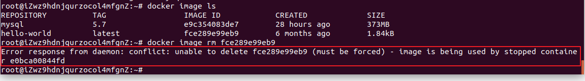

# Docker 命令

### 通用命令

##### 查看docker 当前版本

```shell
docker version
```

```bash
# 启动docker
sudo service docker start

# 停止docker
sudo service docker stop

# 重启docker
sudo service docker restart
```


### 镜像操作[image]

##### 列出所有镜像

```shell
docker image ls
# 上面的命令时省略了 --all
docker image ls --all
```

##### 拉取镜像

如果不指定版本号，默认拉取最新版本的镜像

```shell
docker image pull <镜像名称:版本号>
```

##### 删除镜像

删除的时候，必须注意是否有容器在运行当前镜像文件，如果在使用，则需要先删除容器，才能删除镜像

```shell
docker image rm <镜像名称/镜像ID>
```

删除的镜像如果被容器提前使用了，则错误如下：




##### 把docker中的镜像打包成文件

用于分享发送给他人，或备份

```shell
docker save -o <文件名.tar.gz>  <镜像名>
```


##### 把镜像文件加载到docker中

```shell
docker load -i <文件名.tar>
```


### 容器操作[container]

##### 创建容器

必须先有镜像，才能运行创建容器，需要指定使用的镜像名，并且设置创建容器以后，执行对应的第一条命令 

```shell
docker run <参数选项>  <镜像名称> <命令>
```

例如：使用"hello-world"镜像，创建一个容器，但没有进行任何操作

```shell
docker run hello-world
```

例如：使用ubuntu镜像，创建一个名为ubuntu1

```
docker pull ubuntu:18.04
docker run -it --name=ubuntu1 ubuntu:18.04 bash
```

注意：必须启动的时候，让容器运行bash解析器，才能在接下来的操作让容器不会立刻关闭，而且也能够让我们可以输入linux终端命令， 如果我们一般创建一个容器，选项都是： -itd


##### docker run的选项

-t    表示容器启动后会进入其命令行终端

-i     表示以“交互模式”运行容器

--name  表示设置容器的名称

例如，使用ubuntu镜像，创建一个名为ubuntu2，并且在后台运行的容器像

```
docker run -itd --name=ubuntu2 ubuntu<:版本> ubuntu
```

-d    创建一个守护式容器在后台运行(这样创建容器后不会自动登录容器，如果只加-i -t 两个参数，创建后就会自动进去容器)


##### 列出所有容器

```shell
docker container ls                      # 所有正在启动运行的容器

docker container ls --all                # 所有容器[不管是否在启动运行中]
```


##### 启动容器【可以同时启动多个容器，容器之间使用空格隔开】

```shell
# 启动一个容器
docker container start <容器名称/容器ID>

# 启动多个容器
docker container start <容器名称/容器ID>  <容器名称/容器ID> <容器名称/容器ID>
```


##### 停止容器

```shell
docker container stop <容器名称/容器ID>
```

##### 杀死容器

在容器无法停止的时使用

```shell
docker container kill <容器名称/容器ID>
```

##### 进入容器

要进入容器，必须当前容器是启动状态的

```shell
docker container exec -it <容器名称/容器ID>  <第一个命令>
```

##### 删除容器

```shell
docker  container rm <容器名称/容器ID>
```

##### 把容器保存成镜像

```shell
docker commit <容器名称/容器ID>  <新镜像名>
```


### 扩展

使用docker命令需要管理员权限，如果希望每次输入docker相关命令时，不用sudo，可通过以下命令进行设置

```shell
sudo usermod -a -G docker $USER
sudo service docker restart
newgrp - docker
```


官方提供的ubuntu系统镜像，工具命令很少，如希望内部安装ping、ifconfig网卡或者vim等工具，可以通过以下命令进行设置[需要联网，而且耗时]

```shell
apt-get update
apt install net-tools        # ifconfig 
apt install iputils-ping     # ping
```

