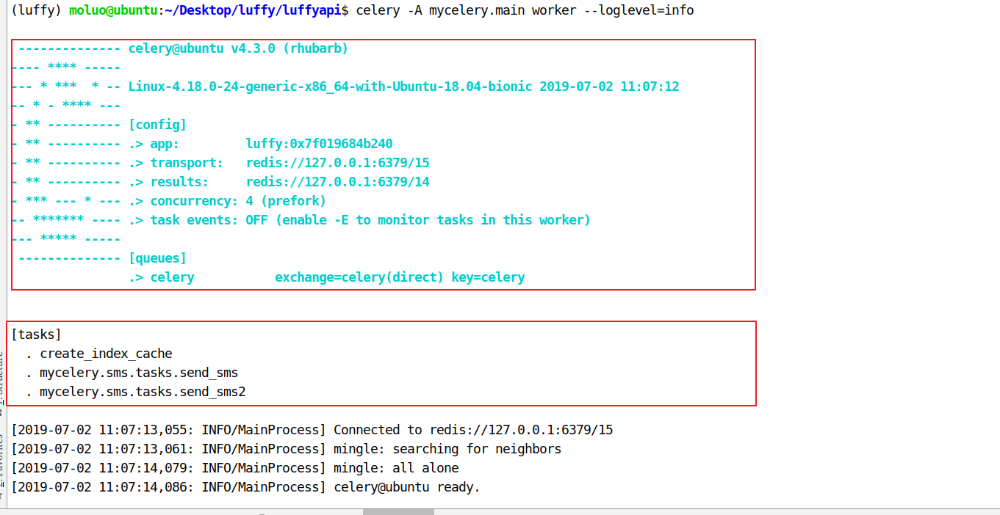

#  Celery

Celery是一个功能完备即插即用的异步任务队列系统。它适用于异步处理问题，当发送邮件、或者文件上传, 图像处理等等一些比较耗时的操作，我们可将其异步执行，这样用户不需要等待很久，提高用户体验。

文档：http://docs.jinkan.org/docs/celery/getting-started/index.html

Celery的特点是：

- 简单，易于使用和维护，有丰富的文档。
- 高效，单个celery进程每分钟可以处理数百万个任务。
- 灵活，celery中几乎每个部分都可以自定义扩展。


```python
任务队列是一种跨线程、跨机器工作的一种机制.
任务队列中包含称作任务的工作单元。有专门的工作进程持续不断的监视任务队列，并从中获得新的任务并处理.
celery通过消息进行通信，通常使用一个叫Broker(中间人)来协client(任务的发出者)和worker(任务的处理者). clients发出消息到队列中，broker将队列中的信息派发给worker来处理。
```


**Celery**的架构

Celery的架构由三部分组成，消息队列（message broker），任务执行单元（worker）和任务执行结果存储（task result store）组成。


```python
一个celery系统可以包含很多的worker和broker

Celery本身不提供消息队列功能，但是可以很方便地和第三方提供的消息中间件进行集成，包括RabbitMQ,Redis,MongoDB等
```

## 安装

```python
pip install -U celery  #-U是update的意思，有就进行更新，没有就安装
#后面单独将celery运行起来就可以了
```

也可从官方直接下载安装包:<https://pypi.python.org/pypi/celery/>

```python
tar xvfz celery-0.0.0.tar.gz
cd celery-0.0.0
python setup.py 
python setup.py install
```

## 使用

使用celery第一件要做的最为重要的事情是需要先创建一个Celery实例，我们一般叫做celery应用，或者更简单直接叫做一个app。app应用是我们使用celery所有功能的入口，比如创建任务，管理任务等，在使用celery的时候，app必须能够被其他的模块导入。

一般celery任务目录直接放在项目的根目录下即可，路径:

```python
luffyapi/
├── mycelery/
    ├── config.py     # 配置文件
    ├── __init__.py   
    ├── main.py       # 主程序
    └── sms/          # 一个目录可以放置多个任务,该目录下存放当前任务执行时需要的模块或依赖,也可以每个任务单独一个目录
        └── tasks.py  # 任务的文件，名称必须是这个!!!
```


main.py，代码：

```python
# 主程序
from celery import Celery
# 创建celery实例对象
app = Celery("luffy")

# 通过app对象加载配置，文件路径
app.config_from_object("mycelery.config")

# 自动搜索并加载任务
# 参数必须必须是一个列表，里面的每一个任务都是任务的路径名称
# app.autodiscover_tasks(["任务1","任务2"])
app.autodiscover_tasks(["mycelery.sms","mycelery.cache"]) #会自动识别sms目录下面的tasks.py文件中的任务，所以不需写成mycelery.sms.tasks

# 启动Celery的命令
# 强烈建议切换目录到项目的根目录下启动celery!!
# celery -A mycelerymain worker --loglevel=info
```

配置文件config.py，代码：（文件形式，json形式，对象形式都行）

```python
# 任务队列的链接地址(变量名必须叫这个)
broker_url = 'redis://127.0.0.1:6379/14'  
# 结果队列的链接地址(变量名必须叫这个)
result_backend = 'redis://127.0.0.1:6379/15'
```


创建一个任务文件sms/tasks.py，并创建任务，代码:

```python
# celery的任务必须写在tasks.py的文件中，别的文件名称不识别!!!
from mycelery.main import app

@app.task(name="send_sms")  # name表示设置任务的名称，如果不填写，则默认使用函数名(路径)做为任务名
def send_sms():
    print("发送短信!!!")

@app.task  # name表示设置任务的名称，如果不填写，则默认使用函数名做为任务名
def send_sms2():
    print("发送短信任务2!!!")
```


接下来，我们运行celery，在终端，项目根目录下（也就是mycelery的外层目录里面）执行指令

```
celery -A mycelery.main worker --loglevel=info (或者直接写info也行) #-A是指定celery启动入口
```


效果如下：




```python
- ** ---------- [config]
- ** ---------- .> app:         __main__:0x10b24ba50
- ** ---------- .> transport:   redis://127.0.0.1:6379/14
- ** ---------- .> results:     redis://127.0.0.1:6379/15
- *** --- * --- .> concurrency: 16 (prefork)  #表示它开启了16个线程准备来来执行任务,可以在后面执行任务的时候自行测试一下，一共可以有16个任务同时执行
-- ******* ---- .> task events: OFF (enable -E to monitor tasks in this worker) #有没有开启其他的事件（比如事件监听等等一些东西）

```


运行起来之后，如果又添加了新的任务，需要重新启动celery。

然后执行任务，可以在mycelery下面创建一个py文件进行测试，名字随便起，比如叫做runtask.py文件，内容如下

(mycelery同级目录创建 runtask.py才运行成功 ，不然提示找不到mycelery模块)

```python
#引入任务
from mycelery.sms.tasks import send_sms  
#执行任务
send_sms.delay() #这就是将任务交给worker去执行了，这个任务在上面的时候已经加到队列中了，所以调用它的意思就是让worker去队列中找到send_sms这个任务去执行
#然后运行我们这个文件，右键运行就行，celery会在后台一直运行着
```


报错： win11  python3.6.8  celery==4.4 

```BASH
[2024-05-17 18:49:51,756: ERROR/MainProcess] Task handler raised error: ValueError('not enough values to unpack (expected 3, got 0)',)
Traceback (most recent call last):
  File "c:\users\kanghua\appdata\local\programs\python\python36\lib\site-packages\billiard\pool.py", line 362, in workloop
    result = (True, prepare_result(fun(*args, **kwargs)))
  File "c:\users\kanghua\appdata\local\programs\python\python36\lib\site-packages\celery\app\trace.py", line 546, in _fast_trace_task
    tasks, accept, hostname = _loc
ValueError: not enough values to unpack (expected 3, got 0)

解决参考https://www.cnblogs.com/kaerxifa/p/13560581.html
看别人描述大概就是说win10上运行celery4.x就会出现这个问题，
解决办法如下,原理未知：
先安装一个`eventlet`

pip install eventlet
然后启动worker的时候加一个参数，如下：
celery -A <mymodule> worker -l info -P eventlet
然后就可以正常的调用了。
```


去redis中查看，就能看到任务执行结果了

如果想获取任务结果可以通过get方法，或者AsyncResult这个类来拿

```python
方式1：
import time
from mycelery.sms.tasks import send_sms
from mycelery.mail.tasks import send_email

ret = send_sms.delay()
print(ret,type(ret))
print(ret.ready())
print(ret.id)
# time.sleep(3)
print(ret.ready())
print(ret.get(timeout=1),)

方式2
import time
from mycelery.sms.tasks import send_sms
from mycelery.mail.tasks import send_email

from celery.result import AsyncResult
ret = send_sms.delay()  #执行的任务如果需要参数，那么就直接在delay方法里面写：send_sms(mobile,sms_code),执行时：delay（mobile,sms_code）
async_task = AsyncResult(id=ret.id,app=send_sms)

print(async_task.successful())
result = async_task.get()
print(result)

```

celery还有很多可配置的项，还可以拓展很多的方法，并且还能完成定时任务：定时备份数据库，定时分析日志文件等。关于这些，还是建议大家学习一下。


其他参考文档：

http://docs.celeryproject.org/en/latest/getting-started/introduction.html

https://github.com/celery/celery/tree/master/examples/django/

https://www.jianshu.com/p/1840035cb510

https://flower.readthedocs.io/en/latest/screenshots.html


接下来，我们需要把celery和django组合起来一起使用。


### 把django和celery进行组合

在main.py主程序中对django的配置文件进行加载

```python
# 主程序
import os
from celery import Celery
# 创建celery实例对象
app = Celery("luffy") #celery对象可以创建多个，所以我们最好给我们当前的celery应用起个名字，比如叫做luffy


# 把celery和django进行组合，需要识别和加载django的配置文件
import os
os.environ.setdefault('DJANGO_SETTINGS_MODULE', 'luffyapi.settings.dev')
#如果只是使用了logging日志功能的话可以不写以下两句，因为logging是python提供的模块，但是将来可能使用celery来执行其他的django任务，所以我们先写上
import django
django.setup()

# 通过app对象加载配置
app.config_from_object("mycelery.config")

# 加载任务
# 参数必须必须是一个列表，里面的每一个任务都是任务的路径名称
# app.autodiscover_tasks(["任务1","任务2"])
app.autodiscover_tasks(["mycelery.sms","mycelery.mail"])

# 启动Celery的命令
# 切换目录到mycelery根目录下启动
# celery -A mycelery.main worker --loglevel=info -P eventlet
```

在需要使用django配置的任务中，直接加载配置，所以我们把注册的短信发送功能，整合成一个任务函数，代码：

```python
from mycelery.main import app
from luffyapi.libs.yuntongxun.sms import CCP
from luffyapi.settings import constants
import logging
log = logging.getLogger("django")

@app.task(name="send_sms")
def send_sms(mobile, sms_code):
    """发送短信"""
    ccp = CCP()
    ret = ccp.send_template_sms(mobile, [sms_code, constants.SMS_EXPIRE_TIME//60], constants.SMS_TEMPLATE_ID)
    if not ret:
        log.error("用户注册短信发送失败！手机号：%s" % mobile)
```


在这个任务中，我们需要加载短信发送的sdk和相关的配置常量，所以我们可以直接把django中的短信发送模块和相关的常量配置文件直接剪切到当前sms任务目录中

```python
mycelery/
├── config.py
├── __init__.py
├── main.py
└── sms/
    ├── __init__.py
    ├── tasks.py

```

再次启动项目即可。


最终在django里面，我们调用Celery来异步执行任务。需要完成2个步骤：

```python
# 1. 声明一个和celery一模一样的任务函数，但是我们可以导包来解决
from mycelery.sms.tasks import send_sms

# 2. 调用任务函数，发布任务
send_sms.delay(mobile,sms_code)
# send_sms.delay() 如果调用的任务函数没有参数，则不需要填写任何内容
```


改完之后的views.py

```python
class SMSAPIView(APIView):

    def get(self,request,mobile):

        # todo 1. 判断手机号是否在60秒曾经发送过短信
        redis_conn = get_redis_connection('sms_code')
        ret = redis_conn.get("mobile_%s" % mobile)
        if ret is not None:
            return Response({'msg':'60秒内已经发送过短信了'},status=status.HTTP_400_BAD_REQUEST)
        # 2. 创建验证码
        sms_code = "%06d" % random.randint(1,999999)

        pipe = redis_conn.pipeline()
        pipe.multi()
        pipe.setex('sms_%s' % mobile, constants.SMS_EXPIRE_TIME , sms_code)
        pipe.setex("mobile_%s" % mobile,constants.SMS_INTERVAL_TIME,'_')  
        pipe.execute() #执行事务
        try:

            from mycelery.sms.tasks import send_sms
            ret = send_sms.delay(mobile,sms_code)  #执行任务
            #其实短信发送，没有必要获取它的返回结果，日志中已经记录了它发送成功与否的状态，如果我们想获取结果，那么可以使用我笔记里面获取celery任务结果的方法。
            print('ret>>>',ret.get())
            # ccp = CCP()
            # #由于短信发送那个有效期是分钟为单位的，所以我们SMS_EXPIRE_TIME//60
            # ret = ccp.send_template_sms(mobile,[sms_code,constants.SMS_EXPIRE_TIME//60],constants.SMS_TEMPLATE_ID)
            # if not ret:
            #     logger = logging.getLogger('django')
            #     logger.error('用户注册短信发送失败，手机号为%s' % mobile)
            #     return Response({'msg':'短信发送错误！'})
        except:

            return Response({'msg':'发送短信失败'},status=status.HTTP_500_INTERNAL_SERVER_ERROR)
        return Response({'msg':'发送短信成功'})
```


