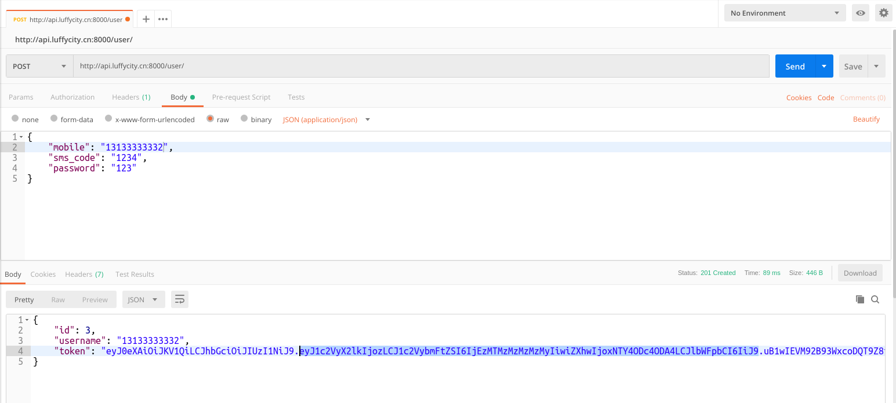

# 用户的注册认证

前端显示注册页面并调整首页头部和登陆页面的注册按钮的链接。

注册页面Register,主要是通过登录页面进行改成而成.

```vue
<template>
	<div class="box">
		
		<div class="register">
			<div class="register_box">
        <div class="register-title">注册路飞学城</div>
				<div class="inp">
					<input v-model = "mobile" type="text" placeholder="手机号码" class="user">
					<div id="geetest"></div>
					<input v-model = "sms" type="text" placeholder="输入验证码" class="user">
					<button class="register_btn" >注册</button>
					<p class="go_login" >已有账号 <router-link to="/user/login">直接登录</router-link></p>
				</div>
			</div>
		</div>
	</div>
</template>

<script>
export default {
  name: 'Register',
  data(){
    return {
        sms:"",
        mobile:"",
        validateResult:false,
    }
  },
  created(){
  },
  methods:{},

};
</script>

<style scoped>
.box{
	width: 100%;
  height: 100%;
	position: relative;
  overflow: hidden;
}
.box img{
	width: 100%;
  min-height: 100%;
}
.box .register {
	position: absolute;
	width: 500px;
	height: 400px;
	top: 0;
	left: 0;
  margin: auto;
  right: 0;
  bottom: 0;
  top: -338px;
}
.register .register-title{
    width: 100%;
    font-size: 24px;
    text-align: center;
    padding-top: 30px;
    padding-bottom: 30px;
    color: #4a4a4a;
    letter-spacing: .39px;
}
.register-title img{
    width: 190px;
    height: auto;
}
.register-title p{
    font-family: PingFangSC-Regular;
    font-size: 18px;
    color: #fff;
    letter-spacing: .29px;
    padding-top: 10px;
    padding-bottom: 50px;
}
.register_box{
    width: 400px;
    height: auto;
    background: #fff;
    box-shadow: 0 2px 4px 0 rgba(0,0,0,.5);
    border-radius: 4px;
    margin: 0 auto;
    padding-bottom: 40px;
}
.register_box .title{
	font-size: 20px;
	color: #9b9b9b;
	letter-spacing: .32px;
	border-bottom: 1px solid #e6e6e6;
	 display: flex;
    	justify-content: space-around;
    	padding: 50px 60px 0 60px;
    	margin-bottom: 20px;
    	cursor: pointer;
}
.register_box .title span:nth-of-type(1){
	color: #4a4a4a;
    	border-bottom: 2px solid #84cc39;
}

.inp{
	width: 350px;
	margin: 0 auto;
}
.inp input{
    border: 0;
    outline: 0;
    width: 100%;
    height: 45px;
    border-radius: 4px;
    border: 1px solid #d9d9d9;
    text-indent: 20px;
    font-size: 14px;
    background: #fff !important;
}
.inp input.user{
    margin-bottom: 16px;
}
.inp .rember{
     display: flex;
    justify-content: space-between;
    align-items: center;
    position: relative;
    margin-top: 10px;
}
.inp .rember p:first-of-type{
    font-size: 12px;
    color: #4a4a4a;
    letter-spacing: .19px;
    margin-left: 22px;
    display: -ms-flexbox;
    display: flex;
    -ms-flex-align: center;
    align-items: center;
    /*position: relative;*/
}
.inp .rember p:nth-of-type(2){
    font-size: 14px;
    color: #9b9b9b;
    letter-spacing: .19px;
    cursor: pointer;
}

.inp .rember input{
    outline: 0;
    width: 30px;
    height: 45px;
    border-radius: 4px;
    border: 1px solid #d9d9d9;
    text-indent: 20px;
    font-size: 14px;
    background: #fff !important;
}

.inp .rember p span{
    display: inline-block;
  font-size: 12px;
  width: 100px;
  /*position: absolute;*/
/*left: 20px;*/

}
#geetest{
	margin-top: 20px;
}
.register_btn{
     width: 100%;
    height: 45px;
    background: #84cc39;
    border-radius: 5px;
    font-size: 16px;
    color: #fff;
    letter-spacing: .26px;
    margin-top: 30px;
}
.inp .go_login{
    text-align: center;
    font-size: 14px;
    color: #9b9b9b;
    letter-spacing: .26px;
    padding-top: 20px;
}
.inp .go_login span{
    color: #84cc39;
    cursor: pointer;
}
</style>

```

前端注册路由:

```javascript
import Register from "../components/Register"

// 配置路由列表
export default new Router({
  mode:"history",
  routes:[
    // 路由列表
	...
    {
      name:"Register",
      path: "/register",
      component:Register,
    }
  ]
})

```

修改首页头部的连接:

```html
# Header.vue
<span class="header-register"><router-link to="/user/reg">注册</router-link></span>
#Login.vue
<p class="go_login" >没有账号 <router-link to="/user/reg">立即注册</router-link></p>
```


## 注册功能的实现

后端视图提供注册功能的api接口，视图代码：

```python
from rest_framework.generics import CreateAPIView
from .models import User
from .serializers import UserModelSerializer
class UserAPIView(CreateAPIView):
    """用户信息视图"""
    queryset = User.objects.all()
    serializer_class = UserModelSerializer
```

序列化器代码：

```python
from rest_framework import serializers
from .models import User
import re
from .utils import get_user_by_account
from django.contrib.auth.hashers import make_password
from rest_framework_jwt.settings import api_settings

class UserModelSerializer(serializers.ModelSerializer):
    sms_code = serializers.CharField(min_length=4, max_length=6, required=True, write_only=True, help_text="短信验证码")
    token = serializers.CharField(max_length=1024, read_only=True, help_text="token认证字符串")
    class Meta:
        model = User
        fields = ["id","username", "mobile","password","sms_code","token"]
        extra_kwargs = {
            "id":{
                "read_only":True,
            },
            "username":{
                "read_only":True,
            },
            "password":{
                "write_only":True,
            },
            "mobile":{
                "write_only":True,
            }
        }

    def validate(self, attrs):
        mobile = attrs.get("mobile")
        sms_code = attrs.get("sms_code")
        password = attrs.get("password")
        # 验证手机号码的格式
        if not re.match(r"^1[3-9]\d{9}$", mobile):
           raise serializers.ValidationError("对不起，手机号格式有误！")

        # 验证码手机号是否已经被注册过了
        ret = get_user_by_account(mobile)
        if ret is not None:
            raise serializers.ValidationError("对不起，手机号已经被注册过！")

        # todo 验证短信验证码是否正确

        return attrs

    def create(self, validated_data):
        """用户信息"""
        # 移除掉不需要的数据
        validated_data.pop("sms_code")
        # 对密码进行加密
        raw_password =  validated_data.get("password")
        hash_password = make_password(raw_password)
        # 对用户名设置一个默认值
        username = validated_data.get("mobile")
        # 调用序列化器提供的create方法
        user = User.objects.create(
            mobile=username,
            username=username,
            password=hash_password,
        )

        # 使用restframework_jwt模块提供手动生成token的方法生成登录状态


        jwt_payload_handler = api_settings.JWT_PAYLOAD_HANDLER
        jwt_encode_handler = api_settings.JWT_ENCODE_HANDLER

        payload = jwt_payload_handler(user)
        user.token = jwt_encode_handler(payload)

        return user
```

路由，代码：

```python
from django.urls import path
from rest_framework_jwt.views import obtain_jwt_token
from . import views
urlpatterns = [
    # path(r"banner/", views.BannerListAPIView.as_view()),
    path(r"login/", obtain_jwt_token),
    path(r"captcha/", views.CaptchaAPIView.as_view()),
    path(r"", views.UserAPIView.as_view()),
]
```

使用postman访问测试




## 客户端实现注册功能

register.vue，代码：

```vue
<template>
	<div class="box">
		
		<div class="register">
			<div class="register_box">
        <div class="register-title">注册路飞学城</div>
				<div class="inp">
					<input v-model = "mobile" type="text" placeholder="手机号码" class="user">
          <input v-model = "password" type="password" placeholder="登录密码" class="user">
					<input v-model = "sms_code" type="text" placeholder="输入验证码" class="user">
          <div id="geetest"></div>
					<button class="register_btn" @click="registerHander">注册</button>
					<p class="go_login" >已有账号 <router-link to="/user/login">直接登录</router-link></p>
				</div>
			</div>
		</div>
	</div>
</template>

<script>
export default {
  name: 'Register',
  data(){
    return {
        sms_code:"",
        mobile:"",
        password: "",
    }
  },
  created(){
  },
  methods:{
      registerHander(){
          // 用户注册
          this.$axios.post(`${this.$settings.HOST}/user/`,{
            mobile: this.mobile,
            sms_code:this.sms_code,
            password:this.password,
          }).then(response=>{
            console.log(response.data);
            localStorage.removeItem("user_token");
            localStorage.removeItem("user_id");
            localStorage.removeItem("user_name");
            sessionStorage.user_token = response.data.token;
            sessionStorage.user_id = response.data.id;
            sessionStorage.user_name = response.data.username;

            // 页面跳转
            let self = this;
            this.$alert("注册成功!","路飞学城",{
               callback(){
                    self.$router.push("/");
               }
            });

          }).catch(error=>{
            let data = error.response.data;
            let message = "";
            for(let key in data){
                message = data[key][0];
            }
            this.$message.error(message);
          });
      }
  },

};
</script>

<style scoped>
.box{
	width: 100%;
  height: 100%;
	position: relative;
  overflow: hidden;
}
.box img{
	width: 100%;
  min-height: 100%;
}
.box .register {
	position: absolute;
	width: 500px;
	height: 400px;
	top: 0;
	left: 0;
  margin: auto;
  right: 0;
  bottom: 0;
  top: -338px;
}
.register .register-title{
    width: 100%;
    font-size: 24px;
    text-align: center;
    padding-top: 30px;
    padding-bottom: 30px;
    color: #4a4a4a;
    letter-spacing: .39px;
}
.register-title img{
    width: 190px;
    height: auto;
}
.register-title p{
    font-family: PingFangSC-Regular;
    font-size: 18px;
    color: #fff;
    letter-spacing: .29px;
    padding-top: 10px;
    padding-bottom: 50px;
}
.register_box{
    width: 400px;
    height: auto;
    background: #fff;
    box-shadow: 0 2px 4px 0 rgba(0,0,0,.5);
    border-radius: 4px;
    margin: 0 auto;
    padding-bottom: 40px;
}
.register_box .title{
	font-size: 20px;
	color: #9b9b9b;
	letter-spacing: .32px;
	border-bottom: 1px solid #e6e6e6;
	 display: flex;
    	justify-content: space-around;
    	padding: 50px 60px 0 60px;
    	margin-bottom: 20px;
    	cursor: pointer;
}
.register_box .title span:nth-of-type(1){
	color: #4a4a4a;
    	border-bottom: 2px solid #84cc39;
}

.inp{
	width: 350px;
	margin: 0 auto;
}
.inp input{
    border: 0;
    outline: 0;
    width: 100%;
    height: 45px;
    border-radius: 4px;
    border: 1px solid #d9d9d9;
    text-indent: 20px;
    font-size: 14px;
    background: #fff !important;
}
.inp input.user{
    margin-bottom: 16px;
}
.inp .rember{
     display: flex;
    justify-content: space-between;
    align-items: center;
    position: relative;
    margin-top: 10px;
}
.inp .rember p:first-of-type{
    font-size: 12px;
    color: #4a4a4a;
    letter-spacing: .19px;
    margin-left: 22px;
    display: -ms-flexbox;
    display: flex;
    -ms-flex-align: center;
    align-items: center;
    /*position: relative;*/
}
.inp .rember p:nth-of-type(2){
    font-size: 14px;
    color: #9b9b9b;
    letter-spacing: .19px;
    cursor: pointer;
}

.inp .rember input{
    outline: 0;
    width: 30px;
    height: 45px;
    border-radius: 4px;
    border: 1px solid #d9d9d9;
    text-indent: 20px;
    font-size: 14px;
    background: #fff !important;
}

.inp .rember p span{
    display: inline-block;
  font-size: 12px;
  width: 100px;
  /*position: absolute;*/
/*left: 20px;*/

}
#geetest{
	margin-top: 20px;
}
.register_btn{
     width: 100%;
    height: 45px;
    background: #84cc39;
    border-radius: 5px;
    font-size: 16px;
    color: #fff;
    letter-spacing: .26px;
    margin-top: 30px;
}
.inp .go_login{
    text-align: center;
    font-size: 14px;
    color: #9b9b9b;
    letter-spacing: .26px;
    padding-top: 20px;
}
.inp .go_login span{
    color: #84cc39;
    cursor: pointer;
}
</style>

```

虽然已经实现了注册功能，但是我们需要针对当前的安全性和用户体验要进行优化.

新增用户输入完成手机号以后，要及时进行手机号的唯一性验证，对于这个功能，我们需要单独实现。

### 手机号的唯一性验证

后端视图，代码:

```python
"""
GET /user/mobile/<mobile>/
"""
import re
from rest_framework import status
class MobileAPIView(APIView):
    def get(self,request,mobile):
        ret = get_user_by_account(mobile)
        if ret is not None:
            return Response({"message":"手机号已经被注册过！"},status=status.HTTP_400_BAD_REQUEST)
        return Response({"message":"ok"})
```


后端路由,代码:

```python
from django.urls import path,re_path
from rest_framework_jwt.views import obtain_jwt_token
from . import views
urlpatterns = [
    # path(r"banner/", views.BannerListAPIView.as_view()),
    path(r"login/", obtain_jwt_token),
    path(r"captcha/", views.CaptchaAPIView.as_view()),
    path(r"", views.UserAPIView.as_view()),
    re_path(r"mobile/(?P<mobile>1[3-9]\d{9})/", views.MobileAPIView.as_view()),
]
```

客户端用户输入完手机号码以后,使用失去焦点事件,然后发送手机号到后端进行唯一性验证

```vue
<template>
	<div class="box">
		
		<div class="register">
			<div class="register_box">
        <div class="register-title">注册路飞学城</div>
				<div class="inp">
					<input v-model = "mobile" type="text" @blur="checkMobile" placeholder="手机号码" class="user">
          <input v-model = "password" type="password" placeholder="登录密码" class="user">
					<input v-model = "sms_code" type="text" placeholder="输入验证码" class="user">
          <div id="geetest"></div>
					<button class="register_btn" @click="registerHander">注册</button>
					<p class="go_login" >已有账号 <router-link to="/user/login">直接登录</router-link></p>
				</div>
			</div>
		</div>
	</div>
</template>

<script>
export default {
  name: 'Register',
  data(){
    return {
        sms_code:"",
        mobile:"",
        password: "",
    }
  },
  created(){
  },
  methods:{
      checkMobile(){
          // 检查手机号的合法性[格式和是否已经注册]
          this.$axios.get(`${this.$settings.HOST}/user/mobile/${this.mobile}/`).catch(error=>{
              this.$message.error(error.response.data.message);
          });
      },
      registerHander(){
          // 用户注册
          this.$axios.post(`${this.$settings.HOST}/user/`,{
            mobile: this.mobile,
            sms_code:this.sms_code,
            password:this.password,
          }).then(response=>{
            console.log(response.data);
            localStorage.removeItem("user_token");
            localStorage.removeItem("user_id");
            localStorage.removeItem("user_name");
            sessionStorage.user_token = response.data.token;
            sessionStorage.user_id = response.data.id;
            sessionStorage.user_name = response.data.username;

            // 页面跳转
            let self = this;
            this.$alert("注册成功!","路飞学城",{
               callback(){
                    self.$router.push("/");
               }
            });

          }).catch(error=>{
            let data = error.response.data;
            let message = "";
            for(let key in data){
                message = data[key][0];
            }
            this.$message.error(message);
          });
      }
  },

};
</script>
```


接下来，我们把注册过程中一些注册信息（例如：短信验证码）和其他的缓存数据保存到redis数据库中。

安装django-redis。

```python
pip install django-redis
```


在settings.py配置中添加一下代码：

```python
# 设置redis缓存
CACHES = {
    # 默认缓存
    "default": {
        "BACKEND": "django_redis.cache.RedisCache",
        # 项目上线时,需要调整这里的路径
        "LOCATION": "redis://127.0.0.1:6379/0",

        "OPTIONS": {
            "CLIENT_CLASS": "django_redis.client.DefaultClient",
        }
    },
    # 提供给xadmin或者admin的session存储
    "session": {
        "BACKEND": "django_redis.cache.RedisCache",
        "LOCATION": "redis://127.0.0.1:6379/1",
        "OPTIONS": {
            "CLIENT_CLASS": "django_redis.client.DefaultClient",
        }
    },
    # 提供存储短信验证码
    "sms_code":{
        "BACKEND": "django_redis.cache.RedisCache",
        "LOCATION": "redis://127.0.0.1:6379/2",
        "OPTIONS": {
            "CLIENT_CLASS": "django_redis.client.DefaultClient",
        }
    }
}

# 设置xadmin用户登录时,登录信息session保存到redis
SESSION_ENGINE = "django.contrib.sessions.backends.cache"
SESSION_CACHE_ALIAS = "session"
```

**关于django-redis 的使用，说明文档可见http://django-redis-chs.readthedocs.io/zh_CN/latest/**

**django-redis提供了get_redis_connection的方法，通过调用get_redis_connection方法传递redis的配置名称可获取到redis的连接对象，通过redis连接对象可以执行redis命令**

<https://redis-py.readthedocs.io/en/latest/>

使用范例：

```python
from django_redis import get_redis_connection
// 链接redis数据库
redis_conn = get_redis_connection("default")
```


### 使用云通讯发送短信

https://www.yuntongxun.com/

在登录后的平台上面获取一下信息:

```
ACCOUNT SID：8a216da863f8e6c20164139687e80c1b
AUTH TOKEN : 6dd01b2b60104b3dbc88b2b74158bac6
AppID(默认)：8aaf0708697b6beb01699f4442e3177c
Rest URL(生产)： app.cloopen.com:8883         [项目上线时使用真实短信发送服务器]
Rest URL(开发)： sandboxapp.cloopen.com:8883  [项目开发时使用沙箱短信发送服务器]
```

找到sdkdemo进行下载


在开发过程中,为了节约发送短信的成本,可以把自己的或者同事的手机加入到测试号码中.


把云通讯的sdk保存到libs目录下， libs/yuntongxun/sms.py,代码:

```python
# -*- coding:utf-8 -*-

from .CCPRestSDK import REST

# 说明：主账号，登陆云通讯网站后，可在"控制台-应用"中看到开发者主账号ACCOUNT SID
_accountSid = '8a216da863f8e6c20164139687e80c1b'

# 说明：主账号Token，登陆云通讯网站后，可在控制台-应用中看到开发者主账号AUTH TOKEN
_accountToken = '6dd01b2b60104b3dbc88b2b74158bac6'
# 6dd01b2b60104b3dbc88b2b74158bac6
# 请使用管理控制台首页的APPID或自己创建应用的APPID
_appId = '8aaf0708697b6beb01699f4442e3177c'
# 8a216da863f8e6c20164139688400c21
# 说明：请求地址，生产环境配置成app.cloopen.com
# 沙箱环境地址： sandboxapp.cloopen.com
_serverIP = 'sandboxapp.cloopen.com'

# 说明：请求端口 ，生产环境为8883
_serverPort = "8883"

# 说明：REST API版本号保持不变
_softVersion = '2013-12-26'

# 云通讯官方提供的发送短信代码实例
# # 发送模板短信
# # @param to 手机号码
# # @param datas 内容数据 格式为数组 例如：{'12','34'}，如不需替换请填 ''
# # @param $tempId 模板Id
#
# def sendTemplateSMS(to, datas, tempId):
#     # 初始化REST SDK
#     rest = REST(serverIP, serverPort, softVersion)
#     rest.setAccount(accountSid, accountToken)
#     rest.setAppId(appId)
#
#     result = rest.sendTemplateSMS(to, datas, tempId)
#     for k, v in result.iteritems():
#
#         if k == 'templateSMS':
#             for k, s in v.iteritems():
#                 print '%s:%s' % (k, s)
#         else:
#             print '%s:%s' % (k, v)


class CCP(object):
    """发送短信的辅助类"""

    def __new__(cls, *args, **kwargs):
        # 判断是否存在类属性_instance，_instance是类CCP的唯一对象，即单例
        if not hasattr(CCP, "_instance"):
            cls._instance = super(CCP, cls).__new__(cls, *args, **kwargs)
            cls._instance.rest = REST(_serverIP, _serverPort, _softVersion)
            cls._instance.rest.setAccount(_accountSid, _accountToken)
            cls._instance.rest.setAppId(_appId)
        return cls._instance

    def send_template_sms(self, to, datas, temp_id):
        """发送模板短信"""
        # @param to 手机号码
        # @param datas 内容数据 格式为数组 例如：{'12','34'}，如不需替换请填 ''
        # @param temp_id 模板Id
        result = self.rest.sendTemplateSMS(to, datas, temp_id)
        # 如果云通讯发送短信成功，返回的字典数据result中statuCode字段的值为"000000"
        return result.get("statusCode") == "000000"


if __name__ == '__main__':
    ccp = CCP()
    # 注意： 测试的短信模板编号为1[以后申请了企业账号以后可以有更多的模板]
    # 参数1: 客户端手机号码,测试时只能发给测试号码
    # 参数2: 短信模块中的数据
    #        短信验证码
    #        短信验证码有效期提示
    # 参数3: 短信模板的id,开发测试时,只能使用1

    # ccp.send_template_sms('15914397060', ['1234',5], 1)
```


以后项目上线,肯定使用的是公司已经经过实名认证并且购买短信包的,所以我们修改里面的基本配置信息。保存到settings/dev.py文件中,sms.py，代码：

```python
# -*- coding:utf-8 -*-

from .CCPRestSDK import REST
from django.conf import settings
# 说明：主账号，登陆云通讯网站后，可在"控制台-应用"中看到开发者主账号ACCOUNT SID
_accountSid = settings.SMS["_accountSid"]

# 说明：主账号Token，登陆云通讯网站后，可在控制台-应用中看到开发者主账号AUTH TOKEN
_accountToken = settings.SMS["_accountToken"]

# 请使用管理控制台首页的APPID或自己创建应用的APPID
_appId = settings.SMS["_appId"]

# 说明：请求地址，生产环境配置成app.cloopen.com
# 沙箱环境地址： sandboxapp.cloopen.com
_serverIP = settings.SMS["_serverIP"]

# 说明：请求端口 ，生产环境为8883
_serverPort = settings.SMS["_serverPort"]

# 说明：REST API版本号保持不变
_softVersion = settings.SMS["_softVersion"]

# 云通讯官方提供的发送短信代码实例
# # 发送模板短信
# # @param to 手机号码
# # @param datas 内容数据 格式为数组 例如：{'12','34'}，如不需替换请填 ''
# # @param $tempId 模板Id
#
# def sendTemplateSMS(to, datas, tempId):
#     # 初始化REST SDK
#     rest = REST(serverIP, serverPort, softVersion)
#     rest.setAccount(accountSid, accountToken)
#     rest.setAppId(appId)
#
#     result = rest.sendTemplateSMS(to, datas, tempId)
#     for k, v in result.iteritems():
#
#         if k == 'templateSMS':
#             for k, s in v.iteritems():
#                 print '%s:%s' % (k, s)
#         else:
#             print '%s:%s' % (k, v)


class CCP(object):
    """发送短信的辅助类"""

    def __new__(cls, *args, **kwargs):
        # 判断是否存在类属性_instance，_instance是类CCP的唯一对象，即单例
        if not hasattr(CCP, "_instance"):
            cls._instance = super(CCP, cls).__new__(cls, *args, **kwargs)
            cls._instance.rest = REST(_serverIP, _serverPort, _softVersion)
            cls._instance.rest.setAccount(_accountSid, _accountToken)
            cls._instance.rest.setAppId(_appId)
        return cls._instance

    def send_template_sms(self, to, datas, temp_id):
        """发送模板短信"""
        # @param to 手机号码
        # @param datas 内容数据 格式为数组 例如：{'12','34'}，如不需替换请填 ''
        # @param temp_id 模板Id
        result = self.rest.sendTemplateSMS(to, datas, temp_id)
        # 如果云通讯发送短信成功，返回的字典数据result中statuCode字段的值为"000000"
        return result.get("statusCode") == "000000"


if __name__ == '__main__':
    ccp = CCP()
    # 注意： 测试的短信模板编号为1[以后申请了企业账号以后可以有更多的模板]
    # 参数1: 客户端手机号码,测试时只能发给测试号码
    # 参数2: 短信模块中的数据
    #        短信验证码
    #        短信验证码有效期提示
    # 参数3: 短信模板的id,开发测试时,只能使用1

    # ccp.send_template_sms('15914397060', ['1234',5], 1)
```

settings/dev.py配置文件后面追加配置信息，代码：

```python
# 短信接口配置
SMS = {
    # 主账号，登陆云通讯网站后，可在"控制台-应用"中看到开发者主账号ACCOUNT SID
    "_accountSid":'8a216da863f8e6c20164139687e80c1b',
    # 主账号Token，登陆云通讯网站后，可在控制台-应用中看到开发者主账号AUTH TOKEN
    "_accountToken":'6dd01b2b60104b3dbc88b2b74158bac6',
    # 请使用管理控制台首页的APPID或自己创建应用的APPID
    "_appId":'8aaf0708697b6beb01699f4442e3177c',
    # 请求地址，生产环境配置成app.cloopen.com， 沙箱环境地址： sandboxapp.cloopen.com
    "_serverIP":'sandboxapp.cloopen.com',
    # 请求端口 ，生产环境为8883，沙箱环境也是这个
    "_serverPort":"8883",
    # REST API版本号
    "_softVersion": '2013-12-26',
}
```


### 后端实现短信发送接口

视图代码：

```python
from django.shortcuts import render
pc_geetest_id = "5e876edb2bda195c265416b70e7389a7"
pc_geetest_key = "c1f0f6f5958507924d187db31cd136e5"
# Create your views here.
from luffyapi.libs.geetest import GeetestLib
from rest_framework.response import Response
from .utils import get_user_by_account
from rest_framework import status as http_status
from rest_framework.views import APIView
class CaptchaAPIView(APIView):
    """验证码视图类"""
    status = False
    user_id = 0
    def get(self,request):
        """获取验证码"""
        username = request.query_params.get("username")
        user = get_user_by_account(username)
        if user is None:
            return Response({"message":"对不起，用户不存在！"},status=http_status.HTTP_400_BAD_REQUEST)

        self.user_id = user.id
        gt = GeetestLib(pc_geetest_id, pc_geetest_key)
        self.status = gt.pre_process(self.user_id)
        # todo 后面增加status和user_id保存到redis数据库
        response_str = gt.get_response_str()
        return Response(response_str)

    def post(self,request):
        """验证码的验证方法"""
        gt = GeetestLib(pc_geetest_id, pc_geetest_key)
        challenge = request.POST.get(gt.FN_CHALLENGE, '')
        validate = request.POST.get(gt.FN_VALIDATE, '')
        seccode = request.POST.get(gt.FN_SECCODE, '')
        if self.status:
            result = gt.success_validate(challenge, validate, seccode, self.user_id)
        else:
            result = gt.failback_validate(challenge, validate, seccode)
        result = {"status":"success"} if result else {"status":"fail"}
        return Response(result)

from rest_framework.generics import CreateAPIView
from .models import User
from .serializers import UserModelSerializer
class UserAPIView(CreateAPIView):
    """用户信息视图"""
    queryset = User.objects.all()
    serializer_class = UserModelSerializer

"""
GET /user/mobile/<mobile>/
"""
import re
from rest_framework import status
class MobileAPIView(APIView):
    def get(self,request,mobile):
        ret = get_user_by_account(mobile)
        if ret is not None:
            return Response({"message":"手机号已经被注册过！"},status=status.HTTP_400_BAD_REQUEST)
        return Response({"message":"ok"})

import random
from django_redis import get_redis_connection
from luffyapi.settings import constants
from luffyapi.libs.yuntongxun.sms import CCP

import logging
log = logging.getLogger("django")

class SMSAPIView(APIView):
    def get(self,request,mobile):
        """短信发送"""

        # 1. 判断手机号码是否在60秒内曾经发送过短信
        redis_conn = get_redis_connection("sms_code")
        ret = redis_conn.get("mobile_%s" % mobile)
        if ret is not None:
            return Response({"message":"对不起，60秒内已经发送过短信，请耐心等待"},status=status.HTTP_400_BAD_REQUEST)

        # 2. 生成短信验证码
        sms_code = "%06d" % random.randint(1, 999999)

        # 3. 保存短信验证码到redis

        redis_conn.setex("sms_%s" % mobile, constants.SMS_EXPIRE_TIME, sms_code)
        redis_conn.setex("mobile_%s" % mobile, constants.SMS_INTERVAL_TIME,"_")
        # 4. 调用短信sdk，发送短信
        try:
            ccp = CCP()
            ret = ccp.send_template_sms(mobile, [sms_code, constants.SMS_EXPIRE_TIME//60], constants.SMS_TEMPLATE_ID)
            if not ret:
                log.error("用户注册短信发送失败！手机号：%s" % mobile)
                return Response({"message":"发送短信失败！"},status=status.HTTP_500_INTERNAL_SERVER_ERROR)
        except:
            return Response({"message":"发送短信失败！"},status=status.HTTP_500_INTERNAL_SERVER_ERROR)

        # 5. 响应发送短信的结果
        return Response({"message":"发送短信成功！"})
```

路由代码：

```python
from django.urls import path,re_path
from rest_framework_jwt.views import obtain_jwt_token
from . import views
urlpatterns = [
	# ....
    re_path(r"sms/(?P<mobile>1[3-9]\d{9})/", views.SMSAPIView.as_view()),
]
```


配置常量settings/constants.py，代码：

```python
# 首页展示的轮播广告数量
BANNER_LENGTH = 10
# 顶部导航的数量
HEADER_NAV_LENGTH = 7
# 脚部导航的数量
FOOTER_NAV_LENGTH = 7
# 短信的有效期[单位：秒]
SMS_EXPIRE_TIME = 5 * 60
# 短信的发送间隔时间[单位: 秒]
SMS_INTERVAL_TIME = 60
# 短信的模板ID，测试开发时使用 1
SMS_TEMPLATE_ID = 1
```


#### 客户端实现点击发送短信的功能

调整前端的页面，添加一个发送短信功能，

```vue
<template>
	<div class="box">
		
		<div class="register">
			<div class="register_box">
        <div class="register-title">注册路飞学城</div>
				<div class="inp">
					<input v-model = "mobile" type="text" @blur="checkMobile" placeholder="手机号码" class="user">
          <input v-model = "password" type="password" placeholder="登录密码" class="user">
					<div class="sms-box">
              <input v-model = "sms_code" maxlength="6" type="text" placeholder="短信验证码" class="user">
              <div class="sms-btn" @click="smsHander">点击发送短信</div>
          </div>
          <div id="geetest"></div>
					<button class="register_btn" @click="registerHander">注册</button>
					<p class="go_login" >已有账号 <router-link to="/user/login">直接登录</router-link></p>
				</div>
			</div>
		</div>
	</div>
</template>

<script>
export default {
  name: 'Register',
  data(){
    return {
        sms_code:"",
        mobile:"",
        password: "",
        is_send_sms: false, // 发送短信的判断标志
    }
  },
  created(){
  },
  methods:{
      checkMobile(){
          // 检查手机号的合法性[格式和是否已经注册]
          this.$axios.get(`${this.$settings.HOST}/user/mobile/${this.mobile}/`).catch(error=>{
              this.$message.error(error.response.data.message);
          });
      },
      registerHander(){
          // 用户注册
          this.$axios.post(`${this.$settings.HOST}/user/`,{
            mobile: this.mobile,
            sms_code:this.sms_code,
            password:this.password,
          }).then(response=>{
            console.log(response.data);
            localStorage.removeItem("user_token");
            localStorage.removeItem("user_id");
            localStorage.removeItem("user_name");
            sessionStorage.user_token = response.data.token;
            sessionStorage.user_id = response.data.id;
            sessionStorage.user_name = response.data.username;

            // 页面跳转
            let self = this;
            this.$alert("注册成功!","路飞学城",{
               callback(){
                    self.$router.push("/");
               }
            });

          }).catch(error=>{
            let data = error.response.data;
            let message = "";
            for(let key in data){
                message = data[key][0];
            }
            this.$message.error(message);
          });
      },
      smsHander(){
          // 发送短信
          // 1. 检查手机格式
          if(! /1[3-9]\d{9}/.test(this.mobile)){
              this.$message.error("手机号码格式不正确！");
              return false;
          }

          // 2. 判断手机号码是否60s内发送短信
          if(this.is_send_sms){
              this.$message.error("当前手机号已经在60秒内发送过短信，请不要频繁发送！");
              return false;
          }

          // 3. 发送ajax
          this.$axios.get(`${this.$settings.HOST}/user/sms/${this.mobile}/`).then(response=>{
            console.log(response.data);
            this.is_send_sms = true;
            let interval_time = 60;
            let timer = setInterval(()=>{
                if(interval_time<=1){
                    // 停止倒计时，允许用户点击发送短信
                    clearInterval(timer);
                    this.is_send_sms=false; // 设置短信发送段的间隔状态为false,允许点击发送短信
                }else{
                    interval_time--;
                }
            },1000)
          }).catch(error=>{
            console.log(error.response.data);
          });
      }
  },

};
</script>

<style scoped>
.box{
	width: 100%;
  height: 100%;
	position: relative;
  overflow: hidden;
}
.box img{
	width: 100%;
  min-height: 100%;
}
.box .register {
	position: absolute;
	width: 500px;
	height: 400px;
	top: 0;
	left: 0;
  margin: auto;
  right: 0;
  bottom: 0;
  top: -338px;
}
.register .register-title{
    width: 100%;
    font-size: 24px;
    text-align: center;
    padding-top: 30px;
    padding-bottom: 30px;
    color: #4a4a4a;
    letter-spacing: .39px;
}
.register-title img{
    width: 190px;
    height: auto;
}
.register-title p{
    font-family: PingFangSC-Regular;
    font-size: 18px;
    color: #fff;
    letter-spacing: .29px;
    padding-top: 10px;
    padding-bottom: 50px;
}
.register_box{
    width: 400px;
    height: auto;
    background: #fff;
    box-shadow: 0 2px 4px 0 rgba(0,0,0,.5);
    border-radius: 4px;
    margin: 0 auto;
    padding-bottom: 40px;
}
.register_box .title{
	font-size: 20px;
	color: #9b9b9b;
	letter-spacing: .32px;
	border-bottom: 1px solid #e6e6e6;
	 display: flex;
    	justify-content: space-around;
    	padding: 50px 60px 0 60px;
    	margin-bottom: 20px;
    	cursor: pointer;
}
.register_box .title span:nth-of-type(1){
	color: #4a4a4a;
    	border-bottom: 2px solid #84cc39;
}

.inp{
	width: 350px;
	margin: 0 auto;
}
.inp input{
    border: 0;
    outline: 0;
    width: 100%;
    height: 45px;
    border-radius: 4px;
    border: 1px solid #d9d9d9;
    text-indent: 20px;
    font-size: 14px;
    background: #fff !important;
}
.inp input.user{
    margin-bottom: 16px;
}
.inp .rember{
     display: flex;
    justify-content: space-between;
    align-items: center;
    position: relative;
    margin-top: 10px;
}
.inp .rember p:first-of-type{
    font-size: 12px;
    color: #4a4a4a;
    letter-spacing: .19px;
    margin-left: 22px;
    display: -ms-flexbox;
    display: flex;
    -ms-flex-align: center;
    align-items: center;
    /*position: relative;*/
}
.inp .rember p:nth-of-type(2){
    font-size: 14px;
    color: #9b9b9b;
    letter-spacing: .19px;
    cursor: pointer;
}

.inp .rember input{
    outline: 0;
    width: 30px;
    height: 45px;
    border-radius: 4px;
    border: 1px solid #d9d9d9;
    text-indent: 20px;
    font-size: 14px;
    background: #fff !important;
}

.inp .rember p span{
    display: inline-block;
  font-size: 12px;
  width: 100px;
  /*position: absolute;*/
/*left: 20px;*/

}
#geetest{
	margin-top: 20px;
}
.register_btn{
     width: 100%;
    height: 45px;
    background: #84cc39;
    border-radius: 5px;
    font-size: 16px;
    color: #fff;
    letter-spacing: .26px;
    margin-top: 30px;
}
.inp .go_login{
    text-align: center;
    font-size: 14px;
    color: #9b9b9b;
    letter-spacing: .26px;
    padding-top: 20px;
}
.inp .go_login span{
    color: #84cc39;
    cursor: pointer;
}
.sms-box{
  position: relative;
}
.sms-box .sms-btn{
  position: absolute;
  font-size: 14px;
  letter-spacing: 0.26px;
  top: 10px;
  right: 16px;
  border-left: 1px solid #484848;
  padding-left: 16px;
  padding-bottom: 4px;
  cursor: pointer;
  background: #ffffff;
}
</style>

```


#### 前端实现倒计时显示

```vue
<template>
	<div class="box">
		
		<div class="register">
			<div class="register_box">
        <div class="register-title">注册路飞学城</div>
				<div class="inp">
					<input v-model = "mobile" type="text" @blur="checkMobile" placeholder="手机号码" class="user">
          <input v-model = "password" type="password" placeholder="登录密码" class="user">
					<div class="sms-box">
              <input v-model = "sms_code" maxlength="6" type="text" placeholder="短信验证码" class="user">
              <div class="sms-btn" @click="smsHander">{{sms_text}}</div>
          </div>
          <div id="geetest"></div>
					<button class="register_btn" @click="registerHander">注册</button>
					<p class="go_login" >已有账号 <router-link to="/user/login">直接登录</router-link></p>
				</div>
			</div>
		</div>
	</div>
</template>

<script>
export default {
  name: 'Register',
  data(){
    return {
        sms_code:"",
        mobile:"",
        password: "",
        sms_text: "点击发送短信",
        is_send_sms: false, // 发送短信的判断标志
    }
  },
  created(){
  },
  methods:{
      checkMobile(){
          // 检查手机号的合法性[格式和是否已经注册]
          this.$axios.get(`${this.$settings.HOST}/user/mobile/${this.mobile}/`).catch(error=>{
              this.$message.error(error.response.data.message);
          });
      },
      registerHander(){
          // 用户注册
          this.$axios.post(`${this.$settings.HOST}/user/`,{
            mobile: this.mobile,
            sms_code:this.sms_code,
            password:this.password,
          }).then(response=>{
            console.log(response.data);
            localStorage.removeItem("user_token");
            localStorage.removeItem("user_id");
            localStorage.removeItem("user_name");
            sessionStorage.user_token = response.data.token;
            sessionStorage.user_id = response.data.id;
            sessionStorage.user_name = response.data.username;

            // 页面跳转
            let self = this;
            this.$alert("注册成功!","路飞学城",{
               callback(){
                    self.$router.push("/");
               }
            });

          }).catch(error=>{
            let data = error.response.data;
            let message = "";
            for(let key in data){
                message = data[key][0];
            }
            this.$message.error(message);
          });
      },
      smsHander(){
          // 发送短信
          // 1. 检查手机格式
          if(! /1[3-9]\d{9}/.test(this.mobile)){
              this.$message.error("手机号码格式不正确！");
              return false;
          }

          // 2. 判断手机号码是否60s内发送短信
          if(this.is_send_sms){
              this.$message.error("当前手机号已经在60秒内发送过短信，请不要频繁发送！");
              return false;
          }

          // 3. 发送ajax
          this.$axios.get(`${this.$settings.HOST}/user/sms/${this.mobile}/`).then(response=>{
            console.log(response.data);
            this.is_send_sms = true;
            let interval_time = 60;
            let timer = setInterval(()=>{
                if(interval_time<=1){
                    // 停止倒计时，允许用户点击发送短信
                    clearInterval(timer);
                    this.is_send_sms=false; // 设置短信发送段的间隔状态为false,允许点击发送短信
                    this.sms_text = "点击发送短信";
                }else{
                    interval_time--;
                    this.sms_text= `${interval_time}秒后重新点击发送`;
                }
            },1000)
          }).catch(error=>{
            this.$message.error(error.response.data.message);
          });
      }
  },

};
</script>

<style scoped>
.box{
	width: 100%;
  height: 100%;
	position: relative;
  overflow: hidden;
}
.box img{
	width: 100%;
  min-height: 100%;
}
.box .register {
	position: absolute;
	width: 500px;
	height: 400px;
	top: 0;
	left: 0;
  margin: auto;
  right: 0;
  bottom: 0;
  top: -338px;
}
.register .register-title{
    width: 100%;
    font-size: 24px;
    text-align: center;
    padding-top: 30px;
    padding-bottom: 30px;
    color: #4a4a4a;
    letter-spacing: .39px;
}
.register-title img{
    width: 190px;
    height: auto;
}
.register-title p{
    font-family: PingFangSC-Regular;
    font-size: 18px;
    color: #fff;
    letter-spacing: .29px;
    padding-top: 10px;
    padding-bottom: 50px;
}
.register_box{
    width: 400px;
    height: auto;
    background: #fff;
    box-shadow: 0 2px 4px 0 rgba(0,0,0,.5);
    border-radius: 4px;
    margin: 0 auto;
    padding-bottom: 40px;
}
.register_box .title{
	font-size: 20px;
	color: #9b9b9b;
	letter-spacing: .32px;
	border-bottom: 1px solid #e6e6e6;
	 display: flex;
    	justify-content: space-around;
    	padding: 50px 60px 0 60px;
    	margin-bottom: 20px;
    	cursor: pointer;
}
.register_box .title span:nth-of-type(1){
	color: #4a4a4a;
    	border-bottom: 2px solid #84cc39;
}

.inp{
	width: 350px;
	margin: 0 auto;
}
.inp input{
    border: 0;
    outline: 0;
    width: 100%;
    height: 45px;
    border-radius: 4px;
    border: 1px solid #d9d9d9;
    text-indent: 20px;
    font-size: 14px;
    background: #fff !important;
}
.inp input.user{
    margin-bottom: 16px;
}
.inp .rember{
     display: flex;
    justify-content: space-between;
    align-items: center;
    position: relative;
    margin-top: 10px;
}
.inp .rember p:first-of-type{
    font-size: 12px;
    color: #4a4a4a;
    letter-spacing: .19px;
    margin-left: 22px;
    display: -ms-flexbox;
    display: flex;
    -ms-flex-align: center;
    align-items: center;
    /*position: relative;*/
}
.inp .rember p:nth-of-type(2){
    font-size: 14px;
    color: #9b9b9b;
    letter-spacing: .19px;
    cursor: pointer;
}

.inp .rember input{
    outline: 0;
    width: 30px;
    height: 45px;
    border-radius: 4px;
    border: 1px solid #d9d9d9;
    text-indent: 20px;
    font-size: 14px;
    background: #fff !important;
}

.inp .rember p span{
    display: inline-block;
  font-size: 12px;
  width: 100px;
  /*position: absolute;*/
/*left: 20px;*/

}
#geetest{
	margin-top: 20px;
}
.register_btn{
     width: 100%;
    height: 45px;
    background: #84cc39;
    border-radius: 5px;
    font-size: 16px;
    color: #fff;
    letter-spacing: .26px;
    margin-top: 30px;
}
.inp .go_login{
    text-align: center;
    font-size: 14px;
    color: #9b9b9b;
    letter-spacing: .26px;
    padding-top: 20px;
}
.inp .go_login span{
    color: #84cc39;
    cursor: pointer;
}
.sms-box{
  position: relative;
}
.sms-box .sms-btn{
  position: absolute;
  font-size: 14px;
  letter-spacing: 0.26px;
  top: 10px;
  right: 16px;
  border-left: 1px solid #484848;
  padding-left: 16px;
  padding-bottom: 4px;
  cursor: pointer;
  background: #ffffff;
}
</style>

```


## 后端注册用户时进行验证码判断

```python
from rest_framework import serializers
from .models import User
import re
from .utils import get_user_by_account
from django.contrib.auth.hashers import make_password
from rest_framework_jwt.settings import api_settings
from django_redis import get_redis_connection

class UserModelSerializer(serializers.ModelSerializer):
    sms_code = serializers.CharField(min_length=4, max_length=6, required=True, write_only=True, help_text="短信验证码")
    token = serializers.CharField(max_length=1024, read_only=True, help_text="token认证字符串")
    class Meta:
        model = User
        fields = ["id","username", "mobile","password","sms_code","token"]
        extra_kwargs = {
            "id":{
                "read_only":True,
            },
            "username":{
                "read_only":True,
            },
            "password":{
                "write_only":True,
            },
            "mobile":{
                "write_only":True,
            }
        }

    def validate(self, attrs):
        mobile = attrs.get("mobile")
        sms_code = attrs.get("sms_code")
        password = attrs.get("password")
        # 验证手机号码的格式
        if not re.match(r"^1[3-9]\d{9}$", mobile):
           raise serializers.ValidationError("对不起，手机号格式有误！")

        # 验证码手机号是否已经被注册过了
        ret = get_user_by_account(mobile)
        if ret is not None:
            raise serializers.ValidationError("对不起，手机号已经被注册过！")

        # todo 验证短信验证码是否正确
        redis_conn = get_redis_connection("sms_code")
        real_sms_code = redis_conn.get("sms_%s" % mobile)
        # 本次验证以后，直接删除当前本次验证码，防止出现恶意暴力破解
        redis_conn.delete("sms_%s" % mobile)

        if real_sms_code.decode() != sms_code:
            raise serializers.ValidationError("对不起，短信验证码错误！本次验证码已失效，请重新发送！")

        return attrs

    def create(self, validated_data):
        """用户信息"""
        # 移除掉不需要的数据
        validated_data.pop("sms_code")
        # 对密码进行加密
        raw_password =  validated_data.get("password")
        hash_password = make_password(raw_password)
        # 对用户名设置一个默认值
        username = validated_data.get("mobile")
        # 调用序列化器提供的create方法
        user = User.objects.create(
            mobile=username,
            username=username,
            password=hash_password,
        )

        # 使用restframework_jwt模块提供手动生成token的方法生成登录状态


        jwt_payload_handler = api_settings.JWT_PAYLOAD_HANDLER
        jwt_encode_handler = api_settings.JWT_ENCODE_HANDLER

        payload = jwt_payload_handler(user)
        user.token = jwt_encode_handler(payload)

        return user
```


使用事务处理多条redis的操作,把多个命令看做整体,一并执行

后端视图代码:

```python
from django.shortcuts import render
pc_geetest_id = "5e876edb2bda195c265416b70e7389a7"
pc_geetest_key = "c1f0f6f5958507924d187db31cd136e5"
# Create your views here.
from luffyapi.libs.geetest import GeetestLib
from rest_framework.response import Response
from .utils import get_user_by_account
from rest_framework import status as http_status
from rest_framework.views import APIView
class CaptchaAPIView(APIView):
    """验证码视图类"""
    status = False
    user_id = 0
    def get(self,request):
        """获取验证码"""
        username = request.query_params.get("username")
        user = get_user_by_account(username)
        if user is None:
            return Response({"message":"对不起，用户不存在！"},status=http_status.HTTP_400_BAD_REQUEST)

        self.user_id = user.id
        gt = GeetestLib(pc_geetest_id, pc_geetest_key)
        self.status = gt.pre_process(self.user_id)
        # todo 后面增加status和user_id保存到redis数据库
        response_str = gt.get_response_str()
        return Response(response_str)

    def post(self,request):
        """验证码的验证方法"""
        gt = GeetestLib(pc_geetest_id, pc_geetest_key)
        challenge = request.POST.get(gt.FN_CHALLENGE, '')
        validate = request.POST.get(gt.FN_VALIDATE, '')
        seccode = request.POST.get(gt.FN_SECCODE, '')
        if self.status:
            result = gt.success_validate(challenge, validate, seccode, self.user_id)
        else:
            result = gt.failback_validate(challenge, validate, seccode)
        result = {"status":"success"} if result else {"status":"fail"}
        return Response(result)

from rest_framework.generics import CreateAPIView
from .models import User
from .serializers import UserModelSerializer
class UserAPIView(CreateAPIView):
    """用户信息视图"""
    queryset = User.objects.all()
    serializer_class = UserModelSerializer

"""
GET /user/mobile/<mobile>/
"""
import re
from rest_framework import status
class MobileAPIView(APIView):
    def get(self,request,mobile):
        ret = get_user_by_account(mobile)
        if ret is not None:
            return Response({"message":"手机号已经被注册过！"},status=status.HTTP_400_BAD_REQUEST)
        return Response({"message":"ok"})

import random
from django_redis import get_redis_connection
from luffyapi.settings import constants
from luffyapi.libs.yuntongxun.sms import CCP

import logging
log = logging.getLogger("django")

class SMSAPIView(APIView):
    def get(self,request,mobile):
        """短信发送"""

        # 1. 判断手机号码是否在60秒内曾经发送过短信
        redis_conn = get_redis_connection("sms_code")
        ret = redis_conn.get("mobile_%s" % mobile)
        if ret is not None:
            return Response({"message":"对不起，60秒内已经发送过短信，请耐心等待"},status=status.HTTP_400_BAD_REQUEST)

        # 2. 生成短信验证码
        sms_code = "%06d" % random.randint(1, 999999)

        # 3. 保存短信验证码到redis[使用事务把多条命令集中发送给redis]
        # 创建管道对象
        pipe = redis_conn.pipeline()
        # 开启事务【无法管理数据库的读取数据操作】
        pipe.multi()
        # 把事务中要完成的所有操作，写入到管道中
        pipe.setex("sms_%s" % mobile, constants.SMS_EXPIRE_TIME, sms_code)
        pipe.setex("mobile_%s" % mobile, constants.SMS_INTERVAL_TIME,"_")
        # 执行事务
        pipe.execute()

        # 4. 调用短信sdk，发送短信
        try:
            ccp = CCP()
            ret = ccp.send_template_sms(mobile, [sms_code, constants.SMS_EXPIRE_TIME//60], constants.SMS_TEMPLATE_ID)
            if not ret:
                log.error("用户注册短信发送失败！手机号：%s" % mobile)
                return Response({"message":"发送短信失败！"},status=status.HTTP_500_INTERNAL_SERVER_ERROR)
              
        except:
            return Response({"message":"发送短信失败！"},status=status.HTTP_500_INTERNAL_SERVER_ERROR)

        # 5. 响应发送短信的结果
        return Response({"message":"发送短信成功！"})
```

## 使用celery异步发送短信

具体代码查看celery.md,文档


