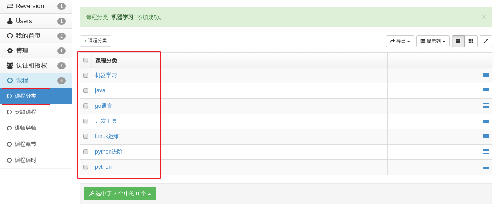

在说本节内容之前，我们说一下，大家自行完成一个任务，就是忘记密码，点击之后跳转到修改密码的页面（发短信判断是否是当前用户的操作，然后拿到手机号判断一下用户是否存在，存在的话再进行跳转到修改密码页面），修改成功之后要通过邮件发送的形式（163、qq等）告知用户（celery异步任务）。（所以还需要在用户修改页面让用户输入一个邮箱，或者给用户表新增一个邮箱字段，看自己怎么玩）。邮件发送django后端配置自行去官方文档上查看，如何配置以及如何写程序，还有一个任务就是我们登录页面那个短信登录功能。


# 课程列表页

## 前端显示课程列表页面

在xadmin中增加课程列表的链接导航。然后把课程列表页面组件Course.vue放到项目中.

```vue
<template>
  <div class="course">
    <Header></Header>
    <div class="main">
      <!-- 筛选条件 -->
      <div class="condition">
        <ul class="cate-list">
          <li class="title">课程分类:</li>
          <li class="this">全部</li>
          <li>Python</li>
          <li>Linux运维</li>
          <li>Python进阶</li>
          <li>开发工具</li>
          <li>Go语言</li>
          <li>机器学习</li>
          <li>技术生涯</li>
        </ul>

        <div class="ordering">
          <ul>
            <li class="title">筛&nbsp;&nbsp;&nbsp;&nbsp;&nbsp;&nbsp;&nbsp;&nbsp;选: </li>
            <li class="default this">默认</li>
            <li class="hot this">人气</li>
            <li class="price this">价格</li>
          </ul>
          <p class="condition-result">共21个课程</p>
        </div>

      </div>
      <!-- 课程列表 -->
      <div class="course-list">
        <div class="course-item">
          <div class="course-image">
            
          </div>
          <div class="course-info">
            <h3><router-link to="/course/detail/1">Python开发21天入门</router-link> <span>100人已加入学习</span></h3>
            <p class="teather-info">Alex 金角大王 老男孩Python教学总监 <span>共154课时/更新完成</span></p>
            <ul class="lesson-list">
              <li><span class="lesson-title">01 | 第1节：初识编码</span> <span class="free">免费</span></li>
              <li><span class="lesson-title">01 | 第1节：初识编码初识编码</span> <span class="free">免费</span></li>
              <li><span class="lesson-title">01 | 第1节：初识编码</span> <span class="free">免费</span></li>
              <li><span class="lesson-title">01 | 第1节：初识编码初识编码初识编码初识编码</span> <span class="free">免费</span></li>
            </ul>
            <div class="pay-box">
              <span class="discount-type">限时免费</span>
              <span class="discount-price">￥0.00元</span>
              <span class="original-price">原价：9.00元</span>
              <span class="buy-now">立即购买</span>
            </div>
          </div>
        </div>
        <div class="course-item">
          <div class="course-image">
            
          </div>
          <div class="course-info">
            <h3>Python开发21天入门 <span>100人已加入学习</span></h3>
            <p class="teather-info">Alex 金角大王 老男孩Python教学总监 <span>共154课时/更新完成</span></p>
            <ul class="lesson-list">
              <li><span class="lesson-title">01 | 第1节：初识编码</span> <span class="free">免费</span></li>
              <li><span class="lesson-title">01 | 第1节：初识编码初识编码</span> <span class="free">免费</span></li>
              <li><span class="lesson-title">01 | 第1节：初识编码</span> <span class="free">免费</span></li>
              <li><span class="lesson-title">01 | 第1节：初识编码初识编码初识编码初识编码</span> <span class="free">免费</span></li>
            </ul>
            <div class="pay-box">
              <span class="discount-type">限时免费</span>
              <span class="discount-price">￥0.00元</span>
              <span class="original-price">原价：9.00元</span>
              <span class="buy-now">立即购买</span>
            </div>
          </div>
        </div>
        <div class="course-item">
          <div class="course-image">
            
          </div>
          <div class="course-info">
            <h3>Python开发21天入门 <span>100人已加入学习</span></h3>
            <p class="teather-info">Alex 金角大王 老男孩Python教学总监 <span>共154课时/更新完成</span></p>
            <ul class="lesson-list">
              <li><span class="lesson-title">01 | 第1节：初识编码</span> <span class="free">免费</span></li>
              <li><span class="lesson-title">01 | 第1节：初识编码初识编码</span> <span class="free">免费</span></li>
              <li><span class="lesson-title">01 | 第1节：初识编码</span> <span class="free">免费</span></li>
              <li><span class="lesson-title">01 | 第1节：初识编码初识编码初识编码初识编码</span> <span class="free">免费</span></li>
            </ul>
            <div class="pay-box">
              <span class="discount-type">限时免费</span>
              <span class="discount-price">￥0.00元</span>
              <span class="original-price">原价：9.00元</span>
              <span class="buy-now">立即购买</span>
            </div>
          </div>
        </div>
        <div class="course-item">
          <div class="course-image">
            
          </div>
          <div class="course-info">
            <h3>Python开发21天入门 <span>100人已加入学习</span></h3>
            <p class="teather-info">Alex 金角大王 老男孩Python教学总监 <span>共154课时/更新完成</span></p>
            <ul class="lesson-list">
              <li><span class="lesson-title">01 | 第1节：初识编码</span> <span class="free">免费</span></li>
              <li><span class="lesson-title">01 | 第1节：初识编码初识编码</span> <span class="free">免费</span></li>
              <li><span class="lesson-title">01 | 第1节：初识编码</span> <span class="free">免费</span></li>
              <li><span class="lesson-title">01 | 第1节：初识编码初识编码初识编码初识编码</span> <span class="free">免费</span></li>
            </ul>
            <div class="pay-box">
              <span class="discount-type">限时免费</span>
              <span class="discount-price">￥0.00元</span>
              <span class="original-price">原价：9.00元</span>
              <span class="buy-now">立即购买</span>
            </div>
          </div>
        </div>
      </div>
    </div>
    <Footer></Footer>
  </div>
</template>

<script>
  import Header from "./common/Header"
  import Footer from "./common/Footer"
  export default {
      name: "Course",
      data(){
        return{
          category:0,
        }
      },
      components:{
        Header,
        Footer,
      }
  }
</script>


<style scoped>
  .course{
    background: #f6f6f6;
  }
  .course .main{
    width: 1100px;
    margin: 35px auto 0;
  }
  .course .condition{
    margin-bottom: 35px;
    padding: 25px 30px 25px 20px;
    background: #fff;
    border-radius: 4px;
    box-shadow: 0 2px 4px 0 #f0f0f0;
  }
  .course .cate-list{
    border-bottom: 1px solid #333;
    border-bottom-color: rgba(51,51,51,.05);
    padding-bottom: 18px;
    margin-bottom: 17px;
  }
  .course .cate-list::after{
    content:"";
    display: block;
    clear: both;
  }
  .course .cate-list li{
    float: left;
    font-size: 16px;
    padding: 6px 15px;
    line-height: 16px;
    margin-left: 14px;
    position: relative;
    transition: all .3s ease;
    cursor: pointer;
    color: #4a4a4a;
    border: 1px solid transparent; /* transparent 透明 */
  }
  .course .cate-list .title{
    color: #888;
    margin-left: 0;
    letter-spacing: .36px;
    padding: 0;
    line-height: 28px;
  }
  .course .cate-list .this{
    color: #ffc210;
    border: 1px solid #ffc210!important;
    border-radius: 30px;
  }
  .course .ordering::after{
    content:"";
    display: block;
    clear: both;
  }
  .course .ordering ul{
    float: left;
  }
  .course .ordering ul::after{
    content:"";
    display: block;
    clear: both;
  }
  .course .ordering .condition-result{
    float: right;
    font-size: 14px;
    color: #9b9b9b;
    line-height: 28px;
  }
  .course .ordering ul li{
    float: left;
    padding: 6px 15px;
    line-height: 16px;
    margin-left: 14px;
    position: relative;
    transition: all .3s ease;
    cursor: pointer;
    color: #4a4a4a;
  }
  .course .ordering .title{
    font-size: 16px;
    color: #888;
    letter-spacing: .36px;
    margin-left: 0;
    padding:0;
    line-height: 28px;
  }
  .course .ordering .this{
    color: #ffc210;
  }
  .course .ordering .price{
    position: relative;
  }
  .course .ordering .price::before,
  .course .ordering .price::after{
    cursor: pointer;
    content:"";
    display: block;
    width: 0px;
    height: 0px;
    border: 5px solid transparent;
    position: absolute;
    right: 0;
  }
  .course .ordering .price::before{
    border-bottom: 5px solid #aaa;
    margin-bottom: 2px;
    top: 2px;
  }
  .course .ordering .price::after{
    border-top: 5px solid #aaa;
    bottom: 2px;
  }
  .course .course-item:hover{
    box-shadow: 4px 6px 16px rgba(0,0,0,.5);
  }
  .course .course-item{
    width: 1050px;
    background: #fff;
    padding: 20px 30px 20px 20px;
    margin-bottom: 35px;
    border-radius: 2px;
    cursor: pointer;
    box-shadow: 2px 3px 16px rgba(0,0,0,.1);
    /* css3.0 过渡动画 hover 事件操作 */
    transition: all .2s ease;
  }
  .course .course-item::after{
    content:"";
    display: block;
    clear: both;
  }
  /* 顶级元素 父级元素  当前元素{} */
  .course .course-item .course-image{
    float: left;
    width: 423px;
    height: 210px;
    margin-right: 30px;
  }
  .course .course-item .course-image img{
    width: 100%;
  }
  .course .course-item .course-info{
    float: left;
    width: 596px;
  }
  .course-item .course-info h3 {
    font-size: 26px;
    color: #333;
    font-weight: normal;
    margin-bottom: 8px;
  }
  .course-item .course-info h3 span{
    font-size: 14px;
    color: #9b9b9b;
    float: right;
    margin-top: 14px;
  }
  .course-item .course-info h3 span img{
      width: 11px;
      height: auto;
      margin-right: 7px;
  }
  .course-item .course-info .teather-info{
      font-size: 14px;
      color: #9b9b9b;
      margin-bottom: 14px;
      padding-bottom: 14px;
      border-bottom: 1px solid #333;
      border-bottom-color: rgba(51,51,51,.05);
  }
  .course-item .course-info .teather-info span{
      float: right;
  }
  .course-item .lesson-list::after{
      content:"";
      display: block;
      clear: both;
  }
  .course-item .lesson-list li {
    float: left;
    width: 44%;
    font-size: 14px;
    color: #666;
    padding-left: 22px;
    /* background: url("路径") 是否平铺 x轴位置 y轴位置 */
    background: url("/static/image/play-icon-gray.svg") no-repeat left 4px;
    margin-bottom: 15px;
  }
  .course-item .lesson-list li .lesson-title{
      /* 以下3句，文本内容过多，会自动隐藏，并显示省略符号 */
      text-overflow: ellipsis;
      overflow: hidden;
      white-space: nowrap;
      display:inline-block;
      max-width: 200px;
  }
  .course-item .lesson-list li:hover{
      background-image: url("/static/image/play-icon-yellow.svg");
      color: #ffc210;
  }
  .course-item .lesson-list li .free{
      width: 34px;
      height: 20px;
      color: #fd7b4d;
      vertical-align: super;
      margin-left: 10px;
      border: 1px solid #fd7b4d;
      border-radius: 2px;
      text-align: center;
      font-size: 13px;
      white-space: nowrap;
  }
  .course-item .lesson-list li:hover .free{
      color: #ffc210;
      border-color: #ffc210;
  }
  .course-item .pay-box::after{
    content:"";
    display: block;
    clear: both;
  }
  .course-item .pay-box .discount-type{
    padding: 6px 10px;
    font-size: 16px;
    color: #fff;
    text-align: center;
    margin-right: 8px;
    background: #fa6240;
    border: 1px solid #fa6240;
    border-radius: 10px 0 10px 0;
    float: left;
  }
  .course-item .pay-box .discount-price{
    font-size: 24px;
    color: #fa6240;
    float: left;
  }
  .course-item .pay-box .original-price{
    text-decoration: line-through;
    font-size: 14px;
    color: #9b9b9b;
    margin-left: 10px;
    float: left;
    margin-top: 10px;
  }
  .course-item .pay-box .buy-now{
    width: 120px;
    height: 38px;
    background: transparent;
    color: #fa6240;
    font-size: 16px;
    border: 1px solid #fd7b4d;
    border-radius: 3px;
    transition: all .2s ease-in-out;
    float: right;
    text-align: center;
    line-height: 38px;
  }
  .course-item .pay-box .buy-now:hover{
    color: #fff;
    background: #ffc210;
    border: 1px solid #ffc210;
  }
</style>

```


### 注册路由

```javascript
import Vue from 'vue'
import Router from 'vue-router'

Vue.use(Router)
// @ 表示src目录
import Home from "@/components/Home"
import Login from "@/components/Login"
import Register from "@/components/Register"
import Course from "@/components/Course"
export default new Router({
  mode:"history",
  routes: [
		// 。。。
    
    {
      path: '/course',
      name: 'Course',
      component: Course,
    }
  ]
})

```


### 分析课程列表页面中的出现的数据之间的关系

看那个excel表。

```
课程分类: 
课程信息:
课程章节:
课时信息:
老师信息:
价格策略:(限时免费\限时折扣\限时满减\原价\优惠券)
```


## 课程子应用创建

```python
python ../../manage.py startapp course
```


### 注册子应用

```python
INSTALLED_APPS = [
		...
    'course',
]
```


## 数据模型创建

```python
from django.db import models
from luffyapi.utils.model import BaseModel


# Create your models here.

class Teacher(BaseModel):
    """讲师、导师表"""
    role_choices = (
        (0, '讲师'),
        (1, '导师'),
        (2, '班主任'),
    )
    name = models.CharField(max_length=32, verbose_name="讲师title")
    role = models.SmallIntegerField(choices=role_choices, default=0, verbose_name="讲师身份")
    title = models.CharField(max_length=64, verbose_name="职位、职称")
    signature = models.CharField(max_length=255, verbose_name="导师签名", help_text="导师签名", blank=True, null=True)
    image = models.ImageField(upload_to="Teacher", null=True, verbose_name="讲师封面")
    brief = models.TextField(max_length=1024, verbose_name="讲师描述")

    class Meta:
        db_table = "ly_teacher"
        verbose_name = "讲师导师"
        verbose_name_plural = "讲师导师"

    def __str__(self):
        return "%s" % self.name

class CourseChapter(BaseModel):
    """课程章节"""
    course = models.ForeignKey("Course", related_name='coursechapters', on_delete=models.CASCADE, verbose_name="课程名称")
    chapter = models.SmallIntegerField(verbose_name="第几章", default=1)
    name = models.CharField(max_length=128, verbose_name="章节标题")
    summary = models.TextField(verbose_name="章节介绍", blank=True, null=True)
    pub_date = models.DateField(verbose_name="发布日期", auto_now_add=True)

    class Meta:
        db_table = "ly_course_chapter"
        verbose_name = "课程章节"
        verbose_name_plural = "课程章节"

    def __str__(self):
        return "%s:(第%s章)%s" % (self.course, self.chapter, self.name)


class CourseLesson(BaseModel):
    """课程课时"""
    section_type_choices = (
        (0, '文档'),
        (1, '练习'),
        (2, '视频')
    )
    chapter = models.ForeignKey("CourseChapter", related_name='coursesections', on_delete=models.CASCADE,
                                verbose_name="课程章节")
    name = models.CharField(max_length=128, verbose_name="课时标题")
    # orders = models.PositiveSmallIntegerField(verbose_name="课时排序") #在basemodel里面已经有了排序了
    section_type = models.SmallIntegerField(default=2, choices=section_type_choices, verbose_name="课时种类")
    section_link = models.CharField(max_length=255, blank=True, null=True, verbose_name="课时链接",
                                    help_text="若是video，填vid,若是文档，填link")
    duration = models.CharField(verbose_name="视频时长", blank=True, null=True,
                                max_length=32)  # 仅在前端展示使用，所以直接让上传视频的用户直接填写时长进来就可以了。
    pub_date = models.DateTimeField(verbose_name="发布时间", auto_now_add=True)
    free_trail = models.BooleanField(verbose_name="是否可试看", default=False)
    course = models.ForeignKey('Course', related_name='course_lesson', verbose_name='课程', on_delete=models.CASCADE,
                               null=True, blank=True)
    is_show_list = models.BooleanField(verbose_name='是否推荐到课程列表', default=False)
    lesson = models.IntegerField(verbose_name="第几课时")


    class Meta:
        db_table = "ly_course_lesson"
        verbose_name = "课程课时"
        verbose_name_plural = "课程课时"


    def __str__(self):
        return "%s-%s" % (self.chapter, self.name)
        from django.db import models

class CourseCategory(BaseModel):
    """
    课程分类
    """
    name = models.CharField(max_length=64, unique=True, verbose_name="分类名称")

    class Meta:
        db_table = "ly_course_category"
        verbose_name = "课程分类"
        verbose_name_plural = "课程分类"

    def __str__(self):
        return "%s" % self.name


class Course(BaseModel):
    """
    专题课程
    """
    course_type = (
        (0, '付费'),
        (1, 'VIP专享'),
        (2, '学位课程')
    )
    level_choices = (
        (0, '初级'),
        (1, '中级'),
        (2, '高级'),
    )
    status_choices = (
        (0, '上线'),
        (1, '下线'),
        (2, '预上线'),
    )
    name = models.CharField(max_length=128, verbose_name="课程名称")
    course_img = models.ImageField(upload_to="course", max_length=255, verbose_name="封面图片", blank=True, null=True)

    # 费用类型字段是为了后期一些其他功能拓展用的，现在可以先不用，或者去掉它，目前我们项目用不到
    course_type = models.SmallIntegerField(choices=course_type, default=0, verbose_name="付费类型")
    # 这个字段是课程详情页里面展示的，并且详情介绍里面用户将来可能要上传一些图片之类的，所以我们会潜入富文本编辑器，让用户填写数据的时候可以上传图片啊、写标题啊、css、html等等内容
    brief = models.TextField(max_length=2048, verbose_name="详情介绍", null=True, blank=True)

    level = models.SmallIntegerField(choices=level_choices, default=1, verbose_name="难度等级")
    pub_date = models.DateField(verbose_name="发布日期", auto_now_add=True)
    period = models.IntegerField(verbose_name="建议学习周期(day)", default=7)

    # 课件资料的存放路径
    attachment_path = models.FileField(max_length=128, verbose_name="课件路径", blank=True, null=True)
    status = models.SmallIntegerField(choices=status_choices, default=0, verbose_name="课程状态")
    course_category = models.ForeignKey("CourseCategory", on_delete=models.CASCADE, null=True, blank=True,
                                        verbose_name="课程分类")
    students = models.IntegerField(verbose_name="学习人数", default=0)
    lessons = models.IntegerField(verbose_name="总课时数量", default=0)

    # 总课时数量可能10个，但是目前之更新了3个，就跟小说、电视剧连载似的。
    pub_lessons = models.IntegerField(verbose_name="课时更新数量", default=0)

    # 课程原价
    price = models.DecimalField(max_digits=6, decimal_places=2, verbose_name="课程原价", default=0)
    teacher = models.ForeignKey(Teacher, on_delete=models.DO_NOTHING, null=True, blank=True, verbose_name="授课老师")

    class Meta:
        db_table = "ly_course"
        verbose_name = "专题课程"
        verbose_name_plural = "专题课程"

    def __str__(self):
        return "%s" % self.name


```


### 执行数据迁移

```python
python manage.py makemigrations
python manage.py migrate
```


**Django数据库迁移报错InconsistentMigrationHistory**

参考 https://blog.csdn.net/weixin_44621343/article/details/117389334

```bash
解决方案一：
把之前数据库中生成的所有表删除，重新进行迁移   
执行删库命令（服务器远端慎用）：drop database [数据库名]
然后然后重新创建数据库：create database [数据库名]    careate database luffy charset=utf8mb4;
```

```
ERRORS:
assets.Asset.admin: (fields.E300) Field defines a relation with model 'User', which is either not installed, or is abstract.
参考： https://www.cnblogs.com/tqtl911/p/10020343.html
在settings.py中添加如下配置：
SILENCED_SYSTEM_CHECKS = ['fields.E300',]
2、将models.py文件中的'Teacher'去掉双引号，改为Teacher


```

把当前新增的课程模型注册到xadmin里面.

xadmin/adminx.py,代码:

```python
import xadmin

from course.models import CourseCategory
class CourseCategoryModelAdmin(object):
    """课程分类模型管理类"""
    pass
xadmin.site.register(CourseCategory, CourseCategoryModelAdmin)


from course.models import Course
class CourseModelAdmin(object):
    """课程模型管理类"""
    pass
xadmin.site.register(Course, CourseModelAdmin)


from course.models import Teacher
class TeacherModelAdmin(object):
    """老师模型管理类"""
    pass
xadmin.site.register(Teacher, TeacherModelAdmin)


from course.models import CourseChapter
class CourseChapterModelAdmin(object):
    """课程章节模型管理类"""
    pass
xadmin.site.register(CourseChapter, CourseChapterModelAdmin)


from course.models import CourseLesson
class CourseLessonModelAdmin(object):
    """课程课时模型管理类"""
    pass
xadmin.site.register(CourseLesson, CourseLessonModelAdmin)
```


#### 添加测试数据



```python
use luffy;
INSERT INTO `ly_course_category` (`id`,`orders`,`is_show`,`is_deleted`,`created_time`,`updated_time`,`name`)
 VALUES
(1,11,1,0,'2019-08-13 07:08:47.100074','2019-08-13 07:44:05.903782','python'),
(2,0,1,0,'2019-08-13 07:08:51.451093','2019-08-13 07:43:54.558940','go编程'),
(3,3,1,0,'2019-08-13 07:08:57.390196','2019-08-13 07:08:57.390226','Linux运维'),
(4,4,1,0,'2019-08-13 07:09:11.465963','2019-08-13 07:09:11.465994','前端开发'),
(5,11,1,0,'2019-08-13 07:08:47.100074','2019-08-13 07:44:05.903782','php编程'),
(6,0,1,0,'2019-08-13 07:08:51.451093','2019-08-13 07:43:54.558940','C/C++'),
(7,3,1,0,'2019-08-13 07:08:57.390196','2019-08-13 07:08:57.390226','java web'),
(8,4,1,0,'2019-08-13 07:09:11.465963','2019-08-13 07:09:11.465994','UI设计'),
(9,11,1,0,'2019-08-13 07:09:11.465963','2019-08-13 07:09:11.465994','语文'),
(10,145,2,0,'2019-08-13 07:09:11.465963','2019-08-13 07:09:11.465994','数学'),
(11,1,2,0,'2019-08-13 07:09:11.465963','2019-08-13 07:09:11.465994','英语');
```


## 后端实现课程分类列表接口

### 创建序列化器

courses/serializers.py

```python
from rest_framework import serializers
from .models import CourseCategory
class CourseCategoryModelSerializer(serializers.ModelSerializer):
    class Meta:
        model = CourseCategory
        fields = ["id","name"]
```

### 创建视图

courses/views.py

```python
from rest_framework.generics import ListAPIView
from .models import CourseCategory
from .serializers import CourseCategoryModelSerializer
class CourseCategoryListAPIView(ListAPIView):
    queryset = CourseCategory.objects.filter(is_show=True,is_deleted=False).order_by("orders")
    serializer_class = CourseCategoryModelSerializer
```


### 注册路由

```python
from django.urls import path, re_path
from . import views
urlpatterns = [
    path(r'category/', views.CourseCategoryListAPIView.as_view() ),
]


# 总路由
    path('course/', include("course.urls")),
```


### 客户端发送请求获取课程分类信息

```vue
<template>
  <div class="course">
    <Header></Header>
    <div class="main">
      <!-- 筛选条件 -->
      <div class="condition">
        <ul class="cate-list">
          <li class="title">课程分类:</li>
          <li class="this">全部</li>
          <li v-for="cat in category_list">{{cat.name}}</li>
        </ul>

        <div class="ordering">
          <ul>
            <li class="title">筛&nbsp;&nbsp;&nbsp;&nbsp;&nbsp;&nbsp;&nbsp;&nbsp;选: </li>
            <li class="default this">默认</li>
            <li class="hot this">人气</li>
            <li class="price this">价格</li>
          </ul>
          <p class="condition-result">共21个课程</p>
        </div>

      </div>
      <!-- 课程列表 -->
      <div class="course-list">
        <div class="course-item">
          <div class="course-image">
            
          </div>
          <div class="course-info">
            <h3><router-link to="/course/detail/1">Python开发21天入门</router-link> <span>100人已加入学习</span></h3>
            <p class="teather-info">Alex 金角大王 老男孩Python教学总监 <span>共154课时/更新完成</span></p>
            <ul class="lesson-list">
              <li><span class="lesson-title">01 | 第1节：初识编码</span> <span class="free">免费</span></li>
              <li><span class="lesson-title">01 | 第1节：初识编码初识编码</span> <span class="free">免费</span></li>
              <li><span class="lesson-title">01 | 第1节：初识编码</span> <span class="free">免费</span></li>
              <li><span class="lesson-title">01 | 第1节：初识编码初识编码初识编码初识编码</span> <span class="free">免费</span></li>
            </ul>
            <div class="pay-box">
              <span class="discount-type">限时免费</span>
              <span class="discount-price">￥0.00元</span>
              <span class="original-price">原价：9.00元</span>
              <span class="buy-now">立即购买</span>
            </div>
          </div>
        </div>
        <div class="course-item">
          <div class="course-image">
            
          </div>
          <div class="course-info">
            <h3>Python开发21天入门 <span>100人已加入学习</span></h3>
            <p class="teather-info">Alex 金角大王 老男孩Python教学总监 <span>共154课时/更新完成</span></p>
            <ul class="lesson-list">
              <li><span class="lesson-title">01 | 第1节：初识编码</span> <span class="free">免费</span></li>
              <li><span class="lesson-title">01 | 第1节：初识编码初识编码</span> <span class="free">免费</span></li>
              <li><span class="lesson-title">01 | 第1节：初识编码</span> <span class="free">免费</span></li>
              <li><span class="lesson-title">01 | 第1节：初识编码初识编码初识编码初识编码</span> <span class="free">免费</span></li>
            </ul>
            <div class="pay-box">
              <span class="discount-type">限时免费</span>
              <span class="discount-price">￥0.00元</span>
              <span class="original-price">原价：9.00元</span>
              <span class="buy-now">立即购买</span>
            </div>
          </div>
        </div>
        <div class="course-item">
          <div class="course-image">
            
          </div>
          <div class="course-info">
            <h3>Python开发21天入门 <span>100人已加入学习</span></h3>
            <p class="teather-info">Alex 金角大王 老男孩Python教学总监 <span>共154课时/更新完成</span></p>
            <ul class="lesson-list">
              <li><span class="lesson-title">01 | 第1节：初识编码</span> <span class="free">免费</span></li>
              <li><span class="lesson-title">01 | 第1节：初识编码初识编码</span> <span class="free">免费</span></li>
              <li><span class="lesson-title">01 | 第1节：初识编码</span> <span class="free">免费</span></li>
              <li><span class="lesson-title">01 | 第1节：初识编码初识编码初识编码初识编码</span> <span class="free">免费</span></li>
            </ul>
            <div class="pay-box">
              <span class="discount-type">限时免费</span>
              <span class="discount-price">￥0.00元</span>
              <span class="original-price">原价：9.00元</span>
              <span class="buy-now">立即购买</span>
            </div>
          </div>
        </div>
        <div class="course-item">
          <div class="course-image">
            
          </div>
          <div class="course-info">
            <h3>Python开发21天入门 <span>100人已加入学习</span></h3>
            <p class="teather-info">Alex 金角大王 老男孩Python教学总监 <span>共154课时/更新完成</span></p>
            <ul class="lesson-list">
              <li><span class="lesson-title">01 | 第1节：初识编码</span> <span class="free">免费</span></li>
              <li><span class="lesson-title">01 | 第1节：初识编码初识编码</span> <span class="free">免费</span></li>
              <li><span class="lesson-title">01 | 第1节：初识编码</span> <span class="free">免费</span></li>
              <li><span class="lesson-title">01 | 第1节：初识编码初识编码初识编码初识编码</span> <span class="free">免费</span></li>
            </ul>
            <div class="pay-box">
              <span class="discount-type">限时免费</span>
              <span class="discount-price">￥0.00元</span>
              <span class="original-price">原价：9.00元</span>
              <span class="buy-now">立即购买</span>
            </div>
          </div>
        </div>
      </div>
    </div>
    <Footer></Footer>
  </div>
</template>

<script>
  import Header from "./common/Header"
  import Footer from "./common/Footer"
  export default {
      name: "Course",
      data(){
        return{
          category: 0, //当前用户选择的是哪个课程
          category_list:[],
        }
      },
      created(){
        this.get_course_category();
      },
      methods:{
        get_course_category(){
            // 获取课程分类信息
            this.$axios.get(`${this.$settings.Host}/course/category/`).then(response=>{
                this.category_list = response.data;
            })
        }
      },
      components:{
        Header,
        Footer,
      }
  }
</script>


<style scoped>
  .course{
    background: #f6f6f6;
  }
  .course .main{
    width: 1100px;
    margin: 35px auto 0;
  }
  .course .condition{
    margin-bottom: 35px;
    padding: 25px 30px 25px 20px;
    background: #fff;
    border-radius: 4px;
    box-shadow: 0 2px 4px 0 #f0f0f0;
  }
  .course .cate-list{
    border-bottom: 1px solid #333;
    border-bottom-color: rgba(51,51,51,.05);
    padding-bottom: 18px;
    margin-bottom: 17px;
  }
  .course .cate-list::after{
    content:"";
    display: block;
    clear: both;
  }
  .course .cate-list li{
    float: left;
    font-size: 16px;
    padding: 6px 15px;
    line-height: 16px;
    margin-left: 14px;
    position: relative;
    transition: all .3s ease;
    cursor: pointer;
    color: #4a4a4a;
    border: 1px solid transparent; /* transparent 透明 */
  }
  .course .cate-list .title{
    color: #888;
    margin-left: 0;
    letter-spacing: .36px;
    padding: 0;
    line-height: 28px;
  }
  .course .cate-list .this{
    color: #ffc210;
    border: 1px solid #ffc210!important;
    border-radius: 30px;
  }
  .course .ordering::after{
    content:"";
    display: block;
    clear: both;
  }
  .course .ordering ul{
    float: left;
  }
  .course .ordering ul::after{
    content:"";
    display: block;
    clear: both;
  }
  .course .ordering .condition-result{
    float: right;
    font-size: 14px;
    color: #9b9b9b;
    line-height: 28px;
  }
  .course .ordering ul li{
    float: left;
    padding: 6px 15px;
    line-height: 16px;
    margin-left: 14px;
    position: relative;
    transition: all .3s ease;
    cursor: pointer;
    color: #4a4a4a;
  }
  .course .ordering .title{
    font-size: 16px;
    color: #888;
    letter-spacing: .36px;
    margin-left: 0;
    padding:0;
    line-height: 28px;
  }
  .course .ordering .this{
    color: #ffc210;
  }
  .course .ordering .price{
    position: relative;
  }
  .course .ordering .price::before,
  .course .ordering .price::after{
    cursor: pointer;
    content:"";
    display: block;
    width: 0px;
    height: 0px;
    border: 5px solid transparent;
    position: absolute;
    right: 0;
  }
  .course .ordering .price::before{
    border-bottom: 5px solid #aaa;
    margin-bottom: 2px;
    top: 2px;
  }
  .course .ordering .price::after{
    border-top: 5px solid #aaa;
    bottom: 2px;
  }
  .course .course-item:hover{
    box-shadow: 4px 6px 16px rgba(0,0,0,.5);
  }
  .course .course-item{
    width: 1050px;
    background: #fff;
    padding: 20px 30px 20px 20px;
    margin-bottom: 35px;
    border-radius: 2px;
    cursor: pointer;
    box-shadow: 2px 3px 16px rgba(0,0,0,.1);
    /* css3.0 过渡动画 hover 事件操作 */
    transition: all .2s ease;
  }
  .course .course-item::after{
    content:"";
    display: block;
    clear: both;
  }
  /* 顶级元素 父级元素  当前元素{} */
  .course .course-item .course-image{
    float: left;
    width: 423px;
    height: 210px;
    margin-right: 30px;
  }
  .course .course-item .course-image img{
    width: 100%;
  }
  .course .course-item .course-info{
    float: left;
    width: 596px;
  }
  .course-item .course-info h3 {
    font-size: 26px;
    color: #333;
    font-weight: normal;
    margin-bottom: 8px;
  }
  .course-item .course-info h3 span{
    font-size: 14px;
    color: #9b9b9b;
    float: right;
    margin-top: 14px;
  }
  .course-item .course-info h3 span img{
      width: 11px;
      height: auto;
      margin-right: 7px;
  }
  .course-item .course-info .teather-info{
      font-size: 14px;
      color: #9b9b9b;
      margin-bottom: 14px;
      padding-bottom: 14px;
      border-bottom: 1px solid #333;
      border-bottom-color: rgba(51,51,51,.05);
  }
  .course-item .course-info .teather-info span{
      float: right;
  }
  .course-item .lesson-list::after{
      content:"";
      display: block;
      clear: both;
  }
  .course-item .lesson-list li {
    float: left;
    width: 44%;
    font-size: 14px;
    color: #666;
    padding-left: 22px;
    /* background: url("路径") 是否平铺 x轴位置 y轴位置 */
    background: url("/static/image/play-icon-gray.svg") no-repeat left 4px;
    margin-bottom: 15px;
  }
  .course-item .lesson-list li .lesson-title{
      /* 以下3句，文本内容过多，会自动隐藏，并显示省略符号 */
      text-overflow: ellipsis;
      overflow: hidden;
      white-space: nowrap;
      display:inline-block;
      max-width: 200px;
  }
  .course-item .lesson-list li:hover{
      background-image: url("/static/image/play-icon-yellow.svg");
      color: #ffc210;
  }
  .course-item .lesson-list li .free{
      width: 34px;
      height: 20px;
      color: #fd7b4d;
      vertical-align: super;
      margin-left: 10px;
      border: 1px solid #fd7b4d;
      border-radius: 2px;
      text-align: center;
      font-size: 13px;
      white-space: nowrap;
  }
  .course-item .lesson-list li:hover .free{
      color: #ffc210;
      border-color: #ffc210;
  }
  .course-item .pay-box::after{
    content:"";
    display: block;
    clear: both;
  }
  .course-item .pay-box .discount-type{
    padding: 6px 10px;
    font-size: 16px;
    color: #fff;
    text-align: center;
    margin-right: 8px;
    background: #fa6240;
    border: 1px solid #fa6240;
    border-radius: 10px 0 10px 0;
    float: left;
  }
  .course-item .pay-box .discount-price{
    font-size: 24px;
    color: #fa6240;
    float: left;
  }
  .course-item .pay-box .original-price{
    text-decoration: line-through;
    font-size: 14px;
    color: #9b9b9b;
    margin-left: 10px;
    float: left;
    margin-top: 10px;
  }
  .course-item .pay-box .buy-now{
    width: 120px;
    height: 38px;
    background: transparent;
    color: #fa6240;
    font-size: 16px;
    border: 1px solid #fd7b4d;
    border-radius: 3px;
    transition: all .2s ease-in-out;
    float: right;
    text-align: center;
    line-height: 38px;
  }
  .course-item .pay-box .buy-now:hover{
    color: #fff;
    background: #ffc210;
    border: 1px solid #ffc210;
  }
</style>

```


## 实现课程分类点击高亮效果

```vue
<template>
  <div class="course">
    <Header></Header>
    <div class="main">
      <!-- 筛选条件 -->
      <div class="condition">
        <ul class="cate-list">
          <li class="title">课程分类:</li>
          <li @click="category=0" :class="category==0?'this':''">全部</li>
          <li @click="category=cat.id" :class="category==cat.id?'this':''" v-for="cat in category_list">{{cat.name}}</li>
        </ul>

        <div class="ordering">
          <ul>
            <li class="title">筛&nbsp;&nbsp;&nbsp;&nbsp;&nbsp;&nbsp;&nbsp;&nbsp;选: </li>
            <li class="default this">默认</li>
            <li class="hot this">人气</li>
            <li class="price this">价格</li>
          </ul>
          <p class="condition-result">共21个课程</p>
        </div>

      </div>
      <!-- 课程列表 -->
      <div class="course-list">
        <div class="course-item">
          <div class="course-image">
            
          </div>
          <div class="course-info">
            <h3><router-link to="/course/detail/1">Python开发21天入门</router-link> <span>100人已加入学习</span></h3>
            <p class="teather-info">Alex 金角大王 老男孩Python教学总监 <span>共154课时/更新完成</span></p>
            <ul class="lesson-list">
              <li><span class="lesson-title">01 | 第1节：初识编码</span> <span class="free">免费</span></li>
              <li><span class="lesson-title">01 | 第1节：初识编码初识编码</span> <span class="free">免费</span></li>
              <li><span class="lesson-title">01 | 第1节：初识编码</span> <span class="free">免费</span></li>
              <li><span class="lesson-title">01 | 第1节：初识编码初识编码初识编码初识编码</span> <span class="free">免费</span></li>
            </ul>
            <div class="pay-box">
              <span class="discount-type">限时免费</span>
              <span class="discount-price">￥0.00元</span>
              <span class="original-price">原价：9.00元</span>
              <span class="buy-now">立即购买</span>
            </div>
          </div>
        </div>
        <div class="course-item">
          <div class="course-image">
            
          </div>
          <div class="course-info">
            <h3>Python开发21天入门 <span>100人已加入学习</span></h3>
            <p class="teather-info">Alex 金角大王 老男孩Python教学总监 <span>共154课时/更新完成</span></p>
            <ul class="lesson-list">
              <li><span class="lesson-title">01 | 第1节：初识编码</span> <span class="free">免费</span></li>
              <li><span class="lesson-title">01 | 第1节：初识编码初识编码</span> <span class="free">免费</span></li>
              <li><span class="lesson-title">01 | 第1节：初识编码</span> <span class="free">免费</span></li>
              <li><span class="lesson-title">01 | 第1节：初识编码初识编码初识编码初识编码</span> <span class="free">免费</span></li>
            </ul>
            <div class="pay-box">
              <span class="discount-type">限时免费</span>
              <span class="discount-price">￥0.00元</span>
              <span class="original-price">原价：9.00元</span>
              <span class="buy-now">立即购买</span>
            </div>
          </div>
        </div>
        <div class="course-item">
          <div class="course-image">
            
          </div>
          <div class="course-info">
            <h3>Python开发21天入门 <span>100人已加入学习</span></h3>
            <p class="teather-info">Alex 金角大王 老男孩Python教学总监 <span>共154课时/更新完成</span></p>
            <ul class="lesson-list">
              <li><span class="lesson-title">01 | 第1节：初识编码</span> <span class="free">免费</span></li>
              <li><span class="lesson-title">01 | 第1节：初识编码初识编码</span> <span class="free">免费</span></li>
              <li><span class="lesson-title">01 | 第1节：初识编码</span> <span class="free">免费</span></li>
              <li><span class="lesson-title">01 | 第1节：初识编码初识编码初识编码初识编码</span> <span class="free">免费</span></li>
            </ul>
            <div class="pay-box">
              <span class="discount-type">限时免费</span>
              <span class="discount-price">￥0.00元</span>
              <span class="original-price">原价：9.00元</span>
              <span class="buy-now">立即购买</span>
            </div>
          </div>
        </div>
        <div class="course-item">
          <div class="course-image">
            
          </div>
          <div class="course-info">
            <h3>Python开发21天入门 <span>100人已加入学习</span></h3>
            <p class="teather-info">Alex 金角大王 老男孩Python教学总监 <span>共154课时/更新完成</span></p>
            <ul class="lesson-list">
              <li><span class="lesson-title">01 | 第1节：初识编码</span> <span class="free">免费</span></li>
              <li><span class="lesson-title">01 | 第1节：初识编码初识编码</span> <span class="free">免费</span></li>
              <li><span class="lesson-title">01 | 第1节：初识编码</span> <span class="free">免费</span></li>
              <li><span class="lesson-title">01 | 第1节：初识编码初识编码初识编码初识编码</span> <span class="free">免费</span></li>
            </ul>
            <div class="pay-box">
              <span class="discount-type">限时免费</span>
              <span class="discount-price">￥0.00元</span>
              <span class="original-price">原价：9.00元</span>
              <span class="buy-now">立即购买</span>
            </div>
          </div>
        </div>
      </div>
    </div>
    <Footer></Footer>
  </div>
</template>

<script>
  import Header from "./common/Header"
  import Footer from "./common/Footer"
  export default {
      name: "Course",
      data(){
        return{
          category: 0,
          category_list:[],
        }
      },
      created(){
        this.get_course_category();
      },
      methods:{
        get_course_category(){
            // 获取课程分类信息
            this.$axios.get(`${this.$settings.HOST}/course/category/`).then(response=>{
                this.category_list = response.data;
            })
        }
      },
      components:{
        Header,
        Footer,
      }
  }
</script>
```


## 课程信息筛选条件的排序高亮效果实现

```vue
<template>
  <div class="course">
    <Header></Header>
    <div class="main">
      <!-- 筛选条件 -->
      <div class="condition">
        <ul class="cate-list">
          <li class="title">课程分类:</li>
          <li @click="category=0" :class="category==0?'this':''">全部</li>
          <li @click="category=cat.id" :class="category==cat.id?'this':''" v-for="cat in category_list">{{cat.name}}</li>
        </ul>

        <div class="ordering">
          <ul>
            <li class="title">筛&nbsp;&nbsp;&nbsp;&nbsp;&nbsp;&nbsp;&nbsp;&nbsp;选: </li>
            <li @click="change_order_type(0)" class="default" :class="change_order_class(0)">默认</li>
            <li @click="change_order_type(1)" class="hot" :class="change_order_class(1)">人气</li>
            <li @click="change_order_type(2)" class="price" :class="change_order_class(2)">价格</li>

<!--            <li @click="filters.type=0" class="default" :class="filters.type==0?'this':''">默认</li>-->
<!--            <li @click="filters.type=1" class="hot" :class="filters.type==1?'this':''">人气</li>-->
<!--            <li @click="filters.type=2" class="price" :class="filters.type==2?'this':''">价格</li>-->
          </ul>
          <p class="condition-result">共21个课程</p>
        </div>

      </div>
      <!-- 课程列表 -->
      <div class="course-list">
        <div class="course-item">
          <div class="course-image">
            
          </div>
          <div class="course-info">
            <h3><router-link to="/course/detail/1">Python开发21天入门</router-link> <span>100人已加入学习</span></h3>
            <p class="teather-info">Alex 金角大王 老男孩Python教学总监 <span>共154课时/更新完成</span></p>
            <ul class="lesson-list">
              <li><span class="lesson-title">01 | 第1节：初识编码</span> <span class="free">免费</span></li>
              <li><span class="lesson-title">01 | 第1节：初识编码初识编码</span> <span class="free">免费</span></li>
              <li><span class="lesson-title">01 | 第1节：初识编码</span> <span class="free">免费</span></li>
              <li><span class="lesson-title">01 | 第1节：初识编码初识编码初识编码初识编码</span> <span class="free">免费</span></li>
            </ul>
            <div class="pay-box">
              <span class="discount-type">限时免费</span>
              <span class="discount-price">￥0.00元</span>
              <span class="original-price">原价：9.00元</span>
              <span class="buy-now">立即购买</span>
            </div>
          </div>
        </div>
        <div class="course-item">
          <div class="course-image">
            
          </div>
          <div class="course-info">
            <h3>Python开发21天入门 <span>100人已加入学习</span></h3>
            <p class="teather-info">Alex 金角大王 老男孩Python教学总监 <span>共154课时/更新完成</span></p>
            <ul class="lesson-list">
              <li><span class="lesson-title">01 | 第1节：初识编码</span> <span class="free">免费</span></li>
              <li><span class="lesson-title">01 | 第1节：初识编码初识编码</span> <span class="free">免费</span></li>
              <li><span class="lesson-title">01 | 第1节：初识编码</span> <span class="free">免费</span></li>
              <li><span class="lesson-title">01 | 第1节：初识编码初识编码初识编码初识编码</span> <span class="free">免费</span></li>
            </ul>
            <div class="pay-box">
              <span class="discount-type">限时免费</span>
              <span class="discount-price">￥0.00元</span>
              <span class="original-price">原价：9.00元</span>
              <span class="buy-now">立即购买</span>
            </div>
          </div>
        </div>
        <div class="course-item">
          <div class="course-image">
            
          </div>
          <div class="course-info">
            <h3>Python开发21天入门 <span>100人已加入学习</span></h3>
            <p class="teather-info">Alex 金角大王 老男孩Python教学总监 <span>共154课时/更新完成</span></p>
            <ul class="lesson-list">
              <li><span class="lesson-title">01 | 第1节：初识编码</span> <span class="free">免费</span></li>
              <li><span class="lesson-title">01 | 第1节：初识编码初识编码</span> <span class="free">免费</span></li>
              <li><span class="lesson-title">01 | 第1节：初识编码</span> <span class="free">免费</span></li>
              <li><span class="lesson-title">01 | 第1节：初识编码初识编码初识编码初识编码</span> <span class="free">免费</span></li>
            </ul>
            <div class="pay-box">
              <span class="discount-type">限时免费</span>
              <span class="discount-price">￥0.00元</span>
              <span class="original-price">原价：9.00元</span>
              <span class="buy-now">立即购买</span>
            </div>
          </div>
        </div>
        <div class="course-item">
          <div class="course-image">
            
          </div>
          <div class="course-info">
            <h3>Python开发21天入门 <span>100人已加入学习</span></h3>
            <p class="teather-info">Alex 金角大王 老男孩Python教学总监 <span>共154课时/更新完成</span></p>
            <ul class="lesson-list">
              <li><span class="lesson-title">01 | 第1节：初识编码</span> <span class="free">免费</span></li>
              <li><span class="lesson-title">01 | 第1节：初识编码初识编码</span> <span class="free">免费</span></li>
              <li><span class="lesson-title">01 | 第1节：初识编码</span> <span class="free">免费</span></li>
              <li><span class="lesson-title">01 | 第1节：初识编码初识编码初识编码初识编码</span> <span class="free">免费</span></li>
            </ul>
            <div class="pay-box">
              <span class="discount-type">限时免费</span>
              <span class="discount-price">￥0.00元</span>
              <span class="original-price">原价：9.00元</span>
              <span class="buy-now">立即购买</span>
            </div>
          </div>
        </div>
      </div>
    </div>
    <Footer></Footer>
  </div>
</template>

<script>
  import Header from "./common/Header"
  import Footer from "./common/Footer"
  export default {
      name: "Course",
      data(){
        return{
          category: 0,
          category_list:[],
          filters:{
              type: 0, // 筛选类型，0表示默认，1表示人气,2表示价格
              orders: "desc",  // 排序类型，desc表示降序，asc表示升序
          }
        }
      },
      created(){
        this.get_course_category();
      },
      methods:{
        get_course_category(){
            // 获取课程分类信息
            this.$axios.get(`${this.$settings.HOST}/course/category/`).then(response=>{
                this.category_list = response.data;
            })
        },
        change_order_type(type){
            // 更改升序或者降序
            if( this.filters.type === type && this.filters.orders === "desc" ){
                this.filters.orders="asc";
            }else if(this.filters.type === type && this.filters.orders === "asc"){
                this.filters.orders="desc";
            }

            // 更改排序方式
            this.filters.type=type;
        },
        change_order_class(type){
            // 更改当前选中筛选条件的高亮方式
          	// this.filters.orders = "desc"
            if( this.filters.type === type && this.filters.orders === "asc" ){
              return "this asc";
            }else if(this.filters.type===type && this.filters.orders === "desc"){
              return "this desc";
            }else{
              return "";
            }
        }
      },
      components:{
        Header,
        Footer,
      }
  }
</script>


<style scoped>
  .course{
    background: #f6f6f6;
  }
  .course .main{
    width: 1100px;
    margin: 35px auto 0;
  }
  .course .condition{
    margin-bottom: 35px;
    padding: 25px 30px 25px 20px;
    background: #fff;
    border-radius: 4px;
    box-shadow: 0 2px 4px 0 #f0f0f0;
  }
  .course .cate-list{
    border-bottom: 1px solid #333;
    border-bottom-color: rgba(51,51,51,.05);
    padding-bottom: 18px;
    margin-bottom: 17px;
  }
  .course .cate-list::after{
    content:"";
    display: block;
    clear: both;
  }
  .course .cate-list li{
    float: left;
    font-size: 16px;
    padding: 6px 15px;
    line-height: 16px;
    margin-left: 14px;
    position: relative;
    transition: all .3s ease;
    cursor: pointer;
    color: #4a4a4a;
    border: 1px solid transparent; /* transparent 透明 */
  }
  .course .cate-list .title{
    color: #888;
    margin-left: 0;
    letter-spacing: .36px;
    padding: 0;
    line-height: 28px;
  }
  .course .cate-list .this{
    color: #ffc210;
    border: 1px solid #ffc210!important;
    border-radius: 30px;
  }
  .course .ordering::after{
    content:"";
    display: block;
    clear: both;
  }
  .course .ordering ul{
    float: left;
  }
  .course .ordering ul::after{
    content:"";
    display: block;
    clear: both;
  }
  .course .ordering .condition-result{
    float: right;
    font-size: 14px;
    color: #9b9b9b;
    line-height: 28px;
  }
  .course .ordering ul li{
    float: left;
    padding: 6px 15px;
    line-height: 16px;
    margin-left: 14px;
    position: relative;
    transition: all .3s ease;
    cursor: pointer;
    color: #4a4a4a;
  }
  .course .ordering .title{
    font-size: 16px;
    color: #888;
    letter-spacing: .36px;
    margin-left: 0;
    padding:0;
    line-height: 28px;
  }
  .course .ordering .this{
    color: #ffc210;
    position: relative;
  }
  .course .ordering .this::before,
  .course .ordering .this::after{
    cursor: pointer;
    content:"";
    display: block;
    width: 0px;
    height: 0px;
    border: 5px solid transparent;
    position: absolute;
    right: 0;
  }
  .course .ordering .this::before{
    border-bottom: 5px solid #aaa;
    margin-bottom: 2px;
    top: 2px;
  }
  .course .ordering .this::after{
    border-top: 5px solid #aaa;
    bottom: 2px;
  }
  .course .ordering .asc::before{
    border-bottom-color: #ffc210;
  }
  .course .ordering .desc::after{
    border-top-color: #ffc210;
  }
  .course .course-item:hover{
    box-shadow: 4px 6px 16px rgba(0,0,0,.5);
  }
  .course .course-item{
    width: 1050px;
    background: #fff;
    padding: 20px 30px 20px 20px;
    margin-bottom: 35px;
    border-radius: 2px;
    cursor: pointer;
    box-shadow: 2px 3px 16px rgba(0,0,0,.1);
    /* css3.0 过渡动画 hover 事件操作 */
    transition: all .2s ease;
  }
  .course .course-item::after{
    content:"";
    display: block;
    clear: both;
  }
  /* 顶级元素 父级元素  当前元素{} */
  .course .course-item .course-image{
    float: left;
    width: 423px;
    height: 210px;
    margin-right: 30px;
  }
  .course .course-item .course-image img{
    width: 100%;
  }
  .course .course-item .course-info{
    float: left;
    width: 596px;
  }
  .course-item .course-info h3 {
    font-size: 26px;
    color: #333;
    font-weight: normal;
    margin-bottom: 8px;
  }
  .course-item .course-info h3 span{
    font-size: 14px;
    color: #9b9b9b;
    float: right;
    margin-top: 14px;
  }
  .course-item .course-info h3 span img{
      width: 11px;
      height: auto;
      margin-right: 7px;
  }
  .course-item .course-info .teather-info{
      font-size: 14px;
      color: #9b9b9b;
      margin-bottom: 14px;
      padding-bottom: 14px;
      border-bottom: 1px solid #333;
      border-bottom-color: rgba(51,51,51,.05);
  }
  .course-item .course-info .teather-info span{
      float: right;
  }
  .course-item .lesson-list::after{
      content:"";
      display: block;
      clear: both;
  }
  .course-item .lesson-list li {
    float: left;
    width: 44%;
    font-size: 14px;
    color: #666;
    padding-left: 22px;
    /* background: url("路径") 是否平铺 x轴位置 y轴位置 */
    background: url("/static/image/play-icon-gray.svg") no-repeat left 4px;
    margin-bottom: 15px;
  }
  .course-item .lesson-list li .lesson-title{
      /* 以下3句，文本内容过多，会自动隐藏，并显示省略符号 */
      text-overflow: ellipsis;
      overflow: hidden;
      white-space: nowrap;
      display:inline-block;
      max-width: 200px;
  }
  .course-item .lesson-list li:hover{
      background-image: url("/static/image/play-icon-yellow.svg");
      color: #ffc210;
  }
  .course-item .lesson-list li .free{
      width: 34px;
      height: 20px;
      color: #fd7b4d;
      vertical-align: super;
      margin-left: 10px;
      border: 1px solid #fd7b4d;
      border-radius: 2px;
      text-align: center;
      font-size: 13px;
      white-space: nowrap;
  }
  .course-item .lesson-list li:hover .free{
      color: #ffc210;
      border-color: #ffc210;
  }
  .course-item .pay-box::after{
    content:"";
    display: block;
    clear: both;
  }
  .course-item .pay-box .discount-type{
    padding: 6px 10px;
    font-size: 16px;
    color: #fff;
    text-align: center;
    margin-right: 8px;
    background: #fa6240;
    border: 1px solid #fa6240;
    border-radius: 10px 0 10px 0;
    float: left;
  }
  .course-item .pay-box .discount-price{
    font-size: 24px;
    color: #fa6240;
    float: left;
  }
  .course-item .pay-box .original-price{
    text-decoration: line-through;
    font-size: 14px;
    color: #9b9b9b;
    margin-left: 10px;
    float: left;
    margin-top: 10px;
  }
  .course-item .pay-box .buy-now{
    width: 120px;
    height: 38px;
    background: transparent;
    color: #fa6240;
    font-size: 16px;
    border: 1px solid #fd7b4d;
    border-radius: 3px;
    transition: all .2s ease-in-out;
    float: right;
    text-align: center;
    line-height: 38px;
  }
  .course-item .pay-box .buy-now:hover{
    color: #fff;
    background: #ffc210;
    border: 1px solid #ffc210;
  }
</style>
  
```


## 后端实现课程信息列表接口

在xadmin后端添加测试数据

```sql
INSERT INTO `ly_teacher` (`id`,`orders`,`is_show`,`is_deleted`,`created_time`,`updated_time`,`name`,`role`,`title`,`signature`,`image`,`brief`)
VALUES 
(1,1,1,0,'2019-08-13 07:13:01.531992','2019-08-13 07:13:01.532043','李老师',0,'xx公司技术总监','洪七公','teacher/logo2x.png','222');

INSERT INTO `ly_course`
(`id`,`orders`,`is_show`,`is_deleted`,`created_time`,`updated_time`,`name`,`course_img`,`course_type`,`brief`,`level`,`pub_date`,`period`,`attachment_path`,`status`,`students`,`lessons`,`pub_lessons`,`price`,`course_category_id`,`teacher_id`)
VALUES
(1,1,1,0,'2019-08-13 07:13:50.678948','2019-08-15 04:07:11.386224','flask框架','course/Loginbg.3377d0c.jpg',0,'<p>xxxx</p>',1,'2019-08-13',7,'README.md',0,99,110,110,1110.00,1,1),
(2,2,1,0,'2019-08-13 07:15:32.490163','2019-08-15 04:13:22.430368','蘑菇街APP','course/course-cover.jpeg',0,'<p>dxxx</p>',2,'2019-08-13',7,'logo.svg',0,10,50,40,666.00,1,1),
(3,3,1,0,'2019-08-13 07:15:32.490163','2019-08-20 10:49:41.880490','django框架','course/2.jpeg',0,'<p>dxxx</p>',1,'2019-08-13',7,'logo.svg',0,10,50,40,330.00,1,1),
(15,4,1,0,'2019-08-13 07:15:32.490163','2019-08-13 07:15:32.490191','python入门','course/2.jpeg',0,'dxxx',2,'2019-08-13',7,'logo.svg',0,10,50,40,411.00,1,1),
(16,5,1,0,'2019-08-13 07:15:32.490163','2019-08-14 02:28:04.791112','hbase入门','course/2.jpeg',0,'dxxx',1,'2019-08-13',7,'logo.svg',0,10,50,40,400.00,7,1),
(17,6,1,0,'2019-08-13 07:15:32.490163','2019-08-13 07:15:32.490191','路飞学城项目实战','course/2.jpeg',0,'dxxx',2,'2019-08-13',7,'logo.svg',0,10,50,40,899.00,1,1),
(18,7,1,0,'2019-08-13 07:15:32.490163','2019-08-14 02:29:47.667133','负载均衡','course/2.jpeg',0,'dxxx',2,'2019-08-13',7,'logo.svg',0,10,50,40,1088.00,6,1),
(19,8,1,0,'2019-08-13 07:15:32.490163','2019-08-13 07:15:32.490191','MVC','course/2.jpeg',0,'dxxx',2,'2019-08-13',7,'logo.svg',0,10,50,40,1500.00,1,1),
(20,9,1,0,'2019-08-13 07:15:32.490163','2019-08-14 02:28:52.126968','21天java入门','course/2.jpeg',0,'dxxx',0,'2019-08-13',7,'logo.svg',0,10,50,40,3000.00,7,1),
(21,10,1,0,'2019-08-13 07:15:32.490163','2019-08-14 02:27:01.850049','7天玩转Linux运维','course/2.jpeg',0,'dxxx',2,'2019-08-13',7,'logo.svg',0,10,50,40,400.00,3,1),
(22,11,1,0,'2019-08-13 07:15:32.490163','2019-08-13 07:15:32.490191','15天掌握flask框架','course/2.jpeg',0,'dxxx',2,'2019-08-13',7,'logo.svg',0,10,50,40,400.00,1,1),
(23,12,1,0,'2019-08-13 07:15:32.490163','2019-08-13 07:23:56.015167','C编程嵌入式','course/2.jpeg',0,'dxxx',1,'2019-08-13',7,'logo.svg',0,10,50,40,399.00,3,1),
(24,13,1,0,'2019-08-13 07:15:32.490163','2019-08-14 02:29:17.872840','3天玩转树莓派','course/2.jpeg',0,'dxxx',2,'2019-08-13',7,'logo.svg',0,10,50,40,400.00,3,1),
(25,14,1,0,'2019-08-13 07:15:32.490163','2019-08-14 02:28:30.783768','MongoDB','course/2.jpeg',0,'dxxx',0,'2019-08-13',7,'logo.svg',0,10,50,40,400.00,3,1),
(26,15,1,0,'2019-08-13 07:15:32.490163','2019-08-14 02:30:09.348192','Beego框架入门','course/2.jpeg',0,'dxxx',1,'2019-08-13',7,'logo.svg',0,10,50,40,699.00,2,1),
(27,16,1,0,'2019-08-13 07:15:32.490163','2019-08-15 02:35:20.997672','beego框架进阶','course/2.jpeg',0,'<p>dxxx</p>',1,'2019-08-13',7,'logo.svg',0,10,50,50,400.00,2,1),
(28,17,1,0,'2019-08-13 07:15:32.490163','2019-08-13 07:23:44.546598','以太坊入门','course/2.jpeg',0,'dxxx',2,'2019-08-13',7,'logo.svg',0,10,50,40,899.00,2,1),
(29,18,1,0,'2019-08-13 07:15:32.490163','2019-08-15 04:05:10.421736','负载均衡','course/2.jpeg',0,'<div style=\"background:#eeeeee; border:1px solid #cccccc; padding:5px 10px\"><span style=\"color:#16a085\"><span style=\"font-family:Arial,Helvetica,sans-serif\"><span style=\"font-size:28px\"><span style=\"background-color:#f39c12\">dxxx</span></span></span></span></div>\r\n\r\n<div style=\"background:#eeeeee; border:1px solid #cccccc; padding:5px 10px\">&nbsp;</div>\r\n\r\n<div style=\"background:#eeeeee; border:1px solid #cccccc; padding:5px 10px\">\r\n<table border=\"1\" cellpadding=\"1\" cellspacing=\"1\" style=\"width:500px\">\r\n	<tbody>\r\n		<tr>\r\n			<td>12321</td>\r\n			<td>3232</td>\r\n			<td>111</td>\r\n		</tr>\r\n		<tr>\r\n			<td>33</td>\r\n			<td>33</td>\r\n			<td>22</td>\r\n		</tr>\r\n		<tr>\r\n			<td>11</td>\r\n			<td>22</td>\r\n			<td>23</td>\r\n		</tr>\r\n	</tbody>\r\n</table>\r\n\r\n<p>&nbsp;</p>\r\n</div>',0,'2019-08-13',7,'logo.svg',0,10,50,40,400.00,3,1);
```


创建序列化器，代码 course/serializers.py

```python
# 开发中一个序列化器 A 中需要同时序列化其他模型 B 的数据返回给客户端,那么直接通过外键默认只会返回主键ID
# 所以我们可以通过再创建一个模型B的序列化器,对模型B的数据进行序列化
# 在序列化器A中直接把模型B的序列化器调用作为字段值来声明即可.

from rest_framework import serializers
from .models import CourseCategory, Course, Teacher
class CourseCategoryModelSerializer(serializers.ModelSerializer):
    """课程分类的序列化器"""
    class Meta:
        model = CourseCategory
        fields = ( "id", "name" )

class CourseTeacherModelSerializer(serializers.ModelSerializer):
    """课程所属老师的序列化器"""
    class Meta:
        model = Teacher
        fields = ("name","title", "signature")

class CourseModelSerializer(serializers.ModelSerializer):
    """课程信息的序列化器"""
    #序列化器嵌套
    teacher = CourseTeacherModelSerializer() # 老师 1 : 多课程
    # teacher = CourseTeacherModelSerializer(many=True) # 多对1
    class Meta:
        model = Course
        fields = ("id","name","course_img","students","lessons","pub_lessons","price","teacher")
        
        

#获取关联表的单个字段数据
#  teacher_name = serializers.CharField(max_length=32,source='teacher.name',read_only=True)
#  class Meta:
#        model = models.Course
#        fields = ("id","name","course_img","students","lessons","pub_lessons","price","teacher_name")
        
```


视图代码:

```python
from .serializers import CourseModelSerializer
from .models import CourseCategory,Course
class CourseListAPIView(ListAPIView):
    queryset = Course.objects.filter(is_deleted=False, is_show=True).order_by("orders")
    serializer_class = CourseModelSerializer
```

路由代码：

```python
from django.urls import path, re_path
from . import views
urlpatterns = [
    path(r'category/', views.CourseCategoryListAPIView.as_view() ),
    path(r'', views.CourseListAPIView.as_view() ),
]
```


### 客户端发送请求获取课程列表信息

```vue
<template>
  <div class="course">
    <Header></Header>
    <div class="main">
      <!-- 筛选条件 -->
      <div class="condition">
        <ul class="cate-list">
          <li class="title">课程分类:</li>
          <li :class="filter.category == 0?'this':''" @click="filter.category=0">全部</li>
          <li :class="filter.category == category.id?'this':''" @click="filter.category=category.id" v-for="category in category_list" :key="category.id">{{category.name}}</li>
        </ul>

        <div class="ordering">
          <ul>
            <li class="title">筛&nbsp;&nbsp;&nbsp;&nbsp;&nbsp;&nbsp;&nbsp;&nbsp;选: </li>
            <li class="default this">默认</li>
            <li class="hot this">人气</li>
            <li class="price this">价格</li>
          </ul>
          <p class="condition-result">共{{course_list.length}}个课程</p>
        </div>

      </div>
      <!-- 课程列表 -->
      <div class="course-list">
        <div class="course-item" v-for="course in course_list" :key="course.id">
          <div class="course-image">
            
          </div>
          <div class="course-info">
            <h3><router-link :to="`/course/detail/${course.id}`">{{course.name}}</router-link> <span>{{course.students}}人已加入学习</span></h3>
            <p class="teather-info">{{course.teacher.name}} {{course.teacher.signature}} {{course.teacher.title}} <span>共{{course.lessons}}课时/{{course.lessons==course.pub_lessons?'更新完成':`已更新${course.pub_lessons}课时`}}</span></p>
            <ul class="lesson-list">
              <li><span class="lesson-title">01 | 第1节：初识编码</span> <span class="free">免费</span></li>
              <li><span class="lesson-title">01 | 第1节：初识编码初识编码</span> <span class="free">免费</span></li>
              <li><span class="lesson-title">01 | 第1节：初识编码</span> <span class="free">免费</span></li>
              <li><span class="lesson-title">01 | 第1节：初识编码初识编码初识编码初识编码</span> <span class="free">免费</span></li>
            </ul>
            <div class="pay-box">
              <span class="discount-type">限时免费</span>
              <span class="discount-price">￥0.00元</span>
              <span class="original-price">原价：{{course.price}}元</span>
              <span class="buy-now">立即购买</span>
            </div>
          </div>
        </div>
      </div>
    </div>
    <Footer></Footer>
  </div>
</template>

<script>
  import Header from "./common/Header"
  import Footer from "./common/Footer"
  export default {
      name: "Course",
      data(){
        return{
          category:0,//当前用户选择的是哪个课程
          category_list:[],
          filters:{
            type:0,  // 筛选类型，0表示默认，1表示人气,2表示价格
            orders: "desc"   // 排序类型，desc表示降序，asc表示升序
          },
          course_list:[],
        }
      },
      components:{
        Header,
        Footer,
      },
      created(){
        this.get_course_category();
        this.get_course();
      },
      methods:{
          get_course_category(){
              // 获取课程分类信息
              this.$axios.get(`${this.$settings.Host}/course/category/`).then(response=>{
                  this.category_list = response.data;
              }).catch(error=>{
                  console.log(error.response);
              });
          },
          get_course(){
              // 获取课程信息
              this.$axios.get(`${this.$settings.Host}/course/`).then(response=>{
                  this.course_list = response.data;
              }).catch(error=>{
                  console.log(error.response);
              })
          }
      }
  }
</script>


<style scoped>
  .course{
    background: #f6f6f6;
  }
  .course .main{
    width: 1100px;
    margin: 35px auto 0;
  }
  .course .condition{
    margin-bottom: 35px;
    padding: 25px 30px 25px 20px;
    background: #fff;
    border-radius: 4px;
    box-shadow: 0 2px 4px 0 #f0f0f0;
  }
  .course .cate-list{
    border-bottom: 1px solid #333;
    border-bottom-color: rgba(51,51,51,.05);
    padding-bottom: 18px;
    margin-bottom: 17px;
  }
  .course .cate-list::after{
    content:"";
    display: block;
    clear: both;
  }
  .course .cate-list li{
    float: left;
    font-size: 16px;
    padding: 6px 15px;
    line-height: 16px;
    margin-left: 14px;
    position: relative;
    transition: all .3s ease;
    cursor: pointer;
    color: #4a4a4a;
    border: 1px solid transparent; /* transparent 透明 */
  }
  .course .cate-list .title{
    color: #888;
    margin-left: 0;
    letter-spacing: .36px;
    padding: 0;
    line-height: 28px;
  }
  .course .cate-list .this{
    color: #ffc210;
    border: 1px solid #ffc210!important;
    border-radius: 30px;
  }
  .course .ordering::after{
    content:"";
    display: block;
    clear: both;
  }
  .course .ordering ul{
    float: left;
  }
  .course .ordering ul::after{
    content:"";
    display: block;
    clear: both;
  }
  .course .ordering .condition-result{
    float: right;
    font-size: 14px;
    color: #9b9b9b;
    line-height: 28px;
  }
  .course .ordering ul li{
    float: left;
    padding: 6px 15px;
    line-height: 16px;
    margin-left: 14px;
    position: relative;
    transition: all .3s ease;
    cursor: pointer;
    color: #4a4a4a;
  }
  .course .ordering .title{
    font-size: 16px;
    color: #888;
    letter-spacing: .36px;
    margin-left: 0;
    padding:0;
    line-height: 28px;
  }
  .course .ordering .this{
    color: #ffc210;
  }
  .course .ordering .price{
    position: relative;
  }
  .course .ordering .price::before,
  .course .ordering .price::after{
    cursor: pointer;
    content:"";
    display: block;
    width: 0px;
    height: 0px;
    border: 5px solid transparent;
    position: absolute;
    right: 0;
  }
  .course .ordering .price::before{
    border-bottom: 5px solid #aaa;
    margin-bottom: 2px;
    top: 2px;
  }
  .course .ordering .price::after{
    border-top: 5px solid #aaa;
    bottom: 2px;
  }
  .course .course-item:hover{
    box-shadow: 4px 6px 16px rgba(0,0,0,.5);
  }
  .course .course-item{
    width: 1050px;
    background: #fff;
    padding: 20px 30px 20px 20px;
    margin-bottom: 35px;
    border-radius: 2px;
    cursor: pointer;
    box-shadow: 2px 3px 16px rgba(0,0,0,.1);
    /* css3.0 过渡动画 hover 事件操作 */
    transition: all .2s ease;
  }
  .course .course-item::after{
    content:"";
    display: block;
    clear: both;
  }
  /* 顶级元素 父级元素  当前元素{} */
  .course .course-item .course-image{
    float: left;
    width: 423px;
    height: 210px;
    margin-right: 30px;
  }
  .course .course-item .course-image img{
    width: 100%;
    max-height: 100%;
  }
  .course .course-item .course-info{
    float: left;
    width: 596px;
  }
  .course-item .course-info h3  a{
    font-size: 26px;
    color: #333;
    font-weight: normal;
    margin-bottom: 8px;
  }
  .course-item .course-info h3 span{
    font-size: 14px;
    color: #9b9b9b;
    float: right;
    margin-top: 14px;
  }
  .course-item .course-info h3 span img{
      width: 11px;
      height: auto;
      margin-right: 7px;
  }
  .course-item .course-info .teather-info{
      font-size: 14px;
      color: #9b9b9b;
      margin-bottom: 14px;
      padding-bottom: 14px;
      border-bottom: 1px solid #333;
      border-bottom-color: rgba(51,51,51,.05);
  }
  .course-item .course-info .teather-info span{
      float: right;
  }
  .course-item .lesson-list::after{
      content:"";
      display: block;
      clear: both;
  }
  .course-item .lesson-list li {
    float: left;
    width: 44%;
    font-size: 14px;
    color: #666;
    padding-left: 22px;
    /* background: url("路径") 是否平铺 x轴位置 y轴位置 */
    background: url("/static/image/play-icon-gray.svg") no-repeat left 4px;
    margin-bottom: 15px;
  }
  .course-item .lesson-list li .lesson-title{
      /* 以下3句，文本内容过多，会自动隐藏，并显示省略符号 */
      text-overflow: ellipsis;
      overflow: hidden;
      white-space: nowrap;
      display:inline-block;
      max-width: 200px;
  }
  .course-item .lesson-list li:hover{
      background-image: url("/static/image/play-icon-yellow.svg");
      color: #ffc210;
  }
  .course-item .lesson-list li .free{
      width: 34px;
      height: 20px;
      color: #fd7b4d;
      vertical-align: super;
      margin-left: 10px;
      border: 1px solid #fd7b4d;
      border-radius: 2px;
      text-align: center;
      font-size: 13px;
      white-space: nowrap;
  }
  .course-item .lesson-list li:hover .free{
      color: #ffc210;
      border-color: #ffc210;
  }
  .course-item .pay-box::after{
    content:"";
    display: block;
    clear: both;
  }
  .course-item .pay-box .discount-type{
    padding: 6px 10px;
    font-size: 16px;
    color: #fff;
    text-align: center;
    margin-right: 8px;
    background: #fa6240;
    border: 1px solid #fa6240;
    border-radius: 10px 0 10px 0;
    float: left;
  }
  .course-item .pay-box .discount-price{
    font-size: 24px;
    color: #fa6240;
    float: left;
  }
  .course-item .pay-box .original-price{
    text-decoration: line-through;
    font-size: 14px;
    color: #9b9b9b;
    margin-left: 10px;
    float: left;
    margin-top: 10px;
  }
  .course-item .pay-box .buy-now{
    width: 120px;
    height: 38px;
    background: transparent;
    color: #fa6240;
    font-size: 16px;
    border: 1px solid #fd7b4d;
    border-radius: 3px;
    transition: all .2s ease-in-out;
    float: right;
    text-align: center;
    line-height: 38px;
  }
  .course-item .pay-box .buy-now:hover{
    color: #fff;
    background: #ffc210;
    border: 1px solid #ffc210;
  }
</style>

```


#### 客户端的课程列表显示当前课程的章节信息

方式1：可以通过序列化器嵌套来完成，但是查询过程的数量不好控制。以下代码仅供参考：

```python
from .models import CourseLesson
class CourseLessonModelSerializer(serializers.ModelSerializer):
    class Meta:
        model = CourseLesson
        fields = ("id","name","free_trail")

from .models import CourseChapter
class CourseChapterModelSerializer(serializers.ModelSerializer):
    coursesections = CourseLessonModelSerializer(many=True)
    class Meta:
        model = CourseChapter
        fields = ("id", "name", "coursesections")

from .models import Course
class CourseModelSerializer(serializers.ModelSerializer):
    teacher = TeacherModelSerializer()
    coursechapters = CourseChapterModelSerializer(many=True)  # 课程章节多个,所以需要声明 many=True
    class Meta:
        model = Course
        fields = ("id", "name", "course_img", "students", "lessons", "pub_lessons", "price", "teacher","coursechapters")
```

方式2：我们可以通过在models模型中给数据模型增加自定义字段来完成获取课时功能。[推荐]

```python
class Course(BaseModel):
    """
    专题课程
    """
    course_type = (
        (0, '付费'),
        (1, 'VIP专享'),
        (2, '学位课程')
    )
    level_choices = (
        (0, '初级'),
        (1, '中级'),
        (2, '高级'),
    )
    status_choices = (
        (0, '上线'),
        (1, '下线'),
        (2, '预上线'),
    )
    name = models.CharField(max_length=128, verbose_name="课程名称")
    course_img = models.ImageField(upload_to="course", max_length=255, verbose_name="封面图片", blank=True, null=True)
    course_type = models.SmallIntegerField(choices=course_type,default=0, verbose_name="付费类型")
    # 使用这个字段的原因
    brief = models.TextField(max_length=2048, verbose_name="详情介绍", null=True, blank=True)
    level = models.SmallIntegerField(choices=level_choices, default=1, verbose_name="难度等级")
    pub_date = models.DateField(verbose_name="发布日期", auto_now_add=True)
    period = models.IntegerField(verbose_name="建议学习周期(day)", default=7)
    attachment_path = models.FileField(max_length=128, verbose_name="课件路径", blank=True, null=True)
    status = models.SmallIntegerField(choices=status_choices, default=0, verbose_name="课程状态")
    course_category = models.ForeignKey("CourseCategory", on_delete=models.CASCADE, null=True, blank=True,verbose_name="课程分类")
    students = models.IntegerField(verbose_name="学习人数",default = 0)
    lessons = models.IntegerField(verbose_name="总课时数量",default = 0)
    pub_lessons = models.IntegerField(verbose_name="课时更新数量",default = 0)
    price = models.DecimalField(max_digits=6,decimal_places=2, verbose_name="课程原价",default=0)
    teacher = models.ForeignKey("Teacher",on_delete=models.DO_NOTHING, null=True, blank=True,verbose_name="授课老师")
    class Meta:
        db_table = "ly_course"
        verbose_name = "专题课程"
        verbose_name_plural = "专题课程"

    def __str__(self):
        return "%s" % self.name

    def lesson_list(self):
        """获取当前课程的前8个课时展示到列表中"""

        # 获取所有章节
        chapters_list = self.coursechapters.filter(is_deleted=False,is_show=True)
        lesson_list = []
        if chapters_list:
            for chapter in chapters_list:
                lessons = chapter.coursesections.filter(is_deleted=False,is_show=True)[:4]
                if lessons:
                    for lesson in lessons:
                        lesson_list.append({
                            "id":lesson.id,
                            "name":lesson.name,
                            "free_trail":lesson.free_trail
                        })

        return lesson_list[:4]
```

序列化器字段增加自定义的模型字段，

```python
class CourseModelSerializer(serializers.ModelSerializer):
    # 默认情况,序列化器转换模型数据时,默认会把外键直接转成主键ID值
    # 所以我们需要重新设置在序列化器中针对外键的序列化
    # 这种操作就是一个序列器里面调用另一个序列化器了.叫"序列化器嵌套"
    teacher = TeacherModelSerializer()
    # coursechapters = CourseChapterModelSerializer(many=True)
    class Meta:
        model = Course
        fields = ("id","name","course_img","students","lessons","pub_lessons","price","teacher","lesson_list")
```


#### 前端显示课程章节信息  

components/course

```vue
<template>
  <div class="course">
    <Header/>
    <div class="main">
      <!-- 筛选功能 -->
      <div class="top">
        <ul class="condition condition1">
          <li class="cate-condition">课程分类:</li>
          <li class="item" :class="current_cate==0?'current':''" @click="current_cate=0">全部</li>
          <li :class="current_cate==catetory.id?'current':''" @click="current_cate=catetory.id" v-for="catetory in catetory_list" :data-key="catetory.id" class="item">{{catetory.name}}</li>
        </ul>
        <ul class="condition condition2">
          <li class="cate-condition">筛&nbsp;&nbsp;&nbsp;&nbsp;&nbsp;&nbsp;&nbsp;&nbsp;选:</li>
          <li class="item current">默认</li>
          <li class="item">人气</li>
          <li class="item price">价格</li>
          <li class="course-length">共21个课程</li>
        </ul>
      </div>
      <!-- 课程列表 --->
      <div class="list">
        <ul>
          <li class="course-item" v-for="course in course_list">
            <router-link to="/detail" class="course-link">
              <div class="course-cover">
                
              </div>
              <div class="course-info">
                <div class="course-title">
                  <h3>{{course.name}}</h3>
                  <span>{{course.students}}人已加入学习</span>
                </div>
                <p class="teacher">
                  <span class="info">{{course.teacher.name}} {{course.teacher.title}}</span>
                  <span class="lesson">共{{course.lessons}}课时/{{course.lessons==course.pub_lessons?'更新完成':('已更新'+course.pub_lessons+"课时")}}</span>
                </p>
                <ul class="lesson-list">
                  <li v-for="lesson,key in course.lesson_list">
                    <p class="lesson-title">0{{key+1}} | {{lesson.name}}</p>
                    <span v-if="lesson.free_trail" class="free">免费</span>
                  </li>

                </ul>
                <div class="buy-info">
                  <span class="discount">限时免费</span>
                  <span class="present-price">￥0.00元</span>
                  <span class="original-price">原价：{{course.price}}元</span>
                  <button class="buy-now">立即购买</button>
                </div>
              </div>
            </router-link>
          </li>
        </ul>
      </div>
    </div>
    <Footer/>
  </div>
</template>

<script>
import Header from "./common/Header"
import Footer from "./common/Footer"
export default {
  name: "Course",
  data(){
    return {
      catetory_list:[],
      course_list:[],
      current_cate:0,
    }
  },
  components: {Header, Footer},
  created(){
    // 获取课程分类
    this.$axios.get(this.$settings.Host+"/courses/category/").then(response=>{
      this.catetory_list = response.data
    }).catch(error=>{
      console.log(error.response)
    });

    // 获取课程信息
    this.$axios.get(this.$settings.Host+"/courses/list/").then(response=>{
      this.course_list = response.data
    }).catch(error=>{
      console.log(error.response)
    });

  },
  methods:{

  }
}
</script>
```


## 按照指定分类显示课程信息

在当前项目中安装 字段过滤排序

```
pip install django-filter==2.4
```

在settings/dev.py配置文件中增加过滤后端的设置：

```python
INSTALLED_APPS = [
    ...
    'django_filters',  # 需要注册应用，
]

```

在视图中设置允许过滤的字段名和引入过滤字段核心类  course/views.py

```python
from .serializers import CourseModelSerializer
from django_filters.rest_framework import DjangoFilterBackend
class CourseListAPIView(ListAPIView):
    queryset = Course.objects.filter(is_delete=False, is_show=True).order_by("orders")
    serializer_class = CourseModelSerializer
    filter_backends = [DjangoFilterBackend, ]
    filter_fields = ('course_category',)
```


## 排序显示课程

后端提供排序课程的接口

把原来views.py中的CoursesAPIView新增两句代码:

```python
from .models import Course
from .serializers import CourseModelSerializer
from rest_framework.filters import OrderingFilter
from django_filters.rest_framework import DjangoFilterBackend
class CourseListAPIView(ListAPIView):
    queryset = Course.objects.filter(status=0).order_by("-orders","-id")
    serializer_class = CourseModelSerializer
    # 设置价格排序
    filter_backends = [DjangoFilterBackend,OrderingFilter]
    filter_fields = ('course_category',)
    ordering_fields = ('id', 'students', 'price')
```


#### 前端根据排序字段对应的课程顺序

组件html代码

```html
<template>
  <div class="course">
    <Header/>
    <div class="main">
      <!-- 筛选功能 -->
      <div class="top">
        <ul class="condition condition1">
          <li class="cate-condition">课程分类:</li>
          <li class="item" :class="query_params.course_category==0?'current':''" @click="query_params.course_category=0">全部</li>
          <li :class="query_params.course_category==catetory.id?'current':''" @click="query_params.course_category=catetory.id" v-for="catetory in catetory_list" :data-key="catetory.id" class="item">{{catetory.name}}</li>
        </ul>
        <ul class="condition condition2">
          <li class="cate-condition">筛&nbsp;&nbsp;&nbsp;&nbsp;&nbsp;&nbsp;&nbsp;&nbsp;选:</li>
          <li class="item" :class="(query_params.ordering=='-id' || query_params.ordering=='id')?'current':''" @click="select_ordering('id')">默认</li>
          <li class="item" :class="(query_params.ordering=='-students' || query_params.ordering=='students')?'current':''" @click="select_ordering('students')">人气</li>
          <li class="item" :class="query_params.ordering=='price'?'current price':(query_params.ordering=='-price'?'current price2':'')" @click="select_ordering('price')">价格</li>
          <li class="course-length">共21个课程</li>
        </ul>
      </div>
      <!-- 课程列表 --->
      <div class="list">
        <ul>
          <li class="course-item" v-for="course in course_list">
            <router-link to="/detail" class="course-link">
              <div class="course-cover">
                
              </div>
              <div class="course-info">
                <div class="course-title">
                  <h3>{{course.name}}</h3>
                  <span>{{course.students}}人已加入学习</span>
                </div>
                <p class="teacher">
                  <span class="info">{{course.teacher.name}} {{course.teacher.title}}</span>
                  <span class="lesson">共{{course.lessons}}课时/{{course.lessons==course.pub_lessons?'更新完成':('已更新'+course.pub_lessons+"课时")}}</span>
                </p>
                <ul class="lesson-list">
                  <li v-for="lesson,key in course.lesson_list">
                    <p class="lesson-title">0{{key+1}} | {{lesson.name}}</p>
                    <span v-if="lesson.free_trail" class="free">免费</span>
                  </li>

                </ul>
                <div class="buy-info">
                  <span class="discount">限时免费</span>
                  <span class="present-price">￥0.00元</span>
                  <span class="original-price">原价：{{course.price}}元</span>
                  <button class="buy-now">立即购买</button>
                </div>
              </div>
            </router-link>
          </li>
        </ul>
      </div>
    </div>
    <Footer/>
  </div>
</template>

<script>
import Header from "./common/Header"
import Footer from "./common/Footer"
export default {
  name: "Course",
  data(){
    return {
      catetory_list:[],
      course_list:[],
      query_params:{
        course_category: 0,
        ordering:"-id",
      }
    }
  },
  watch:{
    // 每次点击不同课程时,要重新获取课程列表
    "query_params.course_category":function(){
       this.get_course_list();
    },
    "query_params.ordering":function(){
       this.get_course_list();
    },
  },
  components: {Header, Footer},
  created(){
    // 获取课程分类
    this.$axios.get(this.$settings.Host+"/courses/cate/").then(response=>{
      this.catetory_list = response.data
    }).catch(error=>{
      console.log(error.response)
    });

    // 获取课程信息
    this.get_course_list()

  },
  methods:{
    select_ordering(selector){
      // 默认排序
      if(this.query_params.ordering==('-'+selector) ){
        this.query_params.ordering = selector;
      }else{
        this.query_params.ordering = '-'+selector;
      }
    },
    get_course_list(){
      let query_params = {ordering:this.query_params.ordering};

      if( this.query_params.course_category != 0 ){
        query_params.course_category = this.query_params.course_category;
      }

      this.$axios.get(this.$settings.Host+"/courses/list/",{
        params: query_params
      }).then(response=>{
        this.course_list = response.data
      }).catch(error=>{
        console.log(error.response)
      });
    }
  }
}
</script>

<style scoped>
.main{
    width: 1100px;
    height: auto;
    margin: 0 auto;
    padding-top: 35px;
}
.main .top{
    margin-bottom: 35px;
    padding: 25px 30px 25px 20px;
    background: #fff;
    border-radius: 4px;
    box-shadow: 0 2px 4px 0 #f0f0f0;
}
.condition{
    border-bottom: 1px solid #333;
    border-bottom-color: rgba(51,51,51,.05);
    padding-bottom: 18px;
    margin-bottom: 17px;
    overflow: hidden;
}
.condition li{
    float: left;
}
.condition .cate-condition{
    color: #888;
    font-size: 16px;
}
.condition .item{
    padding: 6px 16px;
    line-height: 16px;
    margin-left: 14px;
    position: relative;
    transition: all .3s ease;
    border:1px solid transparent; /*  transparent 透明 */
    cursor: pointer;
    color: #4a4a4a;
}
.condition1 .current{
    color: #ffc210;
    border: 1px solid #ffc210!important;
    border-radius: 30px;
}
.condition2 .current{
  color: #ffc210;
}
.condition .price:before{
    content: "";
    width: 0;
    border: 5px solid transparent;
    border-top-color: #d8d8d8;
    position: absolute;
    right: 0;
    bottom: 2.5px;
}
.condition .price2:before{
    content: "";
    width: 0;
    border: 5px solid transparent;
    position: absolute;
    right: 0;
    bottom: 2.5px;
    border-top-color: #ffc210;
}
.condition .price2:after{
    content: "";
    width: 0;
    border: 5px solid transparent;
    position: absolute;
    right: 0;
    top: 2.5px;
    border-bottom-color: #d8d8d8;
}
.condition .price:after{
    content: "";
    width: 0;
    border: 5px solid transparent;
    border-bottom-color: #ffc210;
    position: absolute;
    right: 0;
    top: 2.5px;
}
.condition2 .course-length{
    float: right;
    font-size: 14px;
    color: #9b9b9b;
}
.course-item{
    background: #fff;
    padding: 20px 30px 20px 20px;
    margin-bottom: 35px;
    border-radius: 2px;
    cursor: pointer;
    box-shadow: 2px 3px 16px rgba(0,0,0,.1);
    transition: all .2s ease;
    overflow: hidden;
    cursor:pointer;
}
.course-link{
  overflow: hidden;
}
.course-cover {
    width: 423px;
    height: 210px;
    margin-right: 30px;
    float: left;
}
.course-info{
    width: 597px;
    float: left;
}
.course-title{
  margin-bottom: 8px;
  overflow: hidden;

}
.course-title h3{
  font-size: 26px;
  color: #333;
  float: left;
}
.course-title span {
  float: right;
  font-size: 14px;
  color: #9b9b9b;
  margin-top: 12px;
  text-indent: 1em; /* 缩进 2字符宽度 */
  background: url("../assets/people.svg") no-repeat 0px 3px;
}
.teacher{
    justify-content: space-between;
    font-size: 14px;
    color: #9b9b9b;
    margin-bottom: 14px;
    padding-bottom: 14px;
    border-bottom: 1px solid #333;
    border-bottom-color: rgba(51,51,51,.05);
}
.teacher .lesson{
    float: right;
}
.lesson-list{
  overflow: hidden;
}
.lesson-list li{
    width: 49%;
    margin-bottom: 15px;
    cursor: pointer;
    float: left;
    margin-right:1%;
}
.lesson-list li .player{
    width: 16px;
    height: 16px;
    vertical-align: text-bottom;
}
.lesson-list li .lesson-title {
  display: inline-block;
  max-width: 227px;
  text-overflow: ellipsis; /* 如果字体太多超出元素的宽度，则添加省略符号 */
  color: #666;
  overflow: hidden;
  white-space: nowrap;
  font-size: 14px;
  vertical-align: text-bottom; /* 文本的垂直对齐方式： text-botton 文本底部对齐 */
  text-indent: 1.5em;
  background: url(../../static/player.svg) no-repeat 0px 3px;
}

.lesson-list .free{
    width: 34px;
    height: 20px;
    color: #fd7b4d;
    margin-left: 10px;
    border: 1px solid #fd7b4d;
    border-radius: 2px;
    text-align: center;
    font-size: 13px;
    white-space: nowrap;
}
.lesson-list li:hover .lesson-title{
    color: #ffc210;
    background-image: url(../../static/player2.svg);
}
.lesson-list li:hover .free{
    border-color: #ffc210;
    color: #ffc210;
}

.buy-info .discount{
    padding: 0px 10px;
    font-size: 16px;
    color: #fff;
    display: inline-block;
    height: 36px;
    text-align: center;
    margin-right: 8px;
    background: #fa6240;
    border: 1px solid #fa6240;
    border-radius: 10px 0 10px 0;
    line-height: 36px;
}
.present-price{
    font-size: 24px;
    color: #fa6240;
}
.original-price{
    text-decoration: line-through;
    font-size: 14px;
    color: #9b9b9b;
    margin-left: 10px;
}
.buy-now{
    width: 120px;
    height: 38px;
    background: transparent;
    color: #fa6240;
    font-size: 16px;
    border: 1px solid #fd7b4d;
    border-radius: 3px;
    transition: all .2s ease-in-out; /* 过渡动画 */
    float: right;
    margin-top: 5px;
}
.buy-now:hover{
    color: #fff;
    background: #ffc210;
    border: 1px solid #ffc210;
    cursor: pointer;
}
</style>
```
