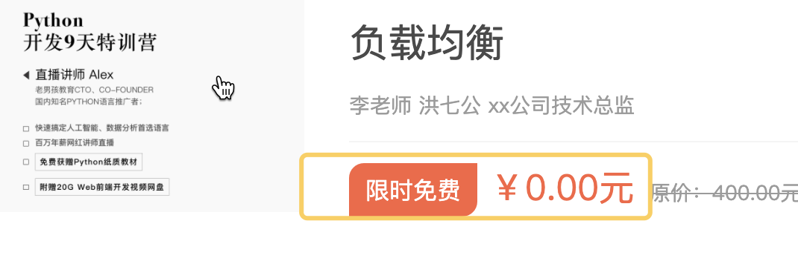

# 购物车实现

## 显示当前课程所属的真实价格

课程列表页的数据




#### 价格策略模型

```
价格优惠活动类型名称: 限时免费, 限时折扣, 限时减免, 积分抵扣, 满减, 优惠券
公式:
限时免费      原价 - 原价
限时折扣      原价 * 0.8
限时减免      原价 - 减免价
满减          原价 - (满减计算后换算价格)  


积分抵扣     总价-(积分计算后换算价格) ->> 积分换算比率
优惠券       总价-优惠券价格         -->> 优惠券
```

模型代码: course/models.py

```python
from django.db import models
from luffyapi.utils.models import BaseModel


# Create your models here.
class CourseCategory(BaseModel):
    """
    课程分类
    """
    name = models.CharField(max_length=64, unique=True, verbose_name="分类名称")
    class Meta:
        db_table = "ly_course_category"
        verbose_name = "课程分类"
        verbose_name_plural = "课程分类"


    def __str__(self):
        return "%s" % self.name

from ckeditor_uploader.fields import RichTextUploadingField
from luffyapi.settings import constants
class Course(BaseModel):
    """
    专题课程
    """
    course_type = (
        (0, '付费课程'),
        (1, 'VIP专享'),
        (2, '学位课程')
    )
    level_choices = (
        (0, '初级'),
        (1, '中级'),
        (2, '高级'),
    )
    status_choices = (
        (0, '上线'),
        (1, '下线'),
        (2, '预上线'),
    )
    name = models.CharField(max_length=128, verbose_name="课程名称")
    course_img = models.ImageField(upload_to="course", max_length=255, verbose_name="封面图片", blank=True, null=True)
    course_video = models.FileField(upload_to="video", null=True,blank=True, verbose_name="封面视频")
    course_type = models.SmallIntegerField(choices=course_type,default=0, verbose_name="付费类型")
    # 使用这个字段的原因
    brief = RichTextUploadingField(max_length=2048, verbose_name="详情介绍", null=True, blank=True)
    level = models.SmallIntegerField(choices=level_choices, default=1, verbose_name="难度等级")
    pub_date = models.DateField(verbose_name="发布日期", auto_now_add=True)
    period = models.IntegerField(verbose_name="建议学习周期(day)", default=7)
    attachment_path = models.FileField(max_length=128, verbose_name="课件路径", blank=True, null=True)
    status = models.SmallIntegerField(choices=status_choices, default=0, verbose_name="课程状态")
    course_category = models.ForeignKey("CourseCategory", on_delete=models.CASCADE, null=True, blank=True,verbose_name="课程分类")
    students = models.IntegerField(verbose_name="学习人数",default = 0)
    lessons = models.IntegerField(verbose_name="总课时数量",default = 0)
    pub_lessons = models.IntegerField(verbose_name="课时更新数量",default = 0)
    price = models.DecimalField(max_digits=6,decimal_places=2, verbose_name="课程原价",default=0)
    teacher = models.ForeignKey("Teacher",on_delete=models.DO_NOTHING, null=True, blank=True,verbose_name="授课老师")
    class Meta:
        db_table = "ly_course"
        verbose_name = "专题课程"
        verbose_name_plural = "专题课程"

    def __str__(self):
        return "%s" % self.name

    @property
    def lessons_list(self):
        """展示课程列表页中推荐的4个课时信息"""
        data_list = []
        lesson_list = CourseLesson.objects.filter(is_show=True, is_deleted=False, course_id=self.id, is_show_list=True).all()
        for lesson in lesson_list:
            data_list.append({
                "id": lesson.id,
                "name": lesson.name,
                "lesson": lesson.lesson,
                "free_trail": lesson.free_trail
            })
        return data_list

    @property
    def level_name(self):
        return self.level_choices[self.level][1]

    @property
    def brief_html(self):
        """把详情介绍中的图片地址拼上域名"""
        html = self.brief.replace('src="/media','src="%s/media' % constants.SERVER_IMAGE_DOMAIN)
        return html

    def real_price(self):
        """课程的真实价格"""
        return self.price

class Teacher(BaseModel):
    """讲师、导师表"""
    role_choices = (
        (0, '讲师'),
        (1, '导师'),
        (2, '班主任'),
    )
    name = models.CharField(max_length=32, verbose_name="讲师title")
    role = models.SmallIntegerField(choices=role_choices, default=0, verbose_name="讲师身份")
    title = models.CharField(max_length=64, verbose_name="职位、职称")
    signature = models.CharField(max_length=255, verbose_name="导师签名", help_text="导师签名", blank=True, null=True)
    image = models.ImageField(upload_to="teacher", null=True, verbose_name = "讲师头像")
    brief = models.TextField(max_length=1024, verbose_name="讲师描述")

    class Meta:
        db_table = "ly_teacher"
        verbose_name = "讲师导师"
        verbose_name_plural = "讲师导师"

    def __str__(self):
        return "%s" % self.name


class CourseChapter(BaseModel):
    """课程章节"""
    course = models.ForeignKey("Course", related_name='coursechapters', on_delete=models.CASCADE, verbose_name="课程名称")
    chapter = models.SmallIntegerField(verbose_name="第几章", default=1)
    name = models.CharField(max_length=128, verbose_name="章节标题")
    summary = models.TextField(verbose_name="章节介绍", blank=True, null=True)
    pub_date = models.DateField(verbose_name="发布日期", auto_now_add=True)

    class Meta:
        db_table = "ly_course_chapter"
        verbose_name = "课程章节"
        verbose_name_plural = "课程章节"

    def __str__(self):
        return "%s:(第%s章)%s" % (self.course, self.chapter, self.name)


class CourseLesson(BaseModel):
    """课程课时"""
    section_type_choices = (
        (0, '文档'),
        (1, '练习'),
        (2, '视频')
    )
    chapter = models.ForeignKey("CourseChapter", related_name='coursesections', on_delete=models.CASCADE,verbose_name="课程章节")
    name = models.CharField(max_length=128,verbose_name = "课时标题")
    section_type = models.SmallIntegerField(default=2, choices=section_type_choices, verbose_name="课时种类")
    section_link = models.CharField(max_length=255, blank=True, null=True, verbose_name="课时链接", help_text = "若是video，填vid,若是文档，填link")
    duration = models.CharField(verbose_name="视频时长", blank=True, null=True, max_length=32)  # 仅在前端展示使用
    pub_date = models.DateTimeField(verbose_name="发布时间", auto_now_add=True)
    free_trail = models.BooleanField(verbose_name="是否可试看", default=False)
    course = models.ForeignKey("Course",related_name="course_lesson", on_delete=models.CASCADE, verbose_name="课程")
    is_show_list = models.BooleanField(verbose_name="是否推荐到课程列表", default=False)
    lesson = models.IntegerField(verbose_name="第几课时")
    class Meta:
        db_table = "ly_course_lesson"
        verbose_name = "课程课时"
        verbose_name_plural = "课程课时"

    def __str__(self):
        return "%s-%s" % (self.chapter, self.name)


"""价格相关的模型"""
class CourseDiscountType(BaseModel):
    """课程优惠类型"""
    name = models.CharField(max_length=32, verbose_name="优惠类型名称")
    remark = models.CharField(max_length=250, blank=True, null=True, verbose_name="备注信息")

    class Meta:
        db_table = "ly_course_discount_type"
        verbose_name = "课程优惠类型"
        verbose_name_plural = "课程优惠类型"

    def __str__(self):
        return "%s" % (self.name)


class CourseDiscount(BaseModel):
    """课程优惠模型"""
    discount_type = models.ForeignKey("CourseDiscountType", on_delete=models.CASCADE, related_name='coursediscounts', verbose_name="优惠类型")
    condition = models.IntegerField(blank=True, default=0, verbose_name="满足优惠的价格条件",help_text="设置参与优惠的价格门槛，表示商品必须在xx价格以上的时候才参与优惠活动，<br>如果不填，则不设置门槛") #因为有的课程不足100，你减免100，还亏钱了
    sale = models.TextField(verbose_name="优惠公式",blank=True,null=True, help_text="""
    不填表示免费；<br>
    *号开头表示折扣价，例如*0.82表示八二折；<br>
    -号开头则表示减免，例如-20表示原价-20；<br>
    如果需要表示满减,则需要使用 原价-优惠价格,例如表示课程价格大于100,优惠10;大于200,优惠25,格式如下:<br>
    &nbsp;&nbsp;&nbsp;&nbsp;&nbsp;&nbsp;&nbsp;&nbsp;&nbsp;&nbsp;&nbsp;&nbsp;满100-10<br>
    &nbsp;&nbsp;&nbsp;&nbsp;&nbsp;&nbsp;&nbsp;&nbsp;&nbsp;&nbsp;&nbsp;&nbsp;满200-25<br>
    """)

    class Meta:
        db_table = "ly_course_discount"
        verbose_name = "价格优惠策略"
        verbose_name_plural = "价格优惠策略"

    def __str__(self):
        return "价格优惠:%s,优惠条件:%s,优惠值:%s" % (self.discount_type.name, self.condition, self.sale)

class Activity(BaseModel):
    """优惠活动"""
    name = models.CharField(max_length=150, verbose_name="活动名称")
    start_time = models.DateTimeField(verbose_name="优惠策略的开始时间")
    end_time = models.DateTimeField(verbose_name="优惠策略的结束时间")
    remark = models.CharField(max_length=250, blank=True, null=True, verbose_name="备注信息")

    class Meta:
        db_table = "ly_activity"
        verbose_name="商品活动"
        verbose_name_plural="商品活动"

    def __str__(self):
        return self.name

class CoursePriceDiscount(BaseModel):
    """课程与优惠策略的关系表"""
    course = models.ForeignKey("Course",on_delete=models.CASCADE, related_name="activeprices",verbose_name="课程")
    active = models.ForeignKey("Activity",on_delete=models.DO_NOTHING, related_name="activecourses",verbose_name="活动")
    discount = models.ForeignKey("CourseDiscount",on_delete=models.CASCADE,related_name="discountcourse",verbose_name="优惠折扣")

    class Meta:
        db_table = "ly_course_price_dicount"
        verbose_name="课程与优惠策略的关系表"
        verbose_name_plural="课程与优惠策略的关系表"

    def __str__(self):
        return "课程：%s，优惠活动: %s,开始时间:%s,结束时间:%s" % (self.course.name, self.active.name, self.active.start_time,self.active.end_time)
```


#### 执行数据迁移

```bash
python manage.py makemigrations
python manage.py migrate
```


在xadmin中注册模型管理器,courses/adminx.py代码:

```python
from .models import CourseDiscountType
class CourseExpireModelAdmin(object):
    """课程与有效期模型管理类"""
    pass
xadmin.site.register(CourseDiscountType, CourseExpireModelAdmin)

from .models import CourseDiscount
class PriceDiscountTypeModelAdmin(object):
    """价格优惠类型"""
    pass
xadmin.site.register(CourseDiscount, PriceDiscountTypeModelAdmin)


from .models import Activity
class PriceDiscountModelAdmin(object):
    """价格优惠公式"""
    pass
xadmin.site.register(Activity, PriceDiscountModelAdmin)


from .models import CoursePriceDiscount
class CoursePriceDiscountModelAdmin(object):
    """商品优惠和活动的关系"""
    pass
xadmin.site.register(CoursePriceDiscount, CoursePriceDiscountModelAdmin)
```


#### 添加测试数据

```python
#前四列数据顺序  ('id','orders','is_show','is_deleted')，如果顺序不一致，自行将下面的数据顺序调整一下
# 超级新品日时间自行更改下

INSERT INTO `ly_course_discount_type` VALUES (1,1,1,0,'2019-08-19 03:26:43.250177','2019-08-19 03:26:43.250209','限时免费','1'),(2,2,1,0,'2019-08-19 03:27:13.403084','2019-08-19 03:27:13.403120','限时折扣','阶梯级别的折扣'),(3,3,1,0,'2019-08-19 03:27:20.496817','2019-08-19 03:27:20.496854','限时减免',NULL),(4,4,1,0,'2019-08-19 03:27:29.321802','2019-08-19 03:27:29.321834','满减',NULL);

INSERT INTO `ly_course_discount` VALUES (1,1,1,0,'2019-08-19 03:30:42.064537','2019-08-19 03:30:42.064568',0,'',1),(2,2,1,0,'2019-08-19 03:31:02.636950','2019-08-19 03:31:02.636978',0,'*0.82',2),(3,3,1,0,'2019-08-19 03:31:14.827451','2019-08-19 03:31:14.827482',0,'*0.75',2),(4,4,1,0,'2019-08-19 03:32:02.323298','2019-08-19 03:32:02.323329',0,'-10',3),(5,5,1,0,'2019-08-19 03:32:25.227211','2019-08-19 11:56:19.239184', 0,'满500-80\r\n满400-40\r\n满300-20\r\n满200-10',4);

INSERT INTO `ly_activity` VALUES (1,3,1,0,'2019-08-19 03:28:52.003151','2019-08-19 03:28:52.003181','超级新品日','2019-08-19 02:00:00.000000','2019-09-18 16:00:00.000000',NULL),(2,2,1,0,'2019-08-19 03:29:52.662367','2019-08-19 03:29:52.662850','中秋节快乐购','2019-09-24 16:00:00.000000','2019-09-30 16:00:00.000000',NULL);
```

```SQL
1.导出指定表的数据   /*直接赋值下面的sql执行就可以， 上面的测试数据就做参考*/
mysqldump -t luffy -u root -p123456 --tables ly_course_discount_type ly_course_discount ly_activity course > db_script.sql

-- MySQL dump 10.13  Distrib 5.7.25, for Win64 (x86_64)
--
-- Host: localhost    Database: luffy
-- ------------------------------------------------------
-- Server version	5.7.25-log

--
-- Dumping data for table `ly_course_discount_type`
--

LOCK TABLES `ly_course_discount_type` WRITE;
/*!40000 ALTER TABLE `ly_course_discount_type` DISABLE KEYS */;
INSERT INTO `ly_course_discount_type` VALUES (1,1,4,0,'2019-08-19 03:26:43.250177','2024-05-21 03:52:50.864706','限时免费','1'),(2,1,3,0,'2019-08-19 03:27:13.403084','2024-05-21 03:52:46.982350','限时折扣','阶梯级别的折扣'),(3,1,2,0,'2019-08-19 03:27:20.496817','2024-05-21 03:52:42.611592','限时减免',NULL),(4,1,1,0,'2019-08-19 03:27:29.321802','2019-08-19 03:27:29.321834','满减',NULL);
/*!40000 ALTER TABLE `ly_course_discount_type` ENABLE KEYS */;
UNLOCK TABLES;

--
-- Dumping data for table `ly_course_discount`
--

LOCK TABLES `ly_course_discount` WRITE;
/*!40000 ALTER TABLE `ly_course_discount` DISABLE KEYS */;
INSERT INTO `ly_course_discount` VALUES (1,1,1,0,'2019-08-19 03:30:42.064537','2024-05-21 03:53:25.499354',0,'',1),(2,1,2,0,'2019-08-19 03:31:02.636950','2024-05-21 03:53:11.890816',0,'*0.82',2),(3,1,3,0,'2019-08-19 03:31:14.827451','2024-05-21 03:53:06.608270',0,'*0.75',2),(4,1,4,0,'2019-08-19 03:32:02.323298','2024-05-21 03:53:02.107445',0,'-10',3),(5,1,5,0,'2019-08-19 03:32:25.227211','2019-08-19 11:56:19.239184',0,'满500-80\r\n满400-40\r\n满300-20\r\n满200-10',4);
/*!40000 ALTER TABLE `ly_course_discount` ENABLE KEYS */;
UNLOCK TABLES;

--
-- Dumping data for table `ly_activity`
--

LOCK TABLES `ly_activity` WRITE;
/*!40000 ALTER TABLE `ly_activity` DISABLE KEYS */;
INSERT INTO `ly_activity` VALUES (1,1,1,0,'2019-08-19 03:28:52.003151','2024-05-21 05:44:25.924225','超级新品日','2024-05-21 02:00:00.000000','2024-06-29 05:44:00.000000',NULL),(2,2,2,0,'2019-08-19 03:29:52.662367','2019-08-19 03:29:52.662850','中秋节快乐购','2019-09-24 16:00:00.000000','2019-09-30 16:00:00.000000',NULL),(3,1,1,0,'2024-05-21 05:46:04.639276','2024-05-21 05:46:09.177157','国庆七天日','2024-09-30 16:00:00.000000','2024-10-07 16:00:00.000000',NULL);
/*!40000 ALTER TABLE `ly_activity` ENABLE KEYS */;
UNLOCK TABLES;

--
-- Dumping data for table `ly_course`
--

LOCK TABLES `ly_course` WRITE;
/*!40000 ALTER TABLE `ly_course` DISABLE KEYS */;
INSERT INTO `ly_course` VALUES (1,1,1,0,'2019-08-13 07:13:50.678948','2019-08-15 04:07:11.386224','flask框架','course/Loginbg.3377d0c.jpg',0,'<p>xxxx</p>',1,'2019-08-13',7,'README.md',0,99,110,110,1110.00,1,1,NULL),(2,1,2,0,'2019-08-13 07:15:32.490163','2019-08-15 04:13:22.430368','蘑菇街APP','course/course-cover.jpeg',0,'<p>dxxx</p>',2,'2019-08-13',7,'logo.svg',0,10,50,40,666.00,1,1,NULL),(3,1,3,0,'2019-08-13 07:15:32.490163','2019-08-20 10:49:41.880490','django框架','course/2.jpeg',0,'<p>dxxx</p>',1,'2019-08-13',7,'logo.svg',0,10,50,40,330.00,1,1,NULL),(15,1,4,0,'2019-08-13 07:15:32.490163','2019-08-13 07:15:32.490191','python入门','course/2.jpeg',0,'dxxx',2,'2019-08-13',7,'logo.svg',0,10,50,40,411.00,1,1,NULL),(16,1,5,0,'2019-08-13 07:15:32.490163','2019-08-14 02:28:04.791112','hbase入门','course/2.jpeg',0,'dxxx',1,'2019-08-13',7,'logo.svg',0,10,50,40,400.00,7,1,NULL),(17,1,6,0,'2019-08-13 07:15:32.490163','2019-08-13 07:15:32.490191','路飞学城项目实战','course/2.jpeg',0,'dxxx',2,'2019-08-13',7,'logo.svg',0,10,50,40,899.00,1,1,NULL),(18,1,7,0,'2019-08-13 07:15:32.490163','2019-08-14 02:29:47.667133','负载均衡','course/2.jpeg',0,'dxxx',2,'2019-08-13',7,'logo.svg',0,10,50,40,1088.00,6,1,NULL),(19,1,8,0,'2019-08-13 07:15:32.490163','2019-08-13 07:15:32.490191','MVC','course/2.jpeg',0,'dxxx',2,'2019-08-13',7,'logo.svg',0,10,50,40,1500.00,1,1,NULL),(20,1,9,0,'2019-08-13 07:15:32.490163','2019-08-14 02:28:52.126968','21天java入门','course/2.jpeg',0,'dxxx',0,'2019-08-13',7,'logo.svg',0,10,50,40,3000.00,7,1,NULL),(21,1,10,0,'2019-08-13 07:15:32.490163','2019-08-14 02:27:01.850049','7天玩转Linux运维','course/2.jpeg',0,'dxxx',2,'2019-08-13',7,'logo.svg',0,10,50,40,400.00,3,1,NULL),(22,1,11,0,'2019-08-13 07:15:32.490163','2019-08-13 07:15:32.490191','15天掌握flask框架','course/2.jpeg',0,'dxxx',2,'2019-08-13',7,'logo.svg',0,10,50,40,400.00,1,1,NULL),(23,1,12,0,'2019-08-13 07:15:32.490163','2019-08-13 07:23:56.015167','C编程嵌入式','course/2.jpeg',0,'dxxx',1,'2019-08-13',7,'logo.svg',0,10,50,40,399.00,3,1,NULL),(24,1,13,0,'2019-08-13 07:15:32.490163','2019-08-14 02:29:17.872840','3天玩转树莓派','course/2.jpeg',0,'dxxx',2,'2019-08-13',7,'logo.svg',0,10,50,40,400.00,3,1,NULL),(25,1,14,0,'2019-08-13 07:15:32.490163','2019-08-14 02:28:30.783768','MongoDB','course/2.jpeg',0,'dxxx',0,'2019-08-13',7,'logo.svg',0,10,50,40,400.00,3,1,NULL),(26,1,15,0,'2019-08-13 07:15:32.490163','2019-08-14 02:30:09.348192','Beego框架入门','course/2.jpeg',0,'dxxx',1,'2019-08-13',7,'logo.svg',0,10,50,40,699.00,2,1,NULL),(27,1,16,0,'2019-08-13 07:15:32.490163','2019-08-15 02:35:20.997672','beego框架进阶','course/2.jpeg',0,'<p>dxxx</p>',1,'2019-08-13',7,'logo.svg',0,10,50,50,400.00,2,1,NULL),(28,1,17,0,'2019-08-13 07:15:32.490163','2024-05-18 16:49:55.340699','以太坊入门','course/2.jpeg',0,'<p>dxxx 惺惺惜惺惺</p>\r\n\r\n、\r\n、、、、阿瑟东方法就是',2,'2019-08-13',7,'logo.svg',0,10,50,40,899.00,2,1,''),(29,1,18,0,'2019-08-13 07:15:32.490163','2024-05-18 17:18:59.004613','负载均衡','course/course-cover_Zk8h1JJ.jpeg',0,'<p>dxxx</p>\r\n\r\n<p>星星</p>\r\n\r\n<p>123213232111333322112223</p>\r\n\r\n<p>&nbsp;</p>',0,'2019-08-13',7,'logo.svg',0,10,50,40,400.00,3,1,'video/05cacb4e02f9d9e_UHDWEJI.mp4');
/*!40000 ALTER TABLE `ly_course` ENABLE KEYS */;
UNLOCK TABLES;

-- Dump completed on 2024-05-21 18:59:10

INSERT INTO `ly_banner` VALUES (1,'banner1','www.baidu.com','banner/banner1.png','www.baidu.com',1,1,0),(2,'banner2','www.baidu.com','banner/banner2.png','www.baidu.com',1,1,0),(3,'banner3','www.baidu.com','banner/banner3.png','www.baidu.com',1,1,0);


INSERT INTO `ly_nav` VALUES (1,1,1,0,'2024-05-16 03:20:52.297832','2024-05-16 03:21:46.229275','免费课','www.baidu.com',1,0),(2,1,1,0,'2024-05-16 03:21:17.480787','2024-05-16 03:21:42.568870','题库','www.baidu.com',1,0),(3,1,1,0,'2024-05-16 03:21:30.079933','2024-05-16 03:21:37.152541','教育','www.baidu.com',1,0),(4,1,1,0,'2024-05-16 03:23:10.098188','2024-05-16 03:23:10.098188','轻课','www.baidu.com',1,0);
```


#### 后端在模型中计算课程真实价格

因为课程的优惠是具有时效性的，所以我们计算价格的时候需要先判断当前优惠是否过期了。

关于时间的判断,那么就需要在项目中配置下时区.

settings/dev.py，代码：

```python
USE_TZ = False # 保证数据库中django中使用的时区一致！
```


在课程模型中,新增2个属性方法,分别用于获取当前课程的优惠类型和真实价格, courses/models.py，代码：

```python
from django.db import models
from luffyapi.utils.models import BaseModel


# Create your models here.
class CourseCategory(BaseModel):
    """
    课程分类
    """
    name = models.CharField(max_length=64, unique=True, verbose_name="分类名称")
    class Meta:
        db_table = "ly_course_category"
        verbose_name = "课程分类"
        verbose_name_plural = "课程分类"


    def __str__(self):
        return "%s" % self.name

from ckeditor_uploader.fields import RichTextUploadingField
from luffyapi.settings import constants
from datetime import datetime
class Course(BaseModel):
    """
    专题课程
    """
    course_type = (
        (0, '付费课程'),
        (1, 'VIP专享'),
        (2, '学位课程')
    )
    level_choices = (
        (0, '初级'),
        (1, '中级'),
        (2, '高级'),
    )
    status_choices = (
        (0, '上线'),
        (1, '下线'),
        (2, '预上线'),
    )
    name = models.CharField(max_length=128, verbose_name="课程名称")
    course_img = models.ImageField(upload_to="course", max_length=255, verbose_name="封面图片", blank=True, null=True)
    course_video = models.FileField(upload_to="video", null=True,blank=True, verbose_name="封面视频")
    course_type = models.SmallIntegerField(choices=course_type,default=0, verbose_name="付费类型")
    # 使用这个字段的原因
    brief = RichTextUploadingField(max_length=2048, verbose_name="详情介绍", null=True, blank=True)
    level = models.SmallIntegerField(choices=level_choices, default=1, verbose_name="难度等级")
    pub_date = models.DateField(verbose_name="发布日期", auto_now_add=True)
    period = models.IntegerField(verbose_name="建议学习周期(day)", default=7)
    attachment_path = models.FileField(max_length=128, verbose_name="课件路径", blank=True, null=True)
    status = models.SmallIntegerField(choices=status_choices, default=0, verbose_name="课程状态")
    course_category = models.ForeignKey("CourseCategory", on_delete=models.CASCADE, null=True, blank=True,verbose_name="课程分类")
    students = models.IntegerField(verbose_name="学习人数",default = 0)
    lessons = models.IntegerField(verbose_name="总课时数量",default = 0)
    pub_lessons = models.IntegerField(verbose_name="课时更新数量",default = 0)
    price = models.DecimalField(max_digits=6,decimal_places=2, verbose_name="课程原价",default=0)
    teacher = models.ForeignKey("Teacher",on_delete=models.DO_NOTHING, null=True, blank=True,verbose_name="授课老师")
    class Meta:
        db_table = "ly_course"
        verbose_name = "专题课程"
        verbose_name_plural = "专题课程"

    def __str__(self):
        return "%s" % self.name

    @property
    def lessons_list(self):
        """展示课程列表页中推荐的4个课时信息"""
        data_list = []
        lesson_list = CourseLesson.objects.filter(is_show=True, is_deleted=False, course_id=self.id, is_show_list=True).all()
        for lesson in lesson_list:
            data_list.append({
                "id": lesson.id,
                "name": lesson.name,
                "lesson": lesson.lesson,
                "free_trail": lesson.free_trail
            })
        return data_list

    @property
    def level_name(self):
        return self.level_choices[self.level][1]

    @property
    def brief_html(self):
        """把详情介绍中的图片地址拼上域名"""
        html = self.brief.replace('src="/media','src="%s/media' % constants.SERVER_IMAGE_DOMAIN)
        return html

    def active_list(self):
        """获取当前课程参与的活动"""
        return self.activeprices.filter(is_show=True, is_deleted=False, active__start_time__lte=datetime.now(),
                                               active__end_time__gte=datetime.now()).order_by("-orders", "-id")
      
    @property
    def discount_name(self):
        """如果商品有参与了活动，则返回折扣类型"""
        name = ""
        # 获取当前课程参与的所有活动
        active_list = self.active_list()
        if len(active_list) > 0: #有些课程没有参与活动，这个课程获取的对应数据就是空
            """当前课程如果有参与到1个以上活动时才有优惠类型"""
            active =active_list[0]
            name = active.discount.discount_type.name
        return name

    def real_price(self):
        """课程的真实价格"""
        # 默认真实为原价
        price = self.price

        active_list = self.active_list()
        if len(active_list) > 0:
            """如果当前课程有参与了活动"""
            active = active_list[0]
            # 参与活动的价格门槛
            condition = active.discount.condition
            sale = active.discount.sale
            
            #由于self.price是decimal类型，不能直接和浮点型或者整型数据进行计算，所以转换为float类型
            self.price = float(self.price)
            if self.price >= condition:
                """只有原价满足价格门槛才进行优惠计算"""
                if sale == "":
                    """限时免费"""
                    price = 0
                elif sale[0] == "*":
                    """限时折扣"""
                    price = self.price * float(sale[1:])
                elif sale[0] == "-":
                    """限时减免"""
                    price = self.price - float(sale[1:])
                elif sale[0] == "满":
                    """满减"""
                    sale_list = sale.split("\r\n")
                    price_list = [] # 设置一个列表，把当前课程原价满足的满减条件全部保存进去
                    # 把满减的每一个选项在循环中，提取条件价格和课程原价进行判断
                    for sale_item in sale_list:
                        item = sale_item[1:]
                        condition_price,condition_sale = item.split("-")
                        if self.price >= float(condition_price):
                          	#将所有满足调价的优惠价钱添加到一个列表中
                            price_list.append(float(condition_sale) )
                    
                    price = self.price - max(price_list) # 课程原价 - 最大优惠
        return "%.2f" % price

class Teacher(BaseModel):
    """讲师、导师表"""
    role_choices = (
        (0, '讲师'),
        (1, '导师'),
        (2, '班主任'),
    )
    name = models.CharField(max_length=32, verbose_name="讲师title")
    role = models.SmallIntegerField(choices=role_choices, default=0, verbose_name="讲师身份")
    title = models.CharField(max_length=64, verbose_name="职位、职称")
    signature = models.CharField(max_length=255, verbose_name="导师签名", help_text="导师签名", blank=True, null=True)
    image = models.ImageField(upload_to="teacher", null=True, verbose_name = "讲师头像")
    brief = models.TextField(max_length=1024, verbose_name="讲师描述")

    class Meta:
        db_table = "ly_teacher"
        verbose_name = "讲师导师"
        verbose_name_plural = "讲师导师"

    def __str__(self):
        return "%s" % self.name


class CourseChapter(BaseModel):
    """课程章节"""
    course = models.ForeignKey("Course", related_name='coursechapters', on_delete=models.CASCADE, verbose_name="课程名称")
    chapter = models.SmallIntegerField(verbose_name="第几章", default=1)
    name = models.CharField(max_length=128, verbose_name="章节标题")
    summary = models.TextField(verbose_name="章节介绍", blank=True, null=True)
    pub_date = models.DateField(verbose_name="发布日期", auto_now_add=True)

    class Meta:
        db_table = "ly_course_chapter"
        verbose_name = "课程章节"
        verbose_name_plural = "课程章节"

    def __str__(self):
        return "%s:(第%s章)%s" % (self.course, self.chapter, self.name)


class CourseLesson(BaseModel):
    """课程课时"""
    section_type_choices = (
        (0, '文档'),
        (1, '练习'),
        (2, '视频')
    )
    chapter = models.ForeignKey("CourseChapter", related_name='coursesections', on_delete=models.CASCADE,verbose_name="课程章节")
    name = models.CharField(max_length=128,verbose_name = "课时标题")
    section_type = models.SmallIntegerField(default=2, choices=section_type_choices, verbose_name="课时种类")
    section_link = models.CharField(max_length=255, blank=True, null=True, verbose_name="课时链接", help_text = "若是video，填vid,若是文档，填link")
    duration = models.CharField(verbose_name="视频时长", blank=True, null=True, max_length=32)  # 仅在前端展示使用
    pub_date = models.DateTimeField(verbose_name="发布时间", auto_now_add=True)
    free_trail = models.BooleanField(verbose_name="是否可试看", default=False)
    course = models.ForeignKey("Course",related_name="course_lesson", on_delete=models.CASCADE, verbose_name="课程")
    is_show_list = models.BooleanField(verbose_name="是否推荐到课程列表", default=False)
    lesson = models.IntegerField(verbose_name="第几课时")
    class Meta:
        db_table = "ly_course_lesson"
        verbose_name = "课程课时"
        verbose_name_plural = "课程课时"

    def __str__(self):
        return "%s-%s" % (self.chapter, self.name)


"""价格相关的模型"""
class CourseDiscountType(BaseModel):
    """课程优惠类型"""
    name = models.CharField(max_length=32, verbose_name="优惠类型名称")
    remark = models.CharField(max_length=250, blank=True, null=True, verbose_name="备注信息")

    class Meta:
        db_table = "ly_course_discount_type"
        verbose_name = "课程优惠类型"
        verbose_name_plural = "课程优惠类型"

    def __str__(self):
        return "%s" % (self.name)


class CourseDiscount(BaseModel):
    """课程优惠模型"""
    discount_type = models.ForeignKey("CourseDiscountType", on_delete=models.CASCADE, related_name='coursediscounts',
                                      verbose_name="优惠类型")
    condition = models.IntegerField(blank=True, default=0, verbose_name="满足优惠的价格条件",help_text="设置参与优惠的价格门槛，表示商品必须在xx价格以上的时候才参与优惠活动，<br>如果不填，则不设置门槛")
    sale = models.TextField(verbose_name="优惠公式",blank=True,null=True, help_text="""
    不填表示免费；<br>
    *号开头表示折扣价，例如*0.82表示八二折；<br>
    -号开头则表示减免，例如-20表示原价-20；<br>
    如果需要表示满减,则需要使用 原价-优惠价格,例如表示课程价格大于100,优惠10;大于200,优惠20,格式如下:<br>
    &nbsp;&nbsp;&nbsp;&nbsp;&nbsp;&nbsp;&nbsp;&nbsp;&nbsp;&nbsp;&nbsp;&nbsp;满100-10<br>
    &nbsp;&nbsp;&nbsp;&nbsp;&nbsp;&nbsp;&nbsp;&nbsp;&nbsp;&nbsp;&nbsp;&nbsp;满200-25<br>
    """)

    class Meta:
        db_table = "ly_course_discount"
        verbose_name = "价格优惠策略"
        verbose_name_plural = "价格优惠策略"

    def __str__(self):
        return "价格优惠:%s,优惠条件:%s,优惠值:%s" % (self.discount_type.name, self.condition, self.sale)

class Activity(BaseModel):
    """优惠活动"""
    name = models.CharField(max_length=150, verbose_name="活动名称")
    start_time = models.DateTimeField(verbose_name="优惠策略的开始时间")
    end_time = models.DateTimeField(verbose_name="优惠策略的结束时间")
    remark = models.CharField(max_length=250, blank=True, null=True, verbose_name="备注信息")

    class Meta:
        db_table = "ly_activity"
        verbose_name="商品活动"
        verbose_name_plural="商品活动"

    def __str__(self):
        return self.name

class CoursePriceDiscount(BaseModel):
    """课程与优惠策略的关系表"""
    course = models.ForeignKey("Course",on_delete=models.CASCADE, related_name="activeprices",verbose_name="课程")
    active = models.ForeignKey("Activity",on_delete=models.DO_NOTHING, related_name="activecourses",verbose_name="活动")
    discount = models.ForeignKey("CourseDiscount",on_delete=models.CASCADE,related_name="discountcourse",verbose_name="优惠折扣")

    class Meta:
        db_table = "ly_course_price_dicount"
        verbose_name="课程与优惠策略的关系表"
        verbose_name_plural="课程与优惠策略的关系表"

    def __str__(self):
        return "课程：%s，优惠活动: %s,开始时间:%s,结束时间:%s" % (self.course.name, self.active.name, self.active.start_time,self.active.end_time)
```


修改序列化器，增加返回字段[优惠类型和课程真实价格]

courses/serializers.py文件中找到 `CourseSerializer`类:

```python
class CourseModelSerializer(serializers.ModelSerializer):
    """
    列表页课程信息序列化器
    """
    # 序列化器嵌套，返回外检对应的序列化器数据
    teacher = TeacherModelSerializer()
    class Meta:
        model = Course
        fields = ["id","name","students","lessons","pub_lessons","price","course_img","teacher","lessons_list","discount_name","real_price"]

```


#### 前端课程列表页展示真实课程价格

判断是否有课程类型，如果有，则显示优惠价格。没有则显示课程原价。

course.vue，代码：

```vue
<template>
  <div class="course">
    <Header></Header>
    <div class="main">
      <!-- 筛选条件 -->
      <div class="condition">
        <ul class="cate-list">
          <li class="title">课程分类:</li>
          <li @click="category=0" :class="category==0?'this':''">全部</li>
          <li @click="category=cat.id" :class="category==cat.id?'this':''" v-for="cat in category_list">{{cat.name}}</li>
        </ul>

        <div class="ordering">
          <ul>
            <li class="title">筛&nbsp;&nbsp;&nbsp;&nbsp;&nbsp;&nbsp;&nbsp;&nbsp;选: </li>
            <li @click="change_order_type('id')" class="default" :class="change_order_class('id')">默认</li>
            <li @click="change_order_type('students')" class="hot" :class="change_order_class('students')">人气</li>
            <li @click="change_order_type('price')" class="price" :class="change_order_class('price')">价格</li>

<!--            <li @click="filters.type=0" class="default" :class="filters.type==0?'this':''">默认</li>-->
<!--            <li @click="filters.type=1" class="hot" :class="filters.type==1?'this':''">人气</li>-->
<!--            <li @click="filters.type=2" class="price" :class="filters.type==2?'this':''">价格</li>-->
          </ul>
          <p class="condition-result">共21个课程</p>
        </div>

      </div>
      <el-pagination
      background
      layout="prev, pager, next,sizes"
      :page-size="filters.size"
      :page-sizes="[2, 3, 5, 10]"
      @current-change="handleCurrentChange"
      @size-change="handleSizeChange"
      :total="total">
    </el-pagination>
      <!-- 课程列表 -->
      <div class="course-list">
        <div class="course-item" v-for="course in course_list">
          <div class="course-image">
            
          </div>
          <div class="course-info">
            <h3><router-link :to="'/courses/detail/'+course.id">{{course.name}}</router-link> <span>{{course.students}}人已加入学习</span></h3>
            <p class="teather-info">{{course.teacher.name}} {{course.teacher.signature}} {{course.teacher.title}} <span>共{{course.lessons}}课时/{{course.pub_lessons==course.lessons?'更新完成':`已更新${course.pub_lessons}课时`}}</span></p>
            <ul class="lesson-list">
              <li :key="key" v-for="(lesson,key) in course.lessons_list"><span class="lesson-title">0{{key}} | 第{{lesson.lesson}}节：{{lesson.name}}</span> <span class="free" v-if="lesson.free_trail">免费</span></li>
            </ul>
            <div class="pay-box">
              <span class="discount-type" v-if="course.discount_name">{{course.discount_name}}</span>
              <span class="discount-price">￥{{course.real_price}}元</span>
              <span class="original-price" v-if="course.discount_name">原价：{{course.price}}元</span>
              <span class="buy-now">立即购买</span>
            </div>
          </div>
        </div>
      </div>
    </div>
    <el-pagination
      background
      layout="prev, pager, next,sizes"
      :page-size="filters.size"
      :page-sizes="[2, 3, 5, 10]"
      @current-change="handleCurrentChange"
      @size-change="handleSizeChange"
      :total="total">
    </el-pagination>
    <Footer></Footer>
  </div>
</template>

<script>
  import Header from "./common/Header"
  import Footer from "./common/Footer"
  export default {
      name: "Course",
      data(){
        return{
          category: 0,
          category_list:[],
          total: 0,
          course_list: [],
          filters:{
              type: "id", // 筛选类型，id表示默认，students表示人气,price表示价格
              orders: "desc",  // 排序类型[控制样式]，desc表示降序，asc表示升序
              size: 5, // 单页数据量
              page: 1, // 当前页码
          }
        }
      },
      watch:{
          category(){
              this.get_course();
          }
      },
      created(){
        this.get_course_category();
        this.get_course();
      },
      methods:{
        get_course_category(){
            // 获取课程分类信息
            this.$axios.get(`${this.$settings.HOST}/course/category/`).then(response=>{
                this.category_list = response.data;
            })
        },
        get_course(){
            let filters = {
                page: this.filters.page,
                size: this.filters.size,
            };

            if(this.filters.orders==="desc"){
                filters.ordering = "-"+this.filters.type;
            }else{
                filters.ordering = this.filters.type;
            }
            // 判断是否要根据分类显示课程信息
            if( this.category > 0 ){
                filters.course_category = this.category;
            }

            this.$axios.get(`${this.$settings.HOST}/course/`,{
                params:filters
            }).then(response=>{
                this.course_list = response.data.results;
                this.total = response.data.count;
            });
        },
        change_order_type(type){
            // 更改升序或者降序
            if( this.filters.type === type && this.filters.orders === "desc" ){
                this.filters.orders="asc";
            }else if( this.filters.type === type && this.filters.orders === "asc"){
                this.filters.orders="desc";
            }

            // 更改排序方式
            this.filters.type=type;
            // 重新获取课程
            this.get_course();
        },
        change_order_class(type){
            // 更改当前选中筛选条件的高亮方式
            if( this.filters.type === type && this.filters.orders === "asc" ){
              return "this asc";
            }else if(this.filters.type===type && this.filters.orders === "desc"){
              return "this desc";
            }else{
              return "";
            }
        },
        handleCurrentChange(page){
            // 切换页码时，重新获取课程
            console.log("本次点击的页码是:", page);
            this.filters.page = page;
            this.get_course();
        },
        handleSizeChange(size){
            // 切换单页显示的数据量
            this.filters.size = size;
            // 重置页码
            this.filters.page = 1;
            this.get_course();
        },
      },
      components:{
        Header,
        Footer,
      }
  }
</script>


<style scoped>
  .course{
    background: #f6f6f6;
  }
  .course .main{
    width: 1100px;
    margin: 35px auto 0;
  }
  .course .condition{
    margin-bottom: 35px;
    padding: 25px 30px 25px 20px;
    background: #fff;
    border-radius: 4px;
    box-shadow: 0 2px 4px 0 #f0f0f0;
  }
  .course .cate-list{
    border-bottom: 1px solid #333;
    border-bottom-color: rgba(51,51,51,.05);
    padding-bottom: 18px;
    margin-bottom: 17px;
  }
  .course .cate-list::after{
    content:"";
    display: block;
    clear: both;
  }
  .course .cate-list li{
    float: left;
    font-size: 16px;
    padding: 6px 15px;
    line-height: 16px;
    margin-left: 14px;
    position: relative;
    transition: all .3s ease;
    cursor: pointer;
    color: #4a4a4a;
    border: 1px solid transparent; /* transparent 透明 */
  }
  .course .cate-list .title{
    color: #888;
    margin-left: 0;
    letter-spacing: .36px;
    padding: 0;
    line-height: 28px;
  }
  .course .cate-list .this{
    color: #ffc210;
    border: 1px solid #ffc210!important;
    border-radius: 30px;
  }
  .course .ordering::after{
    content:"";
    display: block;
    clear: both;
  }
  .course .ordering ul{
    float: left;
  }
  .course .ordering ul::after{
    content:"";
    display: block;
    clear: both;
  }
  .course .ordering .condition-result{
    float: right;
    font-size: 14px;
    color: #9b9b9b;
    line-height: 28px;
  }
  .course .ordering ul li{
    float: left;
    padding: 6px 15px;
    line-height: 16px;
    margin-left: 14px;
    position: relative;
    transition: all .3s ease;
    cursor: pointer;
    color: #4a4a4a;
  }
  .course .ordering .title{
    font-size: 16px;
    color: #888;
    letter-spacing: .36px;
    margin-left: 0;
    padding:0;
    line-height: 28px;
  }
  .course .ordering .this{
    color: #ffc210;
    position: relative;
  }
  .course .ordering .this::before,
  .course .ordering .this::after{
    cursor: pointer;
    content:"";
    display: block;
    width: 0px;
    height: 0px;
    border: 5px solid transparent;
    position: absolute;
    right: 0;
  }
  .course .ordering .this::before{
    border-bottom: 5px solid #aaa;
    margin-bottom: 2px;
    top: 2px;
  }
  .course .ordering .this::after{
    border-top: 5px solid #aaa;
    bottom: 2px;
  }
  .course .ordering .asc::before{
    border-bottom-color: #ffc210;
  }
  .course .ordering .desc::after{
    border-top-color: #ffc210;
  }
  .course .course-item:hover{
    box-shadow: 4px 6px 16px rgba(0,0,0,.5);
  }
  .course .course-item{
    width: 1050px;
    background: #fff;
    padding: 20px 30px 20px 20px;
    margin-bottom: 35px;
    border-radius: 2px;
    cursor: pointer;
    box-shadow: 2px 3px 16px rgba(0,0,0,.1);
    /* css3.0 过渡动画 hover 事件操作 */
    transition: all .2s ease;
  }
  .course .course-item::after{
    content:"";
    display: block;
    clear: both;
  }
  /* 顶级元素 父级元素  当前元素{} */
  .course .course-item .course-image{
    float: left;
    width: 423px;
    height: 210px;
    margin-right: 30px;
  }
  .course .course-item .course-image img{
    width: 100%;
  }
  .course .course-item .course-info{
    float: left;
    width: 596px;
  }
  .course-item .course-info h3 {
    font-size: 26px;
    color: #333;
    font-weight: normal;
    margin-bottom: 8px;
  }
  .course-item .course-info h3 span{
    font-size: 14px;
    color: #9b9b9b;
    float: right;
    margin-top: 14px;
  }
  .course-item .course-info h3 span img{
      width: 11px;
      height: auto;
      margin-right: 7px;
  }
  .course-item .course-info .teather-info{
      font-size: 14px;
      color: #9b9b9b;
      margin-bottom: 14px;
      padding-bottom: 14px;
      border-bottom: 1px solid #333;
      border-bottom-color: rgba(51,51,51,.05);
  }
  .course-item .course-info .teather-info span{
      float: right;
  }
  .course-item .lesson-list::after{
      content:"";
      display: block;
      clear: both;
  }
  .course-item .lesson-list li {
    float: left;
    width: 44%;
    font-size: 14px;
    color: #666;
    padding-left: 22px;
    /* background: url("路径") 是否平铺 x轴位置 y轴位置 */
    background: url("/static/image/play-icon-gray.svg") no-repeat left 4px;
    margin-bottom: 15px;
  }
  .course-item .lesson-list li .lesson-title{
      /* 以下3句，文本内容过多，会自动隐藏，并显示省略符号 */
      text-overflow: ellipsis;
      overflow: hidden;
      white-space: nowrap;
      display:inline-block;
      max-width: 200px;
  }
  .course-item .lesson-list li:hover{
      background-image: url("/static/image/play-icon-yellow.svg");
      color: #ffc210;
  }
  .course-item .lesson-list li .free{
      width: 34px;
      height: 20px;
      color: #fd7b4d;
      vertical-align: super;
      margin-left: 10px;
      border: 1px solid #fd7b4d;
      border-radius: 2px;
      text-align: center;
      font-size: 13px;
      white-space: nowrap;
  }
  .course-item .lesson-list li:hover .free{
      color: #ffc210;
      border-color: #ffc210;
  }
  .course-item .pay-box::after{
    content:"";
    display: block;
    clear: both;
  }
  .course-item .pay-box .discount-type{
    padding: 6px 10px;
    font-size: 16px;
    color: #fff;
    text-align: center;
    margin-right: 8px;
    background: #fa6240;
    border: 1px solid #fa6240;
    border-radius: 10px 0 10px 0;
    float: left;
  }
  .course-item .pay-box .discount-price{
    font-size: 24px;
    color: #fa6240;
    float: left;
  }
  .course-item .pay-box .original-price{
    text-decoration: line-through;
    font-size: 14px;
    color: #9b9b9b;
    margin-left: 10px;
    float: left;
    margin-top: 10px;
  }
  .course-item .pay-box .buy-now{
    width: 120px;
    height: 38px;
    background: transparent;
    color: #fa6240;
    font-size: 16px;
    border: 1px solid #fd7b4d;
    border-radius: 3px;
    transition: all .2s ease-in-out;
    float: right;
    text-align: center;
    line-height: 38px;
  }
  .course-item .pay-box .buy-now:hover{
    color: #fff;
    background: #ffc210;
    border: 1px solid #ffc210;
  }
  .el-pagination{
  text-align: center;
    padding-top: 20px;
    padding-bottom: 50px;
  }
</style> 
```


#### 前端课程详情页展示真实课程的价格

后端在课程模型中实现返回活动剩余时间功能,`course/models.py`,Course模型，代码:

```python
    @property
    def activity_time(self):
        """计算活动剩余时间"""
        time = 0
        active_list = self.active_list()
        if len(active_list) > 0:
            active = active_list[0]
            # 当前服务器时间戳
            now_time = datetime.now().timestamp()
            # 活动结束时间戳
            end_time = active.active.end_time.timestamp()
            time = end_time - now_time
        return int(time)

```

在序列化器中,找到`CourseRetrieveSerializer`,新增返回字段[优惠类型.活动剩余时间以及真实价格]

course/serializers.py，代码：

```python
class CourseRetrieveModelSerializer(serializers.ModelSerializer):
    """
    详情页课程信息序列化器
    """
    teacher = TeacherModelSerializer()
    class Meta:
        model = Course
        fields = ["id","name","students","lessons","pub_lessons","price","course_img","teacher","level_name","brief_html","course_video","discount_name","real_price","activity_time"]
```


#### 前端中对数据接口内容展示

前端中对数据接口内容展示出来,并通过js提供的定时器方法来实现优惠活动的倒计时,代码:

```vue
<template>
    <div class="detail">
      <Header/>
      <div class="main">
        <div class="course-info">
          <div class="wrap-left">
            <videoPlayer
               class="video-player vjs-custom-skin"
               ref="videoPlayer"
               :playsinline="true"
               :options="playerOptions"
               @play="onPlayerPlay($event)"
               @pause="onPlayerPause($event)">
            </videoPlayer>
          </div>
          <div class="wrap-right">
            <h3 class="course-name">{{course.name}}</h3>
            <p class="data">{{course.students}}人在学&nbsp;&nbsp;&nbsp;&nbsp;课程总时长：{{course.lessons}}课时/{{course.pub_lessons==course.lessons?'更新完成':`已更新${course.pub_lessons}课时`}}&nbsp;&nbsp;&nbsp;&nbsp;难度：{{course.level_name}}</p>
            <div class="sale-time" v-if="course.discount_name">
              <p class="sale-type">{{course.discount_name}}</p>
              <p class="expire">距离结束：仅剩 {{course.activity_time/(24*3600) | time_format}}天 {{course.activity_time/3600%24 | time_format}}小时 {{course.activity_time/60%60 | time_format}}分 <span class="second">{{course.activity_time%60 | time_format}}</span> 秒</p>
            </div>
            <p class="course-price" v-if="course.discount_name">
              <span>活动价</span>
              <span class="discount">¥{{course.real_price}}</span>
              <span class="original">¥{{course.price}}</span>
            </p>
            <div class="buy">
              <div class="buy-btn">
                <button class="buy-now">立即购买</button>
                <button class="free">免费试学</button>
              </div>
              <div class="add-cart" @click="addCart">加入购物车</div>
            </div>
          </div>
        </div>
        <div class="course-tab">
          <ul class="tab-list">
            <li :class="tabIndex==1?'active':''" @click="tabIndex=1">详情介绍</li>
            <li :class="tabIndex==2?'active':''" @click="tabIndex=2">课程章节 <span :class="tabIndex!=2?'free':''">(试学)</span></li>
            <li :class="tabIndex==3?'active':''" @click="tabIndex=3">用户评论 (42)</li>
            <li :class="tabIndex==4?'active':''" @click="tabIndex=4">常见问题</li>
          </ul>
        </div>
        <div class="course-content">
          <div class="course-tab-list">
            <div class="tab-item" v-if="tabIndex==1">
              <div v-html="course.brief_html"></div>
            </div>
            <div class="tab-item" v-if="tabIndex==2">
              <div class="tab-item-title">
                <p class="chapter">课程章节</p>
                <p class="chapter-length">共{{chapter_list.length}}章 {{course.lessons}}个课时</p>
              </div>
              <div class="chapter-item" v-for="chapter in chapter_list">
                <p class="chapter-title">第{{chapter.chapter}}章·{{chapter.name}}</p>
                <ul class="lesson-list">
                  <li class="lesson-item" v-for="lesson in chapter.coursesections">
                    <p class="name"><span class="index">{{chapter.chapter}}-{{lesson.lesson}}</span> {{lesson.name}}<span class="free" v-if="lesson.free_trail">免费</span></p>
                    <p class="time">07:30 </p>
                    <button class="try" v-if="lesson.free_trail">立即试学</button>
                    <button class="try" v-else>立即购买</button>
                  </li>
                </ul>
              </div>
            </div>
            <div class="tab-item" v-if="tabIndex==3">
              用户评论
            </div>
            <div class="tab-item" v-if="tabIndex==4">
              常见问题
            </div>
          </div>
          <div class="course-side">
             <div class="teacher-info">
               <h4 class="side-title"><span>授课老师</span></h4>
               <div class="teacher-content">
                 <div class="cont1">
                   
                   <div class="name">
                     <p class="teacher-name">{{course.teacher.name}}</p>
                     <p class="teacher-title">{{course.teacher.signature}} {{course.teacher.title}}</p>
                   </div>
                 </div>
                 <p class="narrative" >{{course.teacher.brief}}</p>
               </div>
             </div>
          </div>
        </div>
      </div>
      <Footer/>
    </div>
</template>

<script>
import Header from "./common/Header"
import Footer from "./common/Footer"
import {videoPlayer} from 'vue-video-player'
export default {
    name: "Detail",
    data(){
      return {
        course_id: 0,
        course: {
            teacher:{}
        },
        chapter_list: [],
        tabIndex:2, // 当前选项卡显示的下标
        playerOptions: {
          playbackRates: [0.7, 1.0, 1.5, 2.0], // 播放速度
          autoplay: false, //如果true,则自动播放
          muted: false, // 默认情况下将会消除任何音频。
          loop: false, // 循环播放
          preload: 'auto',  // 建议浏览器在<video>加载元素后是否应该开始下载视频数据。auto浏览器选择最佳行为,立即开始加载视频（如果浏览器支持）
          language: 'zh-CN',
          aspectRatio: '16:9', // 将播放器置于流畅模式，并在计算播放器的动态大小时使用该值。值应该代表一个比例 - 用冒号分隔的两个数字（例如"16:9"或"4:3"）
          fluid: true, // 当true时，Video.js player将拥有流体大小。换句话说，它将按比例缩放以适应其容器。
          sources: [{ // 播放资源和资源格式
            type: "video/mp4",
            src: "http://img.ksbbs.com/asset/Mon_1703/05cacb4e02f9d9e.mp4" //你的视频地址（必填）
          }],
          poster: "/static/image/course-cover.jpeg", //视频封面图
          width: document.documentElement.clientWidth, // 默认视频全屏时的最大宽度
          notSupportedMessage: '此视频暂无法播放，请稍后再试', //允许覆盖Video.js无法播放媒体源时显示的默认信息。
        },
      }
    },
    filters:{
      time_format(time){
          time = parseInt(time);
          if(time < 10){
              time = "0"+time;
          }
          return time;
      }
    },
    created(){
      // 课程ID
      this.get_course_id();
      this.get_course_info();
      this.get_course_chapter();
    },
    methods: {
      get_course_id(){
          let course_id = this.$route.params.id;
          if(course_id > 0){
              this.course_id = parseInt( course_id );
          }else{
              let self = this;
              this.$alert("对不起，访问页面参数有误！","错误",{
                  callback(){
                    self.$router.go(-1);
                  }
              });
              return false;
          }
          return course_id;
      },
      get_course_info(){
          // 获取课程信息
          this.$axios.get(`${this.$settings.HOST}/course/${this.course_id}/`).then(response=>{
              this.course = response.data;
              this.playerOptions.sources[0].src=response.data.course_video;
              this.playerOptions.poster = response.data.course_img;
              // 设置活动进行时，课程优惠的倒计时
              if(this.course.activity_time > 0){
                let timer = setInterval(()=>{
                    if( this.course.activity_time > 1 ){
                        this.course.activity_time-=1;
                    }else{
                        clearInterval(timer);
                    }
                },1000)
              }
          }).catch(error=>{
              this.$messge.error(error.response.data);
          })
      },
      get_course_chapter(){
          // 获取当前课程的章节列表
          this.$axios.get(`${this.$settings.HOST}/course/chapter/`,{
              params:{
                  course: this.course_id,
              }
          }).then(response=>{
              this.chapter_list = response.data;

          }).catch(error=>{
              this.$messge.error(error.response.data);
          })
      },
      check_user_login(){
        let token = localStorage.user_token || sessionStorage.user_token;
        if( !token ){
            let self = this;
            this.$confirm("对不起，您尚未登录！所以请登录再使用购物车","路飞学城",{
                confirmButtonText: '确定',
                cancelButtonText: '取消',
                type: 'warning'
            }).then(() => {
                self.$router.push("/user/login");
            });
            return false; // 阻止js继续往下执行
        }
        return token;
      },
      addCart(){
          // 添加商品必须用户已经登录了
          let token = this.check_user_login();
          // 添加商品到购物车
          this.$axios.post(`${this.$settings.HOST}/cart/`,{
              course_id: this.course_id,
          },{
              headers:{
                  // 提交jwt的时候，必须想后端声明，当前token类型是jwt生成的，所以中间必须有个空格！！
                  "Authorization": "jwt " + token,
              }
          }).then(response=>{
              this.$message.success(response.data.message);
              // 更新vuex中购物车商品总数
              this.$store.commit("add_cart", response.data.cart_length);
          }).catch(error=>{
              this.$message.error(error.response.data.message);
          })
      },
      onPlayerPlay(event){
        // 当视频播放时，执行的方法
        alert("关闭广告");
      },
      onPlayerPause(event){
        // 当视频暂停播放时，执行的方法
        alert("显示广告");
      },
    },
    components:{
      Header,
      Footer,
      videoPlayer,
    }
}
</script>

<style scoped>
.main{
  background: #fff;
  padding-top: 30px;
}
.course-info{
  width: 1200px;
  margin: 0 auto;
  overflow: hidden;
}
.wrap-left{
  float: left;
  width: 690px;
  height: 388px;
  background-color: #000;
}
.wrap-right{
  float: left;
  position: relative;
  height: 388px;
}
.course-name{
  font-size: 20px;
  color: #333;
  padding: 10px 23px;
  letter-spacing: .45px;
}
.data{
  padding-left: 23px;
  padding-right: 23px;
  padding-bottom: 16px;
  font-size: 14px;
  color: #9b9b9b;
}
.sale-time{
  width: 464px;
  background: #fa6240;
  font-size: 14px;
  color: #4a4a4a;
  padding: 10px 23px;
  overflow: hidden;
}
.sale-type {
  font-size: 16px;
  color: #fff;
  letter-spacing: .36px;
  float: left;
}
.sale-time .expire{
  font-size: 14px;
  color: #fff;
  float: right;
}
.sale-time .expire .second{
  width: 24px;
  display: inline-block;
  background: #fafafa;
  color: #5e5e5e;
  padding: 6px 0;
  text-align: center;
}
.course-price{
  background: #fff;
  font-size: 14px;
  color: #4a4a4a;
  padding: 5px 23px;
}
.discount{
  font-size: 26px;
  color: #fa6240;
  margin-left: 10px;
  display: inline-block;
  margin-bottom: -5px;
}
.original{
  font-size: 14px;
  color: #9b9b9b;
  margin-left: 10px;
  text-decoration: line-through;
}
.buy{
  width: 464px;
  padding: 0px 23px;
  position: absolute;
  left: 0;
  bottom: 20px;
  overflow: hidden;
}
.buy .buy-btn{
  float: left;
}
.buy .buy-now{
  width: 125px;
  height: 40px;
  border: 0;
  background: #ffc210;
  border-radius: 4px;
  color: #fff;
  cursor: pointer;
  margin-right: 15px;
  outline: none;
}
.buy .free{
  width: 125px;
  height: 40px;
  border-radius: 4px;
  cursor: pointer;
  margin-right: 15px;
  background: #fff;
  color: #ffc210;
  border: 1px solid #ffc210;
}
.add-cart{
  float: right;
  font-size: 14px;
  color: #ffc210;
  text-align: center;
  cursor: pointer;
  margin-top: 10px;
}
.add-cart img{
  width: 20px;
  height: 18px;
  margin-right: 7px;
  vertical-align: middle;
}

.course-tab{
    width: 100%;
    background: #fff;
    margin-bottom: 30px;
    box-shadow: 0 2px 4px 0 #f0f0f0;

}
.course-tab .tab-list{
    width: 1200px;
    margin: auto;
    color: #4a4a4a;
    overflow: hidden;
}
.tab-list li{
    float: left;
    margin-right: 15px;
    padding: 26px 20px 16px;
    font-size: 17px;
    cursor: pointer;
}
.tab-list .active{
    color: #ffc210;
    border-bottom: 2px solid #ffc210;
}
.tab-list .free{
    color: #fb7c55;
}
.course-content{
    width: 1200px;
    margin: 0 auto;
    background: #FAFAFA;
    overflow: hidden;
    padding-bottom: 40px;
}
.course-tab-list{
    width: 880px;
    height: auto;
    padding: 20px;
    background: #fff;
    float: left;
    box-sizing: border-box;
    overflow: hidden;
    position: relative;
    box-shadow: 0 2px 4px 0 #f0f0f0;
}
.tab-item{
    width: 880px;
    background: #fff;
    padding-bottom: 20px;
    box-shadow: 0 2px 4px 0 #f0f0f0;
}
.tab-item-title{
    justify-content: space-between;
    padding: 25px 20px 11px;
    border-radius: 4px;
    margin-bottom: 20px;
    border-bottom: 1px solid #333;
    border-bottom-color: rgba(51,51,51,.05);
    overflow: hidden;
}
.chapter{
    font-size: 17px;
    color: #4a4a4a;
    float: left;
}
.chapter-length{
    float: right;
    font-size: 14px;
    color: #9b9b9b;
    letter-spacing: .19px;
}
.chapter-title{
    font-size: 16px;
    color: #4a4a4a;
    letter-spacing: .26px;
    padding: 12px;
    background: #eee;
    border-radius: 2px;
    display: -ms-flexbox;
    display: flex;
    -ms-flex-align: center;
    align-items: center;
}
.chapter-title img{
    width: 18px;
    height: 18px;
    margin-right: 7px;
    vertical-align: middle;
}
.lesson-list{
    padding:0 20px;
}
.lesson-list .lesson-item{
    padding: 15px 20px 15px 36px;
    cursor: pointer;
    justify-content: space-between;
    position: relative;
    overflow: hidden;
}
.lesson-item .name{
    font-size: 14px;
    color: #666;
    float: left;
}
.lesson-item .index{
    margin-right: 5px;
}
.lesson-item .free{
    font-size: 12px;
    color: #fff;
    letter-spacing: .19px;
    background: #ffc210;
    border-radius: 100px;
    padding: 1px 9px;
    margin-left: 10px;
}
.lesson-item .time{
    font-size: 14px;
    color: #666;
    letter-spacing: .23px;
    opacity: 1;
    transition: all .15s ease-in-out;
    float: right;
}
.lesson-item .time img{
    width: 18px;
    height: 18px;
    margin-left: 15px;
    vertical-align: text-bottom;
}
.lesson-item .try{
    width: 86px;
    height: 28px;
    background: #ffc210;
    border-radius: 4px;
    font-size: 14px;
    color: #fff;
    position: absolute;
    right: 20px;
    top: 10px;
    opacity: 0;
    transition: all .2s ease-in-out;
    cursor: pointer;
    outline: none;
    border: none;
}
.lesson-item:hover{
    background: #fcf7ef;
    box-shadow: 0 0 0 0 #f3f3f3;
}
.lesson-item:hover .name{
    color: #333;
}
.lesson-item:hover .try{
    opacity: 1;
}

.course-side{
    width: 300px;
    height: auto;
    margin-left: 20px;
    float: right;
}
.teacher-info{
    background: #fff;
    margin-bottom: 20px;
    box-shadow: 0 2px 4px 0 #f0f0f0;
}
.side-title{
    font-weight: normal;
    font-size: 17px;
    color: #4a4a4a;
    padding: 18px 14px;
    border-bottom: 1px solid #333;
    border-bottom-color: rgba(51,51,51,.05);
}
.side-title span{
    display: inline-block;
    border-left: 2px solid #ffc210;
    padding-left: 12px;
}

.teacher-content{
    padding: 30px 20px;
    box-sizing: border-box;
}

.teacher-content .cont1{
    margin-bottom: 12px;
    overflow: hidden;
}

.teacher-content .cont1 img{
    width: 54px;
    height: 54px;
    margin-right: 12px;
    float: left;
}
.teacher-content .cont1 .name{
    float: right;
}
.teacher-content .cont1 .teacher-name{
    width: 188px;
    font-size: 16px;
    color: #4a4a4a;
    padding-bottom: 4px;
}
.teacher-content .cont1 .teacher-title{
    width: 188px;
    font-size: 13px;
    color: #9b9b9b;
    white-space: nowrap;
}
.teacher-content .narrative{
    font-size: 14px;
    color: #666;
    line-height: 24px;
}
</style>
```

