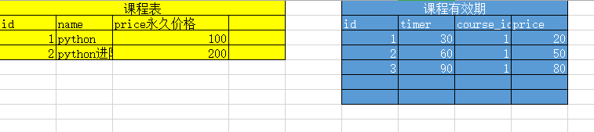
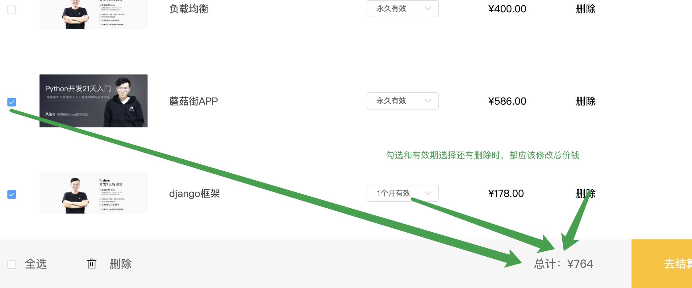

# 购物车实现

## 根据课程有效期调整价格

要实现课程有效期的计算，则必须我们要清楚一个课程可以有1到多个有效期选项。默认保存在课程模型中的价格如果有值，则这个值是永久有效的购买价格。如果有别的购买期限，则我们需要另行创建一个模型来保存！

course/models.py，代码：

```python
class CourseExpire(BaseModel):
    """课程有效期模型"""
    # 后面可以在数据库把course和expire_time字段设置为联合索引
    course = models.ForeignKey("Course", related_name='course_expire', on_delete=models.CASCADE,verbose_name="课程名称")
    
    #有效期限，天数
    expire_time = models.IntegerField(verbose_name="有效期", null=True, blank=True,help_text="有效期按天数计算")
    
    #一个月有效等等
    expire_text = models.CharField(max_length=150, verbose_name="提示文本", null=True, blank=True)
    #每个有效期的价格
    price = models.DecimalField(max_digits=6, decimal_places=2, verbose_name="课程价格", default=0)

    class Meta:
        db_table = "ly_course_expire"
        verbose_name = "课程有效期"
        verbose_name_plural = verbose_name

    def __str__(self):
        return "课程：%s，有效期：%s，价格：%s" % (self.course, self.expire_text, self.price)
```

在course表中的price字段加一个提示文本

```python
price = models.DecimalField(max_digits=6, decimal_places=2, verbose_name="课程原价", default=0,help_text='如果填写的价格为0，那么表示当前课程在购买的时候，没有永久有效的期限。')
```

执行迁移

```python
python manage.py makemigrations
python manage.py migrate
```


注册到xadmin中，course/adminx.py，代码：

```python
from .models import CourseExpire
class CourseExpireModelAdmin(object):
    """商品有效期模型"""
    pass
xadmin.site.register(CourseExpire, CourseExpireModelAdmin)
```

添加测试数据

```sql
INSERT INTO `ly_course_expire`
(`id`,`orders`,`is_show`,`is_deleted`,`created_time`,`updated_time`,`expire_time`,`expire_text`,`course_id`,`price`)
VALUES
(1,1,1,0,'2019-08-19 02:05:22.368823','2019-08-19 02:05:22.368855',30,'一个月有效',1,398.00),
(2,2,1,0,'2019-08-19 02:05:37.397205','2019-08-19 02:05:37.397233',60,'2个月有效',1,588.00),
(3,3,1,0,'2019-08-19 02:05:57.029411','2019-08-19 02:05:57.029440',180,'半年内有效',1,1000.00),
(4,4,1,0,'2019-08-19 02:07:29.066617','2019-08-19 02:08:29.156730',3,'3天内有效',3,0.88),
(5,3,1,0,'2019-08-19 02:07:46.120827','2019-08-19 02:08:18.652452',30,'1个月有效',3,188.00),
(6,3,1,0,'2019-08-19 02:07:59.876421','2019-08-19 02:07:59.876454',60,'2个月有效',3,298.00);
```


目前我们已经在后端实现了课程有效期的模型以后，这个有效期的价格并没有纳入到真实价格的计算当中。



在购物车中的商品有效期选项中，把当前课程对应的有效期选项列表展示出来。

course/models.py，Course类 代码：

```python
    @property
    def expire_list(self):
        """课程有效期选项"""
        expires = self.course_expire.filter(is_show=True,is_deleted=False)
        data = []
        for item in expires:
            data.append({
                "id": item.id,
                "expire_text": item.expire_text,
                "price": item.price
            })
        #增加永久有效选项
        if self.price > 0:
            data.append({
                "id": 0,
                "expire_text":"永久有效",
                "price": self.price,
            })
        return data
```

cart/views.py，新增返回expire_list，当前课程有效期的选项列表，代码：

```python
    def list(self,request):
        """购物车中的商品列表"""
        user_id = request.user.id
        # 从redis中读取数据
        redis_conn = get_redis_connection("cart")
        cart_bytes_dict = redis_conn.hgetall("cart_%s" % user_id )
        selected_bytes_list = redis_conn.smembers("selected_%s" % user_id )
        # 使用循环从mysql中根据课程ID提取对应的商品信息[商品ID，商品封面图片，商品标题]
        data = []
        for course_id_bytes,expire_id_bytes in cart_bytes_dict.items():
            course_id = int( course_id_bytes.decode() )
            expire_id = int( expire_id_bytes.decode() )
            try:
                course = Course.objects.get(is_show=True, is_deleted=False, pk=course_id)
            except Course.DoesNotExist:
                continue
            data.append({
                "selected": True if course_id_bytes in selected_bytes_list else False,
                "course_img": constants.SERVER_IMAGE_DOMAIN + course.course_img.url,
                "name": course.name,
                "id": course.id,
                "expire_id": expire_id,
                "expire_list": course.expire_list,
                "price": course.real_price(),
            })
        return Response(data)
```

客户端中获取到数据以后，展示有效期选项： comnon/Cartitem.vue

```python
<template>
    <div class="cart_item">
      <div class="cart_column column_1">
        <el-checkbox class="my_el_checkbox" v-model="course.selected"></el-checkbox>
      </div>
      <div class="cart_column column_2">
        
        <span><router-link :to="'/courses/detail/'+course.id">{{course.name}}</router-link></span>
      </div>
      <div class="cart_column column_3">
        <el-select v-model="course.expire_id" size="mini" placeholder="请选择购买有效期" class="my_el_select">
          <el-option v-for="item in course.expire_list" :label="item.expire_text" :value="item.id" :key="item.id"></el-option>
        </el-select>
      </div>
      <div class="cart_column column_4">¥{{course.price}}</div>
      <div class="cart_column column_4">删除</div>
    </iv>
</template>
```


注意：在购物车的视图中需要修改一下  cart/views.py

```python
data.append({
                "id": int(course_id), 
                "name": course.name,
                "course_img": constants.SERVER_IMAGE_DOMAIN + course.course_img.url,
                "price": course.real_price,
                "expire_id": int(expire_id),  #不然它是个字符串，因为redis的问题，只能存为字符串，那么前端渲染下拉框的时候，会多一个选项0.
                "expire_list": course.expire_list,
                "is_selected": True if course_bytes in cart_selected_list else False
            })
```


有了有效期选项列表以后，我们就可以实现，当用户切换有效期选项以后，同步更新redis中购物车商品的有效期值。

## 切换有效期选项

服务端提供切换有效期选项的接口，视图：

```python
from rest_framework.viewsets import ViewSet
from rest_framework.permissions import IsAuthenticated
from course.models import Course,CourseExpire
from rest_framework.response import Response
from rest_framework import status
from django_redis import get_redis_connection
from luffyapi.settings import constants
import logging
log = logging.getLogger("django")

class CartAPIView(ViewSet):
    """购物车"""
    permission_classes = [IsAuthenticated]
    
    # .... 省略其他方法代码
    
    def change_expire(self,request):
        """切换购物车商品的勾选状态"""
        user_id = request.user.id
        expire_id = request.data.get("expire_id")
        course_id = request.data.get("course_id")
        try:
            # 判断课程是否存在
            Course.objects.get(is_show=True, is_deleted=False, id=course_id)
            
            # 判断课程的有效期选项是0还是其他的数值，如果是其他数值，还要判断是否存在于有效期选项表中
            if expire_id > 0:
                epxire_item = CourseExpire.objects.filter(is_show=True,is_deleted=False,id=expire_id)
                if not epxire_item:
                    raise Course.DoesNotExist()
        except Course.DoesNotExist:
            return Response({"message":"参数有误！当前商品课程不存在或者不存在的有效期选项！"}, status=status.HTTP_400_BAD_REQUEST)

				#修改redis中某个课程的有效期
        redis_conn = get_redis_connection("cart")
        redis_conn.hset("cart_%s" % user_id, course_id, expire_id)

        return Response({"message":"切换课程有效期成功！"})


```

course/urls.py，路由代码：

```python
from django.urls import path,re_path
from . import views
urlpatterns = [
    path(r"", views.CartAPIView.as_view({"post":"add","get":"list","patch":"change_selected","put":"change_expire"}) ),
]
```

客户端中，实现ajax请求，Cart.vue，代码：

```vue

<template>
    <div class="cart_item">
      <div class="cart_column column_1">
        <el-checkbox class="my_el_checkbox" v-model="course.selected"></el-checkbox>
      </div>
      <div class="cart_column column_2">
        
        <span><router-link :to="'/courses/detail/'+course.id">{{course.name}}</router-link></span>
      </div>
      <div class="cart_column column_3">
        <el-select v-model="course.expire_id" size="mini" placeholder="请选择购买有效期" class="my_el_select">
          <el-option v-for="item in course.expire_list" :label="item.expire_text" :value="item.id" :key="item.id"></el-option>
        </el-select>
      </div>
      <div class="cart_column column_4">¥{{course.price}}</div>
      <div class="cart_column column_4">删除</div>
    </div>
</template>

<script>
export default {
    name: "CartItem",
    props:["course"],
    data(){
      return {
        expire: "1个月有效",
      }
    },
    watch:{
        "course.selected": function(){
            this.change_selected();
        },
        "course.expire_id": function(){
          	//alert(this.course.expire_id);
            this.change_expire();
        }
    },
    methods:{
        change_expire(){
            let token = localStorage.user_token || sessionStorage.user_token;
            this.$axios.put(`${this.$settings.HOST}/cart/`,{
                expire_id: this.course.expire_id,
                course_id: this.course.id
            },{
                headers:{
                    "Authorization": "jwt " + token,
                }
            }).then(response=>{
                this.$message.success(response.data.message);
            }).catch(error=>{
                this.$message.error(error.response);
            })
        },
        change_selected(){
            let token = localStorage.user_token || sessionStorage.user_token;
            // 切换商品课程的勾选状态
            this.$axios.patch(`${this.$settings.HOST}/cart/`,{
                selected: this.course.selected,
                course_id: this.course.id
            },{
                headers:{
                    "Authorization": "jwt " + token,
                }
            }).then(response=>{
                this.$message.success(response.data.message);
            }).catch(error=>{
                this.$message.error(error.response);
            })
        }
    }
}
</script>
```

因为我们之前在购物车中商品列表的商品使用的字段是real_price，所以在永久有效选项的情况下，价格是正确的。

但是如果我们有其他的有效期选项时，在切换有效期后，则价格显示有问题！

所以我们接下来需要调整在切换有效期时的代码逻辑.让程序以指定的有效期价格重新使用当前有效期选项的价格进行优惠计算！！

当我们选择不同的有效期的时候，价格肯定是不同的，那么不同的价格享受的优惠策略也可能是不一样的，对吗，比如说满减。

接下来分2步进行：

1. 在用户进入购物车页面时，根据不同的有效期选项，在获取购物车商品列表时，需要查询真实价格。
2. 在用户点击切换不同有效期选项时，也要同步切换当前商品课程对应的真实价格

#### 在用户进入页面时，根据不同有效期选项显示对应的真实价格

模型代码： course模型类中的real_price方法需要改一下：

```python
# @property  注意不能加property了，因为有参数了
    def real_price(self,expire_id=0):
        """课程的真实价格"""
        # 默认真实为原价
        price = self.price

        try:
            if expire_id > 0:
                price = CourseExpire.objects.get(id=expire_id).price
        except CourseExpire.DoesNotExist:
            pass

        active_list = self.active_list()
        if len(active_list) > 0:
            """如果当前课程有参与了活动"""
            active = active_list[0]
            # 参与活动的价格门槛
            condition = active.discount.condition
            sale = active.discount.sale
            price = float(price)
            if price >= condition:
                """只有原价满足价格门槛才进行优惠计算"""
                if sale == "":
                    """限时免费"""
                    price = 0
                elif sale[0] == "*":
                    """限时折扣"""
                    price = price * float(sale[1:])
                elif sale[0] == "-":
                    """限时减免"""
                    price = price - float(sale[1:])
                elif sale[0] == "满":
                    """满减"""
                    sale_list = sale.split("\r\n")
                    price_list = []  # 设置一个列表，把当前课程原价满足的满减条件全部保存进去
                    # 把满减的每一个选项在循环中，提取条件价格和课程原价进行判断
                    for sale_item in sale_list:
                        item = sale_item[1:]
                        condition_price, condition_sale = item.split("-")
                        if price >= float(condition_price):
                            price_list.append(float(condition_sale))

                    price = price - max(price_list)  # 课程原价 - 最大优惠
        return "%.2f" % price
```


视图调用模型中的real_price时，通过传递expire_id，来计算真实价格到购物车商品列表中.

```python
class CartAPIView(ViewSet):
    """购物车"""
    permission_classes = [IsAuthenticated]
 	# ...省略中间其他方法

    def list(self,request):
        """购物车中的商品列表"""
        user_id = request.user.id
        # 从redis中读取数据
        redis_conn = get_redis_connection("cart")
        cart_bytes_dict = redis_conn.hgetall("cart_%s" % user_id )
        selected_bytes_list = redis_conn.smembers("selected_%s" % user_id )
        # 使用循环从mysql中根据课程ID提取对应的商品信息[商品ID，商品封面图片，商品标题]
        data = []
        for course_id_bytes,expire_id_bytes in cart_bytes_dict.items():
            course_id = int( course_id_bytes.decode() )
            expire_id = int( expire_id_bytes.decode() )
            try:
                course = Course.objects.get(is_show=True, is_deleted=False, pk=course_id)
            except Course.DoesNotExist:
                continue

            data.append({
                "selected": True if course_id_bytes in selected_bytes_list else False,
                "course_img": constants.SERVER_IMAGE_DOMAIN + course.course_img.url,
                "name": course.name,
                "id": course.id,
                "expire_id": expire_id,
                "expire_list": course.expire_list,
                "price": course.real_price(expire_id),
            })
        return Response(data)
```


#### 客户端点击切换不同有效期选项时，更新真实价格

在原来切换有效期选项时，直接增加获取真实价格的代码逻辑，course/views.py，代码：

```python
    def change_expire(self,request):
        """切换购物车商品的勾选状态"""
        user_id = request.user.id
        expire_id = request.data.get("expire_id")
        course_id = request.data.get("course_id")
        try:
            # 判断课程是否存在
            course = Course.objects.get(is_show=True, is_deleted=False, id=course_id)
            # 判断课程的有效期选项是0还是其他的数值，如果是其他数值，还要判断是否存在于有效期选项表中
            if expire_id > 0:
                epxire_item = CourseExpire.objects.filter(is_show=True,is_deleted=False,id=expire_id)
                if not epxire_item:
                    raise Course.DoesNotExist()
        except Course.DoesNotExist:
            return Response({"message":"参数有误！当前商品课程不存在或者不能存在的有效期！"}, status=status.HTTP_400_BAD_REQUEST)


        redis_conn = get_redis_connection("cart")
        redis_conn.hset("cart_%s" % user_id, course_id, expire_id)

        # 在切换有效期选项以后，重新获取真实价格
        real_price = course.real_price(expire_id)

        return Response({"message":"切换课程有效期成功！", "real_price": real_price})
```


 测试的时候，别忘了给对应课程设置一下优惠条件,比如：


客户端在ajax请求中，补充修改价格，CartItem.vue，代码：

```vue
<template>
    <div class="cart_item">
      <div class="cart_column column_1">
        <el-checkbox class="my_el_checkbox" v-model="course.selected"></el-checkbox>
      </div>
      <div class="cart_column column_2">
        
        <span><router-link :to="'/courses/detail/'+course.id">{{course.name}}</router-link></span>
      </div>
      <div class="cart_column column_3">
        <el-select v-model="course.expire_id" size="mini" placeholder="请选择购买有效期" class="my_el_select">
          <el-option v-for="item in course.expire_list" :label="item.expire_text" :value="item.id" :key="item.id"></el-option>
        </el-select>
      </div>
      <div class="cart_column column_4">¥{{course.price}}</div>
      <div class="cart_column column_4">删除</div>
    </div>
</template>

<script>
export default {
    name: "CartItem",
    props:["course"],
    data(){
      return {
        expire: "1个月有效",
      }
    },
    watch:{
        "course.selected": function(){
            this.change_selected();
        },
        "course.expire_id": function(){
            this.change_expire();
        }
    },
    methods:{
        change_expire(){
            // 切换有效期
            let token = localStorage.user_token || sessionStorage.user_token;
            this.$axios.put(`${this.$settings.HOST}/cart/`,{
                expire_id: this.course.expire_id,
                course_id: this.course.id
            },{
                headers:{
                    "Authorization": "jwt " + token,
                }
            }).then(response=>{
                this.$message.success(response.data.message);
                this.course.price = response.data.real_price;
            }).catch(error=>{
                this.$message.error(error.response);
            })
        },
        change_selected(){
            let token = localStorage.user_token || sessionStorage.user_token;
            // 切换商品课程的勾选状态
            this.$axios.patch(`${this.$settings.HOST}/cart/`,{
                selected: this.course.selected,
                course_id: this.course.id
            },{
                headers:{
                    "Authorization": "jwt " + token,
                }
            }).then(response=>{
                this.$message.success(response.data.message);
            }).catch(error=>{
                this.$message.error(error.response);
            })
        }
    }
}
</script>
```


#### 统计整个购物车中，勾选所有商品的总价格

有了购物车中各个商品课程的真实价格以后，那么我们就统计会算整个购物车中，勾选所有商品的总价格了。

先看一个foreach的用法

```js
let a = [11,22,33];
undefined
a.forEach(function(value,key){
    console.log(value,key);
});
结果：
11 0
22 1
33 2
```


Cart.vue，代码：

```vue
<template>
    <div class="cart">
      <Header></Header>
      <div class="cart_info">
        <div class="cart_title">
          <span class="text">我的购物车</span>
          <span class="total">共{{$store.state.cart_length}}门课程</span>
        </div>
        <div class="cart_table">
          <div class="cart_head_row">
            <span class="doing_row"></span>
            <span class="course_row">课程</span>
            <span class="expire_row">有效期</span>
            <span class="price_row">单价</span>
            <span class="do_more">操作</span>
          </div>
          <!-- 购物车中商品列表 -->
          <div class="cart_course_list">
            <CartItem :key="key" v-for="(course,key) in course_list" :course="course"></CartItem>
          </div>
          <div class="cart_footer_row">
            <span class="cart_select"><label> <el-checkbox v-model="checked"></el-checkbox><span>全选</span></label></span>
            <span class="cart_delete"><i class="el-icon-delete"></i> <span>删除</span></span>
            <span class="goto_pay">去结算</span>
            <span class="cart_total">总计：¥{{total_price.toFixed(2)}}</span>
          </div>
        </div>
      </div>
      <Footer></Footer>
    </div>
</template>

<script>
import Header from "./common/Header"
import Footer from "./common/Footer"
import CartItem from "./common/CartItem"
export default {
    name: "Cart",
    data(){
      return {
        token: "",
        course_list: [],
        total_price: 0.00, //总价格
        checked: false,  // 全选的标志
      }
    },
    created(){
      this.token = this.check_user_login();
      this.get_cart();
    },
    methods:{
      calc_total(){
        // 计算购物车勾选商品的总价格
          /**
             // 在javascript中，数组有一个默认的方法，forEach可以用于对数组进行便利
             arr1 = ["a","b","c","d"]
             arr1.forEach(function(value,key){
                  console.log(`下标：${key}，值=${value}`);
             });
           */
        let total = 0;
        this.cart_list.forEach((course,key)=>{
          if(course.selected){
            total += parseFloat( course.price );
          }
        });
        this.total_price = total;
      },
      get_cart(){
          // 获取购物车中的商品信息
          this.$axios.get(`${this.$settings.HOST}/cart/`,{
              headers:{
                  "Authorization": "jwt " + this.token,
              }
          }).then(response=>{
              this.course_list = response.data;
              this.$store.commit("add_cart", this.course_list.length);
              // 统计勾选商品课程的真实价格
              this.calc_total();
          }).catch(error=>{
              console.log(error.response);
          })
      },
      check_user_login(){
        let token = localStorage.user_token || sessionStorage.user_token;
        if( !token ){
            let self = this;
            this.$confirm("对不起，您尚未登录！所以请登录再使用购物车","路飞学城",{
                confirmButtonText: '确定',
                cancelButtonText: '取消',
                type: 'warning'
            }).then(() => {
                self.$router.push("/user/login");
            });
            return false; // 阻止js继续往下执行
        }
        return token;
      },
    },
    components:{
      Header,
      Footer,
      CartItem,
    }
}
</script>

<style scoped>
.cart_info{
  width: 1200px;
  margin: 0 auto 200px;
}
.cart_title{
  margin: 25px 0;
}
.cart_title .text{
  font-size: 18px;
  color: #666;
}
.cart_title .total{
  font-size: 12px;
  color: #d0d0d0;
}
.cart_table{
  width: 1170px;
}
.cart_table .cart_head_row{
  background: #F7F7F7;
  width: 100%;
  height: 80px;
  line-height: 80px;
  padding-right: 30px;
}
.cart_table .cart_head_row::after{
  content: "";
  display: block;
  clear: both;
}
.cart_table .cart_head_row .doing_row,
.cart_table .cart_head_row .course_row,
.cart_table .cart_head_row .expire_row,
.cart_table .cart_head_row .price_row,
.cart_table .cart_head_row .do_more{
  padding-left: 10px;
  height: 80px;
  float: left;
}
.cart_table .cart_head_row .doing_row{
  width: 78px;
}
.cart_table .cart_head_row .course_row{
  width: 530px;
}
.cart_table .cart_head_row .expire_row{
  width: 188px;
}
.cart_table .cart_head_row .price_row{
  width: 162px;
}
.cart_table .cart_head_row .do_more{
  width: 162px;
}

.cart_footer_row{
  padding-left: 30px;
  background: #F7F7F7;
  width: 100%;
  height: 80px;
  line-height: 80px;
}
.cart_footer_row .cart_select span{
  margin-left: 7px;
  font-size: 18px;
  color: #666;
}
.cart_footer_row .cart_delete{
  margin-left: 58px;
}
.cart_delete .el-icon-delete{
  font-size: 18px;
}

.cart_delete span{
  margin-left: 15px;
  cursor: pointer;
  font-size: 18px;
  color: #666;
}
.cart_total{
  float: right;
  margin-right: 62px;
  font-size: 18px;
  color: #666;
}
.goto_pay{
  float: right;
  width: 159px;
  height: 80px;
  outline: none;
  border: none;
  background: #ffc210;
  font-size: 18px;
  color: #fff;
  text-align: center;
  cursor: pointer;
}
</style>

```

#### 切换课程勾选状态或有效期选项时，重新计算总价




在父组件中调用子组件时，声明调用统计总价的方法。

```vue
<CartItem :key="key" v-for="(course,key) in course_list" @change_select="calc_total" :course="course"></CartItem>
```

在子组件中，当用户切换勾选状态和切换有效期时，通过`this.$emit()`通知父组件调用`calc_total`方法

```vue
<template>
    <div class="cart_item">
      <div class="cart_column column_1">
        <el-checkbox class="my_el_checkbox" v-model="course.selected"></el-checkbox>
      </div>
      <div class="cart_column column_2">
        
        <span><router-link :to="'/courses/detail/'+course.id">{{course.name}}</router-link></span>
      </div>
      <div class="cart_column column_3">
        <el-select v-model="course.expire_id" size="mini" placeholder="请选择购买有效期" class="my_el_select">
          <el-option v-for="item in course.expire_list" :label="item.expire_text" :value="item.id" :key="item.id"></el-option>
        </el-select>
      </div>
      <div class="cart_column column_4">¥{{course.price}}</div>
      <div class="cart_column column_4">删除</div>
    </div>
</template>

<script>
export default {
    name: "CartItem",
    props:["course"],
    data(){
      return {
        expire: "1个月有效",
      }
    },
    watch:{
        "course.selected": function(){
            this.change_selected();
        },
        "course.expire_id": function(){
            this.change_expire();
        }
    },
    methods:{
        change_expire(){
            // 切换有效期
            let token = localStorage.user_token || sessionStorage.user_token;
            this.$axios.put(`${this.$settings.HOST}/cart/`,{
                expire_id: this.course.expire_id,
                course_id: this.course.id
            },{
                headers:{
                    "Authorization": "jwt " + token,
                }
            }).then(response=>{
                this.$message.success(response.data.message);
                this.course.price = response.data.real_price;
                // 当子组件中，切换了商品课程的有效期选项，则通知父组件重新计算购物商品总价
                this.$emit("change_select");
            }).catch(error=>{
                this.$message.error(error.response);
            })
        },
        change_selected(){
            let token = localStorage.user_token || sessionStorage.user_token;
            // 切换商品课程的勾选状态
            this.$axios.patch(`${this.$settings.HOST}/cart/`,{
                selected: this.course.selected,
                course_id: this.course.id
            },{
                headers:{
                    "Authorization": "jwt " + token,
                }
            }).then(response=>{
                this.$message.success(response.data.message);
                // 当子组件中，切换了商品课程的勾选状态，则通知父组件重新计算购物商品总价
                this.$emit("change_select");

            }).catch(error=>{
                this.$message.error(error.response);
            })
        }
    }
}
</script>
```


## 购物车商品的删除操作

后端实现根据商品课程ID,删除redis中的商品课程接口.

course/views.py，代码：

```python
    def delete_cart(self,request):
        """从购物车中商品商品信息"""
        user_id = request.user.id
        course_id = request.query_params.get("course_id")
        try:
            Course.objects.get(is_show=True, is_deleted=False, id=course_id)
        except Course.DoesNotExist:
            return Response({"message":"参数有误！当前商品课程不存在！"}, status=status.HTTP_400_BAD_REQUEST)

        redis_conn = get_redis_connection("cart")
        pipe = redis_conn.pipeline()
        pipe.multi()
        pipe.hdel('cart_%s' % user_id, course_id)
        pipe.srem("selected_%s" % user_id, course_id)
        pipe.execute()

        return Response({"message":"删除商品成功！"})
```

购物车父组件Cart.vue，提前定义删除商品的方法:

Cart.vue,代码:

```vue
<template>
    <div class="cart">
      <Header></Header>
      <div class="cart_info">
        <div class="cart_title">
          <span class="text">我的购物车</span>
          <span class="total">共{{$store.state.cart_length}}门课程</span>
        </div>
        <div class="cart_table">
          <div class="cart_head_row">
            <span class="doing_row"></span>
            <span class="course_row">课程</span>
            <span class="expire_row">有效期</span>
            <span class="price_row">单价</span>
            <span class="do_more">操作</span>
          </div>
          <!-- 购物车中商品列表 -->
          <div class="cart_course_list">
            <CartItem :key="key" v-for="(course,key) in course_list" @change_select="calc_total" :course="course" @delete_course="del_cart(key)"></CartItem>
          </div>
          <div class="cart_footer_row">
            <span class="cart_select"><label> <el-checkbox v-model="checked"></el-checkbox><span>全选</span></label></span>
            <span class="cart_delete"><i class="el-icon-delete"></i> <span>删除</span></span>
            <span class="goto_pay">去结算</span>
            <span class="cart_total">总计：¥{{total_price.toFixed(2)}}</span>
          </div>
        </div>
      </div>
      <Footer></Footer>
    </div>
</template>

<script>
import Header from "./common/Header"
import Footer from "./common/Footer"
import CartItem from "./common/CartItem"
export default {
    name: "Cart",
    data(){
      return {
        token: "",
        course_list: [],
        total_price: 0.00,
        checked: false,  // 全选的标志
      }
    },
    created(){
      this.token = this.check_user_login();
      this.get_cart();
    },
    methods:{
      calc_total(){
        // 计算购物车勾选商品的总价格
          /**
             // 在javascript中，数组有一个默认的方法，forEach可以用于对数组进行便利
             arr1 = ["a","b","c","d"]
             arr1.forEach(function(value,key){
                  console.log(`下标：${key}，值=${value}`);
             });
           */
        let total = 0;
        this.course_list.forEach((course,key)=>{
          if(course.selected){
            total += parseFloat( course.price );
          }
        });
        this.total_price = total;
      },
      get_cart(){
          // 获取购物车中的商品信息
          this.$axios.get(`${this.$settings.HOST}/cart/`,{
              headers:{
                  "Authorization": "jwt " + this.token,
              }
          }).then(response=>{
              this.course_list = response.data;
              this.$store.commit("add_cart", this.course_list.length);
              // 统计勾选商品课程的真实价格
              this.calc_total();
          }).catch(error=>{
              console.log(error.response);
          })
      },
      check_user_login(){
        let token = localStorage.user_token || sessionStorage.user_token;
        if( !token ){
            let self = this;
            this.$confirm("对不起，您尚未登录！所以请登录再使用购物车","路飞学城",{
                confirmButtonText: '确定',
                cancelButtonText: '取消',
                type: 'warning'
            }).then(() => {
                self.$router.push("/user/login");
            });
            return false; // 阻止js继续往下执行
        }
        return token;
      },
      del_cart(key){
        // 从购物车中删除指定商品
        this.course_list.splice(key,1);
        // 删除商品课程以后，还要重新计算新的总价
        this.calc_total();
      },
    },
    components:{
      Header,
      Footer,
      CartItem,
    }
}
</script>

```

子组件通过`this.$emit`来传递参数给父组件，调用上面删除商品的方法,

CartItem.vue,代码;

```vue
<template>
    <div class="cart_item">
      <div class="cart_column column_1">
        <el-checkbox class="my_el_checkbox" v-model="course.selected"></el-checkbox>
      </div>
      <div class="cart_column column_2">
        
        <span><router-link :to="'/courses/detail/'+course.id">{{course.name}}</router-link></span>
      </div>
      <div class="cart_column column_3">
        <el-select v-model="course.expire_id" size="mini" placeholder="请选择购买有效期" class="my_el_select">
          <el-option v-for="item in course.expire_list" :label="item.expire_text" :value="item.id" :key="item.id"></el-option>
        </el-select>
      </div>
      <div class="cart_column column_4">¥{{course.price}}</div>
      <div class="cart_column column_4" @click="delete_course">删除</div>
    </div>
</template>

<script>
export default {
    name: "CartItem",
    props:["course"],
    data(){
      return {

      }
    },
    watch:{
        "course.selected": function(){
            this.change_selected();
        },
        "course.expire_id": function(){
            this.change_expire();
        }
    },
    methods:{
        change_expire(){
            // 切换有效期
            let token = localStorage.user_token || sessionStorage.user_token;
            this.$axios.put(`${this.$settings.HOST}/cart/`,{
                expire_id: this.course.expire_id,
                course_id: this.course.id
            },{
                headers:{
                    "Authorization": "jwt " + token,
                }
            }).then(response=>{
                this.$message.success(response.data.message);
                this.course.price = response.data.real_price;
                // 当子组件中，切换了商品课程的有效期选项，则通知父组件重新计算购物商品总价
                this.$emit("change_select");
            }).catch(error=>{
                this.$message.error(error.response);
            })
        },
        change_selected(){
            let token = localStorage.user_token || sessionStorage.user_token;
            // 切换商品课程的勾选状态
            this.$axios.patch(`${this.$settings.HOST}/cart/`,{
                selected: this.course.selected,
                course_id: this.course.id
            },{
                headers:{
                    "Authorization": "jwt " + token,
                }
            }).then(response=>{
                this.$message.success(response.data.message);
                // 当子组件中，切换了商品课程的勾选状态，则通知父组件重新计算购物商品总价
                this.$emit("change_select");

            }).catch(error=>{
                this.$message.error(error.response);
            });
        },
        delete_course(){
            let token = localStorage.user_token || sessionStorage.user_token;
            this.$axios.delete(`${this.$settings.Host}/cart/`,{
                params:{
                    course_id: this.course.id
                },
                headers:{
                    "Authorization": "jwt " + token,
                }
            }).then(response=>{
                this.$message.success(response.data.message);
                // 当子组件中，切换了商品课程的勾选状态，则通知父组件重新计算购物商品总价
                this.$emit("delete_course");

            }).catch(error=>{
                this.$message.error(error.response);
            });
        }
    }
}
</script>


```

