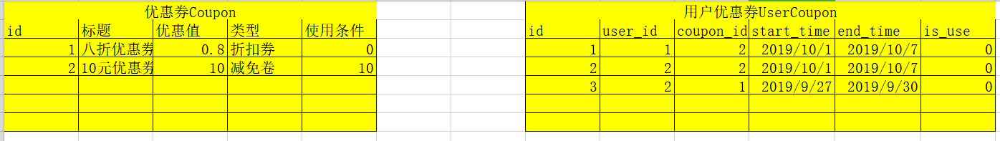

完成购物车功能以后，那么我们可以让用户点击“去结算”按钮时，在后端提供一个查询勾选商品的API接口给客户端，展示数据在结算页面中。


后端实现API接口，cart/views.py，代码：

```python
from rest_framework.viewsets import ViewSet
from rest_framework.permissions import IsAuthenticated
from course.models import Course,CourseExpire
from rest_framework.response import Response
from rest_framework import status
from django_redis import get_redis_connection
from luffyapi.settings import constants
import logging
log = logging.getLogger("django")


class CartAPIView(ViewSet):
    """购物车"""
    permission_classes = [IsAuthenticated]
    def add(self,request):
        """添加商品到购物车中"""
        # 接受客户端提交参数[用户ID，课程ID，勾选状态，有效期选项]
        course_id = request.data.get("course_id")
        user_id = request.user.id
        # 设置默认值
        selected = True
        expire = 0
        # 校验参数
        try:
            course = Course.objects.get(is_show=True, is_deleted=False, id=course_id)
        except Course.DoesNotExist:
            return Response({"message":"参数有误！课程不存在！"}, status=status.HTTP_400_BAD_REQUEST)

        # 获取redis连接对象
        redis_conn = get_redis_connection("cart")
        # 保存数据到redis
        try:
            pipe = redis_conn.pipeline()
            pipe.multi()
            pipe.hset("cart_%s" % user_id, course_id, expire)
            pipe.sadd("selected_%s" % user_id, course_id)
            pipe.execute()

            # 查询购物车中商品总数
            course_len = redis_conn.hlen("cart_%s" % user_id)

        except:
            log.error("购物车数据存储错误！")
            return Response({"message": "参数有误！购物车添加商品失败！"}, status=status.HTTP_507_INSUFFICIENT_STORAGE)


        # 返回结果[当前购物车中商品总数]
        return Response({"message":"购物车商品添加成功！","cart_length": course_len})

    def list(self,request):
        """购物车中的商品列表"""
        user_id = request.user.id
        # 从redis中读取数据
        redis_conn = get_redis_connection("cart")
        cart_bytes_dict = redis_conn.hgetall("cart_%s" % user_id )
        selected_bytes_list = redis_conn.smembers("selected_%s" % user_id )
        # 使用循环从mysql中根据课程ID提取对应的商品信息[商品ID，商品封面图片，商品标题]
        data = []
        for course_id_bytes,expire_id_bytes in cart_bytes_dict.items():
            course_id = int( course_id_bytes.decode() )
            expire_id = int( expire_id_bytes.decode() )
            try:
                course = Course.objects.get(is_show=True, is_deleted=False, pk=course_id)
            except Course.DoesNotExist:
                continue

            data.append({
                "selected": True if course_id_bytes in selected_bytes_list else False,
                "course_img": constants.SERVER_IMAGE_DOMAIN + course.course_img.url,
                "name": course.name,
                "id": course.id,
                "expire_id": expire_id,
                "expire_list": course.expire_list,
                "price": course.real_price(expire_id),
            })
        return Response(data)

    def change_selected(self,request):
        """切换购物车商品的勾选状态"""
        user_id = request.user.id
        selected = request.data.get("selected")
        course_id = request.data.get("course_id")
        try:
            Course.objects.get(is_show=True, is_deleted=False, id=course_id)
        except Course.DoesNotExist:
            return Response({"message":"参数有误！当前商品课程不存在！"}, status=status.HTTP_400_BAD_REQUEST)

        redis_conn = get_redis_connection("cart")
        if selected:
            redis_conn.sadd("selected_%s" % user_id, course_id)
        else:
            redis_conn.srem("selected_%s" % user_id, course_id)

        return Response({"message":"切换勾选状态成功！"})

    def change_expire(self,request):
        """切换购物车商品的勾选状态"""
        user_id = request.user.id
        expire_id = request.data.get("expire_id")
        course_id = request.data.get("course_id")
        try:
            # 判断课程是否存在
            course = Course.objects.get(is_show=True, is_deleted=False, id=course_id)
            # 判断课程的有效期选项是0还是其他的数值，如果是其他数值，还要判断是否存在于有效期选项表中
            if expire_id > 0:
                epxire_item = CourseExpire.objects.filter(is_show=True,is_deleted=False,id=expire_id)
                if not epxire_item:
                    raise Course.DoesNotExist()
        except Course.DoesNotExist:
            return Response({"message":"参数有误！当前商品课程不存在或者不能存在的有效期！"}, status=status.HTTP_400_BAD_REQUEST)


        redis_conn = get_redis_connection("cart")
        redis_conn.hset("cart_%s" % user_id, course_id, expire_id)

        # 在切换有效期选项以后，重新获取真实价格
        real_price = course.real_price(expire_id)

        return Response({"message":"切换课程有效期成功！", "real_price": real_price})

    def del_cart(self,request):
        """从购物车中商品商品信息"""
        user_id = request.user.id
        course_id = request.query_params.get("course_id")
        try:
            Course.objects.get(is_show=True, is_deleted=False, id=course_id)
        except Course.DoesNotExist:
            return Response({"message":"参数有误！当前商品课程不存在！"}, status=status.HTTP_400_BAD_REQUEST)

        redis_conn = get_redis_connection("cart")
        pipe = redis_conn.pipeline()
        pipe.multi()
        pipe.hdel('cart_%s' % user_id, course_id)
        pipe.srem("selected_%s" % user_id, course_id)
        pipe.execute()

        return Response({"message":"删除商品成功！"})

    def get_selected_course(self,request):
        """获取购物车中勾选的商品列表"""
        # 获取用户ID
        user_id = request.user.id
        # 获取redis连接
        redis_conn = get_redis_connection("cart")

        # 获取购物车中所有的商品
        cart_bytes_dict = redis_conn.hgetall("cart_%s" % user_id )
        selected_bytes_list = redis_conn.smembers("selected_%s" % user_id )

        # 获取勾选的商品
        data = [] # 商品列表
        total_price = 0 # 勾选商品总价格
        for course_id_bytes,expire_id_bytes in cart_bytes_dict.items():
            course_id = int( course_id_bytes.decode() )
            expire_id = int( expire_id_bytes.decode() )
            # 判断商品课程ID是否在勾选集合中
            if course_id_bytes in selected_bytes_list:
                try:
                    course = Course.objects.get(is_show=True, is_deleted=False, pk=course_id)
                except Course.DoesNotExist:
                    continue

                # 判断课程有效期，获取课程原价
                original_price = course.price
                expire_text = "永久有效"
                try:
                    if expire_id > 0:
                        coruseexpire = CourseExpire.objects.get(id=expire_id)
                        original_price = coruseexpire.price
                        expire_text = coruseexpire.expire_text
                except CourseExpire.DoesNotExist:
                    pass

                real_price = course.real_price(expire_id)

                data.append({
                    "course_img": constants.SERVER_IMAGE_DOMAIN + course.course_img.url,
                    "name": course.name,
                    "id": course.id,
                    "expire_text": expire_text,
                    "discount_name": course.discount_name,
                    "real_price": real_price,
                    "original_price": "%.2f" % original_price
                })

                total_price += float( real_price )

        return Response({"course_list":data,"total_price":total_price})

```

路由，代码：

```python
from django.urls import path,re_path
from . import views
urlpatterns = [
    path(r"", views.CartAPIView.as_view(
        {
            "post":"add",
            "get":"list",
            "patch":"change_selected",
            "put":"change_expire",
            "delete":"del_cart",
        }) ),
    path(r"order/",views.CartAPIView.as_view({"get":"get_selected_course"}))
]

```

前端完成页面从购物车页面跳转到结算页面。

components/Cart.vue代码：

```python
<span class="goto_pay"><router-link to="/order">去结算</router-link></span>
```

增加显示结算页面的路由和组件代码：

```javascript
import Vue from 'vue'
import Router from 'vue-router'

Vue.use(Router)
// @ 表示src目录

import Order from "@/components/Order"
import AliPlayer from "@/components/AliPlayer"
export default new Router({
  mode:"history",
  routes: [
    
    {
      path: '/order',
      name: 'Order',
      component: Order,
    },
    {
      path: '/aliPlayer',
      name: 'AliPlayer',
      component: AliPlayer,
    }
  ]
})

```

components/Order.vue，页面代码：

```vue
<template>
  <div class="cart">
    <Header/>
    <div class="cart-info">
        <h3 class="cart-top">购物车结算 <span>共1门课程</span></h3>
        <div class="cart-title">
           <el-row>
             <el-col :span="2">&nbsp;</el-col>
             <el-col :span="10">课程</el-col>
             <el-col :span="8">有效期</el-col>
             <el-col :span="4">价格</el-col>
           </el-row>
        </div>
        <div class="cart-item">
          <el-row>
             <el-col :span="2" class="checkbox">&nbsp;&nbsp;</el-col>
             <el-col :span="10" class="course-info">
               
                <span>python入门</span>
             </el-col>
             <el-col :span="8"><span>永久有效</span></el-col>
             <el-col :span="4" class="course-price">¥99.50</el-col>
           </el-row>
        </div>
        <div class="cart-item">
          <el-row>
             <el-col :span="2" class="checkbox">&nbsp;&nbsp;</el-col>
             <el-col :span="10" class="course-info">
               
                <span>python入门</span>
             </el-col>
             <el-col :span="8"><span>永久有效</span></el-col>
             <el-col :span="4" class="course-price">¥99.50</el-col>
           </el-row>
        </div>
        <div class="calc">
            <el-row class="pay-row">
              <el-col :span="4" class="pay-col"><span class="pay-text">支付方式：</span></el-col>
              <el-col :span="8">
                <span class="alipay"></span>
                <span class="alipay wechat"></span>
              </el-col>
              <el-col :span="8" class="count">实付款： <span>¥99.50</span></el-col>
              <el-col :span="4" class="cart-pay"><span @click="payhander">支付宝支付</span></el-col>
            </el-row>
        </div>
    </div>
    <Footer/>
  </div>
</template>

<script>
  import Header from "./common/Header"
  import Footer from "./common/Footer"
  export default {
    name:"Order",
    data(){
      return {
        id: localStorage.id || sessionStorage.id,
        order_id:sessionStorage.order_id || null,
        course_list: [],
        total_price: 0,
      }
    },
    components:{
      Header,
      Footer,
    },
    created(){
        
    },
    methods: {
      payhander(){

      }
    }
  }
</script>

<style scoped>
.cart{
  margin-top: 80px;
}
.cart-info{
  overflow: hidden;
  width: 1200px;
  margin: auto;
}
.cart-top{
  font-size: 18px;
  color: #666;
  margin: 25px 0;
  font-weight: normal;
}
.cart-top span{
    font-size: 12px;
    color: #d0d0d0;
    display: inline-block;
}
.cart-title{
    background: #F7F7F7;
    height: 70px;
}
.calc{
  margin-top: 25px;
  margin-bottom: 40px;
}

.calc .count{
  text-align: right;
  margin-right: 10px;
  vertical-align: middle;
}
.calc .count span{
    font-size: 36px;
    color: #333;
}
.calc .cart-pay{
    margin-top: 5px;
    width: 110px;
    height: 38px;
    outline: none;
    border: none;
    color: #fff;
    line-height: 38px;
    background: #ffc210;
    border-radius: 4px;
    font-size: 16px;
    text-align: center;
    cursor: pointer;
}
.cart-item{
  height: 120px;
  line-height: 120px;
  margin-bottom: 30px;
}
.course-info img{
    width: 175px;
    height: 115px;
    margin-right: 35px;
    vertical-align: middle;
}
.alipay{
  display: inline-block;
  height: 48px;
}
.alipay img{
  height: 100%;
  width:auto;
}

.pay-text{
  display: block;
  text-align: right;
  height: 100%;
  line-height: 100%;
  vertical-align: middle;
  margin-top: 20px;
}
</style>
```

在组件中获取购物车勾选商品的数据，

```vue
<template>
  <div class="cart">
    <Header/>
    <div class="cart-info">
        <h3 class="cart-top">购物车结算 <span>共{{course_list.length}}门课程</span></h3>
        <div class="cart-title">
           <el-row>
             <el-col :span="2">&nbsp;</el-col>
             <el-col :span="10">课程</el-col>
             <el-col :span="8">有效期</el-col>
             <el-col :span="4">价格</el-col>
           </el-row>
        </div>
        <div class="cart-item" v-for="course in course_list">
          <el-row>
             <el-col :span="2" class="checkbox">&nbsp;&nbsp;</el-col>
             <el-col :span="10" class="course-info">
               
               <span class="course_name">{{course.name}}<br><span class="discount">{{course.discount_name}}</span></span>
             </el-col>
             <el-col :span="8"><span>{{course.expire_text}}</span></el-col>
             <el-col :span="4" class="course-price">
               <span class="real_price">¥{{course.real_price}}</span><br>
               <span class="original_price">原价¥{{course.original_price}}</span>
             </el-col>
           </el-row>
        </div>

        <div class="calc">
            <el-row class="pay-row">
              <el-col :span="4" class="pay-col"><span class="pay-text">支付方式：</span></el-col>
              <el-col :span="8">
                <span class="alipay"></span>
                <span class="alipay wechat"></span>
              </el-col>
              <el-col :span="8" class="count">实付款： <span>¥{{total_price.toFixed(2)}}</span></el-col>
              <el-col :span="4" class="cart-pay"><span>支付宝支付</span></el-col>
            </el-row>
        </div>
    </div>
    <Footer/>
  </div>
</template>

<script>
  import Header from "./common/Header"
  import Footer from "./common/Footer"
  export default {
    name:"Order",
    data(){
      return {
        course_list: [],
        total_price: 0,
      }
    },
    components:{
      Header,
      Footer,
    },
    created(){
      this.token = this.check_user_login();
      this.get_cart();
    },
    methods: {
      check_user_login(){
        let token = localStorage.user_token || sessionStorage.user_token;
        if( !token ){
            let self = this;
            this.$confirm("对不起，您尚未登录！所以请登录再使用购物车","路飞学城",{
                confirmButtonText: '确定',
                cancelButtonText: '取消',
                type: 'warning'
            }).then(() => {
                self.$router.push("/user/login");
            });
            return false; // 阻止js继续往下执行
        }
        return token;
      },
      get_cart(){
          // 获取购物车中要结算的商品列表
          this.$axios.get(`${this.$settings.HOST}/cart/order/`,{
              headers:{
                  "Authorization": "jwt " + this.token,
              }
          }).then(response=>{
              this.course_list = response.data.course_list;
              this.total_price = response.data.total_price;
              console.log(course_list);
          }).catch(error=>{
              this.$message.error(error.response);
          })
      },
    }
  }
</script>

<style scoped>
.cart{
  margin-top: 80px;
}
.cart-info{
  overflow: hidden;
  width: 1200px;
  margin: auto;
}
.cart-top{
  font-size: 18px;
  color: #666;
  margin: 25px 0;
  font-weight: normal;
}
.cart-top span{
    font-size: 12px;
    color: #d0d0d0;
    display: inline-block;
}
.cart-title{
    background: #F7F7F7;
    height: 70px;
}
.calc{
  margin-top: 25px;
  margin-bottom: 40px;
}

.calc .count{
  text-align: right;
  margin-right: 10px;
  vertical-align: middle;
}
.calc .count span{
    font-size: 36px;
    color: #333;
}
.calc .cart-pay{
    margin-top: 5px;
    width: 110px;
    height: 38px;
    outline: none;
    border: none;
    color: #fff;
    line-height: 38px;
    background: #ffc210;
    border-radius: 4px;
    font-size: 16px;
    text-align: center;
    cursor: pointer;
}
.cart-item{
  height: 120px;
  line-height: 120px;
  margin-bottom: 30px;
}
.course-info img{
    width: 175px;
    height: 115px;
    margin-right: 35px;
    vertical-align: middle;
}
.alipay{
  display: inline-block;
  height: 48px;
}
.alipay img{
  height: 100%;
  width:auto;
}

.pay-text{
  display: block;
  text-align: right;
  height: 100%;
  line-height: 100%;
  vertical-align: middle;
  margin-top: 20px;
}
.course_name,.real_price,.original_price{
  display: inline-block;
  line-height: 140%;
}
.course_name .discount{
  color: #ffc210;
}

.original_price{
  color: #9b9b9b;
}
.course-price{
  line-height: 32px;
}
</style>
```


完成了商品信息展示以后,我们把优惠券功能和积分功能延后处理,先完成订单的生成.

所以为了方便开发，和以后项目的维护，我们再次创建子应用orders来完成接下来的订单和订单支付功能。

```base
cd luffyapi/apps
python ../../manage.py startapp order
```

注册子应用，settings/dev.py，代码：

```python
INSTALLED_APPS = [
    # 子应用
	。。。
    
    'order',
]
```


## 订单模型

订单模型分析：

```python
订单模型：  优惠券ID，积分兑换数量，订单总价格，订单标题，订单支付时间，用户ID，订单状态，订单有效时间，订单号，支付方式，
订单详情模型： 商品ID，商品原价，商品实价，商品有效期，商品优惠方式
商品购买记录： 
优惠券模型：
积分流水模型： 
```

为什么有订单号？

```python
原因是支付平台需要记录每一个商家的资金流水，所以需要我们这边提供一个足够复杂的流水号和支付平台保持一致。
所以订单号是支付平台那边强制要求在支付时提供给平台的。
订单号，因为第三方支付平台依靠这个订单号来识别当前订单是否已经支付过的。
```


订单模型的代码：

```python
from django.db import models
from luffyapi.utils.models import BaseModel
from user.models import User
from course.models import Course
class Order(BaseModel):
    """订单模型"""
    status_choices = (
        (0, '未支付'),
        (1, '已支付'),
        (2, '已取消'),
        (3, '超时取消'),
    )
    pay_choices = (
        (1, '支付宝'),
        (2, '微信支付'),
    )
    order_title = models.CharField(max_length=150,verbose_name="订单标题")
    total_price = models.DecimalField(max_digits=6, decimal_places=2, verbose_name="订单总价", default=0)
    real_price = models.DecimalField(max_digits=6, decimal_places=2, verbose_name="实付金额", default=0)
    order_number = models.CharField(max_length=64,verbose_name="订单号")
    order_status = models.SmallIntegerField(choices=status_choices, default=0, verbose_name="订单状态")
    pay_type = models.SmallIntegerField(choices=pay_choices, default=1, verbose_name="支付方式")
    credit = models.IntegerField(default=0, verbose_name="使用的积分数量")
    coupon = models.IntegerField(null=True, verbose_name="用户优惠券ID")
    order_desc = models.TextField(max_length=500, verbose_name="订单描述")
    pay_time = models.DateTimeField(null=True, verbose_name="支付时间")
    user = models.ForeignKey(User, related_name='user_orders', on_delete=models.DO_NOTHING,verbose_name="下单用户")

    class Meta:
        db_table="ly_order"
        verbose_name= "订单记录"
        verbose_name_plural= "订单记录"

    def __str__(self):
        return "%s,总价: %s,实付: %s" % (self.order_title, self.total_price, self.real_price)


class OrderDetail(BaseModel):
    """
    订单详情
    """
    order = models.ForeignKey(Order, related_name='order_courses', on_delete=models.CASCADE, verbose_name="订单ID")
    course = models.ForeignKey(Course, related_name='course_orders', on_delete=models.CASCADE, verbose_name="课程ID")
    expire = models.IntegerField(default='0', verbose_name="有效期周期",help_text="0表示永久有效")
    price = models.DecimalField(max_digits=6, decimal_places=2, verbose_name="课程原价")
    real_price = models.DecimalField(max_digits=6, decimal_places=2, verbose_name="课程实价")
    discount_name = models.CharField(max_length=120,default="",verbose_name="优惠类型")

    class Meta:
        db_table="ly_order_detail"
        verbose_name= "订单详情"
        verbose_name_plural= "订单详情"

    def __str__(self):
        return "%s" % (self.course.name)
```

数据迁移：

```python
python manage.py makemigrations
python manage.py migrate
```


### 把当前子应用注册到xadmin中

在当前子应用下创建adminx.py，代码：

```python
import xadmin
from .models import Order
class OrderModelAdmin(object):
    """订单模型管理类"""
    pass

xadmin.site.register(Order, OrderModelAdmin)


from .models import OrderDetail
class OrderDetailModelAdmin(object):
    """订单详情模型管理类"""
    pass

xadmin.site.register(OrderDetail, OrderDetailModelAdmin)
```


### 后端实现生成订单的api接口

视图order/views.py，代码：

```python
from rest_framework.generics import CreateAPIView
from .models import Order
from .serializers import OrderModelSerializer
from rest_framework.permissions import IsAuthenticated
# Create your views here.
class OrderAPIView(CreateAPIView):
    """订单视图"""
    queryset = Order.objects.filter(is_show=True,is_deleted=False)
    serializer_class = OrderModelSerializer
    # permission_classes = [IsAuthenticated]
```

序列化器，代码：

```python
from rest_framework import serializers
from .models import Order,OrderDetail
from django_redis import get_redis_connection
from datetime import datetime
from course.models import Course,CourseExpire

class OrderModelSerializer(serializers.ModelSerializer):
    """订单序列化器"""

    class Meta:
        model = Order
        fields = ["id", "order_number", "pay_type", "credit", "coupon"]
        extra_kwargs = {
            "id":{"read_only": True},
            "order_number": {"read_only": True},
            "pay_type": {"write_only": True},
            "credit": {"write_only": True},
            "coupon": {"write_only": True}
        }

    def validate(self, attrs):
        # 验证数据
        pay_type = attrs.get("pay_type")
        try:
            Order.pay_choices[pay_type]
        except:
            raise serializers.ValidationError("对不起，当前不支持选中的支付方式！")

        # todo 判断积分使用是否上限

        # todo 判断优惠券是否满足使用条件，是否存在，或者是否已经过期

        # todo 校验购买的商品课程是否存在

        # 一定要 return 验证结果
        return attrs

    def create(self, validated_data):
        """生成订单[使用事务来完成订单的生成]"""
        # 生成唯一订单号[结合时间+用户ID+随机数(递增值<在redis中针对一个数值不断递增>)]
        redis_conn = get_redis_connection("cart")
        # 调用序列化器 OrderSerializer(instance="模型对象",data=data,context={"views":"视图对象","request":"请求对象"....})
        user_id = 1 # self.context["request"].user.id
        incr = int( redis_conn.incr("order") )
        order_number = datetime.now().strftime("%Y%m%d%H%M%S") + "%06d" % user_id + "%06d" % incr

        # 生成订单
        order = Order.objects.create(
            order_title="路飞学城课程购买",
            total_price=0,
            real_price=0,
            order_number=order_number, # 订单号
            order_status=0,
            pay_type=validated_data.get("pay_type"),
            credit=validated_data.get("pay_type",0),
            coupon=validated_data.get("pay_type",0),
            order_desc="",
            user_id=user_id
        )

        # 然后生成订单详情[记录本次下单的所有商品课程信息]
        cart_bytes_dict = redis_conn.hgetall("cart_%s" % user_id )
        selected_bytes_list = redis_conn.smembers("selected_%s" % user_id )


        # 获取勾选的商品
        for course_id_bytes,expire_id_bytes in cart_bytes_dict.items():
            course_id = int( course_id_bytes.decode() )
            expire_id = int( expire_id_bytes.decode() )
            # 判断商品课程ID是否在勾选集合中
            if course_id_bytes in selected_bytes_list:
                try:
                    course = Course.objects.get(is_show=True, is_deleted=False, pk=course_id)
                except Course.DoesNotExist:
                    raise  serializers.ValidationError("对不起，购买的商品不存在或者已下架！")

                # 判断课程有效期，获取课程原价
                original_price = course.price
                try:
                    if expire_id > 0:
                        coruseexpire = CourseExpire.objects.get(id=expire_id)
                        original_price = coruseexpire.price
                except CourseExpire.DoesNotExist:
                    pass

                real_price = course.real_price(expire_id)

                OrderDetail.objects.create(
                    order=order,
                    course=course,
                    expire=expire_id,
                    price=original_price,
                    real_price=real_price,
                    discount_name=course.discount_name
                )

                # 计算订单总价
                order.total_price += float(original_price)
                order.real_price += float(real_price)

        order.save()

        # 返回生成的模型
        return order
```

提供路由，代码：

```python
from django.urls import path,re_path
from . import views
urlpatterns = [
    path(r"",views.OrderAPIView.as_view()),
]
```

通过postman 访问成功以后，有出现空单的生成情况，原因一次性生成多条数据记录或者一次性操作多个模型，都有可能产生中途报错的情况，所以我们需要在生成订单时保证多个数据操作的原子性。

```python
事务： 在完成一个整体功能时，操作到了多个表数据，或者同一个表的多条记录，如果要保证这些SQL语句操作作为一个整体保存到数据库中，那么可以使用事务(transation)，
	事务具有4个特性，5个隔离等级
  
  四个特性：一致性，原子性，隔离性，持久性
  # 隔离性: 两个事务的隔离性，隔离性的修改可以通过数据库的配置文件进行修改
  五个隔离级别： 串行隔离，可重复读，已提交读，未提交读，没有隔离级别
    原子性（Atomicity）
    一致性（Consistency）
    隔离性（Isolation）[事务隔离级别->幻读，脏读]
    持久性（Durability）

  在mysql中有专门的SQl语句来完成事务的操作，事务操作一般有3个步骤：
		设置事务开始  transation start
		事务的处理[增删改]
		设置事务的回滚或者提交 rollback / commit

在 django等web框架中，只要ORM模型，一般都会实现了事务操作封装
所以在django中我们可以直接使用ORM模型提供的事务操作方法即可完成事务的操作
```


django框架本身就提供了2种事务操作的用法。

django的事务操作方法主要通过 django.db.transation模块完成的。

启用事务用法1：

```python
from django.db import transaction
from rest_framework.views import APIView
class OrderAPIView(APIView):
	@transaction.atomic          # 开启事务，当方法执行完成以后，自动提交事务
    def post(self,request):
        ....
```

启用事务用法2：

```python
from django.db import transaction
from rest_framework.views import APIView
class OrderAPIView(APIView):
    def post(self,request):
        ....
        with transation.atomic(): # 开启事务，当with语句执行完成以后，自动提交事务
            # 数据库操作
```

在使用事务过程中， 有时候会出现异常，当出现异常的时候，我们需要让程序停止下来，同时需要回滚事务。

```python
from django.db import transaction
from rest_framework.views import APIView
class OrderAPIView(APIView):
    def post(self,request):
        ....
        with transation.atomic():
            # 设置事务回滚的标记点
            sid = transation.savepoint()

            ....

            try:
                ....
            except:
                transation.savepoint_rallback(sid)
```


#### 使用django提供的mysql事务操作保证下单过程中的数据原子性

redis中使用管道和事务保存redis操作的原子性

序列化器代码：

```python
from rest_framework import serializers
from .models import Order,OrderDetail
from django_redis import get_redis_connection
from datetime import datetime
from course.models import Course,CourseExpire
from django.db import transaction


class OrderModelSerializer(serializers.ModelSerializer):
    """订单序列化器"""

    class Meta:
        model = Order
        fields = ["id", "order_number", "pay_type", "credit", "coupon"]
        extra_kwargs = {
            "id":{"read_only": True},
            "order_number": {"read_only": True},
            "pay_type": {"write_only": True},
            "credit": {"write_only": True},
            "coupon": {"write_only": True}
        }

    def validate(self, attrs):
        # 验证数据
        pay_type = attrs.get("pay_type")
        try:
            Order.pay_choices[pay_type]
        except:
            raise serializers.ValidationError("对不起，当前不支持选中的支付方式！")

        # todo 判断积分使用是否上限

        # todo 判断优惠券是否满足使用条件，是否存在，或者是否已经过期

        # todo 校验购买的商品课程是否存在

        # 一定要 return 验证结果
        return attrs

    def create(self, validated_data):
        """生成订单[使用事务来完成订单的生成]"""
        # 生成唯一订单号[结合时间+用户ID+随机数(递增值<在redis中针对一个数值不断递增>)]
        redis_conn = get_redis_connection("cart")
        # 调用序列化器 OrderSerializer(instance="模型对象",data=data,context={"views":"视图对象","request":"请求对象"....})
        user_id = self.context["request"].user.id
        incr = int( redis_conn.incr("order") )
        order_number = datetime.now().strftime("%Y%m%d%H%M%S") + "%06d" % user_id + "%06d" % incr

        with transaction.atomic():
            # 记录事务回滚点
            save_id = transaction.savepoint()
            # 生成订单
            order = Order.objects.create(
                order_title="路飞学城课程购买",
                total_price=0,
                real_price=0,
                order_number=order_number, # 订单号
                order_status=0,
                pay_type=validated_data.get("pay_type"),
                credit=validated_data.get("pay_type",0),
                coupon=validated_data.get("pay_type",0),
                order_desc="",
                user_id=user_id
            )

            # 然后生成订单详情[记录本次下单的所有商品课程信息]
            cart_bytes_dict = redis_conn.hgetall("cart_%s" % user_id )
            selected_bytes_list = redis_conn.smembers("selected_%s" % user_id )

            # 开启redis事务操作
            pipe = redis_conn.pipeline()
            pipe.multi()

            # 获取勾选的商品
            for course_id_bytes,expire_id_bytes in cart_bytes_dict.items():
                course_id = int( course_id_bytes.decode() )
                expire_id = int( expire_id_bytes.decode() )
                # 判断商品课程ID是否在勾选集合中
                if course_id_bytes in selected_bytes_list:
                    try:
                        course = Course.objects.get(is_show=True, is_deleted=False, pk=course_id)
                    except Course.DoesNotExist:
                        # 回滚事务[把save_id声明到这里的中间所有执行的sql语句执行产生的影响抹除]
                        transaction.savepoint_rollback(save_id)
                        raise serializers.ValidationError("对不起，购买的商品不存在或者已下架！")

                    # 判断课程有效期，获取课程原价
                    original_price = course.price
                    try:
                        if expire_id > 0:
                            coruseexpire = CourseExpire.objects.get(id=expire_id)
                            original_price = coruseexpire.price
                    except CourseExpire.DoesNotExist:
                        pass

                    real_price = course.real_price(expire_id)
                    # 生成订单详情
                    try:
                        OrderDetail.objects.create(
                            order=order,
                            course=course,
                            expire=expire_id,
                            price=original_price,
                            real_price=real_price,
                            discount_name=course.discount_name
                        )
                    except:
                        transaction.savepoint_rollback(save_id)
                        raise serializers.ValidationError("对不起，订单生成失败！")

                    # 计算订单总价
                    order.total_price += float(original_price)
                    order.real_price += float(real_price)

                    # 移除掉已经加入到订单里面的购物车商品
                    pipe.hdel("cart_%s" % user_id, course_id)
                    pipe.srem("selected_%s" % user_id, course_id)

            try:
                order.save()
                pipe.execute()
            except:
                transaction.savepoint_rollback(save_id)
                raise serializers.ValidationError("对不起，订单生成失败！")

        # 返回生成的模型
        return order
```

视图代码： 

```python
from rest_framework.generics import CreateAPIView
from .models import Order
from .serializers import OrderModelSerializer
from rest_framework.permissions import IsAuthenticated
# Create your views here.
class OrderAPIView(CreateAPIView):
    """订单视图"""
    queryset = Order.objects.filter(is_show=True,is_deleted=False)
    serializer_class = OrderModelSerializer
    permission_classes = [IsAuthenticated]
```


### 前端发送ajax请求生成订单

```vue
<template>
  <div class="cart">
    <Header/>
    <div class="cart-info">
        <h3 class="cart-top">购物车结算 <span>共{{course_list.length}}门课程</span></h3>
        <div class="cart-title">
           <el-row>
             <el-col :span="2">&nbsp;</el-col>
             <el-col :span="10">课程</el-col>
             <el-col :span="8">有效期</el-col>
             <el-col :span="4">价格</el-col>
           </el-row>
        </div>
        <div class="cart-item" v-for="course in course_list">
          <el-row>
             <el-col :span="2" class="checkbox">&nbsp;&nbsp;</el-col>
             <el-col :span="10" class="course-info">
               
               <span class="course_name">{{course.name}}<br><span class="discount">{{course.discount_name}}</span></span>
             </el-col>
             <el-col :span="8"><span>{{course.expire_text}}</span></el-col>
             <el-col :span="4" class="course-price">
               <span class="real_price">¥{{course.real_price}}</span><br>
               <span class="original_price">原价¥{{course.original_price}}</span>
             </el-col>
           </el-row>
        </div>

        <div class="calc">
            <el-row class="pay-row">
              <el-col :span="4" class="pay-col"><span class="pay-text">支付方式：</span></el-col>
              <el-col :span="8">
                <span class="alipay" v-if="pay_type==0"></span>
                <span class="alipay" @click="pay_type=0" v-else></span>
                <span class="alipay wechat" v-if="pay_type==1"></span>
                <span class="alipay wechat" @click="pay_type=1" v-else></span>
              </el-col>
              <el-col :span="8" class="count">实付款： <span>¥{{total_price.toFixed(2)}}</span></el-col>
              <el-col :span="4" class="cart-pay"><span @click="payHander">立即支付</span></el-col>
            </el-row>
        </div>
    </div>
    <Footer/>
  </div>
</template>

<script>
  import Header from "./common/Header"
  import Footer from "./common/Footer"
  export default {
    name:"Order",
    data(){
      return {
        pay_type: 0,
        credit: 0,
        coupon: 0,
        course_list: [],
        total_price: 0,
      }
    },
    components:{
      Header,
      Footer,
    },
    created(){
      this.token = this.check_user_login();
      this.get_cart();
    },
    methods: {
      check_user_login(){
        let token = localStorage.user_token || sessionStorage.user_token;
        if( !token ){
            let self = this;
            this.$confirm("对不起，您尚未登录！所以请登录再使用购物车","路飞学城",{
                confirmButtonText: '确定',
                cancelButtonText: '取消',
                type: 'warning'
            }).then(() => {
                self.$router.push("/user/login");
            });
            return false; // 阻止js继续往下执行
        }
        return token;
      },
      get_cart(){
          // 获取购物车中要结算的商品列表
          this.$axios.get(`${this.$settings.HOST}/cart/order/`,{
              headers:{
                  "Authorization": "jwt " + this.token,
              }
          }).then(response=>{
              this.course_list = response.data.course_list;
              this.total_price = response.data.total_price;
          }).catch(error=>{
              this.$message.error("对不起，当前购物车没有任何商品被勾选！");
          });
      },
      payHander(){
          // 生成订单
          this.$axios.post(`${this.$settings.HOST}/order/`,{
              pay_type: this.pay_type,  // 支付方式
              credit: this.credit,      // 积分
              coupon: this.coupon,      // 优惠券ID
          },{
              headers:{
                  "Authorization": "jwt " + this.token,
              }
          }).then(response=>{
              // 订单生成成功！
              this.$message.success("订单生成成功！即将跳转到支付页面，请不要眨眼！")
          }).catch(error=>{
              this.$message.error("订单生成失败！");
          })
      }
    },
  }
</script>

<style scoped>
.cart{
  margin-top: 80px;
}
.cart-info{
  overflow: hidden;
  width: 1200px;
  margin: auto;
}
.cart-top{
  font-size: 18px;
  color: #666;
  margin: 25px 0;
  font-weight: normal;
}
.cart-top span{
    font-size: 12px;
    color: #d0d0d0;
    display: inline-block;
}
.cart-title{
    background: #F7F7F7;
    height: 70px;
}
.calc{
  margin-top: 25px;
  margin-bottom: 40px;
}

.calc .count{
  text-align: right;
  margin-right: 10px;
  vertical-align: middle;
}
.calc .count span{
    font-size: 36px;
    color: #333;
}
.calc .cart-pay{
    margin-top: 5px;
    width: 110px;
    height: 38px;
    outline: none;
    border: none;
    color: #fff;
    line-height: 38px;
    background: #ffc210;
    border-radius: 4px;
    font-size: 16px;
    text-align: center;
    cursor: pointer;
}
.cart-item{
  height: 120px;
  line-height: 120px;
  margin-bottom: 30px;
}
.course-info img{
    width: 175px;
    height: 115px;
    margin-right: 35px;
    vertical-align: middle;
}
.alipay{
  display: inline-block;
  height: 48px;
}
.alipay img{
  height: 100%;
  width:auto;
}

.pay-text{
  display: block;
  text-align: right;
  height: 100%;
  line-height: 100%;
  vertical-align: middle;
  margin-top: 20px;
}
.course_name,.real_price,.original_price{
  display: inline-block;
  line-height: 140%;
}
.course_name .discount{
  color: #ffc210;
}

.original_price{
  color: #9b9b9b;
}
.course-price{
  line-height: 32px;
}
</style>
```

上面实现订单的生成过程中，有2个问题可以归纳下

```python
1. 用户ID怎么在序列化器中接受到
   user = self.context["request"].user.id
   原理：drf的序列化器中存储第三个参数 context，

2. 订单生成以后，用户未必会支付，所以我们要设置一个定时的功能来完成订单的超时取消！
	 实现这个功能有2种方案：
   A. 基于Celery的定时异步任务来完成
   B. 在django有一个第三方模块 django-crontab 可以提供给我们用于设置定时调用执行函数的功能！
```


### 前端请求后端的订单信息

```vue
<template>
  <div class="cart">
    <Header/>
    <div class="cart-info">
        <h3 class="cart-top">购物车结算 <span>共{{course_list.length}}门课程</span></h3>
        <div class="cart-title">
           <el-row>
             <el-col :span="2">&nbsp;</el-col>
             <el-col :span="10">课程</el-col>
             <el-col :span="8">有效期</el-col>
             <el-col :span="4">价格</el-col>
           </el-row>
        </div>
        <div class="cart-item" v-for="course in course_list">
          <el-row>
             <el-col :span="2" class="checkbox">&nbsp;&nbsp;</el-col>
             <el-col :span="10" class="course-info">
               
               <span class="course_name">{{course.name}}<br><span class="discount">{{course.discount_name}}</span></span>
             </el-col>
             <el-col :span="8"><span>{{course.expire_text}}</span></el-col>
             <el-col :span="4" class="course-price">
               <span class="real_price">¥{{course.real_price}}</span><br>
               <span class="original_price">原价¥{{course.original_price}}</span>
             </el-col>
           </el-row>
        </div>

        <div class="calc">
            <el-row class="pay-row">
              <el-col :span="4" class="pay-col"><span class="pay-text">支付方式：</span></el-col>
              <el-col :span="8">
                <span class="alipay" v-if="pay_type==0"></span>
                <span class="alipay" @click="pay_type=0" v-else></span>
                <span class="alipay wechat" v-if="pay_type==1"></span>
                <span class="alipay wechat" @click="pay_type=1" v-else></span>
              </el-col>
              <el-col :span="8" class="count">实付款： <span>¥{{total_price.toFixed(2)}}</span></el-col>
              <el-col :span="4" class="cart-pay"><span @click="payHander">立即支付</span></el-col>
            </el-row>
        </div>
    </div>
    <Footer/>
  </div>
</template>

<script>
  import Header from "./common/Header"
  import Footer from "./common/Footer"
  export default {
    name:"Order",
    data(){
      return {
        pay_type: 0,
        credit: 0,
        coupon: 0,
        course_list: [],
        total_price: 0,
      }
    },
    components:{
      Header,
      Footer,
    },
    created(){
      this.token = this.check_user_login();
      this.get_cart();
    },
    methods: {
      check_user_login(){
        let token = localStorage.user_token || sessionStorage.user_token;
        if( !token ){
            let self = this;
            this.$confirm("对不起，您尚未登录！所以请登录再使用购物车","路飞学城",{
                confirmButtonText: '确定',
                cancelButtonText: '取消',
                type: 'warning'
            }).then(() => {
                self.$router.push("/user/login");
            });
            return false; // 阻止js继续往下执行
        }
        return token;
      },
      get_cart(){
          // 获取购物车中要结算的商品列表
          this.$axios.get(`${this.$settings.HOST}/cart/order/`,{
              headers:{
                  "Authorization": "jwt " + this.token,
              }
          }).then(response=>{
              this.course_list = response.data.course_list;
              this.total_price = response.data.total_price;
          }).catch(error=>{
              this.$message.error("对不起，当前购物车没有任何商品被勾选！");
          });
      },
      payHander(){
          // 生成订单
          this.$axios.post(`${this.$settings.HOST}/order/`,{
              pay_type: this.pay_type,  // 支付方式
              credit: this.credit,      // 积分
              coupon: this.coupon,      // 优惠券ID
          },{
              headers:{
                  "Authorization": "jwt " + this.token,
              }
          }).then(response=>{
              // 订单生成成功！
              this.$message.success("订单生成成功！即将跳转到支付页面，请不要眨眼！");
              // 发起支付[页面跳转,后端需要提供跳转地址]

          }).catch(error=>{
              this.$message.error("订单生成失败！");
          })
      }
    },
  }
</script>

<style scoped>
.cart{
  margin-top: 80px;
}
.cart-info{
  overflow: hidden;
  width: 1200px;
  margin: auto;
}
.cart-top{
  font-size: 18px;
  color: #666;
  margin: 25px 0;
  font-weight: normal;
}
.cart-top span{
    font-size: 12px;
    color: #d0d0d0;
    display: inline-block;
}
.cart-title{
    background: #F7F7F7;
    height: 70px;
}
.calc{
  margin-top: 25px;
  margin-bottom: 40px;
}

.calc .count{
  text-align: right;
  margin-right: 10px;
  vertical-align: middle;
}
.calc .count span{
    font-size: 36px;
    color: #333;
}
.calc .cart-pay{
    margin-top: 5px;
    width: 110px;
    height: 38px;
    outline: none;
    border: none;
    color: #fff;
    line-height: 38px;
    background: #ffc210;
    border-radius: 4px;
    font-size: 16px;
    text-align: center;
    cursor: pointer;
}
.cart-item{
  height: 120px;
  line-height: 120px;
  margin-bottom: 30px;
}
.course-info img{
    width: 175px;
    height: 115px;
    margin-right: 35px;
    vertical-align: middle;
}
.alipay{
  display: inline-block;
  height: 48px;
}
.alipay img{
  height: 100%;
  width:auto;
}

.pay-text{
  display: block;
  text-align: right;
  height: 100%;
  line-height: 100%;
  vertical-align: middle;
  margin-top: 20px;
}
.course_name,.real_price,.original_price{
  display: inline-block;
  line-height: 140%;
}
.course_name .discount{
  color: #ffc210;
}

.original_price{
  color: #9b9b9b;
}
.course-price{
  line-height: 32px;
}
</style>

```


## 优惠券

创建一个coupon子应用.

```bash
cd luffyapi/apps
python ../../manage.py startapp coupon
```

注册子应用

```python
INSTALLED_APPS = [
 

    # 子应用
	。。。
    'coupon',
]
```

模型分析：




代码：

```python
from django.db import models
from luffyapi.utils.models import BaseModel
from user.models import User

# Create your models here.
class Coupon(BaseModel):
    """优惠券"""
    coupon_choices = (
        (0, '折扣优惠'),
        (1, '减免优惠')
    )
    name = models.CharField(max_length=32, verbose_name="优惠券标题")
    coupon_type = models.SmallIntegerField(choices=coupon_choices, default=0, verbose_name="优惠券类型")
    timer = models.IntegerField(verbose_name="优惠券有效期", default=7, help_text="默认当前优惠券7天有效，如果设置值为-1则表示当前优惠券永久有效")
    condition = models.IntegerField(blank=True, default=0, verbose_name="满足使用优惠券的价格条件，如果设置值为0,则表示没有任何条件")
    sale = models.TextField(verbose_name="优惠公式", help_text="""
        *号开头表示折扣价，例如*0.82表示八二折；<br>
        -号开头表示减免价,例如-10表示在总价基础上减免10元<br>    
        """)

    class Meta:
        db_table = "ly_coupon"
        verbose_name="优惠券"
        verbose_name_plural="优惠券"

    def __str__(self):
        return "%s" % (self.name)

class UserCoupon(BaseModel):
    user = models.ForeignKey(User, on_delete=models.CASCADE, related_name="coupons", verbose_name="用户")
    coupon = models.ForeignKey(Coupon, on_delete=models.CASCADE, related_name="users", verbose_name="优惠券")
    start_time = models.DateTimeField(verbose_name="优惠策略的开始时间")
    is_use = models.BooleanField(default=False,verbose_name="优惠券是否使用过")

    class Meta:
        db_table = "ly_user_coupon"
        verbose_name = "用户的优惠券"
        verbose_name_plural = "用户的优惠券"

    def __str__(self):
        return "优惠券:%s,用户:%s" % (self.coupon.name, self.user.username)
```

数据迁移

```base
cd ../../
python manage.py makemigrations
python manage.py migrate
```


注册到xadmin，添加测试数据[1.添加优惠券，给用户发放优惠券]

```python
import xadmin
from .models import Coupon
class CouponModelAdmin(object):
    """优惠券模型管理类"""
    list_display = ["name","coupon_type","timer"]
xadmin.site.register(Coupon, CouponModelAdmin)


from .models import UserCoupon
class UserCouponModelAdmin(object):
    """我的优惠券模型管理类"""
    list_display = ["user","coupon","start_time","is_use"]

xadmin.site.register(UserCoupon, UserCouponModelAdmin)
```


添加测试数据

```sql
INSERT INTO `ly_coupon` VALUES (1,1,1,0,'2019-08-21 15:59:04.568037','2019-08-21 15:59:04.568061','十元优惠券',1,30,10,'-10'),(2,2,1,0,'2019-08-21 15:59:33.764807','2019-08-21 15:59:33.764830','五十元优惠券',1,30,50,'-50'),(3,3,1,0,'2019-08-21 16:00:10.090100','2019-08-21 16:00:10.090126','9折优惠券',2,7,0,'*0.9');


INSERT INTO `ly_user_coupon` VALUES
(1,1,1,0,'2019-08-21 16:00:40.823977','2019-08-23 19:23:58.117600','2019-08-21 01:00:00.000000',1,3,1),
(2,2,1,0,'2019-08-21 16:00:49.868597','2019-08-22 09:37:46.010037','2019-10-01 01:00:00.000000',0,2,1),
(3,3,1,0,'2019-08-21 16:01:09.051862','2019-08-23 19:31:02.605253','2019-08-21 01:01:00.000000',1,1,1),
(4,5,1,0,'2019-08-22 08:48:56.406671','2019-08-22 08:48:56.406694','2019-08-22 17:48:00.000000',0,2,1);
```


前端编写优惠券的样式代码：

前端在收银台页面中,展示当前优惠券效果页面和积分页面 ,代码:

```vue
<template>
  <div class="cart">
    <Header/>
    <div class="cart-info">
        <h3 class="cart-top">购物车结算 <span>共{{course_list.length}}门课程</span></h3>
        <div class="cart-title">
           <el-row>
             <el-col :span="2">&nbsp;</el-col>
             <el-col :span="10">课程</el-col>
             <el-col :span="8">有效期</el-col>
             <el-col :span="4">价格</el-col>
           </el-row>
        </div>
        <div class="cart-item" :key="key" v-for="course,key in course_list">
          ......
        </div>

        <div class="discount">
          <div id="accordion">
            <div class="coupon-box">
              <div class="icon-box">
                <span class="select-coupon">使用优惠劵：</span>
                <a class="select-icon unselect" :class="use_coupon?'is_selected':''" @click="use_coupon=!use_coupon"></a>
                <span class="coupon-num">有{{coupon_list.length}}张可用</span>
              </div>
              <p class="sum-price-wrap">商品总金额：<span class="sum-price">0.00元</span></p>
            </div>
            <div id="collapseOne" v-if="use_coupon">
              <ul class="coupon-list"  v-if="coupon_list.length>0">
                <li class="coupon-item disable">
                  <p class="coupon-name">10元优惠券</p>
                  <p class="coupon-condition">满10元可以使用</p>
                  <p class="coupon-time start_time">开始时间：2019-10:01 00:00:00</p>
                  <p class="coupon-time end_time">过期时间：2019-11:01 00:00:00</p>
                </li>
                <li class="coupon-item active">
                  <p class="coupon-name">10元优惠券</p>
                  <p class="coupon-condition">满10元可以使用</p>
                  <p class="coupon-time start_time">开始时间：2019-10:01 00:00:00</p>
                  <p class="coupon-time end_time">过期时间：2019-11:01 00:00:00</p>
                </li>
                <li class="coupon-item">
                  <p class="coupon-name">10元优惠券</p>
                  <p class="coupon-condition">满10元可以使用</p>
                  <p class="coupon-time start_time">开始时间：2019-10:01 00:00:00</p>
                  <p class="coupon-time end_time">过期时间：2019-11:01 00:00:00</p>
                </li>
                <li class="coupon-item">
                  <p class="coupon-name">10元优惠券</p>
                  <p class="coupon-condition">满10元可以使用</p>
                  <p class="coupon-time start_time">开始时间：2019-10:01 00:00:00</p>
                  <p class="coupon-time end_time">过期时间：2019-11:01 00:00:00</p>
                </li>
              </ul>
              <div class="no-coupon" v-if="coupon_list.length<1">
                <span class="no-coupon-tips">暂无可用优惠券</span>
              </div>
            </div>
          </div>
          <div class="credit-box">
            <label class="my_el_check_box"><el-checkbox class="my_el_checkbox" v-model="use_credit"></el-checkbox></label>
            <p class="discount-num1" v-if="!use_credit">使用我的贝里</p>
            <p class="discount-num2" v-else><span>总积分：100，已抵扣 ￥0.00，本次花费0积分</span></p>
          </div>
          <p class="sun-coupon-num">优惠券抵扣：<span>0.00元</span></p>
        </div>

        <div class="calc">
            .....
        </div>
    </div>
    <Footer/>
  </div>
</template>

<script>
  import Header from "./common/Header"
  import Footer from "./common/Footer"
  export default {
    name:"Order",
    data(){
      return {
          course_list:[],     // 勾选商品
          pay_type: 1,        // 支付方式
          use_credit: false,  // 是否使用了优惠券
          credit: 0,          // 积分
          use_coupon: false,  // 优惠券ID，0表示没有使用优惠券
          coupon: 0,          // 优惠券ID，0表示没有使用优惠券
          coupon_list:[]      // 优惠券列表
      }
    },
    // ...
  }
</script>

<style scoped>


.coupon-box{
  text-align: left;
  padding-bottom: 22px;
  padding-left:30px;
  border-bottom: 1px solid #e8e8e8;
}
.coupon-box::after{
  content: "";
  display: block;
  clear: both;
}
.icon-box{
  float: left;
}
.icon-box .select-coupon{
  float: left;
  color: #666;
  font-size: 16px;
}
.icon-box::after{
  content:"";
  clear:both;
  display: block;
}
.select-icon{
  width: 20px;
  height: 20px;
  float: left;
}
.select-icon img{
  max-height:100%;
  max-width: 100%;
  margin-top: 2px;
  transform: rotate(-90deg);
  transition: transform .5s;
}
.is_show_select{
  transform: rotate(0deg)!important;
}
.coupon-num{
    height: 22px;
    line-height: 22px;
    padding: 0 5px;
    text-align: center;
    font-size: 12px;
    float: left;
    color: #fff;
    letter-spacing: .27px;
    background: #fa6240;
    border-radius: 2px;
    margin-left: 20px;
}
.sum-price-wrap{
    float: right;
    font-size: 16px;
    color: #4a4a4a;
    margin-right: 45px;
}
.sum-price-wrap .sum-price{
  font-size: 18px;
  color: #fa6240;
}

.no-coupon{
  text-align: center;
  width: 100%;
  padding: 50px 0px;
  align-items: center;
  justify-content: center; /* 文本两端对其 */
  border-bottom: 1px solid rgb(232, 232, 232);
}
.no-coupon-tips{
  font-size: 16px;
  color: #9b9b9b;
}
.credit-box{
  height: 30px;
  margin-top: 40px;
  display: flex;
  align-items: center;
  justify-content: flex-end
}
.my_el_check_box{
  position: relative;
}
.my_el_checkbox{
  margin-right: 10px;
  width: 16px;
  height: 16px;
}
.discount{
    overflow: hidden;   
}
.discount-num1{
  color: #9b9b9b;
  font-size: 16px;
  margin-right: 45px;
}
.discount-num2{
  margin-right: 45px;
  font-size: 16px;
  color: #4a4a4a;
}
.sun-coupon-num{
  margin-right: 45px;
  margin-bottom:43px;
  margin-top: 40px;
  font-size: 16px;
  color: #4a4a4a;
  display: inline-block;
  float: right;
}
.sun-coupon-num span{
  font-size: 18px;
  color: #fa6240;
}
.coupon-list{
  margin: 20px 0;
}
.coupon-list::after{
  display: block;
  content:"";
  clear: both;
}
.coupon-item{
  float: left;
  margin: 15px 8px;
  width: 180px;
  height: 100px;
  padding: 5px;
  background-color: #fa3030;
  cursor: pointer;
}
.coupon-list .active{
  background-color: #fa9000;
}
.coupon-list .disable{
  cursor: not-allowed;
  background-color: #fa6060;
}
.coupon-condition{
  font-size: 12px;
  text-align: center;
  color: #fff;
}
.coupon-name{
  color: #fff;
  font-size: 24px;
  text-align: center;
}
.coupon-time{
  text-align: left;
  color: #fff;
  font-size: 12px;
}
.unselect{
  margin-left: 0px;
  transform: rotate(-90deg);
}
.is_selected{
  transform: rotate(-1turn)!important;
}
  .coupon-item p{
    margin: 0;
    padding: 0;
  }
</style>
```


后端提供查询当前用户拥有的优惠券api接口

模型中,增加一个计算用户优惠券结束时间的字段属性,代码:

```python
from django.db import models
from luffyapi.utils.models import BaseModel
from user.models import User
from datetime import datetime
# Create your models here.
class Coupon(BaseModel):
    """优惠券"""
    coupon_choices = (
        (0, '折扣优惠'),
        (1, '减免优惠')
    )
    name = models.CharField(max_length=32, verbose_name="优惠券标题")
    coupon_type = models.SmallIntegerField(choices=coupon_choices, default=0, verbose_name="优惠券类型")
    timer = models.IntegerField(verbose_name="优惠券有效期", default=7, help_text="默认当前优惠券7天有效，如果设置值为-1则表示当前优惠券永久有效")
    condition = models.IntegerField(blank=True, default=0, verbose_name="满足使用优惠券的价格条件，如果设置值为0,则表示没有任何条件")
    sale = models.TextField(verbose_name="优惠公式", help_text="""
        *号开头表示折扣价，例如*0.82表示八二折；<br>
        -号开头表示减免价,例如-10表示在总价基础上减免10元<br>    
        """)

    class Meta:
        db_table = "ly_coupon"
        verbose_name="优惠券"
        verbose_name_plural="优惠券"

    def __str__(self):
        return "%s" % (self.name)

class UserCoupon(BaseModel):
    user = models.ForeignKey(User, on_delete=models.CASCADE, related_name="coupons", verbose_name="用户")
    coupon = models.ForeignKey(Coupon, on_delete=models.CASCADE, related_name="users", verbose_name="优惠券")
    start_time = models.DateTimeField(verbose_name="优惠策略的开始时间")
    is_use = models.BooleanField(default=False,verbose_name="优惠券是否使用过")

    class Meta:
        db_table = "ly_user_coupon"
        verbose_name = "用户的优惠券"
        verbose_name_plural = "用户的优惠券"

    def __str__(self):
        return "优惠券:%s,用户:%s" % (self.coupon.name, self.user.username)

    @property
    def end_time(self):
        """获取优惠券的过期时间"""
        start_timestamp = self.start_time.timestamp()
        use_time = self.coupon.timer * 24 * 60 * 60
        end_timestamp = start_timestamp+use_time
        return datetime.fromtimestamp(end_timestamp).strftime('%Y-%m-%d %H:%M:%S')
```


序列化器，代码：

```python
from rest_framework import serializers
from .models import Coupon, UserCoupon
class CouponModelSerializer(serializers.ModelSerializer):
    class Meta:
        model = Coupon
        fields = ("name","coupon_type","timer","condition","sale")


class UserCouponModelSerializer(serializers.ModelSerializer):
    coupon = CouponModelSerializer()
    class Meta:
        model = UserCoupon
        fields = ("id","start_time","coupon","end_time")
```

视图，代码：

```python
from rest_framework.generics import ListAPIView
from .models import UserCoupon
from .serializers import UserCouponModelSerializer
from rest_framework.permissions import IsAuthenticated
class UserCouponListAPIView(ListAPIView):
    serializer_class = UserCouponModelSerializer
    permission_classes = [IsAuthenticated]
    def get_queryset(self):
        # 获取当前登录用户！ 在确定用户登录以后，可以通过视图对象本身获取 request对象
        return UserCoupon.objects.filter(is_show=True, is_deleted=False, is_use=False,user_id=self.request.user.id)
```

子应用路由，代码：

```python
from django.urls import path,re_path
from . import views
urlpatterns = [
    path(r"",views.UserCouponListAPIView.as_view()),
]
```

总路由，代码：

```python
    path('coupon/', include("coupon.urls")),
```

#### 前端展示当前用户拥有的优惠券

```vue
<template>
  <div class="cart">
    <Header/>
    <div class="cart-info">
        <h3 class="cart-top">购物车结算 <span>共{{course_list.length}}门课程</span></h3>
        <div class="cart-title">
           <el-row>
             <el-col :span="2">&nbsp;</el-col>
             <el-col :span="10">课程</el-col>
             <el-col :span="8">有效期</el-col>
             <el-col :span="4">价格</el-col>
           </el-row>
        </div>
        <div class="cart-item" v-for="course in course_list">
          <el-row>
             <el-col :span="2" class="checkbox">&nbsp;&nbsp;</el-col>
             <el-col :span="10" class="course-info">
               
               <span class="course_name">{{course.name}}<br><span class="discount">{{course.discount_name}}</span></span>
             </el-col>
             <el-col :span="8"><span>{{course.expire_text}}</span></el-col>
             <el-col :span="4" class="course-price">
               <span class="real_price">¥{{course.real_price}}</span><br>
               <span class="original_price">原价¥{{course.original_price}}</span>
             </el-col>
           </el-row>
        </div>

        <div class="discount">
          <div id="accordion">
            <div class="coupon-box">
              <div class="icon-box">
                <span class="select-coupon">使用优惠劵：</span>
                <a class="select-icon unselect" :class="use_coupon?'is_selected':''" @click="use_coupon=!use_coupon"></a>
                <span class="coupon-num">有{{coupon_list.length}}张可用</span>
              </div>
              <p class="sum-price-wrap">商品总金额：<span class="sum-price">0.00元</span></p>
            </div>
            <div id="collapseOne" v-if="use_coupon">
              <ul class="coupon-list" v-if="coupon_list.length>0">
<!--                <li class="coupon-item disable">-->
<!--                  <p class="coupon-name">10元优惠券</p>-->
<!--                  <p class="coupon-condition">满10元可以使用</p>-->
<!--                  <p class="coupon-time start_time">开始时间：2019-10:01 00:00:00</p>-->
<!--                  <p class="coupon-time end_time">过期时间：2019-11:01 00:00:00</p>-->
<!--                </li>-->
<!--                <li class="coupon-item active">-->
<!--                  <p class="coupon-name">10元优惠券</p>-->
<!--                  <p class="coupon-condition">满10元可以使用</p>-->
<!--                  <p class="coupon-time start_time">开始时间：2019-10:01 00:00:00</p>-->
<!--                  <p class="coupon-time end_time">过期时间：2019-11:01 00:00:00</p>-->
<!--                </li>-->
                <li class="coupon-item" v-for="item in coupon_list">
                  <p class="coupon-name">{{item.coupon.name}}</p>
                  <p class="coupon-condition" v-if="item.coupon.condition>0">满{{item.coupon.condition}}元可以使用</p>
                  <p class="coupon-condition" v-else>没有使用条件</p>
                  <p class="coupon-time start_time">开始时间：{{item.start_time.replace("T"," ")}}</p>
                  <p class="coupon-time end_time">过期时间：{{item.end_time}}</p>
                </li>
              </ul>
              <div class="no-coupon" v-if="coupon_list.length<1">
                <span class="no-coupon-tips">暂无可用优惠券</span>
              </div>
            </div>
          </div>
          <div class="credit-box">
            <label class="my_el_check_box"><el-checkbox class="my_el_checkbox" v-model="use_credit"></el-checkbox></label>
            <p class="discount-num1" v-if="!use_credit">使用我的贝里</p>
            <p class="discount-num2" v-else><span>总积分：100，已抵扣 ￥0.00，本次花费0积分</span></p>
          </div>
          <p class="sun-coupon-num">优惠券抵扣：<span>0.00元</span></p>
        </div>

        <div class="calc">
            <el-row class="pay-row">
              <el-col :span="4" class="pay-col"><span class="pay-text">支付方式：</span></el-col>
              <el-col :span="8">
                <span class="alipay" v-if="pay_type==0"></span>
                <span class="alipay" @click="pay_type=0" v-else></span>
                <span class="alipay wechat" v-if="pay_type==1"></span>
                <span class="alipay wechat" @click="pay_type=1" v-else></span>
              </el-col>
              <el-col :span="8" class="count">实付款： <span>¥{{total_price.toFixed(2)}}</span></el-col>
              <el-col :span="4" class="cart-pay"><span @click="payHander">立即支付</span></el-col>
            </el-row>
        </div>
    </div>
    <Footer/>
  </div>
</template>

<script>
  import Header from "./common/Header"
  import Footer from "./common/Footer"
  export default {
    name:"Order",
    data(){
      return {
        pay_type: 0,
        course_list: [],
        total_price: 0,     // 结算总价格
        coupon_list:[],     // 当前用户拥有的优惠券列表

        use_credit: false,  // 是否使用了积分
        use_coupon: false,  // 是否使用了优惠券
        credit: 0,          // 积分
        coupon: 0,          // 优惠券ID，0表示没有使用优惠券
      }
    },
    components:{
      Header,
      Footer,
    },
    created(){
      this.token = this.check_user_login();
      this.get_cart();
      this.get_coupon();
    },
    methods: {
      check_user_login(){
        let token = localStorage.user_token || sessionStorage.user_token;
        if( !token ){
            let self = this;
            this.$confirm("对不起，您尚未登录！所以请登录再使用购物车","路飞学城",{
                confirmButtonText: '确定',
                cancelButtonText: '取消',
                type: 'warning'
            }).then(() => {
                self.$router.push("/user/login");
            });
            return false; // 阻止js继续往下执行
        }
        return token;
      },
      get_cart(){
          // 获取购物车中要结算的商品列表
          this.$axios.get(`${this.$settings.HOST}/cart/order/`,{
              headers:{
                  "Authorization": "jwt " + this.token,
              }
          }).then(response=>{
              this.course_list = response.data.course_list;
              this.total_price = response.data.total_price;
          }).catch(error=>{
              this.$message.error("对不起，当前购物车没有任何商品被勾选！");
          });
      },
      get_coupon(){
        // 获取当前用户拥有的优惠券
          this.$axios.get(`${this.$settings.HOST}/coupon/`,{
              headers:{
                  "Authorization": "jwt " + this.token,
              }
          }).then(response=>{
              this.coupon_list = response.data;
          }).catch(error=>{
              this.$message.error("对不起，当前购物车没有任何商品被勾选！");
          });
      },
      payHander(){
          // 生成订单
          this.$axios.post(`${this.$settings.HOST}/order/`,{
              pay_type: this.pay_type,  // 支付方式
              credit: this.credit,      // 积分
              coupon: this.coupon,      // 优惠券ID
          },{
              headers:{
                  "Authorization": "jwt " + this.token,
              }
          }).then(response=>{
              // 订单生成成功！
              this.$message.success("订单生成成功！即将跳转到支付页面，请不要眨眼！");
              // 发起支付[页面跳转,后端需要提供跳转地址]

          }).catch(error=>{
              this.$message.error("订单生成失败！");
          })
      }
    },
  }
</script>

<style scoped>
.cart{
  margin-top: 80px;
}
.cart-info{
  overflow: hidden;
  width: 1200px;
  margin: auto;
}
.cart-top{
  font-size: 18px;
  color: #666;
  margin: 25px 0;
  font-weight: normal;
}
.cart-top span{
    font-size: 12px;
    color: #d0d0d0;
    display: inline-block;
}
.cart-title{
    background: #F7F7F7;
    height: 70px;
}
.calc{
  margin-top: 25px;
  margin-bottom: 40px;
}

.calc .count{
  text-align: right;
  margin-right: 10px;
  vertical-align: middle;
}
.calc .count span{
    font-size: 36px;
    color: #333;
}
.calc .cart-pay{
    margin-top: 5px;
    width: 110px;
    height: 38px;
    outline: none;
    border: none;
    color: #fff;
    line-height: 38px;
    background: #ffc210;
    border-radius: 4px;
    font-size: 16px;
    text-align: center;
    cursor: pointer;
}
.cart-item{
  height: 120px;
  line-height: 120px;
  margin-bottom: 30px;
}
.course-info img{
    width: 175px;
    height: 115px;
    margin-right: 35px;
    vertical-align: middle;
}
.alipay{
  display: inline-block;
  height: 48px;
}
.alipay img{
  height: 100%;
  width:auto;
}

.pay-text{
  display: block;
  text-align: right;
  height: 100%;
  line-height: 100%;
  vertical-align: middle;
  margin-top: 20px;
}
.course_name,.real_price,.original_price{
  display: inline-block;
  line-height: 140%;
}
.course_name .discount{
  color: #ffc210;
}

.original_price{
  color: #9b9b9b;
}
.course-price{
  line-height: 32px;
}


/** 优惠券 **/
.coupon-box{
  text-align: left;
  padding-bottom: 22px;
  padding-left:30px;
  border-bottom: 1px solid #e8e8e8;
}
.coupon-box::after{
  content: "";
  display: block;
  clear: both;
}
.icon-box{
  float: left;
}
.icon-box .select-coupon{
  float: left;
  color: #666;
  font-size: 16px;
}
.icon-box::after{
  content:"";
  clear:both;
  display: block;
}
.select-icon{
  width: 20px;
  height: 20px;
  float: left;
}
.select-icon img{
  max-height:100%;
  max-width: 100%;
  margin-top: 2px;
  transform: rotate(-90deg);
  transition: transform .5s;
}
.is_show_select{
  transform: rotate(0deg)!important;
}
.coupon-num{
    height: 22px;
    line-height: 22px;
    padding: 0 5px;
    text-align: center;
    font-size: 12px;
    float: left;
    color: #fff;
    letter-spacing: .27px;
    background: #fa6240;
    border-radius: 2px;
    margin-left: 20px;
}
.sum-price-wrap{
    float: right;
    font-size: 16px;
    color: #4a4a4a;
    margin-right: 45px;
}
.sum-price-wrap .sum-price{
  font-size: 18px;
  color: #fa6240;
}

.no-coupon{
  text-align: center;
  width: 100%;
  padding: 50px 0px;
  align-items: center;
  justify-content: center; /* 文本两端对其 */
  border-bottom: 1px solid rgb(232, 232, 232);
}
.no-coupon-tips{
  font-size: 16px;
  color: #9b9b9b;
}
.credit-box{
  height: 30px;
  margin-top: 40px;
  display: flex;
  align-items: center;
  justify-content: flex-end
}
.my_el_check_box{
  position: relative;
}
.my_el_checkbox{
  margin-right: 10px;
  width: 16px;
  height: 16px;
}
.discount{
  overflow: hidden;
}
.discount-num1{
  color: #9b9b9b;
  font-size: 16px;
  margin-right: 45px;
}
.discount-num2{
  margin-right: 45px;
  font-size: 16px;
  color: #4a4a4a;
}
.sun-coupon-num{
  margin-right: 45px;
  margin-bottom:43px;
  margin-top: 40px;
  font-size: 16px;
  color: #4a4a4a;
  display: inline-block;
  float: right;
}
.sun-coupon-num span{
  font-size: 18px;
  color: #fa6240;
}
.coupon-list{
  margin: 20px 0;
}
.coupon-list::after{
  display: block;
  content:"";
  clear: both;
}
.coupon-item{
  float: left;
  margin: 15px 8px;
  width: 200px;
  height: 100px;
  padding: 5px;
  background-color: #fa3030;
  cursor: pointer;
}
.coupon-list .active{
  background-color: #fa9000;
}
.coupon-list .disable{
  cursor: not-allowed;
  background-color: #fa6060;
}
.coupon-condition{
  font-size: 12px;
  text-align: center;
  color: #fff;
}
.coupon-name{
  color: #fff;
  font-size: 24px;
  text-align: center;
}
.coupon-time{
  text-align: left;
  color: #fff;
  font-size: 12px;
}
.unselect{
  margin-left: 0px;
  transform: rotate(-90deg);
}
.is_selected{
  transform: rotate(-1turn)!important;
}
    .coupon-item p{
    margin: 0;
    padding: 0;
  }
</style>
```

在用户点选使用优惠券以后，判断优惠券是否可用，给对应点选的优惠券设置高亮显示效果，代码：

```python
<template>
  <div class="cart">
    <Header/>
    <div class="cart-info">
        <h3 class="cart-top">购物车结算 <span>共{{course_list.length}}门课程</span></h3>
        <div class="cart-title">
           <el-row>
             <el-col :span="2">&nbsp;</el-col>
             <el-col :span="10">课程</el-col>
             <el-col :span="8">有效期</el-col>
             <el-col :span="4">价格</el-col>
           </el-row>
        </div>
        <div class="cart-item" v-for="course in course_list">
          <el-row>
             <el-col :span="2" class="checkbox">&nbsp;&nbsp;</el-col>
             <el-col :span="10" class="course-info">
               
               <span class="course_name">{{course.name}}<br><span class="discount">{{course.discount_name}}</span></span>
             </el-col>
             <el-col :span="8"><span>{{course.expire_text}}</span></el-col>
             <el-col :span="4" class="course-price">
               <span class="real_price">¥{{course.real_price}}</span><br>
               <span class="original_price">原价¥{{course.original_price}}</span>
             </el-col>
           </el-row>
        </div>

        <div class="discount">
          <div id="accordion">
            <div class="coupon-box">
              <div class="icon-box">
                <span class="select-coupon">使用优惠劵：</span>
                <a class="select-icon unselect" :class="use_coupon?'is_selected':''" @click="use_coupon=!use_coupon"></a>
                <span class="coupon-num">有{{coupon_list.length}}张可用</span>
              </div>
              <p class="sum-price-wrap">商品总金额：<span class="sum-price">0.00元</span></p>
            </div>
            <div id="collapseOne" v-if="use_coupon">
              <ul class="coupon-list" v-if="coupon_list.length>0">
<!--                <li class="coupon-item disable">-->
<!--                  <p class="coupon-name">10元优惠券</p>-->
<!--                  <p class="coupon-condition">满10元可以使用</p>-->
<!--                  <p class="coupon-time start_time">开始时间：2019-10:01 00:00:00</p>-->
<!--                  <p class="coupon-time end_time">过期时间：2019-11:01 00:00:00</p>-->
<!--                </li>-->
<!--                <li class="coupon-item active">-->
<!--                  <p class="coupon-name">10元优惠券</p>-->
<!--                  <p class="coupon-condition">满10元可以使用</p>-->
<!--                  <p class="coupon-time start_time">开始时间：2019-10:01 00:00:00</p>-->
<!--                  <p class="coupon-time end_time">过期时间：2019-11:01 00:00:00</p>-->
<!--                </li>-->
                <li class="coupon-item" :class="selected_coupon(key,item.id)" v-for="(item,key) in coupon_list" @click="coupon=item.id">
                  <p class="coupon-name">{{item.coupon.name}}</p>
                  <p class="coupon-condition" v-if="item.coupon.condition>0">满{{item.coupon.condition}}元可以使用</p>
                  <p class="coupon-condition" v-else>没有使用条件</p>
                  <p class="coupon-time start_time">开始时间：{{item.start_time.replace("T"," ")}}</p>
                  <p class="coupon-time end_time">过期时间：{{item.end_time}}</p>
                </li>
              </ul>
              <div class="no-coupon" v-if="coupon_list.length<1">
                <span class="no-coupon-tips">暂无可用优惠券</span>
              </div>
            </div>
          </div>
          <div class="credit-box">
            <label class="my_el_check_box"><el-checkbox class="my_el_checkbox" v-model="use_credit"></el-checkbox></label>
            <p class="discount-num1" v-if="!use_credit">使用我的贝里</p>
            <p class="discount-num2" v-else><span>总积分：100，已抵扣 ￥0.00，本次花费0积分</span></p>
          </div>
          <p class="sun-coupon-num">优惠券抵扣：<span>0.00元</span></p>
        </div>

        <div class="calc">
            <el-row class="pay-row">
              <el-col :span="4" class="pay-col"><span class="pay-text">支付方式：</span></el-col>
              <el-col :span="8">
                <span class="alipay" v-if="pay_type==0"></span>
                <span class="alipay" @click="pay_type=0" v-else></span>
                <span class="alipay wechat" v-if="pay_type==1"></span>
                <span class="alipay wechat" @click="pay_type=1" v-else></span>
              </el-col>
              <el-col :span="8" class="count">实付款： <span>¥{{total_price.toFixed(2)}}</span></el-col>
              <el-col :span="4" class="cart-pay"><span @click="payHander">立即支付</span></el-col>
            </el-row>
        </div>
    </div>
    <Footer/>
  </div>
</template>

<script>
  import Header from "./common/Header"
  import Footer from "./common/Footer"
  export default {
    name:"Order",
    data(){
      return {
        pay_type: 0,
        course_list: [],
        total_price: 0,     // 结算总价格
        coupon_list:[],     // 当前用户拥有的优惠券列表

        use_credit: false,  // 是否使用了积分
        use_coupon: false,  // 是否使用了优惠券
        credit: 0,          // 积分
        coupon: 0,          // 优惠券ID，0表示没有使用优惠券
      }
    },
    components:{
      Header,
      Footer,
    },
    created(){
      this.token = this.check_user_login();
      this.get_cart();
      this.get_coupon();
    },
    methods: {
      check_user_login(){
        let token = localStorage.user_token || sessionStorage.user_token;
        if( !token ){
            let self = this;
            this.$confirm("对不起，您尚未登录！所以请登录再使用购物车","路飞学城",{
                confirmButtonText: '确定',
                cancelButtonText: '取消',
                type: 'warning'
            }).then(() => {
                self.$router.push("/user/login");
            });
            return false; // 阻止js继续往下执行
        }
        return token;
      },
      get_cart(){
          // 获取购物车中要结算的商品列表
          this.$axios.get(`${this.$settings.HOST}/cart/order/`,{
              headers:{
                  "Authorization": "jwt " + this.token,
              }
          }).then(response=>{
              this.course_list = response.data.course_list;
              this.total_price = response.data.total_price;
          }).catch(error=>{
              this.$message.error("对不起，当前购物车没有任何商品被勾选！");
          });
      },
      get_coupon(){
        // 获取当前用户拥有的优惠券
          this.$axios.get(`${this.$settings.HOST}/coupon/`,{
              headers:{
                  "Authorization": "jwt " + this.token,
              }
          }).then(response=>{
              this.coupon_list = response.data;
          }).catch(error=>{
              this.$message.error("对不起，当前购物车没有任何商品被勾选！");
          });
      },
      selected_coupon(key, user_coupon_id){
          // 当选中优惠券时，切换优惠券的高亮显示效果
          let user_coupon = this.coupon_list[key];
          // 判断总价格是否满足优惠券的使用
          if(this.total_price < user_coupon.coupon.condition ){
              return "disable";
          }
          // 判断优惠券是否处于使用时间范围内
          let start_timestamp = parseInt(new Date(user_coupon.start_time) / 1000);
          let end_timestamp = parseInt(new Date(user_coupon.end_time) / 1000);
          let now_timestamp = parseInt(new Date() / 1000);
          if( (now_timestamp < start_timestamp) || (now_timestamp > end_timestamp) ){
              return "disable";
          }

          if( this.coupon == user_coupon_id ){
              return "active";
          }

          return "";
      },
      payHander(){
          // 生成订单
          this.$axios.post(`${this.$settings.HOST}/order/`,{
              pay_type: this.pay_type,  // 支付方式
              credit: this.credit,      // 积分
              coupon: this.coupon,      // 优惠券ID
          },{
              headers:{
                  "Authorization": "jwt " + this.token,
              }
          }).then(response=>{
              // 订单生成成功！
              this.$message.success("订单生成成功！即将跳转到支付页面，请不要眨眼！");
              // 发起支付[页面跳转,后端需要提供跳转地址]

          }).catch(error=>{
              this.$message.error("订单生成失败！");
          })
      }
    },
  }
</script>

<style scoped>
.cart{
  margin-top: 80px;
}
.cart-info{
  overflow: hidden;
  width: 1200px;
  margin: auto;
}
.cart-top{
  font-size: 18px;
  color: #666;
  margin: 25px 0;
  font-weight: normal;
}
.cart-top span{
    font-size: 12px;
    color: #d0d0d0;
    display: inline-block;
}
.cart-title{
    background: #F7F7F7;
    height: 70px;
}
.calc{
  margin-top: 25px;
  margin-bottom: 40px;
}

.calc .count{
  text-align: right;
  margin-right: 10px;
  vertical-align: middle;
}
.calc .count span{
    font-size: 36px;
    color: #333;
}
.calc .cart-pay{
    margin-top: 5px;
    width: 110px;
    height: 38px;
    outline: none;
    border: none;
    color: #fff;
    line-height: 38px;
    background: #ffc210;
    border-radius: 4px;
    font-size: 16px;
    text-align: center;
    cursor: pointer;
}
.cart-item{
  height: 120px;
  line-height: 120px;
  margin-bottom: 30px;
}
.course-info img{
    width: 175px;
    height: 115px;
    margin-right: 35px;
    vertical-align: middle;
}
.alipay{
  display: inline-block;
  height: 48px;
}
.alipay img{
  height: 100%;
  width:auto;
}

.pay-text{
  display: block;
  text-align: right;
  height: 100%;
  line-height: 100%;
  vertical-align: middle;
  margin-top: 20px;
}
.course_name,.real_price,.original_price{
  display: inline-block;
  line-height: 140%;
}
.course_name .discount{
  color: #ffc210;
}

.original_price{
  color: #9b9b9b;
}
.course-price{
  line-height: 32px;
}


/** 优惠券 **/
.coupon-box{
  text-align: left;
  padding-bottom: 22px;
  padding-left:30px;
  border-bottom: 1px solid #e8e8e8;
}
.coupon-box::after{
  content: "";
  display: block;
  clear: both;
}
.icon-box{
  float: left;
}
.icon-box .select-coupon{
  float: left;
  color: #666;
  font-size: 16px;
}
.icon-box::after{
  content:"";
  clear:both;
  display: block;
}
.select-icon{
  width: 20px;
  height: 20px;
  float: left;
}
.select-icon img{
  max-height:100%;
  max-width: 100%;
  margin-top: 2px;
  transform: rotate(-90deg);
  transition: transform .5s;
}
.is_show_select{
  transform: rotate(0deg)!important;
}
.coupon-num{
    height: 22px;
    line-height: 22px;
    padding: 0 5px;
    text-align: center;
    font-size: 12px;
    float: left;
    color: #fff;
    letter-spacing: .27px;
    background: #fa6240;
    border-radius: 2px;
    margin-left: 20px;
}
.sum-price-wrap{
    float: right;
    font-size: 16px;
    color: #4a4a4a;
    margin-right: 45px;
}
.sum-price-wrap .sum-price{
  font-size: 18px;
  color: #fa6240;
}

.no-coupon{
  text-align: center;
  width: 100%;
  padding: 50px 0px;
  align-items: center;
  justify-content: center; /* 文本两端对其 */
  border-bottom: 1px solid rgb(232, 232, 232);
}
.no-coupon-tips{
  font-size: 16px;
  color: #9b9b9b;
}
.credit-box{
  height: 30px;
  margin-top: 40px;
  display: flex;
  align-items: center;
  justify-content: flex-end
}
.my_el_check_box{
  position: relative;
}
.my_el_checkbox{
  margin-right: 10px;
  width: 16px;
  height: 16px;
}
.discount{
  overflow: hidden;
}
.discount-num1{
  color: #9b9b9b;
  font-size: 16px;
  margin-right: 45px;
}
.discount-num2{
  margin-right: 45px;
  font-size: 16px;
  color: #4a4a4a;
}
.sun-coupon-num{
  margin-right: 45px;
  margin-bottom:43px;
  margin-top: 40px;
  font-size: 16px;
  color: #4a4a4a;
  display: inline-block;
  float: right;
}
.sun-coupon-num span{
  font-size: 18px;
  color: #fa6240;
}
.coupon-list{
  margin: 20px 0;
}
.coupon-list::after{
  display: block;
  content:"";
  clear: both;
}
.coupon-item{
  float: left;
  margin: 15px 8px;
  width: 200px;
  height: 100px;
  padding: 5px;
  background-color: #fa3030;
  cursor: pointer;
}
.coupon-list .active{
  background-color: #fa9000;
}
.coupon-list .disable{
  cursor: not-allowed;
  background-color: #fa6060;
}
.coupon-condition{
  font-size: 12px;
  text-align: center;
  color: #fff;
}
.coupon-name{
  color: #fff;
  font-size: 24px;
  text-align: center;
}
.coupon-time{
  text-align: left;
  color: #fff;
  font-size: 12px;
}
.unselect{
  margin-left: 0px;
  transform: rotate(-90deg);
}
.is_selected{
  transform: rotate(-1turn)!important;
}
  .coupon-item p{
    margin: 0;
    padding: 0;
  }
</style>
```


#### 前端展示当前用户拥有的优惠券并勾选使用优惠券以后，会自动调整订单实付价格

代码：

```vue
<template>
  <div class="cart">
    <Header/>
    <div class="cart-info">
        <h3 class="cart-top">购物车结算 <span>共{{course_list.length}}门课程</span></h3>
        <div class="cart-title">
           <el-row>
             <el-col :span="2">&nbsp;</el-col>
             <el-col :span="10">课程</el-col>
             <el-col :span="8">有效期</el-col>
             <el-col :span="4">价格</el-col>
           </el-row>
        </div>
        <div class="cart-item" v-for="course in course_list">
          <el-row>
             <el-col :span="2" class="checkbox">&nbsp;&nbsp;</el-col>
             <el-col :span="10" class="course-info">
               
               <span class="course_name">{{course.name}}<br><span class="discount">{{course.discount_name}}</span></span>
             </el-col>
             <el-col :span="8"><span>{{course.expire_text}}</span></el-col>
             <el-col :span="4" class="course-price">
               <span class="real_price">¥{{course.real_price}}</span><br>
               <span class="original_price">原价¥{{course.original_price}}</span>
             </el-col>
           </el-row>
        </div>

        <div class="discount">
          <div id="accordion">
            <div class="coupon-box">
              <div class="icon-box">
                <span class="select-coupon">使用优惠劵：</span>
                <a class="select-icon unselect" :class="use_coupon?'is_selected':''" @click="use_coupon=!use_coupon"></a>
                <span class="coupon-num">有{{coupon_list.length}}张可用</span>
              </div>
              <p class="sum-price-wrap">商品总金额：<span class="sum-price">¥ {{total_price.toFixed(2)}}元</span></p>
            </div>
            <div id="collapseOne" v-if="use_coupon">
              <ul class="coupon-list" v-if="coupon_list.length>0">
                <li class="coupon-item" :class="selected_coupon(key,item.id)" v-for="(item,key) in coupon_list" @click="click_select_coupon(key,item.id)">
                  <p class="coupon-name">{{item.coupon.name}}</p>
                  <p class="coupon-condition" v-if="item.coupon.condition>0">满{{item.coupon.condition}}元可以使用</p>
                  <p class="coupon-condition" v-else>没有使用条件</p>
                  <p class="coupon-time start_time">开始时间：{{item.start_time.replace("T"," ")}}</p>
                  <p class="coupon-time end_time">过期时间：{{item.end_time}}</p>
                </li>
              </ul>
              <div class="no-coupon" v-if="coupon_list.length<1">
                <span class="no-coupon-tips">暂无可用优惠券</span>
              </div>
            </div>
          </div>
          <div class="credit-box">
            <label class="my_el_check_box"><el-checkbox class="my_el_checkbox" v-model="use_credit"></el-checkbox></label>
            <p class="discount-num1" v-if="!use_credit">使用我的贝里</p>
            <p class="discount-num2" v-else><span>总积分：100，已抵扣 ￥0.00，本次花费0积分</span></p>
          </div>
          <p class="sun-coupon-num">优惠券抵扣：<span>0.00元</span></p>
        </div>

        <div class="calc">
            <el-row class="pay-row">
              <el-col :span="4" class="pay-col"><span class="pay-text">支付方式：</span></el-col>
              <el-col :span="8">
                <span class="alipay" v-if="pay_type==0"></span>
                <span class="alipay" @click="pay_type=0" v-else></span>
                <span class="alipay wechat" v-if="pay_type==1"></span>
                <span class="alipay wechat" @click="pay_type=1" v-else></span>
              </el-col>
              <el-col :span="8" class="count">实付款： <span>¥{{real_total.toFixed(2)}}</span></el-col>
              <el-col :span="4" class="cart-pay"><span @click="payHander">立即支付</span></el-col>
            </el-row>
        </div>
    </div>
    <Footer/>
  </div>
</template>

<script>
  import Header from "./common/Header"
  import Footer from "./common/Footer"
  export default {
    name:"Order",
    data(){
      return {
        pay_type: 0,
        course_list: [],
        total_price: 0,     // 结算总价格
        real_total: 0,      // 经过优惠券折算或者积分折算后的总价格
        coupon_list:[],     // 当前用户拥有的优惠券列表

        use_credit: false,  // 是否使用了积分
        use_coupon: false,  // 是否使用了优惠券
        credit: 0,          // 积分
        coupon: 0,          // 优惠券ID，0表示没有使用优惠券
      }
    },
    components:{
      Header,
      Footer,
    },
    created(){
      this.token = this.check_user_login();
      this.get_cart();
      this.get_coupon();
    },
    watch:{
        coupon(){
          this.calc_real_total();
        },
        use_coupon(){
          if(this.use_coupon === false){
              this.coupon = 0;
              this.real_total = this.total_price;
          }
        }
    },
    methods: {
      check_user_login(){
        let token = localStorage.user_token || sessionStorage.user_token;
        if( !token ){
            let self = this;
            this.$confirm("对不起，您尚未登录！所以请登录再使用购物车","路飞学城",{
                confirmButtonText: '确定',
                cancelButtonText: '取消',
                type: 'warning'
            }).then(() => {
                self.$router.push("/user/login");
            });
            return false; // 阻止js继续往下执行
        }
        return token;
      },
      get_cart(){
          // 获取购物车中要结算的商品列表
          this.$axios.get(`${this.$settings.HOST}/cart/order/`,{
              headers:{
                  "Authorization": "jwt " + this.token,
              }
          }).then(response=>{
              this.course_list = response.data.course_list;
              this.total_price = response.data.total_price;
              this.real_total = response.data.total_price;
          }).catch(error=>{
              this.$message.error("对不起，当前购物车没有任何商品被勾选！");
          });
      },
      get_coupon(){
        // 获取当前用户拥有的优惠券
          this.$axios.get(`${this.$settings.HOST}/coupon/`,{
              headers:{
                  "Authorization": "jwt " + this.token,
              }
          }).then(response=>{
              this.coupon_list = response.data;
          }).catch(error=>{
              this.$message.error("对不起，当前购物车没有任何商品被勾选！");
          });
      },
      selected_coupon(key, user_coupon_id){
          // 当选中优惠券时，切换优惠券的高亮显示效果
          let user_coupon = this.coupon_list[key];
          // 判断总价格是否满足优惠券的使用
          if( this.total_price < user_coupon.coupon.condition ){
              return "disable";
          }
          // 判断优惠券是否处于使用时间范围内
          let start_timestamp = parseInt(new Date(user_coupon.start_time) / 1000);
          let end_timestamp = parseInt(new Date(user_coupon.end_time) / 1000);
          let now_timestamp = parseInt(new Date() / 1000);
          if( (now_timestamp < start_timestamp) || (now_timestamp > end_timestamp) ){
              return "disable";
          }

          if( this.coupon == user_coupon_id ){
              return "active";
          }

          return "";
      },
      click_select_coupon(key, user_coupon_id){
          // 点击切换优惠券时记录本次点击的优惠券
          let user_coupon = this.coupon_list[key];
          if( this.total_price < user_coupon.coupon.condition ){
              return false;
          }

          let start_timestamp = parseInt(new Date(user_coupon.start_time) / 1000);
          let end_timestamp = parseInt(new Date(user_coupon.end_time) / 1000);
          let now_timestamp = parseInt(new Date() / 1000);
          if( (now_timestamp < start_timestamp) || (now_timestamp > end_timestamp) ){
              return false;
          }
          this.coupon = user_coupon_id;

      },
      payHander(){
          // 生成订单
          this.$axios.post(`${this.$settings.HOST}/order/`,{
              pay_type: this.pay_type,  // 支付方式
              credit: this.credit,      // 积分
              coupon: this.coupon,      // 优惠券ID
          },{
              headers:{
                  "Authorization": "jwt " + this.token,
              }
          }).then(response=>{
              // 订单生成成功！
              this.$message.success("订单生成成功！即将跳转到支付页面，请不要眨眼！");
              // 发起支付[页面跳转,后端需要提供跳转地址]

          }).catch(error=>{
              this.$message.error("订单生成失败！");
          })
      },
      calc_real_total(){
          this.coupon_list.forEach((item)=>{
              // 选出当前选中的那一张优惠券
              if(item.id === this.coupon){
                  let start_timestamp = parseInt(new Date(item.start_time) / 1000);
                  let end_timestamp = parseInt(new Date(item.end_time) / 1000);
                  let now_timestamp = parseInt(new Date() / 1000);
                  // 选出当前可以使用的优惠券
                  if( (this.total_price > item.coupon.condition) && (now_timestamp > start_timestamp) && (now_timestamp < end_timestamp) ){
                    // 获取优惠公式
                    let f = parseFloat( item.coupon.sale.substr(1) );
                    // 根据优惠公式计算最终折算后的总价格
                    if( item.coupon.sale[0] === "*" ){
                        // 折扣优惠
                        this.real_total = this.total_price * f;
                    }else{
                        // 减免优惠
                        this.real_total = this.total_price - f;
                    }
                  }
              }
          });
      }
    },
  }
</script>

<style scoped>
.cart{
  margin-top: 80px;
}
.cart-info{
  overflow: hidden;
  width: 1200px;
  margin: auto;
}
.cart-top{
  font-size: 18px;
  color: #666;
  margin: 25px 0;
  font-weight: normal;
}
.cart-top span{
    font-size: 12px;
    color: #d0d0d0;
    display: inline-block;
}
.cart-title{
    background: #F7F7F7;
    height: 70px;
}
.calc{
  margin-top: 25px;
  margin-bottom: 40px;
}

.calc .count{
  text-align: right;
  margin-right: 10px;
  vertical-align: middle;
}
.calc .count span{
    font-size: 36px;
    color: #333;
}
.calc .cart-pay{
    margin-top: 5px;
    width: 110px;
    height: 38px;
    outline: none;
    border: none;
    color: #fff;
    line-height: 38px;
    background: #ffc210;
    border-radius: 4px;
    font-size: 16px;
    text-align: center;
    cursor: pointer;
}
.cart-item{
  height: 120px;
  line-height: 120px;
  margin-bottom: 30px;
}
.course-info img{
    width: 175px;
    height: 115px;
    margin-right: 35px;
    vertical-align: middle;
}
.alipay{
  display: inline-block;
  height: 48px;
}
.alipay img{
  height: 100%;
  width:auto;
}

.pay-text{
  display: block;
  text-align: right;
  height: 100%;
  line-height: 100%;
  vertical-align: middle;
  margin-top: 20px;
}
.course_name,.real_price,.original_price{
  display: inline-block;
  line-height: 140%;
}
.course_name .discount{
  color: #ffc210;
}

.original_price{
  color: #9b9b9b;
}
.course-price{
  line-height: 32px;
}


/** 优惠券 **/
.coupon-box{
  text-align: left;
  padding-bottom: 22px;
  padding-left:30px;
  border-bottom: 1px solid #e8e8e8;
}
.coupon-box::after{
  content: "";
  display: block;
  clear: both;
}
.icon-box{
  float: left;
}
.icon-box .select-coupon{
  float: left;
  color: #666;
  font-size: 16px;
}
.icon-box::after{
  content:"";
  clear:both;
  display: block;
}
.select-icon{
  width: 20px;
  height: 20px;
  float: left;
}
.select-icon img{
  max-height:100%;
  max-width: 100%;
  margin-top: 2px;
  transform: rotate(-90deg);
  transition: transform .5s;
}
.is_show_select{
  transform: rotate(0deg)!important;
}
.coupon-num{
    height: 22px;
    line-height: 22px;
    padding: 0 5px;
    text-align: center;
    font-size: 12px;
    float: left;
    color: #fff;
    letter-spacing: .27px;
    background: #fa6240;
    border-radius: 2px;
    margin-left: 20px;
}
.sum-price-wrap{
    float: right;
    font-size: 16px;
    color: #4a4a4a;
    margin-right: 45px;
}
.sum-price-wrap .sum-price{
  font-size: 18px;
  color: #fa6240;
}

.no-coupon{
  text-align: center;
  width: 100%;
  padding: 50px 0px;
  align-items: center;
  justify-content: center; /* 文本两端对其 */
  border-bottom: 1px solid rgb(232, 232, 232);
}
.no-coupon-tips{
  font-size: 16px;
  color: #9b9b9b;
}
.credit-box{
  height: 30px;
  margin-top: 40px;
  display: flex;
  align-items: center;
  justify-content: flex-end
}
.my_el_check_box{
  position: relative;
}
.my_el_checkbox{
  margin-right: 10px;
  width: 16px;
  height: 16px;
}
.discount{
  overflow: hidden;
}
.discount-num1{
  color: #9b9b9b;
  font-size: 16px;
  margin-right: 45px;
}
.discount-num2{
  margin-right: 45px;
  font-size: 16px;
  color: #4a4a4a;
}
.sun-coupon-num{
  margin-right: 45px;
  margin-bottom:43px;
  margin-top: 40px;
  font-size: 16px;
  color: #4a4a4a;
  display: inline-block;
  float: right;
}
.sun-coupon-num span{
  font-size: 18px;
  color: #fa6240;
}
.coupon-list{
  margin: 20px 0;
}
.coupon-list::after{
  display: block;
  content:"";
  clear: both;
}
.coupon-item{
  float: left;
  margin: 15px 8px;
  width: 200px;
  height: 100px;
  padding: 5px;
  background-color: #fa3030;
  cursor: pointer;
}
.coupon-list .active{
  background-color: #fa9000;
}
.coupon-list .disable{
  cursor: not-allowed;
  background-color: #fa6060;
}
.coupon-condition{
  font-size: 12px;
  text-align: center;
  color: #fff;
}
.coupon-name{
  color: #fff;
  font-size: 24px;
  text-align: center;
}
.coupon-time{
  text-align: left;
  color: #fff;
  font-size: 12px;
}
.unselect{
  margin-left: 0px;
  transform: rotate(-90deg);
}
.is_selected{
  transform: rotate(-1turn)!important;
}
    .coupon-item p{
    margin: 0;
    padding: 0;
  }
</style>

```


上面的功能完成以后,我们可以看到客户端的总价格和实付总价格是正确的,但是在生成订单以后,返回的服务端的实付总金额是不正确的,所以我们需要再生成订单的时候,加入计算优惠券的金额计算.

order/serializers.py中,代码:

```python
from rest_framework import serializers
from .models import Order,OrderDetail
from django_redis import get_redis_connection
from datetime import datetime
from course.models import Course,CourseExpire
from django.db import transaction
from coupon.models import UserCoupon


class OrderModelSerializer(serializers.ModelSerializer):
    """订单序列化器"""

    class Meta:
        model = Order
        fields = ["id", "order_number", "pay_type", "credit", "coupon"]
        extra_kwargs = {
            "id":{"read_only": True},
            "order_number": {"read_only": True},
            "pay_type": {"write_only": True},
            "credit": {"write_only": True},
            "coupon": {"write_only": True}
        }

    def validate(self, attrs):
        # 验证数据
        pay_type = attrs.get("pay_type")
        try:
            Order.pay_choices[pay_type]
        except:
            raise serializers.ValidationError("对不起，当前不支持选中的支付方式！")

        # todo 判断积分使用是否上限

        # todo 判断优惠券是否在使用期间，是否是未使用状态
        user_coupon_id = attrs.get("coupon")
        if user_coupon_id > 0:
            now = datetime.now()
            now_time = now.strftime("%Y-%m-%d %H:%M:%S")
            try:
                user_coupon = UserCoupon.objects.get(pk=user_coupon_id,start_time__lte=now_time,is_show=True,is_deleted=False, is_use=False)
            except:
                raise serializers.ValidationError("对不起，当前优惠券不可用或者不存在！")

            timer_timestamp = user_coupon.coupon.timer * 24 * 60 *60
            start_timestamp = user_coupon.start_time.timestamp()
            end_timestamp = start_timestamp + timer_timestamp
            if end_timestamp < now.timestamp():
                raise serializers.ValidationError("对不起，当前优惠券不可用或者不存在！")

        # 一定要 return 验证结果
        return attrs

    def create(self, validated_data):
        """生成订单[使用事务来完成订单的生成]"""
        # 生成唯一订单号[结合时间+用户ID+随机数(递增值<在redis中针对一个数值不断递增>)]
        redis_conn = get_redis_connection("cart")
        # 调用序列化器 OrderSerializer(instance="模型对象",data=data,context={"views":"视图对象","request":"请求对象"....})
        user_id = self.context["request"].user.id
        incr = int( redis_conn.incr("order") )
        order_number = datetime.now().strftime("%Y%m%d%H%M%S") + "%06d" % user_id + "%06d" % incr

        with transaction.atomic():
            # 记录事务回滚点
            save_id = transaction.savepoint()
            # 生成订单
            order = Order.objects.create(
                order_title="路飞学城课程购买",
                total_price=0,
                real_price=0,
                order_number=order_number, # 订单号
                order_status=0,
                pay_type=validated_data.get("pay_type"),
                credit=validated_data.get("pay_type",0),
                coupon=validated_data.get("pay_type",0),
                order_desc="",
                user_id=user_id
            )

            # 然后生成订单详情[记录本次下单的所有商品课程信息]
            cart_bytes_dict = redis_conn.hgetall("cart_%s" % user_id )
            selected_bytes_list = redis_conn.smembers("selected_%s" % user_id )

            # 开启redis事务操作
            pipe = redis_conn.pipeline()
            pipe.multi()

            # 获取勾选的商品
            for course_id_bytes,expire_id_bytes in cart_bytes_dict.items():
                course_id = int( course_id_bytes.decode() )
                expire_id = int( expire_id_bytes.decode() )
                # 判断商品课程ID是否在勾选集合中
                if course_id_bytes in selected_bytes_list:
                    try:
                        course = Course.objects.get(is_show=True, is_deleted=False, pk=course_id)
                    except Course.DoesNotExist:
                        # 回滚事务[把save_id声明到这里的中间所有执行的sql语句执行产生的影响抹除]
                        transaction.savepoint_rollback(save_id)
                        raise serializers.ValidationError("对不起，购买的商品不存在或者已下架！")

                    # 判断课程有效期，获取课程原价
                    original_price = course.price
                    try:
                        if expire_id > 0:
                            coruseexpire = CourseExpire.objects.get(id=expire_id)
                            original_price = coruseexpire.price
                    except CourseExpire.DoesNotExist:
                        pass

                    real_price = course.real_price(expire_id)
                    # 生成订单详情
                    try:
                        OrderDetail.objects.create(
                            order=order,
                            course=course,
                            expire=expire_id,
                            price=original_price,
                            real_price=real_price,
                            discount_name=course.discount_name
                        )
                    except:
                        transaction.savepoint_rollback(save_id)
                        raise serializers.ValidationError("对不起，订单生成失败！")

                    # 计算订单总价
                    order.total_price += float(real_price)

                    # 移除掉已经加入到订单里面的购物车商品
                    pipe.hdel("cart_%s" % user_id, course_id)
                    pipe.srem("selected_%s" % user_id, course_id)

            try:
                # 对总价格加入优惠券折扣
                user_coupon_id = validated_data.get("coupon")
                if user_coupon_id > 0:
                    user_coupon = UserCoupon.objects.get(pk=user_coupon_id)
                    if user_coupon.coupon.condition > order.total_price:
                        """如果订单总金额比使用条件价格低，则报错！"""
                        raise serializers.ValidationError("对不起，订单生成失败！当前购物车中购买商品总价格没达到使用该优惠券的价格条件")

                    sale_num = float( user_coupon.coupon.sale[1:] )
                    if user_coupon.coupon.sale[0] == "*":
                        """折扣优惠"""
                        order.real_price = order.total_price * sale_num
                    else:
                        """减免优惠"""
                        order.real_price = order.total_price - sale_num

                    order.coupon = user_coupon_id


                order.save()
                pipe.execute()
            except:
                transaction.savepoint_rollback(save_id)
                raise serializers.ValidationError("对不起，订单生成失败！")

        # 返回生成的模型
        return order
```


# 积分抵扣

用户积分是商城里面促销的一种常见手段,我们可以认为积分是另一种购买或兑换商品的货币.所以,我们可以把积分理解为用户模型里面的一个字段.表示每一个用户都拥有属于自己的积分.

修改用户模型

```注意,因为我们前面已经调整了django中auth模块为我们创建的自定义模型了,所以我们可以很方便的增加用户模型的字段,不需要删除任何文件或迁移数据```

```python
from django.db import models
from django.contrib.auth.models import AbstractUser
from luffyapi.utils.models import BaseModel


# Create your models here.
class User(AbstractUser):
    mobile = models.CharField(max_length=15, unique=True, verbose_name="手机号码")
    avatar = models.ImageField(upload_to="avatar", null=True, blank=True, verbose_name="用户头像")
    wxchat = models.CharField(max_length=64, default=True, blank=True, verbose_name="微信号")
    credit = models.IntegerField(default=0,blank=True,verbose_name="贝里")
    class Meta:
        db_table = "ly_user"
        verbose_name = "用户信息"
        verbose_name_plural = verbose_name

class Credit(BaseModel):
    """积分流水"""
    OPERA_OPION = (
        (1, "赚取"),
        (2, "消费"),
    )
    user = models.ForeignKey("User", related_name="user_credit", on_delete=models.CASCADE, verbose_name="用户")
    opera = models.SmallIntegerField(choices=OPERA_OPION,verbose_name="操作类型")
    number = models.SmallIntegerField(default=0, verbose_name="积分数值")

    class Meta:
        db_table = 'ly_credit'
        verbose_name = '积分流水'
        verbose_name_plural = verbose_name

    def __str__(self):
        return "%s %s %s 贝壳" % ( self.user.username, self.OPERA_OPION[self.opera][1], self.number )
```

数据迁移

```python
python manage.py makemigrations
python manage.py migrate
```

迁移成功以后,我们就可以在xadmin运营站点中,给当前测试用户设置积分了,比如给root用户添加30000积分.

接下来,有了积分以后,那么用户在购买课程的时候,就可以使用积分进行抵扣了.

##### 在配置文件中,设置积分和真实货币的换算比例

settings/constants.py增加配置:

```python
# 积分和现金的兑换比例[兑换1元的积分数量]
CREDIT_MONEY = 10
```


##### 在用户登录的代码中,增加返回积分和换算比例的字段

服务端中users/utils.py,代码;

```python
from django.conf import settings
def jwt_response_payload_handler(token, user=None, request=None):
    # 自定义登录以后的返回数据
    return {
        "token": token,
        "user_id": user.id,
        "user_credit": user.credit,
        "credit_to_money": settings.CREDIT_MONEY,
        "user_name": user.username
    }

```

在客户端中,保存积分到本地存储中.

Login.vue,在登录成功以后的代码中,

```javascript
loginHander(){
        // 用户密码账号登录
        this.$axios.post(`${this.$settings.HOST}/user/login/`,{
            username:this.username,
            password:this.password,
        }).then(response=>{
            if(this.remember){
                // 记住登录状态
                sessionStorage.removeItem("user_token");
                sessionStorage.removeItem("user_id");
                sessionStorage.removeItem("user_name");
                sessionStorage.removeItem("user_credit");
                sessionStorage.removeItem("credit_to_money");
                localStorage.user_token = response.data.token;
                localStorage.user_id = response.data.id;
                localStorage.user_name = response.data.username;
                localStorage.user_credit = response.data.user_credit;
                localStorage.credit_to_money = response.data.credit_to_money;
            }else{
                // 不记住登录状态
                localStorage.removeItem("user_token");
                localStorage.removeItem("user_id");
                localStorage.removeItem("user_name");
                localStorage.removeItem("user_credit");
                localStorage.removeItem("credit_to_money");
                sessionStorage.user_token = response.data.token;
                sessionStorage.user_id = response.data.id;
                sessionStorage.user_name = response.data.username;
                sessionStorage.user_credit = response.data.user_credit;
                sessionStorage.credit_to_money = response.data.credit_to_money;
            }

            // 页面跳转
            let self = this;
            this.$alert("登录成功!","路飞学城",{
               callback(){
                    // self.$router.push("/");
                   self.$router.go(-1);
               }
            });

        }).catch(error=>{
            this.$message.error("对不起，登录失败！请确认密码或账号是否正确！");
        });
    },
```


##### 在用户购买课程进入计算页面时把积分显示并让用户可以设置要抵扣的积分金额

App.vue,代码,调整css样式.

```css
.el-icon-minus,.el-icon-plus{
 	font-size: 12px;
}
```

Order.vue,代码:

```vue
<template>
  <div class="cart">
    <Header/>
    <div class="cart-info">
        <h3 class="cart-top">购物车结算 <span>共{{course_list.length}}门课程</span></h3>
        <div class="cart-title">
           <el-row>
             <el-col :span="2">&nbsp;</el-col>
             <el-col :span="10">课程</el-col>
             <el-col :span="8">有效期</el-col>
             <el-col :span="4">价格</el-col>
           </el-row>
        </div>
        <div class="cart-item" v-for="course in course_list">
          <el-row>
             <el-col :span="2" class="checkbox">&nbsp;&nbsp;</el-col>
             <el-col :span="10" class="course-info">
               
               <span class="course_name">{{course.name}}<br><span class="discount">{{course.discount_name}}</span></span>
             </el-col>
             <el-col :span="8"><span>{{course.expire_text}}</span></el-col>
             <el-col :span="4" class="course-price">
               <span class="real_price">¥{{course.real_price}}</span><br>
               <span class="original_price">原价¥{{course.original_price}}</span>
             </el-col>
           </el-row>
        </div>

        <div class="discount">
          <div id="accordion">
            <div class="coupon-box">
              <div class="icon-box">
                <span class="select-coupon">使用优惠劵：</span>
                <a class="select-icon unselect" :class="use_coupon?'is_selected':''" @click="use_coupon=!use_coupon"></a>
                <span class="coupon-num">有{{coupon_list.length}}张可用</span>
              </div>
              <p class="sum-price-wrap">商品总金额：<span class="sum-price">¥ {{total_price.toFixed(2)}}元</span></p>
            </div>
            <div id="collapseOne" v-if="use_coupon">
              <ul class="coupon-list" v-if="coupon_list.length>0">
                <li class="coupon-item" :class="selected_coupon(key,item.id)" v-for="(item,key) in coupon_list" @click="click_select_coupon(key,item.id)">
                  <p class="coupon-name">{{item.coupon.name}}</p>
                  <p class="coupon-condition" v-if="item.coupon.condition>0">满{{item.coupon.condition}}元可以使用</p>
                  <p class="coupon-condition" v-else>没有使用条件</p>
                  <p class="coupon-time start_time">开始时间：{{item.start_time.replace("T"," ")}}</p>
                  <p class="coupon-time end_time">过期时间：{{item.end_time}}</p>
                </li>
              </ul>
              <div class="no-coupon" v-if="coupon_list.length<1">
                <span class="no-coupon-tips">暂无可用优惠券</span>
              </div>
            </div>
          </div>
          <div class="credit-box">
            <label class="my_el_check_box"><el-checkbox class="my_el_checkbox" v-model="use_credit"></el-checkbox></label>
            <p class="discount-num1" v-if="!use_credit">使用我的贝里</p>
            <p class="discount-num2" v-else><span>总积分：{{user_credit}}，抵扣 <el-input-number @change="handleChange"  v-model="credit" :min="0" :max="max_credit()" label="请填写积分"></el-input-number>，本次花费以后，剩余{{parseInt(user_credit-credit)}}积分</span></p>
          </div>
        </div>

        <div class="calc">
            <el-row class="pay-row">
              <el-col :span="4" class="pay-col"><span class="pay-text">支付方式：</span></el-col>
              <el-col :span="8">
                <span class="alipay" v-if="pay_type==0"></span>
                <span class="alipay" @click="pay_type=0" v-else></span>
                <span class="alipay wechat" v-if="pay_type==1"></span>
                <span class="alipay wechat" @click="pay_type=1" v-else></span>
              </el-col>
              <el-col :span="8" class="count">实付款： <span>¥{{(real_total - credit / credit_to_money ).toFixed(2)}}</span></el-col>
              <el-col :span="4" class="cart-pay"><span @click="payHander">立即支付</span></el-col>
            </el-row>
        </div>
    </div>
    <Footer/>
  </div>
</template>

<script>
  import Header from "./common/Header"
  import Footer from "./common/Footer"
  export default {
    name:"Order",
    data(){
      return {
        pay_type: 0,
        course_list: [],
        total_price: 0,     // 结算总价格
        real_total: 0,      // 经过优惠券折算或者积分折算后的总价格
        coupon_list:[],     // 当前用户拥有的优惠券列表

        use_credit: false,  // 是否使用了积分
        use_coupon: false,  // 是否使用了优惠券
        credit: 0,          // 积分
        coupon: 0,          // 优惠券ID，0表示没有使用优惠券
        user_credit: localStorage.user_credit || sessionStorage.user_credit,
        credit_to_money: localStorage.credit_to_money || sessionStorage.credit_to_money,
      }
    },
    components:{
      Header,
      Footer,
    },
    created(){
      this.token = this.check_user_login();
      this.get_cart();
      this.get_coupon();
    },
    watch:{
        coupon(){
          this.credit = 0;
          this.calc_real_total();
        },
        use_coupon(){
          if(this.use_coupon === false){
              this.coupon = 0;
              this.real_total = this.total_price;
          }
        }
    },
    methods: {
      check_user_login(){
        let token = localStorage.user_token || sessionStorage.user_token;
        if( !token ){
            let self = this;
            this.$confirm("对不起，您尚未登录！所以请登录再使用购物车","路飞学城",{
                confirmButtonText: '确定',
                cancelButtonText: '取消',
                type: 'warning'
            }).then(() => {
                self.$router.push("/user/login");
            });
            return false; // 阻止js继续往下执行
        }
        return token;
      },
      get_cart(){
          // 获取购物车中要结算的商品列表
          this.$axios.get(`${this.$settings.HOST}/cart/order/`,{
              headers:{
                  "Authorization": "jwt " + this.token,
              }
          }).then(response=>{
              this.course_list = response.data.course_list;
              this.total_price = response.data.total_price;
              this.real_total = response.data.total_price;
          }).catch(error=>{
              this.$message.error("对不起，当前购物车没有任何商品被勾选！");
          });
      },
      get_coupon(){
        // 获取当前用户拥有的优惠券
          this.$axios.get(`${this.$settings.HOST}/coupon/`,{
              headers:{
                  "Authorization": "jwt " + this.token,
              }
          }).then(response=>{
              this.coupon_list = response.data;
          }).catch(error=>{
              this.$message.error("对不起，当前购物车没有任何商品被勾选！");
          });
      },
      selected_coupon(key, user_coupon_id){
          // 当选中优惠券时，切换优惠券的高亮显示效果
          let user_coupon = this.coupon_list[key];
          // 判断总价格是否满足优惠券的使用
          if( this.total_price < user_coupon.coupon.condition ){
              return "disable";
          }
          // 判断优惠券是否处于使用时间范围内
          let start_timestamp = parseInt(new Date(user_coupon.start_time) / 1000);
          let end_timestamp = parseInt(new Date(user_coupon.end_time) / 1000);
          let now_timestamp = parseInt(new Date() / 1000);
          if( (now_timestamp < start_timestamp) || (now_timestamp > end_timestamp) ){
              return "disable";
          }

          if( this.coupon === user_coupon_id ){
              return "active";
          }

          return "";
      },
      click_select_coupon(key, user_coupon_id){
          // 点击切换优惠券时记录本次点击的优惠券
          let user_coupon = this.coupon_list[key];
          if( this.total_price < user_coupon.coupon.condition ){
              return false;
          }

          let start_timestamp = parseInt(new Date(user_coupon.start_time) / 1000);
          let end_timestamp = parseInt(new Date(user_coupon.end_time) / 1000);
          let now_timestamp = parseInt(new Date() / 1000);
          if( (now_timestamp < start_timestamp) || (now_timestamp > end_timestamp) ){
              return false;
          }
          this.coupon = user_coupon_id;

      },
      payHander(){
          // 生成订单
          this.$axios.post(`${this.$settings.HOST}/order/`,{
              pay_type: this.pay_type,  // 支付方式
              credit: this.credit,      // 积分
              coupon: this.coupon,      // 优惠券ID
          },{
              headers:{
                  "Authorization": "jwt " + this.token,
              }
          }).then(response=>{
              // 订单生成成功！
              this.$message.success("订单生成成功！即将跳转到支付页面，请不要眨眼！");
              // 发起支付[页面跳转,后端需要提供跳转地址]

          }).catch(error=>{
              this.$message.error("订单生成失败！");
          })
      },
      calc_real_total(){
          this.coupon_list.forEach((item)=>{
              // 选出当前选中的那一张优惠券
              if(item.id === this.coupon){
                  let start_timestamp = parseInt(new Date(item.start_time) / 1000);
                  let end_timestamp = parseInt(new Date(item.end_time) / 1000);
                  let now_timestamp = parseInt(new Date() / 1000);
                  // 选出当前可以使用的优惠券
                  if( (this.total_price > item.coupon.condition) && (now_timestamp > start_timestamp) && (now_timestamp < end_timestamp) ){
                    // 获取优惠公式
                    let f = parseFloat( item.coupon.sale.substr(1) );
                    // 根据优惠公式计算最终折算后的总价格
                    if( item.coupon.sale[0] === "*" ){
                        // 折扣优惠
                        this.real_total = this.total_price * f;
                    }else{
                        // 减免优惠
                        this.real_total = this.total_price - f;
                    }
                  }
              }
          });
      },
      max_credit(){
        // 计算本次订单中，用户可以设置的最大积分

        // 用户拥有的积分允许抵扣的最大金额
        let max_credit_to_money = this.user_credit / this.credit_to_money;
        console.log( "用户积分抵扣",max_credit_to_money );
        // 计算当前真实的订单实付金额
        let ret = 0;
        if(max_credit_to_money > this.real_total){
            ret = parseInt(this.real_total * this.credit_to_money);
        }else{
            ret = parseInt(this.user_credit);
        }
        console.log(ret);
        return ret;

      },
      handleChange(value){
        if(!value){
            this.credit = 0;
        }
      }
    },
  }
</script>

<style scoped>
.cart{
  margin-top: 80px;
}
.cart-info{
  overflow: hidden;
  width: 1200px;
  margin: auto;
}
.cart-top{
  font-size: 18px;
  color: #666;
  margin: 25px 0;
  font-weight: normal;
}
.cart-top span{
    font-size: 12px;
    color: #d0d0d0;
    display: inline-block;
}
.cart-title{
    background: #F7F7F7;
    height: 70px;
}
.calc{
  margin-top: 25px;
  margin-bottom: 40px;
}

.calc .count{
  text-align: right;
  margin-right: 10px;
  vertical-align: middle;
}
.calc .count span{
    font-size: 36px;
    color: #333;
}
.calc .cart-pay{
    margin-top: 5px;
    width: 110px;
    height: 38px;
    outline: none;
    border: none;
    color: #fff;
    line-height: 38px;
    background: #ffc210;
    border-radius: 4px;
    font-size: 16px;
    text-align: center;
    cursor: pointer;
}
.cart-item{
  height: 120px;
  line-height: 120px;
  margin-bottom: 30px;
}
.course-info img{
    width: 175px;
    height: 115px;
    margin-right: 35px;
    vertical-align: middle;
}
.alipay{
  display: inline-block;
  height: 48px;
}
.alipay img{
  height: 100%;
  width:auto;
}

.pay-text{
  display: block;
  text-align: right;
  height: 100%;
  line-height: 100%;
  vertical-align: middle;
  margin-top: 20px;
}
.course_name,.real_price,.original_price{
  display: inline-block;
  line-height: 140%;
}
.course_name .discount{
  color: #ffc210;
}

.original_price{
  color: #9b9b9b;
}
.course-price{
  line-height: 32px;
}


/** 优惠券 **/
.coupon-box{
  text-align: left;
  padding-bottom: 22px;
  padding-left:30px;
  border-bottom: 1px solid #e8e8e8;
}
.coupon-box::after{
  content: "";
  display: block;
  clear: both;
}
.icon-box{
  float: left;
}
.icon-box .select-coupon{
  float: left;
  color: #666;
  font-size: 16px;
}
.icon-box::after{
  content:"";
  clear:both;
  display: block;
}
.select-icon{
  width: 20px;
  height: 20px;
  float: left;
}
.select-icon img{
  max-height:100%;
  max-width: 100%;
  margin-top: 2px;
  transform: rotate(-90deg);
  transition: transform .5s;
}
.is_show_select{
  transform: rotate(0deg)!important;
}
.coupon-num{
    height: 22px;
    line-height: 22px;
    padding: 0 5px;
    text-align: center;
    font-size: 12px;
    float: left;
    color: #fff;
    letter-spacing: .27px;
    background: #fa6240;
    border-radius: 2px;
    margin-left: 20px;
}
.sum-price-wrap{
    float: right;
    font-size: 16px;
    color: #4a4a4a;
    margin-right: 45px;
}
.sum-price-wrap .sum-price{
  font-size: 18px;
  color: #fa6240;
}

.no-coupon{
  text-align: center;
  width: 100%;
  padding: 50px 0px;
  align-items: center;
  justify-content: center; /* 文本两端对其 */
  border-bottom: 1px solid rgb(232, 232, 232);
}
.no-coupon-tips{
  font-size: 16px;
  color: #9b9b9b;
}
.credit-box{
  height: 30px;
  margin-top: 40px;
  display: flex;
  align-items: center;
  justify-content: flex-end
}
.my_el_check_box{
  position: relative;
}
.my_el_checkbox{
  margin-right: 10px;
  width: 16px;
  height: 16px;
}
.discount{
  overflow: hidden;
}
.discount-num1{
  color: #9b9b9b;
  font-size: 16px;
  margin-right: 45px;
}
.discount-num2{
  margin-right: 45px;
  font-size: 16px;
  color: #4a4a4a;
}
.sun-coupon-num{
  margin-right: 45px;
  margin-bottom:43px;
  margin-top: 40px;
  font-size: 16px;
  color: #4a4a4a;
  display: inline-block;
  float: right;
}
.sun-coupon-num span{
  font-size: 18px;
  color: #fa6240;
}
.coupon-list{
  margin: 20px 0;
}
.coupon-list::after{
  display: block;
  content:"";
  clear: both;
}
.coupon-item{
  float: left;
  margin: 15px 8px;
  width: 200px;
  height: 100px;
  padding: 5px;
  background-color: #fa3030;
  cursor: pointer;
}
.coupon-list .active{
  background-color: #fa9000;
}
.coupon-list .disable{
  cursor: not-allowed;
  background-color: #fa6060;
}
.coupon-condition{
  font-size: 12px;
  text-align: center;
  color: #fff;
}
.coupon-name{
  color: #fff;
  font-size: 24px;
  text-align: center;
}
.coupon-time{
  text-align: left;
  color: #fff;
  font-size: 12px;
}
.unselect{
  margin-left: 0px;
  transform: rotate(-90deg);
}
.is_selected{
  transform: rotate(-1turn)!important;
}
    .coupon-item p{
    margin: 0;
    padding: 0;
  }
</style>
```


##### 在用户确定确认下单时, 在序列化器中计算实付金额时纳入积分抵扣

序列化器,代码:

```python
from rest_framework import serializers
from .models import Order,OrderDetail
from django_redis import get_redis_connection
from datetime import datetime
from course.models import Course,CourseExpire
from django.db import transaction
from coupon.models import UserCoupon
from luffyapi.settings import constants

class OrderModelSerializer(serializers.ModelSerializer):
    """订单序列化器"""

    class Meta:
        model = Order
        fields = ["id", "order_number", "pay_type", "credit", "coupon"]
        extra_kwargs = {
            "id":{"read_only": True},
            "order_number": {"read_only": True},
            "pay_type": {"write_only": True},
            "credit": {"write_only": True},
            "coupon": {"write_only": True}
        }

    def validate(self, attrs):
        # 验证数据
        pay_type = attrs.get("pay_type")
        try:
            Order.pay_choices[pay_type]
        except:
            raise serializers.ValidationError("对不起，当前不支持选中的支付方式！")

        # todo 判断积分使用是否上限
        user_credit = self.context["request"].user.credit
        credit = attrs.get("credit",0)
        if credit != 0  and user_credit < credit:
            raise serializers.ValidationError("对不起，当前使用积分超过上限！")

        # todo 判断优惠券是否在使用期间，是否是未使用状态
        user_coupon_id = attrs.get("coupon")
        if user_coupon_id > 0:
            now = datetime.now()
            now_time = now.strftime("%Y-%m-%d %H:%M:%S")
            try:
                user_coupon = UserCoupon.objects.get(pk=user_coupon_id,start_time__lte=now_time,is_show=True,is_deleted=False, is_use=False)
            except:
                raise serializers.ValidationError("对不起，当前优惠券不可用或者不存在！")

            timer_timestamp = user_coupon.coupon.timer * 24 * 60 *60
            start_timestamp = user_coupon.start_time.timestamp()
            end_timestamp = start_timestamp + timer_timestamp
            if end_timestamp < now.timestamp():
                raise serializers.ValidationError("对不起，当前优惠券不可用或者不存在！")

        # 一定要 return 验证结果
        return attrs

    def create(self, validated_data):
        """生成订单[使用事务来完成订单的生成]"""
        # 生成唯一订单号[结合时间+用户ID+随机数(递增值<在redis中针对一个数值不断递增>)]
        redis_conn = get_redis_connection("cart")
        # 调用序列化器 OrderSerializer(instance="模型对象",data=data,context={"views":"视图对象","request":"请求对象"....})
        user_id = self.context["request"].user.id
        incr = int( redis_conn.incr("order") )
        order_number = datetime.now().strftime("%Y%m%d%H%M%S") + "%06d" % user_id + "%06d" % incr

        with transaction.atomic():
            # 记录事务回滚点
            save_id = transaction.savepoint()
            # 生成订单
            order = Order.objects.create(
                order_title="路飞学城课程购买",
                total_price=0,
                real_price=0,
                order_number=order_number, # 订单号
                order_status=0,
                pay_type=validated_data.get("pay_type"),
                credit=validated_data.get("pay_type",0),
                coupon=validated_data.get("pay_type",0),
                order_desc="",
                user_id=user_id
            )

            # 然后生成订单详情[记录本次下单的所有商品课程信息]
            cart_bytes_dict = redis_conn.hgetall("cart_%s" % user_id )
            selected_bytes_list = redis_conn.smembers("selected_%s" % user_id )

            # 开启redis事务操作
            pipe = redis_conn.pipeline()
            pipe.multi()

            # 获取勾选的商品
            for course_id_bytes,expire_id_bytes in cart_bytes_dict.items():
                course_id = int( course_id_bytes.decode() )
                expire_id = int( expire_id_bytes.decode() )
                # 判断商品课程ID是否在勾选集合中
                if course_id_bytes in selected_bytes_list:
                    try:
                        course = Course.objects.get(is_show=True, is_deleted=False, pk=course_id)
                    except Course.DoesNotExist:
                        # 回滚事务[把save_id声明到这里的中间所有执行的sql语句执行产生的影响抹除]
                        transaction.savepoint_rollback(save_id)
                        raise serializers.ValidationError("对不起，购买的商品不存在或者已下架！")

                    # 判断课程有效期，获取课程原价
                    original_price = course.price
                    try:
                        if expire_id > 0:
                            coruseexpire = CourseExpire.objects.get(id=expire_id)
                            original_price = coruseexpire.price
                    except CourseExpire.DoesNotExist:
                        pass

                    real_price = course.real_price(expire_id)
                    # 生成订单详情
                    try:
                        OrderDetail.objects.create(
                            order=order,
                            course=course,
                            expire=expire_id,
                            price=original_price,
                            real_price=real_price,
                            discount_name=course.discount_name
                        )
                    except:
                        transaction.savepoint_rollback(save_id)
                        raise serializers.ValidationError("对不起，订单生成失败！")

                    # 计算订单总价
                    order.total_price += float(real_price)

                    # 移除掉已经加入到订单里面的购物车商品
                    pipe.hdel("cart_%s" % user_id, course_id)
                    pipe.srem("selected_%s" % user_id, course_id)

            # 默认最终实付价格是订单总价
            real_price = order.total_price

            try:
                # 对总价格加入优惠券折扣
                user_coupon_id = validated_data.get("coupon")
                if user_coupon_id > 0:
                    user_coupon = UserCoupon.objects.get(pk=user_coupon_id)
                    if user_coupon.coupon.condition > order.total_price:
                        """如果订单总金额比使用条件价格低，则报错！"""
                        transaction.savepoint_rollback(save_id)
                        raise serializers.ValidationError("对不起，订单生成失败！当前购物车中购买商品总价格没达到使用该优惠券的价格条件")

                    sale_num = float( user_coupon.coupon.sale[1:] )
                    if user_coupon.coupon.sale[0] == "*":
                        """折扣优惠"""
                        real_price = order.total_price * sale_num
                    else:
                        """减免优惠"""
                        real_price = order.total_price - sale_num

                    order.coupon = user_coupon_id

                # 对总价格加入积分抵扣
                credit = validated_data.get("credit")
                if credit > 0:
                    # 判断积分是否超过订单总价格的折扣比例
                    if credit > real_price * constants.CREDIT_MONEY:
                        transaction.savepoint_rollback(save_id)
                        raise serializers.ValidationError("对不起，订单生成失败！当前订单中使用的积分超过使用上限！")

                    real_price = float("%.2f" % (real_price - credit / constants.CREDIT_MONEY))
                    order.credit = credit

                order.real_price = real_price
                order.save()
                pipe.execute()
            except:
                transaction.savepoint_rollback(save_id)
                raise serializers.ValidationError("对不起，订单生成失败！")

        # 返回生成的模型
        return order
```

经过上面的处理以后,我们就可以在用户的下单时,让用户可以选择抵扣积分或者使用优惠券.


