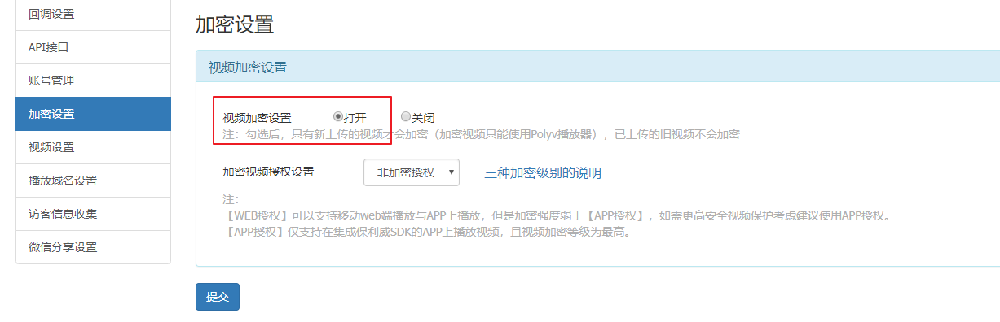

# 视频播放

项目中有两种视频：收费视频[需要加密]和免费视频

## 使用保利威云视频服务来对视频进行加密

官方网址: http://www.polyv.net/vod/

注意：

>  开发时通过`免费试用`注册**体验版**账号【测试账号的测试有效期是一周】
>
> 公司使用**酷播尊享版**


开发文档地址: http://dev.polyv.net/2017/videoproduct/v-playerapi/html5player/html5-docs/

要开发播放保利威的加密视频功能,需要在用户中心->设置->API接口和加密设置.

http://my.polyv.net/secure/setting/api


配置视频上传加密.



上传视频并记录视频的VID


## 后端获取保利威的视频播放授权token,提供接口api给前端

参考文档:http://dev.polyv.net/2019/videoproduct/v-api/v-api-play/create-playsafe-token/


根据官方文档的案例,已经有其他人开源了,针对polvy的token生成的python版本了,我们可以直接拿来使用.

在libs下创建polyv.py,编写token生成工具函数

```python
from django.conf import settings
import time
import requests
import hashlib

class PolyvPlayer(object):
    def __init__(self,userId,secretkey,tokenUrl):
        """初始化，提供用户id和秘钥"""
        self.userId = userId
        self.secretKey = secretkey
        self.tokenUrl = tokenUrl

    def tomd5(self, value):
        """取md5值"""
        return hashlib.md5(value.encode()).hexdigest()

    # 获取视频数据的token
    def get_video_token(self, videoId, viewerIp, viewerId=None, viewerName='', extraParams='HTML5'):
        """
        :param videoId: 视频id
        :param viewerId: 看视频用户id
        :param viewerIp: 看视频用户ip
        :param viewerName: 看视频用户昵称
        :param extraParams: 扩展参数
        :param sign: 加密的sign
        :return: 返回点播的视频的token
        """
        ts = int(time.time() * 1000)  # 时间戳
        plain = {
            "userId": self.userId,
            'videoId': videoId,
            'ts': ts,
            'viewerId': viewerId,
            'viewerIp': viewerIp,
            'viewerName': viewerName,
            'extraParams': extraParams
        }

        # 按照ASCKII升序 key + value + key + value... + value 拼接
        plain_sorted = {}
        key_temp = sorted(plain)
        for key in key_temp:
            plain_sorted[key] = plain[key]
        print(plain_sorted)

        plain_string = ''
        for k, v in plain_sorted.items():
            plain_string += str(k) + str(v)
        print(plain_string)

        # 首尾拼接上秘钥
        sign_data = self.secretKey + plain_string + self.secretKey

        # 取sign_data的md5的大写
        sign = self.tomd5(sign_data).upper()

        # 新的带有sign的字典
        plain.update({'sign': sign})
        # python 提供的发送http请求的模块
        result = requests.post(
            url=self.tokenUrl,
            headers={"Content-type": "application/x-www-form-urlencoded"},
            data=plain
        ).json()
        token = {} if isinstance(result, str) else result.get("data", {})

        return token
```


配置文件settings/dev.py，代码：

```python
# 保利威视频加密服务
POLYV_CONFIG = {
    "userId":"62dc475e3f",
    "secretkey":"h6FiaEBRMU",
    "tokenUrl":"https://hls.videocc.net/service/v1/token",
}
```


courses/views.py，视图代码:

```python
from luffyapi.libs.polyv import PolyvPlayer
from django.conf import settings
from rest_framework.views import APIView
from rest_framework.response import Response
from rest_framework.permissions import IsAuthenticated
class PolyvAPIView(APIView):
    permission_classes = [IsAuthenticated]
    def get(self, request):
        """获取保利威云视频加密播放的token"""
        """接受客户端的请求参数"""
        vid = request.query_params.get("vid")  # 视频播放ID
        remote_addr = request.META.get("REMOTE_ADDR")  # 用户的IP
        user_id = request.user.id      # 用户ID
        user_name = request.user.username  # 用户名
        polyv = PolyvPlayer(
            settings.POLYV_CONFIG["userId"],
            settings.POLYV_CONFIG["secretkey"],
            settings.POLYV_CONFIG["tokenUrl"],
        )

        data = polyv.get_video_token(vid,remote_addr,user_id,user_name)

        return Response(data)
```


courses/urls.py，路由代码：

```python
path(r"polyv/token/",views.PolyvAPIView.as_view()),
```


## 客户端请求token并播放视频

在 vue项目的入口文件index.html 中加载保利威视频播放器的js核心类库

```html
<script src='https://player.polyv.net/script/polyvplayer.min.js'></script>
```


创建视频播放页面的组件Player.vue，代码：

```vue
<template>
    <div class="player">
      <div id="player"></div>
    </div>
</template>

<script>
export default {
  name:"Player",
  data () {
    return {

    }
  },
  methods: {

  },
  computed: {
  }
}
</script>

<style scoped>
</style>
```

前端路由，代码：

```javascript
      {
       name:"Player",
       path:"/player",
       component: Player,
     },
```

引入保利威前端HTML5视频播放器代码，Player.vue：

```vue
<template>
    <div class="player">
      <div id="player"></div>
    </div>
</template>

<script>
export default {
  name:"Player",
  data () {
    return {

    }
  },
  methods: {
      check_login(){
        // 检查当前访问者是否登录了！
        let token = localStorage.user_token || sessionStorage.user_token;
        if( !token ){
          this.$alert("对不起，您尚未登录，请登录以后再进行购物车").then(()=>{
            this.$router.push("/user/login");
          });
          return false; // 阻止代码往下执行
        }
        return token;
      },
  },
  mounted(){
    // 验证用户是否登录
    let token = this.check_login();
    let user_name = localStorage.user_name || sessionStorage.user_name;
    let _this = this;
    let vid = "d6f2d2d505673e0a75cef00f8d5284f6_d";
    var player = polyvObject('#player').videoPlayer({
        wrap: '#player',
        width: document.documentElement.clientWidth-260, // 页面宽度
        height: document.documentElement.clientHeight, // 页面高度
        forceH5: true,
        vid: vid,
        code: user_name, // 一般是用户昵称
        // 视频加密播放的配置
        playsafe: function (vid, next) { // 向后端发送请求获取加密的token
            _this.$axios.get(`${_this.$settings.Host}/course/polyv/token/`,{
              params:{
                vid: vid,
              },
              headers:{
                "Authorization":"jwt " + token,
              }
            }).then(function (response) {
                console.log(response);
                next(response.data.token);
            })

        }
    });
  },
  computed: {
  }

}
</script>

<style scoped>
</style>

```

#### 完善课程详情页的视频内容显示

```
1. 课程详情中有封面视频播放，所以我们需要在后端的课程模型中新增一个字段course_video
2. 在序列化器中返回的内容增加course_video
3. 在课程详情页组件中显示封面视频或者封面图片
```

课程详情中有封面视频播放，所以我们需要在后端的课程模型中新增一个字段course_video

courses/models.py，代码：

```python
class Course(BaseModel):
    """
    专题课程
    """
    course_type = (
        (0, '付费'),
        (1, 'VIP专享'),
        (2, '学位课程')
    )
    level_choices = (
        (0, '初级'),
        (1, '中级'),
        (2, '高级'),
    )
    status_choices = (
        (0, '上线'),
        (1, '下线'),
        (2, '预上线'),
    )
    name = models.CharField(max_length=128, verbose_name="课程名称")
    course_img = models.ImageField(upload_to="course", max_length=255, verbose_name="封面图片", blank=True, null=True)
    course_video = models.FileField(upload_to="course", max_length=255, verbose_name="封面视频", blank=True, null=True)
	  # ....
```

执行数据迁移，

```bash
python manage.py makemigrations
python manage.py migrate
```


在序列化器中返回的内容增加course_video

```python
class CourseRetrieveSerializer(serializers.ModelSerializer):
    # 课程详情的序列化器
    teacher = TeacherSerializer()
    class Meta:
        model = Course
        fields = ["id","name","course_img","course_video","students","lessons","pub_lessons","price","teacher","brief_text","level_name","active_time","discount_type","real_price",]

```

在课程详情页组件中显示封面视频或者封面图片

```vue
<template>
    <div class="detail">
      <Header/>
      <div class="main">
        <div class="course-info">
          <div class="wrap-left">
            <videoPlayer v-if="course_info.course_video" class="video-player vjs-custom-skin"
               ref="videoPlayer"
               :playsinline="true"
               :options="playerOptions"
               @play="onPlayerPlay($event)"
               @pause="onPlayerPause($event)">

            </videoPlayer>
            
          </div>
          <div class="wrap-right">
            <h3 class="course-name">{{course_info.name}}</h3>
            <p class="data">{{course_info.students}}人在学&nbsp;&nbsp;&nbsp;&nbsp;课程总时长：{{course_info.lessons}}课时/{{course_info.pub_lessons}}小时&nbsp;&nbsp;&nbsp;&nbsp;难度：{{course_info.level_name}}</p>
            <div v-if="course_info.active_time>0">
              <div class="sale-time">
                <p class="sale-type">{{course_info.discount_type}}</p>
                <p class="expire">距离结束：仅剩{{day}}天 {{hour}}小时 {{minute}}分 <span class="second">{{second}}</span> 秒</p>
              </div>
              <p class="course-price">
                <span>活动价</span>
                <span class="discount">¥{{course_info.real_price}}</span>
                <span class="original">¥{{course_info.price}}</span>
              </p>
            </div>
            <div v-else class="sale-time">
                <p class="sale-type">价格 <span class="original_price">¥{{course_info.price}}</span></p>
                <p class="expire"></p>
            </div>
            <div class="buy">
              <div class="buy-btn">
                <button class="buy-now">立即购买</button>
                <button class="free">免费试学</button>
              </div>
              <div class="add-cart" @click="add_cart(course_info.id)">加入购物车</div>
            </div>
          </div>
        </div>
        <div class="course-tab">
          <ul class="tab-list">
            <li :class="tabIndex==1?'active':''" @click="tabIndex=1">详情介绍</li>
            <li :class="tabIndex==2?'active':''" @click="tabIndex=2">课程章节 <span :class="tabIndex!=2?'free':''">(试学)</span></li>
            <li :class="tabIndex==3?'active':''" @click="tabIndex=3">用户评论 (42)</li>
            <li :class="tabIndex==4?'active':''" @click="tabIndex=4">常见问题</li>
          </ul>
        </div>
        <div class="course-content">
          <div class="course-tab-list">
            <div class="tab-item" v-if="tabIndex==1">
              <div class="course-brief" v-html="course_info.brief_text"></div>
            </div>
            <div class="tab-item" v-if="tabIndex==2">
              <div class="tab-item-title">
                <p class="chapter">课程章节</p>
                <p class="chapter-length">共{{course_chapters.length}}章 {{course_info.lessons}}个课时</p>
              </div>
              <div class="chapter-item" v-for="chapter in course_chapters">
                <p class="chapter-title">第{{chapter.chapter}}章·{{chapter.name}}</p>
                <ul class="lesson-list">
                  <li class="lesson-item" v-for="lesson in chapter.coursesections">
                    <p class="name"><span class="index">{{chapter.chapter}}-{{lesson.id}}</span> {{lesson.name}}<span class="free" v-if="lesson.free_trail">免费</span></p>
                    <p class="time">{{lesson.duration}} </p>
                    <button class="try" v-if="lesson.free_trail"><router-link :to="{path: '/player',query:{'vid':lesson.section_link}}">立即试学</router-link></button>
                    <button class="try" v-else>立即购买</button>
                  </li>
                </ul>
              </div>
            </div>
            <div class="tab-item" v-if="tabIndex==3">
              用户评论
            </div>
            <div class="tab-item" v-if="tabIndex==4">
              常见问题
            </div>
          </div>
          <div class="course-side">
             <div class="teacher-info">
               <h4 class="side-title"><span>授课老师</span></h4>
               <div class="teacher-content">
                 <div class="cont1">
                   
                   <div class="name">
                     <p class="teacher-name">{{course_info.teacher.name}} {{course_info.teacher.title}}</p>
                     <p class="teacher-title">{{course_info.teacher.signature}}</p>
                   </div>
                 </div>
                 <p class="narrative" >{{course_info.teacher.brief}}</p>
               </div>
             </div>
          </div>
        </div>
      </div>
      <Footer/>
    </div>
</template>

<script>
import Header from "./common/Header"
import Footer from "./common/Footer"

// 加载组件
import {videoPlayer} from 'vue-video-player';

export default {
    name: "Detail",
    data(){
      return {
        tabIndex:2,   // 当前选项卡显示的下标
        course_id: 0, // 当前课程信息的ID
        course_info: {
          teacher:{},
        }, // 课程信息
        course_chapters:[], // 课程的章节课时列表
        playerOptions: {
          playbackRates: [0.7, 1.0, 1.5, 2.0], // 播放速度
          autoplay: false, //如果true,则自动播放
          muted: false, // 默认情况下将会消除任何音频。
          loop: false, // 循环播放
          preload: 'auto',  // 建议浏览器在<video>加载元素后是否应该开始下载视频数据。auto浏览器选择最佳行为,立即开始加载视频（如果浏览器支持）
          language: 'zh-CN',
          aspectRatio: '16:9', // 将播放器置于流畅模式，并在计算播放器的动态大小时使用该值。值应该代表一个比例 - 用冒号分隔的两个数字（例如"16:9"或"4:3"）
          fluid: true, // 当true时，Video.js player将拥有流体大小。换句话说，它将按比例缩放以适应其容器。
          sources: [{ // 播放资源和资源格式
            type: "video/mp4",
            src: "" //你的视频地址（必填）
          }],
          poster: "", //视频封面图
          width: document.documentElement.clientWidth, // 默认视频全屏时的最大宽度
          notSupportedMessage: '此视频暂无法播放，请稍后再试', //允许覆盖Video.js无法播放媒体源时显示的默认信息。
        }
      }
    },
    computed:{
      day(){
        let day = parseInt( this.course_info.active_time/ (24*3600));
        if(day < 10){
          return '0'+day;
        }else{
          return day;
        }
      },
      hour(){
        let rest = parseInt( this.course_info.active_time % (24*3600) );
        let hours = parseInt(rest/3600);
        if(hours < 10){
          return '0'+hours;
        }else{
          return hours;
        }
      },
      minute(){
        let rest = parseInt( this.course_info.active_time % 3600 );
        let minute = parseInt(rest/60);
        if(minute < 10){
          return '0'+minute;
        }else{
          return minute;
        }
      },
      second(){
        let second = this.course_info.active_time % 60;
        if(second < 10){
          return '0'+second;
        }else{
          return second;
        }
      }
    },
    created(){
      this.get_course_id();
      this.get_course_data();
      this.get_chapter();
    },
    methods: {
      onPlayerPlay(event){
        // 当视频播放时，执行的方法
        alert("关闭广告")
      },
      onPlayerPause(event){
        // 当视频暂停播放时，执行的方法
        alert("显示广告");
      },
      get_course_id(){
        // 获取地址栏上面的课程ID
        this.course_id = this.$route.params.course;
        if( this.course_id < 1 ){
          let _this = this;
          _this.$alert("对不起，当前视频不存在！","警告",{
            callback(){
              _this.$router.go(-1);
            }
          });
        }
      },
      get_course_data(){
        // ajax请求课程信息
        this.$axios.get(`${this.$settings.Host}/courses/${this.course_id}/`).then(response=>{
          // console.log(response.data);
          this.course_info = response.data;
          this.playerOptions.poster = response.data.course_img;
          // 在服务端中新增一个模型字段 course_video，如果有视频，则显示到播放器中，如果没有则显示一张封面图片
          if(response.data.course_video){
            // this.playerOptions.sources[0].src = "http://img.ksbbs.com/asset/Mon_1703/05cacb4e02f9d9e.mp4";
            this.playerOptions.sources[0].src = response.data.course_video;
          }

          // 在获取到剩余的活动时间以后，就要进入倒计时
          let timer = setInterval(()=>{
            if(this.course_info.active_time<1){
              clearInterval(timer);
            }else{
              --this.course_info.active_time;
            }
          },1000);

        }).catch(response=>{
          this.$message({
            message:"对不起，访问页面出错！请联系客服工作人员！"
          });
        })
      },

      get_chapter(){
        // 获取当前课程对应的章节课时信息
        this.$axios.get(`${this.$settings.Host}/courses/chapters/`,{
          params:{
            "course": this.course_id,
          }
        }).then(response=>{
          this.course_chapters = response.data;
        }).catch(error=>{
          console.log(error.response);
        })
      },
      add_cart(course_id){
        // 添加商品到购物车
        // 验证用户登录状态，如果登录了则可以添加商品到购物车，如果没有登录则跳转到登录界面，登录完成以后，才能添加商品到购物车
        let token = localStorage.token || sessionStorage.token;
        if( !token ){
          this.$confirm("对不起，您尚未登录，请登录以后再进行购物车").then(()=>{
            this.$router.push("/login/");
          });
          return false; // 阻止代码往下执行
        }

        // 添加商品到购物车，因为购物车接口必须用户是登录的，所以我们要在请求头中设置 jwttoken
        this.$axios.post(`${this.$settings.Host}/cart/`,{
          "course_id": course_id,
        },{
          headers:{
            "Authorization":"jwt " + token,
          }
        }).then(response=>{
          this.$message({
            message:response.data.message,
          });
          // 购物车中的商品数量
          let total = response.data.total;
          this.$store.commit("change_total",total)
        }).catch(error=>{
          this.$message({
            message:error.response.data
          })
        })
      }
    },
    components:{
      Header,
      Footer,
      videoPlayer, // 注册组件
    }
}
</script>

<style scoped>
.main{
  background: #fff;
  padding-top: 30px;
}
.course-info{
  width: 1200px;
  margin: 0 auto;
  overflow: hidden;
}
.wrap-left{
  float: left;
  width: 690px;
  height: 388px;
  background-color: #000;
}
.wrap-left .course_img{
  width: 100%;
  height: 100%;
}
.wrap-right{
  float: left;
  position: relative;
  height: 388px;
}
.course-name{
  font-size: 20px;
  color: #333;
  padding: 10px 23px;
  letter-spacing: .45px;
}
.data{
  padding-left: 23px;
  padding-right: 23px;
  padding-bottom: 16px;
  font-size: 14px;
  color: #9b9b9b;
}
.sale-time{
  width: 464px;
  background: #fa6240;
  font-size: 14px;
  color: #4a4a4a;
  padding: 10px 23px;
  overflow: hidden;
}
.sale-type {
  font-size: 16px;
  color: #fff;
  letter-spacing: .36px;
  float: left;
}
.sale-time .expire{
  font-size: 14px;
  color: #fff;
  float: right;
}
.sale-time .expire .second{
  width: 24px;
  display: inline-block;
  background: #fafafa;
  color: #5e5e5e;
  padding: 6px 0;
  text-align: center;
}
.course-price{
  background: #fff;
  font-size: 14px;
  color: #4a4a4a;
  padding: 5px 23px;
}
.discount{
  font-size: 26px;
  color: #fa6240;
  margin-left: 10px;
  display: inline-block;
  margin-bottom: -5px;
}
.original{
  font-size: 14px;
  color: #9b9b9b;
  margin-left: 10px;
  text-decoration: line-through;
}
.buy{
  width: 464px;
  padding: 0px 23px;
  position: absolute;
  left: 0;
  bottom: 20px;
  overflow: hidden;
}
.buy .buy-btn{
  float: left;
}
.buy .buy-now{
  width: 125px;
  height: 40px;
  border: 0;
  background: #ffc210;
  border-radius: 4px;
  color: #fff;
  cursor: pointer;
  margin-right: 15px;
  outline: none;
}
.buy .free{
  width: 125px;
  height: 40px;
  border-radius: 4px;
  cursor: pointer;
  margin-right: 15px;
  background: #fff;
  color: #ffc210;
  border: 1px solid #ffc210;
}
.add-cart{
  float: right;
  font-size: 14px;
  color: #ffc210;
  text-align: center;
  cursor: pointer;
  margin-top: 10px;
}
.add-cart img{
  width: 20px;
  height: 18px;
  margin-right: 7px;
  vertical-align: middle;
}

.course-tab{
    width: 100%;
    background: #fff;
    margin-bottom: 30px;
    box-shadow: 0 2px 4px 0 #f0f0f0;

}
.course-tab .tab-list{
    width: 1200px;
    margin: auto;
    color: #4a4a4a;
    overflow: hidden;
}
.tab-list li{
    float: left;
    margin-right: 15px;
    padding: 26px 20px 16px;
    font-size: 17px;
    cursor: pointer;
}
.tab-list .active{
    color: #ffc210;
    border-bottom: 2px solid #ffc210;
}
.tab-list .free{
    color: #fb7c55;
}
.course-content{
    width: 1200px;
    margin: 0 auto;
    background: #FAFAFA;
    overflow: hidden;
    padding-bottom: 40px;
}
.course-tab-list{
    width: 880px;
    height: auto;
    padding: 20px;
    background: #fff;
    float: left;
    box-sizing: border-box;
    overflow: hidden;
    position: relative;
    box-shadow: 0 2px 4px 0 #f0f0f0;
}
.tab-item{
    width: 880px;
    background: #fff;
    padding-bottom: 20px;
    box-shadow: 0 2px 4px 0 #f0f0f0;
}
.tab-item-title{
    justify-content: space-between;
    padding: 25px 20px 11px;
    border-radius: 4px;
    margin-bottom: 20px;
    border-bottom: 1px solid #333;
    border-bottom-color: rgba(51,51,51,.05);
    overflow: hidden;
}

.chapter{
    font-size: 17px;
    color: #4a4a4a;
    float: left;
}
.chapter-length{
    float: right;
    font-size: 14px;
    color: #9b9b9b;
    letter-spacing: .19px;
}
.chapter-title{
    font-size: 16px;
    color: #4a4a4a;
    letter-spacing: .26px;
    padding: 12px;
    background: #eee;
    border-radius: 2px;
    display: -ms-flexbox;
    display: flex;
    -ms-flex-align: center;
    align-items: center;
}
.chapter-title img{
    width: 18px;
    height: 18px;
    margin-right: 7px;
    vertical-align: middle;
}
.lesson-list{
    padding:0 20px;
}
.lesson-list .lesson-item{
    padding: 15px 20px 15px 36px;
    cursor: pointer;
    justify-content: space-between;
    position: relative;
    overflow: hidden;
}
.lesson-item .name{
    font-size: 14px;
    color: #666;
    float: left;
}
.lesson-item .index{
    margin-right: 5px;
}
.lesson-item .free{
    font-size: 12px;
    color: #fff;
    letter-spacing: .19px;
    background: #ffc210;
    border-radius: 100px;
    padding: 1px 9px;
    margin-left: 10px;
}
.lesson-item .time{
    font-size: 14px;
    color: #666;
    letter-spacing: .23px;
    opacity: 1;
    transition: all .15s ease-in-out;
    float: right;
}
.lesson-item .time img{
    width: 18px;
    height: 18px;
    margin-left: 15px;
    vertical-align: text-bottom;
}
.lesson-item .try{
    width: 86px;
    height: 28px;
    background: #ffc210;
    border-radius: 4px;
    font-size: 14px;
    color: #fff;
    position: absolute;
    right: 20px;
    top: 10px;
    opacity: 0;
    transition: all .2s ease-in-out;
    cursor: pointer;
    outline: none;
    border: none;
}
.lesson-item:hover{
    background: #fcf7ef;
    box-shadow: 0 0 0 0 #f3f3f3;
}
.lesson-item:hover .name{
    color: #333;
}
.lesson-item:hover .try{
    opacity: 1;
}

.course-side{
    width: 300px;
    height: auto;
    margin-left: 20px;
    float: right;
}
.teacher-info{
    background: #fff;
    margin-bottom: 20px;
    box-shadow: 0 2px 4px 0 #f0f0f0;
}
.side-title{
    font-weight: normal;
    font-size: 17px;
    color: #4a4a4a;
    padding: 18px 14px;
    border-bottom: 1px solid #333;
    border-bottom-color: rgba(51,51,51,.05);
}
.side-title span{
    display: inline-block;
    border-left: 2px solid #ffc210;
    padding-left: 12px;
}

.teacher-content{
    padding: 30px 20px;
    box-sizing: border-box;
}

.teacher-content .cont1{
    margin-bottom: 12px;
    overflow: hidden;
}

.teacher-content .cont1 img{
    width: 54px;
    height: 54px;
    margin-right: 12px;
    float: left;
}
.teacher-content .cont1 .name{
    float: right;
}
.teacher-content .cont1 .teacher-name{
    width: 188px;
    font-size: 16px;
    color: #4a4a4a;
    padding-bottom: 4px;
}
.teacher-content .cont1 .teacher-title{
    width: 188px;
    font-size: 13px;
    color: #9b9b9b;
    white-space: nowrap;
}
.teacher-content .narrative{
    font-size: 14px;
    color: #666;
    line-height: 24px;
}
</style>

```


#### 完善点击课程详情页的立即试学按钮跳转到视频播放页面，并发送视频的播放ID vid

在序列化器中，新增返回2个字段表示当前课时的类型和课时的视频/课件/练习题链接

```python
class CourseLessonSerializer(serializers.ModelSerializer):
    class Meta:
        model = CourseLesson
        fields = ["id","name","duration","free_trail","section_type","section_link"]
```


Detail.vue，代码：

课时章节：

```vue
<template>
    <div class="detail">
      <Header/>
      <div class="main">
        <div class="course-info">
          <div class="wrap-left">
            <videoPlayer v-if="course_info.course_video" class="video-player vjs-custom-skin"
               ref="videoPlayer"
               :playsinline="true"
               :options="playerOptions"
               @play="onPlayerPlay($event)"
               @pause="onPlayerPause($event)">

            </videoPlayer>
            
          </div>
          <div class="wrap-right">
            <h3 class="course-name">{{course_info.name}}</h3>
            <p class="data">{{course_info.students}}人在学&nbsp;&nbsp;&nbsp;&nbsp;课程总时长：{{course_info.lessons}}课时/{{course_info.pub_lessons}}小时&nbsp;&nbsp;&nbsp;&nbsp;难度：{{course_info.level_name}}</p>
            <div v-if="course_info.active_time>0">
              <div class="sale-time">
                <p class="sale-type">{{course_info.discount_type}}</p>
                <p class="expire">距离结束：仅剩{{day}}天 {{hour}}小时 {{minute}}分 <span class="second">{{second}}</span> 秒</p>
              </div>
              <p class="course-price">
                <span>活动价</span>
                <span class="discount">¥{{course_info.real_price}}</span>
                <span class="original">¥{{course_info.price}}</span>
              </p>
            </div>
            <div v-else class="sale-time">
                <p class="sale-type">价格 <span class="original_price">¥{{course_info.price}}</span></p>
                <p class="expire"></p>
            </div>
            <div class="buy">
              <div class="buy-btn">
                <button class="buy-now">立即购买</button>
                <button class="free">免费试学</button>
              </div>
              <div class="add-cart" @click="add_cart(course_info.id)">加入购物车</div>
            </div>
          </div>
        </div>
        <div class="course-tab">
          <ul class="tab-list">
            <li :class="tabIndex==1?'active':''" @click="tabIndex=1">详情介绍</li>
            <li :class="tabIndex==2?'active':''" @click="tabIndex=2">课程章节 <span :class="tabIndex!=2?'free':''">(试学)</span></li>
            <li :class="tabIndex==3?'active':''" @click="tabIndex=3">用户评论 (42)</li>
            <li :class="tabIndex==4?'active':''" @click="tabIndex=4">常见问题</li>
          </ul>
        </div>
        <div class="course-content">
          <div class="course-tab-list">
            <div class="tab-item" v-if="tabIndex==1">
              <div class="course-brief" v-html="course_info.brief_text"></div>
            </div>
            <div class="tab-item" v-if="tabIndex==2">
              <div class="tab-item-title">
                <p class="chapter">课程章节</p>
                <p class="chapter-length">共{{course_chapters.length}}章 {{course_info.lessons}}个课时</p>
              </div>
              <div class="chapter-item" v-for="chapter in course_chapters">
                <p class="chapter-title">第{{chapter.chapter}}章·{{chapter.name}}</p>
                <ul class="lesson-list">
                  <li class="lesson-item" v-for="lesson in chapter.coursesections">
                    <p class="name"><span class="index">{{chapter.chapter}}-{{lesson.id}}</span> {{lesson.name}}<span class="free" v-if="lesson.free_trail">免费</span></p>
                    <p class="time">{{lesson.duration}} </p>
                    <button class="try" v-if="lesson.free_trail">
                      <router-link v-if="lesson.section_type==0" :to="{path: '/document',query:{'vid':lesson.section_link}}">立即试学</router-link>
                      <router-link v-if="lesson.section_type==1" :to="{path: '/exam',query:{'vid':lesson.section_link}}">立即试学</router-link>
                      <router-link v-if="lesson.section_type==2" :to="{path: '/player',query:{'vid':lesson.section_link}}">立即试学</router-link>
                    </button>
                    <button class="try" v-else>立即购买</button>
                  </li>
                </ul>
              </div>
            </div>
            <div class="tab-item" v-if="tabIndex==3">
              用户评论
            </div>
            <div class="tab-item" v-if="tabIndex==4">
              常见问题
            </div>
          </div>
          <div class="course-side">
             <div class="teacher-info">
               <h4 class="side-title"><span>授课老师</span></h4>
               <div class="teacher-content">
                 <div class="cont1">
                   
                   <div class="name">
                     <p class="teacher-name">{{course_info.teacher.name}} {{course_info.teacher.title}}</p>
                     <p class="teacher-title">{{course_info.teacher.signature}}</p>
                   </div>
                 </div>
                 <p class="narrative" >{{course_info.teacher.brief}}</p>
               </div>
             </div>
          </div>
        </div>
      </div>
      <Footer/>
    </div>
</template>

<script>
import Header from "./common/Header"
import Footer from "./common/Footer"

// 加载组件
import {videoPlayer} from 'vue-video-player';

export default {
    name: "Detail",
    data(){
      return {
        tabIndex:2,   // 当前选项卡显示的下标
        course_id: 0, // 当前课程信息的ID
        course_info: {
          teacher:{},
        }, // 课程信息
        course_chapters:[], // 课程的章节课时列表
        playerOptions: {
          playbackRates: [0.7, 1.0, 1.5, 2.0], // 播放速度
          autoplay: false, //如果true,则自动播放
          muted: false, // 默认情况下将会消除任何音频。
          loop: false, // 循环播放
          preload: 'auto',  // 建议浏览器在<video>加载元素后是否应该开始下载视频数据。auto浏览器选择最佳行为,立即开始加载视频（如果浏览器支持）
          language: 'zh-CN',
          aspectRatio: '16:9', // 将播放器置于流畅模式，并在计算播放器的动态大小时使用该值。值应该代表一个比例 - 用冒号分隔的两个数字（例如"16:9"或"4:3"）
          fluid: true, // 当true时，Video.js player将拥有流体大小。换句话说，它将按比例缩放以适应其容器。
          sources: [{ // 播放资源和资源格式
            type: "video/mp4",
            src: "" //你的视频地址（必填）
          }],
          poster: "", //视频封面图
          width: document.documentElement.clientWidth, // 默认视频全屏时的最大宽度
          notSupportedMessage: '此视频暂无法播放，请稍后再试', //允许覆盖Video.js无法播放媒体源时显示的默认信息。
        }
      }
    },
    computed:{
      day(){
        let day = parseInt( this.course_info.active_time/ (24*3600));
        if(day < 10){
          return '0'+day;
        }else{
          return day;
        }
      },
      hour(){
        let rest = parseInt( this.course_info.active_time % (24*3600) );
        let hours = parseInt(rest/3600);
        if(hours < 10){
          return '0'+hours;
        }else{
          return hours;
        }
      },
      minute(){
        let rest = parseInt( this.course_info.active_time % 3600 );
        let minute = parseInt(rest/60);
        if(minute < 10){
          return '0'+minute;
        }else{
          return minute;
        }
      },
      second(){
        let second = this.course_info.active_time % 60;
        if(second < 10){
          return '0'+second;
        }else{
          return second;
        }
      }
    },
    created(){
      this.get_course_id();
      this.get_course_data();
      this.get_chapter();
    },
    methods: {
      onPlayerPlay(event){
        // 当视频播放时，执行的方法
        alert("关闭广告")
      },
      onPlayerPause(event){
        // 当视频暂停播放时，执行的方法
        alert("显示广告");
      },
      get_course_id(){
        // 获取地址栏上面的课程ID
        this.course_id = this.$route.params.course;
        if( this.course_id < 1 ){
          let _this = this;
          _this.$alert("对不起，当前视频不存在！","警告",{
            callback(){
              _this.$router.go(-1);
            }
          });
        }
      },
      get_course_data(){
        // ajax请求课程信息
        this.$axios.get(`${this.$settings.Host}/courses/${this.course_id}/`).then(response=>{
          // console.log(response.data);
          this.course_info = response.data;
          this.playerOptions.poster = response.data.course_img;
          // 在服务端中新增一个模型字段 course_video，如果有视频，则显示到播放器中，如果没有则显示一张封面图片
          if(response.data.course_video){
            // this.playerOptions.sources[0].src = "http://img.ksbbs.com/asset/Mon_1703/05cacb4e02f9d9e.mp4";
            this.playerOptions.sources[0].src = response.data.course_video;
          }

          // 在获取到剩余的活动时间以后，就要进入倒计时
          let timer = setInterval(()=>{
            if(this.course_info.active_time<1){
              clearInterval(timer);
            }else{
              --this.course_info.active_time;
            }
          },1000);

        }).catch(response=>{
          this.$message({
            message:"对不起，访问页面出错！请联系客服工作人员！"
          });
        })
      },

      get_chapter(){
        // 获取当前课程对应的章节课时信息
        this.$axios.get(`${this.$settings.Host}/courses/chapters/`,{
          params:{
            "course": this.course_id,
          }
        }).then(response=>{
          this.course_chapters = response.data;
        }).catch(error=>{
          console.log(error.response);
        })
      },
      add_cart(course_id){
        // 添加商品到购物车
        // 验证用户登录状态，如果登录了则可以添加商品到购物车，如果没有登录则跳转到登录界面，登录完成以后，才能添加商品到购物车
        let token = localStorage.token || sessionStorage.token;
        if( !token ){
          this.$confirm("对不起，您尚未登录，请登录以后再进行购物车").then(()=>{
            this.$router.push("/login/");
          });
          return false; // 阻止代码往下执行
        }

        // 添加商品到购物车，因为购物车接口必须用户是登录的，所以我们要在请求头中设置 jwttoken
        this.$axios.post(`${this.$settings.Host}/cart/`,{
          "course_id": course_id,
        },{
          headers:{
            "Authorization":"jwt " + token,
          }
        }).then(response=>{
          this.$message({
            message:response.data.message,
          });
          // 购物车中的商品数量
          let total = response.data.total;
          this.$store.commit("change_total",total)
        }).catch(error=>{
          this.$message({
            message:error.response.data
          })
        })
      }
    },
    components:{
      Header,
      Footer,
      videoPlayer, // 注册组件
    }
}
</script>
```


Player.vue，代码：

获取vid视频ID

```vue
<template>
    <div class="player">
      <div id="player"></div>
    </div>
</template>

<script>
export default {
  name:"Player",
  data () {
    return {

    }
  },
  methods: {
      check_login(){
        // 检查当前访问者是否登录了！
        let token = localStorage.token || sessionStorage.token;
        if( !token ){
          this.$alert("对不起，您尚未登录，请登录以后再进行购物车").then(()=>{
            this.$router.push("/login/");
          });
          return false; // 阻止代码往下执行
        }
        return token;
      },
  },
  mounted(){
    // 验证用户是否登录
    let token = this.check_login();
    let user_name = localStorage.user_name || sessionStorage.user_name;
    let _this = this;
    let vid = this.$route.query.vid;
    var player = polyvObject('#player').videoPlayer({
        wrap: '#player',
        width: document.documentElement.clientWidth-260, // 页面宽度
        height: document.documentElement.clientHeight, // 页面高度
        forceH5: true,
        vid: vid,
        code: user_name, // 一般是用户昵称
        // 视频加密播放的配置
        playsafe: function (vid, next) { // 向后端发送请求获取加密的token
            _this.$axios.get(`${_this.$settings.Host}/courses/polyv/token/`,{
              params:{
                vid: vid,
              },
              headers:{
                "Authorization":"jwt " + token,
              }
            }).then(function (response) {
                console.log(response);
                next(response.data.token);
            })

        }
    });
  },
  computed: {
  }

}
</script>

<style scoped>
</style>

```


## 完善API接口的身份认证

试学必须在用户登录以后才能进行，所以后端的tokenAPI接口必须保证用户登陆以后，我们已经完成了。

但是有些视频必须购买了以后才能播放！对于这种情况，在用户点击播放的时候，我们在后端返回token时，进行数据库查询，这个用户是否购买了课程，并且课程在有效期范围内！

```
作业！
```


