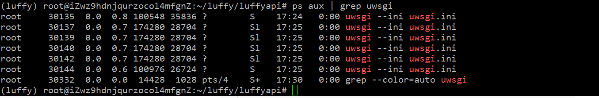
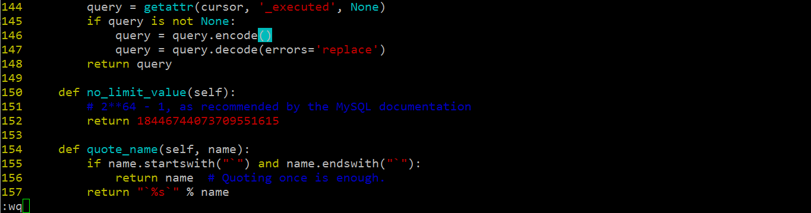

## 购买服务器

阿里云：http://www.aliyun.com/


完成了服务器购买以后，对于登录密码进行初始化。


重置完成以后，我们就可以通过一些ssh软件或者终端连接远方的Linux服务器。

注意：

​      windows的终端是没有ssh命名，如果要在windows下面远程连接服务器，有2种方式：

1.  安装xshell，putty
2.  通过git，git的命令工具窗口本身内置了linux的常用命令，里面就有ssh

```bash
ssh 登录用户@服务器公网地址

例如：ssh root@39.108.60.95
```


## 配置服务器的安全组


我们选择在原有的基础上开放 6379，8080，8000，3306

注意，6379可以选择不开放，如果开发，建议配置下密码。


加入安全组


接下来，我们可以就开始项目的部署


## 前端项目部署

之前我们的开发并没有把项目上传到码云上面，所以我们接下来我们先创建一个码云仓库。

```python
git add .
git commit -m "项目完成"
git push orgin dev:dev
# 注意：项目编译以后的文件，默认在vue项目是不会进行版本跟踪，所以需要在前端项目的.gitignore,中删除 /dist/

线上合并分支，把dev的内容合并到master里面
```


自动化程序会将打包的文件自动生成到项目的dist文件夹中。

```bash
npm run build
```

效果：


编译完成的内容会被保存在dist目录下，并且编译出来的项目，不能直接通过file://来访问，只能通过http服务器的运行这个项目。


因为根据我们上面的部署方案，我们需要安装nginx来运行这个前端项目。


#### 使用docker进行容器化管理进行持续集成部署

更新ubuntu的apt源索引

```shell
sudo apt-get update
```


安装包允许apt通过HTTPS使用仓库

```shell
sudo dpkg --configure -a
sudo apt-get install apt-transport-https ca-certificates curl software-properties-common
```


添加Docker官方GPG key【这个是国外服务器地址，所以网路不好的时候，会失败！在网路好的情况下，多执行几次就没问题了】

```shell
curl -fsSL https://download.docker.com/linux/ubuntu/gpg | sudo apt-key add -
```


设置Docker稳定版仓库

```shell
sudo add-apt-repository "deb [arch=amd64] https://download.docker.com/linux/ubuntu $(lsb_release -cs) stable"
```

添加仓库后，更新apt源索引

```shell
sudo apt-get update
```

前面的准备工作完成以后，接下来安装最新版Docker CE（社区版）

```shell
sudo apt-get install docker-ce
```

检查Docker CE是否安装正确

```shell
sudo docker run hello-world
```

出现了`helo from Docker`则表示上面的安装成功！


我们获取镜像文件，可以直接去官方网站上获取: https://hub.docker.com/


## 2. 启动与停止

安装完成Docker后，默认已经启动了docker服务，如需手动控制docker服务的启停，可执行如下命令

```shell
# 启动docker
sudo service docker start

# 停止docker
sudo service docker stop

# 重启docker
sudo service docker restart

# 列出镜像
docker image ls

# 拉取镜像
docker image pull library/hello-world

# 删除镜像
docker image rm 镜像id/镜像ID

# 创建容器
docker run [选项参数] 镜像名 [命令]

# 停止一个已经在运行的容器
docker container stop 容器名或容器id

# 启动一个已经停止的容器
docker container start 容器名或容器id

# kill掉一个已经在运行的容器
docker container kill 容器名或容器id

# 删除容器
docker container rm 容器名或容器id
```


#### 把前端项目通过nginx容器来运行

##### Nginx

Nginx是一款基于异步框架的轻量级/高性能的Web 服务器/反向代理服务器/缓存服务器/电子邮件(IMAP/POP3)代理服务器，并在一个BSD-like协议下发行。由俄罗斯的程序设计师Igor Sysoev(伊戈尔·赛索耶夫)所开发，最初供俄国大型网站Rambler.ru及搜寻引擎Rambler使用。

#### 下载安装 nginx

```python
# 在docker中下载nginx镜像
docker image pull nginx

# 使用git把码云上面的编译过的vue项目克隆到服务器/home
# 在本地终端通过以下命令上传编译后的项目文件
git add -f lufei_pc/dist

# 阿里云服务器中，已经内置了git，所以可以直接从码云克隆项目下来: /home/luffycity/lufei_pc
# git clone 项目git地址
git clone https://gitee.com/mooluo/luffycity.git

# 创建nginx容器，并以80端口对外提供服务
# /usr/share/nginx/html 是nginx在安装时，系统默认分配的网站项目的根目录
docker run -itd -p 80:80 -v /home/luffycity/lufei_pc/dist:/usr/share/nginx/html nginx
# 执行上面的命令，理论上来说，就可以让前端项目，可以阿里云的IP地址访问到了。
# 接下来我们进入到nginx的操作系统中，通过这个系统了解前端项目怎么运行的。

# 如果要进入nginx容器查看对应的内容，可以使用以下命令；
docker container exec -it [容器ID] bash

"""
/etc/nginx              # nginx容器中nginx的配置目录
/usr/share/nginx/html   # nginx容器中www目录
"""
```

docker run 选项：

-v 目录映射，把服务器中的真实目录，映射到 容器内部的指定目录，当容器内部操作指定目录时，则相当于操作服务器里面的真实目录

-p 端口映射，把服务器中的真实端口，映射到 容器内部的执行端口，当用户访问/操作真实端口时，则相当于访问/操作容器里面的端口

上面部署命令之后，我们就可以通过IP来访问项目了，但是我们项目一般通过域名提供给用户来进行访问的

把IP和域名的映射关联到阿里云服务器上面来。

```python
前端域名：http://3w.lxh1.com
服务器的公网IP： 120.77.220.233
```


我们现在可以解析域名到服务器了，但是如果有多个域名同时都指向这个服务器，则所有的域名都会访问到同一个项目中，所有我们把不同的域名和不同的项目目录进行配置绑定。

这里就需要手动配置nginx的配置了。

```bash
# 进入nginx容器，修改/etc/nginx/conf.d/default.conf文件
# 要在容器里面编辑文件，可以通过 apt-get update 和 apt install vim 来安装一个编辑器。
docker container exec -it <容器名称/容器ID> bash
vim /etc/nginx/conf.d/default.conf
# 修改 server_name 对应的路径
server{
  listen   80;
  server_name  3w.lxh1.com;
  
  # ...
}

# 按Esc键
# 输入 :wq 保存文件

# 重启nginx
nginx -s reload
```


## 后端项目部署

根据我们之前分析的项目部署架构，后端需要需要mysql和redis。所有再此我们需要先把这些外部工具先预装。

#### 安装mysql镜像

之前我们就已经下载了mysql镜像了。是5.7版本的。

```python
# 如果之前的mysql已经镜像没有下载，则下载命令如下：
docker image pull mysql:5.7
# 启动mysql容器，MYSQL_ROOT_PASSWORD 指代的就是mysql的root用户的登录密码
docker container run -itd -p3306:3306 -e MYSQL_ROOT_PASSWORD=123456 mysql:5.7
# 如果需要多台mysql容器安装在一台服务器中，那么容器内部的端口可以不用设置，但是真实物理系统的端口必须要修改，保证端口唯一！
# docker container run -itd -p3307:3306 -e MYSQL_ROOT_PASSWORD=123456 mysql:5.7
# docker container run -itd -p3308:3306 -e MYSQL_ROOT_PASSWORD=123456 mysql:5.7


# 我们可以在任意一个外部网路中，远程链接到数据库中
# 注意使用命令远程链接mysql，必须使用的地方有mysql
mysql -hIP -P端口 -uroot -p密码
# mysql -uroot -p123456 -h120.77.220.233
```

docker container run的选项：

-e 就是设置容器内部的环境变量， 在docker容器的使用过程中， 有部分容器需要配置环境的，这些环境变量都是有下载镜像时官方指定的。


#### 把本地的数据导入到容器的mysql数据库中

```python
# 远程链接数据库
mysql -uroot -pluffy -h112.72.164.31
# 创建数据库
create database luffy charset=utf8;
exit
# 把本地的数据库导出到桌面
sudo mysqldump -uroot -p456 luffy > ~/Desktop/luffycity/luffyapi/docs/luffy.sql

# 把桌面下到处的数据库文件导入到容器中的mysql数据库
mysql -uroot -p123456 -h120.77.220.233 luffy <  ~/Desktop/luffycity/luffyapi/docs/luffy.sql
```


#### 安装redis容器

```python
# 因此我们需要在docker中下载redis和mysql的容器
docker pull redis

# 创建redis容器并运行redis
docker container run -itd -p6379:6379 redis
    
# 可以进入到容器中，进行测试redis是否已经成功启动
docker container exec -it <容器名称/容器ID> bash

# 容器内部，执行 redis-cli
```


### 后端项目部署到docker容器中

#### 把后端项目进行部署前的处理

```python
1. 现在的配置，保存在dev.py中，不管数据库密码或者redis的地址或者配置信息都是属于开发阶段，
   项目上线以后，肯定换成公司的。所以一定会修改，我们需要把dev.py的内容移动到prod.py中，
   并修改对应的配置信息

2. 在本地开发时，我们使用的框架运行在debug模式下的，但是项目上线时，会关闭debug，所以我们如果关闭了debug模式，则drf框架会不再提供静态文件的浏览服务，也就是之前xadmin，drf的接口页面的图片，样式或者js文件都不能访问到了。我们需要收集这些文件到外界，后面通过nginx来对外提供浏览服务


3. 原来的drf项目是运行在python内置的提供的web服务器中，wsgiref
   在项目上线的时候，我们不能使用这个模块来提供对外服务!
   不支持多线程，性能不好，本身在安全性上并不完善，python提供这个模块仅供学习和开发测试使用。
   runserver 不能用于生产,改成uwsgi

4. 原来drf项目在本地开发时，其实要运行这个项目，我们是安装了很多的以来模块。
   将来项目上线了，我们也肯定需要把本地的模块同步到线上服务器！否则项目跑不起来
```


#### 修改现有的配置文件

在项目中复制开发配置文件dev.py 到生产配置prod.py

修改配置中的地址。

```python
"""
Django settings for luffyapi project.

Generated by 'django-admin startproject' using Django 2.2.4.

For more information on this file, see
https://docs.djangoproject.com/en/2.2/topics/settings/

For the full list of settings and their values, see
https://docs.djangoproject.com/en/2.2/ref/settings/
"""

import os
import sys

# Build paths inside the project like this: os.path.join(BASE_DIR, ...)
BASE_DIR = os.path.dirname(os.path.dirname(os.path.abspath(__file__)))
# 让apps设置为系统导包路径
sys.path.insert(0, os.path.join(BASE_DIR,"apps") )

# Quick-start development settings - unsuitable for production
# See https://docs.djangoproject.com/en/2.2/howto/deployment/checklist/

# SECURITY WARNING: keep the secret key used in production secret!
SECRET_KEY = '^icygi456=_n^0z6t5h8^mo857yylwu=@qt9dupqucc89@#&xd'

# SECURITY WARNING: don't run with debug turned on in production!
DEBUG = False

ALLOWED_HOSTS = [
    "3w.lxh1.com",
    "shop.lxh1.com",
    "127.0.0.1",
    "120.77.220.233",
]


# Application definition

INSTALLED_APPS = [
    'django.contrib.admin',
    'django.contrib.auth',
    'django.contrib.contenttypes',
    'django.contrib.sessions',
    'django.contrib.messages',
    'django.contrib.staticfiles',

    'corsheaders',
    'rest_framework',
    'xadmin',
    'crispy_forms',
    'reversion',
    'django_filters',  # 需要注册应用，
    'ckeditor',  # 富文本编辑器
    'ckeditor_uploader',  # 富文本编辑器上传图片模块

    'home',
    'users',
    'courses',
    'cart',
    'orders',
    'coupon',
    'payments',
]

# CORS跨域资源共享的配置信息
CORS_ORIGIN_WHITELIST = (
    'http://3w.lxh1.com',
)

CORS_ALLOW_CREDENTIALS = False  # 允许ajax跨域请求时携带cookie

MIDDLEWARE = [
    'corsheaders.middleware.CorsMiddleware',
    'django.middleware.security.SecurityMiddleware',
    'django.contrib.sessions.middleware.SessionMiddleware',
    'django.middleware.common.CommonMiddleware',
    'django.middleware.csrf.CsrfViewMiddleware',
    'django.contrib.auth.middleware.AuthenticationMiddleware',
    'django.contrib.messages.middleware.MessageMiddleware',
    'django.middleware.clickjacking.XFrameOptionsMiddleware',
]

ROOT_URLCONF = 'luffyapi.urls'

TEMPLATES = [
    {
        'BACKEND': 'django.template.backends.django.DjangoTemplates',
        'DIRS': [],
        'APP_DIRS': True,
        'OPTIONS': {
            'context_processors': [
                'django.template.context_processors.debug',
                'django.template.context_processors.request',
                'django.contrib.auth.context_processors.auth',
                'django.contrib.messages.context_processors.messages',
            ],
        },
    },
]

WSGI_APPLICATION = 'luffyapi.wsgi.application'


# Database
# https://docs.djangoproject.com/en/2.2/ref/settings/#databases

DATABASES = {
    # 'default': {
    #     'ENGINE': 'django.db.backends.sqlite3',
    #     'NAME': os.path.join(BASE_DIR, 'db.sqlite3'),
    # },

    "default": {
        "ENGINE": "django.db.backends.mysql",
        "HOST": "127.0.0.1",
        "PORT": 3306,
        "USER": "root",
        "PASSWORD": "123456",
        "NAME": "luffy",
    }
}


# 设置redis缓存
CACHES = {
    # 默认缓存
    "default": {
        "BACKEND": "django_redis.cache.RedisCache",
        # 项目上线时,需要调整这里的路径
        "LOCATION": "redis://127.0.0.1:6379/0",
        "OPTIONS": {
            "CLIENT_CLASS": "django_redis.client.DefaultClient",
        }
    },
    # 提供给xadmin或者admin的session存储
    "session": {
        "BACKEND": "django_redis.cache.RedisCache",
        "LOCATION": "redis://127.0.0.1:6379/1",
        "OPTIONS": {
            "CLIENT_CLASS": "django_redis.client.DefaultClient",
        }
    },
    # 提供存储短信验证码
    "sms_code":{
        "BACKEND": "django_redis.cache.RedisCache",
        "LOCATION": "redis://127.0.0.1:6379/2",
        "OPTIONS": {
            "CLIENT_CLASS": "django_redis.client.DefaultClient",
        }
    },
    # 购物车信息
    "cart":{
        "BACKEND": "django_redis.cache.RedisCache",
        "LOCATION": "redis://127.0.0.1:6379/3",
        "OPTIONS": {
            "CLIENT_CLASS": "django_redis.client.DefaultClient",
        }
    }
}

# 设置xadmin用户登录时,登录信息session保存到redis
SESSION_ENGINE = "django.contrib.sessions.backends.cache"
SESSION_CACHE_ALIAS = "session"


# Password validation
# https://docs.djangoproject.com/en/2.2/ref/settings/#auth-password-validators

AUTH_PASSWORD_VALIDATORS = [
    {
        'NAME': 'django.contrib.auth.password_validation.UserAttributeSimilarityValidator',
    },
    {
        'NAME': 'django.contrib.auth.password_validation.MinimumLengthValidator',
    },
    {
        'NAME': 'django.contrib.auth.password_validation.CommonPasswordValidator',
    },
    {
        'NAME': 'django.contrib.auth.password_validation.NumericPasswordValidator',
    },
]


# Internationalization
# https://docs.djangoproject.com/en/2.2/topics/i18n/

LANGUAGE_CODE = 'zh-Hans'

TIME_ZONE = 'Asia/Shanghai'

USE_I18N = True

USE_L10N = True

USE_TZ = False


# Static files (CSS, JavaScript, Images)
# https://docs.djangoproject.com/en/2.2/howto/static-files/

# 访问静态文件的url地址前缀
STATIC_URL = '/static/'
# 设置django的静态文件目录
STATICFILES_DIRS = [
    os.path.join(BASE_DIR,"statics")
]

# 项目中存储上传文件的根目录[暂时配置]，注意，static目录需要手动创建否则上传文件时报错
MEDIA_ROOT=os.path.join(BASE_DIR,"statics")
# 访问上传文件的url地址前缀
MEDIA_URL ="/media/"

# 日志配置
LOGGING = {
    'version': 1,
    'disable_existing_loggers': False,
    # 日志记录的错误格式
    'formatters': {
        # 详细
        'verbose': {
            'format': '%(levelname)s %(asctime)s %(module)s %(lineno)d %(message)s'
        },
        # 简单
        'simple': {
            'format': '%(levelname)s %(module)s %(lineno)d %(message)s'
        },
    },
    'filters': {
        'require_debug_true': {
            '()': 'django.utils.log.RequireDebugTrue',
        },
    },
    # 日志的处理方式
    'handlers': {
        'console': {
            'level': 'DEBUG',
            'filters': ['require_debug_true'],
            'class': 'logging.StreamHandler',
            'formatter': 'simple'
        },
        'file': {
            'level': 'INFO',
            'class': 'logging.handlers.RotatingFileHandler',
            # 日志位置,日志文件名,日志保存目录必须手动创建
            'filename': os.path.join(os.path.dirname(BASE_DIR), "logs/luffy.log"),
            # 日志文件的最大值,这里我们设置300M
            'maxBytes': 300 * 1024 * 1024,
            # 日志文件的数量,设置最大日志数量为10
            'backupCount': 10,
            # 日志格式:详细格式
            'formatter': 'verbose'
        },
    },
    # 日志对象
    'loggers': {
        'django': {
            'handlers': ['console', 'file'],
            'propagate': True,  # 是否让日志信息继续冒泡给其他的日志处理系统
        },
    }
}

# rest_framework配置
REST_FRAMEWORK = {
    # 自定义异常处理
    'EXCEPTION_HANDLER': 'luffyapi.utils.exceptions.custom_exception_handler',
    # 自定义用户认证方式
    'DEFAULT_AUTHENTICATION_CLASSES': (
        'rest_framework_jwt.authentication.JSONWebTokenAuthentication',
        'rest_framework.authentication.SessionAuthentication',
        'rest_framework.authentication.BasicAuthentication',
    ),
}

import datetime
# 设置jwt的格式
JWT_AUTH = {
    # 设置jwt的过期时间
    'JWT_EXPIRATION_DELTA': datetime.timedelta(days=1),
    # 设置jwt的返回内容
    'JWT_RESPONSE_PAYLOAD_HANDLER': 'users.utils.jwt_response_payload_handler'
}


# Auth认证模块采用自定义用户模型[这个配置只能在第一次数据迁移之前进行修改!!否则报错]
AUTH_USER_MODEL = 'users.User'  # 格式必须是"子应用目录名.模型类名"

AUTHENTICATION_BACKENDS = [
    'users.utils.UsernameMobileAuthBackend',
]

# 极验验证码配置[ Ctrl+shift+U,把选中内容中的字母转换成大小写 ]
PC_GEETEST_ID = "6e15c7e0b567734b8546325bbba57790"
PC_GEETEST_KEY = "db327ff2dc1abb8156ce212e7e0ff057"
PC_GEETEST_USER_ID = 'test'


# 短信验证码配置
SMS_ACCOUNTSID = "8a216da86c282c6a016c6126db3820db"
SMS_ACCOUNTTOKEN = "3b497397a7614721af8848e90d293ac4"
SMS_APPID = "8a216da86c282c6a016c6126db9220e2"
SMS_SERVERIP = "sandboxapp.cloopen.com"
SMS_EXPIRE_TIME = 300
SMS_INTERVAL_TIME = 60
SMS_TEIMPLATE_ID = 1


# 富文本编辑器ckeditor配置
CKEDITOR_CONFIGS = {
    'default': {
        'toolbar': 'full',  # 工具条功能,full表示全部工具
        'height': 300,      # 编辑器高度[单位:px]
        # 'width': 300,     # 编辑器宽度[一般不设置]
    },
}

# CKEDITOR_CONFIGS = {
#     'default': {
#         'toolbar': 'Custom',
#         'toolbar_Custom': [
#             ['Bold', 'Italic', 'Underline'],
#             ['NumberedList', 'BulletedList', '-', 'Outdent', 'Indent', '-', 'JustifyLeft', 'JustifyCenter', 'JustifyRight', 'JustifyBlock'],
#             ['Link', 'Unlink'],
#             ['RemoveFormat', 'Source']
#         ]
#     }
# }

CKEDITOR_UPLOAD_PATH = ''  # 上传图片保存路径，留空则调用django的文件上传功能
CKEDITOR_UPLOAD_URL = "http://shop.lxh1.com"
DOMAIL_IMAGE_URL =  "http://shop.lxh1.com"

# 课程列表页中，课时显示的数量
RECOMMEND_LESSON_SIZE = 4

# 积分和现金的兑换比例[兑换1元的积分数量]
CREDIT_MONEY = 10

# 支付宝配置信息
ALIAPY_CONFIG = {
    # "gateway_url": "https://openapi.alipay.com/gateway.do?", # 真实支付宝网关地址
    "gateway_url": "https://openapi.alipaydev.com/gateway.do?", # 沙箱支付宝网关地址
    "appid": "2016091600523592",
    "app_notify_url": None,
    "app_private_key_path": os.path.join(os.path.dirname(BASE_DIR), "luffyapi/apps/payments/key/app_private_key.pem"),
    "alipay_public_key_path": os.path.join(os.path.dirname(BASE_DIR), "luffyapi/apps/payments/key/alipay_public_key.pem"),
    "sign_type": "RSA2",
    "debug": False,
    "return_url": "http://3w.lxh1.com/pay/result",
    "notify_url": "http://shop.lxh1.com/pay/result",
}


# 设置订单超时超时的时间[单位: 秒]
ORDER_TIMEOUT = 12 * 60 * 60

# 保利威视频云存储服务
# 保利威视频加密服务
POLYV_CONFIG = {
    "userId": "7ec5719859",
    "secretkey": "1Vee0DNefR",
    "tokenUrl": "https://hls.videocc.net/service/v1/token",
}
```


#### 从服务端项目中收集静态文件

当Django运行在生产环境中，我们会关闭debug调试，那么项目将不再提供静态文件的支持，需要将静态文件交给静态文件的nginx服务器来提供访问。

我们先收集所有静态文件。项目中的静态文件除了我们使用的上传文件之外，django本身还有自己的静态文件，如rest_framework、xadmin、admin、ckeditor等。我们需要收集这些静态文件，集中一起放到静态文件服务器中。

**我们要将收集的静态文件放到项目的static目录中，所以先创建目录static。**

Django提供了收集静态文件的方法。先在配置文件中配置收集之后存放的目录

settings/prod.py ，代码：

```python
STATIC_ROOT = os.path.join(os.path.dirname(BASE_DIR), 'static')
```

因为目前在本地我们依然使用了dev.py文件运行项目，所以我们在本地项目收集静态文件就需要把配置信息同步到dev.py


在终端下执行收集命令

```shell
python manage.py collectstatic
```

执行收集命令以后，效果如下：


收集完成静态资源以后,我们就使用git提交并上传到码云,回头可以通过到真实服务器上面,

```
# 本地电脑
cd ~/Desktop/luffy
git add .
git commit -m "收集静态资源"
git push

# 真实服务器拉去静态资源
git pull
```


#### django的程序通常使用uwsgi服务器来运行

修改luffyapi/wsgi.py文件

```python
os.environ.setdefault('DJANGO_SETTINGS_MODULE', 'luffy.settings.prop')
```

我们可以在本地环境中先安装uwsgi模块进行使用，然后成功使用uwsgi启动项目，后面再一并上传到服务器即可。

```python
pip install uwsgi
uwsgi --version    # 查看 uwsgi 版本
```


在项目根目录下创建uwsgi配置文件uwsgi.ini

```ini
[uwsgi]
#使用nginx连接时使用，Django程序所在服务器地址
socket=127.0.0.1:8000
#直接做web服务器使用，Django程序所在服务器地址
#http=127.0.0.1:8000
#项目目录
chdir=/home/moluo/luffycity
#项目中wsgi.py文件的目录，相对于项目目录
wsgi-file=luffycity/wsgi.py
# 进程数
processes=4
# 线程数
threads=2
# uwsgi服务器的角色
master=True
# 存放进程编号的文件
pidfile=uwsgi.pid
# 日志文件，因为uwsgi可以脱离终端在后台运行，日志看不见。我们以前的runserver是依赖终端的
daemonize=uwsgi.log
# 指定依赖的虚拟环境
virtualenv=/home/moluo/.virtualenvs/luffy
```

启动uwsgi服务器，必须在uwsgi.ini配置文件所在的目录中运行下面的命令

注意，在本地环境中必须先把runserver关闭

```shell
uwsgi --ini uwsgi.ini
```

停止uwsgi服务器，还可以通过使用kill命令停止

```
uwsgi --stop uwsgi.pid
```

访问项目【注意，因为prod.py配置文件中，设置了访问当前服务端项目的地址是shop.lxh1.com，所以我们如果直接通过127.0.0.1访问,则会报400参数错误,所以我们需要配置下prod.py的ALLOWED_HOSTS中加上127.0.0.1或者在本地电脑中配置一下域名映射 /etc/hosts，把shop.lxh1.com追加上去,并通过shop.lxh1.com访问】：


#### 把django项目上传部署到服务器并使用uwsgi服务器运行

1. 在本地电脑中导出当前虚拟环境中的模块包列表

   ```
   cd ~/Desktop/luffy/luffyapi/docs/
   pip freeze > requirements.txt
   ```

2. 把本地更改的内容通过git提交到码云

   ```bash
   git add .
   git commit -m "导出api项目运行依赖的模块包列表到docs目录下"
   ```

   

3. 在服务器中使用git拉取最新的项目内容。

   ```bash
   cd /home/luffycity/
   git pull
   ```

   

4. 创建一个新容器，使用ubuntu镜像。

```python
# 创建接下来运行django项目的容器
# 因为我们的api项目已经上传到了真实服务器中,所以我们执行映射api项目的文件到容器中/home/luffycity目录下
docker container run -itd -p 8000:8000  -p3306:3306 -v /home/luffycity/luffyapi:/home/luffycity ubuntu
# 进入容器
docker container exec -it <容器名/容器ID> bash
# 更新镜像源[如果有时间，可以修改这个容器的镜像源]
apt-get update
# 安装基本软件和命令
apt-get install vim
# 检车当前容器中的python版本,如果没有python3则安装python3
```


5. 在容器安装python的虚拟环境

```python
# 虽然云服务器上面内置了python3,但是没有内置pip工具，所以要安装python3的pip工具
apt install python3-pip

# 使用pip安装虚拟环境
pip3 install virtualenv -i https://pypi.douban.com/simple/
pip3 install virtualenvwrapper  -i https://pypi.douban.com/simple/

# 配置虚拟环境的环境变量
# 执行命令
mkdir $HOME/.virtualenvs

# 执行命令，打开并编辑 ~/.bashrc
vim  ~/.bashrc

# 文件末尾添加以下几行代码，:wq 保存退出。
export WORKON_HOME=$HOME/.virtualenvs
export VIRTUALENVWRAPPER_PYTHON=/usr/bin/python3
source /usr/local/bin/virtualenvwrapper.sh

# 刷新配置文件
source ~/.bashrc

# 创建虚拟环境
mkvirtualenv luffy -p python3
```


1. 把本地虚拟环境中导出模块包列表，在线上服务器重新安装

```bash
# 在容器中同步之前的个人开发环境中安装包列表到当前虚拟环境中 requirements.txt
cd /home/luffycity/docs
pip install -r requirements.txt -i https://pypi.douban.com/simple/

# 项目中有些包是之前使用下载包方式安装的，则这里需要我们手动安装
# 例如：xadmin
pip install https://codeload.github.com/sshwsfc/xadmin/zip/django2 -i https://pypi.douban.com/simple/

# 安装完成这些手动安装的包以后，我们再次执行上面的命令
pip install -r requirements.txt -i https://pypi.douban.com/simple
```


6. 在容器中启动uwsgi，通过使用uwsgi作为http服务器先，后面在使用nginx来代理。

   在本地pycharm中修改一下uwsgi.ini配置文件，并通过git上传到真实服务器目录下

   ```python
   [uwsgi]
   #使用nginx连接时使用，Django程序所在服务器地址
   # socket=127.0.0.1:8000
   #直接做web服务器使用，Django程序所在服务器地址
   http=0.0.0.0:8000
   #项目目录
   chdir=/home/luffycity
   #项目中wsgi.py文件的目录，相对于项目目录
   wsgi-file=luffyapi/wsgi.py
   # 进程数
   processes=4
   # 线程数
   threads=2
   # uwsgi服务器的角色
   master=True
   # 存放进程编号的文件
   pidfile=uwsgi.pid
   # 日志文件，因为uwsgi可以脱离终端在后台运行，日志看不见。我们以前的runserver是依赖终端的
   daemonize=uwsgi.log
   # 指定依赖的虚拟环境
   virtualenv=/root/.virtualenvs/luffy
   ```

   在本地通过git上传

   ```python
   git add .
   git commit -m "根据真实服务器中容器的路径修改uwsgi的配置文件uwsgi.ini"
   git push
   ```

   在真实服务器中，拉取

   ```python
   cd /home/luffycity/
   git pull
   ```

   

   进入api项目的容器中，启动uwsgi，命令:

   ```python
   cd /home/luffyapi/
   # 经过上面的步骤，我们直接切到uwsgi.ini所在目录下，运行项目
   # 注意，必须先进入虚拟环境中， workon luffy，才能运行
   uwsgi --ini uwsgi.ini
   # 运行过程中， 如果报错了，则直接查看uwsgi.log
   ```

   运行命令查看uwsgi是否启动了：

   ```
   ps aux | grep uwsgi
   ```

   效果：



可以看到uwsgi已经启动了，但是我们通过浏览器`http://shop.lxh1.com:8000`访问发现，访问不了。


很明显uwsgi已经启动了，为什么不能访问？我们可以uwsgi的运行日志来查看！

```bash
vim ~/luffy/luffyapi/uwsgi.log
```


上面错误日志显示，pymysql的mysql-client版本监测，所以我们根据提示修改！

```
解决：
注释掉，报错文件的36行客户端版本监测功能！

vim /root/.virtualenvs/luffy/lib/python3.6/site-packages/django/db/backends/mysql/base.py
```


```python
注意：
1. vim中编辑保存如果不成功！，则在调用vim前面加上sudo
2. vim中如果要显示文件行号，使用 :set nu
```


修改完成以后，重启uwsgi。还是访问不了。查看日志，可以发现：


修改报错位置，保存文件：



经过上面的错误u修改以后，修改就可以访问到了。

```python
如果再次启动uwsgi成功，但是还是无法访问页面，而是出现服务器内部错误的信息，则在logs/luffy.log或者uwsgi.log中查看错误信息。
```


## 使用nginx对uwsgi进行反向代理

接下来，我们要使用nginx对uwsgi进行反向代理，我们直接在服务端安装一个nginx容器。

```bash
docker run -itd -p 8080:80 nginx
# 接下来进入到容器内部，安装vim编辑 /etc/nginx/conf.d/default.conf配置文件
docker container exec -it <容器名/容器ID> bash
apt-get update
apt install vim
vim /etc/nginx/conf.d/default.conf
```


vim修改Nginx配置文件，让Nginx接收到请求后转发给uwsgi服务器

```python
     upstream luffy {
         server 120.77.220.233:8000;
         # server 120.77.220.233:8001;
     }

     #gzip  on;
     server {
         listen  80;
         server_name shop.lxh1.com;

         location / {
             include uwsgi_params;
             uwsgi_pass luffy;
         }
     }
```

完成上面对应位置的配置信息修改以后，重启nginx

```bash
nginx -s reload
```


接下来，我们就需要把api服务端容器里面的uwsgi的运行模式改成socket模式。

```python
[uwsgi]
#使用nginx连接时使用，Django程序所在服务器地址
socket=0.0.0.0:8000
#直接做web服务器使用，Django程序所在服务器地址
# http=0.0.0.0:8000
#项目目录
chdir=/home/moluo/luffycity
#项目中wsgi.py文件的目录，相对于项目目录
wsgi-file=luffycity/wsgi.py
# 进程数
processes=4
# 线程数
threads=2
# uwsgi服务器的角色
master=True
# 存放进程编号的文件
pidfile=uwsgi.pid
# 日志文件，因为uwsgi可以脱离终端在后台运行，日志看不见。我们以前的runserver是依赖终端的
daemonize=uwsgi.log
# 指定依赖的虚拟环境
virtualenv=/home/moluo/.virtualenvs/luffy
```


## 针对后端服务器的运营站提供静态文件的访问支持

因为之前在前端项目部署的时候，已经有了一个nginx容器，所以我们接下来，就直接让前端的nginx容器同时提供静态文件的访问支持。

进入前端nginx容器并在nginx的配置文件default.conf里面的server部分中配置提供静态文件的访问！

先删除前端的vue项目的容器，然后再创建一个新的nginx容器，同时在创建的时候，我们进行目录映射。

前端项目要映射到容器，同时还要把api项目的static静态文件目录也要映射到该容器中。

```python
# 先把现有的前端nginx容器打包成镜像
docker commit  <容器名称/容器ID>  front

# 停止并删除前端nginx服务容器
docker container rm <容器ID>

# 基于上面的front镜像重新创建一个容器。
# 真实服务器下的客户端vue项目目录     /home/luffycity/lufei_pc/dist 
# 真实服务器下的服务端drf项目目录     /home/luffycity/luffyapi/statics
docker run -itd -p 80:80 -v /home/luffycity/lufei_pc/dist:/usr/share/nginx/html -v /home/luffycity/luffyapi/statics:/usr/share/nginx/static front
```

创建完容器以后，通过访问客户端url地址，没有问题以后，我们接下里就要在前端容器中编写nginx的配置文件，写上提供静态文件访问支持的配置信息.

```bash
# 因为端口冲突的问题，所以我们现在把前端容器和反向代理容器合并，也就是保留一个前端容器，删除掉反向代理。
docker container stop <反向代理容器id/反向代理容器名称>
docker container rm <反向代理容器id/反向代理容器名称>
在前端容器中添加反向反向代理的配置信息
apt-get install procps
vim /etc/nginx/conf.d/default.conf
```

配置文件default.conf，内容：

```python
upstream luffy {
    server 120.77.220.233:8000;
    # server 120.77.220.233:8001;
}

server {
    listen  80;
    server_name shop.lxh1.com;

    location / {
        include uwsgi_params;
        uwsgi_pass luffy;
    }
    
    location /static {
        root /usr/share/nginx;
    }
    
}


server {
    listen       80;
    server_name  3w.lxh1.com;

    #charset koi8-r;

    #access_log  logs/host.access.log  main;

    location / {
        root   /usr/share/nginx/html;
        index  index.html index.htm;
        try_files $uri $uri/ /index.html;
    }

    #error_page  404              /404.html;

    # redirect server error pages to the static page /50x.html
    #
    error_page   500 502 503 504  /50x.html;
    location = /50x.html {
        root   html;
    }

    # proxy the PHP scripts to Apache listening on 127.0.0.1:80
    #
    #location ~ \.php$ {
    #    proxy_pass   http://127.0.0.1;
    #}

    # pass the PHP scripts to FastCGI server listening on 127.0.0.1:9000
    #
    #location ~ \.php$ {
    #    root           html;
    #    fastcgi_pass   127.0.0.1:9000;
    #    fastcgi_index  index.php;
    #    fastcgi_param  SCRIPT_FILENAME  /scripts$fastcgi_script_name;
    #    include        fastcgi_params;
    #}

    # deny access to .htaccess files, if Apache's document root
    # concurs with nginx's one
    #
    #location ~ /\.ht {
    #    deny  all;
    #}
}

```


重启nginx，使用shop.lxh1.com访问运营后台，样式就正常了。

```bash
nginx -s reload
```

修复前端项目中的ajax请求地址错误问题。

settings.py，修改host地址，重新编译打包

```
export default {
  Host:"http://shop.lxh1.com"
}
```

```
npm run biuld
```

打包上传。注意：去掉忽略文件中dist/


解决vue项目上线以后，点击首页以为的其他页面刷新路径时，404报错。

在前端容器中，修改nginx的配置文件，在location中，修改如下：

```python
server {
    listen       80;
    server_name  3w.lxh1.com;

    #charset koi8-r;

    #access_log  logs/host.access.log  main;

    location / {
        root   /usr/share/nginx/html;
        index  index.html index.htm;
        try_files $uri $uri/ /index.html;
    }

```

重启nginx，重新访问。


