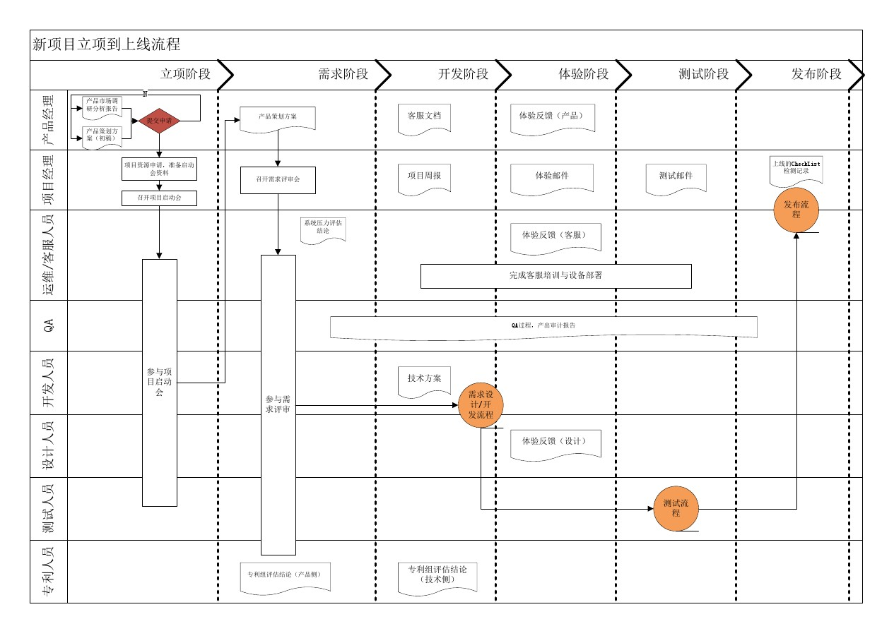

# 1. 项目开发基础概念

## 1.1 企业的web项目类型

1. 商城

   1.1 B2C  直销商城  商家与会员直接交易  ( Business To Customer )，路飞等。

   1.2 B2B  批发商城  商家与商家直接交易，阿里巴巴

   1.3 B2B2C   购物平台   商家和会员在另一个商家提供的平台上面进行交易，京东、天猫

   1.4 C2B   定制商城   会员向商家发起定制商品的需求，商家去完成，小米手机中就有个私人定制过程，它是发起投票，让大家对需求有一定的定制性，人数多的需求它就开发上，还有一些互联网+计划，定制农场之类的。

   1.5 O2O  线上线下交易平台：12306、美团、饿了么等   

   1.6 C2C   二手交易平台 ： 早起淘宝、闲鱼、人人车，产品不是这个网站自己的，是另外一个客户的

2. 门户网站[企业站和门户站] 腾讯、网易、搜狐、新浪，www.qq.com (腾讯所有网站的大厅，就是门户网站，还有一些小型门户站，比如公司官网，展示自己公司信息)

3. 社交网络：可以留言，评论之类的，聊天对话 

4. 资讯论坛：贴吧，新闻平台等

5. 内部系统 ：OA，TA，CRM等

6. 个人博客：博客园、CSDN、51等

7. 内容收费站：爱奇艺、优酷、B站、一些小说图片网站等

## 1.2 企业项目开发流程

在axtrueshop上可以看到很多项目原型https://www.axure.com.cn/，是通过axtrue这种原型制作工具做出来的，就是一个排版效果，一般pc端原型工具用的是axture，移动端一般用墨刀，https://modao.cc/

前端技术博客：https://www.zhangxinxu.com/


原型出来以后，会有公司的设计人员对原型进行一些美化（ps等）和修饰，然后出设计稿，一般里面都是一些png类型图片，设计稿会再交给公司或者产品经理进行审核，审核通过之后再交给我们的前端工作人员进行静态页面的开发，并且同时其实我们的后端人员也会拿到原型之后，后端就知道前端需要什么数据了，那么后端就开始搭建服务器，进行网站架构设计，技术选型，域名申请等，服务器所需环境准备好（也就是项目代码运行环境，一些软件之类的安装），然后进行数据库设计，比如我们如果用的django，那么就需要进行models类的设计，然后进行数据库迁移指令，数据库设计的好不好，直接影响业务层面的开发和运行效率，所以很重要，并且要求比较高。然后我们需要通过后端的代码程序完成数据库数据的获取和加工，然后交给前端，完成动态数据展示。

​	那么在项目的功能开发的时候，我们需要记录项目开发的过程，代码的逻辑，进度等等，还需要测试我们的代码功能是不是有bug、漏洞等，我们在开发的过程中不仅仅开发人员自己要测试，还有专业的人员进行测试，一般称为QA（*QA*（QUALITY ASSURANCE），中文意思是“质量保证”），也就是测试部门的人。其中有单元测试（将代码中的一个函数或者一套逻辑作为一个整体来进行测试，测试一下参数或者返回值等是否有问题）QA人员是需要写代码的，往往有公司称之为测试开发人员。需要编写测试用例。

​	项目的在开发的过程中，可能有很多的功能，那么一个项目可能有好多人来开发，每个人开发一部分功能，然后不停的进行代码的整合、测试、使用等，那么我们就会用到代码管理和整合工具，也就是git、svn等。然后会有另外一批人，叫做集成测试人员，这些人不需要懂代码，就是拿着工具去测一下我们项目的运行效果是什么样的，能够承受多大并发量等等，就是经常说的什么性能测试、压力测试、容量测试等等，看一些我们项目运行的边界在哪里，什么时候会支撑不住，他们就是各种软件花里胡哨的用，直到测试通过了我们的立项标准才表示项目合格，然后再交给运维人员将我们的项目迁移到线上服务器，可能也会借助一些工具来进行代码部署上线，然后运维人员就需要他们借助专业知识来保证项目7*24小时不间断的运行。





## 1.3 立项申请阶段

立项其实就是对产品项目能不能做和怎么做，提出理论基础。大的互联网公司都有比较正规的立项流程。


通常公司内部要研发一款软硬件的产品之前，都要经过市场评估和调研分析，产生一份`产品项目立项报告`给公司。

产品项目立项报告一般包含以下内容：

```
项目概述
需求市场
需求分析和项目建设的必要性
业务分析
总体建设方案
项目风险和风险管理
可行性分析阶段
```

参考资料：<https://blog.csdn.net/m0_37370820/article/details/81077886>


# 2. 需求分析


四大块：视频销售，视频播放，学习系统，学员信息跟踪系统（跟踪你的学习情况，练习题完成情况等等）

但是我们现在只需要完成视频销售和视频播放这两块流程，大概有下面九个页面。

## 2.1 首页

功能：导航菜单、轮播图、退出登录


## 2.2 登录注册

功能：用户登录、极验验证码、多条件登录、记住密码、短信发送、短信冷却倒计时、jwt认证


## 2.3 课程列表

功能：课程分类、课程列表、课程多条件筛选展示（难点1）、课程分类展示、课程分页展示、课程章节课时展示、课程优惠策略（难点2）


## 2.4 课程详情

功能：课程信息展示、视频播放、富文本编辑器


## 2.5 购物车

这是商城项目的核心部分。

功能：购物车商品列表、添加商品、删除商品、勾选商品状态、商品结算、订单生成、唯一订单号生成


## 2.6 商品结算

功能：订单商品信息列表、订单信息展示、积分计算功能、优惠券策略（难点）、课程有效期计算、第三方支付平台接口


## 2.7 购买成功


## 2.8 个人中心

功能列表：我的订单、订单状态改变


## 2.9 视频播放

功能：视频加密播放


# 3. 环境搭建


## 外部依赖

1.  注册支付宝的开发者账号[https://open.alipay.com]，注册一下账号就可以了，剩下的以后再说
3. 注册容联云短信接口平台的账号[https://www.yuntongxun.com/?ly=baidu-pz-p&qd=cpc&cp=ppc&xl=null&kw=10360228]
4. 注册保利威视频服务平台的账号[暂时别注册,因为有个7天免费测试期，如果到时候过期了就没法用了,网址：[http://www.polyv.net/?f=baiduPZ&utm_term=%E4%BF%9D%E5%88%A9%E5%A8%81](http://www.polyv.net/?f=baiduPZ&utm_term=保利威)]
5. 注册gitee[码云]的账号
5.  注册阿里云账号,如果可以购买一个服务器和域名, 或者第一次使用的可以申请一个免费外网服务器
6.  如果有条件的,可以申请一个域名进行备案[ICP备案和公安部备案],如果没有的话, 可以注册natapp[内网穿透]

## 依赖包安装

```
# 设置清华源
pip config set global.index-url https://pypi.tuna.tsinghua.edu.cn/simple

pip install django -i https://pypi.douban.com/simple/ #注意：在虚拟环境中安装第三方包的时候，不要使用sudo，因为sudo是以管理员身份来安装，会将安装的东西安装到全局中去，而不是在虚拟环境中，并且在linux系统下不要出现中文路径

pip install djangorestframework -i https://pypi.douban.com/simple/

pip install PymySQL -i https://pypi.douban.com/simple/

pip install Pillow -i https://pypi.douban.com/simple/

pip install django-redis -i https://pypi.douban.com/simple/
```


# 4. 搭建项目

## 4.1 创建项目

```python
cd ~/Desktop
mkdir luffy
cd luffy
django-admin startproject luffyapi
```

效果:


## 4.3 打开项目

在pycharm中打开项目


先使用127.0.0.1:8000的网址来运行项目。


## 4.2 调整目录

```
luffy/
  ├── docs/          # 项目相关资料保存目录
  ├── luffycity/     # 前端项目目录
  ├── luffyapi/      # 后端项目目录
       ├── logs/          # 项目运行时/开发时日志目录
       ├── manage.py
       ├── luffyapi/      # 项目主应用，开发时的代码保存
       │    ├── apps/      # 开发者的代码保存目录，以模块[子应用]为目录保存（包）
       │    ├── libs/      # 第三方类库的保存目录[第三方组件、模块]（包）
       │    ├── settings/  #（包）
       │         ├── dev.py   # 项目开发时的本地配置
       │         ├── prod.py  # 项目上线时的运行配置
       │         ├── test.py  # 测试人员使用的配置(咱们不需要)
       │    ├── urls.py    # 总路由（包）
       │    ├── utils/     # 多个模块[子应用]的公共函数类库[自己开发的组件]
       └── scripts/       # 保存项目运营时的脚本文件
```

在编辑中开发项目时,必须指定项目目录才能运行,例如,开发后端项目,则必须选择的目录是luffyapi

```bash
上面的目录结构图，使用Ubuntu的命令tree输出的。
如果没有安装tree，可以使用 sudo apt install tree，就有了。

注意：创建文件夹的时候，是创建包(含init.py文件的)还是创建单纯的文件夹，看目录里面放的是什么，如果放的是py文件相关的代码，最好创建包，如果不是，那就创建单纯的文件夹。
```


### 4.2.1 分不同环境进行项目配置

开发者本地的环境、目录、数据库密码和线上的服务器都会不一样,所以我们的配置文件可以针对不同的系统分成多分.

1. 在项目主应用下,创建一个settings的配置文件存储目录
2. 根据线上线下两种情况分别创建2个配置文件 dev.py和prod.py
3. 把原来项目主应用的 settings.py配置内容复制2份到dev.py和prod.py里面
4. 把原来的settings.py配置文件修改文件名或者删除

新的目录settings:


接下来,就可以根据在manage.py中根据不同的情况导入对应的配置文件了.


## 4.3 创建代码版本

cd进入到自己希望存储代码的目录路径，并创建本地仓库.git【pycharm直接打开终端就是项目根目录了。无须cd了】
新创建的本地仓库.git是个空仓库

```python
cd 目录路径
git init
```


### 4.3.1 配置用户名和邮箱

```
git config --global user.name 'xxx'
git config --global user.email 'xxx@163.com'
```


## 4.4 在gitee平台创建工程

公司一般都会有自己的代码仓库，一般都是自己搭建，也有使用第三方提供代码管理平台。

常用的代码管理平台：github、gitee(码云)、codepen

如果公司自己搭建的代码管理平台，gitlab框架

1） 创建私有项目库


创建私有空仓库以后的界面:


2）克隆项目到本地

```python
注意：
	我们当前项目不需要这个步骤
    这个步骤是 当以后我们进入公司里面，参与人家已经在做的项目时，别人已经有仓库了，但是我们是新人加入项目中的，那么我们不需要在自己本地进行git init，直接git clone 复制别人的仓库代码
```


```
git clone 仓库地址
注意，如果当前目录下出现git仓库同名目录时，会克隆失败。
```


3）创建并切换分支到dev

```
# git branch dev      # 创建本地分支dev,dev是自定义
# git checkout dev    # 切换本地分支代码
git checkout -b dev   # 这里是上面两句代码的简写
```


git提交

```shell
git add 代码目录   # 添加代码到上传队列
git status        # 查看当前项目的版本状态
git commit -m '添加项目代码'  # 提交代码到本地仓库， -m 表示本次提交的描述
```

推送到远端

```shell
git push origin dev:dev
```

如果推送代码,出现以下提示: git pull ....,则表示当前本地的代码和线上的代码版本不同.

```
1. 把线上的代码执行以下命令,拉取到本地,进行同步
git pull

2. 根据提示,移除多余的冲突的文件,也可以删除.
完成这些步骤以后,再次add,commit,push即可.
```


接下来，我们就把上面创建好的本地项目提交到gitee码云上面

```bash
# .表示当前目录下所有的文件或目录提交到上传队列[上传队列也叫"暂存区"]
git add .

# 把本地上传队列的代码提交到本地仓库
git commit -m "项目初始化搭建"

# 给本地的git版本控制软件设置项目的远程仓库地址
git remote add origin https://gitee.com/mooluo/luffyproject.git

# 提交代码给远程仓库
git push -u origin master
```


```
扩展：
1. 通过 git status 可以查看当前项目的代码版本状态
2. 通过 git reflog 可以查看代码版本日志[简单格式]
3. 通过 git log    可以查看代码版本日志[详细格式]
4. 删除分支 git branch -D 分支名称
   注意,不能删除当前所在分支,必须切换到别的分支上才能进行删除
```

最终，成功提交了代码版本到gitee平台。效果：


上面虽然成功移交了代码版本，但是一些不需要的文件也被提交上去了。

所以，我们针对一些不需要的文件，可以选择从代码版本中删除，并且使用`.gitignore`把这些垃圾文件过滤掉。

```bash
git rm 文件  # 删除单个文件
git rm -rf 目录  # 递归删除目录

# 以下操作建议通过终端来完成，不要使用pycharm提供，否则删除.idea还会继续生成。
git rm -rf .idea
git rm db.sqlite3
# 注意，上面的操作只是从项目的源代码中删除，但是git是不知情的，所以我们需要同步。
git add .
git commit -m "删除不必要的文件或目录"
git push -u origin master
```

使用``.gitignore``把一些垃圾文件过滤掉。

```
vim .gitignore

./idea
./idea/*
./git
./db.sqlite3
```

开发时我们经常会使用pycharm的提供的git管理工具来完成代码的拉取和推送。


