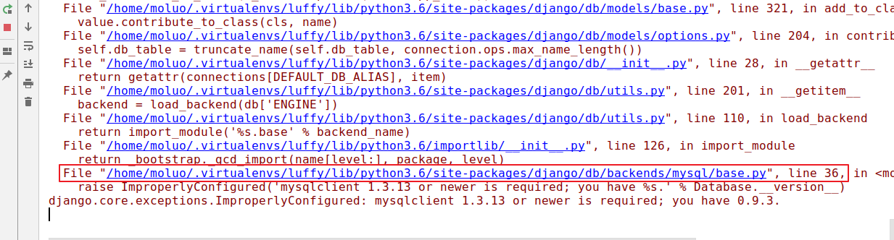
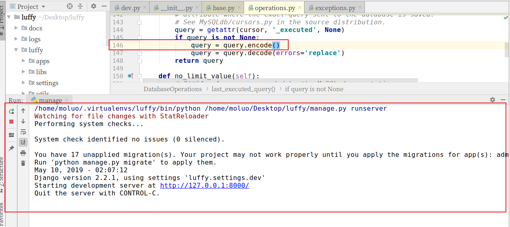

## 4.6 日志配置

django官方文档


在settings/dev.py文件中追加如下配置：

```python
# 日志配置
LOGGING = {
    'version': 1,  #使用的python内置的logging模块，那么python可能会对它进行升级，所以需要写一个版本号，目前就是1版本
    'disable_existing_loggers': False, #是否去掉目前项目中其他地方中以及使用的日志功能，但是将来我们可能会引入第三方的模块，里面可能内置了日志功能，所以尽量不要关闭。
    'formatters': { #日志记录格式
        'verbose': { #levelname等级，asctime记录时间，module表示日志发生的文件名称，lineno行号，message错误信息
            'format': '%(levelname)s %(asctime)s %(module)s %(lineno)d %(message)s'
        },
        'simple': {
            'format': '%(levelname)s %(module)s %(lineno)d %(message)s'
        },
    },
    'filters': { #过滤器：可以对日志进行输出时的过滤用的
        'require_debug_true': { #在debug=True下产生的一些日志信息，要不要记录日志，需要的话就在handlers中加上这个过滤器，不需要就不加
            '()': 'django.utils.log.RequireDebugTrue',
        },
        'require_debug_false': { #和上面相反
            '()': 'django.utils.log.RequireDebugFalse',
        },
    },
    'handlers': { #日志处理方式，日志实例
        'console': { #在控制台输出时的实例
            'level': 'DEBUG', #日志等级；debug是最低等级，那么只要比它高等级的信息都会被记录
            'filters': ['require_debug_true'], #在debug=True下才会打印在控制台
            'class': 'logging.StreamHandler', #使用的python的logging模块中的StreamHandler来进行输出
            'formatter': 'simple'
        },
        'file': {
            'level': 'INFO',
            'class': 'logging.handlers.RotatingFileHandler',
            # 日志位置,日志文件名,日志保存目录必须手动创建
            'filename': os.path.join(os.path.dirname(BASE_DIR), "logs/luffy.log"), #注意，你的文件应该有读写权限。
            # 日志文件的最大值,这里我们设置300M
            'maxBytes': 300 * 1024 * 1024,
            # 日志文件的数量,设置最大日志数量为10
            'backupCount': 10,
            # 日志格式:详细格式
            'formatter': 'verbose',
          	'encoding': 'utf-8',  # 设置默认编码，否则打印出来汉字乱码
        },
    },
    # 日志对象
    'loggers': {
        'django': {  #和django结合起来使用，将django中之前的日志输出内容的时候，按照我们的日志配置进行输出，
            'handlers': ['console', 'file'], #将来项目上线，把console去掉
            'propagate': True, #冒泡：是否将日志信息记录冒泡给其他的日志处理系统，工作中都是True，不然django这个日志系统捕获到日志信息之后，其他模块中可能也有日志记录功能的模块，就获取不到这个日志信息了
        },
    }
}
```


## 4.5 异常处理

新建utils/exceptions.py

```python
from rest_framework.views import exception_handler

from django.db import DatabaseError
from rest_framework.response import Response
from rest_framework import status

import logging
logger = logging.getLogger('django')


def custom_exception_handler(exc, context):
    """
    自定义异常处理
    :param exc: 异常类
    :param context: 抛出异常的上下文
    :return: Response响应对象
    """
    # 调用drf框架原生的异常处理方法
    response = exception_handler(exc, context)

    if response is None:
        view = context['view']
        if isinstance(exc, DatabaseError):
            # 数据库异常
            logger.error('[%s] %s' % (view, exc))
            response = Response({'message': '服务器内部错误'}, status=status.HTTP_507_INSUFFICIENT_STORAGE)

    return response
```


settings.py配置文件中添加

```python
REST_FRAMEWORK = {
    # 异常处理
    'EXCEPTION_HANDLER': 'luffyapi.utils.exceptions.custom_exception_handler',
}
```


## 4.7 创建数据库

```mysql
create database luffy default charset=utf8mb4; -- utf8也会导致有些极少的中文出现乱码的问题，mysql5.5之后官方才进行处理，出来了utf8mb4，这个是真正的utf8，能够容纳所有的中文，其实一般情况下utf8就够用了。
```


为当前项目创建数据库用户[这个用户只能看到这个数据库]

```mysql
create user luffy_user identified by 'luffy';
grant all privileges on luffy.* to 'luffy_user'@'%';
flush privileges;

mysql -u luffy_user -pluffy
select user(); #luffy_user
```


## 4.8 配置数据库连接

打开settings/dev.py文件，并配置

```python
DATABASES = {
    "default": {
        "ENGINE": "django.db.backends.mysql",
        "HOST": "127.0.0.1",
        "PORT": 3306,
        "USER": "luffy_user",
        "PASSWORD": "luffy",
        "NAME": "luffy",
    }
}
```


在项目主模块的 `__init__.py`中导入pymysql

```python
import pymysql

pymysql.install_as_MySQLdb()
```


#### 调整错误

数据库版本检测导致的错误



数据库的版本检测代码注释掉。


第二个错误也是因为数据库版本的默认编码导致，query返回的内容格式使用有误。

新增一行代码，把query查询结果转换格式为 bytes类型




luffyapi项目后端基本就配置完了，下面搞一下前端客户端。

# 5. 搭建前端项目

## 5.1 创建项目目录

```bash
cd 项目目录
vue init webpack lufei_pc
```

例如，我要把项目保存在~/Desktop桌面目录下，可以如下操作：

```bash
cd ~/Desktop
vue init webpack lufei_pc
```


## 5.2 前端初始化全局变量和全局方法

在src目录下创建settings.js站点开发配置文件：

```javascript
export default {
  //Host:"http://127.0.0.1:8080",
  Host:"http://api.luffycity.cn:8000",
}

```

在main.js中引入

```javascript
// // The Vue build version to load with the `import` command
// // (runtime-only or standalone) has been set in webpack.base.conf with an alias.
// import Vue from 'vue'
// import App from './App'
// import router from './routers/index';
import settings from "./settings"
// Vue.config.productionTip = false;
Vue.prototype.$settings = settings;  #将settings中的内容作为vue的属性，以后就不用每次都导包了
//
// /* eslint-disable no-new */
// new Vue({
//   el: '#app',
//   router,
//   components: { App },
//   template: '<App/>'
// });

```


App.vue，全局css初始化代码

reset.css

```css
body{
    margin: 0;
    padding: 0;
  }
  ul{
    list-style: none;
    padding: 0;
    margin: 0;
  }
  li{
    list-style: none;
  }
  /*.el-header{*/
  /*  width: 1200px;*/
  /*}*/
  input,select,textarea{
    border: none;
    outline: none;
  }
  a{
    text-decoration: none;
    color: #4a4a4a;
  }
```


也可以把App.vue的style标签的css代码放到static外部目录下引用过来

main.js

```javascript
import "../static/css/reset.css";
```


# 6. 跨域CORS

我们现在为前端和后端分别设置两个不同的域名：

| 位置 | 域名               |
| ---- | ------------------ |
| 前端 | `www.luffycity.cn` |
| 后端 | `api.luffycity.cn` |

编辑`/etc/hosts`文件，可以设置本地域名

```bash
sudo vim /etc/hosts
```

在文件中增加两条信息

```shell
127.0.0.1   localhost
127.0.0.1   api.luffycity.cn
127.0.0.1   www.luffycity.cn
```


windows 11 修改 hosts文件

C:\Windows\System32\drivers\etc

修改权限： 右键hosts文件属性—》安全 编辑  添加当前登录用户， 然后勾选全部控制  确定


如果你已经启动了nginx，那么你使用80端口的时候，通过浏览器访问前端vue项目，会出现nginx的欢迎页面，主要因为我们当前操作中已经有一个nginx监听了80端口，所以访问www.luffycity.cn网址时，会自动被转发到127.0.0.1本机，因为没有网址默认端口是80端口，所以被nginx进行处理了当前请求，因此我们暂时先把nginx关闭先。

```bash
# 查找nginx的进程
ps -ef|grep nginx
# 关闭进程
sudo kill -9 nginx进程号
```


关闭了nginx以后，访问www.luffy.cirty.cn网址，效果：


上面并不是错误，而是没人监听了这个地址和端口了，解决方法：


暂停运行前端项目，并修改配置文件config/index.js

```javascript
    host: 'www.luffycity.cn', // can be overwritten by process.env.HOST
    port: 80, // can be overwritten by process.env.PORT, if port is in use, a free one will be determined
    autoOpenBrowser: true,
```

保存修改信息，并重启项目


这样就可以了，现在尽量先不用使用80端口，比较麻烦


通过浏览器访问drf项目,会出现以下错误信息


可以通过settings/dev.py的ALLOWED_HOSTS,设置允许访问

```python
# 设置哪些客户端可以通过地址访问到后端
ALLOWED_HOSTS = [
    'api.luffycity.cn',
    'www.luffycity.cn', #客户端网址也要，将来客户端要访问到服务端的 
]

```


让用户访问的时候，使用api.luffycity.cn:8000

```
1. 修改pycharm的manage.py的配置参数
Parameters： runserver api.luffycity.cn:8000
```


现在，前端与后端分处不同的域名，我们需要为后端添加跨域访问的支持

否则前端无法使用axios无法请求后端提供的api数据，我们使用CORS来解决后端对跨域访问的支持。

使用django-cors-headers扩展

```
在 Response(headers={"Access-Control-Allow-Origin":'客户端地址/*'})
```


文档：https://github.com/ottoyiu/django-cors-headers/

安装

```python
pip install django-cors-headers
```

添加应用

```python
INSTALLED_APPS = (
    ...
    'corsheaders',
    ...
)
```

中间件设置【必须写在第一个位置】

```python
MIDDLEWARE = [
    'corsheaders.middleware.CorsMiddleware', #放在中间件的最上面，就是给响应头加上了一个响应头跨域
    ...
]
```

需要添加白名单，确定一下哪些客户端可以跨域。

```python
# CORS组的配置信息
CORS_ORIGIN_WHITELIST = (
    #'www.luffycity.cn:8080', #如果这样写不行的话，就加上协议(http://www.luffycity.cn:8080，因为不同的corsheaders版本可能有不同的要求)
    'http://www.luffycity.cn:8080'
)
CORS_ALLOW_CREDENTIALS = False  # 是否允许ajax跨域请求时携带cookie，False表示不用，我们后面也用不到cookie，所以关掉它就可以了，以防有人通过cookie来搞我们的网站

----------------------------------------------------
#django-cors-headers新版改成这样
CORS_ORIGIN_WHITELIST = (
    #'www.luffycity.cn:8080', #如果这样写不行的话，就加上协议(http://www.luffycity.cn:8080，因为不同的corsheaders版本可能有不同的要求)
    ['http://www.luffycity.cn:*']
)
CORS_ORIGIN_ALLOW_ALL = True
CORS_ALLOW_CREDENTIALS = False  # 是否允许ajax跨域请求时携带cookie，False表示不用，我们后面也用不到cookie，所以关掉它就可以了，以防有人通过cookie来搞我们的网站

------参考：https://blog.csdn.net/weixin_43939159/article/details/109676307
```


完成了上面的步骤，我们就可以通过后端提供数据给前端使用ajax访问了。

前端使用 axios就可以访问到后端提供给的数据接口，但是如果要附带cookie信息，前端还要设置一下。

前端引入axios插件并配置允许axios发送cookie信息[axios本身也不允许ajax发送cookie到后端]

```
npm i axios@0.20.0 -S --registry https://registry.npm.taobao.org
```


在main.js中引用 axios插件

```javascript
import axios from 'axios'; // 从node_modules目录中导入包
// 客户端配置是否允许ajax发送请求时附带cookie，false表示不允许
axios.defaults.withCredentials = false;

Vue.prototype.$axios = axios; // 把对象挂载vue中
```


如果你拷贝前端vue-cli项目到咱们指定目录下，如果运行起来有问题，一些不知名的错误，那么就删除node_modules文件件，然后在项目目录下执行`npm install` 这个指令，重新按照package.json文件夹中的包进行node_modules里面包的下载

