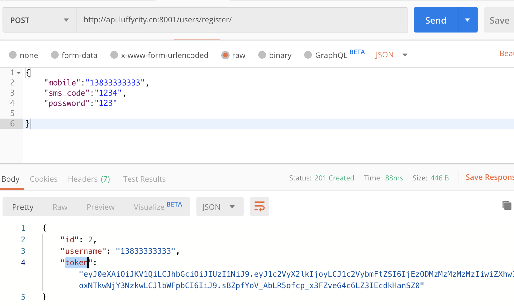
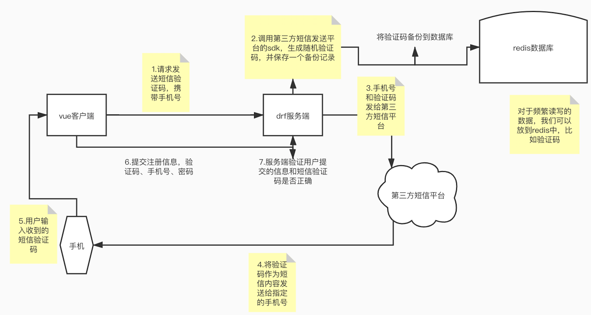
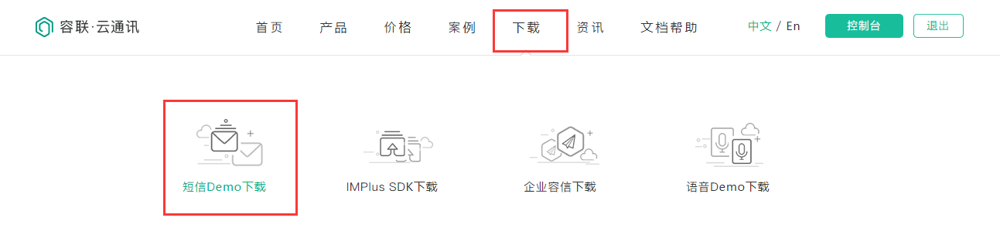
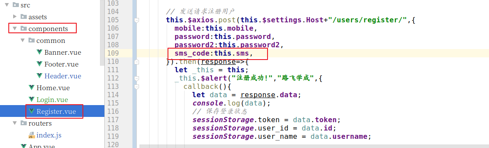

# 用户的注册认证

前端显示注册页面并调整首页头部和登陆页面的注册按钮的链接。

注册页面Register,主要是通过登录页面进行改成而成.

```vue
<template>
	<div class="box">
		
		<div class="register">
			<div class="register_box">
        <div class="register-title">注册路飞学城</div>
				<div class="inp">
					<input v-model = "mobile" type="text" placeholder="手机号码" class="user">
          <input v-model = "password" type="password" placeholder="登录密码" class="user">
					
					<input v-model = "sms_code" type="text" placeholder="输入验证码" class="user">
          
          <!-- <div id="geetest"></div>滑动验证这里我就不加了 -->
					<button class="register_btn" >注册</button>
					<p class="go_login" >已有账号 <router-link to="/user/login">直接登录</router-link></p>
				</div>
			</div>
		</div>
	</div>
</template>

<script>
export default {
  name: 'Register',
  data(){
    return {
        sms_code:"",
        mobile:"",
      	password:"",
        validateResult:false,
    }
  },
  created(){
  },
  methods:{},

};
</script>

<style scoped>
.box{
	width: 100%;
  height: 100%;
	position: relative;
  overflow: hidden;
}
.box img{
	width: 100%;
  min-height: 100%;
}
.box .register {
	position: absolute;
	width: 500px;
	height: 400px;
	top: 0;
	left: 0;
  margin: auto;
  right: 0;
  bottom: 0;
  top: -120px;
}
.register .register-title{
    width: 100%;
    font-size: 24px;
    text-align: center;
    padding-top: 30px;
    padding-bottom: 30px;
    color: #4a4a4a;
    letter-spacing: .39px;
}
.register-title img{
    width: 190px;
    height: auto;
}
.register-title p{
    font-family: PingFangSC-Regular;
    font-size: 18px;
    color: #fff;
    letter-spacing: .29px;
    padding-top: 10px;
    padding-bottom: 50px;
}
.register_box{
    width: 400px;
    height: auto;
    background: #fff;
    box-shadow: 0 2px 4px 0 rgba(0,0,0,.5);
    border-radius: 4px;
    margin: 0 auto;
    padding-bottom: 40px;
}
.register_box .title{
	font-size: 20px;
	color: #9b9b9b;
	letter-spacing: .32px;
	border-bottom: 1px solid #e6e6e6;
	 display: flex;
    	justify-content: space-around;
    	padding: 50px 60px 0 60px;
    	margin-bottom: 20px;
    	cursor: pointer;
}
.register_box .title span:nth-of-type(1){
	color: #4a4a4a;
    	border-bottom: 2px solid #84cc39;
}

.inp{
	width: 350px;
	margin: 0 auto;
}
.inp input{
    border: 0;
    outline: 0;
    width: 100%;
    height: 45px;
    border-radius: 4px;
    border: 1px solid #d9d9d9;
    text-indent: 20px;
    font-size: 14px;
    background: #fff !important;
}
.inp input.user{
    margin-bottom: 16px;
}
.inp .rember{
     display: flex;
    justify-content: space-between;
    align-items: center;
    position: relative;
    margin-top: 10px;
}
.inp .rember p:first-of-type{
    font-size: 12px;
    color: #4a4a4a;
    letter-spacing: .19px;
    margin-left: 22px;
    display: -ms-flexbox;
    display: flex;
    -ms-flex-align: center;
    align-items: center;
    /*position: relative;*/
}
.inp .rember p:nth-of-type(2){
    font-size: 14px;
    color: #9b9b9b;
    letter-spacing: .19px;
    cursor: pointer;
}

.inp .rember input{
    outline: 0;
    width: 30px;
    height: 45px;
    border-radius: 4px;
    border: 1px solid #d9d9d9;
    text-indent: 20px;
    font-size: 14px;
    background: #fff !important;
}

.inp .rember p span{
    display: inline-block;
  font-size: 12px;
  width: 100px;
  /*position: absolute;*/
/*left: 20px;*/

}
#geetest{
	margin-top: 20px;
}
.register_btn{
     width: 100%;
    height: 45px;
    background: #84cc39;
    border-radius: 5px;
    font-size: 16px;
    color: #fff;
    letter-spacing: .26px;
    margin-top: 30px;
}
.inp .go_login{
    text-align: center;
    font-size: 14px;
    color: #9b9b9b;
    letter-spacing: .26px;
    padding-top: 20px;
}
.inp .go_login span{
    color: #84cc39;
    cursor: pointer;
}
</style>

```

前端注册路由:

```javascript
import Register from "../components/Register"

// 配置路由列表
export default new Router({
  mode:"history",
  routes:[
    // 路由列表
	...
    {
      name:"Register",
      path: "/register",
      component:Register,
    }
  ]
})

```

修改首页头部的连接:

```html
# Header.vue
<span class="header-register"><router-link to="/register">注册</router-link></span>
#Login.vue
<p class="go_login" >没有账号 <router-link to="/register">立即注册</router-link></p>
```


## 注册功能的实现

### 后台api实现

后端视图提供注册功能的api接口，视图代码：users/views.py

```python
from rest_framework.generics import CreateAPIView
from .models import User
from .serializers import UserModelSerializer
class UserAPIView(CreateAPIView):
    """用户信息视图"""
    queryset = User.objects.all()
    serializer_class = UserModelSerializer
```

序列化器代码：users/serializers.py

```python
from rest_framework import serializers
from .models import User
import re
from .utils import get_user_by_account
from django.contrib.auth.hashers import make_password
from rest_framework_jwt.settings import api_settings

class UserModelSerializer(serializers.ModelSerializer):
    sms_code = serializers.CharField(min_length=4, max_length=6, required=True, write_only=True, help_text="短信验证码")
    token = serializers.CharField(max_length=1024, read_only=True, help_text="token认证字符串")
    class Meta:
        model = User
        #注册之后我们按说就不应该让他再登录了，也就是免登录，所以我们需要给它返回id，username和token
        fields = ["id","username", "mobile","password","sms_code","token"]
        extra_kwargs = {
            "id":{
                "read_only":True,
            },
            "username":{
                "read_only":True,
            },
            "password":{
                "write_only":True,
            },
            "mobile":{
                "write_only":True,
            }
        }

    def validate(self, attrs):
        mobile = attrs.get("mobile")
        sms_code = attrs.get("sms_code")
        password = attrs.get("password")
        # 验证手机号码的格式
        if not re.match(r"^1[3-9]\d{9}$", mobile):
           raise serializers.ValidationError("对不起，手机号格式有误！")

        # 验证码手机号是否已经被注册过了
        ret = get_user_by_account(mobile)
        if ret is not None:
            raise serializers.ValidationError("对不起，手机号已经被注册过！")

        # todo 验证短信验证码是否正确

        return attrs

    def create(self, validated_data):
        """用户信息"""
        # 移除掉不需要的数据
        validated_data.pop("sms_code")
        # 对密码进行加密
        raw_password =  validated_data.get("password")
        hash_password = make_password(raw_password)
        # 对用户名设置一个默认值
        username = validated_data.get("mobile")
        # 调用序列化器提供的create方法
        user = User.objects.create(
            mobile=username,
            username=username,
            password=hash_password,
        )

        # 使用restframework_jwt模块提供手动生成token的方法生成登录状态


        jwt_payload_handler = api_settings.JWT_PAYLOAD_HANDLER
        jwt_encode_handler = api_settings.JWT_ENCODE_HANDLER

        payload = jwt_payload_handler(user)
        user.token = jwt_encode_handler(payload)

        return user
```

路由，代码：

```python
from django.urls import path
from rest_framework_jwt.views import obtain_jwt_token
from . import views
urlpatterns = [
    # path(r"banner/", views.BannerListAPIView.as_view()),
    path(r"login/", obtain_jwt_token),
    path(r"captcha/", views.CaptchaAPIView.as_view()),
    path(r"register/", views.UserAPIView.as_view()),
]
```

使用postman访问测试




## 客户端实现注册功能 

register.vue，代码：

```vue
<template>
	<div class="box">
		
		<div class="register">
			<div class="register_box">
        <div class="register-title">注册路飞学城</div>
				<div class="inp">
					<input v-model = "mobile" type="text" placeholder="手机号码" class="user">
          <input v-model = "password" type="password" placeholder="登录密码" class="user">
					<input v-model = "sms_code" type="text" placeholder="输入验证码" class="user">
          <div id="geetest"></div>
					<button class="register_btn" @click="registerHander">注册</button>
					<p class="go_login" >已有账号 <router-link to="/user/login">直接登录</router-link></p>
				</div>
			</div>
		</div>
	</div>
</template>

<script>
export default {
  name: 'Register',
  data(){
    return {
        sms_code:"",
        mobile:"",
        password: "",
    }
  },
  created(){
  },
  methods:{
      registerHander(){
          // 用户注册
          this.$axios.post(`${this.$settings.Host}/user/register/`,{
            mobile: this.mobile,
            sms_code:this.sms_code,
            password:this.password,
          }).then(response=>{
            //默认是不需要记住密码的功能的，所以我们存到sessionStorage中
            console.log(response.data);
            localStorage.removeItem("user_token");
            localStorage.removeItem("user_id");
            localStorage.removeItem("user_name");
            sessionStorage.user_token = response.data.token;
            sessionStorage.user_id = response.data.id;
            sessionStorage.user_name = response.data.username;

            // 页面跳转
            let self = this;
            this.$alert("注册成功!","路飞学城",{
               callback(){
                    self.$router.push("/");
               }
            });

          }).catch(error=>{
            let data = error.response.data;
            let message = "";
            for(let key in data){
                message = data[key][0];
            }
            this.$message.error(message);
          });
      }
  },

};
</script>

<style scoped>
.box{
	width: 100%;
  height: 100%;
	position: relative;
  overflow: hidden;
}
.box img{
	width: 100%;
  min-height: 100%;
}
.box .register {
	position: absolute;
	width: 500px;
	height: 400px;
	top: 0;
	left: 0;
  margin: auto;
  right: 0;
  bottom: 0;
  top: -338px;
}
.register .register-title{
    width: 100%;
    font-size: 24px;
    text-align: center;
    padding-top: 30px;
    padding-bottom: 30px;
    color: #4a4a4a;
    letter-spacing: .39px;
}
.register-title img{
    width: 190px;
    height: auto;
}
.register-title p{
    font-family: PingFangSC-Regular;
    font-size: 18px;
    color: #fff;
    letter-spacing: .29px;
    padding-top: 10px;
    padding-bottom: 50px;
}
.register_box{
    width: 400px;
    height: auto;
    background: #fff;
    box-shadow: 0 2px 4px 0 rgba(0,0,0,.5);
    border-radius: 4px;
    margin: 0 auto;
    padding-bottom: 40px;
}
.register_box .title{
	font-size: 20px;
	color: #9b9b9b;
	letter-spacing: .32px;
	border-bottom: 1px solid #e6e6e6;
	 display: flex;
    	justify-content: space-around;
    	padding: 50px 60px 0 60px;
    	margin-bottom: 20px;
    	cursor: pointer;
}
.register_box .title span:nth-of-type(1){
	color: #4a4a4a;
    	border-bottom: 2px solid #84cc39;
}

.inp{
	width: 350px;
	margin: 0 auto;
}
.inp input{
    border: 0;
    outline: 0;
    width: 100%;
    height: 45px;
    border-radius: 4px;
    border: 1px solid #d9d9d9;
    text-indent: 20px;
    font-size: 14px;
    background: #fff !important;
}
.inp input.user{
    margin-bottom: 16px;
}
.inp .rember{
     display: flex;
    justify-content: space-between;
    align-items: center;
    position: relative;
    margin-top: 10px;
}
.inp .rember p:first-of-type{
    font-size: 12px;
    color: #4a4a4a;
    letter-spacing: .19px;
    margin-left: 22px;
    display: -ms-flexbox;
    display: flex;
    -ms-flex-align: center;
    align-items: center;
    /*position: relative;*/
}
.inp .rember p:nth-of-type(2){
    font-size: 14px;
    color: #9b9b9b;
    letter-spacing: .19px;
    cursor: pointer;
}

.inp .rember input{
    outline: 0;
    width: 30px;
    height: 45px;
    border-radius: 4px;
    border: 1px solid #d9d9d9;
    text-indent: 20px;
    font-size: 14px;
    background: #fff !important;
}

.inp .rember p span{
    display: inline-block;
  font-size: 12px;
  width: 100px;
  /*position: absolute;*/
/*left: 20px;*/

}
#geetest{
	margin-top: 20px;
}
.register_btn{
     width: 100%;
    height: 45px;
    background: #84cc39;
    border-radius: 5px;
    font-size: 16px;
    color: #fff;
    letter-spacing: .26px;
    margin-top: 30px;
}
.inp .go_login{
    text-align: center;
    font-size: 14px;
    color: #9b9b9b;
    letter-spacing: .26px;
    padding-top: 20px;
}
.inp .go_login span{
    color: #84cc39;
    cursor: pointer;
}
</style>

```

虽然已经实现了注册功能，但是我们需要针对当前的安全性和用户体验要进行优化.

新增用户输入完成手机号以后，要及时进行手机号的唯一性验证，对于这个功能，我们需要单独实现。

### 手机号的唯一性验证

后端视图，代码: users/views.py

```python
"""
GET /user/mobile/<mobile>/
"""
import re
from rest_framework import status
from .utils import get_user_by_account
from rest_framework.response import Response

class MobileAPIView(APIView):
    def get(self,request,mobile):
        ret = get_user_by_account(mobile)
        if ret is not None:
            return Response({"message":"手机号已经被注册过！"},status=status.HTTP_400_BAD_REQUEST)
        return Response({"message":"ok"})

```


后端路由,代码: users/curls.py

```python
from django.urls import path,re_path
from rest_framework_jwt.views import obtain_jwt_token
from . import views
urlpatterns = [
    # path(r"banner/", views.BannerListAPIView.as_view()),
    path(r"login/", obtain_jwt_token),
    path(r"captcha/", views.CaptchaAPIView.as_view()),
    path(r"", views.UserAPIView.as_view()),
    re_path(r"mobile/(?P<mobile>1[3-9]\d{9})/", views.MobileAPIView.as_view()),
]
```

客户端用户输入完手机号码以后,使用失去焦点事件,然后发送手机号到后端进行唯一性验证

```vue
<template>
	<div class="box">
		
		<div class="register">
			<div class="register_box">
        <div class="register-title">注册路飞学城</div>
				<div class="inp">
					<input v-model = "mobile" type="text" @blur="checkMobile" placeholder="手机号码" class="user">
          <input v-model = "password" type="password" placeholder="登录密码" class="user">
					<input v-model = "sms_code" type="text" placeholder="输入验证码" class="user">
          <div id="geetest"></div>
					<button class="register_btn" @click="registerHander">注册</button>
					<p class="go_login" >已有账号 <router-link to="/user/login">直接登录</router-link></p>
				</div>
			</div>
		</div>
	</div>
</template>

<script>
export default {
  name: 'Register',
  data(){
    return {
        sms_code:"",
        mobile:"",
        password: "",
    }
  },
  created(){
  },
  methods:{
      checkMobile(){
          // 检查手机号的合法性[格式和是否已经注册]
          this.$axios.get(`${this.$settings.HOST}/user/mobile/${this.mobile}/`).catch(error=>{
              this.$message.error(error.response.data.message);
          });
      },
      registerHander(){
          // 用户注册
          this.$axios.post(`${this.$settings.Host}/user/register/`,{
            mobile: this.mobile,
            sms_code:this.sms_code,
            password:this.password,
          }).then(response=>{
            console.log(response.data);
            localStorage.removeItem("user_token");
            localStorage.removeItem("user_id");
            localStorage.removeItem("user_name");
            sessionStorage.user_token = response.data.token;
            sessionStorage.user_id = response.data.id;
            sessionStorage.user_name = response.data.username;

            // 页面跳转
            let self = this;
            this.$alert("注册成功!","路飞学城",{
               callback(){
                    self.$router.push("/");
               }
            });

          }).catch(error=>{
            let data = error.response.data;
            let message = "";
            for(let key in data){
                message = data[key][0];
            }
            this.$message.error(message);
          });
      }
  },

};
</script>
```


看一下短信发送过程：




接下来，我们把注册过程中一些注册信息（例如：短信验证码）和其他的缓存数据保存到redis数据库中。

安装django-redis。封装的pyredis类，这个django-redis是与django结合的更紧密一些，它安装之后有两个模块，一个是和django配合的，一个是python操作redis的。

```python
pip install django-redis
```


在settings.py配置中添加一下代码：

```python
# 设置redis缓存
CACHES = {
    # 默认缓存
    "default": {
        "BACKEND": "django_redis.cache.RedisCache",
        # 项目上线时,需要调整这里的路径
        "LOCATION": "redis://127.0.0.1:6379/0", 

        "OPTIONS": {
            "CLIENT_CLASS": "django_redis.client.DefaultClient",
        }
    },
    # 提供给xadmin或者admin的session存储
    "session": {
        "BACKEND": "django_redis.cache.RedisCache",
        "LOCATION": "redis://127.0.0.1:6379/1",
        "OPTIONS": {
            "CLIENT_CLASS": "django_redis.client.DefaultClient",
        }
    },
    # 提供存储短信验证码
    "sms_code":{
        "BACKEND": "django_redis.cache.RedisCache",
        "LOCATION": "redis://127.0.0.1:6379/2",
        "OPTIONS": {
            "CLIENT_CLASS": "django_redis.client.DefaultClient",
        }
    }
}

# 设置xadmin用户登录时,登录信息session保存到redis
SESSION_ENGINE = "django.contrib.sessions.backends.cache"
SESSION_CACHE_ALIAS = "session"
```

**关于django-redis 的使用，说明文档可见http://django-redis-chs.readthedocs.io/zh_CN/latest/**

**django-redis提供了get_redis_connection的方法，通过调用get_redis_connection方法传递redis的配置名称可获取到redis的连接对象，通过redis连接对象可以执行redis命令**

<https://redis-py.readthedocs.io/en/latest/>

使用范例：

```python
from django_redis import get_redis_connection
// 链接redis数据库
redis_conn = get_redis_connection("default")
通过连接对象，就能操作文档中的所有方法了

```


### 使用云通讯发送短信

在登录后的平台上面获取一下信息:[https://www.yuntongxun.com/]

```text
ACCOUNT SID：8a216da881ad97540181d8e645e20809
AUTH TOKEN : e9aacc7819774ca39916f472c6083648
AppID(默认)：8a216da881ad97540181d8e646e70810
Rest URL(生产)： https://app.cloopen.com:8883        [项目上线时使用真实短信发送服务器]
Rest URL(开发)： sandboxapp.cloopen.com:8883  [项目开发时使用沙箱短信发送服务器]
```

找到sdkdemo进行下载




在开发过程中,为了节约发送短信的成本,可以把自己的或者同事的手机加入到测试号码中.


把云通讯的sdk保存到libs目录下， 并修改里面的基本配置信息，以后项目上线，肯定用的是公司已经经过实名认证并且购买短信包的，别忘了改。

sms.py，代码：把上面开发使用的一些参数我们配置到settings/dev.py中

```python
# -*- coding:utf-8 -*-

from .CCPRestSDK import REST
from django.conf import settings
# 说明：主账号，登陆云通讯网站后，可在"控制台-应用"中看到开发者主账号ACCOUNT SID
_accountSid = settings.SMS['_accountSid']

# 说明：主账号Token，登陆云通讯网站后，可在控制台-应用中看到开发者主账号AUTH TOKEN
_accountToken = settings.SMS['_accountToken']
# be8d96030fca44ffaf958062e6c658e8
# 请使用管理控制台首页的APPID或自己创建应用的APPID
_appId = settings.SMS['_appId']
# 8aaf07086f17620f016f308d0d850faf
# 说明：请求地址，生产环境配置成app.cloopen.com
_serverIP = settings.SMS['_serverIP']
# sandboxapp.cloopen.com沙箱环境地址

# 说明：请求端口 ，生产环境为8883
_serverPort = settings.SMS['_serverPort']

# 说明：REST API版本号保持不变
_softVersion = settings.SMS['_softVersion']

# 云通讯官方提供的发送短信代码实例
# # 发送模板短信
# # @param to 手机号码
# # @param datas 内容数据 格式为数组 例如：{'12','34'}，如不需替换请填 ''
# # @param $tempId 模板Id
#
# def sendTemplateSMS(to, datas, tempId):
#     # 初始化REST SDK
#     rest = REST(serverIP, serverPort, softVersion)
#     rest.setAccount(accountSid, accountToken)
#     rest.setAppId(appId)
#
#     result = rest.sendTemplateSMS(to, datas, tempId)
#     for k, v in result.iteritems():
#
#         if k == 'templateSMS':
#             for k, s in v.iteritems():
#                 print '%s:%s' % (k, s)
#         else:
#             print '%s:%s' % (k, v)


class CCP(object):
    """发送短信的辅助类"""

    def __new__(cls, *args, **kwargs):
        # 判断是否存在类属性_instance，_instance是类CCP的唯一对象，即单例
        if not hasattr(CCP, "_instance"):
            cls._instance = super(CCP, cls).__new__(cls, *args, **kwargs)
            cls._instance.rest = REST(_serverIP, _serverPort, _softVersion)
            cls._instance.rest.setAccount(_accountSid, _accountToken)
            cls._instance.rest.setAppId(_appId)
        return cls._instance

    def send_template_sms(self, to, datas, temp_id):
        """发送模板短信"""
        # @param to 手机号码
        # @param datas 内容数据 格式为数组 例如：{'12','34'}，如不需替换请填 ''
        # @param temp_id 模板Id
        result = self.rest.sendTemplateSMS(to, datas, temp_id)
        # 如果云通讯发送短信成功，返回的字典数据result中statuCode字段的值为"000000"
        if result.get("statusCode") == "000000":
            # 返回0 表示发送短信成功
            return 0
        else:
            # 返回-1 表示发送失败
            return -1


if __name__ == '__main__':
    ccp = CCP()
    # 注意： 测试的短信模板编号为1[以后申请了企业账号以后可以有更多的模板]
    # 参数1: 客户端手机号码,测试时只能发给测试号码
    # 参数2: 短信模块中的数据
    #        短信验证码
    #        短信验证码有效期提示
    # 参数3: 短信模板的id,开发测试时,只能使用1

    # ccp.send_template_sms('15914397060', ['1234',"5"], 1)

```

配置文件，代码：

```python
SMS = {
    "_accountSid":'8aaf07086f17620f016f308d0d2c0fa9',

    # 说明：主账号Token，登陆云通讯网站后，可在控制台-应用中看到开发者主账号AUTH TOKEN
    "_accountToken":'be8d96030fca44ffaf958062e6c658e8',
    # be8d96030fca44ffaf958062e6c658e8
    # 请使用管理控制台首页的APPID或自己创建应用的APPID
    "_appId":'8aaf07086f17620f016f308d0d850faf',
    # 8aaf07086f17620f016f308d0d850faf
    # 说明：请求地址，生产环境配置成app.cloopen.com
    "_serverIP":'sandboxapp.cloopen.com',
    # sandboxapp.cloopen.com沙箱环境地址

    # 说明：请求端口 ，生产环境为8883
    "_serverPort":"8883",

    # 说明：REST API版本号保持不变
    "_softVersion":'2013-12-26'
}
```


#### 发送短信验证码

视图代码：users/views.py

```python
#理论来说，我们是不需要什么数据库处理的，所以我们直接继承APIView就可以了
class SMSAPIView(APIView):
    """
    发送短信
    """
    def get(self,request,mobile):

        try:
            # 引入redis
            redis = get_redis_connection("sms_code")

            # 判断当前手机号码是否曾经在60s发送过短信

            mobile_intervel = redis.get("mobile_%s" % mobile)
            if mobile_intervel:
                return Response({"result":"对不起~手机短信发送间隔不足1分钟!"},status=status.HTTP_400_BAD_REQUEST)

            # 在以后开发中如果一次性要写入多条redis命令，建议采用管道操作[事务操作]来把多条数据整理成一块，一并发送给redis
            pip = redis.pipeline()
            pip.multi()

            # 设置短信发送间隔时间
            # setex mobile_17776445415 60 _
            pip.setex("mobile_%s" % mobile, constant.SMS_INTERVAL_TIME,"_") # "_" 表示占位符，没有任何意义的

            # 生成短信号码并把短信和手机号码保存到redis中
            code = "%06d" % random.randint(0, 999999)

            # 可以使用string格式进行数据保存
            # setex sms_17776445415 300 666666
            pip.setex("sms_%s" % mobile, constant.SMS_EXPIRE_TIME,code)

            # 执行管道中的所有命令[提交事务]
            pip.execute()

            # 发送短信
            # send_template_sms("接受短信的手机号码",["短信验证码","短信有效期"],短信模板ID)
            # 短信模板ID 在测试阶段是1
            ccp = CCP()
            result = ccp.send_template_sms(mobile, [code, constant.SMS_EXPIRE_TIME // 60], constant.SMS_TEMPLATE_ID)

            if result == -1:
                log.error("发送短信出错！手机号：%s" % mobile)
                return Response({"result":"短信发送失败！"},status=status.HTTP_500_INTERNAL_SERVER_ERROR)

        except:
            log.error("发送短信出错！")
            return Response({"result":"服务器发送短信有误！"},status=status.HTTP_507_INSUFFICIENT_STORAGE)

        return Response({"result":"短信发送成功！"},status=status.HTTP_200_OK)
```

urls.py，代码：

```python
re_path(r'sms/(?P<mobile>1[3-9]\d{9})/', views.SMSAPIView.as_view() ),
```

路由代码：

```python
    re_path("sms/(?P<mobile>1[3-9]\d{9})/", views.SMSAPIView.as_view() ),
```

配置文件settings/dev.py，代码：

```python
# 短信接口配置
SMS_ACCOUNTSID = "8a216da86b8863a1016b899599ee0190"
SMS_ACCOUNTTOKEN = "01baf2eb09ca4dca86bb47dde351cc8a"
SMS_APPID = "8a216da86b8863a1016b89959a4e0197"
SMS_SERVERIP = "sandboxapp.cloopen.com"

```

配置常量settings/constant.py，代码：

```python
#　轮播的显示数量
BANNER_LENGTH = 7

# 导航的显示数量
NAV_LENGTH = 7

# 短信发送有效期[单位:s]
SMS_EXPIRE_TIME = 3000

# 短信的模板ＩＤ
SMS_TEMPLATE_ID = 1

# 短信发送的间隔时间
SMS_INTERVAL_TIME = 60
```


#### 保存用户注册信息

视图代码：users/views.py

```python
from rest_framework.generics import CreateAPIView
from .serializers import UserModelSerializer
class UserAPIView(CreateAPIView):
    queryset = User.objects.all()
    serializer_class = UserModelSerializer
```

序列化器，代码：users/serializers.py

```python
from rest_framework import serializers
from .models import User
import re
from django_redis import get_redis_connection
from rest_framework_jwt.settings import api_settings

import logging
log = logging.getLogger("django")

class UserModelSerializer(serializers.ModelSerializer):
    sms_code = serializers.CharField(write_only=True, max_length=6,min_length=6,label="手机短信",help_text="手机短息")
    token = serializers.CharField(read_only=True, label="jwt的token字符串")
    class Meta:
        model = User
        fields = ["mobile","password","sms_code","token","id","username"]
        extra_kwargs = {
            "id":{
                "read_only":True,
            },
            "username":{
                "read_only":True,
            },
            "password":{
                "write_only":True,
            },
            "mobile":{
                "write_only":True,
            }
        }

    def validate(self,data):
        # 接受数据
        mobile = data.get("mobile")
        sms_code = data.get("sms_code")
        password = data.get("password")

        # 验证手机格式
        if not re.match("^1[3-7]\d{9}$",mobile):
            raise serializers.ValidationError("手机号格式不正确!")

        # 验证手机短信
        try:
            redis = get_redis_connection("sms_code")
        except:
            log.error("redis连接失败！")
            raise serializers.ValidationError("服务器出错，请联系客服工作人员!")

        # 验证短信是否有效
        try:
            real_sms_code = redis.get("sms_%s" % mobile).decode()
        except:
            raise serializers.ValidationError("手机短信不存在或已过期！")

        # 验证短信是否正确
        if sms_code != real_sms_code:
            raise serializers.ValidationError("手机短信错误！")

        # 验证手机是否注册了
        try:
            User.objects.get(mobile=mobile)
            raise serializers.ValidationError("手机号码已经被注册！")
        except:
            pass

        # 验证密码长度
        if len(password) < 6 or len(password) > 16:
            raise serializers.ValidationError("密码必须保持在6-16位字符长度之间!")

        # 必须返回数据
        return data

    def create(self, validated_data):
        mobile = validated_data.get("mobile")
        password = validated_data.get("password")

        try:
            user = User.objects.create_user(
                mobile=mobile,
                username=mobile,
                password=password,
                # is_active=0,  # 如果要做邮件激活才能登录，则可以加上这个字段
            )
        except:
            log.error("创建用户失败！mobile=%s" % mobile)
            raise serializers.ValidationError("注册用户失败！请联系客服工作人员！")

        # 注册成功以后，默认当前用户为登录状态，返回返回登录的jwt token值
        jwt_payload_handler = api_settings.JWT_PAYLOAD_HANDLER
        jwt_encode_handler = api_settings.JWT_ENCODE_HANDLER
        payload = jwt_payload_handler(user)
        user.token = jwt_encode_handler(payload)

        return user

```


路由代码：users/urls.py

```
    re_path(r'sms/(?P<mobile>1[3-9]\d{9})/', views.SMSAPIView.as_view()),
    path("reg/", views.UserAPIView.as_view() ),
```


#### 前端请求发送短信

调整前端的页面，添加一个发送短信功能，

html代码：

```html
		  <div class="sms-box">
            <input v-model = "sms_code" type="text" maxlength='8' placeholder="输入验证码" class="user">
            <div class="sms-btn" @click="smsHandle">点击发送短信</div>
          </div>
```


css，代码：

```css
.sms-box{
  position: relative;
}
.sms-btn{
    font-size: 14px;
    color: #ffc210;
    letter-spacing: .26px;
    position: absolute;
    right: 16px;
    top: 10px;
    cursor: pointer;
    overflow: hidden;
    background: #fff;
    border-left: 1px solid #484848;
    padding-left: 16px;
    padding-bottom: 4px;
}
```

script，代码：

data里面的methods中代码：

```js
methods:{
    // 发送短信
    smsHandle() {
      // 判断是否填写了手机
      if( !/^\d{11}$/.test(this.mobile) ){
        this.$alert('手机号码格式有误!', '警告');
        return false;
      }

      this.$axios.get(this.$settings.Host+`/user/sms/${this.mobile}/`).then(response=>{
        let data = response.data
        if( data.result == '-1' ){
          this.$alert("发送短信失败!","错误");
        }else{
          this.$alert("发送短信成功了!","成功");
        }
      }).catch(error=>{
          console.log(error.response)
      })

    },
    // 提交注册信息
    ....
```


#### 前端实现倒计时显示

```vue
<template>
....
		  <div class="sms-box">
            <input v-model = "sms_code" type="text" placeholder="输入验证码" class="user">
            <div class="sms-btn" @click="smsHandle">{{sms_text}}</div>
          </div>
....
</template>

<script>
export default {
  name: 'Register',
  data(){
    return {
        sms_code:"",
        mobile:"",
        password:"",
        password2:"",
        validateResult:false,
        is_send:false,    // 是否已经发送短信的状态
        send_intervel:60, // 发送短信的间隔
        sms_text:"点击发送短信", // 发送短信的提示
    }
  },
  methods:{
    // 发送短信
    smsHandle() {
      // 判断是否填写了手机
      if( !/^\d{11}$/.test(this.mobile) ){
        this.$alert('手机号码格式有误!', '警告');
        return false;
      }

      // 判断是否在60s内有发送过短信,如果有则,不能点击发送
      if(this.is_send){
        this.$alert('60s内不能频繁发送短信!', '警告');
        return false;
      }


      let _this = this;

      _this.$axios.get(_this.$settings.Host+`/users/sms/${_this.mobile}/`).then(response=>{
        let data = response.data;
        if( data.result == '-1' ){
          _this.$alert("发送短信失败!","错误");
        }else{
          _this.is_send = true;
          _this.$alert("发送短信成功了!","成功",{
            callback(){
              let num = _this.send_intervel
              let timer = setInterval(()=>{
                if(num<1){
                  clearInterval(timer);
                  _this.sms_text = "点击发送短信";
                  _this.is_send = false;
                }else{
                  num--;
                  _this.sms_text = num+"后可继续点击发送";
                }
              },1000)
            }
          });
        }
      }).catch(error=>{
          console.log(error.response)
      })

    },
    // 提交注册信息
    registerHander(){
		....
    }
  },

};
</script>

```

#### 后端实现短信发送间隔的判断

视图代码：

```python
import random
from luffyapi.settings import constants
from django_redis import get_redis_connection
from .utils import send_message
import logging
logger = logging.getLogger('django')
#理论来说，我们是不需要什么数据库处理的，所以我们直接继承APIView就可以了
class SMSAPIView(APIView):
    """
    发送短信
    """
    def get(self,request,mobile):

        try:
            # 引入redis
            redis = get_redis_connection("sms_code")

            # 判断当前手机号码是否曾经在60s发送过短信
            mobile_intervel = redis.get("mobile_%s" % mobile)
            if mobile_intervel:
                return Response({"result":"对不起~手机短信发送间隔不足1分钟!"},status=status.HTTP_400_BAD_REQUEST)

            # 在以后开发中如果一次性要写入多条redis命令，建议采用管道操作[事务操作]来把多条数据整理成一块，一并发送给redis
            pip = redis.pipeline()
            pip.multi()

            # 设置短信发送间隔时间
            # setex mobile_17776445415 60 _
            pip.setex("mobile_%s" % mobile, constants.SMS_INTERVAL_TIME,"_") # "_" 表示占位符，没有任何意义的

            # 生成短信号码并把短信和手机号码保存到redis中
            code = "%04d" % random.randint(0, 9999)

            # 可以使用string格式进行数据保存
            # setex sms_17776445415 300 666666
            pip.setex("sms_%s" % mobile, constants.SMS_EXPIRE_TIME,code)

            # 执行管道中的所有命令[提交事务]
            pip.execute()

            # 发送短信
            # send_message("模板id",'手机号码,',datas = ('验证码1-4位', '有效时间'))
            # 短信模板ID 在测试阶段是1
            datas = (code, constants.SMS_EXPIRE_TIME // 60)
            result = send_message(constants.SMS_TEMPLATE_ID,mobile,datas)
            if result == 0:
                logger.error("发送短信出错！手机号：%s" % mobile)
                return Response({"status":"0","result":"短信发送失败！"},status=status.HTTP_500_INTERNAL_SERVER_ERROR)
        except Exception as e:
            logger.error("发送短信出错！%s" % e)
            return Response({"status":"0","result":"服务器发送短信有误！"},status=status.HTTP_507_INSUFFICIENT_STORAGE)

        return Response({"status":"1","result":"短信发送成功！"},status=status.HTTP_200_OK)

```


#### 后端保存用户注册信息    (前面写过 略)

创建序列化器对象[暂时不涉及到手机验证码功能]

```python

from rest_framework import serializers
from .models import User
import re
from django_redis import get_redis_connection
class UserModelSerializer(serializers.ModelSerializer):
    sms_code = serializers.CharField(write_only=True, max_length=4,min_length=4,required=True,help_text="短信验证码")
    password2 = serializers.CharField(write_only=True,help_text="确认密码")
    token = serializers.CharField(read_only=True,help_text="jwt token值")
    class Meta:
        model = User
        fields = ["mobile","id","token","password","password2","username","sms_code"]
        extra_kwargs = {
            "id":{"read_only":True},
            "username":{"read_only":True},
            "password":{"write_only":True},
            "mobile":{"write_only":True}
        }


    def validate_mobile(self, mobile):
        # 验证格式
        result = re.match('^1[3-9]\d{9}$', mobile)
        if not result:
            raise serializers.ValidationError("手机号码格式有误!")

        # 验证唯一性
        try:
            user = User.objects.get(mobile=mobile)
            if user:
                raise serializers.ValidationError("当前手机号码已经被注册!")

        except User.DoesNotExist:
            pass

        return mobile


    def validate(self, attrs):

        # 判断密码长度
        password = attrs.get("password")
        if not re.match('^.{6,16}$', password):
            raise serializers.ValidationError("密码长度必须在6-16位之间!")

        # 判断密码和确认密码是否一致
        password2 = attrs.get("password2")
        if password != password2:
            raise serializers.ValidationError("密码和确认密码不一致!")

        # 验证短信验证码
        mobile = attrs.get("mobile")
        redis = get_redis_connection("sms_code")
        try:
            real_sms_code = redis.get("%s_sms_code" % mobile).decode()
        except:
            raise serializers.ValidationError("验证码不存在,或已经过期!")

        if real_sms_code != attrs.get("sms_code"):
            raise serializers.ValidationError("验证码不存在,或错误!")

        # 删除本次使用的验证码
        try:
            redis.delete("%s_sms_code" % mobile)
        except:
            pass

        return attrs

    def create(self, validated_data):
        """保存用户"""
        mobile = validated_data.get("mobile")
        password = validated_data.get("password")

        try:
            user = User.objects.create(
                mobile=mobile,
                username=mobile,
                password=password,
            )

            # 密码加密
            user.set_password(user.password)
            user.save()

        except:
            raise serializers.ValidationError("注册用户失败!")

        # 生成一个jwt
        from rest_framework_jwt.settings import api_settings

        jwt_payload_handler = api_settings.JWT_PAYLOAD_HANDLER
        jwt_encode_handler = api_settings.JWT_ENCODE_HANDLER

        payload = jwt_payload_handler(user)
        user.token = jwt_encode_handler(payload)

        return user
```

视图代码：

```python
from .serializers import UserModelSerializer
from rest_framework.generics import CreateAPIView
from .models import User
class UserAPIView(CreateAPIView):
    serializer_class = UserModelSerializer
    queryset = User.objects.all()
```


#### 设置路由

```python
# 子应用路由 urls.py
urlpatterns=[
	...
    path(r'register/', views.UserAPIView.as_view() ),
]
```


客户端发送注册信息时附带发送短信



