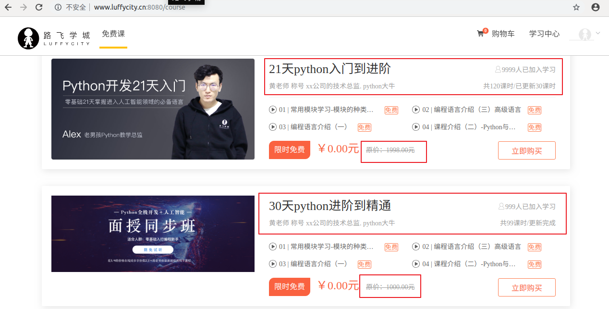

# 课程列表页

### 客户端发送请求获取课程列表信息

```vue
<template>
  <div class="course">
    <Header></Header>
    <div class="main">
      <!-- 筛选条件 -->
      <div class="condition">
        <ul class="cate-list">
          <li class="title">课程分类:</li>
          <li :class="filter.category == 0?'this':''" @click="filter.category=0">全部</li>
          <li :class="filter.category == category.id?'this':''" @click="filter.category=category.id" v-for="category in category_list" :key="category.id">{{category.name}}</li>
        </ul>

        <div class="ordering">
          <ul>
            <li class="title">筛&nbsp;&nbsp;&nbsp;&nbsp;&nbsp;&nbsp;&nbsp;&nbsp;选: </li>
            <li class="default this">默认</li>
            <li class="hot this">人气</li>
            <li class="price this">价格</li>
          </ul>
          <p class="condition-result">共{{course_list.length}}个课程</p>
        </div>

      </div>
      <!-- 课程列表 -->
      <div class="course-list">
        <div class="course-item" v-for="course in course_list" :key="course.id">
          <div class="course-image">
            
          </div>
          <div class="course-info">
            <h3><router-link :to="`/course/detail/${course.id}`">{{course.name}}</router-link> <span>{{course.students}}人已加入学习</span></h3>
            <p class="teather-info">{{course.teacher.name}} {{course.teacher.signature}} {{course.teacher.title}} <span>共{{course.lessons}}课时/{{course.lessons==course.pub_lessons?'更新完成':`已更新${course.pub_lessons}课时`}}</span></p>
            <ul class="lesson-list">
              <li><span class="lesson-title">01 | 第1节：初识编码</span> <span class="free">免费</span></li>
              <li><span class="lesson-title">01 | 第1节：初识编码初识编码</span> <span class="free">免费</span></li>
              <li><span class="lesson-title">01 | 第1节：初识编码</span> <span class="free">免费</span></li>
              <li><span class="lesson-title">01 | 第1节：初识编码初识编码初识编码初识编码</span> <span class="free">免费</span></li>
            </ul>
            <div class="pay-box">
              <span class="discount-type">限时免费</span>
              <span class="discount-price">￥0.00元</span>
              <span class="original-price">原价：{{course.price}}元</span>
              <span class="buy-now">立即购买</span>
            </div>
          </div>
        </div>
      </div>
    </div>
    <Footer></Footer>
  </div>
</template>

<script>
  import Header from "./common/Header"
  import Footer from "./common/Footer"
  export default {
      name: "Course",
      data(){
        return{
          course_list: [],
          category_list: [],
          filter:{
              category: 0,
          }
        }
      },
      components:{
        Header,
        Footer,
      },
      created(){
        this.get_course_category();
        this.get_course();
      },
      methods:{
          get_course_category(){
              // 获取课程分类信息
              this.$axios.get(`${this.$settings.Host}/course/category/`).then(response=>{
                  this.category_list = response.data;
              }).catch(error=>{
                  console.log(error.response);
              });
          },
          get_course(){
              // 获取课程信息
              this.$axios.get(`${this.$settings.Host}/course/`).then(response=>{
                  this.course_list = response.data;
              }).catch(error=>{
                  console.log(error.response);
              })
          }
      }
  }
</script>


<style scoped>
  .course{
    background: #f6f6f6;
  }
  .course .main{
    width: 1100px;
    margin: 35px auto 0;
  }
  .course .condition{
    margin-bottom: 35px;
    padding: 25px 30px 25px 20px;
    background: #fff;
    border-radius: 4px;
    box-shadow: 0 2px 4px 0 #f0f0f0;
  }
  .course .cate-list{
    border-bottom: 1px solid #333;
    border-bottom-color: rgba(51,51,51,.05);
    padding-bottom: 18px;
    margin-bottom: 17px;
  }
  .course .cate-list::after{
    content:"";
    display: block;
    clear: both;
  }
  .course .cate-list li{
    float: left;
    font-size: 16px;
    padding: 6px 15px;
    line-height: 16px;
    margin-left: 14px;
    position: relative;
    transition: all .3s ease;
    cursor: pointer;
    color: #4a4a4a;
    border: 1px solid transparent; /* transparent 透明 */
  }
  .course .cate-list .title{
    color: #888;
    margin-left: 0;
    letter-spacing: .36px;
    padding: 0;
    line-height: 28px;
  }
  .course .cate-list .this{
    color: #ffc210;
    border: 1px solid #ffc210!important;
    border-radius: 30px;
  }
  .course .ordering::after{
    content:"";
    display: block;
    clear: both;
  }
  .course .ordering ul{
    float: left;
  }
  .course .ordering ul::after{
    content:"";
    display: block;
    clear: both;
  }
  .course .ordering .condition-result{
    float: right;
    font-size: 14px;
    color: #9b9b9b;
    line-height: 28px;
  }
  .course .ordering ul li{
    float: left;
    padding: 6px 15px;
    line-height: 16px;
    margin-left: 14px;
    position: relative;
    transition: all .3s ease;
    cursor: pointer;
    color: #4a4a4a;
  }
  .course .ordering .title{
    font-size: 16px;
    color: #888;
    letter-spacing: .36px;
    margin-left: 0;
    padding:0;
    line-height: 28px;
  }
  .course .ordering .this{
    color: #ffc210;
  }
  .course .ordering .price{
    position: relative;
  }
  .course .ordering .price::before,
  .course .ordering .price::after{
    cursor: pointer;
    content:"";
    display: block;
    width: 0px;
    height: 0px;
    border: 5px solid transparent;
    position: absolute;
    right: 0;
  }
  .course .ordering .price::before{
    border-bottom: 5px solid #aaa;
    margin-bottom: 2px;
    top: 2px;
  }
  .course .ordering .price::after{
    border-top: 5px solid #aaa;
    bottom: 2px;
  }
  .course .course-item:hover{
    box-shadow: 4px 6px 16px rgba(0,0,0,.5);
  }
  .course .course-item{
    width: 1050px;
    background: #fff;
    padding: 20px 30px 20px 20px;
    margin-bottom: 35px;
    border-radius: 2px;
    cursor: pointer;
    box-shadow: 2px 3px 16px rgba(0,0,0,.1);
    /* css3.0 过渡动画 hover 事件操作 */
    transition: all .2s ease;
  }
  .course .course-item::after{
    content:"";
    display: block;
    clear: both;
  }
  /* 顶级元素 父级元素  当前元素{} */
  .course .course-item .course-image{
    float: left;
    width: 423px;
    height: 210px;
    margin-right: 30px;
  }
  .course .course-item .course-image img{
    width: 100%;
    max-height: 100%;
  }
  .course .course-item .course-info{
    float: left;
    width: 596px;
  }
  .course-item .course-info h3  a{
    font-size: 26px;
    color: #333;
    font-weight: normal;
    margin-bottom: 8px;
  }
  .course-item .course-info h3 span{
    font-size: 14px;
    color: #9b9b9b;
    float: right;
    margin-top: 14px;
  }
  .course-item .course-info h3 span img{
      width: 11px;
      height: auto;
      margin-right: 7px;
  }
  .course-item .course-info .teather-info{
      font-size: 14px;
      color: #9b9b9b;
      margin-bottom: 14px;
      padding-bottom: 14px;
      border-bottom: 1px solid #333;
      border-bottom-color: rgba(51,51,51,.05);
  }
  .course-item .course-info .teather-info span{
      float: right;
  }
  .course-item .lesson-list::after{
      content:"";
      display: block;
      clear: both;
  }
  .course-item .lesson-list li {
    float: left;
    width: 44%;
    font-size: 14px;
    color: #666;
    padding-left: 22px;
    /* background: url("路径") 是否平铺 x轴位置 y轴位置 */
    background: url("/static/image/play-icon-gray.svg") no-repeat left 4px;
    margin-bottom: 15px;
  }
  .course-item .lesson-list li .lesson-title{
      /* 以下3句，文本内容过多，会自动隐藏，并显示省略符号 */
      text-overflow: ellipsis;
      overflow: hidden;
      white-space: nowrap;
      display:inline-block;
      max-width: 200px;
  }
  .course-item .lesson-list li:hover{
      background-image: url("/static/image/play-icon-yellow.svg");
      color: #ffc210;
  }
  .course-item .lesson-list li .free{
      width: 34px;
      height: 20px;
      color: #fd7b4d;
      vertical-align: super;
      margin-left: 10px;
      border: 1px solid #fd7b4d;
      border-radius: 2px;
      text-align: center;
      font-size: 13px;
      white-space: nowrap;
  }
  .course-item .lesson-list li:hover .free{
      color: #ffc210;
      border-color: #ffc210;
  }
  .course-item .pay-box::after{
    content:"";
    display: block;
    clear: both;
  }
  .course-item .pay-box .discount-type{
    padding: 6px 10px;
    font-size: 16px;
    color: #fff;
    text-align: center;
    margin-right: 8px;
    background: #fa6240;
    border: 1px solid #fa6240;
    border-radius: 10px 0 10px 0;
    float: left;
  }
  .course-item .pay-box .discount-price{
    font-size: 24px;
    color: #fa6240;
    float: left;
  }
  .course-item .pay-box .original-price{
    text-decoration: line-through;
    font-size: 14px;
    color: #9b9b9b;
    margin-left: 10px;
    float: left;
    margin-top: 10px;
  }
  .course-item .pay-box .buy-now{
    width: 120px;
    height: 38px;
    background: transparent;
    color: #fa6240;
    font-size: 16px;
    border: 1px solid #fd7b4d;
    border-radius: 3px;
    transition: all .2s ease-in-out;
    float: right;
    text-align: center;
    line-height: 38px;
  }
  .course-item .pay-box .buy-now:hover{
    color: #fff;
    background: #ffc210;
    border: 1px solid #ffc210;
  }
</style>

```





### 客户端的课程列表显示当前课程的章节信息

因为课程中的部分课时需要展示到列表页中进行营销推广,所以我们可以设置给课时模型,增加2个字段

```python
class CourseLesson(BaseModel):
    """课程课时"""
    section_type_choices = (
        (0, '文档'),
        (1, '练习'),
        (2, '视频')
    )
    chapter = models.ForeignKey("CourseChapter", related_name='coursesections', on_delete=models.CASCADE,verbose_name="课程章节")
    name = models.CharField(max_length=128,verbose_name = "课时标题")
    section_type = models.SmallIntegerField(default=2, choices=section_type_choices, verbose_name="课时种类")
    section_link = models.CharField(max_length=255, blank=True, null=True, verbose_name="课时链接", help_text = "若是video，填vid,若是文档，填link")
    duration = models.CharField(verbose_name="视频时长", blank=True, null=True, max_length=32)  # 仅在前端展示使用
    pub_date = models.DateTimeField(verbose_name="发布时间", auto_now_add=True)
    free_trail = models.BooleanField(verbose_name="是否可试看", default=False)
    course = models.ForeignKey('Course',related_name='course_lesson',verbose_name='课程',on_delete=models.CASCADE,null=True,blank=True)
    is_show_list = models.BooleanField(verbose_name="是否推荐到课程列表", default=False)
		lesson = models.IntegerField(verbose_name="第几课时")
    class Meta:
        db_table = "ly_course_lesson"
        verbose_name = "课程课时"
        verbose_name_plural = "课程课时"

    def __str__(self):
        return "%s-%s" % (self.chapter, self.name)
```

数据迁移

```python
python manage.py makemigrations
python manage.py migrate
```


添加课程章节的测试数据

```sql
INSERT INTO `ly_course_chapter` VALUES (1,1,1,0,'2019-08-13 07:24:21.889515','2019-08-13 07:24:21.889542',1,'flask框架快速入门','flask框架快速入门','2019-08-13',1),(2,2,1,0,'2019-08-13 07:24:37.116231','2019-08-15 03:59:17.598352',2,'flask的路由','flask的路由','2019-08-13',1),(3,3,1,0,'2019-08-13 07:24:51.153812','2019-08-15 03:59:22.067057',3,'flask的视图','flask的视图','2019-08-13',1),(4,4,1,0,'2019-08-13 07:25:00.621686','2019-08-15 03:59:29.642805',4,'flask的模型','flask的模型','2019-08-13',1),(5,5,1,0,'2019-08-13 07:24:21.889515','2019-08-13 07:24:21.889542',1,'django框架快速入门','django框架快速入门','2019-08-13',3),(6,6,1,0,'2019-08-13 07:24:37.116231','2019-08-13 07:24:37.116262',2,'django的路由','django的路由','2019-08-13',3),(7,7,1,0,'2019-08-13 07:24:51.153812','2019-08-13 07:24:51.153846',3,'django的视图','django的视图','2019-08-13',3),(8,8,1,0,'2019-08-13 07:25:00.621686','2019-08-13 07:25:00.621768',4,'django的模型','django的模型','2019-08-13',3);
```

添加课程课时的测试数据

```sql
INSERT INTO `ly_course_lesson`
(`id`,`is_show`,`is_deleted`,`created_time`,`updated_time`,`name`,`orders`,`section_type`,`section_link`,`duration`,`pub_date`,`free_trail`,`chapter_id`,`course_id`,`is_show_list`,`lesson`)
 VALUES
(1,1,0,'2019-08-13 07:27:06.873098','2019-08-13 07:27:06.873149','flask基本介绍',1,0,'http://www.baidu.com','3:00','2019-08-13 07:27:06.873188',1,1,1,1,1),
(2,1,0,'2019-08-13 07:27:27.408740','2019-08-13 07:27:27.408766','flask的优缺点',2,2,'http://www.baidu.com','3:30','2019-08-13 07:27:27.408798',1,1,1,0,2),
(3,1,0,'2019-08-13 07:27:45.659948','2019-08-13 07:27:45.659980','flask的安装',3,2,'http://www.baidu.com','5:00','2019-08-13 07:27:45.660016',0,1,1,1,3),
(13,1,0,'2019-08-13 07:27:06.873098','2019-08-13 07:27:06.873149','flask的项目搭建',4,2,'http://www.baidu.com','3:00','2019-08-13 07:27:06.873188',0,1,1,0,4),
(14,1,0,'2019-08-13 07:27:27.408740','2019-08-13 07:27:27.408766','flask的项目基本目录结构',5,2,'http://www.baidu.com','3:30','2019-08-13 07:27:27.408798',0,1,1,1,5),
(15,1,0,'2019-08-13 07:27:45.659948','2019-08-13 07:27:45.659980','flask的运行',6,2,'http://www.baidu.com','5:00','2019-08-13 07:27:45.660016',0,1,1,0,6),
(16,1,0,'2019-08-13 07:27:06.873098','2019-08-26 12:57:10.455292','django基本介绍',1,2,'7ec57198590152fd3a647d73e218e385_7','14:00','2019-08-13 07:27:06.873188',1,5,3,1,1),
(17,1,0,'2019-08-13 07:27:27.408740','2019-08-13 07:27:27.408766','django的优缺点',2,2,'http://www.baidu.com','3:30','2019-08-13 07:27:27.408798',1,5,3,0,2),
(18,1,0,'2019-08-13 07:27:45.659948','2019-08-14 02:13:52.517392','django的安装',3,2,'http://www.baidu.com','5:00','2019-08-13 07:27:45.660016',1,5,3,1,3),
(19,1,0,'2019-08-13 07:27:06.873098','2019-08-13 07:27:06.873149','django的项目搭建',4,2,'http://www.baidu.com','3:00','2019-08-13 07:27:06.873188',0,5,3,1,4),
(20,1,0,'2019-08-13 07:27:27.408740','2019-08-13 07:27:27.408766','django的项目基本目录结构',5,2,'http://www.baidu.com','3:30','2019-08-13 07:27:27.408798',0,5,3,1,5),
(21,1,0,'2019-08-13 07:27:45.659948','2019-08-13 07:27:45.659980','django的运行',6,2,'http://www.baidu.com','5:00','2019-08-13 07:27:45.660016',0,5,3,0,6),
(22,1,0,'2019-08-15 03:50:02.221829','2019-08-15 03:50:29.325498','路由的分类-命名绑定参数',1,2,'http://www.baidu.com','16:00','2019-08-15 03:50:02.221897',0,2,1,1,1);

```


完成上面功能,有2种不同方案

第一,可以通过序列化器嵌套来完成，但是查询过程的数量不好控制。以下代码仅供参考：

```python
from .models import CourseLesson
class CourseLessonModelSerializer(serializers.ModelSerializer):
    class Meta:
        model = CourseLesson
        fields = ("id","name","free_trail")

from .models import CourseChapter
class CourseChapterModelSerializer(serializers.ModelSerializer):
    coursesections = CourseLessonModelSerializer(many=True)
    class Meta:
        model = CourseChapter
        fields = ("id", "name", "coursesections")

from .models import Course
class CourseModelSerializer(serializers.ModelSerializer):
    teacher = TeacherModelSerializer()
    coursechapters = CourseChapterModelSerializer(many=True)  # 课程章节多个,所以需要声明 many=True
    class Meta:
        model = Course
        fields = ("id", "name", "course_img", "students", "lessons", "pub_lessons", "price", "teacher","coursechapters")
```


第二, 我们还可以通过在models模型中给数据模型增加自定义字段来完成获取课时功能。[ 推荐 ]

```python
class Course(BaseModel):
    """
    专题课程
    """
    course_type = (
        (0, '付费课程'),
        (1, 'VIP专享'),
        (2, '学位课程')
    )
    level_choices = (
        (0, '初级'),
        (1, '中级'),
        (2, '高级'),
    )
    status_choices = (
        (0, '上线'),
        (1, '下线'),
        (2, '预上线'),
    )
    name = models.CharField(max_length=128, verbose_name="课程名称")
    course_img = models.ImageField(upload_to="course", max_length=255, verbose_name="封面图片", blank=True, null=True)
    course_type = models.SmallIntegerField(choices=course_type,default=0, verbose_name="付费类型")
    # 使用这个字段的原因
    brief = models.TextField(max_length=2048, verbose_name="详情介绍", null=True, blank=True)
    level = models.SmallIntegerField(choices=level_choices, default=1, verbose_name="难度等级")
    pub_date = models.DateField(verbose_name="发布日期", auto_now_add=True)
    period = models.IntegerField(verbose_name="建议学习周期(day)", default=7)
    attachment_path = models.FileField(max_length=128, verbose_name="课件路径", blank=True, null=True)
    status = models.SmallIntegerField(choices=status_choices, default=0, verbose_name="课程状态")
    course_category = models.ForeignKey("CourseCategory", on_delete=models.CASCADE, null=True, blank=True,verbose_name="课程分类")
    students = models.IntegerField(verbose_name="学习人数",default = 0)
    lessons = models.IntegerField(verbose_name="总课时数量",default = 0)
    pub_lessons = models.IntegerField(verbose_name="课时更新数量",default = 0)
    price = models.DecimalField(max_digits=6,decimal_places=2, verbose_name="课程原价",default=0)
    teacher = models.ForeignKey("Teacher",on_delete=models.DO_NOTHING, null=True, blank=True,verbose_name="授课老师")
    class Meta:
        db_table = "ly_course"
        verbose_name = "专题课程"
        verbose_name_plural = "专题课程"

    def __str__(self):
        return "%s" % self.name

    @property
    def lessons_list(self):
        """展示课程列表页中推荐的4个课时信息"""
        data_list = []
        lesson_list = CourseLesson.objects.filter(is_show=True, is_deleted=False, course_id=self.id, is_show_list=True).all()
        for lesson in lesson_list:
            data_list.append({
                "id": lesson.id,
                "name": lesson.name,
                "lesson": lesson.lesson,
                "free_trail": lesson.free_trail
            })
        return data_list[:4]
```


序列化器字段增加自定义的模型字段，

```python
class CourseModelSerializer(serializers.ModelSerializer):
    # 默认情况,序列化器转换模型数据时,默认会把外键直接转成主键ID值
    # 所以我们需要重新设置在序列化器中针对外键的序列化
    # 这种操作就是一个序列器里面调用另一个序列化器了.叫"序列化器嵌套"
    teacher = TeacherModelSerializer()
    # coursechapters = CourseChapterModelSerializer(many=True)
    class Meta:
        model = Course
        fields = ("id","name","course_img","students","lessons","pub_lessons","price","teacher","lesson_list")
```


### 前端显示课程章节信息

```vue
<template>
  <div class="course">
    <Header></Header>
    <div class="main">
      <!-- 筛选条件 -->
      <div class="condition">
        <ul class="cate-list">
          <li class="title">课程分类:</li>
          <li @click="category=0" :class="category==0?'this':''">全部</li>
          <li @click="category=cat.id" :class="category==cat.id?'this':''" v-for="cat in category_list">{{cat.name}}</li>
        </ul>

        <div class="ordering">
          <ul>
            <li class="title">筛&nbsp;&nbsp;&nbsp;&nbsp;&nbsp;&nbsp;&nbsp;&nbsp;选: </li>
            <li @click="change_order_type(0)" class="default" :class="change_order_class(0)">默认</li>
            <li @click="change_order_type(1)" class="hot" :class="change_order_class(1)">人气</li>
            <li @click="change_order_type(2)" class="price" :class="change_order_class(2)">价格</li>

<!--            <li @click="filters.type=0" class="default" :class="filters.type==0?'this':''">默认</li>-->
<!--            <li @click="filters.type=1" class="hot" :class="filters.type==1?'this':''">人气</li>-->
<!--            <li @click="filters.type=2" class="price" :class="filters.type==2?'this':''">价格</li>-->
          </ul>
          <p class="condition-result">共21个课程</p>
        </div>

      </div>
      <!-- 课程列表 -->
      <div class="course-list">
        <div class="course-item" v-for="course in course_list">
          <div class="course-image">
            
          </div>
          <div class="course-info">
            <h3><router-link to="/course/detail/1">{{course.name}}</router-link> <span>{{course.students}}人已加入学习</span></h3>
            <p class="teather-info">{{course.teacher.name}} {{course.teacher.signature}} {{course.teacher.title}} <span>共{{course.lessons}}课时/{{course.pub_lessons==course.lessons?'更新完成':`已更新${course.pub_lessons}课时`}}</span></p>
            <ul class="lesson-list">
              <li v-for="lesson,key in course.lessons_list"><span class="lesson-title">0{{key}} | 第{{lesson.lesson}}节：{{lesson.name}}</span> <span class="free" v-if="lesson.free_trail">免费</span></li>
<!--              <li><span class="lesson-title">01 | 第1节：初识编码初识编码</span> <span class="free">免费</span></li>-->
<!--              <li><span class="lesson-title">01 | 第1节：初识编码</span> <span class="free">免费</span></li>-->
<!--              <li><span class="lesson-title">01 | 第1节：初识编码初识编码初识编码初识编码</span> <span class="free">免费</span></li>-->
            </ul>
            <div class="pay-box">
              <span class="discount-type">限时免费</span>
              <span class="discount-price">￥0.00元</span>
              <span class="original-price">原价：{{course.price}}元</span>
              <span class="buy-now">立即购买</span>
            </div>
          </div>
        </div>
      </div>
    </div>
    <Footer></Footer>
  </div>
</template>

<script>
  import Header from "./common/Header"
  import Footer from "./common/Footer"
  export default {
      name: "Course",
      data(){
        return{
          category: 0,
          category_list:[],
          course_list: [],
          filters:{
              type: 0, // 筛选类型，0表示默认，1表示人气,2表示价格
              orders: "desc",  // 排序类型，desc表示降序，asc表示升序
          }
        }
      },
      created(){
        this.get_course_category();
        this.get_course();
      },
      methods:{
        get_course_category(){
            // 获取课程分类信息
            this.$axios.get(`${this.$settings.HOST}/course/category/`).then(response=>{
                this.category_list = response.data;
            })
        },
        get_course(){
            this.$axios.get(`${this.$settings.HOST}/course/`).then(response=>{
                this.course_list = response.data;
            })
        },
        change_order_type(type){
            // 更改升序或者降序
            if( this.filters.type === type && this.filters.orders === "desc" ){
                this.filters.orders="asc";
            }else if(this.filters.type === type && this.filters.orders === "asc"){
                this.filters.orders="desc";
            }

            // 更改排序方式
            this.filters.type=type;
        },
        change_order_class(type){
            // 更改当前选中筛选条件的高亮方式
            if( this.filters.type === type && this.filters.orders === "asc" ){
              return "this asc";
            }else if(this.filters.type===type && this.filters.orders === "desc"){
              return "this desc";
            }else{
              return "";
            }
        }
      },
      components:{
        Header,
        Footer,
      }
  }
</script>


<style scoped>
  .course{
    background: #f6f6f6;
  }
  .course .main{
    width: 1100px;
    margin: 35px auto 0;
  }
  .course .condition{
    margin-bottom: 35px;
    padding: 25px 30px 25px 20px;
    background: #fff;
    border-radius: 4px;
    box-shadow: 0 2px 4px 0 #f0f0f0;
  }
  .course .cate-list{
    border-bottom: 1px solid #333;
    border-bottom-color: rgba(51,51,51,.05);
    padding-bottom: 18px;
    margin-bottom: 17px;
  }
  .course .cate-list::after{
    content:"";
    display: block;
    clear: both;
  }
  .course .cate-list li{
    float: left;
    font-size: 16px;
    padding: 6px 15px;
    line-height: 16px;
    margin-left: 14px;
    position: relative;
    transition: all .3s ease;
    cursor: pointer;
    color: #4a4a4a;
    border: 1px solid transparent; /* transparent 透明 */
  }
  .course .cate-list .title{
    color: #888;
    margin-left: 0;
    letter-spacing: .36px;
    padding: 0;
    line-height: 28px;
  }
  .course .cate-list .this{
    color: #ffc210;
    border: 1px solid #ffc210!important;
    border-radius: 30px;
  }
  .course .ordering::after{
    content:"";
    display: block;
    clear: both;
  }
  .course .ordering ul{
    float: left;
  }
  .course .ordering ul::after{
    content:"";
    display: block;
    clear: both;
  }
  .course .ordering .condition-result{
    float: right;
    font-size: 14px;
    color: #9b9b9b;
    line-height: 28px;
  }
  .course .ordering ul li{
    float: left;
    padding: 6px 15px;
    line-height: 16px;
    margin-left: 14px;
    position: relative;
    transition: all .3s ease;
    cursor: pointer;
    color: #4a4a4a;
  }
  .course .ordering .title{
    font-size: 16px;
    color: #888;
    letter-spacing: .36px;
    margin-left: 0;
    padding:0;
    line-height: 28px;
  }
  .course .ordering .this{
    color: #ffc210;
    position: relative;
  }
  .course .ordering .this::before,
  .course .ordering .this::after{
    cursor: pointer;
    content:"";
    display: block;
    width: 0px;
    height: 0px;
    border: 5px solid transparent;
    position: absolute;
    right: 0;
  }
  .course .ordering .this::before{
    border-bottom: 5px solid #aaa;
    margin-bottom: 2px;
    top: 2px;
  }
  .course .ordering .this::after{
    border-top: 5px solid #aaa;
    bottom: 2px;
  }
  .course .ordering .asc::before{
    border-bottom-color: #ffc210;
  }
  .course .ordering .desc::after{
    border-top-color: #ffc210;
  }
  .course .course-item:hover{
    box-shadow: 4px 6px 16px rgba(0,0,0,.5);
  }
  .course .course-item{
    width: 1050px;
    background: #fff;
    padding: 20px 30px 20px 20px;
    margin-bottom: 35px;
    border-radius: 2px;
    cursor: pointer;
    box-shadow: 2px 3px 16px rgba(0,0,0,.1);
    /* css3.0 过渡动画 hover 事件操作 */
    transition: all .2s ease;
  }
  .course .course-item::after{
    content:"";
    display: block;
    clear: both;
  }
  /* 顶级元素 父级元素  当前元素{} */
  .course .course-item .course-image{
    float: left;
    width: 423px;
    height: 210px;
    margin-right: 30px;
  }
  .course .course-item .course-image img{
    width: 100%;
  }
  .course .course-item .course-info{
    float: left;
    width: 596px;
  }
  .course-item .course-info h3 {
    font-size: 26px;
    color: #333;
    font-weight: normal;
    margin-bottom: 8px;
  }
  .course-item .course-info h3 span{
    font-size: 14px;
    color: #9b9b9b;
    float: right;
    margin-top: 14px;
  }
  .course-item .course-info h3 span img{
      width: 11px;
      height: auto;
      margin-right: 7px;
  }
  .course-item .course-info .teather-info{
      font-size: 14px;
      color: #9b9b9b;
      margin-bottom: 14px;
      padding-bottom: 14px;
      border-bottom: 1px solid #333;
      border-bottom-color: rgba(51,51,51,.05);
  }
  .course-item .course-info .teather-info span{
      float: right;
  }
  .course-item .lesson-list::after{
      content:"";
      display: block;
      clear: both;
  }
  .course-item .lesson-list li {
    float: left;
    width: 44%;
    font-size: 14px;
    color: #666;
    padding-left: 22px;
    /* background: url("路径") 是否平铺 x轴位置 y轴位置 */
    background: url("/static/image/play-icon-gray.svg") no-repeat left 4px;
    margin-bottom: 15px;
  }
  .course-item .lesson-list li .lesson-title{
      /* 以下3句，文本内容过多，会自动隐藏，并显示省略符号 */
      text-overflow: ellipsis;
      overflow: hidden;
      white-space: nowrap;
      display:inline-block;
      max-width: 200px;
  }
  .course-item .lesson-list li:hover{
      background-image: url("/static/image/play-icon-yellow.svg");
      color: #ffc210;
  }
  .course-item .lesson-list li .free{
      width: 34px;
      height: 20px;
      color: #fd7b4d;
      vertical-align: super;
      margin-left: 10px;
      border: 1px solid #fd7b4d;
      border-radius: 2px;
      text-align: center;
      font-size: 13px;
      white-space: nowrap;
  }
  .course-item .lesson-list li:hover .free{
      color: #ffc210;
      border-color: #ffc210;
  }
  .course-item .pay-box::after{
    content:"";
    display: block;
    clear: both;
  }
  .course-item .pay-box .discount-type{
    padding: 6px 10px;
    font-size: 16px;
    color: #fff;
    text-align: center;
    margin-right: 8px;
    background: #fa6240;
    border: 1px solid #fa6240;
    border-radius: 10px 0 10px 0;
    float: left;
  }
  .course-item .pay-box .discount-price{
    font-size: 24px;
    color: #fa6240;
    float: left;
  }
  .course-item .pay-box .original-price{
    text-decoration: line-through;
    font-size: 14px;
    color: #9b9b9b;
    margin-left: 10px;
    float: left;
    margin-top: 10px;
  }
  .course-item .pay-box .buy-now{
    width: 120px;
    height: 38px;
    background: transparent;
    color: #fa6240;
    font-size: 16px;
    border: 1px solid #fd7b4d;
    border-radius: 3px;
    transition: all .2s ease-in-out;
    float: right;
    text-align: center;
    line-height: 38px;
  }
  .course-item .pay-box .buy-now:hover{
    color: #fff;
    background: #ffc210;
    border: 1px solid #ffc210;
  }
</style>

```


### 按照指定分类显示课程信息(过滤)

在当前项目中安装 字段过滤排序

```
pip install django-filter
```

在settings/dev.py配置文件中增加过滤后端的设置：

```python
INSTALLED_APPS = [
    ...
    'django_filters',  # 需要注册应用，
]

```

在视图中设置允许过滤的字段名和引入过滤字段核心类

```python
from .serializers import CourseModelSerializer
from django_filters.rest_framework import DjangoFilterBackend
class CourseAPIView(ListAPIView):
    queryset = Course.objects.filter(is_delete=False, is_show=True).order_by("orders")
    serializer_class = CourseModelSerializer
    filter_backends = [DjangoFilterBackend, ]
    filter_fields = ('course_category',)
    //127.0.0.1:8001/?course_category=1
```

vue组件Course.vue,代码:

```python
<template>
  <div class="course">
    <Header></Header>
    <div class="main">
      <!-- 筛选条件 -->
      <div class="condition">
        <ul class="cate-list">
          <li class="title">课程分类:</li>
          <li @click="category=0" :class="category==0?'this':''">全部</li>
          <li @click="category=cat.id" :class="category==cat.id?'this':''" v-for="cat in category_list">{{cat.name}}</li>
        </ul>

        <div class="ordering">
          <ul>
            <li class="title">筛&nbsp;&nbsp;&nbsp;&nbsp;&nbsp;&nbsp;&nbsp;&nbsp;选: </li>
            <li @click="change_order_type(0)" class="default" :class="change_order_class(0)">默认</li>
            <li @click="change_order_type(1)" class="hot" :class="change_order_class(1)">人气</li>
            <li @click="change_order_type(2)" class="price" :class="change_order_class(2)">价格</li>

<!--            <li @click="filters.type=0" class="default" :class="filters.type==0?'this':''">默认</li>-->
<!--            <li @click="filters.type=1" class="hot" :class="filters.type==1?'this':''">人气</li>-->
<!--            <li @click="filters.type=2" class="price" :class="filters.type==2?'this':''">价格</li>-->
          </ul>
          <p class="condition-result">共21个课程</p>
        </div>

      </div>
      <!-- 课程列表 -->
      <div class="course-list">
        <div class="course-item" v-for="course in course_list">
          <div class="course-image">
            
          </div>
          <div class="course-info">
            <h3><router-link to="/course/detail/1">{{course.name}}</router-link> <span>{{course.students}}人已加入学习</span></h3>
            <p class="teather-info">{{course.teacher.name}} {{course.teacher.signature}} {{course.teacher.title}} <span>共{{course.lessons}}课时/{{course.pub_lessons==course.lessons?'更新完成':`已更新${course.pub_lessons}课时`}}</span></p>
            <ul class="lesson-list">
              <li v-for="lesson,key in course.lessons_list"><span class="lesson-title">0{{key}} | 第{{lesson.lesson}}节：{{lesson.name}}</span> <span class="free" v-if="lesson.free_trail">免费</span></li>
<!--              <li><span class="lesson-title">01 | 第1节：初识编码初识编码</span> <span class="free">免费</span></li>-->
<!--              <li><span class="lesson-title">01 | 第1节：初识编码</span> <span class="free">免费</span></li>-->
<!--              <li><span class="lesson-title">01 | 第1节：初识编码初识编码初识编码初识编码</span> <span class="free">免费</span></li>-->
            </ul>
            <div class="pay-box">
              <span class="discount-type">限时免费</span>
              <span class="discount-price">￥0.00元</span>
              <span class="original-price">原价：{{course.price}}元</span>
              <span class="buy-now">立即购买</span>
            </div>
          </div>
        </div>
      </div>
    </div>
    <Footer></Footer>
  </div>
</template>

<script>
  import Header from "./common/Header"
  import Footer from "./common/Footer"
  export default {
      name: "Course",
      data(){
        return{
          category: 0,
          category_list:[],
          course_list: [],
          filters:{
              type: 0, // 筛选类型，0表示默认，1表示人气,2表示价格
              orders: "desc",  // 排序类型，desc表示降序，asc表示升序
          }
        }
      },
      watch:{
          category(){
              this.get_course();
          }
      },
      created(){
        this.get_course_category();
        this.get_course();
      },
      methods:{
        get_course_category(){
            // 获取课程分类信息
            this.$axios.get(`${this.$settings.HOST}/course/category/`).then(response=>{
                this.category_list = response.data;
            })
        },
        get_course(){
            let filters = {};
            // 判断是否要根据分类显示课程信息
            if( this.category > 0 ){
                filters.course_category = this.category;
            }
            
            this.$axios.get(`${this.$settings.HOST}/course/`,{
                params:filters
            }).then(response=>{
                this.course_list = response.data;
            });
        },
        change_order_type(type){
            // 更改升序或者降序
            if( this.filters.type === type && this.filters.orders === "desc" ){
                this.filters.orders="asc";
            }else if(this.filters.type === type && this.filters.orders === "asc"){
                this.filters.orders="desc";
            }

            // 更改排序方式
            this.filters.type=type;
        },
        change_order_class(type){
            // 更改当前选中筛选条件的高亮方式
            if( this.filters.type === type && this.filters.orders === "asc" ){
              return "this asc";
            }else if(this.filters.type===type && this.filters.orders === "desc"){
              return "this desc";
            }else{
              return "";
            }
        }
      },
      components:{
        Header,
        Footer,
      }
  }
</script>


<style scoped>
  .course{
    background: #f6f6f6;
  }
  .course .main{
    width: 1100px;
    margin: 35px auto 0;
  }
  .course .condition{
    margin-bottom: 35px;
    padding: 25px 30px 25px 20px;
    background: #fff;
    border-radius: 4px;
    box-shadow: 0 2px 4px 0 #f0f0f0;
  }
  .course .cate-list{
    border-bottom: 1px solid #333;
    border-bottom-color: rgba(51,51,51,.05);
    padding-bottom: 18px;
    margin-bottom: 17px;
  }
  .course .cate-list::after{
    content:"";
    display: block;
    clear: both;
  }
  .course .cate-list li{
    float: left;
    font-size: 16px;
    padding: 6px 15px;
    line-height: 16px;
    margin-left: 14px;
    position: relative;
    transition: all .3s ease;
    cursor: pointer;
    color: #4a4a4a;
    border: 1px solid transparent; /* transparent 透明 */
  }
  .course .cate-list .title{
    color: #888;
    margin-left: 0;
    letter-spacing: .36px;
    padding: 0;
    line-height: 28px;
  }
  .course .cate-list .this{
    color: #ffc210;
    border: 1px solid #ffc210!important;
    border-radius: 30px;
  }
  .course .ordering::after{
    content:"";
    display: block;
    clear: both;
  }
  .course .ordering ul{
    float: left;
  }
  .course .ordering ul::after{
    content:"";
    display: block;
    clear: both;
  }
  .course .ordering .condition-result{
    float: right;
    font-size: 14px;
    color: #9b9b9b;
    line-height: 28px;
  }
  .course .ordering ul li{
    float: left;
    padding: 6px 15px;
    line-height: 16px;
    margin-left: 14px;
    position: relative;
    transition: all .3s ease;
    cursor: pointer;
    color: #4a4a4a;
  }
  .course .ordering .title{
    font-size: 16px;
    color: #888;
    letter-spacing: .36px;
    margin-left: 0;
    padding:0;
    line-height: 28px;
  }
  .course .ordering .this{
    color: #ffc210;
    position: relative;
  }
  .course .ordering .this::before,
  .course .ordering .this::after{
    cursor: pointer;
    content:"";
    display: block;
    width: 0px;
    height: 0px;
    border: 5px solid transparent;
    position: absolute;
    right: 0;
  }
  .course .ordering .this::before{
    border-bottom: 5px solid #aaa;
    margin-bottom: 2px;
    top: 2px;
  }
  .course .ordering .this::after{
    border-top: 5px solid #aaa;
    bottom: 2px;
  }
  .course .ordering .asc::before{
    border-bottom-color: #ffc210;
  }
  .course .ordering .desc::after{
    border-top-color: #ffc210;
  }
  .course .course-item:hover{
    box-shadow: 4px 6px 16px rgba(0,0,0,.5);
  }
  .course .course-item{
    width: 1050px;
    background: #fff;
    padding: 20px 30px 20px 20px;
    margin-bottom: 35px;
    border-radius: 2px;
    cursor: pointer;
    box-shadow: 2px 3px 16px rgba(0,0,0,.1);
    /* css3.0 过渡动画 hover 事件操作 */
    transition: all .2s ease;
  }
  .course .course-item::after{
    content:"";
    display: block;
    clear: both;
  }
  /* 顶级元素 父级元素  当前元素{} */
  .course .course-item .course-image{
    float: left;
    width: 423px;
    height: 210px;
    margin-right: 30px;
  }
  .course .course-item .course-image img{
    width: 100%;
  }
  .course .course-item .course-info{
    float: left;
    width: 596px;
  }
  .course-item .course-info h3 {
    font-size: 26px;
    color: #333;
    font-weight: normal;
    margin-bottom: 8px;
  }
  .course-item .course-info h3 span{
    font-size: 14px;
    color: #9b9b9b;
    float: right;
    margin-top: 14px;
  }
  .course-item .course-info h3 span img{
      width: 11px;
      height: auto;
      margin-right: 7px;
  }
  .course-item .course-info .teather-info{
      font-size: 14px;
      color: #9b9b9b;
      margin-bottom: 14px;
      padding-bottom: 14px;
      border-bottom: 1px solid #333;
      border-bottom-color: rgba(51,51,51,.05);
  }
  .course-item .course-info .teather-info span{
      float: right;
  }
  .course-item .lesson-list::after{
      content:"";
      display: block;
      clear: both;
  }
  .course-item .lesson-list li {
    float: left;
    width: 44%;
    font-size: 14px;
    color: #666;
    padding-left: 22px;
    /* background: url("路径") 是否平铺 x轴位置 y轴位置 */
    background: url("/static/image/play-icon-gray.svg") no-repeat left 4px;
    margin-bottom: 15px;
  }
  .course-item .lesson-list li .lesson-title{
      /* 以下3句，文本内容过多，会自动隐藏，并显示省略符号 */
      text-overflow: ellipsis;
      overflow: hidden;
      white-space: nowrap;
      display:inline-block;
      max-width: 200px;
  }
  .course-item .lesson-list li:hover{
      background-image: url("/static/image/play-icon-yellow.svg");
      color: #ffc210;
  }
  .course-item .lesson-list li .free{
      width: 34px;
      height: 20px;
      color: #fd7b4d;
      vertical-align: super;
      margin-left: 10px;
      border: 1px solid #fd7b4d;
      border-radius: 2px;
      text-align: center;
      font-size: 13px;
      white-space: nowrap;
  }
  .course-item .lesson-list li:hover .free{
      color: #ffc210;
      border-color: #ffc210;
  }
  .course-item .pay-box::after{
    content:"";
    display: block;
    clear: both;
  }
  .course-item .pay-box .discount-type{
    padding: 6px 10px;
    font-size: 16px;
    color: #fff;
    text-align: center;
    margin-right: 8px;
    background: #fa6240;
    border: 1px solid #fa6240;
    border-radius: 10px 0 10px 0;
    float: left;
  }
  .course-item .pay-box .discount-price{
    font-size: 24px;
    color: #fa6240;
    float: left;
  }
  .course-item .pay-box .original-price{
    text-decoration: line-through;
    font-size: 14px;
    color: #9b9b9b;
    margin-left: 10px;
    float: left;
    margin-top: 10px;
  }
  .course-item .pay-box .buy-now{
    width: 120px;
    height: 38px;
    background: transparent;
    color: #fa6240;
    font-size: 16px;
    border: 1px solid #fd7b4d;
    border-radius: 3px;
    transition: all .2s ease-in-out;
    float: right;
    text-align: center;
    line-height: 38px;
  }
  .course-item .pay-box .buy-now:hover{
    color: #fff;
    background: #ffc210;
    border: 1px solid #ffc210;
  }
</style>
```


### 排序显示课程

后端提供排序课程的接口

把原来views.py中的CoursesAPIView新增两句代码:

```python
from .models import Course
from .serializers import CourseModelSerializer
from django_filters.rest_framework import DjangoFilterBackend
from rest_framework.filters import OrderingFilter
class CourseListAPIView(ListAPIView):
    """课程列表"""
    queryset = Course.objects.filter(is_show=True, is_deleted=False).order_by("orders","-id")
    serializer_class = CourseModelSerializer
    filter_backends = [DjangoFilterBackend, OrderingFilter]
    filter_fields = ('course_category',)
    ordering_fields = ('id', 'students', 'price')
```


### 前端根据排序字段对应的课程顺序

组件html代码

```html
<template>
  <div class="course">
    <Header></Header>
    <div class="main">
      <!-- 筛选条件 -->
      <div class="condition">
        <ul class="cate-list">
          <li class="title">课程分类:</li>
          <li @click="category=0" :class="category==0?'this':''">全部</li>
          <li @click="category=cat.id" :class="category==cat.id?'this':''" v-for="cat in category_list">{{cat.name}}</li>
        </ul>

        <div class="ordering">
          <ul>
            <li class="title">筛&nbsp;&nbsp;&nbsp;&nbsp;&nbsp;&nbsp;&nbsp;&nbsp;选: </li>
            <li @click="change_order_type('id')" class="default" :class="change_order_class('id')">默认</li>
            <li @click="change_order_type('students')" class="hot" :class="change_order_class('students')">人气</li>
            <li @click="change_order_type('price')" class="price" :class="change_order_class('price')">价格</li>

<!--            <li @click="filters.type=0" class="default" :class="filters.type==0?'this':''">默认</li>-->
<!--            <li @click="filters.type=1" class="hot" :class="filters.type==1?'this':''">人气</li>-->
<!--            <li @click="filters.type=2" class="price" :class="filters.type==2?'this':''">价格</li>-->
          </ul>
          <p class="condition-result">共21个课程</p>
        </div>

      </div>
      <!-- 课程列表 -->
      <div class="course-list">
        <div class="course-item" v-for="course in course_list">
          <div class="course-image">
            
          </div>
          <div class="course-info">
            <h3><router-link to="/course/detail/1">{{course.name}}</router-link> <span>{{course.students}}人已加入学习</span></h3>
            <p class="teather-info">{{course.teacher.name}} {{course.teacher.signature}} {{course.teacher.title}} <span>共{{course.lessons}}课时/{{course.pub_lessons==course.lessons?'更新完成':`已更新${course.pub_lessons}课时`}}</span></p>
            <ul class="lesson-list">
              <li v-for="lesson,key in course.lessons_list"><span class="lesson-title">0{{key}} | 第{{lesson.lesson}}节：{{lesson.name}}</span> <span class="free" v-if="lesson.free_trail">免费</span></li>
<!--              <li><span class="lesson-title">01 | 第1节：初识编码初识编码</span> <span class="free">免费</span></li>-->
<!--              <li><span class="lesson-title">01 | 第1节：初识编码</span> <span class="free">免费</span></li>-->
<!--              <li><span class="lesson-title">01 | 第1节：初识编码初识编码初识编码初识编码</span> <span class="free">免费</span></li>-->
            </ul>
            <div class="pay-box">
              <span class="discount-type">限时免费</span>
              <span class="discount-price">￥0.00元</span>
              <span class="original-price">原价：{{course.price}}元</span>
              <span class="buy-now">立即购买</span>
            </div>
          </div>
        </div>
      </div>
    </div>
    <Footer></Footer>
  </div>
</template>

<script>
  import Header from "./common/Header"
  import Footer from "./common/Footer"
  export default {
      name: "Course",
      data(){
        return{
          category: 0,
          category_list:[],
          course_list: [],
          filters:{
              type: "id", // 筛选类型，id表示默认，students表示人气,price表示价格
              orders: "desc",  // 排序类型[控制样式]，desc表示降序，asc表示升序
          }
        }
      },
      watch:{
          category(){
              this.get_course();
          }
      },
      created(){
        this.get_course_category();
        this.get_course();
      },
      methods:{
        get_course_category(){
            // 获取课程分类信息
            this.$axios.get(`${this.$settings.HOST}/course/category/`).then(response=>{
                this.category_list = response.data;
            })
        },
        get_course(){
            let filters = {};

            if(this.filters.orders==="desc"){
                filters.ordering = "-"+this.filters.type;
            }else{
                filters.ordering = this.filters.type;
            }
            // 判断是否要根据分类显示课程信息
            if( this.category > 0 ){
                filters.course_category = this.category;
            }

            this.$axios.get(`${this.$settings.HOST}/course/`,{
                params:filters
            }).then(response=>{
                this.course_list = response.data;
            });
        },
        change_order_type(type){
            // 更改升序或者降序
            if( this.filters.type === type && this.filters.orders === "desc" ){
                this.filters.orders="asc";
            }else if( this.filters.type === type && this.filters.orders === "asc"){
                this.filters.orders="desc";
            }

            // 更改排序方式
            this.filters.type=type;
            // 重新获取课程
            this.get_course();
        },
        change_order_class(type){
            // 更改当前选中筛选条件的高亮方式
            if( this.filters.type === type && this.filters.orders === "asc" ){
              return "this asc";
            }else if(this.filters.type===type && this.filters.orders === "desc"){
              return "this desc";
            }else{
              return "";
            }
        }
      },
      components:{
        Header,
        Footer,
      }
  }
</script>


<style scoped>
  .course{
    background: #f6f6f6;
  }
  .course .main{
    width: 1100px;
    margin: 35px auto 0;
  }
  .course .condition{
    margin-bottom: 35px;
    padding: 25px 30px 25px 20px;
    background: #fff;
    border-radius: 4px;
    box-shadow: 0 2px 4px 0 #f0f0f0;
  }
  .course .cate-list{
    border-bottom: 1px solid #333;
    border-bottom-color: rgba(51,51,51,.05);
    padding-bottom: 18px;
    margin-bottom: 17px;
  }
  .course .cate-list::after{
    content:"";
    display: block;
    clear: both;
  }
  .course .cate-list li{
    float: left;
    font-size: 16px;
    padding: 6px 15px;
    line-height: 16px;
    margin-left: 14px;
    position: relative;
    transition: all .3s ease;
    cursor: pointer;
    color: #4a4a4a;
    border: 1px solid transparent; /* transparent 透明 */
  }
  .course .cate-list .title{
    color: #888;
    margin-left: 0;
    letter-spacing: .36px;
    padding: 0;
    line-height: 28px;
  }
  .course .cate-list .this{
    color: #ffc210;
    border: 1px solid #ffc210!important;
    border-radius: 30px;
  }
  .course .ordering::after{
    content:"";
    display: block;
    clear: both;
  }
  .course .ordering ul{
    float: left;
  }
  .course .ordering ul::after{
    content:"";
    display: block;
    clear: both;
  }
  .course .ordering .condition-result{
    float: right;
    font-size: 14px;
    color: #9b9b9b;
    line-height: 28px;
  }
  .course .ordering ul li{
    float: left;
    padding: 6px 15px;
    line-height: 16px;
    margin-left: 14px;
    position: relative;
    transition: all .3s ease;
    cursor: pointer;
    color: #4a4a4a;
  }
  .course .ordering .title{
    font-size: 16px;
    color: #888;
    letter-spacing: .36px;
    margin-left: 0;
    padding:0;
    line-height: 28px;
  }
  .course .ordering .this{
    color: #ffc210;
    position: relative;
  }
  .course .ordering .this::before,
  .course .ordering .this::after{
    cursor: pointer;
    content:"";
    display: block;
    width: 0px;
    height: 0px;
    border: 5px solid transparent;
    position: absolute;
    right: 0;
  }
  .course .ordering .this::before{
    border-bottom: 5px solid #aaa;
    margin-bottom: 2px;
    top: 2px;
  }
  .course .ordering .this::after{
    border-top: 5px solid #aaa;
    bottom: 2px;
  }
  .course .ordering .asc::before{
    border-bottom-color: #ffc210;
  }
  .course .ordering .desc::after{
    border-top-color: #ffc210;
  }
  .course .course-item:hover{
    box-shadow: 4px 6px 16px rgba(0,0,0,.5);
  }
  .course .course-item{
    width: 1050px;
    background: #fff;
    padding: 20px 30px 20px 20px;
    margin-bottom: 35px;
    border-radius: 2px;
    cursor: pointer;
    box-shadow: 2px 3px 16px rgba(0,0,0,.1);
    /* css3.0 过渡动画 hover 事件操作 */
    transition: all .2s ease;
  }
  .course .course-item::after{
    content:"";
    display: block;
    clear: both;
  }
  /* 顶级元素 父级元素  当前元素{} */
  .course .course-item .course-image{
    float: left;
    width: 423px;
    height: 210px;
    margin-right: 30px;
  }
  .course .course-item .course-image img{
    width: 100%;
  }
  .course .course-item .course-info{
    float: left;
    width: 596px;
  }
  .course-item .course-info h3 {
    font-size: 26px;
    color: #333;
    font-weight: normal;
    margin-bottom: 8px;
  }
  .course-item .course-info h3 span{
    font-size: 14px;
    color: #9b9b9b;
    float: right;
    margin-top: 14px;
  }
  .course-item .course-info h3 span img{
      width: 11px;
      height: auto;
      margin-right: 7px;
  }
  .course-item .course-info .teather-info{
      font-size: 14px;
      color: #9b9b9b;
      margin-bottom: 14px;
      padding-bottom: 14px;
      border-bottom: 1px solid #333;
      border-bottom-color: rgba(51,51,51,.05);
  }
  .course-item .course-info .teather-info span{
      float: right;
  }
  .course-item .lesson-list::after{
      content:"";
      display: block;
      clear: both;
  }
  .course-item .lesson-list li {
    float: left;
    width: 44%;
    font-size: 14px;
    color: #666;
    padding-left: 22px;
    /* background: url("路径") 是否平铺 x轴位置 y轴位置 */
    background: url("/static/image/play-icon-gray.svg") no-repeat left 4px;
    margin-bottom: 15px;
  }
  .course-item .lesson-list li .lesson-title{
      /* 以下3句，文本内容过多，会自动隐藏，并显示省略符号 */
      text-overflow: ellipsis;
      overflow: hidden;
      white-space: nowrap;
      display:inline-block;
      max-width: 200px;
  }
  .course-item .lesson-list li:hover{
      background-image: url("/static/image/play-icon-yellow.svg");
      color: #ffc210;
  }
  .course-item .lesson-list li .free{
      width: 34px;
      height: 20px;
      color: #fd7b4d;
      vertical-align: super;
      margin-left: 10px;
      border: 1px solid #fd7b4d;
      border-radius: 2px;
      text-align: center;
      font-size: 13px;
      white-space: nowrap;
  }
  .course-item .lesson-list li:hover .free{
      color: #ffc210;
      border-color: #ffc210;
  }
  .course-item .pay-box::after{
    content:"";
    display: block;
    clear: both;
  }
  .course-item .pay-box .discount-type{
    padding: 6px 10px;
    font-size: 16px;
    color: #fff;
    text-align: center;
    margin-right: 8px;
    background: #fa6240;
    border: 1px solid #fa6240;
    border-radius: 10px 0 10px 0;
    float: left;
  }
  .course-item .pay-box .discount-price{
    font-size: 24px;
    color: #fa6240;
    float: left;
  }
  .course-item .pay-box .original-price{
    text-decoration: line-through;
    font-size: 14px;
    color: #9b9b9b;
    margin-left: 10px;
    float: left;
    margin-top: 10px;
  }
  .course-item .pay-box .buy-now{
    width: 120px;
    height: 38px;
    background: transparent;
    color: #fa6240;
    font-size: 16px;
    border: 1px solid #fd7b4d;
    border-radius: 3px;
    transition: all .2s ease-in-out;
    float: right;
    text-align: center;
    line-height: 38px;
  }
  .course-item .pay-box .buy-now:hover{
    color: #fff;
    background: #ffc210;
    border: 1px solid #ffc210;
  }
</style>
```
