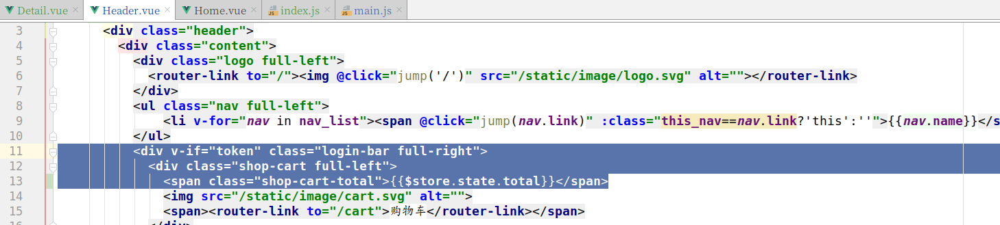

# 购物车实现

### 创建子应用 cart

```
cd luffyapi/apps
python ../../manage.py startapp cart
```


### 注册子应用cart

```python
INSTALLED_APPS = [
    'ckeditor',  # 富文本编辑器
    'ckeditor_uploader',  # 富文本编辑器上传图片模块

    'home',
    'users',
    'courses',
    'cart',
]
```


因为购物车中的商品(课程)信息会经常被用户操作,所以为了减轻mysql服务器的压力,可以选择把购物车信息通过redis来存储.

### 配置信息

```python
# 设置redis缓存
CACHES = {
    # 默认缓存
    ....
    
    "cart":{
        "BACKEND": "django_redis.cache.RedisCache",
        "LOCATION": "redis://127.0.0.1:6379/3",
        "OPTIONS": {
            "CLIENT_CLASS": "django_redis.client.DefaultClient",
        }
    },
}
```


接下来商品信息存储以下内容:

```python
购物车商品信息格式：
    商品数量[因为目前路飞学城的商品是视频，所以没有数量限制，如果以后做到真实商品，则必须有数量]
    
    商品id
    用户id
    课程有效期【一个课程有多个有效期选项，要记录用户勾选哪一个？】
    商品勾选状态【是否要结算】

    
五种数据类型
    string字符串
        键:值

    hash哈希字典
        键:{
            域:值,
        }
        
        user_id:{
          1:course_expire
          2:course_expire
          3:course_expire
        }
        
        user_id_selected:{1,2,3,4}  
        
    list列表
        键:[值1,值2,....]
    set集合
        键:{值1,值2,....}
    zset有序集合
        键:{
            权重值1:值,
            权重值2:值,
        }

经过比较可以发现没有一种数据类型，可以同时存储4个字段数据的，所以我们才有2种数据结构来保存购物车数据
可以发现，上面5种数据类型中，哈希hash可以存储的数据量是最多的。
hash：
    键[用户ID]:{
        域[商品ID]:值[课程有效期],
        域[商品ID]:值[课程有效期],
        域[商品ID]:值[课程有效期],
        域[商品ID]:值[课程有效期],
    }
set:    
    键[用户ID]:{商品ID1,商品ID2....}
```


## 添加课程商品到购物车的API接口实现

cart/views.py视图，代码：

```python
from rest_framework.viewsets import ViewSet
from rest_framework.permissions import IsAuthenticated
from course.models import Course
from rest_framework.response import Response
from rest_framework import status
from django_redis import get_redis_connection
import logging

log = logging.getLogger("django")

class CartAPIView(ViewSet):
    """购物车"""
    #permission_classes = [IsAuthenticated]
    permission_classes = [IsAuthenticated]
    def add(self,request):
        """添加商品到购物车中"""
        # 接受客户端提交参数[用户ID，课程ID，勾选状态，有效期选项]
        course_id = request.data.get("course_id")
        user_id = request.user.id
        #user_id = 1
        # 设置默认值
        selected = True
        expire = 0  #课程有效期，0表示永久有效，后面再改
        # 校验参数
        try:
            course = Course.objects.get(is_show=True, is_deleted=False, id=course_id)
        except Course.DoesNotExist:
            return Response({"message":"参数有误！课程不存在！"}, status=status.HTTP_400_BAD_REQUEST)

        # 获取redis连接对象
        redis_conn = get_redis_connection("cart")
        # 保存数据到redis
        try:
            pipe = redis_conn.pipeline()
            pipe.multi()
            pipe.hset("cart_%s" % user_id, course_id, expire)
            pipe.sadd("selected_%s" % user_id, course_id)
            pipe.execute()

            # 查询购物车中商品总数
            course_len = redis_conn.hlen("cart_%s" % user_id)

        except:
            log.error("购物车数据存储错误！")
            return Response({"message": "参数有误！购物车添加商品失败！"}, status=status.HTTP_507_INSUFFICIENT_STORAGE)


        # 返回结果[当前购物车中商品总数]
        return Response({"message":"购物车商品添加成功！","length": course_len})
```


## 提供访问路由

总路由,代码：

```python
urlpatterns = [
	...
    path('cart/', include("cart.urls") ),
]
```

子应用路由cart/urls.py,代码:

```python
from django.urls import path,re_path
from . import views
urlpatterns = [
    path(r"", views.CartAPIView.as_view({"post":"add"}) ),
]
```

 为了保证系统的日志记录可以跟进redis部分的，我们还可以在之前自定义异常处理中增加关于 redis的异常捕获

utils/execptions.py，代码：

```python
from rest_framework.views import exception_handler
from django.db import DatabaseError
from rest_framework.response import Response
import logging
logger = logging.getLogger("django")
from rest_framework import status
from redis import RedisError

def custom_exception_handler(exc, context):
    """
    自定义异常处理
    :param exc:  本次请求发生的异常信息
    :param context:  本清请求发送异常的执行上下文[ 本次请求的request对象，异常发送的时间，行号等... ]
    :return:
    """
    response = exception_handler(exc, context)

    if response is None:
        """来到这里只有2种情况：要么程序没出错，要么就是出错了而django或者restframework不识别"""
        view = context["view"]
        if isinstance(exc, DatabaseError) or isinstance(exc, RedisError):
            # 数据库异常
            logger.error('[%s] %s' % (view, exc))
            response = Response({'message': '服务器内部错误，请联系客服工作人员！'}, status=status.HTTP_507_INSUFFICIENT_STORAGE)

    return response
```


## 前端提交课程到后端添加购物车数据

Course.vue

```vue
<template>
    <div class="detail">
      <Header/>
      <div class="main">
        <div class="course-info">
          <div class="wrap-left">
            <videoPlayer
               class="video-player vjs-custom-skin"
               ref="videoPlayer"
               :playsinline="true"
               :options="playerOptions"
               @play="onPlayerPlay($event)"
               @pause="onPlayerPause($event)">
            </videoPlayer>
          </div>
          <div class="wrap-right">
            <h3 class="course-name">{{course.name}}</h3>
            <p class="data">{{course.students}}人在学&nbsp;&nbsp;&nbsp;&nbsp;课程总时长：{{course.lessons}}课时/{{course.pub_lessons==course.lessons?'更新完成':`已更新${course.pub_lessons}课时`}}&nbsp;&nbsp;&nbsp;&nbsp;难度：{{course.level_name}}</p>
            <div class="sale-time">
              <p class="sale-type">限时免费</p>
              <p class="expire">距离结束：仅剩 01天 04小时 33分 <span class="second">08</span> 秒</p>
            </div>
            <p class="course-price">
              <span>活动价</span>
              <span class="discount">¥0.00</span>
              <span class="original">¥{{course.price}}</span>
            </p>
            <div class="buy">
              <div class="buy-btn">
                <button class="buy-now">立即购买</button>
                <button class="free">免费试学</button>
              </div>
              <div class="add-cart" @click="addCart">加入购物车</div>
            </div>
          </div>
        </div>
        <div class="course-tab">
          <ul class="tab-list">
            <li :class="tabIndex==1?'active':''" @click="tabIndex=1">详情介绍</li>
            <li :class="tabIndex==2?'active':''" @click="tabIndex=2">课程章节 <span :class="tabIndex!=2?'free':''">(试学)</span></li>
            <li :class="tabIndex==3?'active':''" @click="tabIndex=3">用户评论 (42)</li>
            <li :class="tabIndex==4?'active':''" @click="tabIndex=4">常见问题</li>
          </ul>
        </div>
        <div class="course-content">
          <div class="course-tab-list">
            <div class="tab-item" v-if="tabIndex==1">
              <div v-html="course.brief_html"></div>
            </div>
            <div class="tab-item" v-if="tabIndex==2">
              <div class="tab-item-title">
                <p class="chapter">课程章节</p>
                <p class="chapter-length">共{{chapter_list.length}}章 {{course.lessons}}个课时</p>
              </div>
              <div class="chapter-item" v-for="chapter in chapter_list">
                <p class="chapter-title">第{{chapter.chapter}}章·{{chapter.name}}</p>
                <ul class="lesson-list">
                  <li class="lesson-item" v-for="lesson in chapter.coursesections">
                    <p class="name"><span class="index">{{chapter.chapter}}-{{lesson.lesson}}</span> {{lesson.name}}<span class="free" v-if="lesson.free_trail">免费</span></p>
                    <p class="time">07:30 </p>
                    <button class="try" v-if="lesson.free_trail">立即试学</button>
                    <button class="try" v-else>立即购买</button>
                  </li>
                </ul>
              </div>
            </div>
            <div class="tab-item" v-if="tabIndex==3">
              用户评论
            </div>
            <div class="tab-item" v-if="tabIndex==4">
              常见问题
            </div>
          </div>
          <div class="course-side">
             <div class="teacher-info">
               <h4 class="side-title"><span>授课老师</span></h4>
               <div class="teacher-content">
                 <div class="cont1">
                   
                   <div class="name">
                     <p class="teacher-name">{{course.teacher.name}}</p>
                     <p class="teacher-title">{{course.teacher.signature}} {{course.teacher.title}}</p>
                   </div>
                 </div>
                 <p class="narrative" >{{course.teacher.brief}}</p>
               </div>
             </div>
          </div>
        </div>
      </div>
      <Footer/>
    </div>
</template>

<script>
import Header from "./common/Header"
import Footer from "./common/Footer"
import {videoPlayer} from 'vue-video-player'
export default {
    name: "Detail",
    data(){
      return {
        course_id: 0,
        course: {
            teacher:{}
        },
        chapter_list: [],
        tabIndex:2, // 当前选项卡显示的下标
        cart_length:0,
        playerOptions: {
          playbackRates: [0.7, 1.0, 1.5, 2.0], // 播放速度
          autoplay: false, //如果true,则自动播放
          muted: false, // 默认情况下将会消除任何音频。
          loop: false, // 循环播放
          preload: 'auto',  // 建议浏览器在<video>加载元素后是否应该开始下载视频数据。auto浏览器选择最佳行为,立即开始加载视频（如果浏览器支持）
          language: 'zh-CN',
          aspectRatio: '16:9', // 将播放器置于流畅模式，并在计算播放器的动态大小时使用该值。值应该代表一个比例 - 用冒号分隔的两个数字（例如"16:9"或"4:3"）
          fluid: true, // 当true时，Video.js player将拥有流体大小。换句话说，它将按比例缩放以适应其容器。
          sources: [{ // 播放资源和资源格式
            type: "video/mp4",
            src: "http://img.ksbbs.com/asset/Mon_1703/05cacb4e02f9d9e.mp4" //你的视频地址（必填）
          }],
          poster: "/static/image/course-cover.jpeg", //视频封面图
          width: document.documentElement.clientWidth, // 默认视频全屏时的最大宽度
          notSupportedMessage: '此视频暂无法播放，请稍后再试', //允许覆盖Video.js无法播放媒体源时显示的默认信息。
        },
      }
    },
    created(){
      // 课程ID
      this.get_course_id();
      this.get_course_info();
      this.get_course_chapter();
    },
    methods: {
      get_course_id(){
          let course_id = this.$route.params.id;
          if(course_id > 0){
              this.course_id = parseInt( course_id );
          }else{
              let self = this;
              this.$alert("对不起，访问页面参数有误！","错误",{
                  callback(){
                    self.$router.go(-1);
                  }
              });
              return false;
          }
          return course_id;
      },
      get_course_info(){
          // 获取课程信息
          this.$axios.get(`${this.$settings.HOST}/course/${this.course_id}/`).then(response=>{
              this.course = response.data;
              this.playerOptions.sources[0].src=response.data.course_video;
              this.playerOptions.poster = response.data.course_img;
          }).catch(error=>{
              this.$messge.error(error.response.data);
          })
      },
      get_course_chapter(){
          // 获取当前课程的章节列表
          this.$axios.get(`${this.$settings.HOST}/course/chapter/`,{
              params:{
                  course: this.course_id,
              }
          }).then(response=>{
              this.chapter_list = response.data;

          }).catch(error=>{
              this.$messge.error(error.response.data);
          })
      },
      check_user_login(){
        let token = localStorage.user_token || sessionStorage.user_token;
        if( !token ){
            let self = this;
            this.$confirm("对不起，您尚未登录！所以请登录再使用购物车","路飞学城",{
                confirmButtonText: '确定',
                cancelButtonText: '取消',
                type: 'warning'
            }).then(() => {
                self.$router.push("/user/login");
            });
            return false; // 阻止js继续往下执行
        }
        return token;
      },
      addCart(){
          // 添加商品必须用户已经登录了
          let token = this.check_user_login();
          // 添加商品到购物车
          this.$axios.post(`${this.$settings.HOST}/cart/`,{
              course_id: this.course_id,
          },{
              headers:{
                  // 提交jwt的时候，必须向后端声明，当前token类型是jwt生成的，所以中间必须有个空格！！
                  "Authorization": "jwt " + token,
              }
          }).then(response=>{
              this.$message.success(response.data.message);
            	#this.cart_length = response.data.cart_length
          }).catch(error=>{
              this.$message.error(error.response.data.detail);
          })
      },
      onPlayerPlay(event){
        // 当视频播放时，执行的方法
        alert("关闭广告");
      },
      onPlayerPause(event){
        // 当视频暂停播放时，执行的方法
        alert("显示广告");
      },
    },
    components:{
      Header,
      Footer,
      videoPlayer,
    }
}
</script>

<style scoped>
.main{
  background: #fff;
  padding-top: 30px;
}
.course-info{
  width: 1200px;
  margin: 0 auto;
  overflow: hidden;
}
.wrap-left{
  float: left;
  width: 690px;
  height: 388px;
  background-color: #000;
}
.wrap-right{
  float: left;
  position: relative;
  height: 388px;
}
.course-name{
  font-size: 20px;
  color: #333;
  padding: 10px 23px;
  letter-spacing: .45px;
}
.data{
  padding-left: 23px;
  padding-right: 23px;
  padding-bottom: 16px;
  font-size: 14px;
  color: #9b9b9b;
}
.sale-time{
  width: 464px;
  background: #fa6240;
  font-size: 14px;
  color: #4a4a4a;
  padding: 10px 23px;
  overflow: hidden;
}
.sale-type {
  font-size: 16px;
  color: #fff;
  letter-spacing: .36px;
  float: left;
}
.sale-time .expire{
  font-size: 14px;
  color: #fff;
  float: right;
}
.sale-time .expire .second{
  width: 24px;
  display: inline-block;
  background: #fafafa;
  color: #5e5e5e;
  padding: 6px 0;
  text-align: center;
}
.course-price{
  background: #fff;
  font-size: 14px;
  color: #4a4a4a;
  padding: 5px 23px;
}
.discount{
  font-size: 26px;
  color: #fa6240;
  margin-left: 10px;
  display: inline-block;
  margin-bottom: -5px;
}
.original{
  font-size: 14px;
  color: #9b9b9b;
  margin-left: 10px;
  text-decoration: line-through;
}
.buy{
  width: 464px;
  padding: 0px 23px;
  position: absolute;
  left: 0;
  bottom: 20px;
  overflow: hidden;
}
.buy .buy-btn{
  float: left;
}
.buy .buy-now{
  width: 125px;
  height: 40px;
  border: 0;
  background: #ffc210;
  border-radius: 4px;
  color: #fff;
  cursor: pointer;
  margin-right: 15px;
  outline: none;
}
.buy .free{
  width: 125px;
  height: 40px;
  border-radius: 4px;
  cursor: pointer;
  margin-right: 15px;
  background: #fff;
  color: #ffc210;
  border: 1px solid #ffc210;
}
.add-cart{
  float: right;
  font-size: 14px;
  color: #ffc210;
  text-align: center;
  cursor: pointer;
  margin-top: 10px;
}
.add-cart img{
  width: 20px;
  height: 18px;
  margin-right: 7px;
  vertical-align: middle;
}

.course-tab{
    width: 100%;
    background: #fff;
    margin-bottom: 30px;
    box-shadow: 0 2px 4px 0 #f0f0f0;

}
.course-tab .tab-list{
    width: 1200px;
    margin: auto;
    color: #4a4a4a;
    overflow: hidden;
}
.tab-list li{
    float: left;
    margin-right: 15px;
    padding: 26px 20px 16px;
    font-size: 17px;
    cursor: pointer;
}
.tab-list .active{
    color: #ffc210;
    border-bottom: 2px solid #ffc210;
}
.tab-list .free{
    color: #fb7c55;
}
.course-content{
    width: 1200px;
    margin: 0 auto;
    background: #FAFAFA;
    overflow: hidden;
    padding-bottom: 40px;
}
.course-tab-list{
    width: 880px;
    height: auto;
    padding: 20px;
    background: #fff;
    float: left;
    box-sizing: border-box;
    overflow: hidden;
    position: relative;
    box-shadow: 0 2px 4px 0 #f0f0f0;
}
.tab-item{
    width: 880px;
    background: #fff;
    padding-bottom: 20px;
    box-shadow: 0 2px 4px 0 #f0f0f0;
}
.tab-item-title{
    justify-content: space-between;
    padding: 25px 20px 11px;
    border-radius: 4px;
    margin-bottom: 20px;
    border-bottom: 1px solid #333;
    border-bottom-color: rgba(51,51,51,.05);
    overflow: hidden;
}
.chapter{
    font-size: 17px;
    color: #4a4a4a;
    float: left;
}
.chapter-length{
    float: right;
    font-size: 14px;
    color: #9b9b9b;
    letter-spacing: .19px;
}
.chapter-title{
    font-size: 16px;
    color: #4a4a4a;
    letter-spacing: .26px;
    padding: 12px;
    background: #eee;
    border-radius: 2px;
    display: -ms-flexbox;
    display: flex;
    -ms-flex-align: center;
    align-items: center;
}
.chapter-title img{
    width: 18px;
    height: 18px;
    margin-right: 7px;
    vertical-align: middle;
}
.lesson-list{
    padding:0 20px;
}
.lesson-list .lesson-item{
    padding: 15px 20px 15px 36px;
    cursor: pointer;
    justify-content: space-between;
    position: relative;
    overflow: hidden;
}
.lesson-item .name{
    font-size: 14px;
    color: #666;
    float: left;
}
.lesson-item .index{
    margin-right: 5px;
}
.lesson-item .free{
    font-size: 12px;
    color: #fff;
    letter-spacing: .19px;
    background: #ffc210;
    border-radius: 100px;
    padding: 1px 9px;
    margin-left: 10px;
}
.lesson-item .time{
    font-size: 14px;
    color: #666;
    letter-spacing: .23px;
    opacity: 1;
    transition: all .15s ease-in-out;
    float: right;
}
.lesson-item .time img{
    width: 18px;
    height: 18px;
    margin-left: 15px;
    vertical-align: text-bottom;
}
.lesson-item .try{
    width: 86px;
    height: 28px;
    background: #ffc210;
    border-radius: 4px;
    font-size: 14px;
    color: #fff;
    position: absolute;
    right: 20px;
    top: 10px;
    opacity: 0;
    transition: all .2s ease-in-out;
    cursor: pointer;
    outline: none;
    border: none;
}
.lesson-item:hover{
    background: #fcf7ef;
    box-shadow: 0 0 0 0 #f3f3f3;
}
.lesson-item:hover .name{
    color: #333;
}
.lesson-item:hover .try{
    opacity: 1;
}

.course-side{
    width: 300px;
    height: auto;
    margin-left: 20px;
    float: right;
}
.teacher-info{
    background: #fff;
    margin-bottom: 20px;
    box-shadow: 0 2px 4px 0 #f0f0f0;
}
.side-title{
    font-weight: normal;
    font-size: 17px;
    color: #4a4a4a;
    padding: 18px 14px;
    border-bottom: 1px solid #333;
    border-bottom-color: rgba(51,51,51,.05);
}
.side-title span{
    display: inline-block;
    border-left: 2px solid #ffc210;
    padding-left: 12px;
}

.teacher-content{
    padding: 30px 20px;
    box-sizing: border-box;
}

.teacher-content .cont1{
    margin-bottom: 12px;
    overflow: hidden;
}

.teacher-content .cont1 img{
    width: 54px;
    height: 54px;
    margin-right: 12px;
    float: left;
}
.teacher-content .cont1 .name{
    float: right;
}
.teacher-content .cont1 .teacher-name{
    width: 188px;
    font-size: 16px;
    color: #4a4a4a;
    padding-bottom: 4px;
}
.teacher-content .cont1 .teacher-title{
    width: 188px;
    font-size: 13px;
    color: #9b9b9b;
    white-space: nowrap;
}
.teacher-content .narrative{
    font-size: 14px;
    color: #666;
    line-height: 24px;
}
</style>

```


别忘了登录成功之后跳转回原页面，将login.vue组件中的这个地方改掉。

```js
this.$alert('登录成功！','路飞学城',{
              callback(){
                // ths.$router.push('/');
                ths.$router.go(-1);
              }
            })
```


我们课程详情页中的购物车中购物数量的数据是需要交给header.vue组件中的购物车的地方显示的，那么就需要组件传值，那么问题来了，header.vue组件是很多其他组件的公用组件，其他组件中没有这个购物车数量的数据怎么办，那就导致每个使用header.vue组件的组件都需要有一个购物车数量的数据，才不会出错，所以组件传值的方式不太好。那我们能不能找个公共的地方存一下我们的购物车数量的数据呢？可以的，sessionStorge什么的是可以的，不过vue中其实提供了一个保存共享数据的插件，叫做vuex。之前输出到页面上的数据，我们都保存在了数据属性中，但是其实共享数据我们一般都需要单独存储，就使用vuex了，可以叫做vue项目前端仓库。


后端返回了当前用户的购物车商品总数,所以我们要把这个值展示到页面头部中.但是这个页面头部,是大部分页面的公共头部,所以我们需要把这个值保存到一个全局访问的地方,让所有的页面加载头部时,都可以共享访问


#### 前端展示商品课程的总数

获取商品总数是在头部组件中使用到，并展示出来，但是我们后面可以在购物车中，或者商品课程的详情页中修改购物车中商品总数，因为对于一些数据，需要在多个组件中即时共享，这种情况，我们可以使用本地存储来完成，但是也可以通过vuex组件来完成这个功能。

##### 安装vuex

```python
npm install -S vuex@3.4.0
```

##### 把vuex注册到vue中

1. 在src目录下创建store目录，并在store目录下创建一个index.js文件，index.js文件代码：

   ```javascript
   import Vue from 'vue'
   
   import Vuex from 'vuex'
   
   Vue.use(Vuex);
   
   export default new Vuex.Store({
     // 数据仓库,类似vue组件里面的data
     state: {
   
     },
     // 数据操作方法,类似vue里面的methods
     mutations: {
   
     }
   });
   
   ```


2. 把上面index.js中创建的store对象注册到main.js的vue中。

```javascript
// The Vue build version to load with the `import` command
// (runtime-only or standalone) has been set in webpack.base.conf with an alias.
import Vue from 'vue'
import App from './App'
import router from './router'
import store from './store/index';

Vue.config.productionTip = false;

// elementUI 导入
import ElementUI from 'element-ui';
import 'element-ui/lib/theme-chalk/index.css';
// 调用插件
Vue.use(ElementUI);

// 加载全局初始化样式
import "../static/css/reset.css";

// 加载项目的自定义配置文件
import settings from "./settings"
// 把全局配置设置一个属性
Vue.prototype.$settings = settings;

// 加载ajax组件
import axios from 'axios';
// 允许ajax发送请求时附带cookie
axios.defaults.withCredentials = true;

Vue.prototype.$axios = axios; // 把对象挂载vue中

// 导入极验验证
import "../static/js/gt.js"

// vue-video播放器
require('video.js/dist/video-js.css');
require('vue-video-player/src/custom-theme.css');
import VideoPlayer from 'vue-video-player'
Vue.use(VideoPlayer);


/* eslint-disable no-new */
new Vue({
  el: '#app',
  router,
  store,
  components: { App },
  template: '<App/>'
})
```


接下来，我们就可以在组件使用到store中state里面保存的共享数据了.

先到vuex中添加数据，store/inde.js，代码

```javascript
import Vue from 'vue'

import Vuex from 'vuex'

Vue.use(Vuex);

export default new Vuex.Store({
  // 数据仓库,类似vue里面的data
  state: {
    // 购物车数据
    cart:{
      cart_length: 15,
    }
  },
  
  // 数据操作方法,类似vue里面的methods
  mutations: {
    
  }
});

```

在Header.vue头部组件中，直接读取store里面的数据

```vue
          <div v-if="token" class="login-bar full-right">
            <div class="shop-cart full-left">
              <span class="shop-cart-total">{{this.$store.state.cart.cart_length}}</span>

// this是可以省略不写。
          <div v-if="token" class="login-bar full-right">
            <div class="shop-cart full-left">
              <span class="shop-cart-total">{{$store.state.cart_length}}</span>
```





在store/index.js中新增mutations的方法，代码：

```javascript
import Vue from 'vue'

import Vuex from 'vuex'

Vue.use(Vuex);

export default new Vuex.Store({
  // 数据仓库,类似vue里面的data
  state: {
    // 购物车数据
    cart:{
      cart_length: 0,
    }
  },

  // 数据操作方法,类似vue里面的methods
  mutations: {
     // 修改购物车的商品总数
    add_cart(state,cart_len){
      state.cart.cart_length = cart_len;

    }
  }
});

```


拓展内容(非课程内的)：vuex保存数据是在内存中的，刷新页面的时候会导致vuex中的所有属性重新加载，导致保存在vuex中的数据丢失了，怎么办？看方案

```js
App.vue
	export default {
  name: 'App',
  created() {
    //监听页面刷新事件，将数据保存到sessionStorage中
    window.addEventListener('beforeunload',()=>{
      console.log('页面要刷新啦！！！,赶紧保存数据！！！！');
      sessionStorage.setItem('cart_length',this.$store.state.cart.cart_length);
    })

  }
}


header.vue:加载的时候，重新去sessionStorage中获取数据，并再次保存到vuex中
			created() {
        this.get_nav_data();
        //检查用户登录状态
        this.check_user_login();
        let cart_length = sessionStorage.getItem('cart_length');
        if (cart_length){
          this.$store.commit('add_cart',cart_length);
        }
        
        this.cart_length = this.$store.state.cart.cart_length;
      }


```


