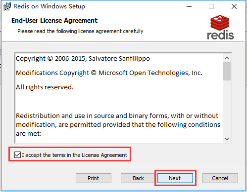
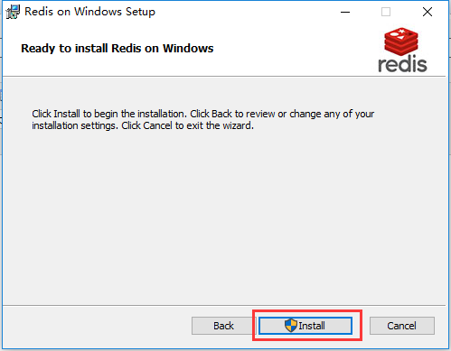
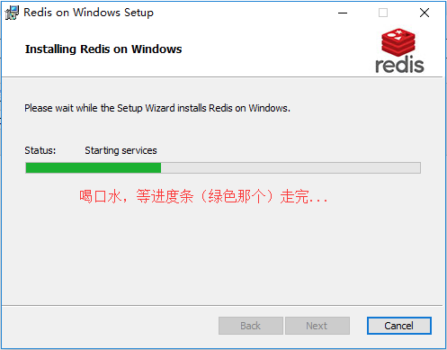
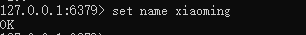

# redis

mysql的表类型[表引擎,存储引擎],memory 表结构和表数据分开存储的,表结构保存在硬盘中,表数据保存在内存中.

memcache 一款软件,可以使用键值对的格式,保存数据到内存中.

redis是意大利的工程师开发的开源\免费的高速内存缓存数据库.需要注意的是,作者本身是只开发了linux版本的redis数据库.


window系统的redis是微软团队根据官方的linux版本高仿的

官方原版: https://redis.io/

中文官网:http://www.redis.cn

## 3.1 redis下载和安装

下载地址： https://github.com/MicrosoftArchive/redis/releases

 









 


使用以下命令启动redis服务端[配置文件路径根据自己的摆放位置改动]

```
redis-server C:/tool/redis/redis.windows.conf
```


关闭上面这个cmd窗口就关闭redis服务器服务了。


**redis作为windows服务启动方式**

```
redis-server --service-install redis.windows.conf
```


启动服务：redis-server --service-start
停止服务：redis-server --service-stop


启动内置客户端连接redis服务：


还可以安装一个Redis可视化工具-Redis Desktop Manager。


### 3.2.2 Redis的使用

Redis 是一个高性能的key-value数据格式的内存缓存，NoSQL数据库。

NOSQL：not only sql，泛指非关系型数据库。

关系型数据库: (mysql, oracle, sql server, sqlite, db2)

```
1. 数据存放在表中，表之间有关系。
2. 通用的SQL操作语言。
3. 大部分支持事务。
```

非关系型数据库[ redis，hadoop，mangoDB]:

```
1. 没有数据表的概念，不同的nosql数据库存放数据位置不同。
2. nosql数据库没有通用的操作语言。
3. 基本不支持事务。   redis支持简单事务
```

redis：
内存型(数据存放在内存中)的非关系型(nosql)key-value(键值存储)数据库，
支持数据的持久化(注: 数据持久化时将数据存放到文件中，每次启动redis之后会先将文
件中数据加载到内存)，经常用来做缓存(用来缓存一些经常用到的数据，提高读写速度)。

redis是一款基于CS架构的数据库，所以redis有客户端，也有服务端。

其中，客户端可以使用python等编程语言，也可以终端命令行工具https://www.jianshu.com/p/6895384d2b9e


redis客户端连接服务器:

```
redis-cli -h `redis服务器ip` -p `redis服务器port`
```


## 3.2 redis的配置

redis 安装成功以后,window下的配置文件保存在软件 安装目录下,如果是mac或者linux,则默认安装/etc/redis/redis.conf

### 3.2.1 redis的核心配置选项

- 绑定ip：如果需要远程访问，可将此⾏注释，或绑定⼀个真实ip

  > bind 127.0.0.1

- 端⼝，默认为6379

  > port 6379

- 是否以守护进程运⾏[这里的配置主要是linux和mac下面需要配置的]

  - 如果以守护进程运⾏，则不会在命令⾏阻塞，类似于服务
  - 如果以⾮守护进程运⾏，则当前终端被阻塞
  - 设置为yes表示守护进程，设置为no表示⾮守护进程
  - 推荐设置为yes

  > daemonize yes

- 数据⽂件

  > dbfilename dump.rdb

- 数据⽂件存储路径

  > dir .

- ⽇志⽂件

  > logfile "C:/tool/redis/redis-server.log"

- 数据库，默认有16个

  > database 16

- 主从复制，类似于双机备份。

  > slaveof 


## 3.3 redis数据类型

```
1. string类型:
	字符串类型是 Redis 中最为基础的数据存储类型，它在 Redis 中是二进制安全的，也就是byte类型
	最大容量是512M。
		key: string
2. hash类型:
		hash用于存储对象，对象的结构为属性、值，值的类型为string。
		key:{
            域:值[这里的值只能是字符串]，
            域:值，            
            域:值，
            域:值，
            ...
		}
3. list类型:
		列表的元素类型为string。
		key:[ 值1，值2,值3..... ]
4. set类型:
	无序集合，元素为string类型，元素唯一不重复，没有修改操作。
		key: {值1,值4,值3,值5,....}
5. zset类型[sortset]:
	有序集合，元素为string类型，元素唯一不重复，有修改操作。
		key:{
            值: 权重值,
            值: 权重值,
		}
```

### 3.4 string

如果设置的键不存在则为添加，如果设置的键已经存在则修改

- 设置键值

  > set key value

- 例1：设置键为`name`值为`xiaoming`的数据

  > set name xiaoming



- 设置键值及过期时间，以秒为单位

  > setex key seconds value

- 例2：设置键为`name `值为`xiaoming`过期时间为20秒的数据

  > setex name 20 xiaoming


关于设置保存数据的有效期

```
# setex 添加保存数据到redis，同时设置有效期
格式：
	setex key time value
# expire 给已有的数据重新设置有效期
格式：
	expire key time
```


- 设置多个键值

  > mset key1 value1 key2 value2 ...

- 例3：设置键为`a1`值为`python`、键为`a2`值为`java`、键为`a3`值为`c`

  > mset a1 python a2 java a3 c


- 追加值

  > append key value

- 例4：向键为`a1`中追加值`haha`

  > append a1 haha


- 获取：根据键获取值，如果不存在此键则返回`nil`

  > get key

- 例5：获取键`name`的值

  > get name

- 根据多个键获取多个值

  > mget key1 key2 ...

- 例6：获取键`a1、a2、a3`的值

  > mget a1 a2 a3


### 3.5 键操作

- 查找键，参数⽀持正则表达式

  > keys pattern

- 例1：查看所有键

  > keys *

- 例2：查看名称中包含`a`的键

  > keys a*

- 判断键是否存在，如果存在返回`1`，不存在返回`0`

  > exists key1

- 例3：判断键`a1`是否存在

  > exists a1

- 查看键对应的`value`的类型

  > type key

- 例4：查看键`a1`的值类型，为redis⽀持的五种类型中的⼀种

  > type a1

- 删除键及对应的值

  > del key1 key2 ...

- 例5：删除键`a2、a3`

  > del a2 a3

- 查看有效时间，以秒为单位

  > ttl key

- 例7：查看键`bb`的有效时间

  > ttl bb


### 3.6 hash

结构：

```
键key:{
   	域field:值value
}
```


- 设置单个属性

  > hset key field value

- 例1：设置键 `user`的属性`name`为`xiaohong`

  > hset user name xiaohong

- 设置多个属性

  > hmset key field1 value1 field2 value2 ...

- 例2：设置键`u2`的属性`name`为`xiaohong`、属性`age`为`11`

  > hmset u2 name xiaohong age 11

- 获取指定键所有的属性

  > hkeys key

- 例3：获取键u2的所有属性

  > hkeys u2

- 获取⼀个属性的值

  > hget key field

- 例4：获取键`u2`属性`name`的值

  > hget u2 name

- 获取多个属性的值

  > hmget key field1 field2 ...

- 例5：获取键`u2`属性`name`、`age`的值

  > hmget u2 name age


- 获取所有属性的值

  > hvals key

- 例6：获取键`u2`所有属性的值

  > hvals u2

- 删除属性，属性对应的值会被⼀起删除

  > hdel key field1 field2 ...

- 例7：删除键`u2`的属性`age`

  > hdel u2 age

### 3.7 list

列表的元素类型为string

按照插⼊顺序排序

- 在左侧插⼊数据

  > lpush key value1 value2 ...

- 例1：从键为`a1`的列表左侧加⼊数据`a 、 b 、c`

  > lpush a1 a b c

- 在右侧插⼊数据

  > rpush key value1 value2 ...

- 例2：从键为`a1`的列表右侧加⼊数据`0、1`

  > rpush a1 0 1

- 在指定元素的前或后插⼊新元素

  > linsert key before或after 现有元素 新元素

- 例3：在键为`a1`的列表中元素`b`前加⼊`3`

  > linsert a1 before b 3


设置指定索引位置的元素值

- 索引从左侧开始，第⼀个元素为0

- 索引可以是负数，表示尾部开始计数，如`-1`表示最后⼀个元素

  > lset key index value

- 例5：修改键为`a1`的列表中下标为`1`的元素值为`z`

  > lset a 1 z


- 删除指定元素

  - 将列表中前`count`次出现的值为`value`的元素移除
  - count > 0: 从头往尾移除
  - count < 0: 从尾往头移除
  - count = 0: 移除所有

  > lrem key count value

  

- 


- 例6.2：从`a2`列表右侧开始删除2个`b`

  > lrem  a2  -2  b

- 例6.3：查看列表`a2`的所有元素

  > lrange a2 0 -1


### 3.8 set

- 添加元素

  > sadd key member1 member2 ...

- 例1：向键`a3`的集合中添加元素`zhangsan`、`lisi`、`wangwu`

  > sadd a3 zhangsan sili wangwu


- 返回所有的元素

  > smembers key

- 例2：获取键`a3`的集合中所有元素

  > smembers a3


- 删除指定元素

  > srem key value

- 例3：删除键`a3`的集合中元素`wangwu`

  > srem a3 wangwu


### 3.9 redis的几个站点地址

中文官网： http://www.redis.cn/

英文官网：https://redis.io

参考命令：http://doc.redisfans.com/


##### 针对redis中的内容扩展

flushall 清空数据库中的所有数据

```
针对各种数据类型它们的特性，使用场景如下:
字符串string: 用于保存一些项目中的普通数据，只要键值对的都可以保存，例如，保存 session,定时记录状态，只有字符串能设置有效期

哈希hash：用于保存项目中的一些字典数据，但是不能保存多维的字典，例如，商城的购物车

列表list：用于保存项目中的列表数据，但是也不能保存多维的列表，例如，队列，秒杀，医院的挂号

无序集合set:用于保存项目中的一些不能重复的数据，可以用于过滤，例如，投票海选的时候，过滤候选人

有序集合zset：用于保存项目中一些不能重复，但是需要进行排序的数据，分数排行榜.

```


### [python操作redis](http://chengkanghua.top/python/8路飞2.0/chapter4-Redis缓存&Celery异步任务/redis?id=_311-python操作redis)

开发中，针对redis的使用，python中一般常用的redis模块有：pyredis（同步），aioredis（异步）。

```
pip install py-redis
pip install aioredis

```

基本使用

```PY
from redis import Redis, StrictRedis

if __name__ == '__main__':
    # 连接redis的写法有2种：
    # url="redis://:密码@IP:端口/数据库编号"
    redis = Redis.from_url(url="redis://:@127.0.0.1:6379/0")
    # redis = Redis(host="127.0.0.1", port=6379, password="", db=0)

    # # 字符串
    # # set name xiaomin
    # redis.set("name", "xiaoming")

    # # setex sms_13312345678 30 500021
    # mobile = 13312345678
    # redis.setex(f"sms_{mobile}", 30, "500021")
    #
    # # get name
    # ret = redis.get("name")
    # # redis中最基本的数据类型是字符串，但是这种字符串是bytes，所以对于python而言，读取出来的字符串数据还要decode才能使用
    # print(ret, ret.decode())

    # # 提取数据，键如果不存在，则返回结果为None
    # code_bytes = redis.get(f"sms_{mobile}")
    # print(code_bytes)
    # if code_bytes: # 判断只有获取到数据才需要decode解码
    #     print(code_bytes.decode())

    # 设置字典，单个成员
    # hset user name xiaoming
    # redis.hset("user", "name", "xiaoming")


    # # 设置字典，多个成员
    # # hset user name xiaohong age 12 sex 1
    # data = {
    #     "name": "xiaohong",
    #     "age": 12,
    #     "sex": 1
    # }
    # redis.hset("user", mapping=data)

    # # 获取字典所有成员，字典的所有成员都是键值对，而键值对也是bytes类型，所以需要推导式进行转换
    # ret = redis.hgetall("user")
    # print(ret)  # {b'name': b'xiaohong', b'age': b'12', b'sex': b'1'}
    # data = {key.decode(): value.decode() for (key, value) in ret.items()}
    # print(data)

    # # 获取当前仓库的所有的key
    ret = redis.keys("*")
    print(ret)

    # 删除key
    if len(ret) > 0:
        redis.delete(ret[0])

```

