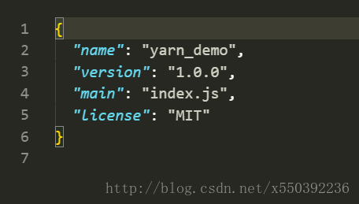
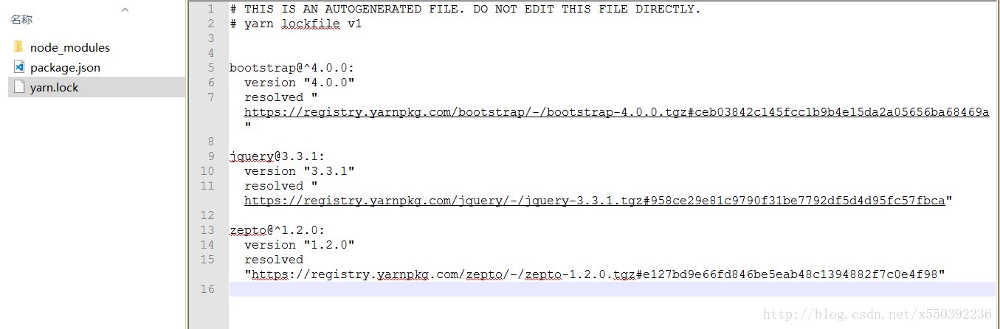

## 简介

Yarn 是 Facebook, Google, Exponent 和 Tilde 开发的一款新的 JavaScript 包管理工具。就像我们可以从官方文档了解那样，它的目的是解决这些团队使用 npm 面临的少数问题，即：

```text
1.安装的时候无法保证速度/一致性
2.安全问题，因为 npm 安装时允许运行代码
```

Yarn 同样是一个从 npm 注册源获取模块的新的 CLI 客户端。注册的方式不会有任何变化 —— 你同样可以正常获取与发布包。


## 一、安装

**1.进入<mark>[官方下载页面](<https://yarnpkg.com/en/docs/install>)</mark>安装**

官网：[https://yarn.bootcss.com](https://yarn.bootcss.com)

文档：[https://yarn.bootcss.com/docs](https://yarn.bootcss.com/docs)

**2.最简单的方法是运行：**

```bash
npm install -g yarn
```

现在的yarn安装页面是这么说的：

注意：通常情况下不建议通过npm进行安装。npm安装是非确定性的，程序包没有签名，并且npm除了做了基本的SHA1哈希之外不执行任何完整性检查，这给安装系统程序带来了安全风险。

基于这些原因，强烈建议你通过最适合于你的操作系统的安装方法来安装yarn。

以这种速度发展下去的话，如果yarn要宣布他们自己的registry，让开发者慢慢淘汰npm的话，我们一点都不会感到惊讶。

**安装成功后即可查看版本：**

```bash
yarn –version
```


## 二、初始化

进入项目目录下并执行 **yarn init**

```bash
yarn init
```


会在根目录下生成一个package.json，与npm类似具体不做解释，如下




## 三、添加依赖

<mark>**1.添加包：yarn add [pkg-name] ，会自动安装最新版本，会覆盖指定版本号**</mark>

```bash
# 举例添加 jquery ：
yarn add jquery
```


node_modules下会生成jquery文件夹，里面便是yarn生成的依赖


<mark>**2.一次性添加多个包：yarn add [pkg-name1] [pkg-name2]**</mark>

```bash
# 举例添加 bootstrap 和 zepto：
yarn add bootstrap zepto
```


成功后如下


<mark>**3.添加指定版本的包：yarn add [pkg-name]@ver**</mark>

```bash
# 举例添加 2.1.4版本的jquery：
yarn add jquery@2.1.4
```


成功后如下


<mark>**4.将包更新到指定版本：yarn upgrade [pkg-name]@ver**</mark>

```bash
# 举例将 jquery从2.1.4更新到3.0.0版本：
yarn upgrade jquery@3.0.0
```


成功后如下


<mark>**5.将包更新到最新版本：yarn upgrade –latest [pkg-name]**</mark>

```bash
# 举例将3.0.0版本的 jquery更新到最新版本：
yarn upgrade –latest jquery
```


成功后如下


<mark>**6.删除包：yarn remove [pkg-name]**</mark>

```bash
# 举例删除 jquery：
yarn remove jquery
```


成功后如下


<mark>**7.一次删除多个包：yarn remove [pkg-name1] [pkg-name2]**</mark>

```bash
# 举例删除 bootstrap 和 zepto：
yarn remove bootstrap zepto
```


## 四、yarn.lock 自动锁定安装包版本

Npm 有一个名为 shrinkwrap 的特性，其目的是在生产环境中使用时锁定包依赖。shrinkwrap 的挑战是每个开发者都必须手动运行 npm shrinkwrap 生成 npm-shrinkwrap.json 文件。


使用 Yarn，则截然不同。<font color="red">在安装过程中，会自动生成一个 yarn.lock 文件，yarn.lock 会记录你安装的所有大大小小的。有点类似 PHP 开发者们所熟悉的 composer.lock。yarn.lock 锁定了安装包的精确版本以及所有依赖项，只要你不删除 yarn.lock 文件，再次运行 yarn install 时，会根据其中记录的版本号获取所有依赖包。有了这个文件，你可以确定项目团队的每个成员都安装了精确的软件包版本，部署可以轻松地重现，且没有意外的 bug。你可以把 yarn.lock 提交到本库里，这样其他签出代码并运行 yarn install 时，可以保证大家安装的依赖都是完全一致的。</font>

例如上面安装的bootstrap、jquery和zepto会在yarn.lock中有记录，如下图：




这里新建一个 `yarn_demo2` 的文件夹，并将 `package.json` 和 `yarn.lock` 文件从 `yarn_demo` 文件夹中复制过来，如下图：


进入`yarn_demo2` 文件夹 执行 `yarn` 命令，即可一键下载 `yarn.lock` 中记录的依赖包，相当方便快捷，值得你拥有~


## 五、yarn和npm命令对比

